# KEEL — Agent Reliability Lab: Architecture & Design Document

**Keel** is a single-node, event-sourced, agent-native durable execution runtime (Python + PostgreSQL).
**Crashproof** is its fault-injection and conformance benchmark, run against Keel and other durable-execution
runtimes under identical workloads and faults.

| | |
|---|---|
| Version | 1.0 — blueprint for implementation with Claude Code |
| Date | 2026-09-08 |
| Author | Keshav Kakani, with Claude (Fable 5.1) |
| Length | 132,912 words, 34 sections + 2 appendices |
| How it was made | Core decisions were fixed in a design constitution, attacked by five adversarial reviewers (41 major findings, each judged by three refuters), revised, then each section was drafted, reviewed from two lenses, revised, and checked for cross-section consistency. Framework facts were web-verified on 2026-09-08. |
| Binding order | Appendix A (constitution) governs every section. Where a section and the constitution disagree, the constitution wins. |

## Contents

- [1. Executive thesis](#1-executive-thesis)
- [2. Why this architecture](#2-why-this-architecture)
- [3. System overview diagram](#3-system-overview-diagram)
- [4. Component architecture](#4-component-architecture)
- [5. Data model](#5-data-model)
- [6. Event model](#6-event-model)
- [7. State machines](#7-state-machines)
- [8. Failure semantics](#8-failure-semantics)
- [9. Tool / side-effect model](#9-tool-side-effect-model)
- [10. Replay design](#10-replay-design)
- [11. Chaos / fault-injection engine (Crashproof)](#11-chaos-fault-injection-engine-crashproof)
- [12. Property-based testing](#12-property-based-testing)
- [13. Differential testing](#13-differential-testing)
- [14. Benchmark design](#14-benchmark-design)
- [15. Statistical methodology](#15-statistical-methodology)
- [16. Agent-native semantics](#16-agent-native-semantics)
- [17. Multi-agent architecture](#17-multi-agent-architecture)
- [18. Long-horizon execution](#18-long-horizon-execution)
- [19. Observability](#19-observability)
- [20. Security boundary](#20-security-boundary)
- [21. Performance](#21-performance)
- [22. Technology choices](#22-technology-choices)
- [23. Repository structure](#23-repository-structure)
- [24. APIs](#24-apis)
- [25. CLI](#25-cli)
- [26. Minimal demo UI](#26-minimal-demo-ui)
- [27. MVP / V1 / V2 / Future](#27-mvp-v1-v2-future)
- [28. 7-day build plan](#28-7-day-build-plan)
- [29. 30-day expansion](#29-30-day-expansion)
- [30. Kill criteria](#30-kill-criteria)
- [31. Success criteria](#31-success-criteria)
- [32. Final architecture](#32-final-architecture)
- [33. Teaching map](#33-teaching-map)
- [34. Do-not-build list](#34-do-not-build-list)
- [Appendix A. Design constitution (frozen v1)](#appendix-a-design-constitution-frozen-v1)
- [Appendix B. Verified framework fact sheet](#appendix-b-verified-framework-fact-sheet)

---

## 1. Executive thesis

### 1.1 Thesis

Framework checkpoints are snapshots; durable execution means someone notices the crash, resumes, and neither double-fires nor loses an effect. An agent that cannot survive `kill -9` is a demo.

**Keel** is a single-node, event-sourced, agent-native durable execution runtime (Python 3.12+, PostgreSQL 16). **Crashproof** is the fault-injection and conformance harness that runs Keel and other runtimes — LangGraph, DBOS, Temporal, Restate, Hatchet, Inngest, Julep reported as "Temporal-via-Julep" — through the same canonical workloads under the same faults and publishes a matrix: Jepsen-lite for agent runtimes. Crashproof is the signature public artifact; Keel is the reference implementation that must pass it.

The project exists because First Impression (ReAct, LangGraph, RAG, guardrails, MCP, Langfuse, SSE) and Wright-Index (tree-sitter code intelligence, MCP, Claude Code) already prove Keshav can build agents. They prove nothing about what those agents do when the process dies between a tool's side effect and its acknowledgement, when the provider fails on the third call, when an approval takes three days, or when a deploy changes the program under a run in flight. Keel is not another agent. It demonstrates how autonomous agents remain correct, recoverable, debuggable and economically sane when execution fails — and Crashproof measures whether they do. It teaches durable execution, event sourcing, failure semantics and chaos/property/differential testing — not agents-101: the syllabus is leases and fences, write-ahead barriers, effect classes, replay determinism, fault schedules and paired statistics, each mapped to where it appears in §33.

Positioning: the altitude BELOW Temporal/DBOS/Restate. Those are general workflow engines. Keel is the agent-native journal: model calls are the decisions, tool effects are the risk. It is not a Temporal clone (§34), and it never claims exactly-once except for the TRANSACTIONAL effect class (§8, §9).

### 1.2 The mechanism in one paragraph

An agent program is an ordinary `async def prog(ctx, args)`. Every nondeterministic or side-effecting act — `ctx.model()`, `ctx.tool()`, `ctx.approve()`, `ctx.delegate()`, `ctx.delegate_many()`, `ctx.sleep()`, `ctx.now()`, `ctx.random()`, `ctx.compact()`, `ctx.plan.*`, `ctx.signal.wait()`, `ctx.patched()` (v1) — is a Step with a runtime-owned, never-reset step index, and at most one step is in flight per run (`ConcurrentStepError` otherwise; parallelism is `ctx.delegate_many` to child runs). Before a step runs, its intent (kind, name, canonical-args hash, effect key) is appended to the per-run, append-only `events` journal in Postgres; before an effect begins, that attempt's `STEP_ATTEMPT_STARTED` is durably committed (the write-ahead rule); after it returns, the outcome is committed. The first statement of every append transaction is the lease fence — `UPDATE runs SET lease_expires_at = now() + $ttl WHERE run_id = $1 AND lease_epoch = $2` — so a worker that has lost its lease cannot commit another event or TRANSACTIONAL effect for that run. It can still fire an EXTERNAL effect whose `STEP_ATTEMPT_STARTED` it already committed: that zombie window is bounded — `lease_valid_until − now ≥ tool.timeout` is required before any non-PURE dispatch, and the reaper marks a run with an open non-PURE attempt `ORPHANED` only when `now() > max(lease_expires_at, attempt_deadline)` — never eliminated, and is measured as the `pause_past_ttl` fault (§8, §11). Recovery is not a special path: on every lease acquisition (start, wake from any `WAITING_*`, `ORPHANED` re-claim, manual `keel resume`, deploy shadow-verify) the worker re-executes the program from the start of the latest continuation segment; every `ctx.*` call with a journaled outcome returns that outcome instantly — no tokens, no effect — and the first step without one becomes live. Because model outputs are recorded decisions, control flow is deterministic under replay by construction. What the journal cannot tell — `STARTED` present, no outcome, effect class `EXTERNAL` — is not guessed: the step becomes `AMBIGUOUS` and is resolved by the tool's declared resolution or escalated to a human. All visible state (run status, steps, effects, budget, plan, approvals, context) is a projection: a pure fold over events, rebuildable, never edited.

```text
                                      lease_epoch = e            (fence = heartbeat = same UPDATE)
  prog(ctx) ──ctx.tool("create_issue")──▶ step_index i
        │
        ├── journaled outcome for i?  ──yes──▶ return recorded result (0 tokens, 0 effects) ──▶ next ctx.* call
        │
        no
        ▼
  TX1: fence ▸ STEP_INTENDED{i, effect_key, effect_class} ▸ effects row ▸ STEP_ATTEMPT_STARTED{i,1,attempt_deadline} ▸ COMMIT
        │                                                    ▲
        ▼                                                    │  write-ahead: nothing leaves the
  execute effect                                             │  process before this commit
     IDEMPOTENT: Idempotency-Key = effect_key (receiver dedups ⇒ effectively-once)
     EXTERNAL:   no key honoured; STARTED-without-outcome ⇒ AMBIGUOUS ⇒ probe | escalate
        │
        ▼
  TX2: fence ▸ STEP_COMPLETED{i,1,result} ▸ effects.status=COMMITTED ▸ COMMIT ──▶ return result to prog
        │
  kill -9 anywhere ▸ reaper: lease expired [AND now() > attempt_deadline while a non-PURE attempt is open] ▸ ORPHANED
        ▸ new holder (epoch e+1) ▸ RECOVERY_STARTED ▸ re-execute ▸ journal-state table decides step i (§8)
```

### 1.3 What is measured

**Under which faults.** Crashproof injects at declared boundaries, never at random code lines; the fault vocabulary and the boundary names are fixed in §11. Every fault the brief names maps to one of them:

| Brief fault | Fault type | Boundary |
|---|---|---|
| Process kill, SIGTERM, restart; crash before commit; crash after effect before ack | `kill`, `sigterm_grace_ok`, `sigterm_grace_too_short`; supervisor restart with identical argv, never a run id | shim `before:tool_call`, `after:tool_effect` (effect landed, return value not yet received), `after:tool_return` (returned, outcome not yet committed) |
| Worker pause past lease TTL (zombie) | `pause_past_ttl` | shim `before:tool_call` |
| Model timeout, provider outage, partial/truncated stream, different answer on re-ask | `model_timeout`, `model_500`, `provider_outage`, `model_stream_truncate`, `model_reask_alternate` (v1) | shim `before:model_call`, `after:model_return`, `during:model_stream(chunk=k)` |
| Tool 500, timeout, delayed, duplicate, malformed, dropped response | `tool_500`, `tool_timeout`, `tool_delay`, `tool_duplicate_response`, `tool_malformed`, `tool_dropped_response` | shim `before:tool_call` (rejected before any effect) and `after:tool_effect` (applied, then the response is delayed, dropped, duplicated or faulted; a timeout here is `AMBIGUOUS`, not `FAILED`, for EXTERNAL); World `hold(endpoint, ms)` aims a kill into the same window |
| Network failure | `partition_worker_world`, `partition_worker_postgres` | `proxy` drops the worker↔World connection (v1); the supervisor freezes the dependency (`SIGSTOP` on its PID / `docker pause`) for `duration_ms`, realized as a **dependency outage** whose cell measures the post-heal race, never an asymmetric partition (§11.5) |
| Journal / storage failure | `journal_unavailable`, `blob_write_fail` | hook `before:intent_commit`, `before:attempt_commit`, `before:outcome_commit` — Keel conformance cells only (v1) |
| Crash during approval, during delegation | `approval_delay`, `approval_expiry`, `kill` | hook `during:approval_wait`, `during:child_wait` (v1) |
| Deployment / version change mid-run | `version_change_mid_run` | supervisor restarts with a new `program_version` (v1) |

MVP matrix v0 runs `kill` at T1 `before:tool_call`, T2 `after:tool_effect`, T3 `after:tool_return` plus `pause_past_ttl` at T1, all in `shim` mode; the remaining rows land in v1 with the full fault list and the `proxy` and `hook` injectors (§27).

**What is checked.** Every quantity the brief asks for maps to a verifier invariant or an economy metric (full definitions §12.4; metrics and statistics §14.3, §15). Safety invariants are PASS (0 violations in n) or FAIL with counterexamples `(spec_hash, seed, trial_id)` — never a proportion. An invariant whose inputs a runtime cannot supply is N/A, never PASS.

| Brief quantity | Crashproof measurement | Ground truth |
|---|---|---|
| Duplicate effects | S1 (World-applied count ≤ 1 under an effectively-once claim; ≤ 1 receipt under at-most-once); raw `duplicate_effects` always published | World log + adapter `claims` |
| Lost effects, lost work | S2 (every SUT-COMMITTED effect exists in the World), S3 (COMPLETED ⇒ all required effects exist) | World oracle |
| Inconsistent state | C3 (SUT committed set == World applied set, modulo surfaced RESOLVED_UNKNOWN), S5 (completed steps never regress), S10 (no receipt while journal was failing at STARTED) | World log, Keel journal |
| Replay divergence | C1 (VERIFY reproduces the step sequence and terminal projection hash), `PromptDrift` reports, `model_reask_alternate` cell | Keel journal, scripted provider |
| Cancelled / approved / child correctness | S6, S7, S8 | World log + journal |
| Failed runs, recovery success rate | L1 (terminal or legitimate waiting state within `T_recover`), L2 (≤ `max_recoveries`), L3 (no silent ambiguity) | fault log + canonical result |
| Unnecessary model calls, token waste | extra model calls after recovery, extra tokens, `budget_overshoot` (S9 for Keel: journaled charge is an upper bound on billed tokens) | proxy/scripted usage count |
| Recovery latency | fault → `RECOVERY_COMPLETED` or first live step; `recovery_mechanism` column (engine, self, harness) | fault log, `recoveries` table |
| Journal growth, checkpoint overhead | journal bytes, replay cost, wall-clock overhead vs no-fault baseline | SUT export |

The headline finding is expected to be structural, not numeric: which runtimes have `recovery_mechanism = harness` (nobody notices the crash; the supervisor must re-invoke by id), which are `self`, which are `engine` — and, per effect class, which claims survive `pause_past_ttl`.

### 1.4 What is NOT being built

Short form; the binding list is §34. No Temporal clone or workflow DSL; no queue beyond Postgres `SELECT … FOR UPDATE SKIP LOCKED`; no Kubernetes, multi-region, multi-tenancy, auth or RBAC; no saga/compensation engine (only the manual `compensate` hook); no dashboard beyond one static timeline page; no A2A or swarm; no generic event-sourcing framework; no RAG, memory or prompt-template features; no full sandbox (protocol plus per-epoch workspace only); no Kafka, Redis or NATS; no web approval app; no MCP server (only a thin bridge mapping MCP tools onto effect classes); no parallel step groups; no automatic lineage forks; no projection checkpoints before replay time is measured.

### 1.5 Philosophy

The document — and the code Claude Code produces from it — is judged on technical depth, correctness, reproducibility, interesting empirical results, real agent relevance, future reuse, and OSS contribution potential (upstream issue reports with repro scripts are a v2 deliverable). It is not judged on lines of code, technology count, UI polish, enterprise claims, or beating Temporal or E2B commercially. The test of every section is whether a senior AI-infra engineer reads it and says "this person actually understands the systems problem". Concretely: every guarantee is stated as at-most-once, at-least-once, effectively-once, ambiguous, or (TRANSACTIONAL only) exactly-once, with its assumptions; every residual window (zombie, LOCAL_FS reordering, EXTERNAL timeout) is named, bounded and measured as a benchmark fault; every result carries `(spec_hash, seed)` so anyone can re-run it.

## 2. Why this architecture

### 2.1 The design emerges from agent failure modes, not from workflow theory

A generic workflow engine models a process whose steps are known when the program is written. An agent's steps are chosen at runtime by a model: which tools fire, in what order, how many times, and whether an approval is needed are outputs of a nondeterministic, expensive, billed-per-attempt call. That fact forces every load-bearing decision below.

| Agent failure mode | What it forces | Mechanism (see §) |
|---|---|---|
| The model's output IS the control flow, and model output is high-variance across turns (unreliability +112%, 39% average drop, "LLMs Get Lost in Multi-Turn Conversation", ICLR 2026 oral), so a decision re-derived after a crash is a different decision | Model outputs must be recorded decisions, never re-derived during recovery | MODEL steps journaled with full response; RECOVER never re-invokes a memoized model call; replay cache never consulted in RECOVER (§10, §16) |
| A prompt edit while a run is parked on a 3-day approval must not strand it | Step identity for MODEL steps cannot include the request | Per-kind intent identity: MODEL = (kind, name); `PromptDrift` is a warning class distinct from `NondeterminismDetected` (§10) |
| The effect set is not known ahead of time; the model decides to `send_email` at step 17 | Effect semantics must be declared per tool, not per workflow | Effect classes PURE, IDEMPOTENT, EXTERNAL, TRANSACTIONAL, exactly one per tool; the class alone decides retry, replay and recovery (§9) |
| Crash between effect and acknowledgement | The runtime must know whether the effect provably never began | Write-ahead `STEP_ATTEMPT_STARTED` barrier; journal-state recovery table; `AMBIGUOUS` with declared resolution `probe`, `assume_failed`, `assume_succeeded`, `escalate` (§8, §9) |
| Retrying a create is a duplicate; a stable key is the only receiver-side defence | A key that survives crash, retry and recovery but differs per counterfactual | `effect_key = sha256(run_root_id ‖ step_index ‖ tool_name ‖ canonical_args)[:32]`; `effects` registry with unique-violation on repeat (§5, §9) |
| A paused or partitioned worker wakes up and fires an effect after its lease expired | Fencing plus a bound on how late an effect can land | Fence-equals-heartbeat UPDATE; `lease_valid_until − now ≥ tool.timeout` before dispatch; reaper predicate `now() > max(lease_expires_at, attempt_deadline)`; `pause_past_ttl` benchmark fault (§8, §11) |
| Approvals take days; children take hours; sleeps take weeks | Waiting must cost zero compute and survive any number of restarts | Waiting = no lease; `signals` inbox as the only external path; inert-annotation rule (§7, §16) |
| Every attempt costs money even when it produces no outcome | Budgets must charge before the outcome exists | Reserve-then-settle per attempt; crashed model attempts stay charged (§16) |
| Runs outlive deployments | Program version must be checked against the journal before going live | `program_version` on every INTENT; shadow VERIFY on resume under a new version; `ctx.patched` gates (v1) (§10, §18) |
| Runs outlive the context window | Recovery cost must be bounded and the plan must not be compacted away | Continuation segments; `ctx.compact()` as a MODEL step; durable plan via `PLAN_UPDATED` (§18) |
| Orchestrators spawn workers that can outlive, out-spend or ignore them | Ownership, budget and cancellation must be contracts, not conventions | Delegation record; single writer per child journal; cancel propagation; lease takeover as the only forced path (§17) |
| Nobody can tell a duplicate from a retry after the fact | Ground truth must live outside the SUT | World with oracle query API and per-endpoint `dedup: true or false` (§11) |

Two mechanisms carry most of the weight; every alternative in §2.2 lacks at least one. First, the ambiguity window and the fence, drawn for the MVP workload's EXTERNAL variant of `create_issue`:

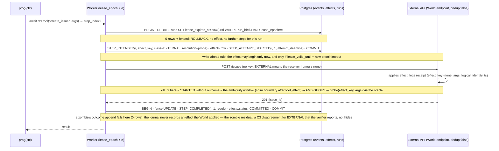

The IDEMPOTENT variant of the same workload differs in one line: `class=IDEMPOTENT`, the POST carries `Idempotency-Key: effect_key` to the World's `dedup:true` endpoint, and STARTED-without-outcome is a re-run with the same key (effectively-once, assuming the receiver honours it) instead of AMBIGUOUS.

Second, what recovery does with what the journal says — and only with what the journal says; the worker never knows where it died:

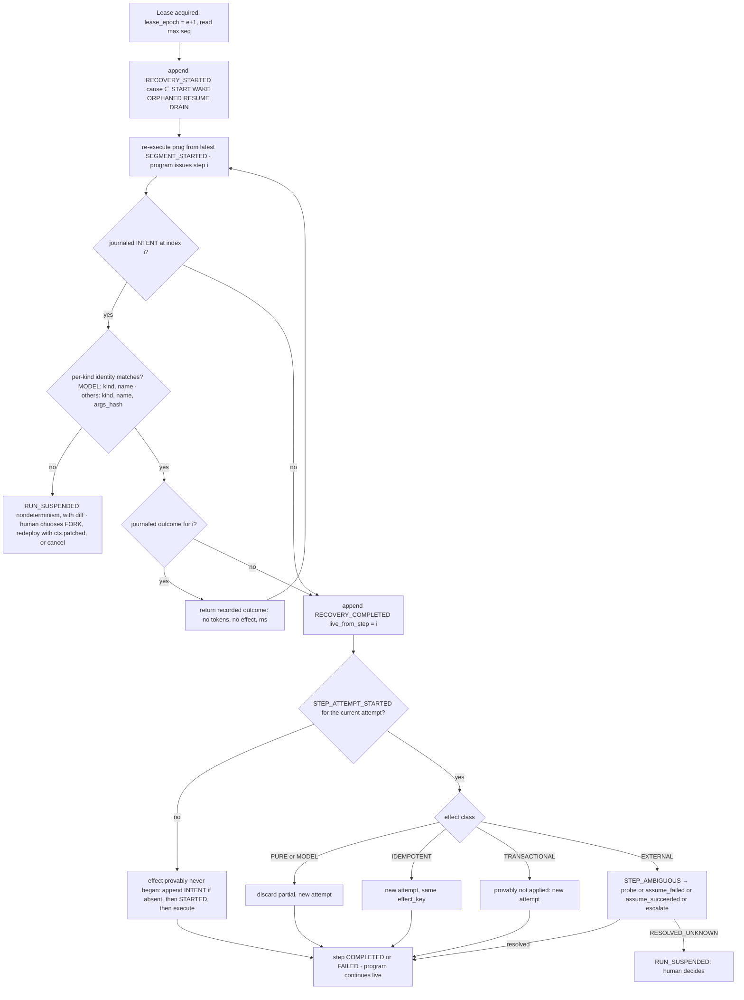

The tree is small because the classes are mutually exclusive and the ambiguity window is exactly execute → outcome-commit — precision a generic engine cannot offer without knowing the tool, and a checkpointer cannot offer at all.

### 2.2 Alternatives rejected

**Explicit-state-machine-only runtime (Julep 2-style YAML tasks, or a hand-authored graph DSL).** A state machine authored ahead of time cannot enumerate the branches a model will take; in practice it collapses into one state named `AGENT_LOOP` inside which every interesting transition — which tool, which args, whether to stop — is invisible to the runtime. Keel keeps the state machines (run, step, effect, approval, child, replay, recovery lifecycles in §7) but as PROJECTIONS folded from the journal, and lets the program be arbitrary `async` Python. The DSL is not needed because the journal, not the program text, is what is inspected and replayed (§10).

**Checkpoint the Python frame (or the process, or the sandbox).** Serialising the coroutine frame after each step is the most literal "resume where you left off", and Crab (arXiv 2604.28138) shows it works at the OS/sandbox layer on Terminal-Bench. It fails Keel's requirements on three counts: a frame is not durable across code versions (a deploy invalidates it), not inspectable (there is no timeline to show or diff), and not counterfactual-replayable (you cannot fork step 12 with a different tool result). Crab is complementary: it operates at the sandbox layer that the `LOCAL_FS` modifier delegates to through the `Sandbox` protocol (`exec`, `snapshot`, `restore`), whose v1 implementation is a per-epoch workspace checkout with git-based snapshot/restore; Crab is a possible future implementation behind the same protocol and is cited as such, not as a competitor.

**LangGraph-style checkpointer.** The full graph state is serialised after each superstep, keyed by `thread_id + checkpoint_id`, with durability modes `exit`, `async` (documented "small risk" of not writing the checkpoint on crash) and `sync`. The documented resume rule is "Resume re-runs the node; it does not continue from the next line of source": a tool call inside the killed node re-fires unless wrapped in `@task`. There is no supervisor, no watchdog, no heartbeat ("If your process crashes, no one knows." — Diagrid, 25 Feb 2026), no lease, and nothing prevents two processes resuming the same thread; there is no documented idempotency-key primitive. This is a snapshot, and the snapshot-vs-journal difference is what Crashproof measures: LangGraph runs in all three durability modes with `recovery_mechanism = harness`; expected S1 duplicates for un-wrapped tool calls are a result, not an insult. It is the runtime Keshav already knows, which is why it is the MVP comparison arm.

**Adopt Temporal, DBOS or Restate directly.** Keel borrows their core mechanism openly ("Temporal/DBOS/Restate/Inngest-style step memoization, specialised for agents"). They are rejected as the implementation for four reasons. (1) None has effect classes. DBOS: "Steps are tried at least once but are never re-executed after they complete… Steps should be idempotent"; Temporal: activities are at-least-once and "Temporal recommends that Activities be idempotent"; Restate documents no behaviour for a death between `ctx.run` action and journal write and answers with `ctx.uuid()` keys. All three push the ambiguity to the developer; Keel makes the class and its resolution a declaration on the tool and `AMBIGUOUS` a step state a verifier can check (L3). (2) None distinguishes a model call from a tool call. The per-kind identity rule, `PromptDrift`, reserve-then-settle budgets and the `model_reask_alternate` fault only make sense when the runtime knows that some steps are decisions and others are effects. (3) None exposes `before:outcome_commit` as a supported boundary — Temporal and Restate own the write path in a server, DBOS only by patching its internals — so the `hook` injection mode and the MemoryJournal + fake-clock property suite (§12) require owning the journal write path. (4) The learning objective is to build the lease, the fence, the journal and the recovery table, not to configure them. Honest framing: Keel is DBOS-shaped (library + Postgres, `recovery_mechanism = self`) plus a reaper, agent-native effect semantics and a harness; DBOS's `workflow_id:step_id` and Temporal's `run_id:activity_id` are the F1 fairness keys because they are the same idea as `effect_key`. Restate (journal-before-effect, suspend-on-wait) is the strongest baseline in every cell it enters (from v1, via the Pydantic AI workload).

**ActiveGraph-style event-sourced graph without recovery semantics.** ActiveGraph (Nakajima, arXiv 2605.21997) has the same spine as Keel: append-only event log as source of truth, working graph as a deterministic projection, byte-reproducible replay with a content-addressed cache, fork at any event without re-executing the shared prefix. Keel's `FORK{fork_of: (base_run_id, fork_seq), overrides}` is essentially ActiveGraph's fork, and the doc says so. What ActiveGraph lacks is everything that happens when the process dies: no leases or fencing, no effect classes, no ambiguity resolution, no approvals that release compute, no reaper, and no benchmark. An event log without a write-ahead effect barrier records what the agent decided but cannot say whether the world was changed. Keel is the crash-recovery layer added to that spine, and Crashproof is the evidence that the layer is needed.

| Alternative | Keeps from it | Where it breaks for agents | Mechanism it lacks |
|---|---|---|---|
| State-machine-only runtime | Explicit lifecycles as projections (§7) | Model chooses transitions at runtime; DSL collapses to one opaque state | Journal of decisions; arbitrary control flow |
| Checkpoint the frame / sandbox | The `Sandbox` protocol boundary (`exec`, `snapshot`, `restore`) that `LOCAL_FS` delegates to | Not durable across versions, not inspectable, not forkable | Step identity, `VERIFY`, `FORK` |
| LangGraph checkpointer | `interrupt()` releases the worker (Keel: waiting = no lease) | Node re-runs from its first line; async mode may lose the checkpoint; no lease, no key | Supervisor, fence, write-ahead barrier, effect key |
| Temporal / DBOS / Restate | Step memoization; stable step ids as F1 keys; Restate's journal-before-effect | Effect class is the developer's problem; model and tool steps are the same thing | Effect classes, `AMBIGUOUS`, `PromptDrift`, white-box hooks |
| ActiveGraph | Log as truth, projections, fork at any event | Nothing observes a crash; nothing says whether an effect landed | Lease + fence, STARTED barrier, effect registry, benchmark |

### 2.3 Additional concepts beyond the syllabus

Every concept the design adds to the brief's syllabus, with the failure that appears without it, its stage (§27), and what building it teaches. Stage tags: MVP = days 1–3, v1 = days 4–14, v2 = weeks 3–4+, Future = after measurement.

| Concept | Why the project needs it | What breaks without it | Stage | What Keshav learns |
|---|---|---|---|---|
| Leases + fencing tokens, fence = heartbeat | Single writer per run must survive a worker that stops, pauses and resumes; heartbeat and fence are one row-locking UPDATE on `runs.lease_epoch` | Two workers append to one run; a zombie writes an outcome after its successor; a "live" worker is not actually the writer | MVP | Why an expiring lock without a fence is a bug; READ COMMITTED row-lock serialisation as the whole concurrency story |
| Signals inbox + inert-annotation rule | External actors (approve, cancel, rebind, child results, timers) need an at-least-once path that never writes another run's journal | Foreign appends break the single writer; a signal that changes control flow by itself makes replay nondeterministic | v1 (§27): `signals` inbox, approvals, cancel, `SIGNAL_IGNORED`. MVP has no inbox: `keel resume` re-arms `runnable_at` through the control-plane conditional UPDATE and NOTIFYs workers (section-local decision) | Inbox pattern; why "the program observes the signal only through its own step" is what makes cancellation replayable |
| Deterministic re-execution / step memoization | Recovery, wake, resume, verify and shadow-check are one code path | A special recovery path that is tested less than the happy path; model calls re-fired after a crash | MVP | The Temporal/DBOS/Restate core mechanism from the inside; why "recovery is not a special path" is the design's strongest property |
| Per-kind intent identity | A parked run must survive a prompt edit; a genuine divergence must still be caught | Either every prompt tweak suspends runs, or control-flow divergence goes unnoticed | MVP | Separating "what the step is" from "what the step was asked" — identity vs diagnostics |
| Sequential-step rule (`ConcurrentStepError`) | INTENT seq order == step-index order; at most one step open at a crash | Recovery must reason about N open steps; step indices become a partial order; ambiguity resolution multiplies | MVP | Why constraining the programming model buys a provable recovery table; `asyncio.gather` over `ctx.*` is a program bug, not a fault |
| Workflow-vs-activity separation | Program code must be deterministic under replay; everything nondeterministic lives behind `ctx` | Time/random/env read outside `ctx` diverges on replay and trips `NondeterminismDetected` for no reason | MVP | The Temporal determinism contract, expressed as a `ctx` boundary rather than a sandbox |
| Write-ahead `STEP_ATTEMPT_STARTED` barrier | "Effect provably never began" is only knowable if STARTED precedes every effect | An effect with no journal record; S4 and S10 unverifiable; recovery must guess | MVP | WAL discipline applied to side effects, not pages; why attempt 1's STARTED may share INTENT's transaction but attempt n's may not |
| Journal-state recovery table | Recovery must decide from journal state only — the worker never knows where it died | Ad-hoc `if crashed_during_x` logic assuming knowledge the process cannot have | MVP | Decisions as a function of persisted facts; the ambiguity window as an exact interval |
| Transactional outbox discipline | `effects` rows, `signals.consumed_seq` and events must commit together or not at all | Effect registered but intent not journaled (or vice versa); a signal consumed twice | MVP | Outbox inside one database; why a second system (a bus) is what makes outboxes hard |
| Effect classes + modifiers + ambiguity resolution | The class alone decides retry, replay and recovery; modifiers (`STREAMS`, `LOCAL_FS`) compose without changing the class | Every tool gets the same retry policy; `send_email` is retried like `read_file`; `AMBIGUOUS` has no owner | MVP (PURE, IDEMPOTENT, EXTERNAL, probe/escalate); v1 (TRANSACTIONAL, STREAMS, LOCAL_FS per-epoch workspace) | At-most-once vs at-least-once vs effectively-once as declarations, not hopes; timeouts on EXTERNAL produce `AMBIGUOUS`, not `FAILED` |
| Effect keys | Receiver-side dedup is the only defence a fence cannot give; keys must be stable across attempts and recoveries, unique per logical effect, different per fork | Duplicate creates on retry; the same key reused for a different effect; forks colliding with their base run | MVP | Idempotency-key design: what goes into the hash (`run_root_id`, `step_index`, tool, canonical args), what never does (credentials) |
| Zombie rule + attempt deadlines | A worker past its TTL can still fire a STARTED effect; the window must be bounded and measured | Successor starts while the zombie is mid-effect; S6/C3 violated silently; benchmark cannot express it | MVP (`pause_past_ttl` cell) | The difference between fencing the journal and fencing the world; TOCTOU limits of `probe` |
| Nondeterminism detection + `PromptDrift` | Code changes and program bugs must surface as `SUSPENDED` with a diff, never as silent divergence | Replay executes a different program against an old journal; effects fire under wrong indices | MVP (detection); v1 (`VERIFY`, `PromptDrift` policy, `ctx.patched`) | Versioning in-flight runs; why there is no automatic fork |
| Projections + upcasters | All visible state is a fold; events are never rewritten; schema evolves by pure upcasting at load | State and journal disagree; a projection bug requires editing history; old runs unreadable after a schema change | MVP (projections, `schema_version`); v2 (real v1→v2 upcaster + C4) | Event sourcing's central discipline; C4 as a machine-checked round-trip |
| Continuation segments | Replay cost must be bounded for hour/day runs; `Continue(state)` with a program-declared Pydantic model | Recovery replays thousands of steps; a state-blob schema change silently corrupts | v1 | Continue-as-new; state compatibility as the same contract as event compatibility |
| Reserve-then-settle budgets | Crashed attempts are billed; the journaled charge must upper-bound the bill | `budget_overshoot`; S9 unclaimable; retry storms spend beyond the cap | v1 | Two-phase accounting under failure; `count_tokens` that never under-counts |
| Circuit breaker | Provider outages must not become retry storms across every run | Hundreds of runs hammer a failing provider, each billed per attempt | v1 | Breaker states as a per-provider policy below the journal; `provider_outage` cell |
| Dead-letter as `SUSPENDED` | A run that cannot proceed (nondeterminism, `RESOLVED_UNKNOWN`, schema mismatch, budget top-up) needs a human, not a queue | Runs vanish into a DLQ with no diff, no fork, no resume; L3 fails | MVP (nondeterminism, RESOLVED_UNKNOWN); v1 (other reasons) | Dead-lettering as a journaled state with a reason and a diff rather than a side table |
| Cooperative cancellation + lease takeover | Cancel must be acknowledged at a step boundary and replay deterministically; a stuck child must still be stoppable without a foreign append | Cancel races the in-flight step; children outlive parents; force-cancel corrupts the single writer | v1 | Why "no foreign append" forces takeover to reuse the ORPHANED path; `CANCEL_ACKNOWLEDGED{step_index}` as the replay anchor |
| Drain on SIGTERM | Graceful shutdown must release leases voluntarily and not be a lifecycle state | Every deploy looks like a crash; `sigterm_grace_too_short` indistinguishable from `kill` | MVP | What Docker `stop_grace_period` actually has to cover; drain as `RECOVERY_STARTED{cause=DRAIN}` on the next holder |
| Secrets contract | Credentials must never enter args, hashes, keys or the journal | Rotating a token changes an effect key and trips nondeterminism; secrets in Parquet exports | MVP; v2 `CredentialProvider` | Credential isolation as a hashing rule, not a vault |
| Model binding (`runs.model_config`, `keel rebind`) | Provider/model is not program input; switching during recovery must affect live steps only | Model id in the intent hash makes every provider failover a nondeterminism event | v1 | Separating decision identity from decision producer; `MODEL_BINDING_CHANGED` as an audit event |
| World oracle | Duplicate and lost effects need ground truth outside every SUT | Verdicts rely on the SUT's own claims; `key_source` fairness impossible | MVP | Building a mock world that logs `(effect_key?, args, logical_identity, ts)` and can `hold()` a response to aim a kill |
| Scripted model provider | Decisions must be a pure function of request content so every runtime sees the same script; `model_reask_alternate` is the only way to expose non-memoizing runtimes in black-box mode | Trials are not reproducible; replay divergence is unmeasurable | MVP; v1 (`model_reask_alternate`) | Deterministic fakes keyed by content, not counters |
| Three injection modes (`hook`, `shim`, `proxy`) | White-box cells for Keel conformance, runtime-neutral shim cells for the matrix, black-box proxy for real-model and library-less runtimes | Keel-only hooks would make cross-runtime cells unfair; proxy-only would make the property suite non-deterministic | MVP (`shim`); v1 (`hook` with the Hypothesis stateful suite, `proxy`) | Fault injection layering; the publication rule that a cross-runtime cell is one spec run unchanged |
| Trial-owned fault firing state | A fault must fire at most once per trial even though the worker restarts | Crash loops by accident; `max_recoveries` meaningless | MVP | Supervisor owns the schedule cursor; fsync the fault-log row before `os._exit` |
| Fairness levels (F0 `none`, F1 `framework`, F-exp `adapter`, exploratory) — the constitution's L0/L1 names, renamed in §13.6 so they do not collide with L1–L3 | Keys must come from identifiers the framework itself persists, or the harness is measuring the adapter author | Accusations of rigging; adapters quietly adding dedup | MVP (F0 for every arm; F1 for Keel via `effect_key`); v1 (F1 for DBOS, Temporal, Restate; whether a LangGraph key built from `thread_id` + node + loop iteration qualifies as F1 is decided in §13) | Benchmark fairness as a declared, cited property of each arm |
| Adapter `claims`, `recovery_mechanism`, `config_pin` | Verdicts are judged against what each runtime claims (the Jepsen rule); unpinned trials are unpublishable | PASS reported for guarantees never claimed; results unreproducible after a library bump | MVP | Jepsen's "test the claim" discipline |
| Jepsen contamination stance | Public grammar, workloads, seeds and schedules; fresh confirmation seeds | Arguments about teaching to the test; a runtime that fixes a bug is accused of cheating | MVP (policy) | Conformance harness vs held-out test set |
| Paired statistics | Same (workload, schedule, seed) across arms; McNemar on discordant pairs; paired bootstrap CIs; Holm–Bonferroni; screening n=30, confirmation n=300 | "You only ran it 20 times"; noise reported as findings | MVP (screening n=30 per cell; safety as PASS/FAIL with counterexamples); v1 (Wilson CIs, McNemar, paired bootstrap, Holm–Bonferroni, confirmation tier) | When a result is too noisy to claim (MDD tables) and why safety is never a proportion |
| Content-addressed blobs | Prompts and outputs exceed row-size sanity; dedup identical prompts across attempts | Journal bloat; `journal bytes` metric dominated by repeated system prompts | MVP | sha256 addressing as both dedup and integrity |
| Control-plane vs journal split | The reaper is not the writer; lease status lives in `runs` columns, phase in the journal | Reaper appends to journals it does not own; every heartbeat becomes an event | MVP | Which facts are events and which are operational state |
| Postgres as queue (SKIP LOCKED + LISTEN/NOTIFY) | Claiming runs and waking on signals without a second system | Redis/Celery in the stack; leases and queue in different stores cannot share a transaction | MVP | Why one transactional store beats two fast ones for this problem |
| `recovery_id`, `recoveries` table | Recovery latency and cause must be a control-plane record per lease acquisition | Benchmark cannot attribute latency to a cause; `keel show` cannot explain a run's history | MVP | Making recovery a first-class observable, not a log line |
| Delegation contracts + ownership | Children are runs with `{task, result_schema, budget_slice, deadline, allowed_tools, on_failure, on_parent_cancel}`; parent sees only the contract result | Shared scratchpads; children with more capability than parents; S8 unverifiable | v1 | Multi-agent as ownership rules, not messaging |
| FORK effect policy (`deny` default) | A counterfactual must not re-perform the base run's effects under new keys by accident | Forking a run that sent an email sends it again | v1 | Counterfactual replay with a safety default; `synthetic=true` outcomes |
| Model-call replay cache (never in RECOVER) | Real-model validation and identical-prefix forks need a cache; recovery must never depend on it | A cache hit masks a memoization bug; RECOVER becomes nondeterministic under cache eviction | v2 | Why a cache is not a journal |

### 2.4 Candidate concepts deliberately not adopted

| Candidate | Why not | What replaces it |
|---|---|---|
| Optimistic concurrency (version-column CAS on a state row) | There is no mutable state row to CAS: state is a fold over an append-only journal. The only rows mutated outside a fenced append transaction are the control-plane columns of `runs`, and every write to them is already a conditional UPDATE whose WHERE re-checks the state it assumes (`lease_epoch = $e`, `lease_expires_at < now()`). `effects.status` and `signals.consumed_seq` change only inside the fenced append, so the fence is their CAS. That is the one compare-and-set the system needs. | Lease fence; conditional control-plane UPDATEs (§4, §8) |
| Distributed locks (Redis/ZooKeeper-style lock service) | Single node, and the failure they are famous for — an expired lock holder still acting — is exactly the zombie problem. A lock service without fencing reproduces the bug; one with fencing is the lease Keel already has, in the same database as the journal so the fence and the append share a transaction. Returns only for multi-node with non-Postgres coordination (Future; the lease design already allows multi-node, untested). | Lease + `lease_epoch` fence in Postgres (§8) |
| Sagas / compensation framework | A saga needs a compensation graph authored ahead of time; an agent's effects are chosen at runtime by a model, and half of them (an email, a shell command) have no inverse. Automatic compensation would fire inverses the human never reviewed. Binding do-not-build. | Per-tool `compensate` hook, invoked only via `ctx.compensate(step_index)` or the CLI; `AMBIGUOUS → escalate` puts the human in the loop (§9, §34) |
| Kafka (or any log/bus as the journal) | The journal needs per-run total order under one writer and must commit in the same transaction as the `effects` row and `signals.consumed_seq`. A bus breaks that co-commit (the outbox problem returns), adds a second system to every benchmark trial, and offers nothing Postgres `(run_id, seq)` with a row lock does not. Returns only if external consumers need fan-out at a scale a projection reader cannot serve — the v2 OTel/Langfuse export is a reader, not a bus. | Postgres `events` with PK `(run_id, seq)`; LISTEN/NOTIFY for wake-ups (§5, §22) |
| Parallel step groups (`ctx.gather`) | With N steps in flight a crash leaves N open attempts, step-index order stops being INTENT order, and the ambiguity story multiplies by N. Agents need parallelism across sub-tasks, not across tool calls within one turn. Binding do-not-build; §27 lists `ctx.gather` under Future, which is read as "not before the sequential rule has been measured to be the bottleneck" (section-local decision). | Sequential-step rule; `ctx.delegate_many` to child runs, `max_children_in_flight = 4` (§16, §17) |
| Cluster leader election | There is no cluster; the single-writer property is per run, via the lease, not per system. | Per-run lease (§8) |

### 2.5 Prior art, honestly

Keel and Crashproof are assembled from published ideas; the contribution is the combination and the measurement.

- **Mechanism.** Deterministic re-execution over a journal is Temporal, DBOS, Restate and Inngest's core; Keel specialises it for agents (per-kind identity, effect classes, `AMBIGUOUS`). Restate's journal-before-effect and suspend-on-wait is the closest existing shape and is the strongest baseline in every cell it enters (from v1). Julep 3 declares `@tool(effect=…, idempotent=…)` attributes on tools — the closest existing per-tool effect declaration — but attaches no retry, replay or recovery semantics to them.
- **Event-sourced agents.** ActiveGraph (arXiv 2605.21997) has the log-as-truth, projection and fork-at-any-event spine; Keel adds crash-recovery semantics and a benchmark. Atomix (arXiv 2602.14849) is prior art for transactional tool use and the write-ahead intent; Keel's effect classes and `compensate` hook are the runtime-level version of that idea.
- **Replay.** agrepl (arXiv 2607.16200, "Deterministic Replay for AI Agent Systems") uses the same MITM interception as the Crashproof proxy, for replay rather than faults. Causal Agent Replay (arXiv 2606.08275) is the do-operation prior art for `FORK` with synthetic tool results. sixty-north/langchain-replay is the recorded-decision prior art for the scripted provider.
- **Testing methodology.** DBOS "How to Test the Reliability of Durable Execution" (Jul 2025) is the closest published method — internal chaos suite, six properties — but single-system and not agent-shaped; Crashproof is differential with a World oracle and per-effect duplicate accounting. Resonate's DST and temporalio/features are single-vendor conformance. AgentChaosBench (arXiv 2608.14680) overlaps on tool/model fault taxonomy but injects no kills and compares no runtimes. Crab (arXiv 2604.28138) is the closest crash-recovery benchmark for agents, at the sandbox layer.
- **The gap.** dbos-inc/durable-execution-benchmark measures lines of code with no faults. The Applied Technology Index comparison (Jul 2026) states it is "not a reliability or performance benchmark. No common agent workload was executed across the systems." No Jepsen analysis of Temporal, Cadence, DBOS, Restate, Hatchet or Inngest was found; jepsen.io/analyses must be re-checked before the word "first" appears anywhere in the published report.
- **Motivation, not results.** Diagrid's "no supervisor, no watchdog, no heartbeat" critique and the Zylos explainer name the fault points Crashproof injects but publish no controlled measurement. Temporal's $300M Series D (17 Feb 2026, "to make agentic AI real"), OpenAI running agents on Temporal (Temporal-published) and the Temporal Agent Harness (20 Aug 2026, earlier than public preview) show durable agent execution is the industry's bet; none publishes a fault matrix.


## 3. System overview diagram

### 3.1 One picture

Keel and Crashproof are two packages, one Postgres database, and one process the harness is allowed to kill: `keel worker`. Everything durable lives in Postgres. Everything the harness trusts lives outside the process it kills: the World, the proxy, the fault log. The diagram shows every process, every table family, and every arrow that crosses an ownership boundary.

```
                       ┌──────────────────────────────── CRASHPROOF (harness, never killed) ────────────────────────────────┐
                       │  fault spec (YAML) ──► schedule = expand(spec_hash, seed) ──► SUPERVISOR: start / kill -9 / SIGSTOP │
                       │                                                     │       restart with identical argv+env, no run id│
                       │  WORLD (deterministic mock services + receipt log + oracle + hold())      PROXY (v1, HTTP)           │
                       │        ▲ receipts (effect_key?, args, logical_identity, ts)                  ▲ model + tool traffic   │
                       └────────┼──────────────────────────────────────────────────────────────────────┼─────────────────────┘
                                │ effect                                                              │ Anthropic Messages API
┌──────────┐   signals   ┌──────┼────────────────────────── SUT: keel worker (killable) ─────────────┼─────────────────────┐
│ human /  │────────────►│      │  CONTROL PLANE  scheduler (SKIP LOCKED) · reaper (orphan predicate) │ · heartbeat · drain  │
│ API/CLI  │  runs row   │      │        │ lease (epoch, ttl)                                         │                      │
│ keel …   │  (create)   │      │        ▼                                                            │                      │
└────┬─────┘             │  EXECUTION ENGINE   prog(ctx) ── step_index ── sequential-step guard        │                      │
     │                   │    ctx.model ──────► ModelProvider (scripted | anthropic) ─────────────────┘                      │
     │                   │    ctx.tool  ──────► TOOL EXECUTOR: key · Policy · write-ahead · zombie check · [shim] ──► tool ──┘
     │                   │    ctx.approve / delegate / sleep / signal.wait ──► park (release lease, zero compute)             │
     │                   │    REPLAY ENGINE  RECOVER | VERIFY | FORK  ◄── memo table ◄── PROJECTIONS (pure folds)             │
     │                   │    fault hooks  hooks.at(boundary, fn)  (white-box, Keel conformance cells only)                   │
     │                   └───────────────┬──────────────────────────────────────────────────────────────────────────────────┘
     │                                   │ fenced append transactions (fence UPDATE is statement #1)
     ▼                                   ▼
┌────────────────────────────────── POSTGRES 16 (one database) ─────────────────────────────────────┐
│ runs (lease_owner, lease_epoch, lease_expires_at, runnable_at, wake_at, orphaned_at)  ◄ control plane│
│ events (run_id, seq) append-only · blobs (sha256) · effects (effect_key PK) · signals (inbox)       │
│ delegations · recoveries · replays · artifacts · programs · [checkpoints: future]                   │
└────────────────────────────────────────────┬──────────────────────────────────────────────────────┘
                                             │ journal export (Keel and journal-exposing runtimes)
                                             ▼
┌─ VERIFIER (S1–S10, C1–C4, L1–L3) ◄── World log + proxy log + fault log + canonical result ── STATS ── crashproof report ─┐
└──────────────────────────────────────────────────────────────────────────────────────────────────────────────────────────┘
```

Five rules hold for every arrow:

1. `events` rows for a run are written only by that run's lease holder (§4.2, §4.4), with exactly one exception, named here and in every place the rule is restated: RUN_CREATED at seq 1 is written by the creator — CLI, API, or the parent's worker for a child — in the same transaction that inserts the `runs` row, at `lease_epoch = 0` and unfenced, because a row created by that transaction can have no competing writer (§4.4, §4.11). Every later seq requires the lease. API, CLI, humans, timers and child workers write `signals` (§4.10); scheduler, reaper and lease holder write `runs` columns; nobody else writes anything.
2. A side effect leaves the worker only through the tool executor (§4.7): write-ahead barrier, effect key, zombie pre-dispatch check and Crashproof shim sit on that one path.
3. The model provider is a binding, not an argument (§16.7): the same program and the same journal shape under the scripted provider in a trial and under Anthropic in production.
4. Crashproof observes a SUT only through what leaves it: World receipts, proxy log, fault log and, where exposed, a journal export. It never reads worker memory; that is what makes a Keel cell and a LangGraph cell the same experiment.
5. Recovery has no privileged path: a successor re-executes the program with memoised outcomes (§4.6). The killer demo, a wake from a three-day approval and a deploy shadow check are the same code.

### 3.2 A trial, end to end

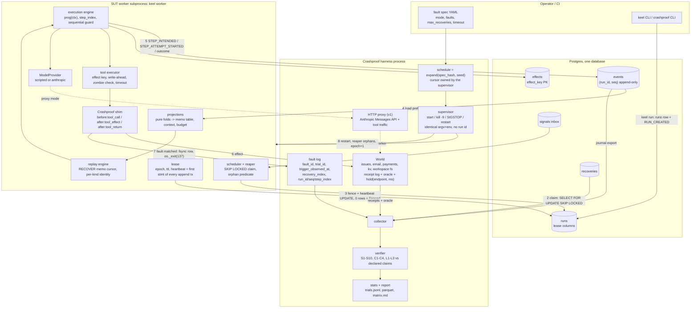

Numbered edges: (1) the supervisor starts the worker; a run id reaches the SUT once, at submission, never on restart. (2) The scheduler claims under `SELECT … FOR UPDATE SKIP LOCKED`. (3) Every append transaction and every heartbeat is the same fence statement on `runs`. (4) On every acquisition the replay engine folds the prefix into the memo table. (5) The step machinery appends INTENT, STARTED and outcome. (6) The effect reaches the World through the shim. (7) A matched schedule entry fsyncs its fault-log row, then `os._exit(137)`. (8) The supervisor restarts the worker with identical argv and env; the reaper marks the run ORPHANED once `now() > max(lease_expires_at, attempt_deadline)`; a worker acquires epoch+1 and re-executes. After terminal state or timeout the collector joins the four logs for the verifier; verdicts and metrics become one JSONL row per trial.

### 3.3 Processes and plug points

Runtime topology: N × `keel worker` on one node (the lease design permits more nodes; untested, Future), Postgres 16, and from v1 one `keel api` process (FastAPI + SSE) that never holds a lease. A trial adds the supervisor, the World and (v1) the proxy. Nothing else runs: no broker, no cache, no sidecar (§22, §34).

| Protocol | MVP implementation | What plugs in later | Boundary it must respect |
|---|---|---|---|
| `JournalBackend` | `MemoryJournal`, `PostgresJournal` | nothing (§5.3: no third) | fence is statement #1 of every append |
| `BlobStore` | `blobs` table, sha256, same transaction | object storage (Future) | a blob referenced by an event exists before the event commits |
| `ModelProvider` | `scripted`, `anthropic` | OpenAI (Future) | `complete`, `stream`, `count_tokens`; never journals |
| `Tool` | registry in `keel/effects` | thin MCP-tool bridge (maps MCP tools onto effect classes) | exactly one class; a non-PURE tool's `timeout < lease_ttl` (§4.7) |
| `Sandbox` | none (workspace dir) | per-epoch checkout + git snapshot (v1) | `exec`, `snapshot`, `restore` |
| `Policy` | allow-all | `allowed_tools`, `require_approval` (v1) | pre-step only; decisions are journaled through the step |
| `CredentialProvider` | process env | credential proxy (v2) | credentials never enter args, hashes, keys or events |
| `FaultHook` | `hooks.at(boundary, fn)` | — | Keel conformance cells only |
| `RuntimeAdapter` | keel, langgraph | dbos, pydantic_ai, hatchet, inngest, julep | thin; declares `claims`, `recovery_mechanism`, `config_pin` |

## 4. Component architecture

### 4.1 Component matrix

| # | Component | Responsibility | Inputs | Outputs | State owned | Failure modes | Consistency requirements | Sync/async | Deterministic? | Persistence? |
|---|---|---|---|---|---|---|---|---|---|---|
| 4.2 | Runtime control plane | claim runnable runs, hold/renew/release leases, orphan expired leases, drain on SIGTERM | `runs` columns, `signals` NOTIFY, SIGTERM, Postgres clock | conditional UPDATEs on `runs`, `recoveries` rows, one asyncio task per held run | `runs.lease_*`, `runnable_at`, `wake_at`, `orphaned_at`, `runnable_reason`; `recoveries` | worker death (lease expires), pause past TTL (zombie), Postgres unreachable (worker self-fences), reaper races (harmless) | every write is one conditional UPDATE re-checking its assumption; READ COMMITTED suffices; never writes `events` | async loops + timers | no (timing); its effects are journaled by the lease holder | yes |
| 4.3 | Agent execution engine | run `prog(ctx)`; own `step_index`; enforce one step in flight; route each step to memo or live | program, args, memo table, ModelProvider, Tool registry, Policy, budget projection, hooks | fenced appends; results returned to the program; `Parked` on waits | in-memory only: `step_index`, `_inflight`, memo cursor, lease handle | crash at any await (recoverable by design), `ConcurrentStepError`, `NondeterminismDetected`, `BudgetExceeded`, `Fenced` | at most one open step per run; write-ahead before any effect; every returned value is journaled or memoised | async, one task per run | dispatch is a pure function of (program, journal); the program must be deterministic | none of its own |
| 4.4 | Event journal | append-only per-run log; fenced single-writer appends; blob storage; upcasting on read | event batches, effects ops, consumed signal ids, `lease_epoch` | assigned `seq`, event streams | `events`, `blobs` | `journal_unavailable`, `blob_write_fail` (transaction aborts whole), fence rejection | PK `(run_id, seq)`; one transaction per append; fence first; rows never updated | awaited async I/O | append order == step-index order | yes |
| 4.5 | State projection layer | pure folds: run phase, steps, effects, budget, plan, context, approvals, children; projection hash | upcasted event stream | `RunState`, memo table, projection hash, `runs.phase` cache value | none (derived) | projector bug (fix = re-fold), `projector_version` mismatch | total pure function of an event prefix; no I/O, no clock | sync, CPU-bound | must be | no (checkpoints Future) |
| 4.6 | Replay engine | RECOVER / VERIFY / FORK; memo cursor; per-kind identity check; in-flight recovery table; diff | memo table, program, mode, fork overrides, lease handle | RECOVERY_*, VERSION_VERIFIED, PROMPT_DRIFT report, nondeterminism diff, `replays` rows | `replays`; in-memory cursor | `NondeterminismDetected` → SUSPENDED, `state_schema_mismatch`, `EffectDeniedInFork` | RECOVER requires the lease; VERIFY writes nothing; FORK uses a new `run_root_id` | sync per step | yes | `replays`; otherwise via journal |
| 4.7 | Tool execution layer | registry, Policy pre-check, effect key, write-ahead, zombie pre-dispatch check, timeout, class dispatch, probe | intent, tool, effect_key, lease handle, hooks, shim | outcome events, `effects` rows, probe evidence | tool registry (code) | `tool_timeout` → AMBIGUOUS (EXTERNAL), `tool_500`, `tool_malformed`, `Fenced` before dispatch, zombie residual | STARTED committed before any effect; outcome commit fenced; `lease_ttl > max(tool.timeout)` over non-PURE tools, checked at worker start | async | no (external world) | via journal + effects |
| 4.8 | Idempotency / effect registry | one `effects` row per TOOL step; key uniqueness; status; `external_ref`; `attempt_deadline` for the reaper | INTENT/STARTED/outcome ops | rows; reaper predicate input; verifier `sut_committed_set` | `effects` | unique violation at INTENT (loud, runtime bug) | written in the same transaction as the event it mirrors | sync (same tx) | key derivation yes | yes |
| 4.9 | Checkpoint system | continuation segments (v1); projection checkpoints (Future) | `Continue(state)`, segment length N, `projector_version` | SEGMENT_STARTED, `checkpoints` rows (Future) | `checkpoints` (Future) | `state_schema_mismatch` → SUSPENDED; stale checkpoint (version) | C2 segment equivalence; checkpoint is a cache, never truth | sync | yes | journal; `checkpoints` Future |
| 4.10 | Approval subsystem + signals inbox | `ctx.approve`, APPROVAL_* events, `signals` table, drain, expiry timers, effect-key binding | API/CLI signals, timer, program approve calls | SIGNAL_RECEIVED/IGNORED, APPROVAL_*, step outcomes, `wake_at` | `signals`; approvals projection | duplicate signals (inbox is at-least-once → SIGNAL_IGNORED), `approval_delay`, `approval_expiry`, lost NOTIFY (1 s poll) | drain = one fenced transaction; `consumed_seq` set with the event; S7 | async; the wait itself holds no lease and no task | application order by `(created_at, signal_id)` | yes |
| 4.11 | Orchestration / child-agent subsystem | delegation contracts, child runs, CHILD_*, result validation, budget reserve/settle, cancel propagation, lease takeover | contract, child terminal signals | child `runs` + RUN_CREATED, `delegations`, CHILD_* events, `child_result` signals | `delegations` | `ContractViolation`, child outliving parent (takeover), fan-out > `max_children_in_flight` | child journal written only by its holder; Σ reservations ≤ parent remaining; S8 | async | parent view yes (outcome = list) | yes |
| 4.12 | Fault injection engine | hook / shim / proxy injectors; FaultHook; fault log with fsync-before-exit | schedule, boundary observations, seed | `os._exit(137)`, raise, sleep, malformed responses; fault-log rows | fault log (trial-owned), schedule cursor (supervisor) | double fire (prevented by trial-owned state), boundary never observed (reported unfired) | trigger = f(observed request history, seed) | sync at the boundary | yes given (spec_hash, seed, history) | `faults` JSONL |
| 4.13 | Benchmark runner | supervisor, World, proxy, adapters, collection | (adapter, workload, schedule, seed) | trial row: canonical result, logs, timings, `budget_overshoot` | `trials`, `receipts` (World log), proxy log | SUT never terminal (L1 fail), World crash (trial void), restart storm > `max_recoveries` | World is ground truth; restart with identical argv/env | async subprocess management | World yes; supervisor timing no (sampled) | JSONL + Parquet |
| 4.14 | Verifier | invariants + economy metrics per trial | World log, proxy log, fault log, canonical result, journal export, adapter `claims` | PASS/FAIL/N/A, counterexamples, raw observations, metrics | none | missing input → N/A; stale rows flagged | judged against declared claims; never PASS on a missing input | sync, pure | must be | `metrics` |
| 4.15 | Observability / trace layer | id lattice, structured logs, `keel events`/`watch`, SSE (v1), OTel/Langfuse export (v2) | events, control-plane rows, fault log | timelines, log lines, exports | `artifacts` (exports) | log loss tolerable (journal is truth) | reads only | async | no | `artifacts` |
| 4.16 | Persistence layer | Postgres 16 + psycopg 3 async; pool; migrations; tables/indexes; `BlobStore`; `MemoryJournal` | SQL from journal/control plane | durability | all tables | unavailable, pool exhaustion, disk full, `partition_worker_postgres` | READ COMMITTED + row locks + PK/unique constraints | async I/O | n/a | is persistence |
| 4.17 | API layer (v1) | run creation, reads, signals, SSE tail | HTTP | `runs` + RUN_CREATED, `signals` rows, projections, SSE | none | retried POST duplicates a signal (`client_key`); API outage does not affect runs | never writes `events` of an existing run; reads may lag | async | no | via tables |
| 4.18 | CLI | developer entry to every path above | argv | same writes as the API; text/Rich output | none | none beyond the paths it calls | same as API | sync wrapper over async | no | no |
| 4.19 | Demo timeline viewer | BEFORE CRASH / AFTER RESTART timeline; side-by-side matrix | event stream, `recoveries`, report | rendering (Rich TUI v1 day 7, static HTML v1 week 3) | none | display only | read-only | async tail | rendering yes | no |

### 4.2 Runtime control plane (scheduler + reaper + leases + drain)

One `keel worker` process contains: a scheduler loop, a reaper loop, one heartbeat timer per held lease, one asyncio task per held run, and a SIGTERM handler. Defaults (section-local decision): `lease_ttl = 30 s`, heartbeat every `lease_ttl / 3 = 10 s`, scheduler/reaper tick 1 s (the constitution's polling fallback), `max_runs_per_worker = 8`. The four numbers are one config object; Crashproof cells pin them in `config_pin`.

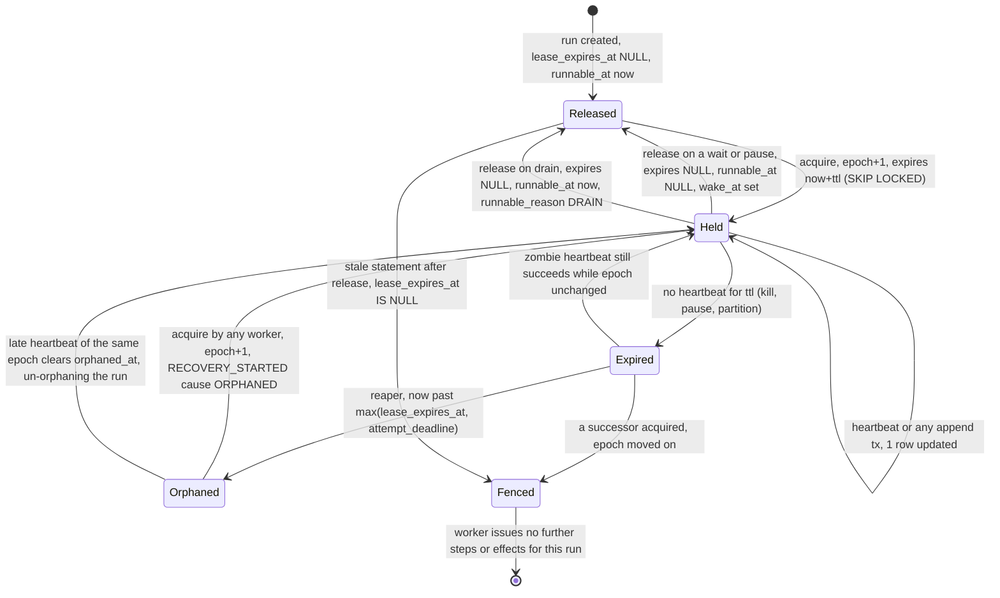

The states are the row's truth, not a worker's belief. There is no `Held --> Fenced` edge: a lease that is genuinely held cannot be fenced, because the epoch moves only after expiry, orphaning or takeover. A worker that believes it is Held learns otherwise when its next fence UPDATE returns 0 rows — which is the `Expired`/`Released --> Fenced` edge, discovered late.

The four statements of §5.4, plus a fifth that only cancel propagation uses. Every one re-checks in its WHERE the state it assumes, so two reapers, or a reaper racing a heartbeat, cannot corrupt anything (§5.4):

```sql
-- claim candidates (scheduler tick or NOTIFY): the attempt_deadline conjunct is carried here as well
-- as in the reaper, for the reason §5.4 gives: a signal insert sets runnable_at = now() on a held run,
-- so a holder that lapses mid-effect becomes claimable without the reaper ever touching the row.
SELECT run_id, orphaned_at, wake_at, runnable_reason FROM runs
 WHERE runnable_at <= now()
   AND terminal_at IS NULL
   AND (paused_at IS NULL OR EXISTS (SELECT 1 FROM signals s
         WHERE s.run_id = runs.run_id AND s.consumed_seq IS NULL AND s.type IN ('resume','cancel')))
   AND (lease_expires_at IS NULL OR lease_expires_at < now())
   AND (attempt_deadline IS NULL OR attempt_deadline < now())
 ORDER BY runnable_at LIMIT $n FOR UPDATE SKIP LOCKED;

-- acquire (same transaction as the claim; also inserts the recoveries row)
UPDATE runs SET lease_epoch = lease_epoch + 1, lease_owner = $w, lease_expires_at = now() + $ttl,
                orphaned_at = NULL, runnable_reason = NULL
 WHERE run_id = $1 AND (lease_expires_at IS NULL OR lease_expires_at < now())
   AND terminal_at IS NULL
   AND (attempt_deadline IS NULL OR attempt_deadline < now())
 RETURNING lease_epoch;

-- heartbeat == fence (first statement of every append transaction; alone on the 10 s timer)
UPDATE runs SET lease_expires_at = now() + $ttl, orphaned_at = NULL, updated_at = now()
 WHERE run_id = $1 AND lease_epoch = $e AND lease_expires_at IS NOT NULL;   -- 0 rows ⇒ Fenced

-- reaper (1 s tick): one predicate, no successor-side wait
UPDATE runs r SET orphaned_at = now(), runnable_at = now()
 WHERE r.lease_expires_at IS NOT NULL AND r.lease_expires_at < now() AND r.orphaned_at IS NULL
   AND NOT EXISTS (SELECT 1 FROM effects e WHERE e.run_id = r.run_id AND e.status = 'STARTED'
                   AND e.class <> 'PURE' AND e.attempt_deadline > now());

-- takeover (fifth statement; cancel propagation and the S8 liveness rule, §4.11): the only statement
-- that moves a lease its holder still believes it has, so its WHERE pins the epoch it observed.
UPDATE runs SET lease_epoch = lease_epoch + 1, lease_owner = $w, lease_expires_at = now() + $ttl,
                orphaned_at = NULL
 WHERE run_id = $child AND lease_epoch = $observed AND terminal_at IS NULL
 RETURNING lease_epoch;                        -- 0 rows ⇒ the child moved on; re-read and re-evaluate
```

Cause derivation for RECOVERY_STARTED comes from the claimed row before the UPDATE: `orphaned_at IS NOT NULL` ⇒ ORPHANED; `runnable_reason = 'DRAIN'` ⇒ DRAIN; an unconsumed `resume` signal on a run with `paused_at IS NOT NULL` or phase SUSPENDED ⇒ RESUME (the cause is derived from the inbox, not from a column the pause path would have to remember to set — section-local decision); any other `wake_at <= now()` or unconsumed signal ⇒ WAKE; a fresh run ⇒ START; VERIFY never acquires. The column is `runs.runnable_reason` (§5.4), whose CHECK already carries START | WAKE | DRAIN | RESUME | ORPHANED. The acquire UPDATE returning **0 rows** — a row claimed a tick ago whose lease a late heartbeat has just renewed, or a takeover the child raced — is not an error: the scheduler drops the run for this tick and re-reads it on the next one; nothing is appended, so nothing needs undoing.

The `recoveries` row is inserted in the acquire transaction and completed at RECOVERY_COMPLETED or RUN_SUSPENDED (section-local decision); `RECOVERING` as a control-plane status is exactly "a `recoveries` row for the current epoch with `completed_at IS NULL`". A worker that dies mid-recovery leaves that row open forever, so the acquire transaction also closes any open `recoveries` row of an older epoch with `outcome = CRASHED` (§5.7 owns the value set) — otherwise the recovery-latency metric would count an abandoned epoch as still running.

`now()` is evaluated on the server in every statement, so the worker's clock never enters a predicate. The worker keeps a local `valid_until = monotonic() + ttl` sampled **immediately before its last successful heartbeat UPDATE was sent** — not when the reply arrived, which would overstate validity by the round trip — and uses it only for the zombie pre-dispatch check (§4.7); it is a conservative view, never truth.

Drain (SIGTERM): stop claiming; for each held run let the in-flight step reach its outcome commit, capped by `min(step timeout, shutdown_grace)`; then `UPDATE runs SET lease_expires_at = NULL, runnable_at = now(), runnable_reason = 'DRAIN' WHERE run_id = $1 AND lease_epoch = $e`; exit 0. A step that cannot finish inside the cap is cancelled and the worker appends the outcome it can honestly report — STEP_AMBIGUOUS{cause=drain_abandoned} for EXTERNAL, STEP_FAILED{retryable} for the others — before releasing; the successor's recovery table (§4.6) takes it from there, and the open attempt holds the successor off through the `attempt_deadline` conjunct in the claim and acquire predicates, not through a non-NULL lease. `sigterm_grace_too_short` is that path, measured. Every release — drain, wait, pause, suspend — cancels and awaits the heartbeat task *before* issuing its UPDATE, so a heartbeat cannot interleave after the release and re-establish a lease nobody is holding; if one does land anyway it fails closed on the statement's own `lease_expires_at IS NOT NULL` guard.

Wake sources that make a run claimable: `runnable_at` (creation, resume, orphan, drain), `wake_at` (SLEEPING, approval expiry, retry backoff longer than `lease_ttl`), and an unconsumed inbox row (approve/reject/cancel/pause/resume/rebind/child_result). Postgres `LISTEN keel_signals` (payload `run_id`) wakes the scheduler promptly; the 1 s poll is the fallback.

**A release that parks a run clears `runnable_at`.** Every wait, pause and suspend release sets `runnable_at = NULL` in the same transaction as RUN_WAITING / RUN_PAUSED / RUN_SUSPENDED (§4.10 shows the statement); only creation, drain, orphan and resume set `runnable_at = now()`. Without that clearing "waiting = no lease = zero compute" (§7.2) would be false as written: a run parked three days on an approval would still satisfy `lease_expires_at IS NULL AND runnable_at <= now()` on every 1 s tick, and the scheduler would acquire it, append RECOVERY_STARTED, re-execute, re-park and release, forever. A parked run is therefore reachable only through its `wake_at` or through an inbox row — which is exactly the set of things that should wake it. Terminal runs are excluded by the `terminal_at IS NULL` conjunct in both the claim and the acquire, so a late `approve` against a COMPLETED run can never re-enter `prog(ctx)` and append a second RUN_COMPLETED; `keel signal` and `POST /runs/{id}/signals` refuse a signal for a terminal run at insert time (section-local decision) rather than leaving a row no drain will ever consume.

### 4.3 Agent execution engine (worker + ctx + step machinery + sequential-step guard)

`Ctx` is the only object the program touches. It carries `run_id`, `run_root_id`, `step_index`, `_inflight`, the mode (RECOVER | VERIFY | FORK), the memo cursor, the fenced journal writer, the lease handle, the tool registry, the provider binding, the Policy, the budget projection and the hook registry. Every `ctx.*` method funnels into one pipeline:

```
ctx.tool(name, args) · ctx.model(msgs, tools, **sampling) · ctx.approve · ctx.delegate[_many] · ctx.sleep
ctx.now · ctx.random · ctx.compact · ctx.plan.* · ctx.signal.wait · ctx.patched
        │
        ▼
┌─ STEP ENTRY (synchronous, before the first await) ─────────────────────────────────────────────────┐
│ if ctx._inflight: raise ConcurrentStepError            # sequential-step guard: a program bug          │
│ ctx._inflight = True                                                                                │
│ drain own inbox if any row is unconsumed (§4.10)       # cancel / pause / rebind land HERE, at a       │
│                                                        # step boundary, before an index is consumed   │
│ if no journaled step at ctx.step_index (i.e. this step will be LIVE):                                 │
│     verdict = Policy.pre_step(kind, name, canonical_args)   → allow | deny | require_approval         │
│     require_approval ⇒ this one ctx.tool call consumes TWO indices: i = APPROVAL, i+1 = TOOL          │
│ i = ctx.step_index; ctx.step_index += 1                # runtime-owned; never reset by retry/recovery │
│ intent = Intent(i, kind, name, canonical_args, args_hash, request_hash?, effect_key?, effect_class?,  │
│                 policy_verdict?)                                                                     │
└────────────────────────────────────────────────────────────────────────────────────────────────────┘
        │
        ▼
┌─ MEMO (replay engine §4.6) ───────────────────────────────────────────────────────────────────────┐
│ FORK and i ≥ fork_step?  yes ──► apply overrides and execute LIVE (fork_step = the step_index of the │
│    │ no                          STEP_INTENDED at fork_seq; indices < fork_step memoise from the base)│
│    ▼                                                                                                 │
│ journaled(i)?  no ──► first un-journaled step: RECOVERY_COMPLETED{live_from_step=i} if recovering;   │
│    │ yes                VERIFY stops here                                                            │
│    ▼                                                                                                 │
│ this is a TOOL call, journaled(i).kind == APPROVAL, and                                              │
│   journaled(i).binds_effect_key == key(run_root_id, i+1, tool, canonical_args)?                      │
│    yes ──► the journaled gate: return the APPROVAL outcome at i, then re-enter at i+1 for the TOOL    │
│    │ no    step. The live Policy is NEVER consulted for a journaled gate — the journal decides, so a  │
│    ▼       policy edited during a three-day park cannot turn a replay into NondeterminismDetected.    │
│ identity(kind) == journaled intent?  no ──► NondeterminismDetected ──► RUN_SUSPENDED{diff}            │
│    │ yes                                                                                             │
│    ▼                                                                                                 │
│ outcome journaled?  yes ──► return recorded outcome (0 tokens, 0 effects, microseconds)               │
│    │ no (STARTED without outcome)                                                                    │
│    ▼                                                                                                 │
│ recovery table by class/kind (§4.6) ──► re-run (PURE, IDEMPOTENT, TRANSACTIONAL) | AMBIGUOUS (EXTERNAL) │
│                                     ──► re-park, appending nothing (APPROVAL, DELEGATE, SLEEP, SIGNAL_WAIT)│
└────────────────────────────────────────────────────────────────────────────────────────────────────┘
        │ LIVE
        ▼
┌─ LIVE ─────────────────────────────────────────────────────────────────────────────────────────────┐
│ the STEP ENTRY verdict is journaled as `policy_verdict` on the INTENT; replay reads it, never Policy  │
│ deny ⇒ ONE transaction: fence ▸ STEP_INTENDED{policy_verdict=deny} ▸ STEP_FAILED{PolicyDenied,        │
│    attempt_no=0, retryable=false} — no STEP_ATTEMPT_STARTED, so no effect can have begun              │
│ require_approval ⇒ APPROVAL step at i (§4.10) and the TOOL step at i+1                                │
│ budget.admit(intent) → BudgetExceeded ⇒ ONE transaction: fence ▸ STEP_INTENDED ▸ STEP_FAILED{         │
│    BudgetExceeded, attempt_no=0, retryable=false} ⇒ RUN_FAILED | RUN_SUSPENDED{budget_top_up}         │
│ TX: fence ▸ STEP_INTENDED ▸ effects row ▸ STEP_ATTEMPT_STARTED{attempt 1}        (write-ahead barrier)│
│ execute by kind:  MODEL / COMPACT → ModelProvider.complete/stream   TOOL → executor §4.7             │
│    APPROVAL / DELEGATE / SLEEP / SIGNAL_WAIT → append request event + RUN_WAITING, release lease,     │
│    raise Parked (BaseException) — the task unwinds and ends; zero compute until a wake (§4.2)         │
│    NOW / RANDOM / PLAN → value computed, journaled as outcome                                          │
│ TX: fence ▸ blobs ▸ STEP_COMPLETED | STEP_FAILED | STEP_AMBIGUOUS ▸ effects row                       │
│ retry: STEP_FAILED{retryable, next_attempt_at} → backoff → TX: STEP_ATTEMPT_STARTED{attempt n+1}       │
└────────────────────────────────────────────────────────────────────────────────────────────────────┘
        │
        ▼  ctx._inflight = False; return result to the program
```

Four mechanisms deserve a sentence each.

The guard is a flag, not a lock (section-local decision). A lock would serialise `asyncio.gather(ctx.tool(a), ctx.tool(b))` into something that works once and diverges under replay when the scheduler's order differs from the journaled one. The check-and-set precedes the first `await`, so asyncio's single thread makes it atomic; the second call raises `ConcurrentStepError` at entry. It is a program bug, never a fault: the run goes FAILED with the offending `step_index`. This is where the agent shape bites: a model turn that returns four tool calls is the normal case, and Keel executes them one after another so that INTENT order equals step-index order and a crash leaves at most one step open. Parallelism is delegation to child runs (§4.11), never concurrent steps in one run.

A refusal is still a step (section-local decision, forced by S5). Policy `deny`, `BudgetExceeded` and `EffectDeniedInFork` all commit STEP_INTENDED and STEP_FAILED in one transaction rather than a bare STEP_FAILED: a FAILED index whose intent identity was never journaled would have no identity for the memo cursor to re-check, and the `steps` projection would show a step that never existed. The write-ahead property is unaffected because no STEP_ATTEMPT_STARTED is written, which is exactly the recovery table's "INTENT, no STARTED ⇒ the effect provably never began" row.

Parking (section-local decision). A waiting step holds no coroutine open: `ctx.approve`, `ctx.delegate`, `ctx.sleep` and `ctx.signal.wait` append their request event and RUN_WAITING, release the lease, and raise `Parked`, a `BaseException` subclass `except Exception` cannot swallow. The task ends. On wake, re-execution reaches the same step, finds its outcome journaled by the drain (§4.10), and continues; "waiting = no lease = zero compute" (§7.2) needs no special path because the wake is an ordinary acquisition.

Retry backoff (section-local decision): a delay shorter than `lease_ttl` is served in-process with the heartbeat running; a longer one releases the lease with `wake_at = next_attempt_at` and RUN_WAITING{reason=retry_backoff}. Retry-policy defaults are in §8.

The worker's top-level loop per run is: acquire → fold the prefix → if the projected phase is terminal, drain the inbox as SIGNAL_IGNORED and release without ever calling the program → else `RECOVERY_STARTED` → drain inbox → `prog(ctx)` → on return: `RUN_COMPLETED{result}` (or `Continue(state)` → SEGMENT_STARTED, §4.9) → release. `Parked`, `Fenced`, `Cancelled` and `NondeterminismDetected` are the four ways out of `prog(ctx)` that are not a result or a program exception; each has exactly one handler in `keel/runtime/worker.py`. The other runtime-raised exits — `BudgetExceeded`, `ConcurrentStepError`, `EffectDeniedInFork`, `state_schema_mismatch` — reach the program as ordinary exceptions after their step's outcome is journaled, so they need no handler of their own: whatever the program does with them, the journal already records why the step failed.

The pre-`prog` drain is the same routine as the step-boundary drain in STEP ENTRY, called once more before the first step. That is what bounds cancel latency: without a drain at every step boundary, a cancel sent to a held run in the middle of a forty-step ReAct loop would not be seen until the run parked or ended, "acknowledged at the next step boundary" (§7.2) would be false, and `cancel_grace` (§4.11) could not be honoured by a busy child. The check is one indexed read of `signals(run_id) WHERE consumed_seq IS NULL`; `LISTEN keel_signals` on the held run ids makes it prompt rather than tick-bound, and the drain runs inside the same fenced transaction as the step it precedes, which is what makes CANCEL_ACKNOWLEDGED{step_index} land on a deterministic index under replay.

### 4.4 Event journal

The journal is `events(run_id, seq, …)` with PK `(run_id, seq)`, append-only, plus `blobs`. One protocol, two backends: `MemoryJournal` (tests, Hypothesis, hook-mode conformance cells with a fake clock) and `PostgresJournal`. The protocol has one append method and one creation method, and nothing else that writes:

```python
async def append(self, run_id, lease_epoch, events: list[Event],
                 effects_ops: list[EffectOp] = (), consume_signals: list[SignalId] = ()) -> int:
    """One transaction. Statement #1 is the fence. Returns the last seq assigned. Raises Fenced."""

async def create(self, run: RunRow, created: RunCreated) -> None:
    """Run creation only: INSERT runs + INSERT events(seq 1, RUN_CREATED) in ONE unfenced transaction."""
```

`create` is the single unfenced write in the system and the one exception to §3.1 rule 1. It is unfenced because it must be: no lease exists yet, and running the fence statement at `lease_epoch = 0` would either match nothing or make a brand-new run look Held. It is safe because a row inserted by that very transaction can have no competing writer — the run becomes visible to the scheduler and to the fence only at commit, with RUN_CREATED already in it. Roots go through it from `keel run` / `POST /runs`; children go through it from the parent's worker inside the parent's fenced transaction (§4.11), which is a write to a *different* run and therefore not a cross-run append to the parent's own stream. `append` derives the `runs.phase` cache value itself by folding the batch onto the holder's current projection (§4.5), so no caller ever passes a phase.

Transaction layout, in order: (1) fence UPDATE on `runs` (0 rows ⇒ raise `Fenced`, nothing else runs); (2) `INSERT INTO blobs … ON CONFLICT (sha256) DO NOTHING` for every payload > 32 KiB referenced by the batch; (3) `INSERT INTO events` with `seq = last_seq + k`, `k` in batch order; (4) `effects` insert/update; (5) `UPDATE signals SET consumed_seq = $seq WHERE signal_id = ANY($ids)`. The lease holder caches `last_seq` in memory after reading `max(seq)` at acquisition; the PK is the backstop if the cache is ever wrong (a duplicate `(run_id, seq)` aborts the transaction, which is the correct outcome for a stale writer that somehow passed the fence). Blob rows are written in the same transaction as the event that references them (section-local decision), so `blob_write_fail` aborts the append and no event ever references a missing blob.

Reads: `load(run_id, from_seq=0) -> AsyncIterator[Event]` applies upcasters `v1→v2→…` at load time, keyed by `schema_version`; stored rows are never rewritten. Pydantic v2 discriminated unions on `type` define the taxonomy (§6). `MemoryJournal` implements the fence by holding a `lease_epoch` per run and rejecting a mismatched epoch, so the Hypothesis suite (§12) exercises the same `Fenced` path as Postgres.

What the journal refuses: `UPDATE`/`DELETE` on `events` (the worker's database role lacks those grants — section-local decision, cheap and loud); `append` without a valid epoch (creation is the one unfenced write, and it is a different method); an `append` batch whose events are not all for the batch's `run_id` (checked before the transaction opens); a `create` whose event is not RUN_CREATED at seq 1.

### 4.5 State projection layer

A projection is a pure fold. The protocol (section-local decision):

```python
class Projector(Protocol[S]):
    name: str; version: int
    def initial(self) -> S: ...
    def apply(self, state: S, ev: Event) -> S: ...       # pure; ev.ts is the only clock
```

Projectors: `run` (journal phase: CREATED → RUNNING → WAITING_* / PAUSED → … → COMPLETED | FAILED | CANCELLED | SUSPENDED | SUPERSEDED), `steps` (per `step_index`: intent identity, attempts, state INTENDED → RUNNING → COMPLETED | FAILED | AMBIGUOUS | CANCELLED | RESOLVED_*), `effects`, `budget` (reserve-then-settle; charges abandoned attempts at reservation), `plan` (from PLAN_UPDATED only), `context` (compaction summary from the latest COMPACT step's outcome + MODEL/TOOL outcomes since; ignores STEP_CHUNK of non-completed attempts), `approvals`, `children`. `fold(events) -> RunState` runs all of them in one pass. The `steps` projection is the replay engine's memo table: for index `i` it yields the journaled intent identity and, if present, the terminal outcome or the open attempt.

`projection_hash = sha256(canonical_json(RunState minus timestamps))` is what VERIFY compares for terminal runs (C1). The `runs.phase` column is a cache of the `run` projector's output, written in the same transaction as the phase-changing event (section-local decision) so `keel runs --phase WAITING_APPROVAL` is one indexed query instead of a fold over every run; it is never read by the engine and is rebuilt by re-folding if a projector changes.

A projector never consults `now()` (C1 would become time-dependent) and never reads another run's events (a parent learns about a child only through CHILD_* in its own journal). Projection checkpoints are Future (§4.9): a few hundred sequential steps fold in milliseconds, and the constitution forbids the cache before measurement.

### 4.6 Replay engine

| Mode | Lease | Journal writes | Memo source | Live steps | Stops at | Output |
|---|---|---|---|---|---|---|
| RECOVER | required | yes | own journal | from the first un-journaled step | end of program / park / terminal | RECOVERY_STARTED … RECOVERY_COMPLETED |
| VERIFY | none | none | own journal | never (`allow_live = False`) | first un-journaled step | identical-sequence assertion, PROMPT_DRIFT report, projection hash (terminal runs); `replays` row. VERIFY itself writes nothing: at a shadow check the **acquiring worker** appends VERSION_VERIFIED after the pass returns, under its own fence |
| FORK | on the new run | yes, to the new run | base journal prefix `< fork_step` (referenced, not copied) | from `fork_step` with overrides | as RECOVER | new run with `fork_of`, `run_root_id = new run_id`; `synthetic=true` outcomes |

The memo cursor walks the `steps` projection by `step_index`. For each program step it applies per-kind identity: TOOL / APPROVAL / DELEGATE / SLEEP / SIGNAL_WAIT / PLAN compare `(kind, name, args_hash)`; MODEL and COMPACT compare `(kind, name)` only, with `request_hash` compared in VERIFY to emit `PromptDrift{step, diff}` (never in RECOVER); NOW and RANDOM compare `(kind)`, since they carry no name and no arguments. The looser MODEL identity is an agent-native decision, not laxity: a run parked three days on an approval must survive a one-line prompt edit or a re-ordered tool schema, while a genuine control-flow divergence still shows up as a `(kind, name)` mismatch — so prompt churn becomes a VERIFY-only `PromptDrift` warning and only real divergence suspends a run. A journaled APPROVAL gate is matched by `binds_effect_key` rather than by kind (§4.3), so the same tolerance covers a Policy edited mid-park. The determinism checker produces a structured diff `{step_index, expected: identity, actual: identity}` that RUN_SUSPENDED carries and `keel diff` renders.

The in-flight recovery table is journal state only; the worker never knows where it died:

```
journal state at step i                         class / kind            action
INTENT, no STARTED for current attempt          any                     start the attempt (effect provably never began)
STARTED(n), no outcome(n)                       PURE                    new attempt n+1, re-run
STARTED(n), no outcome(n)                       IDEMPOTENT              new attempt n+1, SAME effect_key (effectively-once if receiver honours it)
STARTED(n), no outcome(n)                       TRANSACTIONAL           provably not applied (effect + outcome share a tx) → re-run
STARTED(n), no outcome(n)                       EXTERNAL                STEP_AMBIGUOUS → tool.resolution: probe | assume_failed | assume_succeeded | escalate
STARTED(n), no outcome                          APPROVAL | DELEGATE |   re-park: append nothing (RUN_WAITING only if the phase is not already
                                                SLEEP | SIGNAL_WAIT     WAITING_*), release the lease with the journaled wake_at / expires_at,
                                                                        raise Parked. The request event (APPROVAL_REQUESTED, CHILD_SPAWNED …)
                                                                        is issued ONCE per step, never once per acquisition.
STARTED(n), STEP_CHUNK(n, k…), no outcome       MODEL, or STREAMS on    discard the chunks (the budget keeps their usage); then the class row
                                                any class               above decides — PURE/MODEL new attempt, IDEMPOTENT new attempt with the
                                                                        same key, EXTERNAL STEP_AMBIGUOUS
outcome(n) present                              any                     return recorded outcome
```

Two readings of this table are load-bearing. First, attempt 1's STARTED shares INTENT's transaction (§4.3, §4.20), so the "INTENT, no STARTED" row is reachable only for attempts ≥ 2 — a kill between INTENT and STARTED of attempt 1 is impossible by construction, and the hook boundaries `after:intent_commit` and `before:attempt_commit` coincide at that one commit. Second, the four waiting kinds spend their normal life — days — in STARTED-without-outcome, so a crash or a spurious wake while parked must not re-issue the request: a second APPROVAL_REQUESTED would mint a second `approval_id` and break S7's "exactly one GRANTED approval per gated effect". A decision reaches a waiting step only through the drain, which appends that step's outcome (§4.10); the step is therefore either open-and-parked or completed, never re-requested.

VERIFY is a mode, not a test, because the deployment shadow check (§18.5) runs it on every non-terminal run at a `program_version` change: a run parked three days on an approval is checked against the new code, at zero tokens and zero effects, before it may continue.

FORK's effect policy is enforced here, not in the executor: under `effects = deny` (default) a non-PURE step at index `≥ fork_step` (`fork_step` = the `step_index` of the STEP_INTENDED at `fork_seq`; the CLI takes a seq, the engine works in step indices) with neither a `tool_results` override nor a `tool_registry` stub is refused before it can execute and journaled as STEP_INTENDED + STEP_FAILED{`EffectDeniedInFork`, attempt_no=0, retryable=false} in one transaction; `mock` routes to stubs or a Crashproof World; `live` prints the base run's committed and AMBIGUOUS effects at those indices and warns before proceeding. The model-call cache (`providers/replay_cache`) is consulted only in FORK and `real-model` validation; RECOVER never touches it (§10.10).

### 4.7 Tool execution layer (with the zombie rule pre-dispatch check)

A tool is a `Tool` protocol instance: `name`, `effect_class` (exactly one of PURE | IDEMPOTENT | EXTERNAL | TRANSACTIONAL), `modifiers ⊆ {STREAMS, LOCAL_FS}`, `timeout`, `run(args, tctx)`, optional `probe(effect_key, args, tctx) -> ProbeResult`, optional `compensate`, and `resolution` (default `escalate`; `probe` if a probe is supplied; `assume_failed` disallowed for approval-gated tools).

`lease_ttl > max(tool.timeout)` over the **non-PURE** tools is checked at worker start, not at registration (section-local decision): `lease_ttl` is a `keel worker` flag (§4.18) and the registry may be imported by a process that has no worker, so registration cannot see the number. The rule is scoped to non-PURE tools because both the zombie pre-dispatch check and the reaper's predicate exclude PURE — a PURE `run_tests` with a five-minute timeout is legal and its lease keeps heartbeating normally. For effectful tools the constraint is real and its trade-off is operational, not hidden: a `deploy_service` that needs 120 s forces a `lease_ttl` above 120 s, which raises crash-detection latency by the same amount, and Crashproof pins both numbers in `config_pin` and reports the consequence as recovery latency. One more registration-time contract: `tool.run` must not block the event loop — a synchronous client goes through `asyncio.to_thread` — because the heartbeat's liveness *is* the loop's liveness, and a blocking tool is a self-inflicted `pause_past_ttl`.

```
executor.dispatch(intent i, attempt n)                     hook boundaries              shim boundaries (all runtimes)
  attempt 1: STARTED is ALREADY committed — it shared INTENT's transaction (§4.3), and dispatch receives
             it durable. The two boundaries below coincide at that one commit and fire there.
  attempts n ≥ 2 only (after STEP_FAILED{retryable} or RESOLVED_FAILED):
  ─ before:attempt_commit
  TX fence ▸ STEP_ATTEMPT_STARTED{n, lease_epoch, started_at=now(), attempt_deadline=now()+tool.timeout}
           ▸ effects.status=STARTED, attempt_deadline
  ─ after:attempt_commit
  ─ before:effect_exec            ← the hook fires BEFORE the check, so a fault here tests mechanism (a)
  ┌─ zombie rule (a), non-PURE only ─────────────────────────────────────────────────────────────────┐
  │ if lease.valid_until - monotonic() < tool.timeout:                                                │
  │     if not await lease.heartbeat():        # the fence UPDATE; 0 rows ⇒ False                    │
  │         raise Fenced()                     # abandon WITHOUT executing; STARTED stands, no outcome│
  └───────────────────────────────────────────────────────────────────────────────────────────────────┘
  if class == TRANSACTIONAL:                                              # v1; the one exception to
      TX fence ▸ tool.run(args, tctx) on ctx.db ▸ STEP_COMPLETED ▸ effects row ▸ COMMIT
                                                                          # effect and outcome, one tx
  else:
      async with asyncio.timeout(tool.timeout):
          result = await tool.run(args, tctx)   # tctx carries effect_key and tctx.credentials (§23.4)
                                                               → [before:tool_call] → World → [after:tool_effect] → [after:tool_return]
  ─ after:effect_exec
  outcome by class (finalised in §8; the executor's mapping):
    PURE           result → STEP_COMPLETED · exception/timeout → STEP_FAILED{retryable}
    IDEMPOTENT     result → STEP_COMPLETED · timeout → STEP_FAILED{retryable}, next attempt SAME key (section-local; §8 confirms)
    EXTERNAL       result → STEP_COMPLETED · timeout / connection lost → STEP_AMBIGUOUS{cause} · ToolError → STEP_FAILED per tool
    TRANSACTIONAL  committed above, or nothing at all — a ROLLBACK leaves neither effect nor outcome (v1)
  ─ before:outcome_commit  TX fence ▸ blobs ▸ outcome event ▸ effects row  ─ after:outcome_commit
```

What the check buys, and exactly where it stops buying. After the STARTED commit the lease is fresh (that commit was a heartbeat), so on the happy path the check is a no-op. It covers a stop that lands **between the STARTED commit and dispatch** — the Keel hook cells `after:attempt_commit` and `before:effect_exec`: on resume the local view is stale, the re-heartbeat hits the fence because a successor holds epoch+1, and the zombie abandons without firing. If the reaper has not run yet the re-heartbeat succeeds and the worker proceeds — it is not a zombie yet.

The MVP shim cell `pause_past_ttl@before:tool_call` is **not** that case, and the document should not pretend otherwise: `before:tool_call` lives inside `tool.run`, after the check has already passed, so the pause lands in the residual window. Expected Keel trace: SIGCONT → the resumed coroutine's next await receives `asyncio.timeout`'s pending cancellation (for an HTTP client that suspends at connect, before any byte is sent) → the outcome commit is fenced anyway → the successor sees STARTED-without-outcome → AMBIGUOUS → probe → ABSENT → attempt 2 under the same `effect_key` → one World receipt. If instead the resumed coroutine reaches the socket write without suspending, the effect fires a second time and S1 records the duplicate against the tool's declared `at_least_once` claim. That branch is measured, not argued: it is precisely what the cell exists to observe. The constitution names the window, bounds it with (a) plus the reaper's `attempt_deadline` predicate (b), and measures it; the executor does not pretend to close it. Only IDEMPOTENT (key presented to the receiver) and TRANSACTIONAL are zombie-safe.

Effect key: `sha256(run_root_id ‖ step_index ‖ tool_name ‖ canonical_args)[:32]`, computed at STEP ENTRY, stable across attempts and recoveries, distinct across forks. `canonical_args` is the tool's declared argument model serialised with sorted keys; credentials are never in it (secrets contract, §20.4), and neither is the provider's `tool_use_id`, which is carried in STEP_INTENDED metadata and linked through `causation_seq` to the MODEL outcome that produced it (section-local decision: a provider-assigned id is not effect identity).

`Policy.pre_step` runs at STEP ENTRY, before the step's index is consumed and before its INTENT commits, and returns `allow | deny | require_approval` (§4.3); the verdict is journaled as `policy_verdict` on STEP_INTENDED, `deny` commits STEP_INTENDED + STEP_FAILED{PolicyDenied} in one transaction, and replay reads the journaled verdict instead of re-consulting Policy. The MCP bridge (v2) is a `Tool` factory that maps each MCP tool onto exactly one class from a declared table; an MCP tool without a declaration is refused, not defaulted to PURE.

### 4.8 Idempotency / effect registry

`effects(effect_key PK, run_id, step_index, tool, class, status, external_ref, intent_seq, outcome_seq, attempt_deadline, approval_id, resolution_method, …)`. One row per TOOL step of every class, PURE included (section-local decision: uniform accounting for S4 and a single query for the reaper); MODEL and other kinds have no row. Rows are written only inside the journal's append transaction — transactional-outbox discipline in one database. Status is the ten-value set of the `effects` DDL (§5.5, which owns the table): `INTENDED, STARTED, COMMITTED, FAILED, AMBIGUOUS, RESOLVED_COMMITTED, RESOLVED_ABSENT, RESOLVED_UNKNOWN, CANCELLED, DENIED`; a new attempt after `FAILED` or `RESOLVED_ABSENT` returns the row to `STARTED`.

Three readers depend on this table, which is why it is a table and not a projection:

- the reaper's predicate (§4.2) needs `status = 'STARTED' AND class <> 'PURE' AND attempt_deadline > now()` as an indexed query across all runs, not a fold per run;
- the verifier's `sut_committed_set` (S2, C3) is `SELECT effect_key, external_ref FROM effects WHERE status IN ('COMMITTED','RESOLVED_COMMITTED')` — and `status IN ('AMBIGUOUS','RESOLVED_UNKNOWN')` is the set C3 excludes "modulo RESOLVED_UNKNOWN effects that were surfaced";
- the approval binding (S7): `approval_id` is `UNIQUE` where not null, so two effects cannot cite one approval (§4.10).

The PK is the loud failure the constitution demands: a repeated `effect_key` at INTENT commit can only mean a reused step index — a runtime bug — and the transaction aborts instead of skipping. Receiver-side dedup (World `dedup: true`, GitHub/Stripe keys) is the receiver honouring the same key. The registry never dedups a call: it makes a second INTENT for the same logical effect impossible to commit. Whether the effect is *applied* once is decided elsewhere — by the receiver's key handling for IDEMPOTENT, and by the ambiguity protocol for EXTERNAL, where a zombie can still produce a duplicate. That residual is what S1 counts, and the registry does not close it.

### 4.9 Checkpoint system (continuation segments; projection checkpoints as Future)

Two different things share the word "checkpoint"; Keel builds one now and explicitly defers the other.

Continuation segments (v1) bound recovery cost for long-horizon runs. The program returns `Continue(state)`, or Keel forces it when a segment exceeds N steps (N is set in §18):

```
seq:  …  [SEGMENT_STARTED{segment_no=2, first_step_index=340, program_version, state_blob}]  STEP_INTENDED{340} …  ← crash
                                    ▲
recovery re-executes from HERE: prog(ctx, state=validate(state_blob)); step_index continues at 340, never resets
Keel-owned state is NOT in the blob:  plan ← PLAN_UPDATED events (all segments)   context ← latest COMPACT outcome + since
C2 (v1): fold(state at SEGMENT_STARTED + tail) == fold(all events)
```

`state` is a program-declared Pydantic v2 model; a validation failure on resume ⇒ RUN_SUSPENDED{reason=state_schema_mismatch, detail} and the human redeploys. `Continue` never changes `run_id`, so `effect_key` (which uses `run_root_id`) stays unique across segments; `before:segment_write` is the hook boundary for the "crash while writing the segment" cell, and a torn segment is impossible because SEGMENT_STARTED is one event in one transaction.

Projection checkpoints (Future): `checkpoints(run_id, seq, projector_version, state_blob)`, written only when measured fold time exceeds a threshold, invalid on `projector_version` mismatch, never consulted by the engine as truth. The component exists in the repository as an interface (`keel/state/checkpoints`) and nothing else; "checkpoint restoration cannot produce impossible states" (brief §13) is satisfied trivially in MVP because there is nothing to restore from except the journal.

### 4.10 Approval subsystem (+ signals inbox)

`signals(signal_id PK, run_id, type, payload, client_key UNIQUE nullable, created_at, consumed_seq)` with a partial index on `(run_id) WHERE consumed_seq IS NULL` (§5 owns the index list). Every external influence on a run is a row here: `approve | reject | cancel | pause | resume | rebind | child_result | timer | custom`. API → inbox is at-least-once; `client_key` gives clients dedup; the run's state machine gives the rest.

```
prog:   decision = await ctx.approve(tool="deploy_service", args)            (or Policy → require_approval on ctx.tool)
step i  TX fence ▸ STEP_INTENDED{APPROVAL, policy_verdict?} ▸ STEP_ATTEMPT_STARTED
           ▸ APPROVAL_REQUESTED{approval_id, payload, expires_at, binds_effect_key = key(run_root_id, i+1, tool, args)}
           ▸ RUN_WAITING{reason=approval, wake_at=expires_at}
        UPDATE runs SET lease_expires_at = NULL, runnable_at = NULL, wake_at = $expires,
                        runnable_reason = 'WAKE' WHERE … AND lease_epoch = $e      (same tx; runnable_at
                        NULL is what makes the park cost zero ticks as well as zero compute, §4.2)
        raise Parked → task ends. Days pass at zero compute.
─────────────────────────────────────────────────────────────────────────────────────────────────────────
keel approve <run> <approval_id> --by keshav
        INSERT signals(type=approve, payload{approval_id, by}, client_key?) ; NOTIFY keel_signals, run_id
scheduler: unconsumed signal ⇒ claimable → acquire epoch e+1 → TX fence ▸ RECOVERY_STARTED{cause=WAKE}
drain:  TX fence ▸ SIGNAL_RECEIVED{approve} ▸ APPROVAL_DECIDED{granted, by, signal_id}
           ▸ STEP_COMPLETED{step i, result=granted} ▸ UPDATE signals SET consumed_seq = seq        (ONE transaction)
        a second approve row for the same approval ⇒ SIGNAL_IGNORED{reason=approval_terminal}, still consumed
re-execute: steps 0..i memoised → step i+1 = ctx.tool(deploy_service) LIVE:
        executor asserts effects.effect_key == approvals[approval_id].binds_effect_key AND decision == granted,
        writes effects.approval_id (UNIQUE) → S7 holds by construction
expiry: wake_at passes with no decision → acquiring worker INSERTs a timer signal into its own inbox → drain →
        APPROVAL_DECIDED{expired} ▸ STEP_COMPLETED{result=expired}; the program decides what "expired" means
```

Section-local decisions in this flow: (1) the drain transaction applies a signal to the open waiting step by appending that step's outcome event — this is how "the program observes a signal only through its own step" is implemented without a second channel; (2) the timer is a real inbox row inserted by the acquiring lease holder, so timers, humans and children share one path and one drain; (3) an approval binds the effect key of step `i+1`, which means the gated tool call must be the program's very next step — an explicit `ctx.approve` followed by anything else fails the tool step with `ApprovalBindingError` rather than executing an effect nobody approved. `binds_effect_key` can only be computed ahead of time because the runtime owns the step counter.

A Policy-driven gate produces exactly this journal shape, which is the point of materialising it as a step rather than as a flag on the TOOL intent. `require_approval` is decided at STEP ENTRY, before an index is consumed (§4.3), so the single `ctx.tool` call consumes two indices: the APPROVAL intent at `i` carrying `{name=tool, args_hash, policy_verdict=require_approval, binds_effect_key=key(run_root_id, i+1, tool, canonical_args)}`, and the TOOL intent at `i+1`. Replay cannot tell a policy gate from a program-issued `ctx.approve`, and does not need to: the memo cursor recognises the journaled APPROVAL by its `binds_effect_key` and never asks the live Policy again, so a policy edited while the run sat parked cannot suspend the run for nondeterminism. The APPROVAL step itself always completes — with `Approval{decision, by, decided_at}` for granted, rejected and expired alike; a rejected or expired decision fails the bound TOOL step at `i+1` with `ApprovalRejected` / `ApprovalExpired` instead of starting an attempt (§7.5, §9.4).

Cancel is the same inbox, drained at every step boundary and not only at acquisition (§4.3): SIGNAL_RECEIVED{cancel} at the drain, then `Cancelled` is raised when the program requests the next step (CANCEL_ACKNOWLEDGED{step_index}), then RUN_CANCELLED; during re-execution the runtime raises `Cancelled` at exactly that recorded index, so replay is deterministic. A held, busy run therefore acknowledges within one step, which is what bounds cancel latency (a reported economy metric) and what lets a child honour its parent's `cancel_grace`. Pause: SIGNAL_RECEIVED{pause} → RUN_PAUSED at that same next step boundary → lease released with `runnable_at = NULL, paused_at = now()`; resume → RUN_PAUSE_LIFTED. Rebind → MODEL_BINDING_CHANGED, affecting live MODEL steps only.

### 4.11 Orchestration / child-agent subsystem

```
PARENT run P (lease e)                                              CHILD run C1 (own lease, own epoch)
step i: results = await ctx.delegate_many([c1, c2])
TX fence(P) ▸ STEP_INTENDED{DELEGATE, args_hash over contracts} ▸ STEP_ATTEMPT_STARTED
   ▸ CHILD_SPAWNED{child_run_id, delegation_id, contract, budget_reserved} × 2       [before:child_spawn]
   ▸ INSERT runs(C1, parent_run_id=P, runnable_at=now()) ▸ INSERT delegations(contract)
   ▸ INSERT events(C1, seq 1, RUN_CREATED{parent_run_id, delegation_id, args=contract.task})
   ▸ RUN_WAITING{reason=children}  → release P's lease; raise Parked          [during:child_wait]
                                                                     scheduler claims C1 → RECOVERY_STARTED{cause=START}
                                                                     C1 runs its program; Policy = allowed_tools ⊆ parent's
                                                                     TX fence(C1) ▸ RUN_COMPLETED{result}
                                                                        ▸ INSERT signals(run_id=P, type=child_result, payload)   ← same tx
P claimable (unconsumed signal) → acquire e+1 → RECOVERY_STARTED{cause=WAKE}
drain: SIGNAL_RECEIVED{child_result} ▸ validate against result_schema
       ▸ CHILD_COMPLETED{C1, result, usage_settled}  |  CHILD_FAILED{C1, error=ContractViolation, policy_applied}
all children terminal? ▸ STEP_COMPLETED{step i, result=[r1, r2]}    else RUN_WAITING again → release
cancel: SIGNAL_RECEIVED{cancel} on P → cancel rows into every non-terminal child's inbox → RUN_WAITING{children,
        wake_at = now() + cancel_grace}, release P's lease (cancel_grace = max(open step timeout, 5 s), §17.7)
        → on wake, still not acknowledged: the takeover UPDATE of §4.2 on the child (epoch+1, pinned to the
          epoch P observed) ▸ STEP_CANCELLED ▸ RUN_CANCELLED{forced_by=P}
```

Ownership is the invariant everything follows from: a child's `events` are written only by its lease holder; the parent sees the contract result and nothing else; no shared scratchpad, no peer message. The one exception — the parent's worker inserting the child's `runs` row and RUN_CREATED — is the journal's `create` method (§3.1 rule 1, §4.4), identical to what `keel run` does for a root run, before any lease on the child exists and therefore with no competing writer to fence out. It is not a cross-run append into another run's live stream: the child's stream begins here (section-local decision: CHILD_SPAWNED in the parent and the child's existence commit together, so a crash between them is impossible). Completion is the outbox in the other direction: the child's RUN_COMPLETED and the parent's inbox row commit together.

Budget: CHILD_SPAWNED carries `budget_reserved = budget_slice`, charged immediately in the parent's budget projection and settled at CHILD_COMPLETED{usage_settled}; admission refuses a slice exceeding the parent's remaining. Fan-out is bounded by `max_children_in_flight` (default 4); `delegate_many` with more waits for a slot rather than failing (section-local decision). The verifier role is a child with a `verify` contract gating the parent's completion step — a contract shape, not a runtime concept. S8: the reaper's takeover also fires when a parent is terminal and a child is not.

### 4.12 Fault injection engine (hook / shim / proxy)

Three injectors, one fault-spec grammar, one fault log. The fault log is the only state, and it is trial-owned, never worker-owned: a worker that restarts cannot re-fire an entry that already has a row.

```
                   Keel hook boundaries (white-box, Keel conformance cells)      shim boundaries (every runtime, Keel included)
step pipeline      before:intent_commit · after:intent_commit
                   before:attempt_commit · after:attempt_commit
                   before:effect_exec ─────────────────────────────────────────►  before:tool_call
                       (tool.run → crashproof/world/client.py) ───────────────►  after:tool_effect   (World fsynced the receipt; no return yet)
                                                                                  after:tool_return
                   after:effect_exec
                   before:outcome_commit · after:outcome_commit
model step         same edges, plus during:stream(chunk=k) ───────────────────►  before:model_call · during:model_stream(chunk=k) · after:model_return
control plane      before:lease_heartbeat · before:lease_release · before:signal_consume · after:signal_consume
                   during:approval_wait · during:child_wait · before:child_spawn · before:segment_write
proxy (v1)         the same edges observed as HTTP events; World.hold(endpoint, ms) parks the response so the supervisor can
                   land kill/SIGSTOP inside the effect/ack window; triggers name workload landmarks, never raw ordinals
```

```python
async def maybe_fire(boundary, observed):                     # identical in hook, shim and proxy
    entry = schedule.match(boundary, observed, seed)         # deterministic f(observed request history, seed)
    if entry is None or faultlog.fired(entry.fault_id, trial_id):
        return
    faultlog.append(entry.fault_id, trial_id, trigger_observed_at=now(), recovery_index,
                    run_id=..., seq=..., step_index=...)      # (run_id, seq, step_index) when known
    faultlog.fsync()                                          # BEFORE the fault, or the supervisor cannot count it
    match entry.type:
        case "kill":                 os._exit(137)
        case "pause_past_ttl":       os.kill(os.getpid(), signal.SIGSTOP)          # supervisor SIGCONTs after the drawn duration
        case "tool_500" | "tool_malformed" | "tool_dropped_response" | "tool_duplicate_response": return entry.response
        case "journal_unavailable" | "blob_write_fail": raise StorageError(entry)  # hook mode only
```

The shim is the fairness device: every adapter hands its framework Crashproof-owned tool and model shims, stateless pass-throughs to the one World client, so `before:tool_call` means the same thing in Keel and in LangGraph. Keel's `hooks.at(boundary, fn)` registry (`keel/runtime/hooks`) reaches the boundaries a black box cannot — `before:outcome_commit`, `before:lease_heartbeat`, `before:segment_write` — and its cells live in their own table. `keel` never imports `crashproof`: the registry is a `FaultHook` protocol with a no-op default that `adapters/keel.py` replaces.

`count: 1` per entry per trial is the default; `count: k` / `every: true` is the explicit crash-loop cell and requires `max_recoveries ≥ k`. `model_reask_alternate` (v1) lives in the scripted provider: when a request fingerprint is re-asked after a restart the node's declared alternate decision is served — the only way to make a non-memoising runtime's replay divergence visible without a real model.

### 4.13 Benchmark runner (supervisor, World, proxy)

```
crashproof bench spec.yaml --adapter keel --seeds 30
for each (trial_id, seed):
  1 World.start(seed)  fresh state; endpoints declared dedup:true|false per workload; receipt log opened   [+ proxy (v1)]
  2 adapter.start_dependency()   Keel: Postgres schema reset (docker compose); DBOS: separate database, same Postgres;
                                 Temporal: `temporal server start-dev --db-filename`; Restate: single binary; Hatchet: hatchet-lite; Inngest: `inngest dev`
  3 schedule.cursor = 0; faultlog.open(trial_id)
  4 supervisor.start_worker(argv, env)       identical every time; the SUT decides what to resume (recovery_mechanism = self | engine)
  5 adapter.submit(workload)                 the ONLY moment a run/thread id is handed to the SUT (harness-mechanism adapters re-invoke by id: LangGraph)
  6 loop until terminal | timeout:
       worker exited (waitpid) → recovery_index += 1 → if ≤ max_recoveries: restart_worker() else stop
       pause row in the fault log (shim: the worker SIGSTOPped itself) → sleep the drawn duration; SIGCONT pid
       pause_past_ttl (proxy mode) → SIGSTOP pid; sleep the drawn duration; SIGCONT pid
       (a tool_500 / tool_delay / tool_malformed row is NOT a restart trigger: the worker is still alive)
  7 collect: canonical result, SUT journal/export if available, World log, proxy log, fault log, timings, budget_overshoot,
             recovery latency (fault ts → RECOVERY_COMPLETED ts, or first live step for runtimes without the event)
  8 verifier(trial) → one row {verdicts, raw observations, metrics, keel_commit, adapter_commit, framework_versions,
                       spec_hash, seed, mode, key_source, recovery_mechanism} → trials.jsonl → parquet
```

The World is five deterministic services (GitHub-like issues, email sink, payment service, key-value store, workspace filesystem) behind one HTTP surface. Every received request is logged as `(effect_key_if_any, args, logical_identity, ts)` with fsync before the response is computed — that ordering is what makes `after:tool_effect` a real boundary rather than a guess. The oracle answers `applied(logical_identity)`, `receipts(logical_identity)`, and `probe(effect_key)`, which is also what Keel's EXTERNAL `create_issue` tool calls from its `probe`. `hold(endpoint, ms)` withholds a response so a proxy-mode kill can be aimed into the window between receipt and acknowledgement.

The in-process shim needs a little context to do its job, and none of it may vary across restarts: one fixed env var `CRASHPROOF_TRIAL` carries `{trial_id, spec_hash, seed, faultlog_path, trial_dir}`, byte-identical on every spawn, and the shim derives `recovery_index` by counting the prior kill and pause rows already in the fault log rather than being told (§11.7's trial directory is the only channel that ever changes content, and only for `version_change_mid_run`).

The supervisor never passes a run id on restart and never inspects worker memory. `recovery_mechanism = self` (Keel, DBOS): the restarted process finds its own work; `engine` (Temporal, Restate, Hatchet, Inngest): the engine re-drives; `harness` (LangGraph): the supervisor re-invokes by thread id and the row says so — a headline column. Each adapter owns its SUT dependency; the supervisor owns the World, the proxy, the schedule cursor and the worker PID.

### 4.14 Verifier

Pure function: `verify(trial) -> Row`. Inputs are the four logs plus the canonical result plus the adapter's declared `claims`; nothing is read from a live process. Safety invariants S1–S10, consistency C1–C4, liveness L1–L3 are catalogued in §12.4; the verifier's own rules are:

- an invariant whose inputs the runtime cannot supply is `N/A`, never `PASS` (S4, S5, S10, C1–C3 need a journal; LangGraph's checkpoint store does not expose STARTED, so S4 is N/A there and the report says so);
- raw observations `world_receipts[effect]`, `world_applied[effect]`, `sut_committed_set` are always published; verdicts are judged against `claims` (an `at_least_once` claim with two applied effects is PASS on S1 and a visible `duplicate_effects = 1`);
- safety is PASS (0 violations in n) or FAIL with the counterexample list `(spec_hash, seed, trial_id)` — never a proportion (§15 does the statistics on liveness and economy only);
- `sut_committed_set` for Keel is the `effects` table at `status IN ('COMMITTED','RESOLVED_COMMITTED')`; RESOLVED_UNKNOWN effects that were surfaced (RUN_SUSPENDED or WAITING_RESOLUTION visible in the export) are excluded from C3 by rule, not by tolerance;
- recovery latency is measured from the fault log's `trigger_observed_at` to RECOVERY_COMPLETED (Keel) or the first World receipt after restart (others), and the row records which definition applied.

Determinism: the verifier is run twice on every published row in CI (`crashproof verify --recheck`) and the two outputs must be byte-identical; that is the cheapest possible test of "the verdict is a function of the logs".

### 4.15 Observability / trace layer

Keel has no tracing dashboard (§34). It has an id lattice, structured logs that carry it, and two views over the journal. Full treatment in §19.

| id | shape | assigned by | joins to |
|---|---|---|---|
| `trace_id` | root run id | run creation | every event of the root and all descendants |
| `run_id` / `run_root_id` | uuid / same unless forked | creation / FORK | `runs`, `events`, `effects` |
| `recovery_id` | `(run_id, lease_epoch)` | acquire | `recoveries`, every event's envelope `lease_epoch`, fault log `recovery_index` |
| `step_id` | `(run_id, step_index)` | STEP ENTRY | STEP_* events, `effects.step_index` |
| attempt | `(step_id, attempt_no)` | STEP_ATTEMPT_STARTED | STEP_CHUNK / outcome events |
| `event_id` | `(run_id, seq)` | append | `causation_seq`, `signals.consumed_seq`, `effects.intent_seq/outcome_seq` |
| `tool_call_id` | == `step_id` of the TOOL step | — | provider `tool_use_id` in STEP_INTENDED metadata, `causation_seq` → the MODEL outcome |
| `effect_key` | 32 hex | STEP ENTRY | `effects`, World receipts, receiver idempotency keys |
| `fault_id` | schedule entry id | fault log | `(trial_id, run_id, seq, step_index)` when known, `trigger_observed_at` |
| `approval_id`, `signal_id`, `delegation_id`, `child_run_id` | uuid | their events | APPROVAL_*, SIGNAL_*, CHILD_* |

Every worker log line is JSON carrying `{run_id, lease_epoch, step_index, seq?, boundary?}`; the journal is truth and the log is disposable. `keel events` and `keel watch` (§4.19) are the two views; the SSE stream (v1) tails `events` by seq using `LISTEN keel_events` (payload `run_id:seq`, section-local decision) with a 250 ms poll fallback. OTel / Langfuse export (v2) maps `trace_id → trace`, `run_id → span`, `step_id → child span`, attempts → span events; nothing in the runtime depends on it.

### 4.16 Persistence layer

PostgreSQL 16, psycopg 3 async, raw SQL, one pool per worker process (`min 2, max 2 + max_runs_per_worker`, section-local decision: one connection per held run for its append transactions, one for the scheduler/reaper, one for LISTEN). No ORM; every statement in the codebase is visible SQL because the fence/heartbeat/predicate correctness is a property of specific statements, not of a query builder.

| table | writer | read by | transaction discipline |
|---|---|---|---|
| `runs` | API/CLI (create), scheduler, reaper, lease holder (release, phase cache) | scheduler, API | one conditional UPDATE per write |
| `events` | lease holder, except RUN_CREATED at seq 1 (the creator, via `create`, §4.4) | everyone | append batch; fence first; never UPDATE/DELETE (role grant) |
| `blobs` | lease holder | readers via `blob_id` | same tx as the referencing event; content-addressed |
| `effects` | lease holder | reaper, verifier, API | same tx as the mirrored event |
| `signals` | API/CLI, child workers, acquiring worker (timer) | scheduler, lease holder (drain) | insert + NOTIFY; consumed in the drain tx |
| `delegations` | parent's lease holder | child creation, API | same tx as CHILD_SPAWNED |
| `recoveries` | acquiring worker | benchmark collector, API | acquire tx; completed at RECOVERY_COMPLETED |
| `replays` | VERIFY/FORK invoker | CLI, CI | own tx (no fence needed: no run writes) |
| `artifacts`, `programs` | CLI/API | CLI/API | plain |
| `checkpoints` | — (Future) | — | — |

Migrations are numbered SQL files applied by `keel db migrate` against a `schema_migrations` table (section-local decision; Alembic would be an ORM dependency for twelve tables). §5 lists indexes; this section's mechanisms need `runs(runnable_at) WHERE lease_expires_at IS NULL`, `runs(lease_expires_at) WHERE lease_expires_at IS NOT NULL`, `effects(run_id, status, attempt_deadline)` and `signals(run_id) WHERE consumed_seq IS NULL`. `MemoryJournal` plus a fake clock give Hypothesis and hook-mode cells the same protocol, the same `Fenced` behaviour and the same seq discipline. Retention (v2) archives whole runs; nothing is deleted from a live run.

### 4.17 API layer (v1)

FastAPI + SSE, one process, holds no lease, never writes `events` of an existing run. Routes (section-local decision; §24 owns the Python API and may rename):

| route | writes | notes |
|---|---|---|
| `POST /runs` | `runs` row + RUN_CREATED (seq 1) | the one creation write; `client_key` for dedup of retried creates |
| `GET /runs?phase=&lease=` | — | `runs.phase` cache ∪ lease columns |
| `GET /runs/{id}` | — | journal phase ∪ lease status ∪ current recovery |
| `GET /runs/{id}/events?from_seq=` / `/events/stream` (SSE) | — | upcasted; SSE resumes from `Last-Event-ID = seq` |
| `GET /runs/{id}/state` · `/steps` · `/effects` · `/approvals` · `/children` | — | projections |
| `POST /runs/{id}/signals {type, payload, client_key}` | `signals` | approve / reject / cancel / pause / resume / rebind / custom |
| `POST /runs/{id}/fork {fork_seq, overrides, supersede}` | new run + RUN_CREATED{fork_of} | effects policy required in the body |
| `POST /replays {run_id, mode: verify}` | `replays` | runs VERIFY inline, returns diff/drift |
| `GET /approvals?pending=true` | — | from `runs.phase = WAITING_APPROVAL` + approvals projection |

The Python API (`keel.Keel(dsn)`: `start_run`, `signal`, `approve`, `cancel`, `fork`, `replay`, `register_tool`; `crashproof.chaos.inject`, `crashproof.bench.run`) is the same functions the routes call; §24 specifies it. An API outage changes nothing about running or waiting runs, because the API is not in the write path of any step.

### 4.18 CLI

Typer, developer-first, every command is a thin call into the same functions as the API. `keel worker` is the process Crashproof kills.

| command | path | reads / writes |
|---|---|---|
| `keel run <program> --args … [--inline]` | create; `--inline` runs one worker in-process until the run parks or ends (section-local decision, for the demo and tests) | `runs`, RUN_CREATED |
| `keel runs` · `show` · `events` · `steps` · `effects` · `state` | projections + control-plane columns | read |
| `keel resume` · `approve` · `reject` · `cancel` · `pause` · `signal` · `rebind` | inbox | `signals` |
| `keel replay <run> [--verify]` · `diff` | VERIFY, determinism diff | `replays` |
| `keel fork <run> --at <seq> --effects deny\|mock\|live …` | FORK | new run |
| `keel watch <run>` | timeline viewer (§4.19) | read / SSE |
| `keel worker [--concurrency 8 --lease-ttl 30]` | control plane + engine | everything above |
| `keel db migrate` | schema | `schema_migrations` |
| `crashproof inject` · `chaos` · `bench` · `compare` · `verify` · `report` · `export` · `world` · `demo` | harness | `trials`, `faults`, `receipts`, `metrics` |

`crashproof demo` is the scripted killer demo: `world` up, one Keel run of `tool_chain_1_effect`, a `kill` at `after:tool_effect`, supervisor restart, `keel watch` split-screen, verifier verdict — one command, under a minute.

### 4.19 Demo timeline viewer

v1 (day 7) is `keel watch` in Rich; v1 (week 3) is one static HTML page fed by the SSE route. Same layout, same data; the split point is the seq of the RECOVERY_STARTED whose cause is ORPHANED or DRAIN.

```
keel watch 7f3a…        program=react_issue_bot   phase=RUNNING   lease: epoch 4 (worker-b)   recovery #2 ORPHANED  latency 31.2 s
──────────────────────────── BEFORE CRASH (epoch 3) ────────────────  ──────────────────────── AFTER RESTART (epoch 4) ──────────────
seq  step  event                                 usage     effect       seq  step  event                                usage   effect
  3   0    STEP_INTENDED   MODEL plan                                    23   —    RECOVERY_STARTED  cause=ORPHANED from_seq=22
  5   0    STEP_COMPLETED                     1204/88                     ▸   0–6  memoised: 7 steps, 0 tokens, 0 effects, 4 ms
 …                                                                       24   7    STEP_AMBIGUOUS    started_without_outcome
 21   7    STEP_INTENDED   TOOL create_issue            ab12…            25   7    STEP_RESOLVED     RESOLVED_COMPLETED  method=probe
 22   7    STEP_ATTEMPT_STARTED #1  deadline +30 s                       26   —    RECOVERY_COMPLETED live_from_step=8  replayed=7
 ✖  kill -9 @ after:tool_effect   fault_id=f-0007   trial=t-0192          27   8    STEP_INTENDED   MODEL answer
                                                                         29   8    STEP_COMPLETED                      612/40
World  issues.create  logical=issue#1  receipts=1  applied=1            verdict  S1 ✓  S2 ✓  S3 ✓  S4 ✓  S5 ✓   L1 ✓  L2 ✓
```

Three things the viewer must show, because they are the thesis: the memoised block (zero tokens, zero effects after restart), the AMBIGUOUS → probe → RESOLVED line (surfaced, not guessed), and the World line (receipts = applied = 1: no duplicate, no loss). `crashproof report` renders the side-by-side matrix (Markdown MVP, HTML v1) with the same three facts per cell. A dashboard is on the do-not-build list.

### 4.20 Sequence: one live step for an EXTERNAL tool call

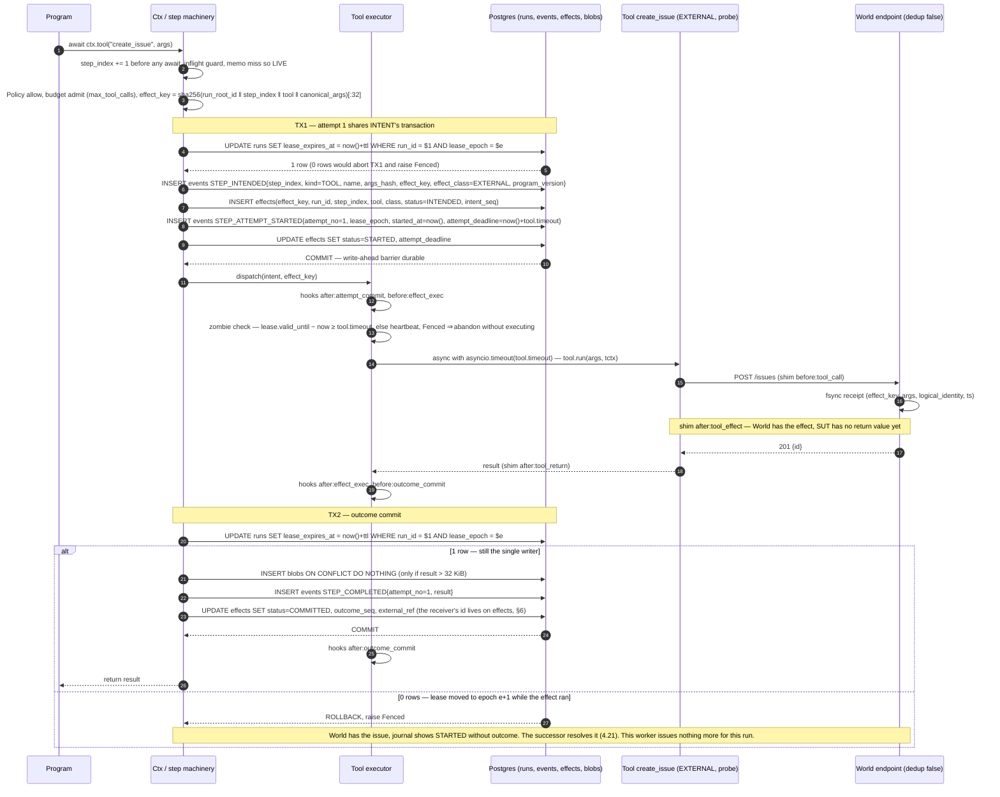

Two branches not drawn: `asyncio.timeout` or a lost connection at message 14 ⇒ TX2 carries STEP_AMBIGUOUS{cause=timeout} and `effects.status = AMBIGUOUS` — for EXTERNAL a timeout is never FAILED, because retrying would duplicate; a `ToolError` carrying a definite "not applied" signal ⇒ STEP_FAILED{retryable, next_attempt_at} (§8, §9 decide which HTTP statuses count as definite). Under `dedup: true` the same sequence passes `effect_key` as the receiver's idempotency key with class IDEMPOTENT; nothing else changes.

### 4.21 Sequence: crash recovery

```mermaid
sequenceDiagram
  autonumber
  participant A as Worker A (epoch 3, killed)
  participant DB as Postgres
  participant R as Reaper (any worker, 1 s tick)
  participant B as Worker B
  participant T as Tool.probe
  participant W as World oracle

  Note over A,W: Step 7 = create_issue (EXTERNAL, probe). A committed STARTED(attempt 1, attempt_deadline = started_at + 30 s), the World fsynced the receipt, A got kill -9 at after:tool_effect.
  A--xDB: heartbeats stop, lease_expires_at passes
  loop every 1 s
    R->>DB: UPDATE runs SET orphaned_at=now(), runnable_at=now() WHERE lease_expires_at < now() AND orphaned_at IS NULL AND NOT EXISTS (effects STARTED, class<>PURE, attempt_deadline > now())
    DB-->>R: 0 rows until attempt_deadline passes, then 1 row (ORPHANED)
  end
  B->>DB: SELECT … FROM runs WHERE … orphaned_at IS NOT NULL … FOR UPDATE SKIP LOCKED
  B->>DB: UPDATE runs SET lease_epoch = lease_epoch+1, lease_owner='B', lease_expires_at = now()+ttl, orphaned_at = NULL WHERE run_id=$1 AND (lease_expires_at IS NULL OR lease_expires_at < now()) RETURNING lease_epoch
  DB-->>B: lease_epoch = 4
  B->>DB: INSERT recoveries(run_id, lease_epoch=4, cause=ORPHANED, started_at) — same transaction as the acquire
  B->>DB: SELECT max(seq) and load events, effects — upcast, fold projections, build memo table
  B->>DB: TX fence(4) ▸ RECOVERY_STARTED{lease_epoch=4, cause=ORPHANED, from_seq, from_segment}
  B->>DB: TX fence(4) ▸ drain inbox (nothing pending)
  B->>B: prog(ctx) re-executes — steps 0..6 memoised: identity checked per kind, recorded outcomes returned, 0 tokens, 0 effects
  B->>B: step 7 — intent identity matches, journal state = STARTED(1) without outcome, class EXTERNAL
  B->>DB: TX fence(4) ▸ STEP_AMBIGUOUS{step 7, attempt 1, cause=started_without_outcome} ▸ effects.status=AMBIGUOUS
  Note over B: run phase WAITING_RESOLUTION while the declared resolution runs
  B->>T: probe(effect_key, args)
  T->>W: oracle query by logical_identity / effect_key
  W-->>T: COMMITTED{external_ref} or ABSENT or UNKNOWN
  alt COMMITTED
    B->>DB: TX fence(4) ▸ STEP_RESOLVED{step 7, resolution=RESOLVED_COMPLETED, method=probe, evidence={external_ref, result}} ▸ effects.status=COMMITTED
    B->>B: ctx.tool returns evidence.result to the program — no re-execution
    B->>DB: TX fence(4) ▸ RECOVERY_COMPLETED{live_from_step=8, replayed_steps=7, elapsed_ms} ▸ UPDATE recoveries SET completed_at, outcome=LIVE
    B->>B: step 8 executes LIVE
  else ABSENT
    B->>DB: TX fence(4) ▸ STEP_RESOLVED{step 7, RESOLVED_FAILED, method=probe}
    B->>DB: TX fence(4) ▸ RECOVERY_COMPLETED{live_from_step=7, replayed_steps=7, elapsed_ms} ▸ UPDATE recoveries SET completed_at, outcome=LIVE
    B->>DB: TX fence(4) ▸ STEP_ATTEMPT_STARTED{attempt 2, attempt_deadline} then execute with the SAME effect_key (at-least-once)
  else UNKNOWN, or resolution = escalate
    B->>DB: TX fence(4) ▸ STEP_RESOLVED{step 7, RESOLVED_UNKNOWN} ▸ RUN_SUSPENDED{reason=resolved_unknown}
    B->>DB: UPDATE recoveries SET completed_at, outcome=SUSPENDED ▸ release lease (lease_expires_at = NULL, runnable_at = NULL)
    Note over B,DB: the sequence ENDS here — no RECOVERY_COMPLETED, no live step. A human decides with keel signal; L3 counts it as surfaced.
  end
```

RECOVERY_COMPLETED sits inside the branches for two reasons. It must: §4.2 says a recovery completes at RECOVERY_COMPLETED *or* RUN_SUSPENDED, and appending it after a release on a SUSPENDED run would have worker B running step 8 on a run that is waiting for a human. And it should: recovery latency is measured to RECOVERY_COMPLETED, so in the ABSENT branch the event is appended *before* attempt 2 starts (`live_from_step=7`, because attempt 2 is live work) — otherwise Keel's latency would include a full `tool.timeout` of real tool execution while every other runtime is measured to its first live step.

Two things the diagram proves, and one it does not. Proved: (i) A cannot append anything after B's acquire, because every A transaction begins with the fence on epoch 3; (ii) B cannot start before `attempt_deadline`, because the reaper's predicate holds the row until then. Not proved, and not claimed: that A can no longer touch the World. Fencing protects journal appends and TRANSACTIONAL effects; it cannot fence a third-party API. A SIGSTOPped task hits nothing until SIGCONT, and `asyncio.timeout`'s cancellation is delivered only when the loop next runs, so a request can still leave A *after* resume — possibly after B's probe — which is exactly the residual §4.7 locates between the last await and the socket write. The probe is therefore point-in-time (TOCTOU): ABSENT followed by a late-landing A request is a duplicate that the World log shows and S1 counts against the tool's `at_least_once` claim, and S6/C3 may be violated for EXTERNAL under `pause_past_ttl`. The verifier reports it; this document does not argue it away. Section-local decisions in the diagram: WAITING_RESOLUTION is the phase between STEP_AMBIGUOUS and STEP_RESOLVED while a probe executes (lease held for a short probe; a probe with backoff releases it with `wake_at`); RESOLVED_UNKNOWN goes to SUSPENDED as the constitution lists; the probe's returned object is the step result and travels in `STEP_RESOLVED.evidence`; RESOLVED_FAILED takes the same retry path as FAILED because `assume_failed` is defined as "retry ⇒ at-least-once".


## 5. Data model

Keel stores three kinds of rows and refuses to blur them. The **journal** (`events`, `blobs`) is the only truth about what a run did; it is append-only and written by exactly one lease holder per run. The **control plane** (`runs` lease columns, `signals`, `recoveries`, `replays`, `programs`, `artifacts`) holds facts that someone who is *not* the lease holder must be able to write — the reaper, the API, a child's worker, a CLI verify pass — or that must be queryable without folding a journal. **Materialised mirrors** (`effects`, `delegations`) are rows written in the same transaction as the event they mirror, kept because a database constraint or a reaper predicate needs them as a row rather than as a fold. Everything else the brief calls an entity — Step, ModelCall, ToolCall, Approval, Budget, plan, context — is a **projection** (§4): a pure fold over `events`, never stored (until `checkpoints`, Future).

Where this departs from a generic engine's history is worth naming up front. Temporal-style or DBOS-style history stores an activity's inputs and its result. Keel's `STEP_INTENDED` additionally stores the full model request as the *decision input* (blob + `request_hash`) and the tool's declared effect class, and its `STEP_ATTEMPT_STARTED` charges a token reservation before the call is made — the three columns that let recovery reason about decisions, risk and cost rather than only about results.

### 5.1 Entity map

| Brief entity | Where it lives in Keel | Materialised? |
|---|---|---|
| Run | `runs` row (control plane + phase cache) + `RUN_*` events | table + journal |
| Event | `events` | table |
| Step | `steps` projection over `STEP_*` events, keyed by `(run_id, step_index)` | projection |
| ModelCall | a Step with `kind = MODEL`: request blob + `request_hash` on `STEP_INTENDED`, response + usage + `provider_meta` on `STEP_COMPLETED` | projection |
| ToolCall | a Step with `kind = TOOL`; its effect row is the ToolEffect | projection |
| ToolEffect | `effects` row (one per TOOL step, keyed by `effect_key`) | materialised mirror |
| Checkpoint | continuation segment = `SEGMENT_STARTED` event (v1); projection cache = `checkpoints` (Future) | event / future table |
| Approval | `approvals` projection over `APPROVAL_REQUESTED` / `APPROVAL_DECIDED`, joined at read time to the `signals` row that decided it | projection |
| Agent | `programs` row (the definition); an agent *instance* is a run | table |
| ChildRun | `runs` row with `parent_run_id` | table |
| Delegation | `delegations` row mirroring `CHILD_SPAWNED{contract}` | materialised mirror |
| Budget | `budget` projection: declared on `RUN_CREATED`, charged by `STEP_ATTEMPT_STARTED` / `STEP_CHUNK` / `STEP_COMPLETED` / `CHILD_SPAWNED` / `CHILD_COMPLETED` | projection |
| FailureInjection | `faults` (Crashproof store) | Parquet/JSONL |
| RecoveryAttempt | `recoveries` row (written at lease acquisition) + `RECOVERY_STARTED` / `RECOVERY_COMPLETED` | table + journal |
| Replay | `replays` row (VERIFY and FORK passes); a FORK is additionally a new `runs` row with `fork_of_run_id` | table |
| Artifact | `artifacts` row → `blobs` | table |

Projections that exist but have no table: `run` (phase, open step, waiting reason), `steps`, `effects` (a view over the mirror), `budget`, `plan`, `context` (messages after the last `COMPACT` outcome), `approvals`, `children`. A projection bug is fixed by re-folding, never by editing rows (§4).

### 5.2 Schema overview

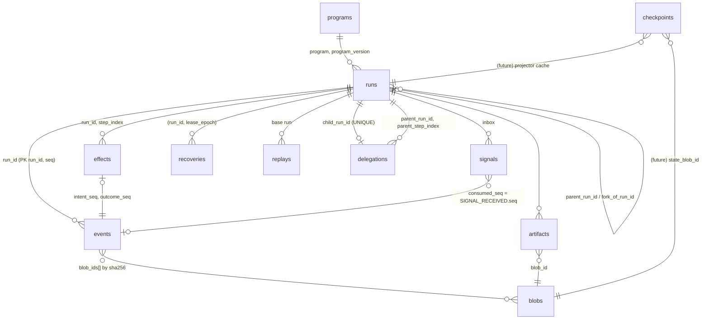

### 5.3 Journal tables

#### `events`

```sql
CREATE TABLE events (
  run_id          uuid        NOT NULL REFERENCES runs(run_id),
  seq             bigint      NOT NULL,                -- per-run, assigned by the lease holder
  ts              timestamptz NOT NULL DEFAULT now(),  -- Postgres clock, never the worker's
  type            text        NOT NULL,                -- discriminator of the Pydantic union (§6)
  schema_version  smallint    NOT NULL,
  lease_epoch     bigint      NOT NULL,                -- 0 only for RUN_CREATED
  program_version text        NOT NULL,
  causation_seq   bigint,
  trace_id        uuid        NOT NULL,                -- root run id of the delegation tree
  step_index      int,                                 -- denormalised from payload where present
  attempt_no      smallint,                            -- denormalised for attempt-scoped events
  payload         jsonb       NOT NULL,                -- body fields; large values replaced by blob refs
  blob_ids        bytea[]     NOT NULL DEFAULT '{}',   -- sha256 keys into blobs
  PRIMARY KEY (run_id, seq),
  FOREIGN KEY (run_id, causation_seq) REFERENCES events(run_id, seq)
);
CREATE INDEX events_step_idx  ON events (run_id, step_index, seq) WHERE step_index IS NOT NULL;
CREATE INDEX events_trace_idx ON events (trace_id, ts);
-- natural-key guards: a duplicate append is a constraint violation, never a silent second row
CREATE UNIQUE INDEX events_intent_once     ON events (run_id, step_index)            WHERE type = 'STEP_INTENDED';
CREATE UNIQUE INDEX events_attempt_once    ON events (run_id, step_index, attempt_no) WHERE type = 'STEP_ATTEMPT_STARTED';
CREATE UNIQUE INDEX events_outcome_once    ON events (run_id, step_index, attempt_no)
  WHERE type IN ('STEP_COMPLETED','STEP_FAILED','STEP_AMBIGUOUS');
CREATE UNIQUE INDEX events_recovery_once   ON events (run_id, lease_epoch)            WHERE type = 'RECOVERY_STARTED';
CREATE UNIQUE INDEX events_terminal_once   ON events (run_id) WHERE type IN ('RUN_COMPLETED','RUN_FAILED','RUN_CANCELLED');
CREATE UNIQUE INDEX events_superseded_once ON events (run_id) WHERE type = 'RUN_SUPERSEDED';
CREATE UNIQUE INDEX events_segment_once    ON events (run_id, (payload->>'segment_no')) WHERE type = 'SEGMENT_STARTED';
CREATE UNIQUE INDEX events_approval_once   ON events (run_id, step_index)               WHERE type = 'APPROVAL_REQUESTED';
CREATE UNIQUE INDEX events_resolved_once   ON events (run_id, step_index, (payload->>'method'))
  WHERE type = 'STEP_RESOLVED';                 -- one resolution per (step, method): probe once, human once
CREATE UNIQUE INDEX events_patch_once      ON events (run_id, (payload->>'name'))       WHERE type = 'PATCH_APPLIED';
```

Why it exists: it is the run. `seq` is assigned by the lease holder (`max(seq)+1` read once at acquisition, then incremented in memory; a PK violation on a *first* append is a runtime bug, not a fault, because the fence guarantees no other writer — on the re-append after an in-doubt commit it is expected, and is the proof that the commit landed, §6.4). Rows are never `UPDATE`d or `DELETE`d; retention archives whole runs (§21). `step_index` and `attempt_no` are copied out of `payload` purely so that partial unique indexes can express the step-lifecycle invariants (one INTENT per step, one STARTED per attempt, at most one terminal outcome per attempt, one resolution per (step, method), one approval request per step, one RECOVERY_STARTED per epoch, one terminal run event). These constraints enforce the attempt-level half of S5 — at most one terminal outcome per attempt, one INTENT per step — in the database; the other half, "no attempt after a completion", remains a runtime invariant, checked by the verifier and the Hypothesis suite (§12). `RUN_SUPERSEDED` gets its own guard because a base run may already hold a terminal event when it is superseded by a fork (§5.4 (2b)). `ts` is the append transaction's *start* time (`now()` = `transaction_timestamp()`, not commit time), and that is exactly why S4 holds: for a STARTED, `ts` ≤ commit < effect dispatch < World receipt, so `STARTED.ts < receipt.ts` compares the earlier of the two Postgres instants against the World process's own clock on the same host. Cross-host skew is the v2 `clock_skew` fault; the worker's clock is never journaled.

#### `blobs`

```sql
CREATE TABLE blobs (
  blob_id     bytea   PRIMARY KEY,                -- sha256(content), 32 bytes
  size_bytes  int     NOT NULL,
  media_type  text    NOT NULL,                   -- application/json, text/plain, …
  encoding    text    NOT NULL DEFAULT 'identity',-- 'zstd' is §21's decision
  content     bytea   NOT NULL,
  created_at  timestamptz NOT NULL DEFAULT now()
);
```

Why it exists: any payload field > 32 KiB (prompts, model outputs, tool outputs, `Continue(state)` blobs, diffs) is content-addressed here and referenced by hash. Insertion is `ON CONFLICT (blob_id) DO NOTHING` — the same prompt repeated across attempts, forks and recoveries is stored once, and a retried insert is a no-op by construction. Blobs are always written **before** the fenced append that references them, in their own transaction — never inside it (§5.10): a fenced or crashed writer can then leave at most an orphan blob (harmless, collected with retention), never an event pointing at a missing blob. `blob_write_fail` therefore splits by side. On the INTENT side the append never happens and the step never STARTED. On the outcome side the effect has already executed: the outcome cannot commit, the attempt stays STARTED-without-outcome, and the next recovery disposes it by effect class — EXTERNAL ⇒ AMBIGUOUS, PURE/IDEMPOTENT ⇒ re-run, TRANSACTIONAL ⇒ provably not applied (§8.3). The worker retries the blob write while its lease holds; it never journals an outcome without its blob. There is no FK from `events.blob_ids` to `blobs` (arrays cannot carry one); integrity is by immutability — a hash never changes meaning.

### 5.4 Control plane: `runs`

```sql
CREATE TABLE runs (
  run_id            uuid PRIMARY KEY,                  -- UUIDv7 from keel/core/ids (time-ordered)
  run_root_id       uuid NOT NULL,                     -- = run_id unless this run is a FORK
  parent_run_id     uuid REFERENCES runs(run_id),      -- child runs
  fork_of_run_id    uuid REFERENCES runs(run_id),      -- FORK: prefix < fork_seq is read from this run
  fork_seq          bigint,
  program           text NOT NULL,
  program_version   text NOT NULL,                     -- 'declared@codehash'
  keel_version      text NOT NULL,
  model_config      jsonb NOT NULL,                    -- provider binding; changes only via MODEL_BINDING_CHANGED
  phase             text NOT NULL DEFAULT 'CREATED',   -- CACHE of the journal phase, see below
  -- control plane: never in the journal
  lease_owner       text,                              -- worker id of the last acquirer
  lease_epoch       bigint NOT NULL DEFAULT 0,         -- fencing token
  lease_expires_at  timestamptz,                       -- NULL = released; < now() = lapsed; >= now() = live
  runnable_at       timestamptz,                       -- earliest claim instant; NULL = not claimable
  runnable_reason   text,                              -- START | WAKE | DRAIN | RESUME | ORPHANED
  wake_at           timestamptz,                       -- timer target (sleep, approval expiry)
  orphaned_at       timestamptz,                       -- set by the reaper; cleared by the heartbeat and by acquire
  paused_at         timestamptz,                       -- set with RUN_PAUSED, cleared with RUN_PAUSE_LIFTED
  terminal_at       timestamptz,                       -- set with the terminal event, in that event's transaction
  attempt_deadline  timestamptz,                       -- open non-PURE attempt's deadline, else NULL
  created_at        timestamptz NOT NULL DEFAULT now(),
  updated_at        timestamptz NOT NULL DEFAULT now(),
  CONSTRAINT runs_phase_chk CHECK (phase IN ('CREATED','RUNNING','WAITING_APPROVAL','WAITING_CHILDREN',
    'SLEEPING','WAITING_SIGNAL','WAITING_RESOLUTION','PAUSED','SUSPENDED',
    'COMPLETED','FAILED','CANCELLED','SUPERSEDED')),
  CONSTRAINT runs_reason_chk CHECK (runnable_reason IN ('START','WAKE','DRAIN','RESUME','ORPHANED')),
  CONSTRAINT runs_fork_chk   CHECK ((fork_of_run_id IS NULL) = (fork_seq IS NULL)),
  FOREIGN KEY (program, program_version) REFERENCES programs(program, program_version)
);
CREATE INDEX runs_claim_idx  ON runs (runnable_at)
  WHERE runnable_at IS NOT NULL AND terminal_at IS NULL;
CREATE INDEX runs_lease_idx  ON runs (lease_expires_at) WHERE lease_expires_at IS NOT NULL;
CREATE INDEX runs_timer_idx  ON runs (wake_at)          WHERE wake_at IS NOT NULL;
-- non-terminal children of a parent: the reaper's liveness sweep (§17.7)
CREATE INDEX runs_parent_idx ON runs (parent_run_id)    WHERE parent_run_id IS NOT NULL AND terminal_at IS NULL;
CREATE INDEX runs_root_idx   ON runs (run_root_id);
```

Why it exists: Postgres is the queue and the lock service (§22.1). The row is the unit the scheduler claims with `SELECT … FOR UPDATE SKIP LOCKED`, the row the reaper judges, and the row whose lock serialises every writer. Two column groups must not be confused:

**Journal-projected state, cached.** `phase` is a copy of the projected run phase, written by the lease holder in the same transaction as the event that changes it (`RUN_WAITING` → `WAITING_*`, `RUN_COMPLETED` → `COMPLETED`, …). It exists so that `keel runs`, the claim query and the liveness rule (find non-terminal children of a terminal parent) do not fold ten thousand journals; it can never disagree with the journal because it commits with the event, and a re-fold repairs it if a projector bug ever did (section-local decision). `terminal_at` and `paused_at` are written the same way — with the terminal event (`RUN_COMPLETED | RUN_FAILED | RUN_CANCELLED | RUN_SUPERSEDED`) and with `RUN_PAUSED` / `RUN_PAUSE_LIFTED` — so that the claim, orphan and takeover predicates test one column instead of a phase list (§7.2, §18.4). `model_config` and `program_version` are likewise the *current binding* — the journal holds the history (`RUN_CREATED`, `MODEL_BINDING_CHANGED`, `VERSION_VERIFIED`), the column holds what the next LIVE step will use.

**Control-plane state, never journaled.** The lease columns describe *who may write*, which by definition cannot be written by the writer alone: the reaper marks orphans, the API wakes waiters, the scheduler acquires. Their meaning is exact:

| `lease_expires_at` | `runnable_at` | Meaning | Who may change it next |
|---|---|---|---|
| NULL | NULL | released and not claimable: waiting on an approval, a child, a signal or a timer (`wake_at` set for the timed waits), or terminal | signal insert — API, child worker, or the timer sweep when `wake_at` comes due |
| NULL | ≤ now() | released and claimable: created, drained, or woken by a signal | `acquire` |
| ≥ now() | NULL | **live**: `lease_owner` at `lease_epoch` is the single writer | holder (heartbeat, release) |
| ≥ now() | ≤ now() | live, **and** a signal arrived after acquisition (pending-wake flag) | holder drains, then clears it |
| < now() | any | **lapsed**: holder missed heartbeats; may still re-heartbeat (which also clears `orphaned_at`). It becomes claimable through the reaper's ORPHAN, which itself waits for `attempt_deadline` — or directly by `acquire` if a signal had already set `runnable_at` — in both cases only once `attempt_deadline` has passed. Recovery latency after a silent crash is therefore lease TTL + reaper period, which is what §14.3 measures | holder, reaper or `acquire` — serialised by the row lock |

**One wake mechanism, not two (section-local decision).** `runnable_at` is never in the future: every wake — timer, approval decision, child result, manual resume — arrives as a `signals` row, and the insert below sets `runnable_at = now()`. `wake_at` is the timer *target* that the scheduler's sweep reads, not a claim instant; the sweep turns a due `wake_at` into a `timer` signal (the constitution lists timers among the inbox's writers), the woken holder drains it, and the `SLEEP` step's outcome — or `APPROVAL_DECIDED{decision=expired, signal_id}` — cites that `signal_id`. `acquire` clears `wake_at`, so a stale target cannot re-fire the sweep. Releasing straight to a future `runnable_at` would be a second, silent wake path that races the first.

`orphaned_at` is set by the reaper and cleared by acquire or by a successful late heartbeat; the API derives the `ORPHANED` status as `orphaned_at IS NOT NULL` (§7.2.2), and `RECOVERING` as *live lease ∧ last `RECOVERY_STARTED` has no `RECOVERY_COMPLETED`*. `attempt_deadline` mirrors the open non-PURE attempt's deadline (also stored per effect in `effects.attempt_deadline`) so the reaper's predicate is a single-row comparison, not a join (section-local decision).

The control-plane statements — the constitution's four, with the acquire split into a queue pop and a targeted variant. Every one is a single conditional `UPDATE` whose `WHERE` re-checks the state it assumes; under READ COMMITTED a row-locking `UPDATE` that waits on a concurrent writer re-evaluates its `WHERE` against the committed row, which is why two reapers, reaper-vs-heartbeat and heartbeat-vs-acquire races all resolve to "one wins, the other sees 0 rows".

```sql
-- (1) FENCE = HEARTBEAT. First statement of every append transaction; alone, on a timer, it is the heartbeat.
UPDATE runs SET lease_expires_at = now() + $ttl, orphaned_at = NULL, updated_at = now()
 WHERE run_id = $run AND lease_epoch = $epoch AND lease_expires_at IS NOT NULL;
-- 0 rows ⇒ ROLLBACK; this worker issues no further steps or effects for $run.

-- (2a) ACQUIRE, queue pop. The scheduler's claim; a reaper takeover reaches it after ORPHAN set runnable_at.
WITH cand AS (
  SELECT run_id, runnable_reason, (lease_expires_at IS NOT NULL) AS was_lapsed FROM runs
   WHERE runnable_at <= now()
     AND terminal_at IS NULL
     AND (paused_at IS NULL OR EXISTS (SELECT 1 FROM signals s
           WHERE s.run_id = runs.run_id AND s.consumed_seq IS NULL AND s.type IN ('resume','cancel')))
     AND (lease_expires_at IS NULL OR lease_expires_at < now())
     AND (attempt_deadline IS NULL OR attempt_deadline < now())
   ORDER BY runnable_at LIMIT 1 FOR UPDATE SKIP LOCKED)
UPDATE runs r
   SET lease_epoch = r.lease_epoch + 1, lease_owner = $worker,
       lease_expires_at = now() + $ttl, runnable_at = NULL, wake_at = NULL,
       orphaned_at = NULL, updated_at = now()
  FROM cand
 WHERE r.run_id = cand.run_id
   AND r.terminal_at IS NULL
   AND (r.lease_expires_at IS NULL OR r.lease_expires_at < now())
RETURNING r.run_id, r.lease_epoch, r.program_version,
          CASE WHEN cand.was_lapsed THEN 'ORPHANED' ELSE cand.runnable_reason END AS cause;
-- same transaction: INSERT INTO recoveries (run_id, lease_epoch, worker_id, cause, from_seq, from_segment) …

-- (2b) ACQUIRE, targeted maintenance. The constitution's own form: one named run, no queue, no phase filter.
UPDATE runs
   SET lease_epoch = lease_epoch + 1, lease_owner = $worker,
       lease_expires_at = now() + $ttl, runnable_at = NULL, wake_at = NULL,
       orphaned_at = NULL, updated_at = now()
 WHERE run_id = $run
   AND (lease_expires_at IS NULL OR lease_expires_at < now())
   AND (attempt_deadline IS NULL OR attempt_deadline < now())
RETURNING lease_epoch;

-- (3) ORPHAN. Reaper, one predicate: now() > max(lease_expires_at, attempt_deadline).
UPDATE runs
   SET orphaned_at = now(),
       runnable_at = now(), runnable_reason = 'ORPHANED', updated_at = now()
 WHERE run_id = $run AND terminal_at IS NULL
   AND lease_expires_at IS NOT NULL AND lease_expires_at < now()
   AND (attempt_deadline IS NULL OR now() > attempt_deadline);

-- (4) RELEASE. Last statement of the RUN_WAITING append transaction (0 rows ⇒ ROLLBACK the event too).
UPDATE runs
   SET lease_expires_at = NULL, runnable_at = NULL, wake_at = $wake_at,
       phase = $waiting_phase, updated_at = now()
 WHERE run_id = $run AND lease_epoch = $epoch
   AND lease_expires_at IS NOT NULL AND runnable_at IS NULL;
-- Every wait releases to runnable_at = NULL; the wake arrives as a signal. $wake_at is NULL for an untimed wait.
-- Drain (SIGTERM) is (4) with runnable_at = now(), runnable_reason = 'DRAIN' and no `runnable_at IS NULL` guard.
```

Deliberate additions to the constitution's statements, each tagged (section-local decision):

- (1) carries `AND lease_expires_at IS NOT NULL` and clears `orphaned_at`. Once a lease has been *released* (NULL — voluntary release, drain, wait, terminal), a heartbeat from the old epoch must not resurrect it: a NULL lease is one the scheduler may hand to anyone. Orphaning does not null the lease (statement (3)), so a *lapsed* lease (non-NULL, in the past) may still be re-heartbeated — that is exactly the "re-heartbeat or abandon" branch of the zombie rule (§8.4) — and a worker that resumes before the takeover un-orphans itself at the same epoch by clearing `orphaned_at` (§7.2.2).
- (2a) and (3) test `terminal_at IS NULL` rather than a phase list, and (2a) additionally refuses a `paused_at` run unless an unconsumed `resume`/`cancel` sits in its inbox — the claim predicate of §18.4. Both columns are single-column control-plane facts committed with their events, which is what makes claim, orphan and takeover one comparison each instead of a set membership test.
- (2a) carries `attempt_deadline` in both the candidate filter and the `WHERE`. A signal insert sets `runnable_at = now()` on a held run (the pending-wake flag); if that holder then lapses mid-effect, the run satisfies `runnable_at <= now() AND lease_expires_at < now()` and the scheduler would claim it *before* the open attempt's deadline, bypassing the reaper's predicate (§8.4). The predicate therefore lives in `acquire` as well as `orphan`; it costs one column comparison.
- (2a) derives the recovery **cause** from the lease it found, not from `runnable_reason`. A lapsed lease is a crash however `runnable_at` came to be set, so the pending-wake path cannot make a takeover-after-death look like a `WAKE`: `CASE WHEN cand.was_lapsed THEN 'ORPHANED' …` is computed in the CTE because `RETURNING` sees the *new* row. `RECOVERY_STARTED.cause` and `recoveries.cause` are the benchmark's recovery-cause column (§14.3); mislabelling them would mix orphan recoveries into wake latencies. (The clearing of `orphaned_at` is unaffected — §7.2.2 owns the ORPHANED status, this owns the label of the recovery.)
- (2b) is the constitution's own targeted acquire — one named run, no `runnable_at` and no phase filter — kept for the callers the queue can never serve. `keel fork --supersede` must become the single writer of a base run that is SUSPENDED (released with `runnable_at` NULL) or already terminal in order to append `RUN_SUPERSEDED`; force-cancel takeover of a child (§7.6.2) uses the same statement. It keeps the `attempt_deadline` conjunct, so it can never jump an open non-PURE attempt, and it inserts its `recoveries` row and appends `RECOVERY_STARTED` like any other acquisition — with the existing `RESUME` cause, since a supersede is a manual CLI act; the five journaled causes of §5.7's `CHECK` are unchanged. `RUN_SUPERSEDED` is the one event Keel appends to a run whose `terminal_at` is already set, which is why `events_terminal_once` does not cover it and `events_superseded_once` exists. The holder releases with `lease_expires_at = NULL, runnable_at = NULL` and never re-executes the program.
- (4) requires `runnable_at IS NULL`. `runnable_at` is NULL from acquisition until a signal arrives; a signal insert sets it to `now()` under the same row lock. A release that finds it non-NULL has raced a signal it has not drained: the transaction rolls back (no `RUN_WAITING` is appended), the worker drains, and retries. This closes the lost-wakeup window without a subquery — a `NOT EXISTS (… signals …)` inside the `UPDATE` would evaluate under the statement's original snapshot after the lock wait and miss the just-committed row.

Three statements complete the wake path: the signal insert — the only write to `runs` from outside the lease — the sweep that feeds it from `wake_at`, and the holder's clear of the pending-wake flag at the end of a drain:

```sql
-- (5) SIGNAL INSERT. The wake is conditional on the insert: a client_key duplicate must not re-arm the flag.
WITH ins AS (
  INSERT INTO signals (signal_id, run_id, type, payload, client_key, source) VALUES (…)
    ON CONFLICT (run_id, client_key) WHERE client_key IS NOT NULL DO NOTHING
  RETURNING run_id)
UPDATE runs
   SET runnable_at = now(), updated_at = now(),
       runnable_reason = CASE WHEN runnable_at IS NULL THEN $reason ELSE runnable_reason END
 WHERE run_id = $run AND terminal_at IS NULL AND EXISTS (SELECT 1 FROM ins);
SELECT pg_notify('keel_runnable', $run::text);

-- (6) TIMER SWEEP (scheduler, every 1 s). Due timers become ordinary signals; each row then runs (5).
INSERT INTO signals (signal_id, run_id, type, payload, client_key, source)
SELECT gen_random_uuid(), run_id, 'timer', jsonb_build_object('wake_at', wake_at),
       'timer:' || wake_at, 'scheduler:timer'
  FROM runs WHERE wake_at <= now() AND terminal_at IS NULL AND lease_expires_at IS NULL
  ON CONFLICT (run_id, client_key) WHERE client_key IS NOT NULL DO NOTHING;

-- (7) CLEAR THE PENDING-WAKE FLAG. Last statement of the drain transaction; safe because (5) took the same row lock.
UPDATE runs SET runnable_at = NULL, updated_at = now()
 WHERE run_id = $run AND lease_epoch = $epoch AND runnable_at <= now();
```

`$reason` is `'RESUME'` for a `resume` signal and `'WAKE'` otherwise, so `RECOVERY_STARTED.cause` can tell a manual resume from a child's completion notice — but only when the lease was *not* lapsed, since (2a) overrides both with `ORPHANED` in that case.

```mermaid
sequenceDiagram
    participant W1 as worker A (epoch 5, paused past TTL)
    participant PG as runs row (Postgres, row lock)
    participant R as reaper
    participant W2 as worker B
    R->>PG: UPDATE … orphan WHERE lease_expires_at < now() AND attempt_deadline < now()
    PG-->>R: 1 row: orphaned_at=now(), runnable_at=now(), reason=ORPHANED (lease left lapsed)
    W2->>PG: acquire (FOR UPDATE SKIP LOCKED) … RETURNING lease_epoch=6
    PG-->>W2: 1 row; INSERT recoveries(run, 6, cause=ORPHANED)
    W1->>PG: BEGIN; UPDATE runs SET lease_expires_at=… WHERE lease_epoch=5 AND lease_expires_at IS NOT NULL
    PG-->>W1: 0 rows (epoch is 6) → ROLLBACK, fenced; outcome never journaled
    W2->>PG: BEGIN; fence(epoch 6) → 1 row; INSERT events RECOVERY_STARTED{6, ORPHANED}; COMMIT
```

### 5.5 Materialised mirrors

#### `effects`

```sql
CREATE TABLE effects (
  effect_key        char(32) PRIMARY KEY,   -- sha256(run_root_id‖step_index‖tool‖canonical_args) hex[:32]
  run_id            uuid NOT NULL REFERENCES runs(run_id),
  run_root_id       uuid NOT NULL,
  step_index        int  NOT NULL,
  tool              text NOT NULL,
  class             text NOT NULL CHECK (class IN ('PURE','IDEMPOTENT','EXTERNAL','TRANSACTIONAL')),
  modifiers         text[] NOT NULL DEFAULT '{}',        -- STREAMS, LOCAL_FS
  status            text NOT NULL CHECK (status IN ('INTENDED','STARTED','COMMITTED','ABSENT','AMBIGUOUS',
                      'RESOLVED_COMMITTED','RESOLVED_ABSENT','RESOLVED_UNKNOWN','CANCELLED','DENIED')),
  attempt_no        smallint NOT NULL DEFAULT 0,         -- latest attempt
  intent_seq        bigint NOT NULL,
  started_seq       bigint,
  outcome_seq       bigint,
  attempt_deadline  timestamptz,
  resolution        text CHECK (resolution IN ('probe','assume_failed','assume_succeeded','escalate')),
  external_ref      text,                                -- receiver's id (issue number, message id)
  approval_id       uuid,                                -- set when gated; S7 binding
  synthetic         boolean NOT NULL DEFAULT false,      -- FORK-injected outcome
  updated_at        timestamptz NOT NULL DEFAULT now(),
  UNIQUE (run_id, step_index),
  FOREIGN KEY (run_id, intent_seq) REFERENCES events(run_id, seq)
);
CREATE INDEX effects_open_idx    ON effects (run_id) WHERE status = 'STARTED' AND class <> 'PURE';
CREATE INDEX effects_pending_idx ON effects (status) WHERE status IN ('AMBIGUOUS','RESOLVED_UNKNOWN');
```

Why it exists: the primary key is the point. `effect_key` is stable across attempts and recoveries and unique per logical effect across the run root; making it a PK turns "the runtime accidentally issued the same effect twice" into a unique violation at INTENT commit — loud, transactional, and impossible to skip silently. Rows are written in the same transaction as the `STEP_INTENDED` / `STEP_ATTEMPT_STARTED` / outcome events (transactional-outbox discipline inside one database), so the table can never lead or lag the journal. Every TOOL step gets a row regardless of class — PURE rows carry `class = 'PURE'` and are ignored by the reaper predicate, but S4 ("every World receipt has a prior STARTED") and `keel effects` want one code path. MODEL steps have no row: their "effect" is the provider's bill, which the budget projection tracks. Status values are the tool-effect lifecycle of §7 (INTENDED, STARTED, COMMITTED, ABSENT, AMBIGUOUS, RESOLVED_COMMITTED, RESOLVED_ABSENT, RESOLVED_UNKNOWN, CANCELLED, DENIED) — names chosen here (section-local decision) and constrained by a `CHECK` like every other enum column, so a projector that invents a state fails loudly instead of poisoning the verifier's queries; they must stay identical to §7's machine. The verifier's `sut_committed_set` is `SELECT effect_key WHERE status IN ('COMMITTED','RESOLVED_COMMITTED')`. `char(32)` is the first 32 hex characters (128 bits) of the digest — the constitution's `[:32]` is read as hex characters, which is what a receiver's `Idempotency-Key` header expects.

#### `delegations`

```sql
CREATE TABLE delegations (
  delegation_id      uuid PRIMARY KEY,
  parent_run_id      uuid NOT NULL REFERENCES runs(run_id),
  parent_step_index  int  NOT NULL,
  child_run_id       uuid NOT NULL UNIQUE REFERENCES runs(run_id),
  role               text NOT NULL CHECK (role IN ('worker','verifier')),
  contract           jsonb NOT NULL,   -- {task, result_schema, budget_slice, deadline, allowed_tools, on_failure, on_parent_cancel}
  budget_reserved    jsonb NOT NULL,
  status             text NOT NULL CHECK (status IN ('SPAWNED','COMPLETED','FAILED','CANCELLED')),
  usage_settled      jsonb,
  spawned_seq        bigint NOT NULL,  -- parent's CHILD_SPAWNED
  settled_seq        bigint,           -- parent's CHILD_COMPLETED / CHILD_FAILED
  created_at         timestamptz NOT NULL DEFAULT now(),
  updated_at         timestamptz NOT NULL DEFAULT now()
);
CREATE INDEX delegations_parent_idx ON delegations (parent_run_id, parent_step_index);
```

Why it exists: the contract is the only thing parent and child share, and three actors that are not the parent's writer need it as a row: the child's worker (to validate its own result against `result_schema` before signalling and to enforce `allowed_tools`), the reaper (liveness rule: a child cannot outlive its parent's terminal state; it walks `runs.parent_run_id` and takes over leases), and the budget projection of the parent (Σ reservations ≤ remaining). It is written in the same transaction as `CHILD_SPAWNED` and the child's `runs` + `RUN_CREATED` rows (§5.10). Truth remains the `CHILD_*` events.

### 5.6 Inbox: `signals`

```sql
CREATE TABLE signals (
  signal_id     uuid PRIMARY KEY,
  run_id        uuid NOT NULL REFERENCES runs(run_id),
  type          text NOT NULL CHECK (type IN ('approve','reject','cancel','pause','resume','rebind',
                                              'child_result','timer','custom')),
  payload       jsonb NOT NULL,
  client_key    text,                               -- caller-supplied dedup key
  source        text NOT NULL,                      -- 'api:<principal>' | 'worker:<child_run_id>' | 'scheduler:timer'
  created_at    timestamptz NOT NULL DEFAULT now(),
  consumed_seq  bigint,                             -- seq of the SIGNAL_RECEIVED / SIGNAL_IGNORED that drained it
  FOREIGN KEY (run_id, consumed_seq) REFERENCES events(run_id, seq)
);
CREATE UNIQUE INDEX signals_client_key ON signals (run_id, client_key) WHERE client_key IS NOT NULL;
CREATE INDEX signals_inbox_idx ON signals (run_id, created_at) WHERE consumed_seq IS NULL;
```

Why it exists: it is the only path by which anything that is not the lease holder influences a run. API → inbox is at-least-once (a retried `approve` inserts twice unless `client_key` is set); a signal is then **consumed atomically with its `SIGNAL_RECEIVED`**, because the append and `UPDATE signals SET consumed_seq = $seq WHERE signal_id = $s AND consumed_seq IS NULL` commit in one fenced transaction — the same same-database-transaction argument that gives TRANSACTIONAL tools their guarantee, and the only kind of guarantee Keel makes without a receiver's cooperation. Child completion notices use `client_key = 'child_result:' || child_run_id` and are inserted by the *child's own holder in the same transaction as the child's terminal event* (§5.10), so a child cannot become terminal without its parent's wake being durable; cancel fan-out uses `'cancel:' || parent_run_id || ':' || seq` in the parent's `CANCEL_ACKNOWLEDGED` transaction for the same reason. The timer sweep uses `'timer:' || wake_at`, so two schedulers firing the same timer produce one row. A drained signal whose target step is already terminal becomes `SIGNAL_IGNORED{reason}` and is still consumed. Signals addressed to a run that is *already* terminal are refused by the API with 409 before the insert — there is no future holder to drain them (section-local decision) — and a `child_result` or `timer` row that races the terminal event stays unconsumed and is dropped with the run at retention (§21); the inbox never grows unbounded on late clicks.

### 5.7 Recovery and replay records

#### `recoveries`

```sql
CREATE TABLE recoveries (
  run_id          uuid NOT NULL REFERENCES runs(run_id),
  lease_epoch     bigint NOT NULL,
  worker_id       text NOT NULL,
  cause           text NOT NULL CHECK (cause IN ('START','WAKE','ORPHANED','RESUME','DRAIN')),
  acquired_at     timestamptz NOT NULL DEFAULT now(),
  from_seq        bigint NOT NULL,                  -- journal head at acquisition
  from_segment    int NOT NULL DEFAULT 0,
  verified        boolean NOT NULL DEFAULT false,   -- a shadow VERIFY preceded re-execution
  started_seq     bigint,                           -- RECOVERY_STARTED
  completed_seq   bigint,                           -- RECOVERY_COMPLETED
  completed_at    timestamptz,
  live_from_step  int,
  replayed_steps  int,
  replay_ms       int,
  outcome         text CHECK (outcome IN ('LIVE','WAITING','TERMINAL','SUSPENDED','FENCED','RELEASED',
                                          'CRASHED','FORCED_CANCEL')),
  released_at     timestamptz,
  PRIMARY KEY (run_id, lease_epoch)
);
```

Why it exists: it records recoveries the journal *cannot*. The row is inserted in the acquisition transaction, before the worker has appended anything. A worker that acquires and dies before `RECOVERY_STARTED` — a crash-loop under `kill` at `before:intent_commit` — leaves a row with `started_seq IS NULL`; the journal shows nothing, but L2 (bounded recoveries) must count it. `outcome = 'CRASHED'` is written retroactively by the *next* acquirer for the previous epoch, and the predicate matters: `WHERE run_id = $r AND lease_epoch = $e - 1 AND released_at IS NULL AND (outcome IS NULL OR outcome = 'LIVE')` (section-local decision). An epoch that drained, released voluntarily or was fenced has already written its own outcome and is never overwritten; an epoch that reached `RECOVERY_COMPLETED` and *then* died is `CRASHED` with its `completed_seq` and `replay_ms` intact, so "how far did the replay get" and "how did the epoch end" stay separable in the L2 and recovery-latency joins. `outcome = 'FORCED_CANCEL'` is the takeover writer's row (§7.6.2), which cancels the child rather than re-executing its program. Recovery latency for the benchmark is `completed_at − fault.trigger_observed_at`, joined on `(run_id, lease_epoch)`; `completed_seq` is the `RECOVERY_COMPLETED` the latency is stamped against.

#### `replays`

```sql
CREATE TABLE replays (
  replay_id        uuid PRIMARY KEY,
  run_id           uuid NOT NULL REFERENCES runs(run_id),   -- base run
  mode             text NOT NULL CHECK (mode IN ('VERIFY','FORK')),
  requested_by     text NOT NULL,                           -- cli | api | worker:shadow | crashproof | ci
  program_version  text NOT NULL,                           -- code that performed the pass
  base_seq         bigint NOT NULL,                         -- head at verify time, or fork_seq
  fork_run_id      uuid REFERENCES runs(run_id),            -- FORK only
  result           text CHECK (result IN ('PASS','NONDETERMINISM','PROMPT_DRIFT','STATE_SCHEMA_MISMATCH','ERROR','SPAWNED')),
  replayed_steps   int,
  elapsed_ms       int,
  projection_hash  bytea,                                   -- terminal runs only (C1)
  diff_blob_id     bytea,                                   -- NondeterminismDetected / PromptDrift diff
  started_at       timestamptz NOT NULL DEFAULT now(),
  finished_at      timestamptz
);
CREATE INDEX replays_run_idx ON replays (run_id, started_at);
```

Why it exists: VERIFY writes nothing to the journal by definition, so without this table a verify pass is a log line. CI, the C1 invariant and `keel replay --verify` need a durable result, and `PROMPT_DRIFT` diffs need somewhere to live that is not the journal (§6.6). For FORK the row is the audit ("who forked, from where, with what overrides"); the overrides themselves are in the fork's `RUN_CREATED{fork_of, overrides}` because the fork's own recovery must re-apply them.

### 5.8 Registry and outputs

#### `programs`

```sql
CREATE TABLE programs (
  program           text NOT NULL,
  program_version   text NOT NULL,          -- 'declared@codehash'
  declared_version  text NOT NULL,
  code_hash         text NOT NULL,           -- sha256 of the program module source tree
  entrypoint        text NOT NULL,           -- 'pkg.module:prog'
  keel_version      text NOT NULL,
  tools             jsonb NOT NULL,          -- name → {class, modifiers, timeout, resolution, has_probe, has_compensate}
  state_schema      jsonb,                   -- JSON schema of Continue(state) (v1)
  patches           text[] NOT NULL DEFAULT '{}',   -- ctx.patched names present (v1)
  registered_at     timestamptz NOT NULL DEFAULT now(),
  PRIMARY KEY (program, program_version)
);
```

Why it exists: a run parked three days on an approval will be resumed by code that no longer exists on any developer's disk. `VERSION_VERIFIED` and `keel diff` need to know what the old version's tool manifest and state schema *were*; the effect class of a tool at INTENT time is part of the recovery decision and must be recoverable even if the tool was re-registered with a different class. `keel worker` upserts every program it can serve at startup (idempotent by PK); `keel run` refuses an unregistered version. This is the brief's Agent entity: the definition, of which a run is one execution.

#### `artifacts`

```sql
CREATE TABLE artifacts (
  artifact_id  uuid PRIMARY KEY,
  run_id       uuid NOT NULL REFERENCES runs(run_id),
  step_index   int,
  lease_epoch  bigint,                          -- NULL for artifacts produced without a lease (export, report, diff)
  kind         text NOT NULL CHECK (kind IN ('result','workspace_snapshot','export','report','diff')),
  name         text NOT NULL,
  blob_id      bytea NOT NULL REFERENCES blobs(blob_id),
  media_type   text NOT NULL,
  size_bytes   int NOT NULL,
  created_at   timestamptz NOT NULL DEFAULT now()
);
CREATE UNIQUE INDEX artifacts_name_idx ON artifacts (run_id, kind, name, coalesce(lease_epoch, 0));
```

Why it exists: things a human fetches by name — the final result document, a `Sandbox.snapshot()` of the workspace (v1, one per lease epoch, hence `lease_epoch` in the key), a `crashproof export` bundle of a trial's Keel journal, a fork diff. Only holder-produced kinds have an epoch: an export, a report and a VERIFY/FORK diff are produced by the CLI or by a lease-less VERIFY pass, so `lease_epoch` is nullable and the uniqueness key coalesces it rather than forcing a fake value. `blobs` is anonymous content; `artifacts` is the name table over it (section-local decision on the meaning of the constitution's `artifacts`).

### 5.9 `checkpoints` (Future)

```sql
CREATE TABLE checkpoints (
  run_id             uuid NOT NULL REFERENCES runs(run_id),
  projector_version  text NOT NULL,
  seq                bigint NOT NULL,          -- fold position the cached state reflects
  state_blob_id      bytea NOT NULL REFERENCES blobs(blob_id),
  created_at         timestamptz NOT NULL DEFAULT now(),
  PRIMARY KEY (run_id, projector_version)
);
```

Not built until measured replay time exceeds a threshold (§4, §21). PK on `(run_id, projector_version)` because a cache needs only its latest position; a different `projector_version` is simply a different row, and deleting the table changes nothing observable — which is the test for "is this a cache" (§6.6).

### 5.10 Transaction shapes

The tables above only make sense with the exact commit boundaries. One EXTERNAL tool step, attempt 1:

```
                      statement                                                     row(s)
          INSERT blobs (args > 32 KiB) ON CONFLICT DO NOTHING                     blobs   (own txn, before BEGIN)
T_intent  BEGIN
          UPDATE runs … WHERE run_id=$r AND lease_epoch=$e AND lease_expires_at IS NOT NULL   fence (0 rows ⇒ ROLLBACK)
          INSERT events STEP_INTENDED{i, kind=TOOL, args_hash, effect_key=K}      events
          INSERT effects (K, status=INTENDED, intent_seq)                          effects (dup K ⇒ unique violation ⇒ ROLLBACK)
          INSERT events STEP_ATTEMPT_STARTED{i, 1, attempt_deadline=now()+timeout} events  (attempt 1 shares T_intent)
          UPDATE effects SET status=STARTED, started_seq, attempt_deadline          effects
          UPDATE runs SET attempt_deadline=$d WHERE run_id=$r AND lease_epoch=$e   runs    (non-PURE only)
          COMMIT                                       ◄── write-ahead barrier: the effect may now begin
          ── require lease_expires_at − now() ≥ tool.timeout, else re-heartbeat or abandon without executing ──
          ── execute tool(args, effect_key=K) under asyncio.timeout(attempt_deadline − now()) ── ambiguity window OPEN
T_outcome BEGIN
          UPDATE runs … lease_epoch=$e …                                          fence (0 rows ⇒ zombie: result discarded)
          INSERT blobs (result > 32 KiB)                                           blobs
          INSERT events STEP_COMPLETED{i, 1, result, provider_meta?}               events
          UPDATE effects SET status=COMMITTED, outcome_seq, external_ref            effects
          UPDATE runs SET attempt_deadline=NULL, phase=… WHERE … lease_epoch=$e    runs
          COMMIT                                                                    ambiguity window CLOSED
TRANSACTIONAL differs in one line: the tool's own writes run on T_outcome's connection (ctx.db).
Attempt n>1: T_started = {fence, STEP_ATTEMPT_STARTED{i,n}, effects.attempt_no=n, runs.attempt_deadline} alone.
```

Three details in that shape are load-bearing. The blob write is its own transaction *before* `T_intent`, never inside it (§5.3), so a fenced or crashed writer can only orphan a blob. The pre-dispatch lease gate sits *after* the barrier, not before it (§9.2): a worker that abandons there appends nothing, and the successor disposes STARTED-without-outcome by class — the gate reduces to `lease_ttl ≥ tool.timeout` anyway, because the fence in `T_intent` has just set `lease_expires_at = now() + $ttl`, and that inequality is enforced once at worker start (§18.7). And the executor counts down to the **journaled** `attempt_deadline`, not to a fresh `tool.timeout` measured from dispatch (section-local decision): the two differ by commit latency plus the gate, and using the later instant would let the reaper orphan the run and a successor start attempt 2 before attempt 1 had timed out. One instant, read by both; the residual is clock-read skew between the worker and Postgres.

Run creation is the single append that happens without a lease: `keel run` inserts the `runs` row and `RUN_CREATED` (seq 1, `lease_epoch = 0`) in one transaction; no other writer can exist because the row did not. A parent spawning a child does the same for the child's row and `RUN_CREATED` inside its own `CHILD_SPAWNED` transaction, together with the `delegations` row — creation is not a foreign append, it is the birth of the journal (section-local decision). From seq 2 on, the child's journal is written only by the child's lease holder.

The mirror image of that rule closes the child → parent hole. The child's holder inserts the parent's `signals` row (`type = 'child_result'`, `client_key = 'child_result:' || child_run_id`, plus the parent's `runnable_at` bump) in the **same** transaction as its own `RUN_COMPLETED` / `RUN_FAILED`; the parent's `CANCEL_ACKNOWLEDGED` transaction inserts one `cancel` signal per non-terminal child the same way. An inbox insert is not a foreign append — the constitution names child workers and timers as inbox writers — and without this the child could commit its terminal event and die before notifying: the child is terminal, no holder will ever re-execute it, and the parent waits in `WAITING_CHILDREN` until its deadline. That is an L1 hole the same-database design closes for free, and it is why delegation does not need a supervisor.

### 5.11 Crashproof result store

Written as JSONL (one row per trial, appended with fsync — the fault log row is fsynced *before* `os._exit(137)`), exported to Parquet by `crashproof export`, analysed in DuckDB. Shown as DuckDB DDL; hook-mode Keel conformance rows use the identical `trials` schema but live in `conformance.parquet` and are never unioned with cross-runtime cells (section-local decision).

```sql
CREATE TABLE trials (
  trial_id            VARCHAR PRIMARY KEY,   -- uuid
  cell_id             VARCHAR NOT NULL,      -- sha256(adapter‖workload‖spec_hash‖key_source‖mode)[:16]
  adapter             VARCHAR NOT NULL,      -- keel | langgraph_sync | langgraph_async | langgraph_exit | dbos | …
  workload            VARCHAR NOT NULL,      -- tool_chain_1_effect, …
  mode                VARCHAR NOT NULL CHECK (mode IN ('hook','shim','proxy')),
  spec_hash           VARCHAR NOT NULL,
  seed                BIGINT  NOT NULL,
  tier                VARCHAR NOT NULL CHECK (tier IN ('screening','confirmation','repro')),
  key_source          VARCHAR NOT NULL CHECK (key_source IN ('none','framework','adapter')),
  recovery_mechanism  VARCHAR NOT NULL CHECK (recovery_mechanism IN ('engine','self','harness')),
  claims              JSON    NOT NULL,      -- effect class → none|at_most_once|at_least_once|effectively_once|exactly_once
  config_pin          JSON    NOT NULL,
  keel_commit         VARCHAR NOT NULL,
  adapter_commit      VARCHAR NOT NULL,
  framework_versions  JSON    NOT NULL,
  stale               BOOLEAN NOT NULL DEFAULT false,
  sut_run_ref         VARCHAR,               -- run_id / thread_id / workflow_id as the SUT names it
  started_at          TIMESTAMP NOT NULL,
  finished_at         TIMESTAMP,
  outcome             VARCHAR CHECK (outcome IN ('TERMINAL','WAITING','TIMEOUT','CRASHLOOP','HARNESS_ERROR')),
  canonical_result    JSON,
  recoveries          INTEGER NOT NULL DEFAULT 0,
  budget_overshoot    DOUBLE,
  artifacts_dir       VARCHAR NOT NULL,      -- SUT journal/export, World log, proxy log
  UNIQUE (spec_hash, seed, adapter, workload, mode, key_source, tier, keel_commit, adapter_commit)
);
CREATE TABLE faults (
  fault_id             VARCHAR PRIMARY KEY,
  trial_id             VARCHAR NOT NULL REFERENCES trials(trial_id),
  entry_index          INTEGER NOT NULL,     -- position in the expanded schedule
  type                 VARCHAR NOT NULL,     -- §11.5 fault types
  trigger              JSON    NOT NULL,     -- {boundary, landmark, occurrence}
  params               JSON    NOT NULL,
  fired                BOOLEAN NOT NULL,
  trigger_observed_at  TIMESTAMP,
  recovery_index       INTEGER,
  run_id VARCHAR, seq BIGINT, step_index INTEGER,   -- when known (Keel, journal-exposing SUTs)
  UNIQUE (trial_id, entry_index)
);
CREATE TABLE receipts (                       -- the World log; ground truth
  receipt_id        VARCHAR PRIMARY KEY,
  trial_id          VARCHAR NOT NULL REFERENCES trials(trial_id),
  service           VARCHAR NOT NULL,        -- issues | email | payments | kv | fs
  endpoint          VARCHAR NOT NULL,
  logical_identity  VARCHAR NOT NULL,        -- workload landmark, e.g. 'create_issue#1'
  effect_key        VARCHAR,                 -- as presented by the SUT, if any
  args_hash         VARCHAR NOT NULL,
  dedup             BOOLEAN NOT NULL,        -- endpoint honours keys in this workload
  applied           BOOLEAN NOT NULL,        -- false when dedup suppressed it
  duplicate_of      VARCHAR,                 -- receipt_id of the first application
  held_ms           INTEGER NOT NULL DEFAULT 0,
  response_status   INTEGER,
  ts                TIMESTAMP NOT NULL
);
CREATE TABLE metrics (
  trial_id        VARCHAR NOT NULL REFERENCES trials(trial_id),
  name            VARCHAR NOT NULL,          -- S1…S10, C1…C4, L1…L3, recovery_latency_ms, extra_model_calls, …
  kind            VARCHAR NOT NULL CHECK (kind IN ('invariant','economy')),
  verdict         VARCHAR CHECK (verdict IN ('PASS','FAIL','NA')),
  value           DOUBLE,
  unit            VARCHAR,
  counterexample  JSON,                      -- (spec_hash, seed, trial_id, evidence) on FAIL
  PRIMARY KEY (trial_id, name)
);
```

Why they exist: `trials` is the unit of reproducibility — the UNIQUE constraint makes "re-run the same `(spec_hash, seed)` after a code change" a second row at `tier = 'repro'`, never an overwrite, and it carries `keel_commit` and `adapter_commit` so that the *next* code change can be re-checked against the same seed instead of colliding with the previous repro row; `stale` is recomputed at report time from those same columns. `faults` is trial-owned firing state: the schedule cursor survives worker restarts because the supervisor, not the SUT, writes it. `receipts` is the oracle: S1–S3 are joins between `receipts` and the SUT's committed set, which is why `logical_identity` (landmark) rather than a raw ordinal is the join key across arms. `metrics` is long-format so that invariant verdicts and economy numbers share one aggregation path in §15.

## 6. Event model

### 6.1 Envelope

Every journaled event is one row of `events`: an envelope that is identical for all types plus a typed body. `event_id = (run_id, seq)`; there is no surrogate id, because the pair *is* the ordering.

| Envelope field | Type | Set by | Purpose |
|---|---|---|---|
| `run_id` | uuid | creator | owning journal |
| `seq` | bigint | lease holder (in-memory counter from `max(seq)+1` at acquisition) | total order within the run; step-index order == INTENT seq order (at most one step in flight) |
| `ts` | timestamptz | Postgres `now()` (transaction start) | S4 ordering against World receipts (the earlier instant, §5.3); recovery latency |
| `schema_version` | smallint | writer (always the current version for the type) | upcaster entry point |
| `lease_epoch` | bigint | lease holder | which writer appended it; `0` for `RUN_CREATED`; joins `recoveries` |
| `program_version` | text | lease holder | which code issued it; `VERSION_VERIFIED` compares against `runs.program_version` |
| `causation_seq` | bigint nullable | writer | the event that caused this one (INTENT → STARTED → outcome; SIGNAL_RECEIVED → APPROVAL_DECIDED / CHILD_COMPLETED / CANCEL_ACKNOWLEDGED); drawn by the timeline, never folded |
| `trace_id` | uuid | creator | root run id of the delegation tree, propagated at `CHILD_SPAWNED`; a FORK keeps the base's `trace_id` so lineage stays on one timeline (section-local decision) |
| `blob_ids` | bytea[] | writer | every blob the body references; lets retention and `crashproof export` find payloads without parsing bodies |

```python
class Envelope(BaseModel, frozen=True):
    run_id: UUID; seq: int; ts: AwareDatetime; schema_version: int
    lease_epoch: int; program_version: str; causation_seq: int | None = None
    trace_id: UUID; blob_ids: tuple[bytes, ...] = ()

class StepCompleted(Envelope):
    type: Literal["STEP_COMPLETED"] = "STEP_COMPLETED"
    step_index: int; attempt_no: int
    result: Any | BlobRef; usage: Usage | None = None
    provider_meta: ProviderMeta | None = None; synthetic: bool = False

Event = Annotated[Union[RunCreated, RecoveryStarted, ..., PlanUpdated], Field(discriminator="type")]
```

`BlobRef = {blob_id, media_type, size_bytes}` replaces any field whose serialised size exceeds 32 KiB; the projection layer dereferences lazily, so folding a run never loads a prompt unless the `context` projection asks for it.

### 6.2 Taxonomy

Column semantics: **Durable** — `WA` = committed *before* the thing it describes may happen (write-ahead), `yes` = committed after the fact, `obs` = durable but semantically inert. **Replay** — how memoized re-execution uses it: `memo` (returned to the program as the step's value), `identity` (compared with the program's next `ctx.*` call), `anchor` (re-execution start point), `control` (changes control flow deterministically), `fold` (projections only; re-execution ignores it). **Dup guard** — the constraint beyond PK `(run_id, seq)` that rejects a second append. Producer is always the lease holder unless stated.

| Event | Producer | Consumer(s) | Durable | Replay | Dup guard | State transition | Required metadata |
|---|---|---|---|---|---|---|---|
| `RUN_CREATED` | creator (`keel run`, parent worker at spawn), epoch 0 | run, budget, children projections; scheduler via `runs` row | yes | anchor (segment 0) | seq 1 only | — → `CREATED` | `program, program_version, args, budget, model_config, parent_run_id?, delegation_id?, fork_of?{run_id, fork_seq, overrides}` |
| `RECOVERY_STARTED` | new lease holder, first append after acquisition | run projection (RECOVERING), `recoveries`, Crashproof latency | yes | fold | `events_recovery_once` | lease status → RECOVERING | `lease_epoch, cause, from_seq, from_segment` |
| `RECOVERY_COMPLETED` | lease holder on reaching first un-journaled step | run projection, Crashproof L1 / latency | yes | fold | seq | RECOVERING → phase per journal (`RUNNING` or the pre-existing wait) | `live_from_step, replayed_steps, elapsed_ms` |
| `RUN_WAITING` | lease holder, in the same txn as release (§5.4 (4)) | run projection, API | yes | fold | seq | `RUNNING` → `WAITING_APPROVAL \| WAITING_CHILDREN \| SLEEPING \| WAITING_SIGNAL \| WAITING_RESOLUTION` | `reason, wake_at?`, `causation_seq` = the waiting step's INTENT |
| `RUN_PAUSED` | drain of `pause` signal | run projection | yes | fold | seq | `RUNNING \| WAITING_*` → `PAUSED` (the drain needs the lease, so no other phase can reach it) | `signal_id` via `causation_seq` |
| `RUN_PAUSE_LIFTED` | drain of `resume` signal | run projection | yes | fold | seq | `PAUSED` → `RUNNING` | `causation_seq` |
| `RUN_SUSPENDED` | lease holder (nondeterminism, version, state-schema, `prompt_drift` under `prompt_drift: suspend`, RESOLVED_UNKNOWN, budget top-up) | run projection, API, Crashproof L3 | yes | fold | seq | non-terminal → `SUSPENDED` | `reason, detail` (diff as blob) |
| `RUN_COMPLETED` | lease holder after the program returns | run projection; parent (via child's signal); verifier S3 | yes | fold | `events_terminal_once` | `RUNNING` → `COMPLETED` | `result` (blob if large); `phase` cache updated |
| `RUN_FAILED` | lease holder (unretryable step failure, `BudgetExceeded`, `ContractViolation`) | run projection, parent | yes | fold | `events_terminal_once` | → `FAILED` | `error, step_index?` |
| `RUN_CANCELLED` | lease holder after `CANCEL_ACKNOWLEDGED` and children terminal; or takeover holder | run projection, parent, S6/S8 | yes | fold | `events_terminal_once` | → `CANCELLED` | `reason, forced_by?` |
| `RUN_SUPERSEDED` | base run's holder, acquired by the targeted maintenance acquire §5.4 (2b) | run projection | yes | fold | `events_superseded_once` | any phase → `SUPERSEDED`; the only event appended to a run whose `terminal_at` is already set | `by_run_id` |
| `SEGMENT_STARTED` | lease holder when the program returns `Continue(state)` or N steps exceeded | re-execution (start point), C2 | yes | anchor | `events_segment_once` | none (phase unchanged); step indices continue | `segment_no, first_step_index, program_version, state_blob` |
| `MODEL_BINDING_CHANGED` | drain of `rebind` signal / `keel rebind` | run projection, next LIVE MODEL step | yes | fold | seq | none | `model_config`; `runs.model_config` updated in the same txn |
| `VERSION_VERIFIED` | lease holder after a shadow VERIFY on a version mismatch | run projection, `keel diff` | yes | fold | seq | none, or → `SUSPENDED` via a following `RUN_SUSPENDED` | `old, new, result, drift?` |
| `PATCH_APPLIED` | lease holder at the first live evaluation of `ctx.patched(name)` (v1) | `keel diff`, version audit | yes | fold | `events_patch_once` | none; consumes no step index and is skipped by per-kind identity comparison in RECOVER and VERIFY (§18.5) | `name, at_step_index` |
| `STEP_INTENDED` | lease holder at `ctx.*` entry | re-execution (identity), steps/effects/budget projections, `effects` mirror | WA | identity | `events_intent_once` + `effects` PK | step — → `INTENDED` | `step_index, kind, name, args_hash, args_blob?, request_hash?, effect_key?, effect_class?, modifiers, policy_verdict, program_version` |
| `STEP_ATTEMPT_STARTED` | lease holder immediately before executing attempt n | recovery table (§8.3), reaper via `runs.attempt_deadline`, budget (MODEL reservation), S4/S10 | WA | fold | `events_attempt_once` | `INTENDED \| FAILED` → `RUNNING` | `step_index, attempt_no, lease_epoch, started_at, attempt_deadline` |
| `STEP_CHUNK` | lease holder every N tokens / T ms during a `STREAMS` attempt | TUI/SSE resume, budget (cumulative usage of abandoned attempts) | obs | fold | seq | none | `step_index, attempt_no, chunk_no, blob, usage_cum` |
| `STEP_COMPLETED` | lease holder in the outcome txn (TRANSACTIONAL: with the effect) | re-execution (memo), all projections, `effects` mirror, S2/C3 | yes | memo | `events_outcome_once` | `RUNNING` → `COMPLETED`; run stays `RUNNING` | `step_index, attempt_no, result, usage?, provider_meta?, synthetic?` |
| `STEP_FAILED` | lease holder | retry scheduler, budget, run projection | yes | memo (raises if final) | `events_outcome_once` | `RUNNING` → `FAILED` (→ `RUNNING` on retry; → run `FAILED` if final) | `step_index, attempt_no, error, retryable, next_attempt_at?` |
| `STEP_AMBIGUOUS` | new lease holder when STARTED(n) has no outcome and class is EXTERNAL; or timeout | resolution path, L3, `effects` mirror | yes | fold | `events_outcome_once` | `RUNNING` → `AMBIGUOUS`; run → `WAITING_RESOLUTION` only while a declared probe is pending, → `SUSPENDED{resolved_unknown}` on `escalate` or probe exhaustion (§7.2.1) | `step_index, attempt_no, cause` |
| `STEP_RESOLVED` | lease holder after a probe verdict, or at drain of a `custom{kind:'resolve'}` signal (human) | re-execution (memo of the resolved value), effects mirror, C3 | yes | memo | `events_resolved_once`: one per `(step_index, method)` | `AMBIGUOUS` → `RESOLVED_COMPLETED \| RESOLVED_FAILED \| RESOLVED_UNKNOWN`; then `RESOLVED_UNKNOWN` → `COMPLETED \| FAILED` via a second `STEP_RESOLVED{method='human'}` (`CANCELLED` via `STEP_CANCELLED`) | `step_index, attempt_no, resolution, method, evidence{signal_id?, external_ref?, result?}` |
| `STEP_CANCELLED` | lease holder (own step at cancel) or takeover holder (child's open step) | steps projection, S6 | yes | memo (raises `Cancelled`) | seq | open step → `CANCELLED` | `step_index, attempt_no?, forced_by?` |
| `APPROVAL_REQUESTED` | lease holder inside `ctx.approve` | approvals projection, API/CLI, S7 | WA | fold | `events_approval_once` | approval — → `PENDING`; run → `WAITING_APPROVAL` via `RUN_WAITING` | `step_index, approval_id, payload, expires_at, binds_effect_key` |
| `APPROVAL_DECIDED` | drain of `approve`/`reject`/`timer` signal | approvals projection, S7; the step's `STEP_COMPLETED` carries the decision to the program | yes | fold | `causation_seq` → the SIGNAL_RECEIVED | `PENDING` → `GRANTED \| REJECTED \| EXPIRED` | `approval_id, decision, by, signal_id` |
| `SIGNAL_RECEIVED` | lease holder at drain | approvals/children/run projections; `signals.consumed_seq` | yes | fold (inert) | `signals.consumed_seq IS NULL` guard in the same txn | none by itself | `signal_id, type, payload` |
| `SIGNAL_IGNORED` | lease holder at drain | audit | yes | fold | same | none | `signal_id, reason` |
| `CANCEL_ACKNOWLEDGED` | lease holder at the next step boundary after `SIGNAL_RECEIVED{cancel}` | re-execution (raise `Cancelled` at exactly this step index), S6 | yes | control | seq | phase unchanged by this event; the cancel signals for every non-terminal child are inserted in its transaction, and a parent with children then appends `RUN_WAITING{children}` and releases (§17.7) — otherwise `RUN_CANCELLED` follows | `step_index` |
| `CHILD_SPAWNED` | parent's holder inside `ctx.delegate*` (same txn as child `RUN_CREATED` + `delegations`) | children/budget projections, reaper liveness | WA | fold | `delegations` PK | delegation — → `SPAWNED`; parent → `WAITING_CHILDREN` via `RUN_WAITING` | `step_index, child_run_id, delegation_id, contract, budget_reserved` |
| `CHILD_COMPLETED` | parent's holder at drain of `child_result` | children/budget projections; the DELEGATE step's `STEP_COMPLETED` carries the result list | yes | fold | `causation_seq` | `SPAWNED` → `COMPLETED`; usage settled | `child_run_id, result, usage_settled` |
| `CHILD_FAILED` | parent's holder at drain (incl. `ContractViolation`) | same; `on_failure` policy | yes | fold | `causation_seq` | `SPAWNED` → `FAILED`; policy applied | `child_run_id, error, policy_applied` |
| `PLAN_UPDATED` | lease holder inside `ctx.plan.*`, in the PLAN step's outcome transaction | plan projection (survives compaction) | yes | fold | seq | plan state advanced; the step's own outcome is its `STEP_COMPLETED` | `op, diff` |
| `PROMPT_DRIFT` | VERIFY pass | `replays.diff_blob_id`, CLI/CI output | **no** | — | — | none (policy `suspend` ⇒ a real `RUN_SUSPENDED`) | `step_index, diff` |

Four rows need a sentence each. `STEP_COMPLETED` for an APPROVAL step carries the decision as `result`, and for a DELEGATE step the list of child results; `APPROVAL_DECIDED` and `CHILD_COMPLETED` are annotations the projections fold, but the program only ever sees its own step's outcome — this is what makes inbox events inert (§5.6). `STEP_CANCELLED` is journaled by the child's *takeover* holder when a parent forces cancellation; the old worker is fenced, so the child's journal still has one writer.

**`STEP_RESOLVED`, not a later `STEP_COMPLETED`, is the memo of an ambiguous step.** `events_outcome_once` already holds `(run_id, step_index, attempt_no)` for the `STEP_AMBIGUOUS`, so a `STEP_COMPLETED` for the same attempt would be a unique violation: the constitution's `RESOLVED_UNKNOWN → (human decision) → COMPLETED | FAILED | CANCELLED` is therefore journaled as a *second* `STEP_RESOLVED{method='human'}`, drained from a `custom{kind:'resolve'}` signal (`keel signal --resolve STEP=completed|failed|cancelled`; the signal type enum stays the constitution's nine values). `events_resolved_once` keys on `(run_id, step_index, method)` — a probe may resolve once and a human once, neither twice — which is why "one per AMBIGUOUS" is wrong: escalate → `RESOLVED_UNKNOWN` → human is two rows by design. Re-execution returns `evidence.result` of the *last* `STEP_RESOLVED` as the step's value, which is why a probe reporting COMMITTED must supply the result (§9.2); L3 and the S7 story that bans `assume_failed` for gated tools both rest on this path being exact.

**A PLAN step has one outcome like every other kind.** It is `STEP_INTENDED` → `STEP_ATTEMPT_STARTED` → `PLAN_UPDATED` → `STEP_COMPLETED{result=plan_hash}`, the last three in one transaction: `PLAN_UPDATED` is fold-only (the plan projection's input, which is why the plan survives compaction) and `STEP_COMPLETED` is the memo. The recovery table (§8.3) and `events_outcome_once` therefore need no special case for PLAN.

### 6.3 Ordering and causation rules

- `seq` is dense and gapless per run. A gap is impossible (the counter is in-memory and the transaction either commits or rolls back with the counter rewound).
- INTENT order equals step-index order equals program order; at a crash at most one step lacks an outcome. The recovery table in §8.3 is therefore a function of the last three events of the journal plus the effect class.
- `causation_seq` forms chains, never trees: outcome → STARTED → INTENT; decision events → the `SIGNAL_RECEIVED` that caused them. Projections fold in `seq` order and never read `causation_seq`; it exists for the timeline (§19) and `keel diff`.
- Attempt-scoped events (`STEP_ATTEMPT_STARTED`, `STEP_CHUNK`, outcomes) carry `attempt_no`; the context projection uses chunks only from the attempt that completed.
- Every `STEP_*` event carries the `lease_epoch` of its writer, so "which recovery produced this attempt" is a column, not a join.

### 6.4 Append idempotency

Keel never needs a retried append to be idempotent in the sense of "same row twice is fine", because an append that failed to commit is retried by the *same* holder with the *same* `seq` (the counter is rewound on rollback), and an append whose commit is in doubt (connection lost after `COMMIT` was sent — `partition_worker_postgres`) is resolved by reading the row back: PK `(run_id, seq)` present ⇒ committed, proceed; absent ⇒ re-append. There is a third case and it is legitimate, not a bug: the re-append raises a PK violation because the old backend still held the row lock and its `COMMIT` landed *after* the read-back. That violation is the proof the append committed — treat the event as durable and continue at `seq + 1`. The natural-key indexes of §5.3 are the second line: if the read-back logic is ever wrong, a duplicate INTENT / STARTED / outcome / RECOVERY_STARTED is a unique violation rather than a corrupt journal. The `effects` PK adds the third line for effects specifically. This is stated precisely: journal append is **effectively-once per `(run_id, seq)`**, with duplicates rejected by constraint; it is never "exactly-once" in the distributed sense because the writer's *knowledge* of the commit can lag — only the row is authoritative.

### 6.5 Schema versioning and upcasters

Every event carries `schema_version`; the writer always emits the current version for its type; stored rows are never rewritten. Readers upcast at load, one version at a time, through pure functions registered per `(type, from_version)`:

```python
UPCASTERS: dict[tuple[str, int], Callable[[dict], dict]] = {}
CURRENT: dict[str, int] = {"STEP_COMPLETED": 2, ...}

def upcaster(type_: str, from_v: int):
    def reg(fn): UPCASTERS[(type_, from_v)] = fn; return fn
    return reg

@upcaster("STEP_COMPLETED", 1)
def step_completed_v1_to_v2(raw: dict) -> dict:
    # v1: usage = {input_tokens, output_tokens}
    # v2: usage = {input_tokens, cache_read_tokens, output_tokens}; the budget projection
    #     charges cache_read_tokens at a different rate. Old events read no cache ⇒ 0.
    usage = raw.get("usage")
    if usage is not None:
        usage = {**usage, "cache_read_tokens": 0}
    return {**raw, "usage": usage, "schema_version": 2}

def load(row) -> Event:
    raw = {**row.payload, **envelope_columns(row)}
    while raw["schema_version"] < CURRENT[raw["type"]]:
        raw = UPCASTERS[(raw["type"], raw["schema_version"])](raw)   # KeyError ⇒ loud, refuse the run
    return TypeAdapter(Event).validate_python(raw)
```

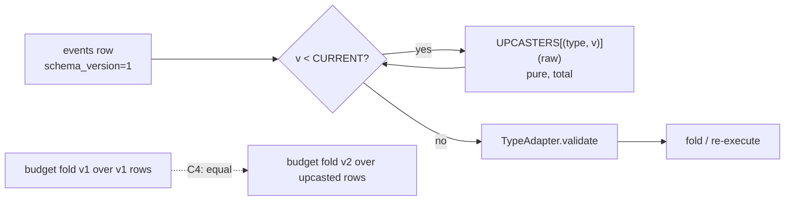

Rules that follow from the mechanism:

- Additive fields get defaults in the upcaster, not in the model, so that the model can keep the field required (Pydantic refuses a v2 event without `cache_read_tokens`, which catches a writer bug).
- Renames are upcasters (`d = dict(raw); d["attempt_deadline"] = d.pop("deadline"); return d` — a copy, because `{**raw, …}` would keep the old key and `raw.pop` would mutate the caller's dict, and upcasters are pure), never SQL migrations; a migration would rewrite history and break C4.
- There are no downcasters, and the refusal is a *release*, not a non-acquisition: events load after acquisition, so a worker that meets `schema_version > CURRENT` raises at load, writes `recoveries.outcome = 'RELEASED'` for its epoch (with `started_seq IS NULL` — it journaled nothing) and releases with `runnable_at = now() + backoff` (30 s, section-local decision) rather than `now()`. Without the backoff the same old worker's scheduler loop re-pops the run immediately and spins for the whole deploy window, bumping `lease_epoch` and inserting a `recoveries` row per iteration — which would pollute L2 and the recovery-latency series with events that are not recoveries. A run no deployed worker can serve is a deploy error, visible as repeated zero-append `RELEASED` epochs in `keel show`. Mixed-version workers are therefore safe in one direction only, which is the direction deploys go.
- C4 (v2) is the test: `fold_v1(rows) == fold_v2(upcast(rows))` for every projection over every archived run. The `cache_read_tokens = 0` choice is what makes the budget fold equal; an upcaster that could not keep a fold equal would be a semantic change and belongs in `program_version`, not `schema_version`.
- Bodies of `Continue(state)` blobs follow the same contract but are the *program's* responsibility (`model_validator(mode="before")`); a failure there is `RUN_SUSPENDED{reason=state_schema_mismatch}` (§4).

### 6.6 What is deliberately not an event

**Projection checkpoints are not events; `SEGMENT_STARTED` is.** The test is counterfactual deletion. Delete every `checkpoints` row and nothing observable changes: every projection re-folds to the same value, every re-execution runs the same steps — the row is a cache keyed by `projector_version`, invalid the moment the projector changes, and *derivable* from the events it summarises. Delete a `SEGMENT_STARTED` and the run changes: re-execution must start from segment 0, and the `state_blob` it carried — the program's own compression of its history, produced by program code via `Continue(state)` — is not derivable from prior events by any Keel-owned fold (only the program knows how it compressed). It is a *decision* the program made at that step, exactly like a model output, and decisions are journaled. C2 exists because the decision can be wrong: `fold(state at SEGMENT_STARTED + tail) == fold(all events)` is checkable precisely because both sides are in the journal.

**`ORPHANED` and `RECOVERING` are control-plane statuses, not events.** An event requires a writer holding the lease. `ORPHANED` is the assertion that *no one* holds it — the reaper is not the writer and must never become one (a reaper that appended `RUN_ORPHANED` would be a second writer racing the zombie it just declared dead, which is the bug leases exist to prevent). `RECOVERING` is the interval between `RECOVERY_STARTED` and `RECOVERY_COMPLETED` *while the lease is live*; the journal already contains its boundaries, and the status is `lease_expires_at ≥ now() ∧ last RECOVERY_STARTED unmatched`. Storing it as a phase would put the same fact in two places, one of which (the journal) cannot be updated by the reaper when the recovering worker dies. The API shows journal phase ∪ lease status for this reason: a run can be `WAITING_APPROVAL` (journal) and `ORPHANED` (control plane) at once, and both are true.

**`PROMPT_DRIFT` is reported, never journaled.** VERIFY writes nothing by definition, and drift is a property of the pair (journal, *reading* code), not of the run: the same journal drifts under Tuesday's prompt and not under Monday's. Journaling it would make a run's history depend on who read it. RECOVER never compares `request_hash`, so during recovery no drift is even computed. What *does* enter the journal is a lease holder's decision informed by drift: `VERSION_VERIFIED{drift?}` after a shadow check, and `RUN_SUSPENDED{reason=prompt_drift, detail}` under `prompt_drift: suspend` — both facts about what the writer did. The diff itself goes to `replays.diff_blob_id`. The same reasoning fixes an apparent conflict in the constitution: `RECOVERY_STARTED.cause` lists `VERIFY`, yet VERIFY performs no journal writes. Resolution (section-local decision): VERIFY runs the identical recovery code path over a read-only overlay journal (`MemoryJournal` fed from Postgres, writes to a discard buffer), so it *does* emit `RECOVERY_STARTED{cause=VERIFY}` — into the overlay, where `keel replay --verify` renders it — and `recoveries` never sees it; the durable record of the pass is the `replays` row.


## 7. State machines

### 7.1 Conventions and rejection mechanisms

Every machine below is a **projection** (§4.5): a pure fold over `events` (or, for lease status, a read of `runs` columns). A transition is caused by exactly one journaled event or one conditional control-plane `UPDATE`. Nothing else moves state.

An illegal transition is rejected by one of four mechanisms, named in every "invalid transitions" table:

| Mechanism | Where | What it catches | Cost of a bug slipping past it |
|---|---|---|---|
| **DB constraint** | `events PK (run_id, seq)`, `effects PK (effect_key)`, `effects.approval_id` unique partial index, `runs` conditional `UPDATE ... WHERE` | Duplicate identities, double consumption, concurrent claims | None — Postgres refuses the commit |
| **Fold assertion** | `keel/state/*` projections | An event the current state does not admit (e.g. `STEP_COMPLETED` on a step with no open attempt) | The writer folds every event onto its in-memory projection *inside* the append transaction before `COMMIT`; an `IllegalTransition` aborts the transaction, so an illegal event never lands (section-local decision). During re-fold of a stored journal the same assertion firing means journal corruption ⇒ `RUN_SUSPENDED{reason=projection_fault}` (section-local decision) |
| **Worker check** | `keel/runtime/steps.py` executor, `keel/replay/*`, CLI | A request the runtime refuses to turn into an event at all (`ConcurrentStepError`, `BudgetExceeded`, pre-dispatch lease check, `EffectDeniedInFork`) | Program-visible error, or a **pre-dispatch refusal** journaled as `STEP_INTENDED` + `STEP_FAILED{attempt_no=0}` in one transaction (§7.3.1); never a journal write that claims an attempt began |
| **Fence** | First statement of every append transaction (§5.4) | A writer whose `lease_epoch` is stale | 0 rows ⇒ transaction aborts ⇒ worker stops issuing steps for that run |

The ordering is deliberate: worker checks are cheap and give good errors; fold assertions are the semantic guard; DB constraints and the fence are the guards that hold even when the Python is wrong.

### 7.2 Run lifecycle

A run has two independent state variables. The **journal phase** is folded from events and answers "what has the program decided?". The **lease status** is read from `runs` columns and answers "is anyone executing it right now, and is that someone trusted?". The API shows both (§5.4).

#### 7.2.1 Journal phase

```mermaid
stateDiagram-v2
    [*] --> CREATED : RUN_CREATED
    CREATED --> RUNNING : RECOVERY_STARTED(cause=START)
    RUNNING --> WAITING_APPROVAL : RUN_WAITING(reason=approval)
    RUNNING --> WAITING_CHILDREN : RUN_WAITING(reason=children)
    RUNNING --> SLEEPING : RUN_WAITING(reason=sleep | retry_backoff, wake_at)
    RUNNING --> WAITING_SIGNAL : RUN_WAITING(reason=signal)
    RUNNING --> WAITING_RESOLUTION : RUN_WAITING(reason=resolution, wake_at)
    RUNNING --> PAUSED : RUN_PAUSED
    WAITING_APPROVAL --> RUNNING : RECOVERY_STARTED(cause=WAKE)
    WAITING_CHILDREN --> RUNNING : RECOVERY_STARTED(cause=WAKE)
    SLEEPING --> RUNNING : RECOVERY_STARTED(cause=WAKE)
    WAITING_SIGNAL --> RUNNING : RECOVERY_STARTED(cause=WAKE)
    WAITING_RESOLUTION --> RUNNING : RECOVERY_STARTED(cause=WAKE)
    PAUSED --> RUNNING : RUN_PAUSE_LIFTED
    RUNNING --> SUSPENDED : RUN_SUSPENDED(reason)
    SUSPENDED --> RUNNING : RECOVERY_STARTED(cause=RESUME)
    RUNNING --> COMPLETED : RUN_COMPLETED
    RUNNING --> FAILED : RUN_FAILED
    RUNNING --> CANCELLED : RUN_CANCELLED (after CANCEL_ACKNOWLEDGED)
    PAUSED --> CANCELLED : RUN_CANCELLED (after CANCEL_ACKNOWLEDGED)
    SUSPENDED --> CANCELLED : RUN_CANCELLED (after CANCEL_ACKNOWLEDGED)
    SUSPENDED --> SUPERSEDED : RUN_SUPERSEDED(by_run_id)
    PAUSED --> SUPERSEDED : RUN_SUPERSEDED(by_run_id)
    CREATED --> SUPERSEDED : RUN_SUPERSEDED
    WAITING_APPROVAL --> SUPERSEDED : RUN_SUPERSEDED
    WAITING_CHILDREN --> SUPERSEDED : RUN_SUPERSEDED
    SLEEPING --> SUPERSEDED : RUN_SUPERSEDED
    WAITING_SIGNAL --> SUPERSEDED : RUN_SUPERSEDED
    WAITING_RESOLUTION --> SUPERSEDED : RUN_SUPERSEDED
    COMPLETED --> [*]
    FAILED --> [*]
    CANCELLED --> [*]
    SUPERSEDED --> [*]
```

Notes on the fold, which are the load-bearing rules:

- `RECOVERY_STARTED` moves `WAITING_* → RUNNING` for `cause=WAKE`, `SUSPENDED → RUNNING` only for `cause=RESUME`, and leaves `PAUSED` untouched. Because the cause is fixed at the first append and a second `RECOVERY_STARTED` in one epoch is rejected (§7.8.1), **the acquiring worker peeks the inbox with a plain unconsumed-rows `SELECT` before its first append** and chooses `cause=RESUME` iff a pending `resume` or `custom` row exists on a `PAUSED`/`SUSPENDED` run, else `cause=WAKE` (section-local decision). A `resolve_step` decision therefore implies resume; no second `keel resume` is needed. A worker woken without such a row appends `RECOVERY_STARTED{cause=WAKE}`, drains the inbox, acts on `cancel`, and otherwise releases the lease without re-executing.
- **One `RUN_SUSPENDED{reason}` enum, published here and used by every machine in §7 and §8** (section-local decision): `nondeterminism`, `prompt_drift`, `state_schema_mismatch`, `resolved_unknown`, `recovery_loop`, `budget_top_up`, `child_failed`, `projection_fault`. No diagram below names a reason outside this list.
- A budget top-up rides on the `resume` signal's payload; `SIGNAL_RECEIVED{resume, payload.budget_delta}` is folded by the budget projection. No `BUDGET_CHANGED` event exists (section-local decision).
- `ORPHANED`-cause recoveries do not change the phase: the phase was `RUNNING` when the worker died and is still `RUNNING`. **The brief's `RUNNING → FAILED → RECOVERING → RUNNING` is, in Keel, `phase RUNNING` throughout while the lease status runs `HELD → EXPIRED → ORPHANED → RECOVERING → HELD`.** `FAILED` is a decision the program or a policy made (`RUN_FAILED{error}`), never something that happened to the process. Conflating the two is the design error that makes other runtimes unable to say whether a crashed run "failed".
- `WAITING_*` entry always releases the lease in the same transaction as `RUN_WAITING` (`lease_expires_at = NULL`, `runnable_at = NULL`, `wake_at` set for timed waits). A waiting run costs nothing (§5.4).
- `SLEEPING` is entered both by `ctx.sleep` and by a retry backoff ≥ 1 s (`reason=retry_backoff`); shorter backoffs sleep in-process under the lease (section-local decision).
- `WAITING_RESOLUTION` is the runtime-driven half of ambiguity resolution: `probe` returned `UNKNOWN` (or the receiver was unreachable) and a re-probe is scheduled at `wake_at`; after `probe_attempts` (default 5, backoff 2^n s, section-local decision) the step goes `RESOLVED_UNKNOWN` and the run goes `SUSPENDED{reason=resolved_unknown}`. `SUSPENDED` is the human-driven half.
- Terminal events (`RUN_COMPLETED|FAILED|CANCELLED|SUPERSEDED`) set `runs.terminal_at` and release the lease in their own transaction (section-local decision), so a terminal run is never `HELD`.
- `RUN_SUPERSEDED` is appended by the `keel fork --supersede` command acting as a normal lease holder: it acquires the base run's lease (which succeeds only if released), appends `RECOVERY_STARTED{cause=RESUME}` — the enum's human-command value, since a takeover-style acquisition adds no new cause (section-local decision) — then `RUN_SUPERSEDED`, then releases with `recoveries.outcome=RELEASED`. A leased base run cannot be superseded; the operator pauses it first (section-local decision). `COMPLETED|FAILED|CANCELLED` are terminal and never acquirable. A *drained* run, however, is `RUNNING × RELEASED` and therefore acquirable, so the command re-checks the phase **after** acquiring and refuses (`IllegalTransition`, lease released again, nothing appended but the `RECOVERY_STARTED`) unless the phase is `CREATED`, `WAITING_*`, `PAUSED` or `SUSPENDED`.

#### 7.2.2 Control-plane lease status

Derived from `runs` columns; never journaled.

| Status | Predicate on `runs` |
|---|---|
| `RELEASED` | `lease_expires_at IS NULL` |
| `HELD` | `lease_expires_at >= now()` and `orphaned_at IS NULL` |
| `RECOVERING` | `HELD` and the `recoveries` row for `(run_id, lease_epoch)` has `completed_at IS NULL` (section-local decision) |
| `EXPIRED` | `lease_expires_at < now()` and `orphaned_at IS NULL` — nobody has noticed yet |
| `ORPHANED` | `orphaned_at IS NOT NULL` — the reaper noticed; claimable |

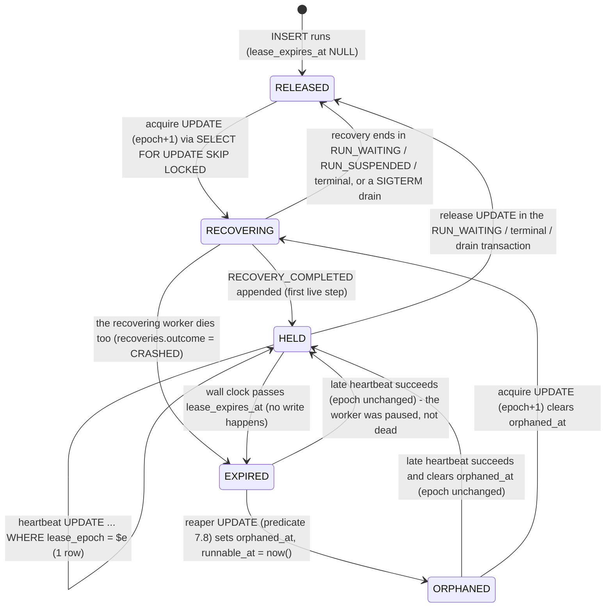

Two control-plane statements are specified beyond the constitution's text (both section-local decisions, both in its spirit of "the WHERE re-checks what it assumes"):

- The heartbeat/fence statement also `SET orphaned_at = NULL`, so a paused worker that resumes before takeover un-orphans itself; the reaper re-evaluates on its next tick.
- The scheduler's candidate query is `WHERE runnable_at <= now() AND terminal_at IS NULL AND (paused_at IS NULL OR EXISTS (SELECT 1 FROM signals s WHERE s.run_id = runs.run_id AND s.consumed_seq IS NULL AND s.type IN ('resume','cancel'))) AND (lease_expires_at IS NULL OR lease_expires_at < now()) AND (attempt_deadline IS NULL OR attempt_deadline < now())` (§5.4 statement (2a), which owns it). An `EXPIRED` row *is* a candidate directly — a signal insert sets `runnable_at = now()` on a held run, so a holder that lapses mid-effect must be claimable without waiting for the reaper. What holds a successor off an open non-PURE attempt is the `attempt_deadline` conjunct carried in the claim and in the acquire itself, not the reaper's `orphaned_at` mark. The acquire `UPDATE`'s `(lease_expires_at IS NULL OR lease_expires_at < now())` clause is then the second line of defence against a heartbeat that revived the lease between the candidate `SELECT` and the claim.

#### 7.2.3 How phase and lease status combine

| Phase × lease | Meaning | Moves on by |
|---|---|---|
| `CREATED × RELEASED` | queued, `runnable_at <= now()` | scheduler claim |
| `RUNNING × RECOVERING` | memoized re-execution in progress | `RECOVERY_COMPLETED` or a waiting/suspended/terminal event |
| `RUNNING × HELD` | a live step may be executing | the program |
| `RUNNING × RELEASED` | drained on SIGTERM (or released mid-run after an abandoned attempt); `runnable_at` gates the re-claim | scheduler claim ⇒ `RECOVERY_STARTED{cause=DRAIN}` |
| `RUNNING × EXPIRED` | worker silent past TTL; **a zombie may be executing a non-PURE effect** | reaper (bounded by `attempt_deadline`) or late heartbeat |
| `RUNNING × ORPHANED` | crash detected, claimable | any worker's acquire |
| `WAITING_* × RELEASED` | parked, zero compute; `wake_at` or an inbox row will make it runnable | signal insert / timer |
| `WAITING_* × RECOVERING` | woken; draining inbox and re-executing to the waiting step | the waiting step's outcome |
| `PAUSED × RELEASED`, `SUSPENDED × RELEASED` | needs a human | `resume` / `cancel` / fork |
| `terminal × RELEASED` | done | nothing; `terminal_at` blocks acquisition |
| `WAITING_* × HELD`, `terminal × HELD/EXPIRED/ORPHANED`, `CREATED × HELD` | **impossible** | the waiting/terminal event and the release are one transaction; `CREATED` ends at `RECOVERY_STARTED`, the first append of any lease |

#### 7.2.4 Invalid transitions (run)

| Attempted | Rejected by | How |
|---|---|---|
| Any event after a terminal event | fold assertion; worker check | fold refuses; acquire `WHERE terminal_at IS NULL` never hands out a lease |
| `RUN_COMPLETED` while a step is non-terminal | fold assertion | the run projection requires `open_step IS NULL` |
| `RUN_COMPLETED` / `RUN_FAILED` directly from `WAITING_*` | fold assertion | only `RECOVERY_STARTED` leaves a waiting phase; the appender must hold a lease, whose first append is `RECOVERY_STARTED` (worker check) |
| `RUN_WAITING` while a non-waiting attempt is `RUNNING` | fold assertion | allowed only when the open step is of kind `APPROVAL|SLEEP|SIGNAL_WAIT|DELEGATE`, or `FAILED{retryable}` (`retry_backoff`), or `AMBIGUOUS` (`resolution`) |
| `SUSPENDED → RUNNING` on `cause=WAKE` | fold assertion | only `cause=RESUME` lifts a suspension |
| `PAUSED → RUNNING` on `RECOVERY_STARTED` | fold assertion | only `RUN_PAUSE_LIFTED` |
| `RUN_CANCELLED` with no preceding `CANCEL_ACKNOWLEDGED` | fold assertion | the acknowledgement need **not** be in the same `lease_epoch`: a parent acknowledges cancel, releases into `RUN_WAITING{children}` and appends `RUN_CANCELLED` in a later epoch (§7.6.2). The rule is "a `CANCEL_ACKNOWLEDGED` exists and no `RECOVERY_COMPLETED` — i.e. no live step — followed it". Forced cancels satisfy it too: the takeover writer appends `RECOVERY_STARTED{cause=ORPHANED}`, `STEP_CANCELLED`, `CANCEL_ACKNOWLEDGED`, then `RUN_CANCELLED{forced_by}` |
| Second `RECOVERY_STARTED` while `HELD` | fence / DB constraint | acquire `UPDATE` matches 0 rows |
| Two writers in `RUNNING` | fence, then `events` PK | stale epoch ⇒ 0 rows ⇒ abort; PK `(run_id, seq)` is defence in depth |
| `RUN_SUPERSEDED` on a leased or terminal run | fence / worker check | the fork command's acquire fails; terminal runs are never acquirable |
| `RECOVERY_COMPLETED` with no `RECOVERY_STARTED` in the epoch | fold assertion | |

### 7.3 Step lifecycle

A step is `(run_id, step_index)`; it owns a sequence of **attempts** numbered from 1. `STEP_INTENDED` is committed once; `STEP_ATTEMPT_STARTED{attempt_no}` is committed once per attempt and is that attempt's **write-ahead barrier**: no effect begins before it is durable (§8.2). Attempt 1's `STARTED` shares `INTENT`'s transaction; later attempts get their own.

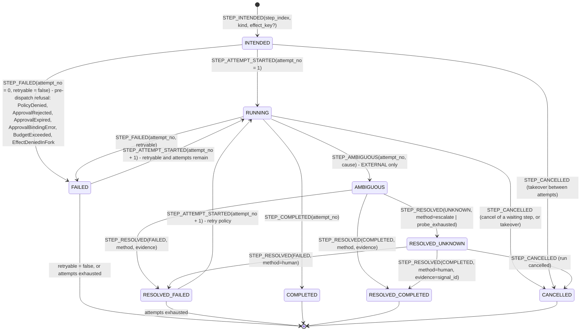

Decisions that make the diagram exact:

- **`RUNNING` spans the wait for waiting kinds.** `APPROVAL`, `SLEEP`, `SIGNAL_WAIT`, `DELEGATE` steps have exactly one attempt whose `STARTED` shares `INTENT`'s transaction and whose `attempt_deadline` is the approval `expires_at`, the sleep `wake_at`, the wait timeout, or the delegation `deadline` (section-local decision). They then move the run to `WAITING_*` and release the lease. This keeps one step machine for all kinds. The reaper never sees these steps: it reads `effects` only (§7.8), and a waiting run holds no lease anyway — their `attempt_deadline` exists so that the timer (`runs.wake_at`), the step projection and the takeover `UPDATE` all read one column, not so that orphaning can act on it.
- **Two producers of `STEP_AMBIGUOUS`.** A live worker appends it itself when an `EXTERNAL` call times out or raises a transport error (`cause=timeout | transport | drain_abandoned`). A successor appends it during recovery when it finds `STARTED` without an outcome on an `EXTERNAL` step (`cause=recovered_open_attempt`). The journal does not care which; the resolution path is identical.
- **`FAILED` vs `AMBIGUOUS` is decided by the tool's exception type, not by the runtime guessing.** The `Tool` protocol raises `ToolFailed` (the receiver rejected the request: 4xx, validation) or `ToolAmbiguous` (timeout, connection reset, 5xx with no body). On an `EXTERNAL` tool the executor maps `ToolAmbiguous` and any uncaught exception to `STEP_AMBIGUOUS`; on `PURE|IDEMPOTENT|TRANSACTIONAL|MODEL` everything maps to `STEP_FAILED{retryable}` because re-execution is safe by class (section-local decision).
- **`RESOLVED_COMPLETED` is a terminal success whose result comes from the resolver**: for `probe`, the `ProbeResult.result` payload (required when `verdict=COMMITTED`); for `assume_succeeded`, `AssumedResult(method="assume_succeeded")`; for a human, the payload of the resolving `custom` signal. Programs that need the real return value must declare `probe` (section-local decision).
- **`RESOLVED_FAILED` behaves exactly like `FAILED{retryable=true}`**: the retry policy decides whether attempt n+1 starts. `assume_failed` is therefore "resolve as absent, then retry", which is what makes it at-least-once (§8).
- The constitution's `RESOLVED_UNKNOWN → (human) → COMPLETED | FAILED | CANCELLED` is realised without new event types: the human's decision is a `custom{kind=resolve_step, decision: committed(result) | absent}` signal, journaled as a second `STEP_RESOLVED{method=human}`; `cancel` is the ordinary run cancel (`keel cancel`), which cancels the open step (section-local decision).
- **Program-visible outcome**: `ctx.*` returns the result for `COMPLETED|RESOLVED_COMPLETED`, raises `StepFailed(error)` for terminal `FAILED|RESOLVED_FAILED` (catchable — the model should see tool errors), raises `Cancelled` at `CANCEL_ACKNOWLEDGED{step_index}`. All three are memoized identically on replay.
- **Attempt numbers are monotonic across recoveries**: a successor starting a new attempt uses `last_attempt_no + 1`. A step that crashes the worker on every attempt is bounded by the retry policy's `max_attempts` (per-class defaults in §9.1), not by a separate crash counter.

#### 7.3.1 Invalid transitions (step)

| Attempted | Rejected by | How |
|---|---|---|
| Any event after `COMPLETED|RESOLVED_COMPLETED|CANCELLED|terminal FAILED` (regression, S5) | fold assertion; DB constraint | fold refuses; `effects` row update `WHERE status IN (open statuses)` matches 0 rows and aborts |
| `STEP_INTENDED` with `step_index != next_step_index` | worker check; fold assertion | `ConcurrentStepError` at `ctx.*` entry; the fold asserts `step_index == len(steps)` |
| `STEP_INTENDED` with a repeated `effect_key` | DB constraint | `effects PK` unique violation at `INTENT` commit — loud, never a silent skip (§9.6) |
| `STEP_ATTEMPT_STARTED(n)` with `n != last + 1`, or while an attempt is open | fold assertion | one open attempt per step. A successor that finds attempt n open closes it in the **same transaction** as `STARTED(n+1)`, with `STEP_FAILED{attempt_no=n, error=attempt_abandoned, retryable=true}` (§7.8 step 6), so the rule holds across epochs and no crashed step is unrecoverable |
| Outcome event for a step with no `STARTED` for that `attempt_no` | fold assertion | the write-ahead rule at the journal level. Exactly one exemption: `attempt_no=0`, the **pre-dispatch refusal** (§7.5, §7.4.1, §7.6.3, §20.2), which asserts that nothing was ever dispatched. It does not weaken the rule — no effect is reachable without a `STARTED` — and it is what keeps `ApprovalRejected`, `ApprovalExpired`, `PolicyDenied`, `BudgetExceeded` and `EffectDeniedInFork` journalable |
| Outcome event with `attempt_no` ≠ the open attempt | fold assertion | late outcome of a superseded attempt of the *same* epoch cannot happen (single task); of an old epoch it is fenced first |
| `STEP_AMBIGUOUS` on a non-`EXTERNAL` step | worker check; fold assertion | the executor never emits it; the fold checks `effect_class` |
| `STEP_RESOLVED` on a step not `AMBIGUOUS|RESOLVED_UNKNOWN` | fold assertion | |
| `STEP_ATTEMPT_STARTED` after `CANCEL_ACKNOWLEDGED` | fold assertion | |
| Attempt n+1 beyond `max_attempts` | worker check | retry policy emits `STEP_FAILED{retryable=false}` |
| Attempt dispatch with `lease_valid_until − now < tool.timeout` | worker check | re-heartbeat; if fenced, abandon without executing (§8.4) |
| Executing an effect before `STARTED` is durable | worker check | executor order (`INTENT/STARTED` commit → `before:effect_exec` → call); not journal-enforceable — S4/S10 measure it |
| `STARTED` appended by a stale epoch | fence | 0 rows |

### 7.4 Tool-effect lifecycle

The `effects` row is the registry view of a `TOOL` step: one row per `effect_key`, written in the same transaction as the step's events (transactional outbox inside one database, §9.2). Its `status` is a projection of the step, specialised by class, with `attempt_no` and `attempt_deadline` updated per attempt. Every `TOOL` step gets a row, including `PURE` (the reaper filters on `class`) (section-local decision). `MODEL` steps have no row: they are decisions, not effects, and the reaper does not wait for them.

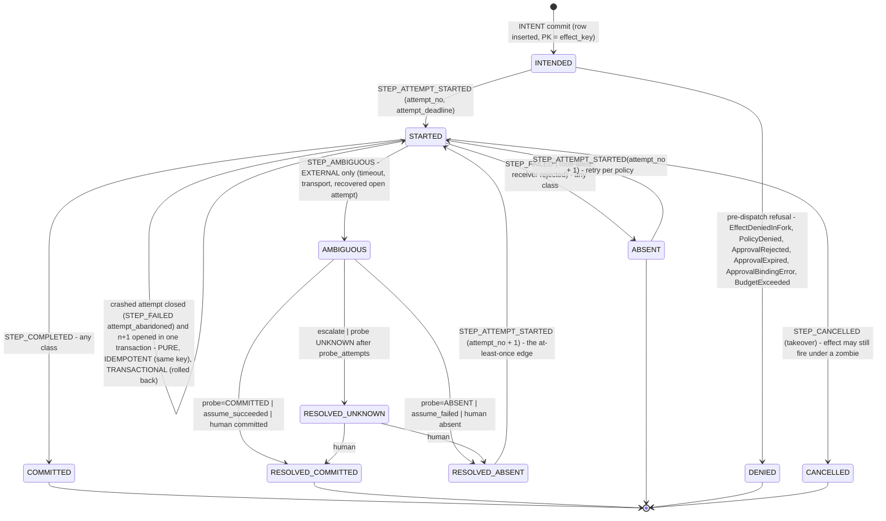

Class-specific edges, stated once:

| Edge | `PURE` | `IDEMPOTENT` | `EXTERNAL` | `TRANSACTIONAL` |
|---|---|---|---|---|
| `STARTED` → crash → successor action | re-run (new attempt) | re-run, same `effect_key` presented to the receiver | `AMBIGUOUS` → declared `resolution` | re-run; the effect was in the aborted outcome transaction, so provably not applied |
| `STARTED` → timeout (worker alive) | `STEP_FAILED{retryable}` | `STEP_FAILED{retryable}` | `STEP_AMBIGUOUS{cause=timeout}` | rollback on the journal connection, then `STEP_FAILED{retryable}` |
| `STARTED` → `ToolFailed` (receiver rejected) | `ABSENT`, retry per policy | `ABSENT`, retry | `ABSENT`, retry (safe: the receiver said no) | `ABSENT` after rollback, retry |
| `STREAMS` mid-stream crash | discard partial, new attempt | new attempt, same key | `AMBIGUOUS` | not allowed (modifier invalid) |
| Effect execution location | tool | tool | tool | inside the outcome-append transaction on `ctx.db` |

Between attempts the row is `ABSENT` (or `RESOLVED_ABSENT`) and therefore invisible to the reaper's `status = 'STARTED'` filter — which is correct, because no request is outstanding.

`probe` locates the effect by `(effect_key, args)`: it runs precisely when no `COMMITTED` outcome exists, so `external_ref` is not yet known and cannot be its input. `external_ref` (the receiver's id for the created object) is recorded from the response, or from `ProbeResult.external_ref`, on `COMMITTED|RESOLVED_COMMITTED`; it is what S2 and C3 use to match a committed effect to a World entry, whose receipts are logged as `(effect_key_if_any, args, logical_identity, ts)`.

#### 7.4.1 Invalid transitions (effect)

| Attempted | Rejected by | How |
|---|---|---|
| Second row for one `effect_key` | DB constraint | `effects PK` |
| `COMMITTED → AMBIGUOUS` or any regress | DB constraint; fold assertion | status update `WHERE status = 'STARTED'` |
| `RESOLVED_*` without `AMBIGUOUS` | fold assertion | |
| `AMBIGUOUS` on a non-`EXTERNAL` row | worker check; fold assertion | |
| `STARTED` on an approval-bound effect whose approval is not `GRANTED` | worker check; fold assertion | the executor reads the approval projection before `STARTED`, and the fold asserts `GRANTED` when folding a `STARTED` that carries `approval_id`. The unique partial index on `effects.approval_id` enforces *single consumption*, not the decision value — no DB constraint can check `granted` |
| `assume_failed` on an approval-gated `EXTERNAL` tool | worker check | enforced at the **gating point**, because gating is decided per call: when `ctx.tool(..., approval=...)` or a `Policy` verdict of `require_approval` names an `EXTERNAL` tool whose `resolution` is `assume_failed`, the call is refused with `ApprovalBindingError` (`INTENT` + `STEP_FAILED{attempt_no=0}`), never silently re-classified. `register_tool` (§9.5) additionally refuses a tool *declared* always-gated with `assume_failed`; probe or escalate only |
| Any non-`PURE` execution in a `FORK` under `effects=deny` without a synthetic result or stub | worker check | `EffectDeniedInFork` before `STARTED`: `INTENT` + `STEP_FAILED{attempt_no=0}` and the row set to `DENIED`, one transaction. The program may catch the `StepFailed` and continue — the fork is an ordinary run |
| Dispatch without the pre-dispatch lease margin | worker check | §8.4 |
| Effect executed after the fence | fence for `TRANSACTIONAL` and for the outcome append; **nothing** for the third-party call itself | §8.4 — this is the zombie window and is measured, not prevented |

### 7.5 Approval lifecycle

`ctx.approve(payload, expires_in)` is a step of kind `APPROVAL`. When the approval gates a tool call — `ctx.tool(name, args, approval=...)` or a `Policy` verdict of `require_approval` — the runtime issues the `APPROVAL` step and the `TOOL` step as an adjacent pair (indices i, i+1), so `binds_effect_key` = `effect_key(step_index=i+1, tool, canonical_args)` is computable at request time. **The journaled pair is authoritative on replay**: a journaled `APPROVAL(i, binds_effect_key)` followed by `TOOL(i+1)` carrying that key is memoized as the one `ctx.tool` call that produced it, and `Policy` is consulted only when a step is live — its verdict is journaled as `policy_verdict` on the `INTENT` (§20.2). A policy deploy while a run sits parked on an approval therefore cannot manufacture a `NondeterminismDetected`, which is the whole point of parking cheaply for days. A bare `ctx.approve` not tied to a tool has `binds_effect_key = NULL` and is a plain durable wait; S7 applies only to bound approvals (section-local decision).

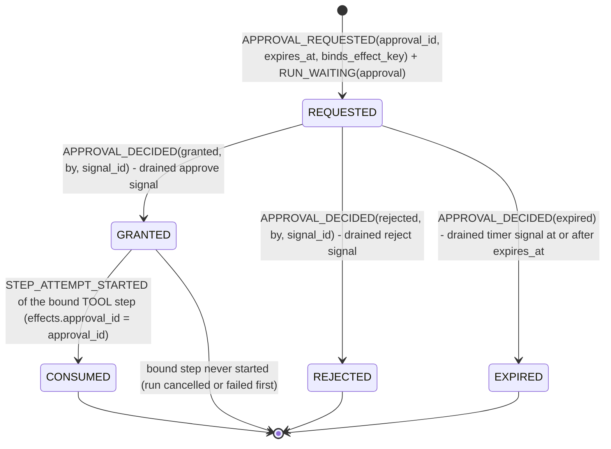

Rules:

- **First drained decision wins.** `approve` and `reject` are inbox rows; the lease holder drains them in `seq` order under the fence. The first `APPROVAL_DECIDED` is terminal for the approval; any later `approve|reject|timer` for the same `approval_id` is journaled `SIGNAL_IGNORED{reason=approval_terminal}` and consumed. A decision for an unknown `approval_id` is `SIGNAL_IGNORED{reason=unknown_approval}`.
- **Expiry is a timer signal.** `RUN_WAITING{approval, wake_at=expires_at}`; at `wake_at` the scheduler inserts a `timer` signal and makes the run runnable; the wake worker drains it and appends `APPROVAL_DECIDED{expired}` — unless an `approve` row with a lower `seq` was drained first, in which case the timer is ignored. Expiry is judged by Postgres `now()` at drain time, never by the worker's clock — and that judgement outranks `seq` order: an `approve`/`reject` row drained when `now() > expires_at` is `SIGNAL_IGNORED{reason=expired}` and `APPROVAL_DECIDED{expired}` is appended, whether or not the timer row has arrived yet (section-local decision). "First drained decision wins" therefore means the first drained *non-expired* decision.
- **The program sees a value, not an exception.** The `APPROVAL` step completes with `Approval{decision, by, decided_at}` for all three decisions; the program (or the ReAct loop) decides what a rejection means. For a bound approval the runtime refuses to start the `TOOL` step unless `decision = granted`: it appends `STEP_INTENDED` + `STEP_FAILED{attempt_no=0, error=ApprovalRejected|ApprovalExpired, retryable=false}` for step i+1 and sets that step's `effects` row to `DENIED`, all in one transaction. `attempt_no=0` is the pre-dispatch marker that keeps the write-ahead rule exact (§7.3.1): no attempt was started, so no effect was reachable (section-local decision).
- **Consumption is a row, not an event.** `CONSUMED` = the bound effect's `STARTED` exists; the effects row carries `approval_id` under a unique partial index `(approval_id) WHERE approval_id IS NOT NULL`. Retries of an `IDEMPOTENT` bound tool re-use the same row and the same key: one approval, one logical effect, ≤ 1 applied (S7). An `EXTERNAL` bound tool may only resolve by `probe` or `escalate`, because `assume_failed` would re-fire under one approval (§9.4).
- **Crash windows around approval** (§8.2 applies): before `APPROVAL_DECIDED` commit ⇒ the decision row is still in the inbox unconsumed ⇒ re-drained after recovery; after the decision, before `STARTED` of i+1 ⇒ the successor re-executes, step i returns `granted` from the journal, step i+1 goes live, exactly one `STARTED`; after `STARTED` ⇒ class rule.

#### 7.5.1 Invalid transitions (approval)

| Attempted | Rejected by | How |
|---|---|---|
| Second `APPROVAL_DECIDED` for one `approval_id` | fold assertion | drained as `SIGNAL_IGNORED{approval_terminal}` |
| Consumption by two effects | DB constraint | unique partial index on `effects.approval_id` |
| Consumption of `REJECTED|EXPIRED|REQUESTED` | worker check; fold assertion | executor reads the approval projection before `STARTED`; fold asserts `GRANTED` when folding a `STARTED` carrying `approval_id` |
| `APPROVAL_DECIDED` while the run holds no lease | fence | decisions are only ever journaled at drain by the lease holder; the inbox insert itself is always allowed — state is judged at drain, not at insert |
| Approve signal for a run whose approval step index has been cancelled | fold assertion | `SIGNAL_IGNORED{reason=step_terminal}` |
| Expiry timer after a decision | fold assertion | `SIGNAL_IGNORED{approval_terminal}` |

### 7.6 Child-agent lifecycle

A child is a run with `parent_run_id` and a `delegations` row (the contract). Two views exist because two writers exist: the parent's lease holder writes the parent's journal and the delegation row; the child's lease holder writes the child's journal. The only cross-writer channels are `RUN_CREATED` of the child (written by its creator — the parent's worker — before any lease exists) and the parent's **inbox** (§5.6).

#### 7.6.1 Parent view (delegation status, a projection of the parent's journal + `delegations`)

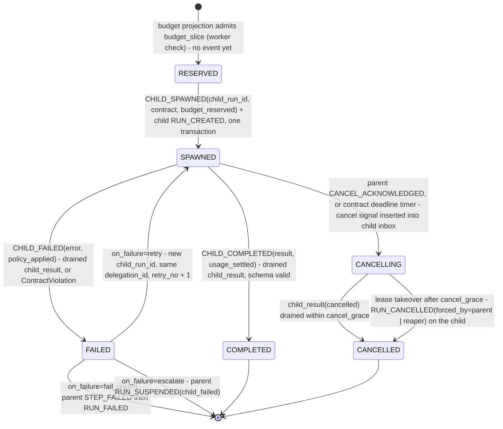

- **There is no `RUNNING` in the parent's view, deliberately.** Every transition here is caused by an event in the *parent's own* journal (§7.1); "the child has started executing" is not one, and the parent is contractually blind to the child's internal state (§17). A live-progress indicator belongs to the child's own projection, which the API reads directly. `SPAWNED` therefore goes straight to `COMPLETED`, `FAILED` or `CANCELLING`.
- `RESERVED → SPAWNED` is one Postgres transaction touching two runs: the parent's `CHILD_SPAWNED` append (fenced) and the child's `runs` row + `RUN_CREATED`. `RUN_CREATED` is the one event a non-lease-holder writes, and only because no lease holder exists yet (section-local decision). Delegation spawn is therefore atomic with the fenced journal append — the `TRANSACTIONAL` boundary of §8.1, one database — and never partial; `delegations PK (delegation_id)` plus `UNIQUE (parent_run_id, step_index, child_ordinal, retry_no)` makes a re-executed spawn a loud violation, not a second child.
- `ctx.delegate_many` is one `DELEGATE` step with N children; the step's outcome is the list of child results, appended when the last child is terminal. `max_children_in_flight` (default 4) is a worker check at spawn.
- **Contract deadline** is the delegation's `attempt_deadline` (§7.3); at `wake_at = min(deadlines)` a timer signal wakes the parent, which sends `cancel` to the overdue child and applies `on_failure` with `error=DeadlineExceeded`.

#### 7.6.2 Child view

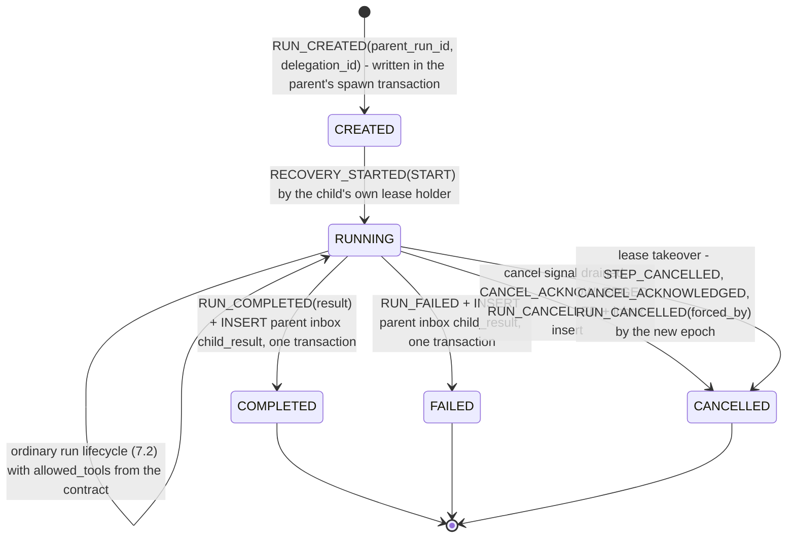

- **Result delivery is TRANSACTIONAL-class**: the child's terminal append and the `INSERT INTO signals (run_id = parent, type = child_result, ...)` share one transaction in one database (section-local decision, defended in §8.7). The parent drains it under its own fence and validates against `result_schema`; a schema failure is `CHILD_FAILED{error=ContractViolation}` even though the child's own journal says `COMPLETED`. The parent's contract, not the child's opinion, decides.
- **Lease takeover (force-cancel).** Parent `CANCEL_ACKNOWLEDGED` ⇒ cancel rows in every non-terminal child's inbox ⇒ parent `RUN_WAITING{children}` with `wake_at = now() + cancel_grace`. The parent's open `DELEGATE` step stays open across that wait — it is a waiting kind, so §7.2.4 admits the `RUN_WAITING` — and is closed with `STEP_CANCELLED` immediately before `RUN_CANCELLED`, in whichever epoch observes the last child terminal (section-local decision); the acknowledgement and the cancellation are therefore legitimately in different epochs (§7.2.4). On wake, any child still non-terminal is taken over: the parent's worker (or the reaper, for orphans of a terminal parent) runs `UPDATE runs SET lease_epoch = lease_epoch + 1, lease_owner = $me, lease_expires_at = now() + $ttl, orphaned_at = NULL WHERE run_id = $child AND parent_run_id = $parent AND terminal_at IS NULL AND EXISTS (cancel signal older than cancel_grace) AND now() > COALESCE(open_non_pure_attempt_deadline, now() - interval '1 second') RETURNING lease_epoch` — the same shape as ORPHANED acquisition, with the same `attempt_deadline` bound, so the child's old worker is fenced before the new writer appends, in the new epoch and in this order, `RECOVERY_STARTED{cause=ORPHANED, forced_by}` — a takeover *is* a lease acquisition, so the first-append rule holds unchanged and no takeover cause is added to the enum — then `STEP_CANCELLED`, `CANCEL_ACKNOWLEDGED{step_index}`, `RUN_CANCELLED{reason=parent_cancel, forced_by}`. No `RECOVERY_COMPLETED` is appended, because no step goes live. `cancel_grace` defaults to `max(open step timeout, 5 s)` (section-local decision), which is what makes the `attempt_deadline` clause hold by construction. The takeover writer does not re-execute the program; its `recoveries` row records `outcome=FORCED_CANCEL`. It then inserts cancel rows for the child's own children, so the cascade is the same mechanism at every depth.
- **Liveness rule** (§17.7) is a reaper predicate: `child.terminal_at IS NULL AND parent.terminal_at IS NOT NULL` ⇒ insert cancel ⇒ takeover after `cancel_grace`. S8 measures the residual: an `EXTERNAL` effect of a zombie child after the parent's terminal.

#### 7.6.3 Invalid transitions (child)

| Attempted | Rejected by | How |
|---|---|---|
| Spawn with `Σ reservations > parent remaining` | worker check | budget projection ⇒ `INTENT` + `STEP_FAILED{attempt_no=0, error=BudgetExceeded, retryable=false}` in one transaction (§7.3.1) |
| Spawn with `allowed_tools ⊄ parent.allowed_tools` | worker check | `Policy` refuses the contract |
| More than `max_children_in_flight` | worker check | |
| Re-executed spawn creating a second child | DB constraint | `delegations` unique `(parent_run_id, step_index, child_ordinal, retry_no)` |
| `child_result` for an unknown or terminal delegation | fold assertion | `SIGNAL_IGNORED{reason=delegation_terminal}` |
| Second `CHILD_COMPLETED` for one child | fold assertion | |
| Parent worker appending to the child's `events` | worker check; fence | no API path exists; the child's `lease_epoch` is not the parent's |
| Child continuing after parent terminal | reaper predicate + fence | cancel, then takeover; the old worker's next append gets 0 rows |
| Child result violating `result_schema` | fold assertion (validation in the parent's projection) | `CHILD_FAILED{ContractViolation}` |
| Takeover of a child whose open non-PURE `attempt_deadline` is in the future | DB constraint | the takeover `UPDATE`'s WHERE |

### 7.7 Replay lifecycle

Three modes (§10.1) share one engine — memoized re-execution — and differ in lease, write permission and which journal supplies the memo.

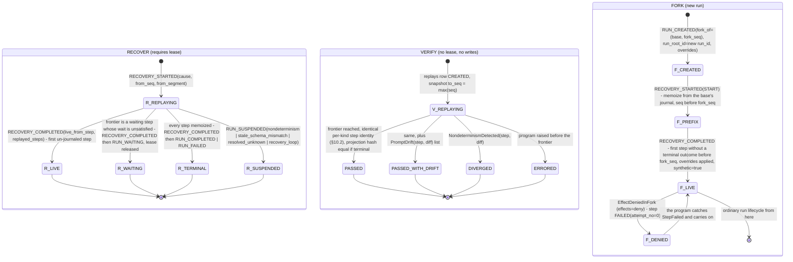

- **RECOVER** is §7.8's inner loop. It ends in `RECOVERY_COMPLETED` or a suspension — and `RECOVERY_COMPLETED{live_from_step}` is appended at the frontier whether that frontier is a live step, an unsatisfied waiting step, or the end of the program with every step memoized, so recovery latency is measurable in all three (§14.3). It never consults `replay_cache` (§10.10).
- **VERIFY** takes a snapshot `to_seq` at start and ignores later appends, so it can run against a live run. It writes only a `replays(replay_id, mode, base_run_id, to_seq, status, result)` row (section-local decision on columns). The deployment shadow check is VERIFY run in-process by a worker that just acquired a lease and sees `runs.program_version` ≠ the last `INTENT`'s `program_version`; its verdict is journaled as `VERSION_VERIFIED{old, new, result, drift?}` under that lease — on **every** result, `PASSED` included, so a deploy is auditable either way, and always *after* that epoch's `RECOVERY_STARTED` (§7.8) — and `DIVERGED` ⇒ `RUN_SUSPENDED{nondeterminism}` before any live step. `PASSED_WITH_DRIFT` under `prompt_drift: suspend` also suspends.
- **FORK** validates `fork_seq` at creation: it must be > the terminal-outcome `seq` of every step it keeps and must not fall inside an open attempt (no half-steps) (section-local decision). The fork is thereafter an ordinary run: §7.2–§7.6 apply unchanged. Its effect keys differ from the base's because `run_root_id` is the new `run_id`; under `effects=live` the CLI prints the base's `COMMITTED|AMBIGUOUS` effects at indices ≥ the first live step and warns that they will re-perform under new keys — the receiver cannot dedup what it has never seen. Wording note: the constitution says "step `fork_seq` executes live"; `fork_seq` is an event `seq`, so this section reads it as "the first step whose terminal outcome is not before `fork_seq`".

#### 7.7.1 Invalid transitions (replay)

| Attempted | Rejected by | How |
|---|---|---|
| VERIFY appending any event | worker check; fence | `allow_live=False`; the journal handle is read-only; no lease ⇒ any append would be fenced |
| VERIFY executing a live step | worker check | `VerifyFrontierReached` stops the program |
| RECOVER without a lease | fence | |
| RECOVER consulting `replay_cache` | worker check | the RECOVER path has no cache handle by construction |
| FORK with `fork_seq` inside an open attempt or beyond `max(seq)` | worker check | `keel fork` validation |
| FORK with `run_root_id = base.run_root_id` | worker check | always `new run_id` |
| Non-PURE step in FORK under `effects=deny` without stub/synthetic | worker check | `EffectDeniedInFork` |
| `supersede=True` while the base is leased or terminal | fence / worker check | §7.2 |
| Synthetic result on a step index < the first live step | worker check | overrides apply only at/after the frontier |

### 7.8 Recovery lifecycle

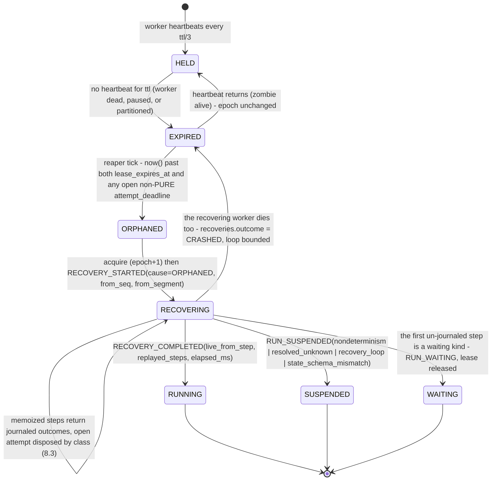

The reaper predicate, one statement (§5.4), with the zombie bound inlined:

```sql
UPDATE runs r SET orphaned_at = now(), runnable_at = now()
WHERE r.lease_expires_at IS NOT NULL AND r.lease_expires_at < now()
  AND r.orphaned_at IS NULL AND r.terminal_at IS NULL
  AND now() > COALESCE(
        (SELECT max(e.attempt_deadline) FROM effects e
          WHERE e.run_id = r.run_id AND e.status = 'STARTED' AND e.class <> 'PURE'),
        r.lease_expires_at);
```

Sequence on the successor, in order and with nothing skipped:

1. Acquire: conditional `UPDATE ... RETURNING lease_epoch` (§5.4). Insert `recoveries(run_id, lease_epoch, cause, started_at)` (§5.7).
2. Read `max(seq)`, the latest `SEGMENT_STARTED`, and fold the projection.
3. Append `RECOVERY_STARTED{lease_epoch, cause, from_seq, from_segment}` — **the first append of any lease acquisition, without exception**; this first fenced append proves the fence works before any effect, and before any other event, is possible. `cause ∈ START | WAKE | ORPHANED | RESUME | DRAIN`, chosen at acquisition by the inbox peek of §7.2.1; `cause=VERIFY` exists only inside VERIFY's read-only overlay journal and never lands in `events` or `recoveries` (§6.6).
4. If `runs.program_version` ≠ the last `INTENT`'s: run the shadow VERIFY now (§7.7), then append `VERSION_VERIFIED{old, new, result, drift?}` — journaled on `PASSED` as well as on `DIVERGED`. On `DIVERGED` append `RUN_SUSPENDED{nondeterminism}` and stop; on `PASSED_WITH_DRIFT` under `prompt_drift: suspend`, the same. The order matters: a woken run that diverges is `WAITING_* → RUNNING → SUSPENDED`, all three edges journaled, which is why §7.2.1 needs no `WAITING_* → SUSPENDED` edge.
5. Drain the inbox (fenced; `SIGNAL_RECEIVED` / `SIGNAL_IGNORED`).
6. Dispose of the open attempt, if any, **from journal state only** (§8.3): `PURE|IDEMPOTENT|TRANSACTIONAL|MODEL` ⇒ the abandoned attempt n is closed *lazily but explicitly*, by committing `STEP_FAILED{attempt_no=n, error=attempt_abandoned, retryable=true}` in the **same transaction** as `STEP_ATTEMPT_STARTED(n+1)` when re-execution reaches the step. Without that close, `STARTED(n+1)` would land while attempt n is still open and the fold assertion of §7.3.1 would abort the transaction — i.e. no crashed step would be recoverable at all. Committing them together also means the `effects` row never leaves `STARTED`, so the reaper's view of an open effect stays stable, and a `MODEL` attempt's reservation stays charged (§8.6). `EXTERNAL` ⇒ append `STEP_AMBIGUOUS{cause=recovered_open_attempt}` then run the declared resolution and append `STEP_RESOLVED`.
7. Re-execute the program from the segment boundary; every `ctx.*` with a journaled terminal outcome returns instantly; the first one without becomes live ⇒ `RECOVERY_COMPLETED{live_from_step, replayed_steps, elapsed_ms}`; `recoveries.completed_at`, `outcome=LIVE|WAITING|SUSPENDED|TERMINAL`.

**Recovery-loop bound** (section-local decision): the bound cannot be keyed on `from_seq`, which strictly increases across recoveries because every recovery appends at least its own `RECOVERY_STARTED`. It is keyed on the **step frontier** instead. An epoch is `CRASHED` when the only events carrying its `lease_epoch` are `RECOVERY_STARTED` and drained `SIGNAL_*` rows — no `STEP_*`, no `SEGMENT_STARTED`, no `RUN_*` phase event; the run's frontier is `max(seq)` over `STEP_*` and `SEGMENT_STARTED`. If the last `K` (default 5) `recoveries` rows are `CRASHED` and the frontier did not move across them, the acquiring worker appends `RUN_SUSPENDED{reason=recovery_loop, detail=frontier_seq}` instead of re-executing. This catches exactly the case `max_attempts` cannot — a worker that dies *outside* an attempt, in the fold or the drain — and is Keel's L2 backstop. This is the only dead-letter mechanism; DBOS's `max_recovery_attempts → MAX_RECOVERY_ATTEMPTS_EXCEEDED` is the analogue (frameworks.md). Crashes *inside* an attempt are already bounded by `max_attempts`, because `attempt_no` is monotonic across epochs.

**Detection latency** = `ttl − last heartbeat` + reaper period (1 s) + `max(0, attempt_deadline − lease_expires_at)`. The last term is the price of the zombie bound and is reported per cell as recovery latency (§14.3 economy metrics).

#### 7.8.1 Invalid transitions (recovery)

| Attempted | Rejected by | How |
|---|---|---|
| Acquire while `HELD` | DB constraint | acquire WHERE + `SKIP LOCKED`; 0 rows |
| Orphan while an open non-PURE `attempt_deadline` is in the future | DB constraint | reaper WHERE above |
| Orphan a released or terminal run | DB constraint | `lease_expires_at IS NOT NULL`, `terminal_at IS NULL` |
| Append with a stale `lease_epoch` | fence | 0 rows ⇒ abort ⇒ worker abandons the run locally |
| `RECOVERY_COMPLETED` without `RECOVERY_STARTED` in the epoch; two `RECOVERY_STARTED` in one epoch | fold assertion | |
| `RECOVERY_STARTED{from_seq}` ≠ `max(seq) + 1` at acquisition | fold assertion | |
| Live step before `RECOVERY_COMPLETED` | worker check | the executor's `allow_live` flag flips only when `RECOVERY_COMPLETED` commits |
| Recovery past the loop bound | worker check | `RUN_SUSPENDED{recovery_loop}` |
| Two reapers orphaning the same run | DB constraint | second `UPDATE` sees `orphaned_at IS NOT NULL` ⇒ 0 rows — harmless |
| Reaper vs late heartbeat | DB constraint | row lock serialises them; whichever commits second sees the other's columns (§5.4) |

## 8. Failure semantics

### 8.1 Vocabulary

These words are used with exactly these meanings everywhere in the document. "Applied" means the receiver changed state; "received" means the receiver saw the request (S1 distinguishes them via `world_receipts` vs `world_applied`).

| Term | Definition | Where it holds in Keel |
|---|---|---|
| **at-most-once** | applied 0 or 1 times; may be lost | `EXTERNAL` + `assume_succeeded` |
| **at-least-once** | applied ≥ 1 times; may duplicate | `EXTERNAL` + `assume_failed`; `EXTERNAL` + `probe` under a zombie; `MODEL` against the provider's bill |
| **effectively-once** | attempted ≥ 1 times; applied exactly once once an attempt succeeds, *because the receiver deduplicates on a key the sender keeps stable* (a run that never succeeds applies zero times — that is failure, not a weaker guarantee) | `IDEMPOTENT` (receiver honours `effect_key`); every journaled decision (memoization is dedup by the journal, which is the receiver) |
| **exactly-once** | applied once, atomically with its record, regardless of how many attempts ran: every uncommitted attempt rolls back and leaves nothing | `TRANSACTIONAL` only: effect and outcome in one Postgres transaction that carries the fence |
| **idempotent execution** | `f(f(x)) = f(x)` by nature (`PUT` full content) or by key (create-with-idempotency-key) — the property that turns at-least-once *attempts* into effectively-once *application* | the `IDEMPOTENT` class's admission test |
| **transactional execution** | the effect commits iff its outcome event commits; a crash before commit leaves nothing | `TRANSACTIONAL`; also every journal append and every `effects`/`signals`/`delegations` row (single database) |
| **ambiguous** | after a crash the journal proves `STARTED` and cannot prove an outcome; the effect may or may not have applied. A *state*, not a guarantee; L3 requires it to be resolved or surfaced, never silently retried | `EXTERNAL` with `STARTED` and no outcome; also any `EXTERNAL` timeout or transport error while the worker is alive |

Keel claims exactly-once for nothing else. Where a comparison runtime's documentation claims more (Restate's "exactly-once semantics without requiring idempotency keys" holds for journaled results, not for the effect-vs-journal crash window — frameworks.md), Crashproof reports the raw `world_applied` counts and judges the claim (§13.6).

### 8.2 The three-line ambiguity and its crash windows

Every durable-execution engine reduces to these three lines; so does Keel:

```python
await journal.append(STEP_ATTEMPT_STARTED(step_index, attempt_no, attempt_deadline))  # line 1: barrier
result = await tool.execute(args, effect_key=effect_key)                              # line 2: effect
await journal.append(STEP_COMPLETED(step_index, attempt_no, result))                  # line 3: outcome
```

The process can die anywhere. Keel's rule is that **the worker never knows where it died; the successor decides from journal state alone** (§8.3). The windows, and the journal state each leaves behind:

```
 W0 ──────── W1 ──────── W2 ──────── W3 ──────── W4 ──────── W5
 before      INTENT      STARTED     request     effect      outcome
 INTENT      committed,  committed,  in flight   applied,    committed
 commit      no STARTED  not yet     at the      outcome
             (attempts   dispatched  receiver    not
             ≥ 2 only)                           committed
 ───────────────────────────────────────────────────────────────────
 journal:    nothing     INTENT      INTENT+STARTED, no outcome (W2 = W3 = W4)   all
```

| Window | Journal shows | What actually happened | Successor action, by class |
|---|---|---|---|
| **W0** before `INTENT` commit | no step at index i | nothing; the receiver never heard of it | Program re-issues step i (same index — the step counter is program order); fresh `INTENT`+`STARTED(1)`. All classes: no effect occurred. The first-attempt `INTENT`/`STARTED` pair is one transaction, so the only journal state holding an `INTENT` without a `STARTED(1)` is a **pre-dispatch refusal** — `INTENT` + `STEP_FAILED{attempt_no=0}` (§7.3.1) — which is itself proof that nothing was dispatched |
| **W1** after `INTENT`, before `STARTED(n)` | `INTENT`; last attempt `FAILED|RESOLVED_FAILED` (step vocabulary — the `effects` row reads `ABSENT|RESOLVED_ABSENT`, §7.4), no `STARTED(n)` | attempt n was never dispatched (the pre-dispatch check or a backoff was in progress) | Start attempt n. All classes: provably no effect for attempt n (§8.3) |
| **W2** after `STARTED`, before the request left the process | `STARTED(n)`, no outcome | nothing at the receiver | indistinguishable from W3/W4 — treated as the row below |
| **W3** during the effect (request at the receiver) | `STARTED(n)`, no outcome | receiver may or may not apply it (its own crash, its own commit) | same |
| **W4** after the effect applied, before outcome commit | `STARTED(n)`, no outcome | applied; the response was in flight or in memory | same |
| **W2–W4 collapsed** | `STARTED(n)`, no outcome | unknown | `PURE` ⇒ re-run. `IDEMPOTENT` ⇒ re-run with the same `effect_key` ⇒ receiver dedups ⇒ effectively-once. `TRANSACTIONAL` ⇒ the outcome transaction never committed ⇒ the effect provably did not ⇒ re-run. `MODEL` ⇒ new attempt (a second bill is possible; the reservation already covers it). `EXTERNAL` ⇒ `STEP_AMBIGUOUS` ⇒ declared `resolution` |
| **W5** after outcome commit | `STARTED(n)` + `STEP_COMPLETED(n)` | applied and recorded | memoized; nothing re-executes. The successor may re-append nothing: the program's next `ctx.*` is step i+1 |

Two things this table makes explicit that are usually left implicit:

- **The journal itself has the same three-line problem.** The worker sends `COMMIT` for line 3 and dies before reading the ack. It does not matter: the successor reads the journal, and either the outcome is there (W5) or it is not (W2–W4). This is why a worker that loses its connection mid-commit does *not* try to figure out what happened; it abandons the run locally (drops the lease without releasing) and lets the `ORPHANED` path re-execute (section-local decision). One code path instead of a reconciliation path.
- **`STARTED` is the only line that must precede the effect; the outcome line is allowed to be lost.** Losing line 3 is the ambiguity; losing line 1 would be an *unjournaled effect*, which is why the write-ahead rule is a hard rule (S4/S10) and why `journal_unavailable` at line 1 must block the effect, not skip the record.

### 8.3 Journal-state recovery table

This table is the entire recovery decision; the successor runs it once per open step and never consults the dead worker.

| Journal state at index i | `PURE` | `IDEMPOTENT` | `TRANSACTIONAL` | `EXTERNAL` | `MODEL` | Waiting kinds |
|---|---|---|---|---|---|---|
| No `INTENT` | live: intend + start (1) | same | same | same | same (budget admission first) | same |
| `INTENT`, no `STARTED(n)` for the current attempt | start n | start n | start n | start n | start n | n/a (STARTED shares INTENT) |
| `STARTED(n)`, no outcome | close n (`STEP_FAILED{attempt_abandoned}`) + start n+1, one transaction (§7.8 step 6) | same, same key | same (rolled back) | `STEP_AMBIGUOUS` → `probe` / `assume_failed` / `assume_succeeded` / `escalate` | same; the previous reservation stays charged | still waiting: re-enter `RUN_WAITING` unless the inbox now satisfies it |
| `STARTED(n)` + `STEP_CHUNK`s, no outcome | discard chunks, n+1 | n+1, same key | (not allowed) | `AMBIGUOUS` | n+1; chunk `usage_cum` recorded, reservation still charged | n/a |
| `STEP_FAILED(n, retryable, next_attempt_at)` | start n+1 at `next_attempt_at` | same | same | same (only for `ToolFailed`, never for timeouts) | same | n/a |
| `STEP_AMBIGUOUS(n)`, no `STEP_RESOLVED` | (impossible) | (impossible) | (impossible) | run the declared resolution now; `probe UNKNOWN` ⇒ `WAITING_RESOLUTION` | (impossible) | n/a |
| `STEP_RESOLVED(UNKNOWN)` | | | | `RUN_SUSPENDED{resolved_unknown}` unless a human `resolve_step` signal is in the inbox | | |
| Terminal outcome | return recorded result | same | same | same | same | same |

The `MODEL` column is where this table stops being a generic engine's recovery table. A model re-ask in W2–W4 is harmless in Keel because **no decision was recorded**; and a re-ask *after* a journaled outcome never happens, because the journal is the memo. A runtime without that memo re-invokes the model after its earlier decision was already acted upon, gets a different decision, and diverges from its own history — which is exactly what the `model_reask_alternate` fault manufactures and measures (§11.5).

### 8.4 The zombie rule

A worker that is paused (`SIGSTOP`, GC pause, VM freeze) or partitioned from Postgres past its lease TTL is a **zombie**: still alive, still holding a `STARTED` it committed, still able to complete the HTTP call on line 2. Its line 3 will be fenced (0 rows), so the journal never records that effect — but the receiver has it.

What fencing protects, stated exactly: **journal appends and `TRANSACTIONAL` effects, because they share the fenced transaction. Nothing else.** A fence cannot reach a third-party API; only a receiver-honoured idempotency key can (§5.4, §9.2).

Keel bounds the zombie window with three mechanisms and eliminates it with none:

1. **Pre-dispatch lease check (worker check).** Immediately before any non-`PURE` dispatch the executor requires `lease_valid_until − now ≥ tool.timeout`, where `lease_valid_until` is computed from the last successful heartbeat's `RETURNING lease_expires_at` and the *local monotonic clock*, armed at heartbeat **send** time (the conservative end of the round trip) — never from the worker's wall clock (section-local decision). Worker wall-clock skew is therefore a non-fault for Keel; **Postgres clock jumps are not**, and remain the v2 `clock_skew` fault (§8.7, timer row). If the margin is short it heartbeats first; if the heartbeat is fenced it abandons without executing. The check is satisfiable only because `lease_ttl > max(registered tool.timeout)`: a tool whose timeout exceeded the TTL could never clear the margin and every one of its attempts would abandon with `STARTED` open — a spurious `AMBIGUOUS` on every `EXTERNAL` dispatch — so the worker refuses to start when the invariant does not hold (`LeaseTooShort`, §9.5). The call is wrapped in `asyncio.timeout(tool.timeout)`.
2. **`attempt_deadline`** (`started_at + tool.timeout`, Postgres `now()`) is committed in `STARTED`. A live worker's call cannot outlast it; a zombie's call *can*: a stopped process cannot enforce its own timeout, and the receiver does not know the timeout exists. (`CLOCK_MONOTONIC` keeps advancing under `SIGSTOP`, so `asyncio.timeout` fires on the first loop iteration after `SIGCONT` — far too late to un-send the request.) This is why (3) exists.
3. **Reaper predicate (DB constraint).** A run with an open non-`PURE` attempt is `ORPHANED` only when `now() > max(lease_expires_at, attempt_deadline)`. The successor cannot start before the deadline that bounded the zombie's request. There is no successor-side wait and no second predicate.

Residual, per class, exactly as the constitution states it: `IDEMPOTENT` (key presented) and `TRANSACTIONAL` (fenced) are zombie-safe. `EXTERNAL` is not: under `probe` or `assume_failed` it is at-least-once; under `assume_succeeded` it is at-most-once. **A `probe` is point-in-time**: it answers "has the receiver applied `effect_key` *as of now*"; a zombie request that the receiver received before `attempt_deadline` but applies after the probe (server-side queueing, retries inside the receiver) produces a duplicate that the probe could not see. This is a TOCTOU window by construction and cannot be closed without receiver cooperation, i.e. without the tool being `IDEMPOTENT`. Under a zombie, S6 (cancel honoured) and C3 (journal–World agreement) may be violated for `EXTERNAL`; the verifier reports it, and this document states it. The window is the named fault `pause_past_ttl`, measured for every runtime in the matrix (§11).

### 8.5 Timeouts are ambiguity

`asyncio.timeout(tool.timeout)` expiring on an `EXTERNAL` tool produces `STEP_AMBIGUOUS{cause=timeout}`, never `STEP_FAILED`. The request left the process; the receiver's state is unknown; a timeout is a crash window W3 with the worker still alive. Retry-on-timeout for `EXTERNAL` tools is exactly how other runtimes duplicate effects (Temporal: an activity that completed but whose worker died before notifying is retried; frameworks.md) and Keel refuses to do it implicitly — `assume_failed` is the explicit opt-in, and it is disallowed for approval-gated tools. The same rule applies to `ToolAmbiguous` transport errors: connection reset, 5xx with no body, `tool_dropped_response`.

For the other classes a timeout is a failure, because re-execution is safe by class: `PURE|IDEMPOTENT` ⇒ `STEP_FAILED{retryable}`; `TRANSACTIONAL` ⇒ `ROLLBACK` on `ctx.db` then `STEP_FAILED{retryable}`; `MODEL` ⇒ `STEP_FAILED{retryable}` with the reservation kept (§8.6). `tool_duplicate_response` (the receiver answers twice) is absorbed by the single-open-attempt rule: the second response arrives after the outcome is committed and is dropped at the worker; it is never a second effect.

### 8.6 Budget: reserve-then-settle under crashes

At `STEP_ATTEMPT_STARTED` of a `MODEL` step the budget projection charges `reservation = count_tokens(prompt) + max_tokens` (`ModelProvider.count_tokens`: exact for Anthropic and the scripted provider; otherwise a heuristic that never under-counts, §16.4). The outcome settles the attempt to reported `usage`. **An attempt with no outcome stays charged at its reservation forever** — a crashed, timed-out or fenced model attempt was possibly billed, so Keel assumes it was. `STEP_CHUNK.usage_cum` of an abandoned streaming attempt is recorded for the economy metric but cannot exceed the reservation (the provider stops at `max_tokens`), so the charge is unchanged. Admission for attempt n+1 is `charged + reservation ≤ max_tokens`, else `BudgetExceeded` ⇒ `STEP_FAILED{attempt_no=0, retryable=false}` — a pre-dispatch refusal, so no attempt and no bill (§7.3.1) — ⇒ `RUN_FAILED` or `RUN_SUSPENDED{budget_top_up}` per policy; `max_model_calls` counts `STARTED` attempts, not outcomes. Consequence: the journaled charge is an upper bound on provider-billed tokens under every fault in §11, which is why Keel claims S9 and reports `budget_overshoot` for runtimes that cannot reserve. Delegation uses the same rule: `budget_slice` is reserved at `CHILD_SPAWNED`, settled at `CHILD_COMPLETED{usage_settled}`, and a child that never reports (forced cancel) stays charged at its slice.

The MODEL attempt is therefore **at-least-once against the provider's bill and effectively-once as a decision**: whichever attempt commits its outcome is the decision; a zombie's late completion is fenced and discarded, and Keel-owned retries mean provider-SDK retries must be disabled so the two policies do not multiply (the same advice Pydantic AI gives for Temporal; frameworks.md).

### 8.7 Guarantees per operation

| Operation | Guarantee | Assumptions | Residual risk |
|---|---|---|---|
| **Model call** (`ctx.model`, `ctx.compact`) | decision: effectively-once (journal memo); provider bill: at-least-once; budget: journaled charge ≥ billed (S9) | provider bills per request; `count_tokens` never under-counts; SDK retries disabled | over-reservation (unused `max_tokens`) settles only on success; a crashed attempt is charged in full; provider-side duplicate serving of one request is invisible and harmless |
| **`PURE` tool** | execution at-least-once; result effectively-once (memoized) | the tool really is read-only | a mis-declared `PURE` tool with effects is at-least-once with duplicates and invisible to Keel; the World catches it (S1 against the claim) |
| **`IDEMPOTENT` tool** | effectively-once applied | receiver honours `effect_key` (or natural idempotency: `PUT` full content); key retention ≥ retry horizon; `LOCAL_FS` MVP = at-least-once-with-reordering | receiver drops or expires keys; concurrent external writers between attempts (last-writer-wins); stale zombie `write_file` after the successor's (v1 per-epoch workspace closes it) |
| **`EXTERNAL` + `probe`** | effectively-once when the probe is exact; at-least-once under a zombie (point-in-time TOCTOU) | probe can locate the effect by `effect_key`/args; receiver applies before the probe runs | zombie applied-after-probe ⇒ duplicate; probe `UNKNOWN` ⇒ `WAITING_RESOLUTION` then `SUSPENDED` |
| **`EXTERNAL` + `assume_failed`** | at-least-once | duplicates are acceptable for this effect (declared by the tool author) | every W2–W4 crash that had applied ⇒ duplicate; disallowed for approval-gated tools |
| **`EXTERNAL` + `assume_succeeded`** | at-most-once | a lost effect is acceptable; the program does not need the return value | every W2–W3 crash that had *not* applied ⇒ lost effect; run may `COMPLETE` referencing it (S3 reported against the claim) |
| **`EXTERNAL` + `escalate`** (default) | ambiguous-but-surfaced (L3); after the human: inherits their decision's semantics | a human exists within the run's `deadline_at` | wall-clock; human error; the effect may still apply between escalation and decision (zombie) |
| **`TRANSACTIONAL` tool** | exactly-once within the journal's database | tool uses only `ctx.db` (no own connection, no `dblink`, no triggers with external side effects); `synchronous_commit = on` | effect via a DB extension reaching outside Postgres is outside the boundary; an unreplicated single node loses everything on disk loss (single-node by design, §22.1) |
| **Approval** (`ctx.approve`) | decision recorded effectively-once (first drained non-expired decision wins); bound effect ≤ 1 applied per approval (S7) | inbox insert is authorised (auth is on the do-not-build list, §34); `approval_id` presented by the deciding actor | an `EXTERNAL` bound effect under a zombie can apply twice per approval (probe TOCTOU) — the reason `assume_failed` is banned there; S7 reports it |
| **Delegation** (`ctx.delegate[_many]`) | spawn is atomic with the fenced journal append — the `TRANSACTIONAL` boundary — and unique by contract key; the result row reaches the parent's inbox atomically with the child's terminal event; observed by the parent effectively-once (fenced drain, `consumed_seq`) | single Postgres database for parent and child; `result_schema` declared | child's own effects follow their classes; a forcibly cancelled child settles at its full `budget_slice`; `on_failure=retry` spawns a *new* child whose `EXTERNAL` effects have new keys |
| **Signal delivery** (API → inbox → journal) | API→inbox at-least-once (client retries; `client_key` optional dedup); inbox→journal effectively-once (`consumed_seq` set in the fenced drain); semantic dedup by state machine (`SIGNAL_IGNORED`) | LISTEN/NOTIFY may be lost — the 1 s poll is the guarantee, NOTIFY is latency | a duplicated `custom` signal without `client_key` reaches `ctx.signal.wait` twice; the program must tolerate it |
| **Timer** (`ctx.sleep`, approval expiry, delegation deadline, backoff) | fires at-least-once, never before `wake_at` (Postgres `now()`); memoized so a double wake is harmless | scheduler running; single DB clock | fires late by scheduler period + claim latency + outage duration; no monotonic guarantee across DB clock changes (`clock_skew`, v2) |
| **Cancellation** | delivered at-least-once; acknowledged once at the next step boundary (the acknowledgement is itself a fenced journal append, so a second one cannot land); forced within `cancel_grace + attempt_deadline` via takeover | worker alive for cooperative path; reaper for forced path | in-flight effect at cancel follows its class (allowed and reported by S6); an `EXTERNAL` zombie effect after `CANCEL_ACKNOWLEDGED` violates S6 |
| **Segment write** (`Continue`) | atomic with the fenced journal append (`SEGMENT_STARTED` + `state_blob`, one transaction) | `state` validates as the declared model (else `SUSPENDED{state_schema_mismatch}`) | a program that serialises stale state; C2 detects fold inequality |
| **Journal append** | atomic per transaction, fenced, totally ordered per run by `seq` | Postgres durability (`fsync`); single writer via lease | commit-ack loss ⇒ the worker abandons the run (§8.2); `journal_unavailable` at line 1 blocks the effect (S10) and the run goes `ORPHANED` when the lease lapses |
| **Blob write** | atomic with the referencing event and idempotent by content address (`ON CONFLICT (sha256) DO NOTHING`, same transaction) | blobs in Postgres (MVP) | future object-storage blobs: write-then-reference leaves orphan blobs on crash, never dangling references; `blob_write_fail` ⇒ the outcome transaction fails ⇒ §8.3 |
| **Lease heartbeat** | at most one epoch's appends commit; a stale epoch's appends are rejected with 0 rows | TTL > worst-case pause the operator tolerates; heartbeat period ≤ TTL/3 | none for the journal; the zombie's third-party effects (§8.4) |
| **Drain** (SIGTERM) | with `shutdown_grace ≥ step timeout`: the open step reaches its outcome, no *drain-caused* ambiguity (an `EXTERNAL` step can still time out inside the grace and go `AMBIGUOUS` by §8.5), lease released, successor `RECOVERY_STARTED{cause=DRAIN}`; `sigterm_grace_too_short`: the worker cancels the call, appends `STEP_AMBIGUOUS{cause=drain_abandoned}` for `EXTERNAL` (or `STEP_FAILED{retryable}` for the others), releases with `lease_expires_at = NULL, runnable_at = now()` (section-local decision) | Docker `stop_grace_period ≥ shutdown_grace` | a SIGKILL after the grace is a plain crash; the cancelled HTTP request may still apply at the receiver (bounded by `attempt_deadline`) |
| **Fork** | `effects=deny`: zero external effects, provable (worker check before `STARTED`); `mock`: zero real effects; `live`: each class's guarantee *under new keys*, i.e. a re-performed effect is a second logical effect | operator read the `live` warning | `live` on a base run with committed effects at/after the frontier duplicates them by design; `supersede` on the wrong run |

### 8.8 What Keel does not guarantee

Stated once so no later section has to hedge: no exactly-once beyond `TRANSACTIONAL`; no fencing of third-party APIs; no elimination of the zombie window for `EXTERNAL`; no detection of a mis-declared effect class (Crashproof detects it differentially, Keel cannot); no compensation (the `compensate` hook is manual, §9.5); no protection against a receiver that silently drops idempotency keys; no survival of the single Postgres node's disk. Every one of these is a named fault (§11.5) or a reported invariant (§12.4), which is the point: the runtime states its window and the harness measures it.


## 9. Tool / side-effect model

A model call is a decision Keel records; a tool call is a risk Keel must bound. Recording makes a decision replayable, but it cannot make an effect replayable: an issue created on GitHub exists whether or not the outcome event that reports it ever commits. Keel therefore classifies every tool by a single question — **if the journal holds STEP_ATTEMPT_STARTED for an attempt and no outcome, what may the next lease holder do?** — and the answer is the effect class. A tool has exactly one class, declared at registration; the class alone decides retry, replay and recovery of the effect, and nothing in the program, the `Policy` plugin or the CLI can override it at call time. Modifiers (`STREAMS`, `LOCAL_FS`) change how a result arrives or where an effect lands, never the class's retry/replay/recovery rule; the one thing a modifier does move is the zombie residual, and only in one direction — the v1 per-epoch checkout under `LOCAL_FS` narrows it by isolation (§9.3). `APPROVAL` is a step kind, not a class, because gating is decided per call. Per-operation failure semantics are stated in §8; this section is the tool author's contract and the executor's rulebook.

### 9.1 The four classes

The axis is not "read vs write". It is whether a second execution of the same effect is harmless (PURE), collapses to one at the receiver (IDEMPOTENT), is provably impossible because effect and outcome commit together (TRANSACTIONAL), or is neither (EXTERNAL). Only the last one opens an ambiguity window, and only for it does Keel need the three-phase protocol and a declared resolution.

| Attribute | PURE | IDEMPOTENT | EXTERNAL | TRANSACTIONAL |
|---|---|---|---|---|
| **Examples** | read_file, search, run_tests in a read-only sandbox, HTTP GET | write_file(full content), PUT/upsert, Stripe/World create with an idempotency key | legacy SMTP send, POST-create without a key, shell with external effects | INSERT/UPDATE through `ctx.db` in the journal's own database |
| **Retry behaviour** | On error or timeout: new attempt per retry policy. Default `max_attempts=3`, base 1 s, ×2, full jitter, cap 30 s (section-local decision) | New attempt, **same `effect_key`**. Same defaults as PURE | Never retried blindly. Timeout ⇒ AMBIGUOUS, not FAILED. Retry only after resolution says ABSENT (probe) or policy is `assume_failed`. A tool error is FAILED-retryable only if the tool raises `ToolError(absent=True)` — i.e. it asserts the request never reached the receiver (connection refused, local validation); every other error is AMBIGUOUS (section-local decision). Default `max_attempts=3`, reachable only after a resolution of ABSENT | New attempt; the previous attempt's transaction rolled back with its aborted append |
| **Replay behaviour** | Recorded result returned; never re-executed once COMPLETED | Same | Same | Same |
| **Recording** | STEP_INTENDED{args_hash, effect_key} + `effects` row (class=PURE) → STEP_ATTEMPT_STARTED → STEP_COMPLETED/FAILED; PURE rows are ignored by the reaper predicate (`class <> 'PURE'`) | INTENT + `effects` row (status INTENDED) in one transaction; STARTED (status STARTED); outcome + status COMMITTED/FAILED + `external_ref` in one transaction | Three-phase: INTENT+row → STARTED → outcome or STEP_AMBIGUOUS → STEP_RESOLVED{method, evidence} | INTENT+row; STARTED; the tool's SQL, STEP_COMPLETED and the row's COMMITTED status in **one** transaction on `ctx.db`, whose first statement is the fence |
| **Idempotency strategy** | None required — re-execution is harmless by declaration | `key`: the tool presents `tctx.effect_key` to a receiver that dedups on it. `content`: natural idempotency — same input ⇒ same end state (PUT, upsert, full-file write). Declared at registration | None. A declared `resolution` instead: `probe` \| `assume_failed` \| `assume_succeeded` \| `escalate` (default `escalate` unless a probe is supplied) | Transaction atomicity. The key is still written to `effects` so the registry's uniqueness holds |
| **Failure semantics** | Execution at-least-once; observed result effectively-once (the program sees exactly one result, the recorded one) | Effectively-once, assuming the receiver honours the key (or the operation is naturally idempotent) across the whole retry window | Ambiguous in the window execute → outcome-commit. Resolved to at-least-once (`probe` on ABSENT, `assume_failed`), at-most-once (`assume_succeeded`), or a human decision (`escalate`) | Exactly-once within the journal database. The only place the phrase is used |
| **Recovery semantics** (STARTED(n), no outcome) | Close attempt n as STEP_FAILED{error=AttemptAbandoned, retryable=true}; start n+1 (section-local decision) | Same, same key — **except** when the step's retry window is spent with the attempt still open (`max_elapsed` measured from the step's first STARTED, or attempts exhausted): re-sending outside the receiver's key window could apply a second effect, and reporting a clean failure would hide an applied one, so the step becomes STEP_FAILED{KeyWindowExpired, retryable=false} and the run goes SUSPENDED{reason=key_window_expired} for a human (section-local decision) | STEP_AMBIGUOUS{attempt n, cause=abandoned_after_started} → run the declared resolution → STEP_RESOLVED | Provably not applied (the outcome append that would have carried the effect never committed) ⇒ close n, start n+1 |
| **Zombie safety** | Safe: a stale read's outcome append is fenced and discarded | `key`: safe — the receiver dedups the zombie's call and the successor's. `content`: **not** safe — at-least-once-with-reordering against *any* receiver, not only a filesystem: a zombie's stale write of step i can land after the successor has written a different value to the same target at step i+k, so the world ends at the older value while the journal says the newer one (a C3 disagreement). The end state is correct only when no later step writes the same resource. `LOCAL_FS` v1 per-epoch checkout is the one case where Keel removes the window by construction (§9.3) | **Not safe.** Bounded by the dispatch gate and the reaper predicate (§9.2), not eliminated. Measured by `pause_past_ttl`; S6/C3 may be violated and are reported | Safe: the fence is the first statement of the same transaction, so a zombie's transaction aborts before its rows are visible |

MODEL steps are PURE-with-cost: they follow the PURE column with a separate retry policy (`max_attempts=5`, base 2 s, cap 60 s, section-local decision), a v1 circuit breaker, and the reserve-then-settle budget rule of §8. A MODEL attempt is at-least-once against the provider's bill; the journaled reservation is the upper bound.

**A STEP_FAILED{AttemptAbandoned} closure never settles the attempt it closes.** The successor writes that event so the step machine has a terminal event per attempt, not because it learned anything about what the dead attempt spent. The budget projection therefore treats `AttemptAbandoned` as *unsettled*: a MODEL attempt stays charged at `max(reservation, last STEP_CHUNK.usage_cum)` — `usage_cum` is an observed lower bound, never a settlement, because tokens generated after the last chunk batch are unrecorded — and a tool attempt keeps its counted call. Both still count toward `max_model_calls` / `max_tool_calls` (§16.4). Without this rule the closure event would zero a crashed attempt's charge and the journaled charge would stop being an upper bound on provider-billed tokens, which is exactly what S9 asserts.

Abandoned attempts count toward `max_attempts` (section-local decision). A step that kills the worker on every attempt must not loop forever; exhausting attempts turns it into STEP_FAILED{retryable=false} → RUN_FAILED, which is the dead letter. `max_recoveries` in Crashproof bounds the same thing from the outside (L2).

### 9.2 EXTERNAL: the three-phase protocol and the zombie gate

The write-ahead rule (§8) says no effect may begin before its STEP_ATTEMPT_STARTED is durable and no outcome is trusted before its outcome event is durable. Between those two commits the receiver may have applied the effect and Keel cannot know. The diagram shows the four kill points and what the next lease holder concludes from the journal alone — the worker never reports where it died.

```mermaid
sequenceDiagram
    participant P as Program (ctx.tool)
    participant X as Executor
    participant J as Journal (Postgres)
    participant R as Receiver (World / GitHub / SMTP)
    P->>X: ctx.tool("create_issue", args)  [step i]
    X->>J: TX1 (write-ahead barrier): fence UPDATE runs; STEP_INTENDED{i, effect_key} + effects row; STEP_ATTEMPT_STARTED{i, n=1, attempt_deadline}; effects.status=STARTED — attempt 1 shares INTENT's transaction (attempts ≥ 2 get their own)
    Note over X,J: K1 kill here → the transaction either committed (INTENT+STARTED(1)) or it did not (no step at index i)
    X->>X: gate: lease_valid_until − now ≥ timeout ? (else abandon without executing; STARTED stands)
    Note over X,J: K2 kill here → STARTED, no outcome → AMBIGUOUS (effect provably NOT sent, but journal cannot tell K2 from K3)
    X->>R: POST /issues (asyncio.timeout(tool.timeout))
    R-->>R: applies effect, logs receipt (effect_key if any)
    Note over X,R: K3 kill here → STARTED, no outcome → AMBIGUOUS (effect applied, unreported)
    R-->>X: 201 {number: 42}
    X->>J: TX3: fence; STEP_COMPLETED{i, n=1, result}; effects.status=COMMITTED, external_ref=42
    Note over X,J: K4 kill here → COMPLETED → memoized on every future replay, never re-sent
    J-->>X: commit ok
    X-->>P: {number: 42}
```

K2 and K3 leave identical journals. That is the whole reason the class exists: the successor treats "STARTED without outcome" as AMBIGUOUS and applies the declared resolution rather than guessing. `probe(effect_key, args)` asks the receiver; `assume_failed` re-sends (duplicate on K3); `assume_succeeded` skips (lost effect on K2); `escalate` parks the run. The default is `escalate` because the two `assume_*` policies each silently choose one of the two wrong answers, and a probe is not always available — where the tool author can supply one, `probe` is the better default and the constitution says so.

The probe contract (the model is declared in §23.4): `probe(effect_key, args, tctx) → ProbeResult(verdict: COMMITTED | ABSENT | UNKNOWN, evidence: str, result=None, external_ref=None)`. On `verdict=COMMITTED` the probe **must** supply `result` (the value the program would have received); a probe that can confirm existence but not recover the result returns UNKNOWN. The probe is runtime-internal — it consumes no step index — is retried under the PURE policy on transport errors, and its final answer is journaled as STEP_RESOLVED{resolution, method=probe, evidence}. `assume_succeeded` requires an `assumed_result(args)` callable at registration so the program still receives a typed value. A probe is point-in-time: a search-backed probe over an eventually-consistent index can answer ABSENT for an effect the receiver applied a second ago, and no probe can see an effect a zombie is about to perform.

The zombie window is bounded on both sides of the lease:

```mermaid
flowchart TD
    A[attempt n of step i, class ≠ PURE] --> F[TX: fence + STEP_ATTEMPT_STARTED with attempt_deadline = started_at + timeout]
    F --> B{lease_valid_until − now ≥ tool.timeout ?}
    B -- no --> C[re-heartbeat ONCE: UPDATE runs SET lease_expires_at=now()+ttl WHERE lease_epoch=$e]
    C --> D{rows == 1 AND lease_valid_until − now ≥ tool.timeout ?}
    D -- no --> E[abandon without executing; STARTED stands, no outcome appended]
    D -- yes --> G
    B -- yes --> G[asyncio.timeout(tool.timeout): execute tool]
    G -- returns --> H[TX: fence + outcome]
    G -- TimeoutError --> I[EXTERNAL: STEP_AMBIGUOUS{cause=timeout} / others: STEP_FAILED retryable]
    H -- fenced (0 rows) --> J[worker stops issuing steps for this run; effect may have landed: the zombie residual]
    subgraph reaper
        K{now() > max(lease_expires_at, attempt_deadline) ?} -- yes --> L[runs.orphaned_at = now(); successor may claim]
    end
```

The re-heartbeat is attempted **once**, never in a loop: it can only ever buy one `lease_ttl`, so a tool whose `timeout` exceeds the worker's `lease_ttl` would spin against Postgres and never dispatch. That configuration is refused at worker start — a worker will not claim runs unless `lease_ttl > max(registered tool.timeout)` (§18.7) — which makes the abandon branch reachable only when the worker has genuinely fallen behind, never by arithmetic. The gate guarantees that any effect a worker dispatches has, at dispatch time, at least `tool.timeout` of lease left, and `asyncio.timeout` guarantees the call returns or raises by `attempt_deadline`. The reaper's single predicate — orphan only when `now() > max(lease_expires_at, attempt_deadline)` — therefore never hands the run to a successor while a well-behaved worker could still be inside the call. What it cannot bound is a worker paused by the OS mid-call (`SIGSTOP`, GC stall, VM freeze) whose HTTP request is already in flight at the receiver: `pause_past_ttl` exists to measure exactly that residual, for Keel and for every other runtime.

### 9.3 Modifiers: STREAMS and LOCAL_FS

| Attribute | `STREAMS` (MODEL, PURE, IDEMPOTENT, EXTERNAL; never TRANSACTIONAL) | `LOCAL_FS` (effect confined to the run's workspace) |
|---|---|---|
| **Retry** | As the class. A mid-stream failure of a live attempt: PURE with `partial_ok=True` ⇒ attempt COMPLETES with `result.partial=true`; otherwise FAILED-retryable (PURE/MODEL/IDEMPOTENT) or AMBIGUOUS (EXTERNAL) | As the class |
| **Replay** | Chunks are never returned to the program; the memoized value is the attempt's terminal outcome only. Chunks of non-completed attempts are ignored by the context projection | As the class. Workspace content is **not** replayed from the journal; only the tool's result is |
| **Recording** | STEP_CHUNK{step_index, attempt_no, chunk_no, blob, usage_cum} batched every 256 tokens or 500 ms, whichever first (§21.3 item 6); terminal outcome carries the full result | MVP: nothing extra. v1: `Sandbox.snapshot()` tree hash recorded on the outcome as `provider_meta.workspace_tree` |
| **Idempotency** | Irrelevant to the modifier | MVP: tool must be PURE or IDEMPOTENT-by-content (write_file with full content, atomic temp+`os.replace`). v1: EXTERNAL+LOCAL_FS allowed with a tree-hash probe (section-local decision): the pre-execution tree hash is recorded on the step's `effects` row, not on STEP_ATTEMPT_STARTED, which carries no such field; the probe compares — unchanged ⇒ ABSENT, changed ⇒ UNKNOWN. The probe is the **fallback**: where the `Sandbox` holds a snapshot for the step, restore-then-re-run is primary and no probe runs |
| **Failure semantics** | Identical to the class; `partial_ok` is a PURE-only relaxation of "what counts as a result" | MVP: at-least-once-with-reordering — a stale zombie write may land after the successor's write. v1: each lease epoch gets its own checkout; stale writes land in the dead directory; `Sandbox.restore()` to the last snapshot on recovery |
| **Recovery** | Mid-stream crash disposed by the class: PURE/MODEL ⇒ discard partial, new attempt; IDEMPOTENT ⇒ new attempt same key; EXTERNAL ⇒ AMBIGUOUS. `partial_ok` never applies across a crash (no outcome was committed) | v1 (primary path): successor restores the workspace to the snapshot recorded at the last COMPLETED LOCAL_FS step, then re-runs the open attempt; the tree-hash probe is consulted only when the `Sandbox` has no snapshot for that step |
| **Zombie safety** | As the class; abandoned attempts' `usage_cum` is charged by the budget projection | MVP: **not safe** (reordering). v1: safe by directory isolation |

STREAMS exists for observability and UI resume, not for semantics; the moment a chunk influences control flow it would have to be a step, and it is not. LOCAL_FS exists because coding agents spend most of their effects on a filesystem that Keel does own — the per-epoch checkout in v1 is the only case where Keel turns an EXTERNAL-shaped effect into a zombie-safe one by construction, which is why the `Sandbox` protocol (`exec`, `snapshot`, `restore`) is in v1 and a full sandbox is on the do-not-build list.

### 9.4 APPROVAL as a step kind

`ctx.approve()` is a step of kind APPROVAL. It has one attempt, no effect, and a lease-less wait: STEP_INTENDED → STEP_ATTEMPT_STARTED → APPROVAL_REQUESTED{approval_id, payload, expires_at, binds_effect_key} → RUN_WAITING{WAITING_APPROVAL} → lease released. The decision arrives only through the signals inbox (`approve`/`reject`, or a `timer` at `expires_at`), is drained by the next lease holder as SIGNAL_RECEIVED → APPROVAL_DECIDED{decision, by, signal_id} → STEP_COMPLETED{result=decision}, and a second `approve` for the same `approval_id` is SIGNAL_IGNORED{already_decided}. Recovery of a run parked on an approval is the ordinary memoized re-execution of §10: the APPROVAL step returns its recorded decision instantly; nothing is re-asked.

The same six attributes the four classes are specified by, for the one step kind that is not a class:

| Attribute | APPROVAL (`ctx.approve`) |
|---|---|
| **Retry** | One attempt, never retried — a decision is a human act, not a transient failure. `expires_at` is the only clock; a `timer` signal at `expires_at` decides it `expired` |
| **Replay** | The recorded decision is returned instantly, in every mode and every epoch; no human is ever re-asked |
| **Recording** | STEP_INTENDED → STEP_ATTEMPT_STARTED → APPROVAL_REQUESTED{approval_id, payload, expires_at, binds_effect_key} → RUN_WAITING{WAITING_APPROVAL} → SIGNAL_RECEIVED → APPROVAL_DECIDED{decision, by, signal_id} → STEP_COMPLETED{result=Approval{decision, by, decided_at}} |
| **Idempotency** | `approval_id` is the key: a second `approve` for a decided approval is SIGNAL_IGNORED{already_decided}, so at-least-once inbox delivery cannot double-decide. A bound approval additionally carries `binds_effect_key`, which is what makes one grant authorise exactly one effect (S7) |
| **Failure semantics** | The APPROVAL step itself always completes — granted, rejected or expired (§7.5). The failure lands on the bound TOOL step at i+1 as STEP_FAILED{ApprovalRejected \| ApprovalExpired, retryable=false} |
| **Recovery** | Re-enter the lease-less wait: memoized if the decision was journaled, otherwise RUN_WAITING again at zero compute. Days of waiting survive worker restarts, redeploys and provider changes |

Binding (section-local decision, in the spirit of S7): an approval either binds one effect or binds nothing.

- **Bound.** `await ctx.approve(payload, tool="create_issue", args=args, expires_in=3*24*3600)` computes `binds_effect_key = sha256(run_root_id ‖ (i+1) ‖ "create_issue" ‖ canonical_args)[:32]` — the key the tool step will have **if it is the very next step**. The program must issue that tool call next; anything else at i+1 raises `ApprovalBindingError` (a program bug, like `ConcurrentStepError`). At step i+1 the executor requires an APPROVAL_DECIDED{granted} whose `binds_effect_key` equals its own key before STEP_ATTEMPT_STARTED; rejected ⇒ `ctx.tool` raises `ApprovalRejected` without starting an attempt; expired ⇒ `ApprovalExpired`. Both refusals still journal the tool step (see "every issued index commits at least one event" below); neither leaves index i+1 empty.
- **Policy-driven.** When the `Policy` plugin answers `require_approval` for a `ctx.tool` call, the runtime performs the same two steps inside that one call: APPROVAL at i, TOOL at i+1. The journal shape is identical to the program-driven form, so replay cannot tell them apart and does not need to — during re-execution Policy is not consulted; the journal is. Replay rule: a `ctx.tool` call that takes index i and finds an APPROVAL at journal[i] whose `binds_effect_key` equals its own key computed for i+1 treats it as the gate it inserted, returns its recorded decision, and advances to i+1; any other kind mismatch at i is `NondeterminismDetected`. This is not a special case bolted onto the identity check — it is the explicit peek branch in §10.2's `step()`, which runs *before* `check_identity` and would otherwise compare kind TOOL against a journaled APPROVAL and suspend every Policy-gated run on its first recovery. A Policy change between recoveries affects live steps only.
- **Unbound.** `ctx.approve(payload)` with `binds_effect_key=None` gates control flow ("proceed with this plan?") and is outside S7.

A tool registered `assume_failed` cannot be bound at all: `ctx.approve(tool=…)` raises `ApprovalBindingError` at the approval step itself (§24.2), before a human is asked, because re-sending a granted effect would allow two applied effects per approval. Nothing is ever left approved-but-undispatchable. When `Policy` gates such a tool live — the program never named it, so nothing could be refused up front — the runtime overrides the registered resolution to `escalate` for that call, journals the override in STEP_RESOLVED{method=escalate} (section-local decision), and dispatches the effect normally. Bound EXTERNAL tools therefore resolve by `probe` or `escalate` only.

**Every issued index commits at least one event.** The index is issued at `ctx.*` entry before any await, so a step refused before its first attempt must still leave a row — otherwise replay finds a hole at that index, mistakes it for the live boundary, emits RECOVERY_COMPLETED{live_from_step} in the middle of a memoized prefix, and reports nonsense `replayed_steps`. One rule covers all four pre-attempt refusals — `ApprovalRejected`, `ApprovalExpired`, `PolicyDenied` (§20.2) and `BudgetExceeded` — the runtime commits STEP_INTENDED and STEP_FAILED{error, attempt_no=0, retryable=false} in the same fenced transaction, and re-execution raises the recorded exception through the ordinary FAILED(retryable=false) row of §10.3. FORK's `effects=deny` refusal (STEP_FAILED{EffectDeniedInFork} before any STARTED) is the same shape; these are one mechanism, not five.

### 9.5 Tool registration API

```python
from keel.effects import tool, EffectClass, Modifier, Idempotency, Resolution, RetryPolicy, ToolCtx

class CreateIssueArgs(BaseModel):
    repo: str
    title: str
    body: str
    render_hint: str = Field(default="", exclude=True)   # excluded from identity and journal

@tool(
    name="create_issue",
    effect=EffectClass.EXTERNAL,
    modifiers=(),
    idempotency=Idempotency.NONE,          # KEY | CONTENT | NONE
    resolution=Resolution.PROBE,           # the probe itself is attached below, @create_issue.probe
    secrets=("GITHUB_TOKEN",),             # names only; resolved onto tctx.credentials at before:effect_exec
    timeout=30.0,                          # seconds; REQUIRED for EXTERNAL
    retry=RetryPolicy(max_attempts=3, base=1.0, cap=30.0),
    compensate=close_issue,                # async (tctx, args, result) -> None; manual only
    args=CreateIssueArgs,
    result=IssueResult,
)
async def create_issue(args: CreateIssueArgs, tctx: ToolCtx) -> IssueResult:
    token = tctx.credentials["GITHUB_TOKEN"]   # secrets contract: resolved from the process env (MVP) at execution time, never an arg
    body = f"{args.body}\n\n<!-- keel:effect_key={tctx.effect_key} -->"
    ...

@create_issue.probe
async def probe_create_issue(effect_key: str, args: CreateIssueArgs, tctx: ToolCtx) -> ProbeResult:
    ...
```

`ToolCtx` (the one tool-facing context type, declared in §23.4) is what the runtime hands a tool: `run_id, run_root_id, step_index, attempt_no, effect_key, deadline, workspace: Path` (LOCAL_FS only), `http: httpx.AsyncClient`, `db: psycopg.AsyncConnection` (TRANSACTIONAL only — the journal's own connection inside the outcome transaction), `emit(chunk)` (STREAMS only), and `credentials` — the values of the tool's declared `secrets`, resolved at `before:effect_exec` (§20.4). Keel never injects the key into a request itself; it does not know the receiver's API. The tool presents `tctx.effect_key` where the receiver honours it (`Idempotency-Key` header, an upsert key, a body marker for a probe). The registry implements the `Tool` protocol (`+class, +modifiers, +probe, +compensate, +timeout`).

Registration is validated once, at import; a bad declaration fails the worker before it claims a run:

| Rule | Error |
|---|---|
| Exactly one `effect`; `modifiers` ⊆ {STREAMS, LOCAL_FS} | `ToolRegistrationError` |
| `STREAMS` on TRANSACTIONAL | refused |
| EXTERNAL without an explicit `timeout` | refused — the timeout is the zombie bound, no default is honest (section-local decision) |
| `probe` given on a non-EXTERNAL tool | refused |
| `resolution=PROBE` without `probe`; `ASSUME_SUCCEEDED` without `assumed_result` | refused |
| IDEMPOTENT without `idempotency ∈ {KEY, CONTENT}` | refused |
| TRANSACTIONAL tool whose signature does not accept `tctx.db` | refused (a tool that opens its own connection cannot be detected statically; the contract is documented and Crashproof's `after:effect_exec` kill cell exposes a lying tool as an S1 duplicate in the hook-mode conformance cell, judged against the TRANSACTIONAL `exactly_once` claim with the application's own table as oracle — C3 compares the journal with the World, and an in-database effect never reaches the World) |
| `args` model with `float('nan')`/`inf` allowed, or non-JSON-serialisable fields | refused — canonicalisation must be total |
| `args` model with a `set` or `frozenset` field | refused — set iteration order depends on per-process hash randomisation, so the successor would compute a different `args_hash` for the same call and every recovery of that tool would raise a spurious `NondeterminismDetected` (section-local decision; use a sorted `list`) |
| A tool whose `timeout` ≥ the worker's `lease_ttl` | refused at worker start — the dispatch gate could never pass and the effect would never be sent (§9.2) |
| Name collision in the registry | refused |
| Default `timeout` for PURE/IDEMPOTENT/TRANSACTIONAL: 30 s; MODEL 120 s, 600 s with STREAMS (section-local decision) | — |

Secrets contract (binding): credentials are never step arguments, never inputs to `canonical_args`, intent hashes or effect keys, never journaled. A tool obtains credentials at execution time from its environment (MVP: process env; v2: `CredentialProvider`). Consequences the tool author can rely on: rotating a token never changes an effect key, never trips `NondeterminismDetected`, and a FORK with an `env` override can point the same tool at a sandbox receiver without touching the program. A tool that puts a token into `args` will journal it into a blob; the registry cannot detect this, so the rule is enforced by review and by the World's request log in Crashproof, which flags any argument that matches a configured secret pattern.

`compensate` is a hook Keel exposes, not a saga engine: it runs only when the program calls `ctx.compensate(step_index)` or an operator runs `keel signal --compensate`, and it is journaled as a fresh TOOL step of its own with its own key.

### 9.6 Effect keys: derivation and stability

```
effect_key = sha256(run_root_id ‖ step_index ‖ tool_name ‖ canonical_args)[:32]
canonical_args = json.dumps(args.model_dump(mode="json"), sort_keys=True,
                            separators=(",", ":"), ensure_ascii=False).encode()
```

`canonical_args` is Pydantic's JSON-mode dump (datetimes → ISO 8601, enums → values) serialised with sorted keys and no whitespace. Canonicalisation must be **total and process-independent**, and that costs two explicit choices rather than trusting library defaults (section-local decision): the args base model sets `model_config = ConfigDict(ser_json_bytes="base64")`, so `bytes` fields canonicalise to base64 and a non-UTF-8 payload cannot raise at dump time; and `set`/`frozenset` fields are refused at registration, because their iteration order follows per-process hash randomisation and two workers would hash the same call differently. `Field(exclude=True)` removes a field from identity and from the journaled blob (section-local decision — Pydantic's native mechanism, no Keel annotation). Floats use Python's shortest round-trip repr; NaN/inf are refused at registration. `args_hash` in STEP_INTENDED is `sha256(canonical_args)`; the key adds the run root, the index and the name so it is unique per logical effect across the whole system. The key is computed for every TOOL step and carried in STEP_INTENDED; an `effects` row is written for every TOOL step, PURE included (§5.5).

| Stability rule | Holds because | Consequence |
|---|---|---|
| Stable across attempts | `attempt_no` is not an input | The receiver sees one key for every retry of one logical effect |
| Stable across recoveries | `lease_epoch` is not an input | A successor worker re-sends the same key |
| Stable across continuation segments | `step_index` never resets | Long-horizon runs keep dedup across `Continue()` |
| Stable across program versions | Identity is (kind, name, args_hash); `program_version` is not an input | A redeploy mid-run cannot re-key an in-flight effect — **while the `args` model is unchanged**. Adding a field with a default changes `canonical_args` for every journaled call to that tool, and the shadow VERIFY then suspends every in-flight run at its next tool step. Non-identity additions must carry `Field(exclude=True)`; identity-changing ones are gated with `ctx.patched` (§18.5) |
| Stable across credential rotation | Secrets contract | Rotating a token is not a retry |
| Stable across model rebind | `model_config` is not an input | `keel rebind` cannot change which effects exist |
| Unique within a run | The runtime-owned step index never repeats — not on retry, recovery or segment | A repeated key is a unique-violation at INTENT commit, never a silent skip |
| Different across forks | `run_root_id = new run_id` for a fork | A `live` fork re-performs effects under new keys, and the CLI says so (§10.6) |
| Different across runs with identical args | `run_root_id` | Two runs creating "the same" issue are two issues; dedup across runs is the program's job, not Keel's |
| Independent of wall clock and worker | No `ts`, no `lease_owner` | Reproducible from the journal alone; VERIFY recomputes and compares |

The key is 128 bits (32 hex characters): collision-free for any realistic run count, short enough for every header and marker field encountered. Keel never passes the key to the model. A tool that embeds it in a receiver-visible payload — `create_issue`'s body marker is exactly that — must strip it from the results it returns, or accept that a later get/list call hands it to the model verbatim, where a model could learn to forge "already done" markers.

### 9.7 Worked examples

| Tool | Class + modifiers | Resolution / idempotency | Keel guarantees | Keel cannot guarantee |
|---|---|---|---|---|
| `read_file` | PURE + LOCAL_FS | — | The program sees one recorded result per step; re-reads on recovery are free of consequence; replay never touches disk | That the file has not changed since the recorded read (recovery re-reads live only if the step had no outcome) |
| `run_tests` | PURE + LOCAL_FS (+ STREAMS for log output) | — ; the sandbox mount is read-only with a tmpfs overlay for caches, else the tool must register as EXTERNAL+LOCAL_FS (v1 tree-hash probe) | Result (exit code, captured output blob) memoized; a crash mid-run re-runs the suite once more, at most once per attempt | Flaky tests: two attempts may disagree; the recorded one wins forever. Wall-clock cost of re-running |
| `write_file(path, content)` | IDEMPOTENT (`content`) + LOCAL_FS | Full-content write via temp file + `os.replace` | Effectively-once end state; a crash between write and outcome re-writes identical bytes | MVP: a zombie's late write landing after a successor's later write to the same path (at-least-once-with-reordering). v1: eliminated by per-epoch checkout |
| shell command | Three registrations (section-local decision): `shell_ro` PURE+LOCAL_FS (read-only mount); `shell_ws` EXTERNAL+LOCAL_FS with tree-hash probe (v1); `shell` EXTERNAL, `escalate` | `shell`: escalate unless the operator supplies a probe | The command never runs before its STARTED commits; a command with no outcome is surfaced, never silently re-run | Anything about what the command did to the outside world. Keel does not parse shell |
| `create_issue` — receiver honours keys (World `dedup:true`, any key-honouring API) | IDEMPOTENT (`key`) | `Idempotency-Key: <effect_key>` | Effectively-once applied issue under every fault in the taxonomy including `pause_past_ttl` | A receiver that silently drops or expires keys; Crashproof's `dedup:false` variant measures that world |
| `create_issue` — receiver without keys (World `dedup:false`; real GitHub REST, which documents no idempotency key — unverified) | EXTERNAL | `probe`: body carries `<!-- keel:effect_key=… -->`; probe searches the repo for the marker | The ambiguity is surfaced and resolved by a probe before any re-send; a duplicate is possible only when the probe answers ABSENT for an applied effect (index lag) or under a zombie | Zero duplicates. Under `pause_past_ttl` the World may log two applied issues; they are published raw as `duplicate_effects`, S1 still PASSes because it is judged against this row's declared `at_least_once` claim (the Jepsen rule, §13.6), and C3 reports the journal–World disagreement — by design, this is the honest cell |
| `send_email` (legacy SMTP) | EXTERNAL | `escalate` (default). Operators who prefer a duplicate over a lost mail set `assume_failed`; who prefer a lost mail set `assume_succeeded` | The choice is explicit, journaled in STEP_RESOLVED{method}, and never made by the model | Either outcome under a K3 kill; SMTP offers nothing to probe. A provider that accepts an idempotency key (unverified for any specific provider) moves this to IDEMPOTENT |
| `charge_card` (Stripe) | IDEMPOTENT (`key`) | `Idempotency-Key: <effect_key>`; retry policy with `max_elapsed=1 h` (section-local decision), measured from the step's **first** STEP_ATTEMPT_STARTED and checked before every re-send, recovery-driven ones included, because receiver key windows are finite (unverified: no key-window duration for any provider appears in the verified fact sheet) | Effectively-once charge across retries, recoveries and zombies while inside the receiver's window | A retry that lands after the window — Keel refuses to send one. Past `max_elapsed` with an attempt still open the step becomes STEP_FAILED{KeyWindowExpired, retryable=false} and the run is SUSPENDED for a human (§9.1); it is never a clean failure handed to the program, which would hide a charge the receiver may already have applied |
| `deploy_service` | EXTERNAL + STREAMS | `probe` by a deployment label carrying the effect key; `escalate` if the API cannot label. `timeout` explicit and long (e.g. 900 s), which widens the zombie window by exactly that much and, because the dispatch gate needs `lease_ttl > timeout` (§9.2), forces such tools onto a dedicated worker pool whose lease TTL — and therefore whose orphan detection — is that slow (section-local decision). Stated, not hidden | A deploy never starts before STARTED commits; a half-observed deploy is surfaced, never blindly re-triggered; `compensate` = rollback, manual | Roll-forward atomicity of the target platform; a zombie worker's deploy finishing after orphaning |
| `write_database` — co-located | TRANSACTIONAL via `ctx.db` | Same transaction as the outcome and the fence | Exactly-once. The only row where the word is used | Nothing further — provided the tool uses `tctx.db` and no other connection |
| `write_database` — remote / other database | IDEMPOTENT (`key`): `INSERT … ON CONFLICT (effect_key) DO NOTHING`, the target table or an `applied_effects(effect_key)` table in the remote transaction | Key column in the remote schema | Effectively-once rows | If the remote schema cannot carry the key: EXTERNAL with a `SELECT` probe by natural key, with everything that implies |
| generic GitHub API call (`github_request`) | Mapped by HTTP method at registration (section-local decision): GET ⇒ PURE; PUT/DELETE ⇒ IDEMPOTENT (`content`; DELETE treats 404-on-retry as success); PATCH ⇒ EXTERNAL `escalate` — GitHub's update verb is PATCH, and leaving it unmapped would drop those calls through the registry with no class at all; POST ⇒ EXTERNAL `escalate`. An operator may map named endpoints up (PATCH → IDEMPOTENT `content`) or register an endpoint-specific probe | Per method | The mapping is explicit and reviewable; no endpoint is silently assumed idempotent | Per-endpoint idempotency Keel has not verified; the operator owns the mapping. `content` idempotency is effectively-once at the receiver but **not** zombie-safe (§9.1) |
| MCP tool (thin bridge) | Default EXTERNAL, `escalate`. A YAML mapping file overrides per (server, tool) → class/modifiers/probe. any advisory read-only / idempotent hints the server publishes (unverified: neither the annotation names nor their semantics appear in the verified fact sheet) are surfaced in `keel effects` but never auto-promote a tool to PURE/IDEMPOTENT (section-local decision) | Per mapping | Every MCP call is journaled with the same write-ahead barrier and key as a native tool | Anything the MCP server does internally; a server that retries on its own side widens at-least-once beyond Keel's view |

### 9.8 The guarantee ladder

| Guarantee word | Meaning in Keel | Where it holds | Assumption that must be true |
|---|---|---|---|
| exactly-once | Effect applied once, and the journal proves it | TRANSACTIONAL only | The tool uses `ctx.db` and no other connection |
| effectively-once | Effect may be sent more than once; applied once at the receiver | IDEMPOTENT | Receiver honours the key (or is naturally idempotent) across the retry window; key window not exceeded. **The zombie guarantee holds for `key` only**: under a pause past the lease TTL, `content` idempotency degrades to at-least-once-with-reordering against any receiver (§9.1) |
| at-least-once | Applied ≥ 1 times; duplicates possible | EXTERNAL with `probe`/`assume_failed`; PURE execution; MODEL attempts vs the bill; LOCAL_FS MVP writes | A duplicate is tolerable or detectable downstream |
| at-most-once | Applied ≤ 1 times; loss possible | EXTERNAL with `assume_succeeded` | A lost effect is tolerable |
| ambiguous | STARTED without outcome; Keel refuses to pick | EXTERNAL `escalate` (default) | A human is available; the run waits with zero compute |

What Keel guarantees for every class: no effect begins before its STARTED is durable; no outcome is trusted before its event is durable; every completed step is memoized forever; every ambiguity is either resolved by a declared method or surfaced (L3); every effect key is unique per run and stable across attempts and recoveries. What Keel cannot guarantee for any class: what a third-party receiver does with a request already in flight when the worker is paused past its lease, and whether a receiver keeps its idempotency promise. Both are measured rather than assumed.

## 10. Replay design

Replay is one mechanism, not three: re-execute the program from the start (or the latest continuation segment), return the journaled outcome for every step that has one, and reach the first step that does not. The three modes differ only in what happens at that step and in what they are allowed to write. Recovery is not a special path — every lease acquisition, including the very first, runs this loop (§8.3, §18.4).

### 10.1 Modes

| | RECOVER | VERIFY | FORK |
|---|---|---|---|
| **Purpose** | Continue the run | Prove the program still agrees with its journal | Ask "what if" from a chosen step |
| **What is reused** | Every journaled outcome up to the first step without one | Every journaled outcome | The base run's journal prefix with `seq < fork_seq`, by reference |
| **What is re-executed** | Program code (deterministic, free); the first un-journaled step and everything after, LIVE | Program code only; `allow_live=False` | Program code; step at `fork_seq` LIVE with overrides applied; everything after LIVE |
| **What is written** | RECOVERY_STARTED{cause}, RECOVERY_COMPLETED, then ordinary STEP_*/RUN_* events; abandoned-attempt closures; STEP_RESOLVED | Nothing to `events`. A `replays` row (control-plane). When run as the deploy shadow check, the RECOVER that follows appends VERSION_VERIFIED | A new run: RUN_CREATED{fork_of, run_root_id=new run_id}; its own events; synthetic outcomes as STEP_COMPLETED{synthetic=true}; RUN_SUPERSEDED on the base when `supersede=True` |
| **Lease required** | Yes (fence = heartbeat) | No | Yes, on the new run. `supersede=True` additionally acquires the base's lease to append RUN_SUPERSEDED, and refuses if the base holds a live lease (section-local decision) |
| **On `NondeterminismDetected`** | RUN_SUSPENDED{reason=nondeterminism, detail=diff}; human chooses FORK, redeploy with `ctx.patched`, or cancel | Report FAIL with diff; exit non-zero | Same as RECOVER, in the new run |
| **On `PromptDrift`** | Not computed | Reported; `prompt_drift: suspend` makes it a failure | Not computed |
| **Model provider called** | Only for live MODEL steps, via `runs.model_config` | Never | Only at/after `fork_seq`; the replay cache is consulted only under `--cache`, which is off by default (store V2 — §10.10, §27.6) |
| **Entry points** | Worker claim: START, WAKE, ORPHANED, RESUME, DRAIN | `keel replay --verify`, deploy shadow check, CI, Crashproof verifier (C1) | `keel fork`, API |
| **Stops at** | A wait (lease released) or a terminal state | The first un-journaled step; for a terminal run, the end | As RECOVER |
| **Stage** | MVP | v1 (MVP `keel replay` on a terminal run is VERIFY without the in-flight case) | v1 |

### 10.2 The memoization algorithm

The runtime owns a run-global step index, issued synchronously at `ctx.*` entry before any `await`. That single rule makes the journal's INTENT order equal the program's issue order, which is what allows lookup by index instead of by name.

```python
class Replayer:
    def __init__(self, journal, run_id, mode, lease=None):
        self.mode, self.lease = mode, lease
        self.events = journal.load(run_id, from_seq=latest_segment_seq(run_id) or 0)  # upcasted
        self.steps  = project_steps(self.events)          # step_index -> StepProjection
        self.next_index = first_step_index_of_segment(self.events)   # 0 for segment 0
        self.in_flight  = None
        self.cancel_at  = cancel_acknowledged_step(self.events)      # step_index or None

    def issue(self):                                       # the run-wide counter, runtime-owned
        i = self.next_index; self.next_index += 1
        self.in_flight = i
        return i

    async def step(self, kind, name, args=None, request=None, **opts):
        if self.in_flight is not None:                     # sequential-step guard
            raise ConcurrentStepError(self.in_flight)
        i = self.issue()                     # index issued before any await, never reset
        try:
            if self.cancel_at == i:
                raise Cancelled(step_index=i)              # deterministic cancel point
            j = self.steps.get(i)
            if kind is TOOL and j is not None and j.kind is APPROVAL \
                    and j.binds_effect_key == effect_key(i + 1, name, args):
                decision = await self.settle(i, j, APPROVAL, j.name, j.args)   # the §9.4 gate
                i = self.issue(); j = self.steps.get(i)    # the TOOL step is i+1
                opts["approval"] = decision   # live() refuses a non-granted decision by committing
                                              # INTENT + STEP_FAILED{ApprovalRejected|Expired} together
            return await self.settle(i, j, kind, name, args, request, **opts)
        finally:
            self.in_flight = None

    async def settle(self, i, j, kind, name, args=None, request=None, **opts):
        if j is not None:
            self.check_identity(i, j, kind, name, args)    # per-kind
            if kind in (MODEL, COMPACT) and self.mode is VERIFY \
                    and j.request_hash != hash_request(request):
                self.report(PromptDrift(step=i, diff=diff_request(j.request_blob, request)))
        row = self.dispatch(i, j)            # recovery table (§10.3): a pure decision, no writes
        if row.memoized:
            return row.value                 # or raises the recorded exception
        if self.mode is VERIFY:              # every remaining row writes, waits or executes
            raise VerifyStop(live_from_step=i, reason=row.name)
        self.emit_once(RECOVERY_COMPLETED, live_from_step=i)   # ANY transition to live
        return await self.live(i, j, row, kind, name, args, request, **opts)

    def check_identity(self, i, j, kind, name, args):
        if kind in (TOOL, APPROVAL, DELEGATE, SLEEP, SIGNAL_WAIT, PLAN):
            program   = (kind, name, args_hash(args))
            journaled = (j.kind, j.name, j.args_hash)
        else:                                              # MODEL, COMPACT, NOW, RANDOM
            program, journaled = (kind, name), (j.kind, j.name)
        if program != journaled:
            raise NondeterminismDetected(step=i, journaled=journaled, program=program)
```

`dispatch()` is the table below, and it is a **pure decision over journal state**: it names the row, writes nothing and executes nothing. `live()` is the executor of §9 and does everything else, in this order: `drain_inbox()` first — which is where CANCEL_ACKNOWLEDGED{i} is appended, and therefore what makes `cancel_at == i` hold on every later replay — then Policy check, effect key, `effects` row, STEP_INTENDED, STARTED, dispatch gate, execution, outcome. When the row already carries an INTENT (the canonical crash journal: INTENT + STARTED(n), no outcome) `live()` reuses it and starts attempt n+1; a second INTENT is never written for one index.

Routing every live transition through one place buys two things. `emit_once` appends RECOVERY_COMPLETED exactly once per lease epoch, on the first transition to live — which is the abandoned-attempt case just as much as the beyond-the-journal case, and the recovery-latency metric (fault → RECOVERY_COMPLETED) is only well-defined because of that; a run whose every step is memoized to a terminal state appends it with `live_from_step=None`. And VERIFY stops at exactly the same point, so it cannot append a closure event, run a resolution, release a lease or re-execute a PURE tool: "no lease, no writes" is enforced by one branch instead of being remembered in fourteen table rows.

Three properties fall out. The sequential guard makes "at most one open step at a crash" a theorem, so `dispatch` never sees two open attempts. Identity is compared only where it is effect identity: for MODEL steps a prompt edit does not change what happened, so `request_hash` is a diagnostic — RECOVER never compares it, VERIFY reports it as `PromptDrift`, distinct from `NondeterminismDetected`. And `Cancelled` is raised at a journaled step index, not at the moment a signal arrives, so a cancelled run replays identically on every future VERIFY.

### 10.3 Journal-state recovery table

`dispatch(i, j)` reads only the journal. The columns are the step's class (or kind); the rows are the last event recorded for step i.

| Last event for step i | PURE / MODEL | IDEMPOTENT | TRANSACTIONAL | EXTERNAL | Wait kinds (APPROVAL, DELEGATE, SLEEP, SIGNAL_WAIT) |
|---|---|---|---|---|---|
| STEP_INTENDED only (no STARTED(1)) | Start attempt 1 — effect provably never began | Same | Same | Same | Start (issue the request / spawn children / set `wake_at`) |
| STEP_ATTEMPT_STARTED(n), no outcome(n) | Append STEP_FAILED{n, AttemptAbandoned, retryable}; start n+1 | Same, same `effect_key` | Same — provably not applied | Append STEP_AMBIGUOUS{n, abandoned_after_started}; run resolution → STEP_RESOLVED; then per resolution row | Re-enter the wait: if the inbox/child results/timer already satisfy it, complete; else RUN_WAITING and release the lease (zero compute) |
| STEP_CHUNK(n, k) after STARTED(n), no outcome | As the row above; chunks ignored for semantics, `usage_cum` charged | Same | n/a | As above (AMBIGUOUS) | n/a |
| STEP_FAILED(n, retryable), `now() < next_attempt_at` | Release lease with `runnable_at = next_attempt_at`. This row governs *replay* of a journaled backoff; the live executor that just wrote the failure sleeps in-process under the heartbeat while `next_attempt_at − now() ≤ lease_ttl` and only releases beyond that (section-local decision), so a 1 s backoff is not a lease release, a re-claim, a full replay and a spurious pair of recovery events | Same | Same | Same (only reachable after a resolution of ABSENT, a `ToolError(absent=True)`, or `assume_failed`) | n/a |
| STEP_FAILED(n, retryable), `now() ≥ next_attempt_at`, attempts left | Start n+1 | Same | Same | Same | n/a |
| STEP_FAILED(n, retryable=false) or attempts exhausted | Raise the recorded `ToolError` into the program (memoized exception); uncaught ⇒ RUN_FAILED | Same — **except** attempts exhausted (or `max_elapsed` spent) with attempt n still open: STEP_FAILED{KeyWindowExpired, retryable=false} + RUN_SUSPENDED{key_window_expired}, because the receiver may hold an applied effect and a clean failure would hide it (§9.1) | Same | Same | Same (e.g. `ContractViolation`) |
| STEP_AMBIGUOUS, no STEP_RESOLVED | n/a | n/a | n/a | RECOVER: run resolution now. VERIFY: stop, report `in_flight_ambiguity` | n/a |
| STEP_RESOLVED{RESOLVED_COMPLETED} | n/a | n/a | n/a | Return `evidence.result` | n/a |
| STEP_RESOLVED{RESOLVED_FAILED} | n/a | n/a | n/a | Treat as STEP_FAILED(n, retryable) — new attempt, new STARTED | n/a |
| STEP_RESOLVED{RESOLVED_UNKNOWN}, no later decision | n/a | n/a | n/a | Append RUN_SUSPENDED{reason=resolved_unknown}; release the lease; a human `keel signal --resolve STEP=completed\|failed\|cancelled` decides (see note) | n/a |
| STEP_COMPLETED | Return `result` | Same | Same | Same | Return decision / child results / `None` |
| STEP_CANCELLED or CANCEL_ACKNOWLEDGED{i} | Raise `Cancelled` | Same | Same | Same | Same |
| Nothing (i beyond the journal) | LIVE (RECOVER) / stop (VERIFY) | | | | |

**The VERIFY column, stated once instead of fourteen times.** Every row above whose RECOVER action writes an event, releases a lease, runs a resolution or executes anything is a transition to live, and VERIFY raises `VerifyStop(live_from_step=i, reason=<row>)` there: INTENT-only, STARTED-open, chunks-open, FAILED-retryable-with-attempts-left, AMBIGUOUS-unresolved, RESOLVED_UNKNOWN-pending, and every wait row. Only rows that return a journaled outcome — STEP_COMPLETED, STEP_RESOLVED{RESOLVED_COMPLETED}, terminal STEP_FAILED, STEP_CANCELLED — continue the pass. That is what makes "VERIFY holds no lease and writes nothing" true of the open-attempt case and not merely of the beyond-the-journal case.

Note on RESOLVED_UNKNOWN: the constitution lists both `WAITING_RESOLUTION` (a waiting phase) and `SUSPENDED` (with RESOLVED_UNKNOWN among its causes), and §7.2 splits them. `WAITING_RESOLUTION` is the runtime-driven half: a declared `probe` answered UNKNOWN and a re-probe is scheduled at `wake_at`. The moment the step reaches RESOLVED_UNKNOWN — `escalate`, or `probe_attempts` exhausted — a human is owed the decision, so the run goes SUSPENDED{reason=resolved_unknown}, which is also where the conditions needing a code or configuration change land (nondeterminism, version mismatch, state-schema mismatch, budget top-up). Both phases count as *surfaced* for L3 — the invariant asks that no ambiguity be silently swallowed, and a SUSPENDED run with a diff and a pending human decision is the loudest possible surface. The human's answer travels as a `custom` signal (§5.6; the signal type enum is not extended), and `--resolve STEP=completed` requires `--result <json>` validated against the tool's `result` model, falling back to the registered `assumed_result(args)` and refused when neither exists — a resolution that hands the program an untyped value would be a worse lie than the ambiguity. The decision and its source are journaled in STEP_RESOLVED{method=human, evidence}.

Every action in the table is a conditional append under the fence. If the append is fenced (0 rows from the UPDATE), the worker stops the run and a fresher lease holder runs the same table on the same journal and reaches the same conclusion — that is what "recovery decides from journal state only" buys.

### 10.4 Per-kind replay behaviour

| Kind | Identity | LIVE behaviour | Memoized return | Releases lease? |
|---|---|---|---|---|
| MODEL (incl. COMPACT) | (kind, name) | Resolve `runs.model_config`; reserve budget at STARTED; call `ModelProvider.complete`/`stream`; outcome records full response + `{provider, model, model_version, usage}` | Recorded response object, regardless of the current binding | No |
| TOOL | (kind, name, args_hash) | Drain inbox → Policy → key → `effects` row → INTENT → STARTED → gate → execute → outcome | Recorded result or recorded exception | No |
| APPROVAL | (kind, name, args_hash of payload+binding) | APPROVAL_REQUESTED; RUN_WAITING{WAITING_APPROVAL} | Recorded `Decision` | Yes |
| DELEGATE | (kind, name, args_hash of contracts) | CHILD_SPAWNED per contract; RUN_WAITING{WAITING_CHILDREN} | Recorded list of child results | Yes |
| SLEEP | (kind, name, args_hash of duration) | `wake_at = started_at + d` (Postgres `now()`); RUN_WAITING{SLEEPING, wake_at} | `None` once the `timer` signal was journaled; a replay before `wake_at` re-enters the wait | Yes |
| SIGNAL_WAIT | (kind, name, args_hash of topic) | RUN_WAITING{WAITING_SIGNAL} | Recorded `custom` signal payload | Yes |
| NOW | (kind, name) | Record `datetime.now(UTC)` from the worker clock as the outcome (section-local decision: worker clock, not Postgres `now()`, because NOW is a program-visible value, not a scheduling deadline) | Recorded datetime | No |
| RANDOM | (kind, name) | Record a 128-bit seed; return `random.Random(seed)` — one step per generator, not per draw (section-local decision) | `random.Random(recorded_seed)` | No |
| PLAN | (kind, name, args_hash of op+diff) | PLAN_UPDATED{op, diff} | `None`; the plan projection already contains the op | No |

`ctx.patched("name")` (v1) is not a step: it consumes no step index and is skipped by the per-kind identity comparison in RECOVER and VERIFY. Called at a LIVE position with no `PATCH_APPLIED{name}` in the journal it appends one — `PATCH_APPLIED{name, at_step_index}`, a Run-group event in §6's taxonomy — at most once per name. Thereafter it answers **positionally** from the journal: `ctx.patched(name)` is True iff a `PATCH_APPLIED{name}` marker exists with `at_step_index ≤` the current position, and False otherwise, in RECOVER and VERIFY alike (§18.5). Position, not a run-global flag, is what makes the gate work: the prefix a v1 worker recorded under the old branch replays under the old branch forever, live code takes the new one, and every later recovery agrees with the one before it. A run-global answer would flip the whole prefix to the new branch on the first wake after the deploy and suspend a run that VERIFY had just certified compatible. The declared version string is compared, never ordered — `program_version` is a string plus a code hash, and code hashes do not sort.

### 10.5 Persistence decisions

| Source of nondeterminism | Persisted? | Where | Under replay | Why this way |
|---|---|---|---|---|
| Model output | Always | STEP_COMPLETED.result (+ blob) with `provider_meta`, `usage` | Returned verbatim | Outputs are the decisions; re-asking would let the run take a different path after a crash — the fault `model_reask_alternate` exists to expose runtimes that do |
| Model request | Always | STEP_INTENDED `request_hash` + blob | Never compared in RECOVER; compared in VERIFY (`PromptDrift`) | A parked run must survive a one-line prompt edit; the diff is still available for humans |
| Tool result | Always | STEP_COMPLETED.result (+ blob) | Returned verbatim | Tool results are inputs to the next decision |
| Tool args | Always journaled — inline ≤ 32 KiB, blob above; `journal_args=false` keeps only `args_hash` (section-local decision; identity is unaffected) | STEP_INTENDED | Hash is identity; blob is for `keel diff` and FORK stubs | Identity must not depend on payload size |
| Time | Always, per `ctx.now()` call | NOW step outcome | Returned | Programs never call `time.time()`; event `ts` is never fed to the program |
| Randomness | Always, one seed per `ctx.random()` | RANDOM step outcome | Same generator reconstructed | One event per generator, not per draw |
| Network | Never directly | Only via TOOL steps | Never re-issued for memoized steps | The tool boundary is the only network boundary |
| Environment / secrets | Never journaled | Read by tools at execution time | A live step sees the current env; a memoized step needs none | Secrets contract |
| Model re-invocation | Never in RECOVER or VERIFY | — | Only FORK at/after `fork_seq` | The journal is the memo |
| Model binding | Always | `runs.model_config` + MODEL_BINDING_CHANGED | Memoized steps ignore it; live steps use the current binding | Provider identity is deployment configuration, not program input |
| Event timestamps, `lease_epoch`, attempt timings | Journaled but excluded from the logical projection hash | Envelope | Ignored by C1 | They legitimately differ between the original execution and a replay |

Logical projection hash (section-local decision, needed by C1): `sha256` over the ordered tuple of `(step_index, kind, name, args_hash, terminal_state, result_hash)` for every step, followed by the run's terminal status and `result_hash`. `terminal_state` is **normalised to {COMPLETED, FAILED, CANCELLED}** before hashing — RESOLVED_COMPLETED folds to COMPLETED, RESOLVED_ABSENT to FAILED — because how a step reached its outcome is recovery history, not logical state. The hash excludes `ts`, `lease_epoch`, `attempt_no`, `started_at`, `provider_meta`, `usage`, and every control-plane column. Two executions that made the same decisions and produced the same results hash equal even if one of them crashed four times and probed its way to the answer.

### 10.6 FORK: counterfactual replay

```
base run  (run_id=B, run_root_id=B)
seq:  1 RUN_CREATED  … 40 STEP_INTENDED{i=12, TOOL search}  41 STARTED  42 COMPLETED
      43 STEP_INTENDED{i=13, MODEL plan}  44 STARTED  45 COMPLETED{tool_use: create_issue}
      46 STEP_INTENDED{i=14, TOOL create_issue, key=K14}  47 STARTED  48 STEP_AMBIGUOUS
      ──────────────── fork_seq = 43 ────────────────

fork run  (run_id=F, run_root_id=F, fork_of=(B, 43), overrides={model_config: {model: "…-next"}})
virtual journal = B[seq < 43]  ++  F[*]
  steps 0..12   memoized from B          (search result at i=12 reused; no re-execution)
  step  13      LIVE in F with overrides (MODEL step re-asked under the new binding)
  step  14+     LIVE in F                (create_issue, if reached, gets key K'14 ≠ K14; effects=deny refuses it)
F's own events:  1 RUN_CREATED{fork_of=(B,43), run_root_id=F, overrides}  2 RECOVERY_STARTED{START}
                 3 RECOVERY_COMPLETED{live_from_step=13}  4 STEP_INTENDED{i=13, MODEL plan}  …
```

`fork_seq` must be the `seq` of a STEP_INTENDED in the base (`keel fork B --at <seq of the step's INTENT>`) (section-local decision). The prefix is referenced, never copied: F's projections fold over the virtual journal, and F's own `seq` space starts at 1. Step indices continue from the base's index at `fork_seq`, so a fork's effect keys differ from the base's only through `run_root_id` — which is enough, because `run_root_id` is the first input to the hash. If the base has a SEGMENT_STARTED before `fork_seq`, replay of the prefix starts there.

| Override | Applies to | Mechanism | Journaled as |
|---|---|---|---|
| `model_config` | Every MODEL step ≥ `fork_seq` | F's `runs.model_config` at creation | RUN_CREATED{model_config}; later changes via MODEL_BINDING_CHANGED |
| `tool_results: {step_index: synthetic_result}` | The named steps, all of which must be ≥ the fork step index (else `ForkOverrideBeforeFork`) (section-local decision) | The step's INTENT, a STEP_ATTEMPT_STARTED{attempt_no=1} and the outcome commit in one transaction; no effect is dispatched and no gate runs; the result is validated against the tool's `result` model. The synthetic attempt exists so the journal keeps the shape every outcome has — an outcome per attempt — and the recovery table's "STARTED(n), outcome(n)" row stays total (section-local decision) | STEP_COMPLETED{attempt_no=1, synthetic=true} |
| `injected_context: {messages, apply: first \| all}` | The first MODEL step ≥ `fork_seq`, or all of them (section-local decision; default `first`) | The runtime appends `messages` to the request inside `ctx.model` before dispatch; the program is unaware | The full modified request in STEP_INTENDED's blob; `request_hash` reflects it |
| `policy` | Every live step | Replaces the `Policy` plugin (e.g. `deny_external`, `allow_all`) | RUN_CREATED{overrides.policy} |
| `env` | Every live tool execution | Process env overlay for the fork's worker (tools read credentials and endpoints from env) | RUN_CREATED{overrides.env} with values redacted (section-local decision) |
| `tool_registry` stubs | Every live non-PURE tool under `effects=mock` | `{tool_name: stub}` where a stub is a callable or a World endpoint | STEP_COMPLETED{synthetic=true, provider_meta.stub=name} |

A fork starts with a fresh `Budget` (from `overrides.budget`, else the base's declared budget); nothing the base spent is inherited (section-local decision). `supersede=True` appends RUN_SUPERSEDED{by_run_id=F} to B and moves B to the terminal SUPERSEDED phase. Every approval still open on B is closed as APPROVAL_DECIDED{decision=expired, by=supersede} in that **same fenced transaction**, before RUN_SUPERSEDED — the forking worker holds B's lease at that moment, and there is no later chance: SUPERSEDED is terminal, no worker ever claims B again, and an approval left open on a terminal run would dangle in the approvals projection forever.

Fork effect policy — the setting that makes counterfactuals safe to run against a journal full of real effects:

| `effects=` | Non-PURE step ≥ `fork_seq` without a synthetic result | Use |
|---|---|---|
| `deny` (default) | Refused before STEP_ATTEMPT_STARTED ⇒ STEP_FAILED{EffectDeniedInFork, retryable=false}; the program sees `ToolError`; the run typically ends FAILED with a full trace of what it *would* have done | Debugging a decision: "what would the model have planned with a different search result?" |
| `mock` | Resolved from `tool_registry` stubs or a Crashproof World; missing stub ⇒ same refusal as `deny` | Counterfactual experiments and Crashproof cells |
| `live` | Executed for real, under F's keys | Re-driving a run after a human fixed the world by hand; requires `--effects live` on the CLI |

`--effects live` is itself the explicit act; the CLI prints the base's committed and AMBIGUOUS effects at indices ≥ the fork step, warns that the fork will re-perform them under new keys, and proceeds (§25.1):

```
keel fork 7f3a… --at 43 --effects live
WARNING: the base run committed or left ambiguous these effects at step ≥ 13:
  step 14  create_issue  EXTERNAL   AMBIGUOUS   key=K14…  external_ref=?
  step 17  send_email    EXTERNAL   COMMITTED   key=K17…  external_ref=msg-9c1
The fork will re-perform any of these it reaches under NEW effect keys (run_root_id differs);
receivers that dedup on the old key will NOT recognise them as duplicates.
```

### 10.7 STEP_CHUNK and replay

Chunks are attempt-scoped observability. Replay reads them for exactly three purposes and never for control flow: the budget projection charges every attempt that never settled at `max(reservation, last STEP_CHUNK.usage_cum)` — crashed streams are paid for, and `usage_cum` raises the floor rather than replacing the reservation, because the tokens generated between the last chunk batch and the crash are unrecorded and a STEP_FAILED{AttemptAbandoned} closure settles nothing (§9.1); the TUI/SSE timeline shows what streamed before the crash, labelled by `attempt_no`; and `keel diff` can show where a truncated stream stopped. `dispatch()` treats "STARTED(n) followed by chunks and no outcome" identically to "STARTED(n) and nothing" — the class disposes of it (§9.3). During RECOVER of a step whose attempt completed, the recorded terminal result is returned and the chunks are not re-emitted to the program; a UI that wants to re-stream a memoized answer reads the chunk events itself. A MODEL step with STREAMS that hits `model_stream_truncate` in a live attempt is STEP_FAILED{retryable} — the partial text is never promoted to a result, because a half-generated tool call is not a decision.

### 10.8 Continuation segments bound replay cost

Replay cost is O(events since the latest segment boundary). Without segments a run of 10,000 steps re-folds 30,000+ events on every wake; with `Continue(state)` every N steps it re-folds at most one segment.

```
events:  RUN_CREATED … [segment 0: steps 0..403] … SEGMENT_STARTED{segment_no=1, first_step_index=404,
                                                                  state_blob, compact_seq=<seq of last COMPACT outcome>}
         PLAN_UPDATED{op=init, diff=<full plan snapshot>}   ← written by the runtime right after SEGMENT_STARTED
         STEP_INTENDED{i=404} … STEP_INTENDED{i=631} STARTED …    ← crash here
replay:  journal.load(run_id, from_seq = seq of SEGMENT_STARTED{1})
         prog(ctx, state)         ← the segment's program input IS the state (section-local decision)
         next_index = 404; steps 404..630 memoized; step 631 → recovery table → live
```

Rules (section-local decisions where marked): the program signals a boundary by returning `Continue(state)` with `state` a program-declared Pydantic v2 model; Keel cuts at the first `ctx.segment_point(state)` reached after the segment has run N = 400 steps (§18.3); a program that declares no safe point and never returns `Continue` is never forced, and is warned about unbounded replay cost at program registration. `ctx.segment_point` consumes no step index and is never matched against a journaled intent, so N is worker configuration that cannot move an index or trip nondeterminism detection: changing it between deploys changes only where the *next* boundary falls, and boundaries already taken are journaled facts in SEGMENT_STARTED. The runtime writes PLAN_UPDATED{op=init, diff=full snapshot} immediately after SEGMENT_STARTED so the plan projection is rebuildable from the boundary alone (section-local; the plan stays a projection of PLAN_* events, as the constitution requires, but never needs events before the boundary). The compaction summary stays **Keel-owned**, by the same trick as the plan: SEGMENT_STARTED carries `compact_seq`, the `seq` of the last COMPACT step's outcome (null when the run has never compacted) — a section-local extension of the event's declared fields — so the context projection after the boundary is *that summary plus the events since*, rebuildable from the boundary alone and therefore checkable by C2. The program may carry whatever messages it likes in its own `state`, but Keel's context projection never reads the program's blob: a summary that lived only inside `state` would be invisible to `keel state`, to the UI, and to the segment-equivalence check, and the summary would sit before a boundary that referenced nothing. Step indices, effect keys and `seq` continue across the boundary; `run_id` never changes; `state_blob` validation failure ⇒ SUSPENDED{state_schema_mismatch}. A FORK whose `fork_seq` lies after a boundary loads the base from that boundary.

Projection checkpoints (`checkpoints` table) remain Future: segments already bound replay to a few hundred memoized steps — milliseconds — and a checkpoint would add a second cache with its own `projector_version` invalidation for no measured gain.

### 10.9 VERIFY as the deployment shadow check and the CI test

VERIFY answers one question — *does the current program, given this journal, issue the same steps the journal recorded?* — and it is the same loop with `allow_live=False`, so it costs no tokens, no effects and no lease.

```mermaid
sequenceDiagram
    participant W as Worker (new program_version v2)
    participant DB as Postgres
    participant R as Replayer
    W->>DB: acquire lease (epoch+1) on run R1 [runs.program_version = v1]
    W->>DB: load events from latest segment
    W->>R: VERIFY pass (allow_live=False) with v2 code
    alt identical step sequence (per-kind identity)
        R-->>W: pass, live_from_step=i, drift=[PromptDrift{step 9}]
        W->>DB: append RECOVERY_STARTED{cause=RESUME|WAKE|ORPHANED}; VERSION_VERIFIED{old=v1,new=v2,result=pass,drift}; runs.program_version=v2
        Note over W,DB: cause=VERIFY exists only in VERIFY's read-only overlay, never in events or recoveries (§6.6)
        W->>R: RECOVER pass on the already-loaded journal (no reload)
        R-->>W: live from step i
    else NondeterminismDetected at step k
        R-->>W: fail, diff
        W->>DB: append RECOVERY_STARTED{cause=RESUME|WAKE|ORPHANED}; RUN_SUSPENDED{reason=nondeterminism, detail=diff}; release lease
        Note over W,DB: human: keel fork (explicit), redeploy with ctx.patched, or keel cancel
    else PromptDrift with prompt_drift: suspend
        W->>DB: append RECOVERY_STARTED{cause=RESUME|WAKE|ORPHANED}; RUN_SUSPENDED{reason=prompt_drift, detail=diff}; release lease
    end
```

Deployment shadow check: any lease acquisition where `runs.program_version` differs from the worker's runs VERIFY first; pass appends VERSION_VERIFIED and updates `runs.program_version` (section-local decision), then continues as RECOVER on the same loaded events. The journaled RECOVERY_STARTED carries the cause of the acquisition that produced it (START | WAKE | ORPHANED | RESUME | DRAIN); `cause=VERIFY` lives only inside VERIFY's read-only overlay journal and never reaches `events` or `recoveries` (§6.6), because VERIFY never acquires. A run parked three days on an approval therefore survives a redeploy that reorders nothing, and is stopped with a diff by one that does. There is no automatic fork.

CI: `keel events --export run.jsonl` writes a journal fixture; `keel replay --verify --journal tests/journals/*.jsonl` replays every fixture under the current code with `MemoryJournal` and exits non-zero on `NondeterminismDetected`, or on `PromptDrift` with `--strict` (section-local decision). Every recorded run becomes a control-flow regression test that runs in milliseconds and needs no provider key; the same fixtures seed Hypothesis's stateful suite (§12). Crashproof's verifier runs VERIFY over every Keel trial's terminal journal for C1 and compares the logical projection hash of §10.5 to the one the trial produced.

VERIFY on a non-terminal run compares the step sequence only and reports `live_from_step`; on a terminal run it also compares the projection hash. On an open AMBIGUOUS step it stops and reports `in_flight_ambiguity` rather than resolving it — resolution is a write and VERIFY does not write.

### 10.10 The replay-cache rule

`providers/replay_cache` (code path v1 with FORK; store V2) is keyed by `(provider, model, request_hash)`, written only on outcome commit, and consulted in exactly two places: Crashproof `real-model` validation (so 30 seeds of a cell do not pay 30× for identical prompts) and FORK at/after `fork_seq` for requests whose hash matches a cached one (off by default; `--cache` opts in, and the store itself is V2 with the `real-model` subset — §27.6; a hit is journaled as a normal STEP_COMPLETED with `provider_meta.cache_hit=true`, not `synthetic`).

It is **never** consulted in RECOVER. The journal is the only memo. A RECOVER that answered a live MODEL step from a cache would turn a decision this run has not yet made into a decision some other run once made — cross-run contamination that no invariant would catch, because the journal would faithfully record the borrowed answer as this run's own. The distinction is the same one the whole design rests on: memoization replays *this run's* recorded past; a cache substitutes *someone's* past for a live present. Keel does the first everywhere and the second only where a human asked for a counterfactual or a benchmark asked to save money.


## 11. Chaos / fault-injection engine (Crashproof)

Crashproof is a harness; Keel is one system under test (SUT) among several. The design rule that shapes every component below: nothing Keel-specific may leak into a cross-runtime cell. The harness knows processes, HTTP traffic, a schedule and a World. It never knows a run id, a thread id or a workflow id — it restarts a process with identical argv/env and watches what comes back.

That rule and `recovery_mechanism = harness` (LangGraph) are reconciled inside the adapter, not by an exception to it. The id is a deterministic function of the trial directory: the adapter's SUT entrypoint writes its own `thread_id` under `CRASHPROOF_TRIAL_DIR` on the first invocation, and on every later start `adapter.on_worker_restart()` re-reads it and calls `graph.ainvoke(None, config={thread_id})` for `durability=sync|async`; under `durability='exit'` no checkpoint exists, so the adapter re-submits the original workload input on the same `thread_id` — harness-driven re-submission, not resumption (§22.3). The supervisor passes nothing and argv/env stay byte-identical; that adapter-side re-invocation *is* the `harness` column of the matrix (§13.4), which is the finding, not a favour done to the runtime.

**Position.** The closest published methodology is DBOS's internal chaos suite ("How to Test the Reliability of Durable Execution", Jul 2025): random process crashes, database disconnects, mixed-version rolling deploys, six checked properties — but one system, self-run, and with no ground truth outside the system under test. Crashproof differs on both axes: it is differential (one spec, unchanged, against every adapter) and it has an oracle (the World, outside every SUT, so duplicate and lost effects are counted rather than inferred from the runtime's own story). AgentChaosBench (arXiv 2608.14680) overlaps on the tool/model fault taxonomy — unavailable tools, slow tools, corrupted and oversized responses — but injects no process kills and compares no runtimes; it measures whether telemetry *reveals* a fault, not whether the runtime *recovers correctly*. What is agent-native here and in neither: the model/tool distinction (a re-asked model call and a re-fired tool call are different failures with different costs), `model_reask_alternate` as the only black-box way to manufacture genuine replay divergence, approval faults that must survive days of zero compute, and budget accounting as a scored invariant (S9).

### 11.1 Components

| Component | Module | Lives in | Owns | Deterministic? | Survives a SUT kill? |
|---|---|---|---|---|---|
| Supervisor | `crashproof/faults/supervisor.py` | harness process | SUT PID, dependency PIDs, the schedule cursor (`cursor.json`), the trial directory, the restart loop, `recovery_index` | no (wall clock) | yes — it is the killer |
| Scheduler | `crashproof/faults/schedule.py` | harness (pure library) | nothing; `expand(spec, seed) → Schedule` | yes (pure function) | n/a |
| Hook injector | `crashproof/faults/injectors/hook.py` | inside the Keel worker, via `keel.runtime.hooks.at(boundary, fn)` | nothing; matches Keel hook boundaries against the schedule | yes, given observed history | no — dies with the worker |
| Shim | `crashproof/world/client.py` (the one World client) + `crashproof/faults/injectors/shim.py` | inside any SUT | in-memory fired set, rebuilt from `faults.jsonl` at process start | yes, given observed history | no |
| Proxy (v1) | `crashproof/proxy/` | harness process | `proxy/log.jsonl`; speaks the Anthropic Messages API and forwards tool traffic to the World | yes, given request order | yes |
| World | `crashproof/world/services.py`, `crashproof/world/oracle.py` | harness process | receipts, applied state per service, `hold` table, `dedup` flags | yes, given request order | yes |
| Fault log | `<trial_dir>/faults.jsonl` | file | the firing record and the shim→supervisor channel | — | yes (fsync before `os._exit`) |
| Collector | `crashproof/runner/collect.py` | harness process | assembles one trial row from World log, proxy log, fault log, SUT export, timings | — | yes |
| Verifier | `crashproof/verifier/` | harness / offline (`crashproof verify`) | verdicts and counterexamples | yes (pure over logs) | yes |

Process layout: **one harness process** (`crashproof chaos` / `crashproof bench`) hosts the supervisor loop, the World HTTP server and the proxy on one asyncio event loop; the SUT worker and the adapter's runtime dependency are subprocesses. The reason is aiming precision: the cell "kill 0 ms after the World receives `create_issue` and before it responds" needs the receipt handler to call `os.kill(sut_pid, SIGKILL)` directly, with no IPC hop between the World and the killer. `hold(endpoint, ms)` and the kill are therefore two lines in the same coroutine. (section-local decision)

```mermaid
flowchart TB
  subgraph H["harness process (crashproof chaos)"]
    SPEC["spec.yaml + seed"] --> SCH["scheduler.expand()<br/>pure: (spec_hash, seed) → schedule.json"]
    SCH --> SUP["supervisor<br/>cursor.json {recovery_index}<br/>restart loop, OS signals"]
    W["World<br/>receipts.jsonl, applied state<br/>dedup true/false per endpoint<br/>hold(endpoint, ms), oracle API"]
    PX["proxy (v1)<br/>Anthropic Messages API + tool forwarding<br/>trigger matcher"]
    COL["collector"] --> VER["verifier<br/>S1–S10, C1–C4, L1–L3"] --> ROW["trials.jsonl + Parquet"]
  end
  subgraph S["SUT subprocess (restarted with identical argv/env)"]
    FW["framework / Keel worker"] --> SHIM["shim = World client + model shim<br/>boundaries before:tool_call … during:model_stream<br/>fired set ← faults.jsonl"]
    HK["hook injector (Keel only)<br/>before:intent_commit … before:segment_write"]
  end
  DEP["adapter's dependency<br/>Postgres / temporal start-dev / restate / hatchet-lite / inngest dev"]
  SUP -- "spawn / SIGKILL / SIGTERM / SIGSTOP" --> S
  SUP -- "spawn / SIGSTOP (partition)" --> DEP
  FW <--> DEP
  SHIM -- "HTTP (shim mode)" --> W
  SHIM -- "HTTP (proxy mode)" --> PX --> W
  SHIM -- "append + fsync, then os._exit(137)" --> FL["faults.jsonl"]
  HK -- "append + fsync" --> FL
  SCH -- "schedule.json via CRASHPROOF_TRIAL_DIR" --> SHIM
  SCH -- "schedule.json via CRASHPROOF_TRIAL_DIR" --> HK
  FL -- "tail: fault records; proxy-mode follow-up kill" --> SUP
  SUP -- "exit code, timings, adapter.status()" --> COL
  W -- "receipts, applied" --> COL
  PX -- "log" --> COL
  FL --> COL
```

The one non-obvious edge is `faults.jsonl → supervisor`: the fault log is also the only channel from an in-SUT injector to the harness. A shim that fires `sigterm_grace_too_short` appends the row, arms a daemon `threading.Timer(grace_ms, os._exit, [137])`, and only then sends SIGTERM to its own PID: the follow-up kill is timed inside the SUT to the millisecond and dies with the process if the drain finishes first. File-tail polling would put jitter into precisely the grace the cell measures, and a monotonic clock in the SUT is not comparable in the supervisor anyway. In `proxy` mode there is no in-SUT injector, so the supervisor tails the file and sends SIGKILL at `trigger_observed_at + grace_ms`. No sockets, no queues, one file. (section-local decision)

### 11.2 The three injection modes

| | `hook` | `shim` | `proxy` (v1) |
|---|---|---|---|
| Vantage | white-box, inside Keel's worker | grey-box, inside any SUT, at the tool/model call sites | black-box, at the network edge |
| Who fires | `FaultHook` registered via `hooks.at(boundary, fn)` | the World client / model shim the adapter hands its framework | the proxy (traffic faults) or the supervisor (OS signals) |
| Boundaries | `before:intent_commit, after:intent_commit, before:attempt_commit, after:attempt_commit, before:effect_exec, after:effect_exec, before:outcome_commit, after:outcome_commit, before:lease_heartbeat, before:lease_release, before:signal_consume, after:signal_consume, during:stream(chunk=k), during:approval_wait, during:child_wait, before:child_spawn, before:segment_write` | `before:tool_call, after:tool_effect, after:tool_return, before:model_call, after:model_return, during:model_stream(chunk=k)` | observed events: request received / response ready at the World or proxy, nth model call, chunk k of a stream, elapsed time since an observed event |
| Fault primitives | `os._exit(137)`, `raise`, `sleep`, journal/blob error injected into the backend call | `os._exit(137)` inside the shim, raised / delayed / malformed / truncated response, self-`SIGSTOP` | held / dropped / duplicated / delayed / 5xx / malformed / truncated HTTP responses; SIGKILL / SIGTERM / SIGSTOP+SIGCONT from the supervisor |
| Can express | every crash window of §8 exactly (kill between STARTED commit and effect, between effect and outcome commit, mid-heartbeat, mid-segment-write); `journal_unavailable`, `blob_write_fail`, `clock_skew`; deterministic in-process replay with `MemoryJournal` + fake clock | the kill-after-effect-before-ack window for any runtime; all model-side faults; `pause_past_ttl` as a frozen process (self-SIGSTOP); identical code path for Keel and every adapter | everything the shim can, plus faults on runtimes that cannot take a library provider, real-model mode, whole-process freezes aimed from outside the SUT (`SIGSTOP` at any moment, not only at a shim boundary), `tool_duplicate_response`, `partition_worker_world` as a real dead socket |
| Cannot express | anything about another runtime | journal/storage faults, kills at journal-commit edges (the shim cannot see them), a freeze aimed at a moment when the shim is not running (only the supervisor can `SIGSTOP` between calls), a response delivered twice to one function call | kills at journal-commit edges; anything inside the SUT's own store; sub-request timing inside the SUT |
| Cells produced | Keel conformance cells (own table, `bench/keel_conformance/`) and the PBT/CI suite (§12); never a cross-runtime cell | cross-runtime cells (MVP matrix v0) | cross-runtime cells; the only mode for Julep ("Temporal-via-Julep") and `real-model` validation |
| Determinism class (§15) | deterministic with `MemoryJournal` + fake clock (pass/fail); sampled with `PostgresJournal` + real `os._exit` | sampled | sampled |

Three shim mechanics need stating because they decide what a cell measures:

- `after:tool_effect` is fired after the shim has fully read the World's HTTP response and before the shim `return`s. The World has durably logged the receipt; the framework has not seen the value. This is the "effect happened, nobody was told" window and it is bit-for-bit the same window for every runtime.
- `after:tool_return` cannot literally run after a function returns. The shim schedules the kill with `loop.call_soon` (async frameworks) or `threading.Timer(0)` (sync frameworks) immediately before returning, so the kill lands on the first scheduler turn after the framework received the value — typically inside its checkpoint or outcome-commit write, which is exactly why T3 is a real crash window and not a no-op for a checkpointing framework. (section-local decision)
- A freeze must be uninterruptible, or it degrades into a timeout. Keel wraps every non-PURE dispatch in `asyncio.timeout(tool.timeout)` (§8.4), so a `pause_past_ttl` at `before:tool_call` followed by an `await` on an async HTTP client would be cancelled the instant the loop ran again: the POST would never leave the process and the cell would measure timeout→AMBIGUOUS→probe→ABSENT instead of a zombie, while a thread-based SUT in the same cell *would* send it. The shim therefore performs the freeze and the World POST together on one `run_in_executor` thread with a blocking HTTP client, which the event loop's cancellation cannot interrupt, so the effect lands for every runtime in the cell. Expected Keel trace: the World applies the effect; the woken zombie's outcome append is fenced (0 rows on `UPDATE runs … lease_epoch = $2`); the successor's `probe` finds COMMITTED and appends STEP_RESOLVED{RESOLVED_COMPLETED}; S1 raw = 1 on a `dedup:false` endpoint. (section-local decision)

`pause_past_ttl` is the frozen-process form in both modes: in `shim` mode the shim calls `os.kill(os.getpid(), SIGSTOP)` at the boundary and the supervisor sends `SIGCONT` after the drawn duration; in `proxy` mode the supervisor sends both signals. The stalled-handler form (a blocking sleep that leaves a separate-thread heartbeat running) is a tier-2 V2 variant (§27.7). Both are the zombie of §8.4; the two forms differ for runtimes whose heartbeats may keep beating on a separate thread (SDK-dependent; unverified), which is a finding, not a confound, so the matrix keeps a column for each once the tier-2 variant lands. (section-local decision)

A frozen process cannot reap itself. Keel's scheduler and reaper live inside `keel worker`, so a trial running a single worker would freeze the reaper along with the executor: nobody marks the run ORPHANED, nobody acquires, and on SIGCONT the heartbeat `UPDATE … WHERE lease_epoch = $2` still matches its own unchanged epoch and re-extends the expired lease. The cell would exercise no fence, produce no successor, and report a trivial S1 PASS. The Keel adapter therefore runs **two** `keel worker` processes per trial — the frozen one is the SUT PID the supervisor signals, the other reaps it and takes over — and the worker count is part of `config_pin` (§13.4), so the matrix says which arms had a second observer. DBOS gets the same treatment where a second executor is possible; where it is not, "nobody notices until the process comes back" is the reported finding rather than a harness defect (frameworks.md: DBOS recovery is a restarted process scanning its own PENDING workflows). (section-local decision)

Proxy mode observes the same six boundaries one process further out, and the correspondence has to be explicit because every P-mode row in §11.5 is written in shim boundary names:

| Shim boundary | Proxy realization | Precision lost |
|---|---|---|
| `before:tool_call` | tool request received at the proxy, not yet forwarded to the World | the request has already left the SUT; the shim's version fires with nothing sent |
| `after:tool_effect` | the World has responded to the proxy; nothing written back to the SUT socket | none that matters — the same "effect happened, nobody was told" window |
| `after:tool_return` | response bytes flushed to the SUT socket | the kill lands before the SUT parses them, so it cannot land *inside* the SUT's checkpoint write the way the shim's `call_soon` kill does |
| `before:model_call` | model request received at the proxy | as `before:tool_call` |
| `after:model_return` | assembled model response flushed to the SUT socket | as `after:tool_return` |
| `during:model_stream(chunk=k)` | k SSE chunks written, then the stream is cut | chunk boundaries are the proxy's re-framing, not the provider's |

**Publication rule** (binding, from the constitution): a cross-runtime cell is one `shim` or `proxy` spec run unchanged against every adapter in the cell, Keel included. Triggers are evaluated as a deterministic function of (observed request history, seed), identical for every runtime, and they name workload landmarks + occurrence, never raw ordinals or wall-clock offsets from process start. A `hook` result never appears in a cross-runtime row; a `key_source=adapter` row never appears in the headline matrix.

### 11.3 Fault spec schema

Pydantic v2 models in `crashproof/faults/spec.py`; the YAML is the wire form. Field names below are the schema.

```yaml
spec_version: 1
name: kill_after_effect_external          # human name; identity is spec_hash = sha256(canonical yaml)
workload: tool_chain_1_effect              # crashproof/workloads/<name>.yaml (§13)
workload_variant: external_probe           # workload-declared variant (tool classes / endpoint dedup)
mode: shim                                 # hook | shim | proxy
max_recoveries: 3                          # L2 bound; the supervisor stops restarting past it
timeout: 120                               # L1 bound, seconds (T_recover is measured inside it)
faults:
  - id: f1                                 # spec-local id; fault_id is derived per trial (§11.7)
    type: kill                             # one of the fault types in §11.5
    trigger:
      boundary: after:tool_effect          # a boundary of the chosen mode, or `supervisor`
      landmark: tool:create_issue          # workload landmark (below)
      occurrence: 1                        # nth observation of (landmark, boundary) in this trial
      recovery_index: 0                    # optional: only in the k-th process incarnation
      delay_ms: 0                          # optional: fire this long after the observation
    params: {}                             # type-specific (see table)
    probability: null                      # null = deterministic; 0<p≤1 = resolved at expansion
    count: 1                               # fires at most once per trial by default
    every: false                           # true = fire on every match (crash-loop cell; needs max_recoveries ≥ expected firings)
```

`seed` is never in the spec; it is supplied per trial by the tier's seed rule (§15.2), which is what makes `(spec_hash, seed)` the reproduction key.

`boundary: supervisor` is the one value that is not a mode boundary: it marks a fault the supervisor executes from outside the SUT in any mode (`approval_delay`, `approval_expiry`, `version_change_mid_run`, dependency freezes), and its `landmark` names the harness action rather than an in-SUT observation. Every SUP row of §11.5 uses this form. (section-local decision)

**Trigger addressing.** A landmark is a logical point in the canonical workload that every adapter reaches, whatever ordinal it happens to be in a given runtime's traffic:

| Landmark form | Meaning | Resolved by |
|---|---|---|
| `tool:<name>` | a call of the workload tool `<name>` | shim (function name) / proxy (endpoint logical identity, e.g. `issues.create`) |
| `tool:<name>[<arg-fingerprint>]` | the call with those canonical args (`create_issue[title=...]`) | canonical-args hash, secrets excluded (§20.4 secrets contract) |
| `model:<node>` | the scripted provider's decision node, a pure function of request content (ordered `tool_use_id → tool_result` pairs) | scripted provider / proxy script |
| `model:*` \| `tool:*` | wildcard: any node / any workload tool — used with `probability` for a noisy environment | scripted provider / shim / proxy |
| `endpoint:<service>.<op>` | proxy-only, any call of that World endpoint | proxy |
| `signal:<type>` | delivery of a signal the harness itself sends: `approve`, `reject`, `cancel`, `pause`, `resume`, `rebind`, `custom` | supervisor (it is the sender), with `boundary: supervisor` |
| `approval:<tool-landmark>` | the approval request gating that tool call | adapter's `pending_approvals()` |

`child_result` and `timer` signals are deliberately absent from the `signal:` list: a child result is written into the parent's inbox by the child's own worker and a timer is runtime-internal (§5.6), so the harness is never their sender and cannot address them in `shim` or `proxy` mode. They are observable only in `hook` mode, at `before:signal_consume`.

`occurrence` counts observations of `(landmark, boundary)` across the whole trial, including re-issues after a restart. That is deliberate: `landmark: model:n2, occurrence: 2` means "the second time node n2 is asked" — a memoizing runtime never gets there, a re-executing one does, and that is how `model_reask_alternate` is aimed. Every landmark's fault-free occurrence count is declared in the workload spec (`expected_occurrences`), and that count is the *fault-free* one — 1 for a scripted node, 1 for `create_issue` — so it cannot be the reachability bound: every re-issue-aimed trigger, which is the whole point of counting across restarts, would be rejected by it. The bound is therefore `expected_occurrences(landmark, boundary) × (1 + max_recoveries)`: each incarnation may re-issue a landmark at most once per fault-free occurrence. A trigger above that bound is rejected at expansion time, loudly; an entry carrying `recovery_index ≥ 1` is exempt, because it addresses a specific later incarnation by construction. `every: true` is bounded separately by `max_recoveries` (§11.6 guarantee 5).

### 11.4 Three worked specs

**A. Deterministic shim kill at `after:tool_effect` — the day-3 T2 cell.**

```yaml
name: t2_kill_after_effect
workload: tool_chain_1_effect          # search [PURE] → create_issue → answer
workload_variant: external_probe       # create_issue = EXTERNAL, endpoint dedup:false, probe via oracle
mode: shim
max_recoveries: 2
timeout: 90
faults:
  - id: kill_after_effect
    type: kill
    trigger: {boundary: after:tool_effect, landmark: tool:create_issue, occurrence: 1}
```

What it measures: the World has one receipt for the issue; the SUT was killed before learning it. Keel restarts, the reaper marks the run ORPHANED once `now() > max(lease_expires_at, attempt_deadline)`, the new lease holder re-executes: `search` is memoized, `create_issue` has STEP_ATTEMPT_STARTED(1) and no outcome ⇒ STEP_AMBIGUOUS{cause: started_without_outcome} ⇒ `probe(effect_key, args)` asks the oracle by logical identity (the `dedup:false` endpoint never saw a key) ⇒ COMMITTED ⇒ STEP_RESOLVED{resolution: RESOLVED_COMPLETED, method: probe} ⇒ `answer` runs live ⇒ RUN_COMPLETED. World applied = 1; the expected verdicts are S1–S5 and L1–L2 PASS, which is exactly the day-3 verifier set — L3 (no silent ambiguity) arrives at v1 and scores the same trace, the ambiguity having been surfaced and resolved. The same spec against LangGraph/`sync`: the killed node re-runs from its first line, `create_issue` fires again, applied = 2 — expected `duplicate_effects = 30/30`, reported raw and judged against LangGraph's declared claim (at-least-once for un-wrapped effects, frameworks.md), so the S1 verdict for that cell is PASS-against-claim; the headline table shows both.

**B. Probabilistic proxy faults — one seeded, noisy environment.**

```yaml
name: noisy_env_mixed
workload: sidefx_3_effects             # 3 EXTERNAL effects, 2 model turns each
mode: proxy
max_recoveries: 4
timeout: 300
faults:
  - id: flaky_model
    type: model_500
    trigger: {boundary: before:model_call, landmark: model:*}
    probability: 0.15                  # geometric draw picks the occurrence
    every: true                        # keep drawing; every model call is a coin flip
  - id: slow_issue
    type: tool_delay
    trigger: {boundary: after:tool_effect, landmark: endpoint:issues.create}
    params: {delay_ms: {uniform: [200, 4000]}}
    count: 2
  - id: freeze
    type: pause_past_ttl
    trigger: {boundary: before:tool_call, landmark: tool:send_email, occurrence: 1}
    params: {pause_ms: {uniform: [15000, 45000]}}   # lease TTL is 2 s in the pinned config
```

Everything random is drawn at expansion time from `Random(f"{trial_seed}:{fault.id}")` (§11.6), so the schedule for seed 40412 is a concrete list: `flaky_model`, being `every: true`, pre-draws the `max_recoveries + 1 = 5` firings the expansion allows and lands on model-call occurrences {2, 9, 11, 16, 23}; `slow_issue` holds occurrences 1 and 2 for 3,120 ms and 611 ms; `freeze` pauses the PID for 27,004 ms. The proxy and supervisor only match. What varies between two executions of the same trial is SUT-internal timing (engine-side retry backoff, heartbeat phase), which is why this is a sampled cell. It runs at the screening tier, n = 30, and goes to confirmation at n = 300 with fresh seeds only if screening is non-unanimous or a difference between arms is claimed (§15.2). Its safety verdicts stay PASS/FAIL with counterexamples and never carry an interval; its liveness and economy metrics carry Wilson and paired-bootstrap CIs (§15).

**C. Approval delay + kill + duplicate approval — the human-in-the-loop crash.**

```yaml
name: approval_kill_duplicate
workload: approval_1_effect            # search → approve(create_issue) → create_issue [EXTERNAL, gated, resolution: probe] → answer
mode: shim
max_recoveries: 2
timeout: 240
faults:
  - id: human_is_slow
    type: approval_delay
    trigger: {boundary: supervisor, landmark: approval:tool:create_issue, occurrence: 1}
    params: {delay_ms: 90000, duplicate: true, duplicate_gap_ms: 500}
  - id: kill_while_waiting
    type: kill
    trigger: {boundary: after:tool_return, landmark: tool:search, occurrence: 1, delay_ms: 2000, recovery_index: 0}
```

Sequence: `search` returns; 2 s later the run is WAITING_APPROVAL with no lease (Keel) or parked in the framework's wait primitive; the shim kills the process from its scheduled callback. The supervisor restarts the worker at once — nothing to recover yet, the run is legitimately waiting (L1 accepts "legitimate waiting state"). At t = 90 s the supervisor, acting as the human through the adapter's documented approval path, approves; 500 ms later it sends the same approval again (API → inbox is at-least-once, §5.6). `duplicate: true` sends that second request **without** a `client_key` — a retry the client never keyed — because that is the only path that reaches drain-time dedup at all: a keyed duplicate is rejected at insert by `signals.client_key`, producing no second row and no event. Both paths are stated because both are real: keyed ⇒ one inbox row, one APPROVAL_DECIDED{granted}, nothing to drain; unkeyed ⇒ two inbox rows, the second drained as SIGNAL_IGNORED{reason: approval_terminal}, still exactly one APPROVAL_DECIDED{granted}. S7 is scored on the unkeyed path, which is the one this cell exercises. Either way one World receipt, and — because the tool is approval-gated — resolution is `probe` or `escalate`, never `assume_failed` (§9.4). A weak runtime: re-runs the pre-interrupt code on resume (frameworks.md: LangGraph "code before interrupt() re-runs"), holds a thread for 90 s (DBOS `recv`), or applies the duplicate approval as a second grant. The kill is addressed as *boundary + delay* because "during the wait" is not a shim boundary — only `hook` mode has `during:approval_wait`.

### 11.5 Fault types

Every type in the constitution's list. "Expected correct behaviour" is what the verifier scores; "weak runtime" is the failure mode the cell exists to catch. Modes: H = hook, S = shim, P = proxy, SUP = executed by the supervisor (any mode).

| Fault | Mode(s) | Trigger / params | Expected correct behaviour | What a weak runtime does |
|---|---|---|---|---|
| `kill` (SIGKILL / `os._exit(137)`) | H, S, P | any boundary; `recovery_index` optional | Restart → lease expiry noticed → memoized re-execution → open step disposed by class (§8.3 recovery table): PURE re-run, IDEMPOTENT re-run same `effect_key`, TRANSACTIONAL provably unapplied, EXTERNAL → AMBIGUOUS → declared resolution. Zero extra model calls for memoized steps. | Nobody notices (library mode); node re-runs from its first line, re-firing effects and model calls; last checkpoint lost (`async`/`exit` durability). |
| `sigterm_grace_ok` | S (self-signal) + SUP, P | boundary; `grace_ms ≥ shutdown_grace` | Drain: in-flight step reaches its outcome commit, leases released (`lease_expires_at = NULL, runnable_at = now()`), exit 0; next holder's RECOVERY_STARTED{cause: DRAIN}; no AMBIGUOUS step, no ambiguity window at all. | Treats SIGTERM as SIGKILL (abandons in-flight effect), or releases the lease before committing the outcome. |
| `sigterm_grace_too_short` | S + SUP, P | boundary; `grace_ms < step time` | The follow-up SIGKILL lands mid-step ⇒ identical outcome to `kill`; the drain must be all-or-nothing — never "lease released, outcome uncommitted". | SIGTERM handler starts an async checkpoint flush and is killed inside it: torn/lost checkpoint, run resumed twice. |
| `pause_past_ttl` | S (self-`SIGSTOP`), P (supervisor SIGSTOP/SIGCONT) | `before:tool_call` / `after:tool_effect`; `pause_ms > ttl` | Reaper marks ORPHANED only when `now() > max(lease_expires_at, attempt_deadline)`; successor recovers; the zombie's outcome append is fenced (0 rows on the `UPDATE runs … lease_epoch=$2`). Residual per §8.4: IDEMPOTENT with key and TRANSACTIONAL are zombie-safe; EXTERNAL is at-least-once (probe/assume_failed) or at-most-once (assume_succeeded) — S1 raw count reported, judged against claim; S6/C3 may be violated for EXTERNAL and the report says so. | Zombie and successor both fire; zombie's late write overwrites the successor's state; no fencing at all (LangGraph: "nothing prevents two processes resuming the same thread"). |
| `tool_timeout` | S, P | `before:tool_call`; World `hold(endpoint, ∞)` until `tool.timeout` passes | EXTERNAL ⇒ STEP_AMBIGUOUS{cause: timeout}, never FAILED; IDEMPOTENT ⇒ new attempt, same key; PURE ⇒ new attempt. `asyncio.timeout(tool.timeout)` bounds the attempt. | Timeout = error = retry ⇒ duplicate effect on `dedup:false`. |
| `tool_500` | S, P | `after:tool_effect`; `params.applied: false` (default) or `true` (World applies before answering 500) | A 5xx or transport error is an unknown outcome, epistemically identical to a timeout or a malformed response — "applied, then failed to answer" is the classic case — so the class decides and the rule is the same one: EXTERNAL ⇒ STEP_AMBIGUOUS{cause: error_response} ⇒ declared resolution (a `probe` finds COMMITTED when `applied: true`, ABSENT when false, and re-fires only in the ABSENT case); IDEMPOTENT ⇒ new attempt under the same `effect_key`; TRANSACTIONAL ⇒ rollback, re-run; PURE ⇒ retry. A definitive 4xx rejection is the receiver speaking plainly: STEP_FAILED{retryable: false} for every class. With `applied: true` on `dedup:false`, a runtime with no probe duplicates — reported raw, PASS-against-claim for at_least_once; 0 duplicates on `dedup:true`. | Retries a 500 without probing and duplicates on `dedup:false`; marks the step done on any response; or retries without a stable key on a `dedup:true` endpoint (key changes per attempt ⇒ receiver cannot dedup). |
| `tool_delay` | S, P | `after:tool_effect`; `delay_ms < tool.timeout` | Nothing but latency. Its purpose is aiming: `hold(endpoint, ms)` opens the effect/ack window wide enough for a `kill` or `pause_past_ttl` entry to land inside it deterministically. | — (a delay alone should never change an outcome; if it does, that is a finding). |
| `tool_malformed` | S, P | `after:tool_effect`; `params.kind` ∈ {`not_json`, `schema_violation`, `truncated`} | EXTERNAL ⇒ STEP_AMBIGUOUS{cause: malformed_response}, disposed by the declared resolution — the same rule as timeouts. PURE\|IDEMPOTENT\|TRANSACTIONAL ⇒ STEP_FAILED{retryable}; re-execution is safe by class (IDEMPOTENT retries under the same `effect_key`, TRANSACTIONAL after ROLLBACK). Never a COMPLETED outcome carrying garbage. | Parses leniently and journals garbage as the result (S3 phantom completion), or treats it as FAILED and re-fires the effect. |
| `tool_dropped_response` | S, P | `after:tool_effect`; the World applied and responded, the proxy/shim discards the response and raises `ConnectionError` | Identical to `tool_timeout` from the SUT's view: EXTERNAL ⇒ AMBIGUOUS ⇒ probe finds COMMITTED ⇒ RESOLVED_COMPLETED without re-firing. | Retry ⇒ duplicate. |
| `tool_duplicate_response` | P only (S can only duplicate signals) | `after:tool_effect`; the proxy forwards R1 to the World (applied), holds R1 past `tool.timeout`, then releases it *while also* serving the SUT's retry R2 | The abandoned attempt's late response is rejected by `attempt_no` (an outcome for a non-current attempt is never appended; S5); the current attempt's result is journaled once; World applied ≤ 1 on `dedup:true`. Physical caveat, stated because it decides what the cell measures: a client that has timed out has usually closed the socket, so the late bytes reach SUT code only when the transport outlives the app-level timeout. Keel's executor runs sync `Tool.run` implementations on a thread (`asyncio.to_thread`) with no socket timeout of their own, so a sync tool is exposed to this and an async one is not — the cell is scored for the sync-tool variant, and the §12.8 mapping from the sim's `duplicate_response` rule is faithful only there. (section-local decision) | Accepts the stale response as the step outcome, records two completions, or double-counts the effect in its own state. |
| `model_timeout` | S, P | `before:model_call`; `delay_ms > model timeout` | STEP_FAILED{retryable} ⇒ retry with backoff + jitter; reservation for the abandoned attempt stays charged (§16.4 reserve-then-settle) so S9 holds. | Unbounded wait, or retry without accounting ⇒ `budget_overshoot`. |
| `model_500` | S, P | `before:model_call`; nth call | Retry per policy; bounded attempts; then STEP_FAILED{retryable: false} ⇒ RUN_FAILED, loudly. | Crashes the process, or retries forever. |
| `provider_outage` | S, P | `before:model_call`; `params.consecutive: n` | Backoff; v1 circuit breaker opens after `n_open` failures and stops the storm. Each failure is STEP_FAILED{retryable, next_attempt_at} and the run then appends RUN_WAITING{reason: retry_backoff, wake_at = next_attempt_at} and **releases its lease** — waiting is zero compute here as everywhere (§7.2); an open breaker simply pushes `next_attempt_at` out. No phantom progress; completes when the provider returns, or FAILED within bounded attempts. (section-local decision) | Retry storm (paired transport retries multiply it — frameworks.md notes this for Temporal + client retries); or FAILED after 1 error. |
| `model_stream_truncate` | S, P | `during:model_stream(chunk=k)` | Attempt-scoped STEP_CHUNK rows are journaled; the semantic result is only a completed attempt's outcome; truncated attempt ⇒ discard partial, new attempt; chunk usage of the abandoned attempt is charged. | Uses the partial text as the answer (S3), or emits a half-formed tool call and executes it. |
| `model_reask_alternate` (v1) | S, P | `model:<node>` with `recovery_index: ≥1` (equivalently `occurrence: 2`, exempt from the reachability bound by §11.3) — fires only when a fingerprint is re-asked in a later incarnation, which also covers the retry case where a `model_500` re-asks the same fingerprint | Never observed: a memoizing runtime returns the journaled decision, extra model calls = 0, replay divergence = 0. | Re-asks, receives the node's declared `alternate` decision, takes a different tool path ⇒ replay divergence, possibly an effect with a new key on top of the old one (S1) or a completion without the required effect (S3). |
| `journal_unavailable` | H (Keel) | one of `before:intent_commit`, `before:attempt_commit`, `before:outcome_commit`, `before:lease_heartbeat`; `params.duration_ms` or `params.times` | The worker never proceeds past a failed append: no STARTED ⇒ no effect (S10); failed outcome commit after an EXTERNAL effect ⇒ AMBIGUOUS on next recovery (C3 "modulo surfaced"); failed heartbeat ⇒ worker fences itself before its next effect dispatch (§8.4 zombie rule (a)). | Continues in memory, fires the effect with no record (S4), checkpoints later. |
| `blob_write_fail` | H (Keel) | `before:outcome_commit` for a payload > 32 KiB | Blob write precedes the event that references it (content-addressed ⇒ retried writes are idempotent); a failed blob write ⇒ no outcome commit ⇒ attempt disposed by class on recovery. Conformance check: no committed event references a missing `blob_id`. (section-local decision) | Commits an outcome pointing at a blob that does not exist; replay crashes later. |
| `partition_worker_postgres` (realized as a **dependency outage**) | H (raise on backend call), SUP (SIGSTOP the dependency PID / `docker pause` the container for `duration_ms`) | any boundary; SUP form uses `boundary: supervisor` | As `journal_unavailable` for Keel. For engine runtimes: the engine cannot see the worker ⇒ its timeouts fire ⇒ activity/step re-dispatched; the old attempt's result must be rejected or deduped. Honest naming, because the realization is symmetric: freezing the dependency is an outage, not a one-way partition — a SIGSTOPped Postgres freezes `now()` too, and a SIGSTOPped engine fires no timeouts until SIGCONT, so **detection happens after the heal, and the cell measures the post-heal race**, not a during-partition zombie. For the during-partition measurement, use `pause_past_ttl` (the worker freezes, the dependency and its clock keep running). A true asymmetric partition is out of scope: the supervisor owns every dependency PID, and there are no iptables rules. (section-local decision) | Worker keeps executing effects it can no longer report (Hatchet #4824's class: heartbeats rejected, health HEALTHY). |
| `partition_worker_world` | S (client raises / hangs), P (proxy stops forwarding for `duration_ms`) | `before:tool_call` or `after:tool_effect`; `params.kind` ∈ {`connect_refused`, `hang`} | `connect_refused` — a synchronous connect failure, provably no bytes sent — ⇒ STEP_FAILED{retryable} for every class, no receipt, retry once healed. `hang` (or a reset after send) is a timeout and nothing more can be known, so the class decides: EXTERNAL ⇒ AMBIGUOUS ⇒ declared resolution; IDEMPOTENT ⇒ new attempt, same key; PURE ⇒ re-run. After-effect ⇒ same as `tool_dropped_response`. | Treats a hang as a provable non-send and retries an EXTERNAL effect; or a FAILED run with the effect silently applied. |
| `approval_delay` | SUP (any mode) | `boundary: supervisor`, landmark `approval:tool:<name>`; `params.delay_ms, duplicate, duplicate_gap_ms` | Zero compute while waiting (Keel: no lease; Temporal/Restate/Inngest/Hatchet: worker slot freed — frameworks.md); one GRANTED per `approval_id` (S7); the unkeyed duplicate ⇒ SIGNAL_IGNORED{approval_terminal}, the keyed one never becomes a row (§11.4 C). | Holds a thread per waiting run (DBOS `recv`); re-runs pre-interrupt code on resume; grants twice. |
| `approval_expiry` | SUP | `boundary: supervisor`, landmark `approval:tool:<name>`; `approve` withheld past `expires_at`, then delivered | APPROVAL_DECIDED{expired} ⇒ the step gated by *that* `approval_id` never fires; the late `approve` ⇒ SIGNAL_IGNORED{reason: approval_terminal}. The invariant is per `approval_id`, not per run: a program may legitimately re-request approval afterwards, which is a new APPROVAL_REQUESTED with a new id, and S7 still demands exactly one GRANTED per id and ≤ 1 applied effect under it. | Late approval resurrects the expired wait and fires the effect under the dead `approval_id`. |
| `version_change_mid_run` | SUP | at the k-th restart: `params.variant: v2` — the supervisor rewrites `<trial_dir>/program_variant` before the spawn and records the change in the fault log; argv and env are byte-identical on every restart, as §11.7 requires | Shadow VERIFY replay first: an identical per-kind identity sequence (TOOL/APPROVAL/DELEGATE/SLEEP/SIGNAL_WAIT/PLAN: kind, name, args_hash; MODEL: kind, name only) ⇒ VERSION_VERIFIED{result: ok}, live from the first un-journaled step; `PromptDrift` ⇒ warn (default) or SUSPENDED; a reordered/renamed step ⇒ `NondeterminismDetected` ⇒ SUSPENDED with diff. No effect re-fires either way. | Runs the new code against old state, re-executing completed effects; or silently takes a different path (replay divergence). |
| `clock_skew` (v2) | H | `before:effect_exec`; `params.worker_offset_ms` applied to the worker's local `Clock` | Lease and deadline arithmetic use Postgres `now()`, and the pre-dispatch gate never mixes clocks: the fence/heartbeat statement returns `lease_expires_at, now()`, the worker stores `remaining = lease_expires_at − db_now` and decays it with `time.monotonic()`, so the gate is `remaining − monotonic_elapsed_since_last_successful_heartbeat ≥ tool.timeout`. A wall-clock offset is therefore irrelevant by construction; only monotonic drift can move the gate. A gate lengthened by drift can let a worker whose lease has in fact expired dispatch an EXTERNAL effect — fencing protects journal appends and TRANSACTIONAL effects, never a third-party API (§8.4) — so this is the zombie residual arriving by a different road, reported the same way: raw under S1 and, where the outcome append is fenced, under C3. | Compares a local timestamp with a database timestamp and either never dispatches or dispatches long past its lease; or believes the fence will stop the effect. |

The delegation window the brief asks for ("crash during multi-agent delegation") is aimed, not enumerated separately: in `hook` mode it is `before:child_spawn` and `during:child_wait`; in `shim` and `proxy` mode a parent has no child-specific boundary, so it is a `kill` at `after:tool_return` of the last pre-delegation tool plus `delay_ms`, the same addressing trick spec C uses for the approval wait. Either way the verdict is S8 (no child receipt after parent terminal; child terminal before parent terminal) plus the parent's budget settlement (S9).

### 11.6 Schedule expansion and reproducibility

A schedule is the seeded expansion of a spec into concrete entries. The expansion is a pure function; every random choice in the whole trial that the harness controls is made here, and only here.

```python
def expand(spec: FaultSpec, seed: int) -> Schedule:
    spec_bytes = canonical_yaml(spec)                        # `seed` is never inside the spec (§11.3)
    spec_hash  = sha256(spec_bytes).hexdigest()
    trial_seed = sha256(spec_bytes + seed.to_bytes(8, "big")).hexdigest()   # one seed is one trial (§15.2)
    entries = []
    for f in spec.faults:
        rng = random.Random(f"{trial_seed}:{f.id}")          # one stream per fault, independent of others
        occ = f.trigger.occurrence or 1
        n_fires = spec.max_recoveries + 1 if f.every else f.count
        for k in range(n_fires):
            if f.probability is not None:                    # geometric: occurrences until the next success
                occ += geometric(rng, f.probability) - 1
            params = draw_params(rng, f.params)              # {uniform:[a,b]} / {choice:[...]} → concrete values
            entries.append(Entry(
                fault_id=sha256(f"{trial_seed}:{f.id}:{k}".encode()).hexdigest()[:16],
                type=f.type, boundary=f.trigger.boundary, landmark=f.trigger.landmark,
                occurrence=occ, recovery_index=f.trigger.recovery_index,
                delay_ms=f.trigger.delay_ms, params=params))
            occ += 1
        # reachability is bounded by the SCHEDULE, not by the fault-free count: each incarnation may
        # re-issue a landmark at most once per fault-free occurrence, and an entry that names a later
        # incarnation addresses it by construction.
        bound = workload.expected_occurrences(f.trigger.landmark, f.trigger.boundary) * (1 + spec.max_recoveries)
        if not f.every and (f.trigger.recovery_index or 0) < 1 and occ - 1 > bound:
            raise UnreachableTrigger(f.id, occ - 1, bound)   # loud at expansion, never a silent no-fire
        if f.type in RESTART_CAUSING and n_fires > spec.max_recoveries:
            raise ScheduleExceedsRecoveries(f.id, n_fires, spec.max_recoveries)   # the constitution's `max_recoveries ≥ k`
    return Schedule(spec_hash=spec_hash, seed=seed,
                    entries=sorted(entries, key=lambda e: (e.landmark, e.boundary, e.occurrence)))
```

Guarantees, stated as what an engineer may rely on:

1. **Byte-identical schedules.** `(spec_hash, seed)` determines `schedule.json` exactly; its hash is stored in the trial row and `crashproof verify` refuses a trial directory whose schedule does not re-expand to the same hash.
2. **Matching is history-only.** An entry fires when the injector observes the `occurrence`-th `(landmark, boundary)` in the trial (and, if set, in the named `recovery_index`). No wall-clock, PID, port or hostname enters the decision. `delay_ms` is the only time-shaped input and it is a value drawn at expansion, applied after a history-defined observation.
3. **Independence across faults.** Each fault has its own PRNG stream keyed by `fault.id`, so adding a third fault to a spec does not change the draws of the first two — except that adding a fault changes `spec_hash`, which is the point: the schedule identity is the spec identity.
4. **Determinism class is a property of the mode, not the schedule.** With `MemoryJournal` + fake clock (hook mode, §12), the observed history is itself a function of the schedule, so a trial is a deterministic pass/fail test. With a real process, real Postgres and real time, the *trigger points* are deterministic but the SUT's internal interleavings are not; the cell is sampled and the reproducibility check is "re-run the same `(spec_hash, seed)` after a code change" (§15.10 contamination stance).
5. **`every: true` is bounded by `max_recoveries`.** The expansion pre-draws at most `max_recoveries + 1` firings; a runtime that keeps re-issuing the landmark past that is stopped by the supervisor and scored L2 FAIL — the crash-loop cell measures whether a runtime converges, and L2 is its verdict. (section-local decision resolving the constitution's "`every: true` … requires `max_recoveries ≥ k`", which has no k for `every`) The same rule is enforced from the other side for an explicit `count: k` of a restart-causing type (`kill`, `sigterm_grace_*`, `pause_past_ttl`): `k > max_recoveries` is a spec error, not a trial that silently stops early. `UnreachableTrigger` and `ScheduleExceedsRecoveries` are Crashproof errors in `crashproof/faults/spec.py`, never Keel errors.

### 11.7 Trial-owned firing state and the fault log

A worker that has just been restarted must not fire a fault it already fired, and a worker cannot remember anything — it was killed. Hence firing state lives in the trial directory, which the supervisor owns and which is the only thing both incarnations of the worker can see:

```
bench/trials/<trial_id>/
  spec.yaml            the spec as submitted
  schedule.json        expand(spec, seed) output; hash stored in the trial row
  cursor.json          {recovery_index, sut_pid, started_at}   written by the supervisor BEFORE each spawn
  program_variant      the program variant the SUT must load (`version_change_mid_run` rewrites it before a spawn)
  faults.jsonl         one row per firing, appended by the firing site with fsync; also the shim→supervisor channel
  observations.jsonl   one row per observed (landmark, boundary), appended by the firing site with fsync; the occurrence counter is rebuilt from it across restarts
  world/receipts.jsonl world receipts (effect_key_if_any, args, logical_identity, ts); applied.json at collection
  proxy/log.jsonl      (v1)
  sut/                 adapter export: Keel `keel events --json`, DBOS tables dump, Temporal history, LangGraph checkpoints
  result.json          the trial row (also appended to trials.jsonl)
```

The SUT finds the directory through `CRASHPROOF_TRIAL_DIR`, identical across restarts (so "identical argv/env" holds). At process start the shim/hook loads `schedule.json` and the set of `fault_id`s already present in `faults.jsonl`; an entry whose `fault_id` is present is dead for this incarnation. Matching is in-process and single-threaded (one `threading.Lock` around the observe-match-fire sequence, since some frameworks run tools on worker threads). Firing order is strict:

1. observe `(landmark, boundary)`, append the row to `observations.jsonl`, `flush()`, `os.fsync()`, then increment the trial-wide occurrence counter for that pair. The counter is rebuilt at process start by replaying that file, which is what lets occurrences survive restarts — otherwise `occurrence: 2` could never mean "after the restart". The fsync is per observation and is not free, but the no-fault baseline arm pays it identically, so it cancels in `wall_ms − baseline_wall_ms`; an un-fsynced observation lost to a kill would leave the next incarnation's counter off by one, precisely where the cross-restart semantics are load-bearing. (section-local decision)
2. match against live entries; on no match, return;
3. append the fault-log row, `flush()`, `os.fsync()`;
4. execute the fault (`os._exit(137)`, raise, sleep, corrupt the response, self-`SIGTERM`).

Step 3 before step 4 is what makes "each entry fires at most once per trial" true across a kill: if the process dies inside step 4 the row is already durable; if it dies between 3 and 4 the fault is recorded as fired and did not happen — at collection the supervisor stamps `executed: false` on **its own embedded copy** of the row in `result.json` when the effect of the fault is not observable (a `kill` row with the process still alive), never writing back into `faults.jsonl`, and such a trial is marked `invalid` rather than scored. The supervisor writes `cursor.json` before every spawn, so a worker that starts reads its own `recovery_index`; the supervisor is the only writer of the cursor and of `program_variant`, the firing site is the only writer of `faults.jsonl` and `observations.jsonl`, the World is the only writer of its receipts. Five files, three single writers, no locks across processes.

Fault-log row (Pydantic `FaultFired`):

```
fault_id            sha256(trial_seed:fault.id:k)[:16]
trial_id            from cursor.json
recovery_index      incarnation that fired it
type, boundary, landmark, occurrence, params
trigger_observed_at monotonic-ns of the firing process + wall ts
executed            NOT in this file: stamped by the supervisor on its embedded copy in result.json (see above)
sut_ref             what the adapter knows at the call site: Keel {run_id, seq, step_index, attempt_no};
                    LangGraph {thread_id, checkpoint_id, node}; DBOS {workflow_id, step_id};
                    Temporal {workflow_run_id, activity_id, attempt}; Restate {invocation_id}; Inngest {run_id, step_id}
```

### 11.8 Correlating a fault with the run

`fault_id` is the join key across four logs. Keel's journal never records a fault (keel never imports crashproof; a fault is not an event), so correlation is a read-time join, not a journal write:

| From | To | Join |
|---|---|---|
| fault row | Keel journal | `sut_ref.run_id` + `sut_ref.seq` = the last committed seq at firing time. At `after:tool_effect` that is the STEP_ATTEMPT_STARTED of `(step_index, attempt_no)`; the outcome seq never exists for that attempt. `keel events --faults <trial_dir>` renders the row as a marker between seq and seq+1. |
| fault row | `recoveries` table | `recovery_id = (run_id, lease_epoch)` where `lease_epoch` is the first acquisition after `trigger_observed_at`; `recovery_index` in the fault row is the process incarnation, `lease_epoch` is the run's — they differ when a run waits (no lease) across a restart, as in spec C. |
| fault row | World receipts | `(landmark → logical_identity, occurrence)` and `trigger_observed_at` ± clock offset; the join is reported as a diagnostic, never used to decide a verdict (the constitution's rule). |
| fault row | proxy log | request id assigned by the proxy at receipt; the proxy is the firing site, so the row carries it directly. |
| fault row | trial row | `trial_id`; the trial row embeds every fault row. |

The verifier consumes the joined view: for S4 it needs `STEP_ATTEMPT_STARTED.ts < receipt.ts`; for S6 it needs `CANCEL_ACKNOWLEDGED.seq`; for L1 it needs the last fault's `trigger_observed_at` as the start of `T_recover`; for recovery latency it needs `trigger_observed_at → RECOVERY_COMPLETED.ts` (Keel) or `→ first live-step receipt` (others).

### 11.9 The pipeline and the trial record

```mermaid
sequenceDiagram
  participant SUP as supervisor
  participant W as World
  participant SUT as SUT worker (incarnation 0 / 1)
  participant SH as shim
  participant FL as faults.jsonl
  participant V as verifier
  SUP->>SUP: expand(spec, seed) → schedule.json
  SUP->>W: start, reset, load endpoint dedup flags
  SUP->>SUP: start dependency (Postgres | temporal | …)
  SUP->>SUP: write cursor.json {recovery_index: 0}
  SUP->>SUT: spawn(argv, env)
  SUT->>SH: tool("create_issue", args)
  SH->>SH: observe before:tool_call (no match)
  SH->>W: POST /issues (effect_key if key_source≠none)
  W->>W: receipt logged, applied (dedup:false)
  W-->>SH: 201 {id}
  SH->>SH: observe after:tool_effect occ=1 → match f1
  SH->>FL: append row, fsync
  SH->>SUT: os._exit(137)
  SUP->>SUP: waitpid → 137, recovery_index = 1, write cursor.json
  SUP->>SUT: spawn(identical argv, env)
  SUT->>SUT: reaper: now() > max(lease_expires_at, attempt_deadline) → ORPHANED → acquire (epoch+1)
  SUT->>SUT: RECOVERY_STARTED{cause: ORPHANED}, search memoized, create_issue STARTED(1) w/o outcome → STEP_AMBIGUOUS
  SUT->>W: probe(effect_key, args) via oracle
  W-->>SUT: COMMITTED
  SUT->>SUT: STEP_RESOLVED{RESOLVED_COMPLETED, probe}, RECOVERY_COMPLETED, answer live, RUN_COMPLETED
  SUP->>SUT: adapter.status() → terminal
  SUP->>W: GET /oracle/applied, /oracle/receipts
  SUP->>V: {result, sut export, world, fault log, timings}
  V-->>SUP: verdicts S1–S5, L1–L2 (+ N/A list), metrics
  SUP->>SUP: write result.json, append trials.jsonl
```

The supervisor's per-trial state machine is the mechanism behind the loop above; `max_recoveries` and `timeout` are its only exits besides terminal state:

```mermaid
stateDiagram-v2
  [*] --> EXPANDED: expand()
  EXPANDED --> ARMED: World reset, dependency up, cursor recovery_index=0
  ARMED --> SUT_RUNNING: spawn
  SUT_RUNNING --> SUT_DEAD: exit code ≠ 0 (kill, sigterm+kill) or fault row requests restart
  SUT_RUNNING --> SUT_FROZEN: SIGSTOP / dependency pause
  SUT_FROZEN --> SUT_RUNNING: SIGCONT after pause_ms
  SUT_DEAD --> SUT_RUNNING: recovery_index < max_recoveries, cursor recovery_index=k+1, spawn identical argv/env
  SUT_DEAD --> COLLECT: recovery_index == max_recoveries (L2 FAIL)
  SUT_RUNNING --> COLLECT: adapter.status() terminal or legitimate waiting with no pending harness action
  SUT_RUNNING --> COLLECT: timeout elapsed (L1 FAIL)
  COLLECT --> VERIFIED: verifier over {world, proxy, faults, sut export, result}
  VERIFIED --> STORED: result.json, trials.jsonl, Parquet
  STORED --> [*]
```

"Legitimate waiting with no pending harness action" is the L1 acceptance condition made operational: a run parked in WAITING_APPROVAL while the schedule still holds an undelivered `approval_delay` entry is not terminal; the same run after the supervisor has delivered every scheduled signal and `timeout` elapses is L1 FAIL.

Trial record (`crashproof/runner/collect.py`, one JSONL row; Parquet columns are the flattened scalars plus nested structs):

```
trial_id, cell_id, adapter, workload, workload_variant, mode
spec_hash, seed, trial_no, schedule_hash
keel_commit, adapter_commit, framework_versions{}, config_pin{library versions, checkpointer/backend, durability mode, retry settings, lease ttl, tool timeouts}
key_source: none | framework | adapter          recovery_mechanism: engine | self | harness
claims{PURE, IDEMPOTENT, EXTERNAL, TRANSACTIONAL} ∈ {none, at_most_once, at_least_once, effectively_once, exactly_once}
started_at, ended_at, wall_ms, baseline_wall_ms (no-fault run of the same workload+adapter)
outcome{terminal_state, canonical_result, matches_expected: bool}
faults[ FaultFired … ]                            recoveries[{recovery_index, lease_epoch?, cause?, started_at, first_live_at, replayed_steps?}]
world{receipts: n, applied{logical_identity: count}, duplicate_effects, lost_effects}
sut_committed_set[]  (journal-exposing runtimes; else null → S2/S4/C3 = N/A)
verdicts{S1..S10, C1..C4, L1..L3: PASS | FAIL | NA}   counterexamples[{invariant, spec_hash, seed, trial_id, detail}]
metrics{extra_model_calls, extra_tokens, budget_overshoot, recovery_latency_ms, replay_ms, journal_bytes, ambiguity_surfaced, cancel_latency_ms}
valid: bool (false when a fault row has executed=false)   stale: bool (any commit ≠ the report's)
```

`crashproof export` writes the Parquet; `crashproof report` folds rows into cells (§14, §15); `crashproof verify <trial_dir>` re-runs only the verifier, which is possible because every input is a file in the trial directory and the verifier is pure over them.

### 11.10 Hook mode as Keel's conformance suite

The seventeen hook boundaries are the crash-window enumeration of §8 turned into tests. Each `(boundary, fault, effect class)` triple is a parametrised pytest case in `tests/conformance/` run two ways: in-process with `MemoryJournal` + fake clock, where the fault primitive is **abandonment, not an exception** — the parked worker's `Event` is never set, its task reference is dropped, and its journal and `runs` handles are flipped to dead so that any later append or control-plane UPDATE from it, including one attempted from a `finally` or an `async with` exit, raises and is discarded; `SimulatedKill` survives only as the name recorded for that outcome. Raising into the coroutine would run cleanup handlers SIGKILL never runs (a lease release on exit, a partial outcome append in a `finally`), and a suite that lets those run would certify a runtime that survives only because it was allowed to tidy up — the opposite of the thesis. With abandonment the verdict is deterministic and nothing after the last committed append survives. The suite is also run as a subprocess with `PostgresJournal` and a real `os._exit(137)` under the same supervisor as the benchmark, which produces the Keel conformance table in `bench/keel_conformance/`. The first is CI; the second is published. `crashproof inject --adapter keel --workload W --spec F --seed N` is the developer form of the same injector: one hook-mode trial outside the benchmark loop, the spec naming the boundary and the fault.

## 12. Property-based testing

### 12.1 What PBT covers that Crashproof cannot

Crashproof runs a few hundred trials per cell against real processes; a trial costs seconds and sees one interleaving. The state space that matters — which boundary the kill lands on, which effect class, whether a lease has expired when the successor arrives, whether a stale response returns after a takeover, whether a signal arrives twice — is combinatorial and mostly timing-shaped. Hypothesis explores it in-process at thousands of sequences a minute against the *real* Keel runtime code (not a model of it), with a fake clock that makes every timing decision an explicit rule. PBT finds the bug; Crashproof proves the fix survives real Postgres, real time and other runtimes. The two share vocabulary on purpose: a PBT rule maps onto a fault type, a shrunk counterexample becomes a fault spec (§12.8).

### 12.2 The simulated runtime

`tests/property/sim.py` assembles real Keel modules around three fakes. Nothing in `keel/` is copied; the sim only supplies the plug-ins the runtime already takes.

| Piece | Real or fake | What it is |
|---|---|---|
| Journal | real `keel.journal.memory.MemoryJournal` | Same protocol as Postgres, including the fence: the first operation of every append is `check_and_extend_lease(run_id, epoch, ttl)` and a stale epoch raises `Fenced` — the sim exercises the epoch rule on the memory backend so that the two backends cannot drift apart. Takes a `Clock`. |
| Clock | fake `FakeClock` (`keel.core.clock.Clock` protocol) | `now()` advances only through the `tick` rule. `lease_expires_at`, `attempt_deadline`, `wake_at`, `expires_at` are all computed by the journal from this clock, so "Postgres `now()`" and "worker local time" are the same fake unless a `clock_skew` rule offsets the worker's view. |
| Worker(s) | real `keel.runtime.worker` loop, driven one boundary at a time | A `FaultHook` installed at every hook boundary parks the coroutine on an `asyncio.Event` and hands control to the test; the `advance` rule releases it to the next boundary. A worker awaiting a held effect in `SimWorld` counts as parked at the sim-only pseudo-boundary `during:effect_exec`, which is what makes the kill-during-an-in-flight-effect window addressable at all (it is not one of the seventeen real hook boundaries, because in production the worker is inside the tool call there). Two workers exist so fencing is exercised: `W0`, `W1`, each with its own lease view. Kill = abandonment (§11.10): the parked `Event` is never set, the task reference is dropped, and the worker's journal and `runs` handles go dead, so a `finally` can neither release a lease nor append an outcome; `SimulatedKill` is the recorded outcome name, not a raised exception. |
| Reaper / scheduler | real predicates (`keel.runtime.scheduler`) over the memory `runs` rows | Runs on demand (`reap` inside `restart_worker`), never on a timer. |
| Signals inbox | real `keel.runtime.signals` over a memory `signals` table | `deliver_signal` inserts rows; drain is the real fenced append. |
| World | fake `SimWorld` | Dict of endpoints `{name: {dedup: bool, receipts: [], applied: Counter}}`, `hold(endpoint)` returns a future the test resolves, `probe(effect_key, args)` answers from `applied` — the same oracle semantics as `crashproof/world/oracle.py`, in-process. A held effect is the sim's "in flight". |
| Model provider | scripted (`keel.providers.scripted`) | The decision script is generated data (§12.5); `count_tokens` is exact. |
| Program | one data-driven ReAct program | `prog(ctx, args)` loops `ctx.model` → scripted decision → `ctx.tool` / `ctx.approve` / `ctx.delegate` (v1) / `ctx.sleep` / `ctx.signal.wait` until the script says `answer`. The program is fixed; the script and the tool registry are generated. |

Hypothesis rules are synchronous; the sim owns one event loop and each rule runs `loop.run_until_complete(step())`, where `step()` releases exactly one boundary. There is no wall-clock anywhere in the sim, and nothing in the stdlib is monkeypatched to achieve that: the executor takes its attempt timeout from the `Clock` protocol as `clock.timeout(tool.timeout)` (real implementation = `asyncio.timeout`, fake = a future resolved by `tick`), and `ctx.sleep` sets `wake_at` on the same clock. The seam lives in `keel`, where it belongs; patching `asyncio.timeout` from the test would only have hidden its absence.

### 12.3 The state machine: rules

`KeelMachine(RuleBasedStateMachine)` in `tests/property/test_runtime_machine.py`. `initialize` creates one run with a generated script and tool registry. Bundles: `open_steps` (step indices with an open attempt), `signals_sent`, `paused_workers`, `held_effects`.

| Rule | Precondition | Effect on the sim | Fault type it mirrors |
|---|---|---|---|
| `advance()` | a worker holds the lease and is parked at a boundary | release to the next boundary; if the boundary is `before:effect_exec` for a non-PURE tool, the effect becomes a held future in `SimWorld` (added to `held_effects`) and the worker parks at `during:effect_exec` | — (the workload progressing) |
| `advance_to(boundary)` | as `advance` | loop `advance`, resolving any effect held on the way with `Ok` (the shorthand for "nothing interesting happened here"), until the named boundary is reached or the run stops progressing | — (the workload progressing) |
| `complete_effect(e ∈ held_effects)` | effect held | `SimWorld` applies it (respecting `dedup`) and resolves the future with a generated outcome (§12.5) | `tool_500`, `tool_malformed` (via outcome generator) |
| `crash_at_boundary(w, boundary)` | worker `w` parked at `boundary`, including the sim-only `during:effect_exec` | abandon `w` (§11.10): never set its `Event`, drop the task, kill its journal/`runs` handles; its held futures stay held (the zombie may still complete them) | `kill` at a hook boundary, or mid-effect |
| `drain(w)` | `w` holds a lease | two-phase, so it cannot deadlock on a clock that only `tick` advances: `drain(w)` marks `w` draining and returns. `w` exits 0 on the next `complete_effect` + `advance` (⇒ `sigterm_grace_ok`); if `tick` passes `shutdown_grace` first, the sim abandons it exactly as `crash_at_boundary` would (⇒ `sigterm_grace_too_short`) | `sigterm_grace_ok` / `sigterm_grace_too_short` (grace drawn) |
| `restart_worker()` | no live worker, or a second worker slot free | run the reaper predicate, then `acquire` via the real conditional update; on success RECOVERY_STARTED and memoized re-execution to the first boundary | supervisor restart |
| `retry()` | current attempt FAILED{retryable} | advance past `next_attempt_at` on the clock and release the retry | `model_500`, `tool_500` |
| `deliver_signal(type)` | run exists | insert one of `approve`, `reject`, `cancel`, `pause`, `resume`, `rebind`, `timer`, `child_result` into the inbox; `custom` payloads generated | `approval_delay`, cancellation, wake |
| `duplicate_signal()` | `signals_sent` non-empty | reinsert the last signal, same `client_key` with probability ½, fresh otherwise | API at-least-once |
| `duplicate_response(e)` | `e` was held by an attempt that is no longer current and whose worker can still run a callback: it timed out on a live worker, or its worker is in `paused_workers` | resolve the *old* future late — the executor's stale completion callback runs (an abandoned worker has no callback to run, so "crashed" is not a source of this rule) | `tool_duplicate_response` |
| `timeout()` | an attempt is in flight | tick the clock past `attempt_deadline`; the executor's `clock.timeout` fires | `tool_timeout`, `model_timeout` |
| `truncate_stream(k)` | a MODEL step with the STREAMS modifier is in flight | deliver k chunks, then end the stream with no terminal outcome; chunk usage of the abandoned attempt stays charged | `model_stream_truncate` |
| `lease_expiry(w)` | `w` holds a lease and is parked, including at `during:effect_exec` | tick past `lease_expires_at` without letting `w` heartbeat; `w` moves to `paused_workers` | `pause_past_ttl` (first half) |
| `zombie_resume(w ∈ paused_workers)` | `w` paused, another worker may hold the lease | release `w`: it attempts (a) to dispatch/complete its held effect, (b) to append its outcome — the append must raise `Fenced` | `pause_past_ttl` (second half) |
| `tick(ms)` | — | advance the fake clock (heartbeats of live workers fire on schedule) | — |
| `expire_approval()` | run WAITING_APPROVAL | tick past `expires_at` | `approval_expiry` |
| `journal_fault(boundary, n)` | — | the next `n` appends at `boundary` raise `JournalUnavailable` | `journal_unavailable`, `blob_write_fail` |

Rules the sim deliberately lacks: nothing sends a network packet, nothing sleeps, nothing forks. `restart_worker` and `zombie_resume` are how "another process" is modelled; that is enough because the runtime's only cross-process facts are the journal rows and the clock.

Illustrative rule:

```python
@rule(w=paused_workers)
def zombie_resume(self, w):
    self.paused.remove(w)
    with pytest.raises(Fenced):            # the append must be refused by the epoch check
        self.loop.run_until_complete(w.resume_and_append())
    # but its held EXTERNAL effect may have landed in SimWorld — that is the residual §8.4 names,
    # and S1 below judges it against the EXTERNAL claim (at_least_once), not against effectively_once
```

### 12.4 The invariant catalogue (S1–S10, C1–C4, L1–L3)

This is the catalogue the rest of the document cites. Each invariant is stated twice: the runtime-neutral form the benchmark verifier checks over a trial directory, and the sim form the state machine checks after every rule unless marked *teardown*. The sim form reads only the memory journal, the memory `runs`/`effects`/`signals` tables and `SimWorld`; the runtime form reads {World log, proxy log, fault log, canonical result, SUT journal}, and an invariant whose inputs a runtime cannot supply is reported N/A, never PASS.

| Id | Statement (runtime form · sim form) | Type | When | Notes |
|---|---|---|---|---|
| S1 | **runtime:** no duplicate applied effect beyond the claim — per logical effect, World-applied count ≤ 1 when the claim is effectively_once/exactly_once, ≤ 1 receipt when at_most_once; the raw count is always published as `duplicate_effects` · **sim:** for every logical effect: `SimWorld.applied ≤ 1` on `dedup:true`, and on `dedup:false` `applied ≤ 1` unless the tool's class/resolution claims `at_least_once` (EXTERNAL with `probe`/`assume_failed` under a zombie; or an IDEMPOTENT tool generated against a `dedup:false` endpoint, whose stated assumption — the receiver honours the key — that endpoint breaks, so its duplicates are reported raw as at_least_once and never scored as a Keel failure) | safety | every rule | the claim table is the tool registry's declared class; the raw count is asserted exactly against the expected bound per scenario, not just `≤ claim` |
| S2 | **runtime:** no lost effect — every effect the SUT reports COMMITTED exists in the World · **sim:** every `effects` row with `status = COMMITTED` has a receipt in `SimWorld` | safety | every rule | |
| S3 | **runtime:** no phantom completion — run COMPLETED ⇒ every effect the workload requires exists in the World · **sim:** RUN_COMPLETED ⇒ every effect the script requires is applied | safety | every rule | |
| S4 | **runtime:** no unjournaled effect — every World receipt has a prior STEP_ATTEMPT_STARTED with `ts` < receipt (journal-exposing runtimes; else N/A) · **sim:** every `SimWorld` receipt has a STEP_ATTEMPT_STARTED with an earlier fake-clock `ts` | safety | every rule | the write-ahead rule |
| S5 | **runtime:** monotonic step state; completed steps never regress · **sim:** per step, states move only along the §9.1 lifecycle; a STEP_COMPLETED/FAILED for `(step_index, attempt_no)` where the step already has a terminal outcome is a violation | safety | every rule | this is the invariant `duplicate_response` attacks |
| S6 | **runtime:** cancel honoured — no World receipt for an effect whose STARTED seq > CANCEL_ACKNOWLEDGED seq · **sim:** no receipt whose STARTED seq > CANCEL_ACKNOWLEDGED seq (in-flight-at-cancel receipts allowed and counted) | safety | every rule | expected violated only for a zombie's EXTERNAL effect, which the test asserts explicitly |
| S7 | **runtime:** approval binding — every approval-gated effect has exactly one GRANTED approval; ≤ 1 applied effect per approval · **sim:** per `approval_id` exactly one APPROVAL_DECIDED; ≤ 1 applied effect bound to it; `assume_failed` never appears on a gated tool | safety | every rule | |
| S8 (v1) | **runtime:** parent/child — no child World receipt after parent terminal; child terminal before parent terminal · **sim:** children terminal before parent terminal; no child receipt after parent terminal | safety | every rule | needs `ctx.delegate` in the script |
| S9 | **runtime:** budget — provider-billed tokens (proxy/scripted count) ≤ declared budget; runtimes that cannot reserve report `budget_overshoot` · **sim:** Σ reservations charged ≥ Σ provider-billed tokens (scripted provider bills per completed *and* abandoned attempt) and charged ≤ `max_tokens` | safety | every rule | |
| S10 | **runtime:** write-ahead — no World receipt when the journal was failing at STARTED time · **sim:** no receipt whose STARTED append was refused by `journal_fault` | safety | every rule | |
| J1 | a worker whose epoch ≠ `runs.lease_epoch` has appended nothing since it lost the lease; and an abandoned worker has changed nothing at all after its kill — no event, no `runs` lease column — which is what makes the sim's kill equivalent to SIGKILL rather than to a clean shutdown | safety | every rule | fencing, sim-only id: no trial form (the harness cannot see another runtime's writer identity) |
| J2 | `seq` contiguous per run; at most one step with an open attempt | consistency | every rule | the sequential-step guard; sim-only id |
| C1 | **runtime:** replay determinism — VERIFY reproduces the step sequence and, for terminal runs, the projection hash · **sim:** `verify(journal)` (real `keel.replay.verify`) reproduces the step sequence; for terminal runs the projection hash | consistency | on every terminal transition and at teardown | v1 |
| C2 (v1) | **runtime:** segment equivalence — `fold(state at SEGMENT_STARTED + tail) == fold(all events)` · **sim:** `fold(state_blob at latest SEGMENT_STARTED + tail) == fold(all events)` | consistency | when a segment exists | |
| C3 | **runtime:** journal–World agreement — SUT committed-effect set == World applied set, modulo RESOLVED_UNKNOWN effects that were surfaced · **sim:** `sut_committed_set == SimWorld.applied set` modulo RESOLVED_UNKNOWN effects | consistency | teardown | |
| C4 (v2) | **runtime:** upcaster round-trip — fold over old-version events == fold over upcasted events · **sim:** the stateless property in §12.6, not a machine rule | consistency | §12.6 suite | the only catalogue entry with no state-machine form |
| L1 | **runtime:** recovery completes — after the last injected fault the run reaches a terminal or legitimate waiting state within `T_recover` · **sim:** *teardown*: with no further faults, `advance`/`restart_worker`/`complete_effect` until quiescent ⇒ every run terminal or in a legitimate waiting state (WAITING_* with the corresponding open step) | liveness | teardown | bounded by a step budget, not the clock |
| L2 | **runtime:** bounded recoveries — ≤ `max_recoveries` · **sim:** recoveries ≤ `max_recoveries` (= number of `restart_worker` calls that acquired) | liveness | teardown | |
| L3 | **runtime:** no silent ambiguity — every AMBIGUOUS step is RESOLVED_* or surfaced as SUSPENDED · **sim:** no step left AMBIGUOUS: each is RESOLVED_* or the run is SUSPENDED / WAITING_RESOLUTION | liveness | teardown | |

Invariants are functions in `crashproof/verifier/invariants.py` called with sim inputs — the same code the benchmark verifier runs over trial directories. A property that holds in the sim and fails in a trial then points at the environment (Postgres, time, the adapter), never at a divergence between two verifier implementations.

### 12.5 Generators

```python
effect_class = st.sampled_from([PURE, IDEMPOTENT, EXTERNAL, TRANSACTIONAL])      # simplest first
resolution   = st.sampled_from([escalate, probe, assume_succeeded, assume_failed])
tool_spec    = st.builds(ToolSpec,
    name=st.sampled_from(["search", "write_file", "create_issue", "send_email", "charge"]),
    cls=effect_class, resolution=resolution, gated=st.booleans(),
    dedup=st.sampled_from([True, False]),        # NOT st.booleans(): that shrinks toward False
    timeout_ms=st.integers(100, 5_000),
    streams=st.booleans(), payload_bytes=st.integers(0, 64 * 1024))   # crosses the 32 KiB blob threshold
    .filter(lambda t: not (t.gated and t.resolution == assume_failed))     # disallowed by §9.4
    .filter(lambda t: not (t.streams and t.cls == TRANSACTIONAL))          # STREAMS is invalid there (§9.3)
tool_outcome = st.one_of(
    st.builds(Ok, result=st.binary(max_size=64 * 1024)),
    st.builds(Err, retryable=st.just(True)),
    st.builds(Err, retryable=st.just(False)),
    st.just(Malformed()), st.just(Hang()))
decision     = st.one_of(st.builds(ToolCall, tool=..., args=st.dictionaries(...)),
                         st.builds(Approve, tool=...), st.builds(Sleep, ms=st.integers(0, 60_000)),
                         st.builds(Delegate, n=st.integers(1, 3)),          # v1
                         st.just(Answer()))
script       = st.lists(decision, min_size=1, max_size=8).map(lambda ds: ds + [Answer()])
```

Three generator rules matter for shrinking and for meaning. First, every choice that must shrink in a stated order is a `sampled_from` list written simplest-first — including `dedup`, where `st.booleans()` would have shrunk toward `False` and quietly inverted the reading of a minimal example — so Hypothesis shrinks toward PURE, `escalate`, ungated, `dedup:true`, and a surviving EXTERNAL/`assume_failed`/`dedup:false` is load-bearing. Second, rules that need state-dependent choices take `st.data()` and draw inside the rule (which held effect to complete, which worker to pause), so the choice is recorded in the example and shrinks with it. Third, a generated TRANSACTIONAL tool has no `SimWorld` endpoint at all: its effect is a row written on the memory journal's own append transaction, so it commits or vanishes with the outcome event, and S1/S2 read that row rather than the World — the sim's rendering of "the same database" (§9.1).

### 12.6 The projection property suite

Stateless properties in `tests/property/test_projections.py`, over `keel.state` folds and `keel.events` upcasters. The input is a *valid* journal, generated by driving the sim (a random walk of the state machine with no invariant checks) and taking its events — random event lists would mostly be rejected by the fold and test nothing.

| Property | Statement | Invariant it backs |
|---|---|---|
| Fold determinism | `fold(events) == fold(events)`; the projection contains no wall-clock, no dict-order dependence (compared as canonical JSON) | C1 |
| Incremental == batch | `fold(events[:k+1]) == step(fold(events[:k]), events[k])` for every k | projection checkpoints (future) — the property exists before the feature |
| Prefix monotonicity | for every k, `fold(events[:k]).status` is a valid predecessor of `fold(events[:k+1]).status` in the §7.2 run machine; completed steps never regress | S5 |
| Fold idempotence on replay | `fold(fold_state, [])` == `fold_state`, and re-applying an already-applied event (same `(run_id, seq)`) is rejected by the fold, not absorbed | the append-only PK, seen from the reader's side |
| Segment equivalence | with a SEGMENT_STARTED at seq s: `fold(state_blob(s) + events[s:]) == fold(events)` — including the Keel-owned plan and compaction summary, which must be re-projected, not read from the blob | C2 |
| Upcaster round-trip | `fold(upcast(events_v1)) == fold(events_v2_native)` for the paired generators; `upcast` is total on every v1 shape the generator can produce; `upcast(upcast(e)) == upcast(e)`; `schema_version` is non-decreasing | C4 (v2) |
| Blob threshold | for every event with a payload > 32 KiB the fold sees a `blob_id`, and the projection with blobs resolved equals the projection built from inline payloads on a journal with the threshold set to ∞ | §5.3 blob rule |

### 12.7 Shrinking, worked

An illustrative trace of the kind `KeelMachine` produces, written against the case the stale-attempt guard exists to prevent. Hypothesis reports the failure after a couple of hundred examples; the failing sequence is 40 rules long:

```
state = KeelMachine()          # initialize: script = [ToolCall(search), ToolCall(create_issue), Sleep(3000),
                               #   Approve(send_email), ToolCall(send_email), ToolCall(charge), Answer()],
                               #   registry: search PURE; create_issue EXTERNAL/probe/dedup:false;
                               #   send_email EXTERNAL/escalate gated; charge IDEMPOTENT dedup:true
                               #   step indices: 0 MODEL, 1 search, 2 MODEL, 3 create_issue, …
state.advance(); state.advance(); state.advance()          # search intended/started/executed
state.tick(ms=800)
state.advance()                                           # search outcome committed
state.advance(); state.advance()                          # create_issue INTENT + STARTED(1), one fenced transaction (§9.2)
state.crash_at_boundary(w=W0, boundary='after:attempt_commit')
state.tick(ms=12_000)
state.restart_worker()                                    # W1, epoch 2, RECOVERY_STARTED{ORPHANED}
state.advance()                                           # STARTED(1) w/o outcome → EXTERNAL → STEP_AMBIGUOUS → probe
state.advance()                                           # probe ABSENT → STEP_RESOLVED{RESOLVED_FAILED} → attempt 2 dispatched
e1 = state.advance()                                      # before:effect_exec → attempt 2's effect held in SimWorld
state.timeout()                                           # attempt_deadline passes → AMBIGUOUS{timeout}
state.advance()                                           # probe → ABSENT → RESOLVED_FAILED → retry policy → attempt 3
e2 = state.advance()                                      # attempt 3 held
state.complete_effect(e2, Ok(...))
state.advance()                                           # STEP_COMPLETED(step 3, attempt 3)
state.deliver_signal('pause'); state.deliver_signal('resume')
state.duplicate_signal()
state.advance(); state.advance()                          # sleep step → SLEEPING, lease released
state.tick(ms=3_000); state.restart_worker()              # wake
... 11 more rules: approval requested, approve delivered, send_email held, lease_expiry(W1), restart W0, zombie_resume(W1) ...
state.duplicate_response(e1)                              # the create_issue attempt-2 future resolves late
state.teardown()
# AssertionError: S5 — STEP_COMPLETED{step_index=3, attempt_no=2} appended after STEP_COMPLETED{step_index=3, attempt_no=3}
```

The failure is real: the executor's completion callback for attempt 2 was still registered on the abandoned future; when the stale response arrived it appended an outcome for a step that already had one, and the `effects` row's `outcome_seq` was overwritten. Hypothesis then shrinks. Its passes, in order, on this example:

1. **Block deletion.** It deletes contiguous chunks of the rule sequence and re-runs. The pause/resume/duplicate-signal triple goes (S5 still fails); the sleep-and-wake block goes; the entire approval/zombie tail of 11 rules goes; the first crash and restart go — the bug does not need a takeover at all. 40 → 9 rules in about thirty runs.
2. **Argument minimisation.** For every remaining draw it tries the simplest value, in list order. The script shrinks from six decisions to `[ToolCall(create_issue), Answer()]` — the failure needs one tool step. `create_issue`'s class shrinks to PURE first and the failure *disappears*, because a PURE timeout is a plain retry with no held effect. The next value is IDEMPOTENT, and there the failure *survives*: `advance` holds the effect for any non-PURE tool, the timeout starts a new attempt under the same `effect_key` (§11.5), that attempt completes, and the stale callback of the first one still fires. The shrinker stops there and never reaches EXTERNAL, which also makes `resolution` irrelevant — an IDEMPOTENT tool declares none — so it shrinks to its own first value and carries no meaning in the minimum. `dedup` shrinks to `true` and the failure survives that too. `tick(ms=800)` goes to `tick(ms=0)` and is then deleted.
3. **Rule-level deletion again** on the now-shorter sequence: the initial `advance` calls collapse to the minimum that reaches `before:effect_exec`, which the declared `advance_to(boundary)` rule (§12.3) expresses as one draw. Hypothesis does not synthesise helpers while shrinking — having both `advance` and `advance_to` in the machine is precisely what makes a four-rule minimum reachable.
4. **Reordering / redistribution** finds nothing shorter.

Final report:

```
Falsifying example:
state = KeelMachine()          # script = [ToolCall(create_issue), Answer()]; create_issue IDEMPOTENT, dedup:true
e1 = state.advance_to('before:effect_exec')   # attempt 1 dispatched, effect held
state.timeout()                               # attempt_deadline passed → STEP_FAILED{retryable} → attempt 2, same effect_key
state.advance_to('after:outcome_commit')      # attempt 2 completes, STEP_COMPLETED(1, 2)
state.duplicate_response(e1)                  # late completion of attempt 1
# S5: STEP_COMPLETED(step_index=1, attempt_no=1) after terminal outcome for step 1
```

Four rules, and the shrink is itself the diagnosis. No EXTERNAL class, no ambiguity, no probe, no duplicate effect — the endpoint deduplicates and the World is untouched. What is left is a runtime accepting an outcome from an attempt that is no longer current: a journal bug, stated more sharply than the original 40-rule trace could state it. The fix is where the constitution already points: an outcome append for `(step_index, attempt_no)` is accepted only if `attempt_no` is the step's current attempt and the step has no terminal outcome — enforced in the executor (drop stale completions), asserted in the fold, and backed by `effects.outcome_seq` being set-once. None of the 36 deleted rules were noise in the search; they were noise in the explanation, which is what shrinking removes.

### 12.8 From counterexample to regression test and fault spec

Every shrunk failure leaves two artifacts, both mechanical:

1. **Regression test.** Hypothesis stores the example in its database and replays it first on the next run; that is not a regression test, because the database is local. The failing sequence is pinned as an explicit `@example`-style test in `tests/property/regressions/test_<id>.py` using `@reproduce_failure` (the blob Hypothesis prints) plus a hand-written copy of the four rules — the copy is the one humans read, the blob is the one that is byte-exact. It runs in CI forever.
2. **Fault spec.** `sim.to_fault_spec(example)` maps rules to schedule entries: `crash_at_boundary(w, b)` → `kill` at hook boundary `b`; `timeout()` → `tool_timeout` at `before:tool_call` for that landmark (the World `hold`s); `lease_expiry` + `zombie_resume` → `pause_past_ttl`; `duplicate_response` → `tool_duplicate_response` (proxy, faithful only for a thread-executed sync tool — §11.5); `duplicate_signal` → `approval_delay{duplicate: true}`; `journal_fault` → `journal_unavailable`; `drain` → `sigterm_grace_*`; the generated script and registry → a workload variant. The spec is written to `bench/specs/regressions/<id>.yaml` and runs as a Keel conformance cell in the most specific mode that expresses every entry — a spec carries one `mode`, so the mode is a property of the whole entry set: `hook` if any entry is hook-only (`journal_unavailable`, `blob_write_fail`, a kill at a journal-commit edge), else `shim`, else `proxy`. The example above needs `tool_timeout` and `tool_duplicate_response`, and the latter is proxy-only, so it is a `proxy` spec — which is also what makes it a candidate cross-runtime cell, and the question "does anyone else accept a stale attempt's response?" is answered by the matrix rather than by reading their source.

The direction also runs backwards: a Crashproof counterexample `(spec_hash, seed, trial_id)` that PBT never found is turned into a rule sequence by hand and added to the machine, so the sim's coverage grows from field failures. The kill criterion attached to this section (§30) is simple: if a class of Crashproof failure cannot be expressed as sim rules, the sim is missing a mechanism, and that mechanism is built before the next benchmark tier.


## 13. Differential testing

Differential testing in Crashproof means: one neutral workload, one fault schedule, one World, several runtimes, and a verdict that is judged against what each runtime *claims* — never against what Keel does. The runtimes do not have identical semantics and the harness does not pretend they do. LangGraph checkpoints a superstep; DBOS memoizes a step; Temporal replays an event history; Restate journals before it re-invokes; Hatchet checkpoints only at waits and child spawns; Inngest re-invokes over HTTP. Those are six different answers to "what survives `kill -9`", and the matrix exists to show, per crash location, what each answer costs in duplicates, lost effects, extra model calls and seconds (§8 gives Keel's own answer; §12.4 gives the invariant catalogue the verifier checks).

### 13.1 Pipeline

```mermaid
flowchart LR
  WS["workload.yaml<br/>tools+classes · endpoints+dedup<br/>decision script · expected state"] --> SP["scripted provider<br/>node = f(request content)"]
  WS --> WD["World<br/>services · receipt log · oracle<br/>hold() · receipt fifo"]
  WS --> AD["adapter<br/>canonical → framework primitives<br/>claims · recovery_mechanism<br/>config_pin · worker_count"]
  FS["fault spec + seed<br/>→ schedule (trial-owned)"] --> SUP["supervisor<br/>owns the schedule cursor across restarts<br/>restart (identical argv) · SIGCONT<br/>approvals · cancel · collection"]
  SUP -- "schedule + cursor<br/>(trial dir)" --> SH
  AD --> SUT
  subgraph SUTP["SUT worker subprocess (+ dependency owned by the adapter)"]
    SUT["framework + workload"] --- SH["Crashproof shim<br/>trigger = f(observed requests, seed)<br/>fault row + fsync → os._exit(137)"]
  end
  SP -. "model shim (MVP)" .-> SH
  SH -- "tool/model HTTP" --> WD
  SUT -. "proxy mode (V1): Julep, real-model" .-> PX["Crashproof HTTP proxy<br/>Anthropic Messages API + tool routes<br/>black-box triggers"]
  PX -.-> WD
  SUP -- "restart · SIGCONT · SIGTERM<br/>(and, in proxy mode only, SIGKILL/SIGSTOP)" --> SUTP
  SUT --> CR["canonical result<br/>status · result · committed set|None · export?"]
  WD --> V["verifier<br/>S1–S10 · C1–C4 · L1–L3 · metrics"]
  CR --> V
  SH -- "fault log" --> V
  SP -- "provider log" --> V
  PX -. "proxy log" .-> V
  V --> ROW["trials · faults · receipts · metrics<br/>JSONL + Parquet"]
```

Every arrow into the verifier is an observation the runtime cannot fake: the World logs what it received, the scripted provider logs what it was asked, the fault log records which trigger fired and when. The adapter contributes only the canonical result and, when the framework exposes one, an export of its own store. Model-call and token counts are never taken from the adapter.

**Who pulls the trigger.** In `shim` mode — the MVP mode and the one matrix v0 runs — the fault is raised *inside the SUT process*: the shim evaluates the trigger locally as a deterministic function of (observed request history, seed), appends its fault-log row with `fsync`, and then calls `os._exit(137)`. The supervisor owns only the schedule cursor across restarts, the restart itself (identical argv, never a run or thread id), `SIGCONT` for paused workers, and the approval/cancel/collection calls. A supervisor-driven kill would need a World→supervisor→process round trip that cannot be aimed inside a `hold` window, and cannot call `os._exit` in another process at all. In `proxy` mode there is no in-process shim, so kill and pause *are* real OS signals from the supervisor (§14.6). `pause_past_ttl` in shim mode is the shim calling `os.kill(os.getpid(), SIGSTOP)` at the boundary — aimed exactly — with the supervisor sending `SIGCONT` after the drawn duration (section-local decision).

**Where the rows go.** Four tables, JSONL during the run and Parquet after it: `trials` (one row per trial: ids, config pins, canonical result, every metric's scalar), `faults` (one row per fired fault: `fault_id, trial_id, type, trigger, trigger_observed_at, recovery_index, (run_id, seq, step_index) when known`), `receipts` (the World log, one row per received request), `metrics` (long-form `(trial_id, metric, value, unit)` for the metrics that are vectors or per-effect). Every report in §14.4 and §15.11 is a query over these four.

### 13.2 Neutral workload specification

A workload is a YAML document validated by a Pydantic v2 model in `crashproof/workloads/`. It is runtime-neutral because it names only four things: tools with effect classes, World endpoints with dedup flags, a decision script that is a pure function of request content, and the expected end state. Nothing in it references a checkpointer, an activity, a step id or a journal.

```yaml
workload: tool_chain_1_effect
version: 1
budget: {max_model_calls: 6, max_tokens: 20000}
tool_timeout_s: 1
tools:
  - {name: search,       effect_class: PURE,     endpoint: kv.search}
  - {name: create_issue, effect_class: EXTERNAL, endpoint: issues.create, resolution: probe}   # variant A
  # variant B: {name: create_issue, effect_class: IDEMPOTENT, endpoint: issues.upsert}
world:
  endpoints:
    - {id: kv.search,     service: kv,     dedup: false, natural: false, kind: read}
    - {id: issues.create, service: issues, dedup: false, natural: false, kind: write, logical_identity: [title]}
    - {id: issues.upsert, service: issues, dedup: true,  natural: true,  kind: write, logical_identity: [title]}
script:                     # node selected by key = ordered [(tool_name, occurrence)] answered in the request
  - key: []
    decision: {tool_calls: [{name: search, args: {q: "flaky test in ci"}}]}
  - key: [[search, 1]]
    decision:  {tool_calls: [{name: create_issue, args: {title: "CI flake: test_retry", body: "@search.result"}}]}
    alternate: {tool_calls: [{name: create_issue, args: {title: "CI flake (rephrased)", body: "@search.result"}}]}
  - key: [[search, 1], [create_issue, 1]]
    decision: {final: "Created issue @create_issue.result.id"}
expected:
  status: COMPLETED
  world_state: {issues: [{title: "CI flake: test_retry", applied: 1}]}
  required_effects: [issues.create#1]
  result: {matches: "Created issue .*"}
```

Design points, each of which closes a fairness hole:

| Element | Rule | Why |
|---|---|---|
| `script[].key` | Ordered list of `(tool_name, occurrence)` pairs answered in the request. The provider selects the node by that key alone; tool *result content* is never part of the key, only of `@x.result` templating. `tool_use_id = H(spec_hash ‖ key-prefix)` — never a counter (§11 scripted provider). | A re-asked request after a restart produces the same key, so the same node. If node selection hashed result content, a re-fired `create_issue` returning a different id would produce an unmatched request: the runtime that duplicates would get a broken script instead of a measured duplicate. |
| World result ids | `id = H(logical_identity)` for every write endpoint. | A duplicate re-fire returns the *identical* result, so a duplicate never changes the next request and never perturbs the script. |
| `alternate` | The node's second declared decision. It is served when the trial's `alternate_armed` flag is set — a **trial-owned** flag the supervisor sets after a restart when the schedule's `model_reask_alternate` arm is live. The provider stays a pure function of (request content, flag): no per-fingerprint ask counter, no per-trial counters. | The only way to make replay divergence observable in black-box mode; a runtime that persisted the first answer never re-asks, so never sees it. Arming from trial state is what the harness's firing-state rule requires — firing state is trial-owned, never worker-owned. |
| `effect_class` | Exactly one per tool (§9). Adapters map it to the framework's nearest documented primitive and declare what they claim for it. | The class, not the runtime, is what the verifier judges. |
| `dedup` / `natural` | Per endpoint. `dedup: true` applies at most one receipt per *presented key*, or per `logical_identity` when `natural: true` (the upsert/PUT case the IDEMPOTENT class is built on). `dedup: false` applies every request. **A request with no key at a `dedup: true, natural: false` endpoint is applied unconditionally and logged `key=null`** — so F0 measures raw re-fire on every endpoint (section-local decision). | Measures "receiver honours keys", "receiver is naturally idempotent" and "receiver does neither" in the same workload, and gives LangGraph — which has no framework key — a legitimate headline IDEMPOTENT cell via `natural: true`. |
| `logical_identity` | The arg fields that identify an effect for duplicate/lost accounting regardless of key. | Duplicate counting must work at F0, where no key is sent. |
| `required_effects` | `endpoint#occurrence` landmarks that must exist in the World for `COMPLETED` to be honest (S3). | Phantom completion is a safety violation, not a low score. |
| `expected.world_state` | Final applied state, compared by the oracle. | Logical correctness (§14.3) is an equality, not a similarity. |

Landmarks used by fault triggers (§11 publication rule) are drawn from this file: a script node's key plus occurrence, or an endpoint's logical identity plus occurrence (`issues.create#1`). Cross-runtime landmarks that are not request-shaped carry a `landmark:` prefix (`landmark:approval_pending`, `landmark:approval_decided`, `landmark:child_running`, `landmark:sleeping`, `landmark:version_changed`, `landmark:segment_written`) and are adapter-observed. **No Keel `hook` boundary name is ever used as a cross-runtime location** — `during:approval_wait`, `during:child_wait` and `before:segment_write` are white-box Keel boundaries and appear only in the conformance table of §14.5. A schedule therefore lands on the same *logical* point in every arm even when the arms issue different numbers of raw requests.

### 13.3 The `RuntimeAdapter` protocol

```python
class RuntimeAdapter(Protocol):
    name: str
    claims: dict[EffectClass, Claim]           # Claim ∈ {none, at_most_once, at_least_once, effectively_once, exactly_once}
    recovery_mechanism: Literal["engine", "self", "harness"]
    config_pin: ConfigPin                      # versions, backend, durability mode, retry + detection timeouts; hashed into every row
    worker_count: int                          # SUT worker processes per trial; 2 only where a successor is part of the design
    key_sources: frozenset[Literal["none", "framework", "adapter"]]
    workloads: frozenset[str]                  # which of W1..W7 the adapter can express in documented primitives
    workload_evidence: dict[str, str]          # workload id → doc/fact-sheet citation for the primitive used

    async def start_dependency(self, trial: TrialDir) -> Dependency        # DBOS: separate database; Temporal: start-dev --db-filename; …
    def worker_argv(self, trial: TrialDir, workload: WorkloadSpec) -> list[str]   # constant across restarts; never a run/thread id
    async def submit(self, handle: SutHandle, workload: WorkloadSpec) -> None     # called once per trial by the supervisor
    async def on_worker_restart(self, handle: SutHandle) -> None            # harness: nudge by persisted id; engine/self: no-op
    async def pending_approvals(self, handle: SutHandle) -> list[ApprovalRef]
    async def decide_approval(self, handle: SutHandle, ref: ApprovalRef, decision: str) -> None
    async def cancel(self, handle: SutHandle) -> None
    async def export_effect_tables(self, handle: SutHandle) -> Path | None  # TRANSACTIONAL oracle path (§14.1 W4)
    async def collect(self, handle: SutHandle) -> CanonicalResult
```

`CanonicalResult = {status ∈ {COMPLETED, FAILED, CANCELLED, WAITING, SUSPENDED, UNKNOWN}, result, committed_effects: set[LogicalIdentity] | None, export: Path | None}`. The neutral mapping for Keel is: `WAITING_APPROVAL | WAITING_CHILDREN | SLEEPING | WAITING_SIGNAL | WAITING_RESOLUTION | PAUSED → WAITING`; `SUSPENDED → SUSPENDED`; `SUPERSEDED → FAILED` (it cannot occur in a trial); the four terminal phases map to themselves. `WAITING` and `SUSPENDED` are legitimate ends of a trial when the workload's expected status is one of them (approval expired, ambiguity surfaced).

Missing inputs are named individually, never bundled (§15.11 rule 3): `committed_effects = None` — the store does not record per-effect completion in a form the adapter can read without adding counters — makes **S2 and C3** N/A; *no journal exposing per-attempt STARTED with timestamps* makes **S4** N/A. A runtime can supply one and not the other, so the two N/As are reported separately.

Three rules fall out of the harness's adapters-are-thin clause (§11) and are enforced by code review of every adapter PR, not by trust:

1. The adapter never adds a counter, a **pre-send** lookup, a retry, or a dedup. If the framework re-fires, the World sees it. This forbids anything that runs *before* an effect is dispatched; it does not forbid a runtime's own post-crash resolution. `probe` is declared by the workload's tool spec, not by the adapter; it runs only after the runtime has itself classified an attempt as ambiguous, and **any adapter whose framework exposes an equivalent post-crash resolution hook may wire it**. That none of the frameworks in the fact sheet exposes one is the finding, not a privilege granted to Keel.
2. `on_worker_restart` is the *only* place a harness-driven runtime is nudged, and it may use only identifiers the framework itself persisted (LangGraph: the `thread_id` the adapter chose at `submit`, re-read from the trial directory — not from process memory).
3. `worker_argv` is a pure function of the trial directory and the supervisor restarts with it verbatim; it never carries a run or thread id. A runtime that cannot resume from its own store on a plain restart — that has to be *told* which run to resume — is `recovery_mechanism = harness`, and it is told only through `on_worker_restart`.

**Expressibility and N/A.** `workloads` declares what the adapter can express in the framework's documented primitives, and every entry needs a citation in `workload_evidence` pointing at framework docs or the fact sheet. A workload absent from the set prints `N/A (workload not expressible: no documented primitive for X)` in every cell of that row — never omitted, never PASS — and is excluded from the family's comparison count `m` (§15.6). The decision is the adapter author's, the evidence is public, and the remedy is an adapter PR with a citation; a reviewer who believes a workload *is* expressible contests it that way.

`claims` is declared per effect class and is the reference the verifier judges against. An adapter that declares `EXTERNAL: at_least_once` and produces one duplicate has not violated S1; the raw `duplicate_effects` column still shows the duplicate. An adapter that declares `IDEMPOTENT: effectively_once` and produces two *applied* effects has failed S1 with a counterexample.

### 13.4 Per-framework adapter design

All facts in this table are from the verified fact sheet; "unverified" marks what it does not establish.

| Adapter | Feasibility / stage | `recovery_mechanism` | Durable unit for a tool or model call | Wait primitive (W5) | F1 key (`key_source=framework`) | Per-trial dependency | What the restart does |
|---|---|---|---|---|---|---|---|
| Keel | reference / MVP | `self` | `ctx.tool` / `ctx.model` step; STEP_INTENDED → STEP_ATTEMPT_STARTED → outcome | `ctx.approve`; WAITING_APPROVAL with `lease_expires_at IS NULL` | `effect_key` (§9) | Postgres | Reaper marks ORPHANED when `now() > lease_expires_at`, and additionally `now() > attempt_deadline` when a non-PURE attempt is open; restarted or second worker claims via SKIP LOCKED; RECOVERY_STARTED{cause=ORPHANED} |
| LangGraph + AsyncPostgresSaver | easy / MVP, three cells: `durability ∈ {sync, async, exit}` | `harness` | Node per superstep. Graph shape is fixed for every cell: **agent node = one model call; tool node = one `@task`-wrapped tool call; one superstep each** (documented guidance: "wrap side effects in @task so their results are persisted and not re-run on resume") | `interrupt()`; resume = fresh `invoke(Command(resume=…))` on the same `thread_id`; pre-interrupt code re-runs (documented caveat) | **none** — no documented idempotency-key primitive | Postgres | Nothing notices. `sync`/`async`: `on_worker_restart` calls `graph.invoke(None, config={thread_id})` and the in-flight node re-runs from its first line; `async` may have lost the last checkpoint. **`exit` has no checkpoint at all**, so `invoke(None, …)` has nothing to resume: the adapter re-submits the original workload input on the same `thread_id` — harness-driven **re-submission, not resumption**, and that asymmetry is itself the `exit` finding |
| DBOS | easy / V1 | `self` | `@DBOS.step` per call; `@DBOS.transaction` for the TRANSACTIONAL cell | `DBOS.recv` / `DBOS.set_event`; durable across crashes but holds a worker thread while waiting | `f"{DBOS.workflow_id}:{DBOS.step_id}"` (documented; step_id is an ordinal in program order) | Separate database on the harness Postgres | Restarted process's PENDING scan re-executes the workflow; memoized steps return checkpointed outputs; the step in flight at kill re-executes. `max_recovery_attempts ≥ max_recoveries` or the trial dead-letters |
| Temporal (Python SDK + `temporal server start-dev --db-filename`) | easy / V1 | `engine` | Activity per call | Signal + `workflow.wait_condition`; no worker slot held | `f"{workflow_run_id}:{activity_id}"` (documented) | Dev server per trial, never killed | Server does not observe worker death; activity start-to-close / heartbeat timeout expires, retry per RetryPolicy on the restarted worker; workflow task timeout re-dispatches. Timeouts pinned to seconds so detection is measurable |
| Restate (`restate-sdk` ASGI + restate-server) | medium / V1 | `engine` | `ctx.run` per call | `ctx.awakeable`; handler suspends | `ctx.uuid()` (deterministic per journal position, documented for idempotency keys) | Single binary (docker) per trial | Connection loss observed immediately; server re-invokes with the journal attached; completed entries replayed; retry policy pinned so the invocation does not pause before `max_recoveries`; inactivity/abort timeouts shrunk for `pause_past_ttl` |
| Hatchet (`hatchet-sdk`, hatchet-lite) | medium / V2 | `engine` | `@hatchet.durable_task` agent loop whose **every tool call is a child task** (framework-idiomatic, documented: durable tasks checkpoint only at waits and child spawns) | `ctx.aio_wait_for_event`; slot freed | none in the headline: no documented key formula; `(workflow_run_id, child task name)` is `adapter` until a doc cites its stability (section-local decision) | hatchet-lite per trial | Heartbeat every 4 s; missing 30 s ⇒ worker inactive, in-flight tasks re-queued; `execution_timeout` (default 60 s) independently fails and retries. Detection floor ≈ 30 s + reassign delay |
| Inngest (Python SDK + `inngest dev`) | medium / V2 | `engine` | `step.run` per call | `step.wait_for_event`; no compute | `f"{run_id}:{step_id}"` (step ids are user strings hashed with `:n` repetition suffix) | `inngest dev` per trial; SUT = FastAPI subprocess on a fixed port | Executor sees the aborted HTTP request, retries the step (default four retries); resumes when the endpoint answers. Executor-side request timeout unverified — measured, not assumed |
| Julep (Temporal internally) | hard / V2, `proxy` mode only (§14.6) | `engine` (Temporal) | Julep 3 `@flow` step (RC; APIs in flux) | unverified | unverified | Full compose stack | Inherited from Temporal; Julep-specific detection settings unverified. Reported as **"Temporal-via-Julep"**, never as a distinct runtime |

Pins that make the arms comparable, all in `config_pin` and printed in the report (section-local decisions; see §21 for why the values are this small):

| Arm | Detection timeout pinned | `worker_count` | `T_recover` = `max(20 s, 4 × detection)` |
|---|---|---|---|
| Keel | `tool.timeout = 1 s`, lease TTL 2 s (`lease_ttl > max(registered tool.timeout)`, §25.2), heartbeat 0.7 s, `attempt_deadline = started_at + 1 s`, `pause_past_ttl` pause 3 s (pinned, not drawn) | 2 in `pause_past_ttl` cells (the successor is the reaper's whole point), 1 elsewhere | 20 s |
| LangGraph ×3 | none — detection is the supervisor's restart | 1 (no successor by design) | 20 s |
| DBOS ×2 | none — detection is the PENDING scan at process start | 1 (no successor by design) | 20 s |
| Temporal | `start_to_close = 5 s`, `heartbeat = 2 s`, client-side retries disabled (Pydantic docs) | 1 (the server is the successor) | 20 s |
| Restate | `inactivity = 2 s`, `abort = 5 s`, retry policy longer than `max_recoveries` | 1 (the server is the successor) | 20 s |
| Hatchet (V2) | heartbeat window 30 s (documented floor), `execution_timeout = 60 s` | 1 | 120 s |
| Inngest (V2) | request timeout unverified — measured per trial | 1 | 60 s |

`pause_past_ttl` duration is a seeded draw in `[2×, 4×]` of the arm's pinned detection timeout, so "past the TTL" means the same thing in every arm, except where the arm's row pins it outright (Keel: 3 s); the draw is taken once per trial and printed. `cancel_grace = max(open step timeout, 5 s)` = 5 s (so a cancel never races a step that could still commit) and `shutdown_grace = 10 s`; `sigterm_grace_ok` gives the worker `shutdown_grace` before SIGKILL, `sigterm_grace_too_short` gives it 0.1 s — shorter than the 1 s tool timeout, which is exactly the case the fault exists to expose (section-local decisions).

Two consequences deserve a sentence each.

*LangGraph has no F1 row.* An F1 key must be a pure function of identifiers the framework persists **and restores** across restart. `thread_id` is persisted by the checkpointer but restored by the *harness* reading the trial directory — which is the same fact as `recovery_mechanism = harness` — and a loop-iteration counter kept in graph state is a counter the adapter added. Either way LangGraph has no framework key. Its headline cells are F0 only; with `natural: true` endpoints (§13.2) those F0 cells still measure the IDEMPOTENT class honestly, and its key-based `dedup: true, natural: false` cells print in the exploratory band. Matrix v0 (§14.2) lists the IDEMPOTENT variant for both runtimes; for LangGraph that variant runs against `issues.upsert` at F0 (section-local decision).

*`self` and `harness` runtimes have no successor.* DBOS recovers when *its own* process restarts; LangGraph recovers when the *supervisor* re-invokes. Neither has a second worker that can claim the run while the first is paused, which is why their `worker_count` is 1 and why `pause_past_ttl` behaves differently for them than for Keel and the engine runtimes (§13.7, H5).

### 13.5 The Pydantic AI single-workload path

For the ReAct-shaped workloads (W1, W2, W5) the agent is written once as a Pydantic AI `Agent` and attached to `TemporalDurability`, `DBOSDurability`, `PrefectDurability` and Restate's `RestateAgent` (a wrapper in Restate's SDK rather than a pydantic-ai capability — reported with that caveat). Model requests, tool calls and MCP calls become the runtime's durable step; activity/step names derive from `agent.name` and toolset ids and must be stable. Tool approval maps through `ApprovalRequired` / deferred tools onto each runtime's wait primitive.

What this buys: "different agent code" is removed as a confound between the engine cells. What it does not cover: W3 (continuation semantics differ per runtime), W6 (delegation is not a Pydantic AI primitive), W7 (streaming events are buffered inside Temporal activities and must fit the 2 MB payload), LangGraph, Hatchet (pydantic-ai #3056 open, unbuilt), Inngest, Julep and Keel. Those use native adapters. **DBOS is the only runtime with two rows** — `agent_code ∈ {pydantic_ai, native}` — because a native DBOS adapter is cheap and the comparison isolates the integration layer from the engine; a difference between the two rows is a finding about Pydantic AI, not about DBOS (section-local decision). Temporal runs `pydantic_ai` only in V1; a native Temporal adapter is a **V2** item and is not counted in any V1 cell arithmetic. Pydantic docs warn that Temporal retries plus transport retries multiply; the Temporal `config_pin` disables client-side retries as they recommend. Prefect appears only through this path; its recovery semantics are not in the fact sheet and are marked unverified wherever the report would otherwise characterise them.

### 13.6 Fairness levels and what each comparison may claim

The levels are named `F0/F1/F-exp` so that they never collide with the liveness invariants `L1`–`L3`; `key_source` is the column that carries them in every table.

| Level | `key_source` | What is sent to the World | Who runs it | What a duplicate means | May claim | May not claim |
|---|---|---|---|---|---|---|
| F0 | `none` | No idempotency key. `dedup: true, natural: false` endpoints therefore apply every request and log `key=null`; `natural: true` endpoints still dedup on `logical_identity` | Every runtime, every headline cell | The runtime re-fired an effect against a receiver that cannot dedup it — the legacy-SMTP case | The runtime's intrinsic re-fire behaviour per crash location; raw `duplicate_effects`; S2/S3 against claims; effectively-once for `natural: true` endpoints | That a duplicate is a *bug* when the runtime declares `at_least_once` — it is the documented semantics, printed raw |
| F1 | `framework` | A key that is a pure function of identifiers the framework persists *and restores* (§13.4 column) to a `dedup: true` endpoint | Keel, DBOS ×2, Temporal, Restate (Inngest, Hatchet at V2) | The framework's own identity was not stable across the restart | `effectively_once` for IDEMPOTENT when applied ≤ 1; zombie exposure with a cooperating receiver | `exactly_once` for anything but TRANSACTIONAL; that the runtime dedups — the receiver did |
| F-exp | `adapter` | A key the adapter synthesised | LangGraph, Hatchet, any runtime at the author's discretion | The adapter author's key was not stable | Only "an adapter author can make this framework look like F1 with n lines"; printed in the exploratory band | Anything about the framework; never enters the headline matrix |

The Jepsen rule binds all three: verdicts are judged against `claims`, raw observations are always published. A runtime that claims nothing for EXTERNAL cannot fail S1 on EXTERNAL; its duplicate count is still on the page.

### 13.7 Predicted matrix — hypotheses, not results

Every cell below is a prediction derived from documented semantics (fact sheet) and Keel's own design (§7, §8, §9). It is written down before the first trial so that the report can say which predictions held. **Notation per cell: `dup / +calls / mechanism`, where `dup` = expected applied duplicates at F0 on a `dedup: false` endpoint** and `+calls` = expected unnecessary model calls relative to the no-fault baseline. Rows whose endpoint dedups report `applied, receipts` explicitly. Workload W1, EXTERNAL variant unless stated; mode = `shim`; pause cells are the **frozen-process** form (the shim `SIGSTOP`s its own process, so heartbeats stop too); the stalled-handler form is tier-2.

| Runtime config (`recovery_mechanism`) | T1 kill @ `before:tool_call` | T2 kill @ `after:tool_effect` | T3 kill @ `after:tool_return` | T4 `pause_past_ttl` @ `before:tool_call` | T5 `pause_past_ttl` @ `after:tool_effect` | M1 kill @ `after:model_return` |
|---|---|---|---|---|---|---|
| Keel, EXTERNAL `probe` (`self`, 2 workers) | 0 / +0 / ORPHANED → probe → ABSENT → re-run | 0 / +0 / probe → COMMITTED → RESOLVED_COMPLETED | 0 / +0 / same as T2 | **0 or 1** / +0 / successor probes ABSENT and re-fires; the zombie then fires **iff its first socket write after SIGCONT beats cancellation delivery from the expired `asyncio.timeout`** — the cell measures that race | 0 / +0 / the effect is already applied; successor probes COMMITTED; zombie's response is discarded, its outcome append fenced | 0 / +1 / MODEL attempt without outcome re-runs |
| Keel, IDEMPOTENT (F1, `dedup: true`) | 0 / +0 | 0 applied, 2 receipts / +0 | same | 0 applied, 1–2 receipts / +0 — the key is what makes it zombie-safe | 0 applied, 2 receipts / +0 | 0 / +1 |
| Keel, EXTERNAL `escalate` (`self`, 2 workers) | 0 / +0 / **also** STEP_AMBIGUOUS → RESOLVED_UNKNOWN → SUSPENDED{resolved_unknown} (canonical SUSPENDED); `escalate` cannot tell T1 from T2, and that honesty cost is the point — `probe` is what buys T1 completion | 0 / +0 / STEP_AMBIGUOUS → RESOLVED_UNKNOWN → run SUSPENDED{resolved_unknown} (canonical SUSPENDED); L3 satisfied | same | **0 dup, 0–1 receipts** / +0 / successor escalates and **never re-runs**, so only the zombie can fire; when it does, World applied 1 while the SUT committed 0 — a **C3 disagreement in the opposite direction** and the one configuration where the zombie loses an effect from the journal instead of duplicating one | 0 dup, 1 receipt / +0 / same disagreement, effect certainly applied | 0 / +1 |
| LangGraph `sync` (`harness`) | 0 / +0 / node re-runs from its first line | **1** / +0 / task result never persisted ⇒ re-run | 1 / +0 | 0 / +0 / nobody notices; continues after SIGCONT; availability gap = pause length | 0 / +0 | 0 / +1 |
| LangGraph `async` (`harness`) | 0 / +0 or +1 (last checkpoint may be lost ⇒ agent node re-runs) | 1 / +0 or +1 | 1 / +0 or +1 | 0 / +0 | 0 / +0 | 0 / +1 or +2 |
| LangGraph `exit` (`harness`) | 0 / +all-prior / nothing persisted; harness **re-submits** the original input; `search` re-runs (PURE) | 1 / +all-prior | 1 / +all-prior | 0 / +0 | 0 / +0 | 0 / +all-prior |
| DBOS ×2 (`self`) | 0 / +0 / PENDING scan re-executes; step re-runs | 1 / +0 | 1 / +0 | 0 / +0 / single node, no Conductor: nobody notices | 0 / +0 | 0 / +1 |
| Temporal (`engine`) | 0 / +0 / activity start-to-close timeout ⇒ retry; latency ≈ timeout | 1 / +0 | 1 / +0 | **1** / +0 / timed-out attempt completes after SIGCONT, retry attempt also fires (2 receipts, 2 applied) | 1 / +0 | 0 / +1 |
| Restate (`engine`) | 0 / +0 / connection loss ⇒ immediate re-invoke with journal | 1 / +0 | 1 / +0 | 1 / +0 after inactivity+abort timeouts | 1 / +0 | 0 / +1 |
| Hatchet (V2, `engine`) | 0 / +0 / ≈30 s heartbeat gap before requeue | 1 / +0 | 1 / +0 | 1 / +0 ("a timed out task does not guarantee that the task will be stopped immediately") | 1 / +0 | 0 / +1 |
| Inngest (V2, `engine`) | 0 / +0 / aborted HTTP request ⇒ step retry | 1 / +0 | 1 / +0 | 1 / +0 once the executor's request timeout fires (value unverified) | 1 / +0 | 0 / +1 |

The `model_reask_alternate` arm is not a column but a modifier composed with every kill cell above (§14.2): every runtime that re-asks a question whose answer it did not persist is served `alternate` and diverges; a step-memoizing runtime never re-asks and never sees it.

Non-kill tier-1 faults, predicted separately because their mechanism is retry policy and shutdown handling rather than crash recovery:

| Runtime config | `sigterm_grace_ok` @ `after:tool_effect` | `sigterm_grace_too_short` @ `after:tool_effect` | `tool_timeout` / `tool_500` @ the write tool | `model_500` @ `before:model_call` |
|---|---|---|---|---|
| Keel | 0 dup / drain: in-flight step reaches outcome commit inside `shutdown_grace`, leases released, exit 0; next holder logs RECOVERY_STARTED{cause=DRAIN} | 1 dup / SIGKILL at 0.1 s < 1 s tool timeout ⇒ same as T2 | timeout ⇒ **AMBIGUOUS, not FAILED** ⇒ declared resolution; 500 ⇒ FAILED ⇒ retry per policy with the same `effect_key` | retry with backoff + breaker; +1 call |
| LangGraph ×3 | graceful-shutdown semantics not in the fact sheet ⇒ **measured, no prediction** | 1 dup expected (no drain path documented) | no documented per-step retry ⇒ unverified; expect the run to fail unless the adapter's framework-level config retries | unverified |
| DBOS ×2 | not in the fact sheet ⇒ measured | 1 dup | documented step retries; `max_recovery_attempts` pinned | documented step retries |
| Temporal | not in the fact sheet ⇒ measured | 1 dup | RetryPolicy per activity, pinned | RetryPolicy |
| Restate | not in the fact sheet ⇒ measured | 1 dup | documented exponential backoff, pinned so it does not pause | backoff |
| Inngest (V2) | not in the fact sheet ⇒ measured | 1 dup | four retries per step (documented default) | four retries |

Stated as testable hypotheses:

- **H1 (T2 ≡ T3).** For every runtime whose journal is written after the effect, killing after the World applied the effect and killing after the framework received the return value are indistinguishable: both re-fire. A runtime for which T2 ≠ T3 has an intermediate persisted state the docs do not describe.
- **H2 (Keel is the only zero-duplicate arm at T2/F0).** Every runtime except Keel produces exactly one duplicate at T2/F0, and every one of them is within its declared `at_least_once`. Keel reaches zero by two distinct routes — `probe` (resolves COMMITTED, completes) and `escalate` (never re-runs, parks the run) — which differ in **liveness, not in duplicate count**. The mechanism is a workload-declared post-crash resolution hook, available to any adapter whose framework exposes one; no framework in the fact sheet does.
- **H3 (keys equalise T2 at F1).** With a `dedup: true` receiver, every F1 runtime applies exactly one effect at T2. The differentiator at F1 is not duplicates but `+calls`, recovery latency and whether the runtime *knows* it re-fired (ambiguity-surfacing rate, predicted 0 for all but Keel).
- **H4 (extra model calls are a durability-mode property, not a runtime property).** `+calls` is 0 or 1 for every step-memoizing runtime at every location; LangGraph `async` adds a lost-checkpoint term, `exit` adds all prior calls.
- **H5 (the zombie is the price of having a successor).** `pause_past_ttl` produces duplicates only for arms with a second claimant: Keel with `worker_count = 2` (the reaper), engines whose server is the successor. `self` and `harness` arms with `worker_count = 1` show zero duplicates and an availability gap equal to the pause — no successor is by design, and that *is* the finding. Keel's IDEMPOTENT class is zombie-safe; its EXTERNAL class is not, and the report says so.
- **H6 (detection latency is the pinned timeout, not the architecture).** Recovery latency for engine arms is dominated by the pinned timeouts (Temporal start-to-close, Restate inactivity, Hatchet heartbeat window, Inngest request timeout); for Keel it is the reaper's `max(lease_expires_at, attempt_deadline)` wait; for DBOS it is the process restart; for `harness` arms it is zero by construction, which is why they are excluded from the latency family (§14.3).
- **H7 (approval durability).** Killing during the approval wait and then granting yields exactly one gated effect for Keel, Temporal, Restate, Inngest and Hatchet (slot released, state server- or journal-side), one for DBOS (durable `recv`, thread held), and **one for LangGraph** — W5 places the gated `deploy_service` *after* `interrupt()` — with `+1` model call iff `m1` shares the interrupting node. The documented pre-interrupt re-run gives **two** only in the tier-2 W5 variant that places an effect before `interrupt()`; that case is an S7 counterexample at F0. A kill at `landmark:approval_decided` duplicates the gated effect for every `at_least_once` arm, LangGraph included.
- **H8 (drain).** Keel's SIGTERM path releases leases and exits 0 with no duplicate at `sigterm_grace_ok`, and duplicates at `sigterm_grace_too_short` exactly as it does at T2. No comparison runtime's graceful-shutdown semantics are in the fact sheet, so those cells are **measured with no prediction** — a result either way.
- **H9 (retry cells).** `tool_500` and `tool_timeout` separate runtimes with a documented per-step retry (Temporal RetryPolicy, Restate backoff, Inngest four retries, DBOS step retries) from those without (LangGraph — unverified, and the adapter may not add one). Where Keel differs is not the retry but the classification: a timeout on an EXTERNAL tool is AMBIGUOUS, not FAILED, so retry-on-timeout is a decision the tool's `resolution` makes rather than a default.
- **H10 (`alternate` discriminates only the non-memoizing arms).** Composed with a kill at T1–T3, `model_reask_alternate` diverges for LangGraph `async`/`exit` (the answer may not have been persisted) and not for any step-memoizing runtime. Composed with M1 it diverges for *every* arm — the answer was never persisted anywhere — which is why the M1 cell is the positive control that proves the arm is armed, not a discriminator.

A prediction that fails is not an embarrassment; it is the reason the harness exists. The report lists every H that did not hold with the counterexample rows.

## 14. Benchmark design

A workflow-engine chaos suite counts re-executed activities and asks whether the workflow finished. Crashproof counts **re-asked decisions, re-fired effects, tokens and approval bindings**, because in an agent the model output *is* the control flow: a re-ask can change what the run does, not merely repeat it, and the bill is measured in tokens rather than CPU seconds. That is the difference between this section and the prior art §1 surveys — the DBOS reliability suite (single system, no World oracle), the DBOS LOC benchmark (no faults), the Applied Technology Index comparison ("no common agent workload was executed"), Crab (OS-sandbox layer) and AgentChaosBench (fault injection for telemetry detection, no kills, no runtime comparison).

### 14.1 Workload classes as concrete workloads

Step counts and shapes are section-local decisions. Each workload is one YAML file in `crashproof/workloads/`; the table gives its skeleton. "Required outcome" is what S3 and logical correctness check.

| Id | Class | Steps (model → tool …) | Effects (tool: class @ endpoint, dedup) | Required outcome | Primary invariants | Stage |
|---|---|---|---|---|---|---|
| W1 `tool_chain_1_effect` | simple tool chain | m1 → `search` → m2 → `create_issue` → m3 final (3 model, 2 tool) | `search`: PURE @ `kv.search`; `create_issue`: EXTERNAL/`probe` @ `issues.create` (dedup:false) **or** IDEMPOTENT @ `issues.upsert` (dedup:true, natural:true) | exactly one applied issue with the scripted title; result matches `Created issue …` | S1, S2, S3, L1, L2 | MVP (matrix v0) |
| W2 `coding_task_3_files` | multi-step coding task | m1 → `read_file(spec.md)` → m2 → `write_file(a.py, v1)` → m3 → `run_tests` (fails) → m4 → `write_file(a.py, v2)` → m5 → `run_tests` (passes) → m6 → `open_pr` → m7 final (7 model, 6 tool) | `read_file`, `run_tests`: PURE (read-only sandbox; result = f(workspace content hash)); `write_file`: IDEMPOTENT + LOCAL_FS by content; `open_pr`: EXTERNAL/`probe` @ `prs.create` (dedup:false) or IDEMPOTENT @ `prs.upsert` (dedup:true, natural:true) | workspace `a.py` == v2; exactly one PR; the second `run_tests` result is `pass` | S1, S3, C3; the LOCAL_FS reordering window named in §9 | V1 |
| W3 `long_horizon_50` | long-horizon | 50 iterations of m → `kv.put(counter, i)`; `ctx.compact()` every 10; `ctx.plan.complete` per 10; `ctx.sleep(2 s)` at i=25; `Continue(state)` every 20 steps (Temporal continue-as-new; DBOS and Restate continuation equivalents **unverified**) | `kv.put`: IDEMPOTENT @ `kv.put` (dedup:true, natural:true — the put is idempotent by full value, so F0 is meaningful) | 50 applied puts, final `counter=49`, plan shows 5 completed items, timer honoured, result summary | C2, S5, L1; economy: replay cost vs segment length, storage overhead | V2 (tier-2) |
| W4 `side_effecting_order` | side-effecting workflow | m1 → `charge_card` → m2 → `write_database(order)` → m3 → `send_email` → m4 final | `charge_card`: EXTERNAL/`probe` @ `payments.charge` (dedup:false) or IDEMPOTENT @ `payments.charge_keyed`; `write_database`: TRANSACTIONAL via `ctx.db` (Keel), `@DBOS.transaction` (DBOS), else IDEMPOTENT upsert @ `kv.put` declared as such by the adapter; `send_email`: EXTERNAL/`escalate` @ `email.send` (dedup:false) | exactly one charge, one order row, one email; **or** canonical status WAITING/SUSPENDED with zero phantom completion when the email is ambiguous | S1, S3, L3, C3; the only place `exactly_once` is claimed (TRANSACTIONAL) | V1 |
| W5 `approval_gated_deploy` | human approval | m1 → `ctx.plan` init → `ctx.approve(deploy_service, binds_effect_key)` → [wait; supervisor decides after `approval_delay`] → `deploy_service` → m2 final. **The gated effect is after the wait; no effect precedes it** (the pre-interrupt-effect variant is tier-2) | `deploy_service`: EXTERNAL/`probe` @ `deploys.create` (dedup:false); `assume_failed` is disallowed for gated tools (§9) | exactly one deploy per GRANTED approval; zero when rejected/expired; the wait survives a kill | S7, S3, L1; economy: `wait_durability`, `zero_compute_wait`, cancel latency | V1 |
| W6 `orchestrator_3_workers_verifier` | multi-agent | orchestrator m1 → `ctx.delegate_many([A,B,C])` (each: m → `search` → `kv.put(result_i)` → result) → m2 → `ctx.delegate(verify)` (verifier: `kv.get` ×3 → pass/fail) → `create_issue(summary)` → m3 final | children: PURE + IDEMPOTENT; parent: EXTERNAL/`probe`; contracts carry `budget_slice`, `result_schema`, `on_parent_cancel: cancel` | 3 kv entries, 1 issue, verifier result consistent with entries; on parent cancel: no child receipt whose STARTED seq > CANCEL_ACKNOWLEDGED seq | S8, S6, S1; Σ child reservations ≤ parent remaining | V2 (tier-2). Keel only until an adapter cites a child mechanism: **Temporal child workflows, DBOS `start_workflow`, Restate, Inngest and LangGraph child mechanisms are all unverified in the fact sheet → N/A until an adapter README cites them** |
| W7 `streaming_answer` | streaming | m1 streamed (40 chunks) → `fetch_log` (PURE, STREAMS, `partial_ok`) → m2 streamed final | no write effects; STEP_CHUNK batches journaled for Keel | final result equals the scripted full response; no partial content becomes the semantic result; abandoned-attempt chunks are charged | S9, L1; economy: extra tokens, time-to-first-chunk; Temporal buffers stream inside the activity (reported as "buffered"); Julep: FAQ says streaming not implemented ⇒ N/A | V1 |

W1's two variants exist in the same file because the effect class is the independent variable everything else is held against.

**The TRANSACTIONAL oracle path (W4).** A TRANSACTIONAL effect lives, by definition, inside the journal's own database, so the World never sees it — while the arms that cannot express the class put the same effect in the World's `kv`. Without a bridge, S1, S3's `required_effects`, C3 and `lost_effects` would be unverifiable for Keel and DBOS and falsely violated for everyone. The bridge: after the trial, `export_effect_tables()` dumps the effect table from the SUT database, and the harness injects those rows into the World log as receipts with `applied = 1`, the same `logical_identity`, and `source = sut_db`. This is a read of a table the workload already writes — not an adapter-maintained counter — so it does not breach rule 1 of §13.3. An arm whose adapter cannot export the table reports S1/S3/C3 as N/A **for that effect only**; the charge and the email are still judged.

W4 is the workload where the doc's central claim is on the line: a runtime that reaches `COMPLETED` with an ambiguous email is a phantom completion (S3 fail); a runtime that retries it is at-least-once and says so; Keel's `escalate` resolves the step RESOLVED_UNKNOWN and parks the run in `SUSPENDED{reason=resolved_unknown}` (canonical `SUSPENDED`), which satisfies L3 and fails nothing.

### 14.2 The failure matrix

Three axes, each finite and enumerated:

```
  crash location  (WHERE)                failure type (WHAT)                    timing (WHEN)
  ------------------------------------   ------------------------------------   --------------------------------
  shim boundaries (cross-runtime)        process:  kill, sigterm_grace_ok,      occurrence: landmark#k (1st, nth)
    before:tool_call                               sigterm_grace_too_short,     window offset: World hold(endpoint,
    after:tool_effect                              pause_past_ttl                 ms) aims the kill inside
    after:tool_return                    tool:     tool_timeout, tool_500,        execute → ack
    before:model_call                              tool_delay, tool_malformed,  count: 1 (default) | k | every:true
    after:model_return                             tool_dropped_response,         (crash-loop; max_recoveries ≥ k)
    during:model_stream(chunk=k)                   tool_duplicate_response      composition: two-fault schedules
  adapter-observed landmarks             model:    model_timeout, model_500,      (e.g. kill@T2 then tool_500)
    landmark:approval_pending                      provider_outage(n),           probability: per-entry gate drawn
    landmark:approval_decided                      model_stream_truncate,          from the seed
    landmark:child_running                         model_reask_alternate
    landmark:sleeping                    infra:    journal_unavailable,
    landmark:segment_written                       blob_write_fail,
    landmark:version_changed                       partition_worker_postgres,
                                                   partition_worker_world
                                         human:    approval_delay, approval_expiry
                                         deploy:   version_change_mid_run
                                         clock:    clock_skew (v2)
```

Adapter-observed landmarks are reported to the supervisor through the adapter (`pending_approvals` returns an approval id ⇒ `landmark:approval_pending`; a child's first World receipt ⇒ `landmark:child_running`; a `proxy`-observed gap in SUT traffic across a continuation ⇒ `landmark:segment_written`) — section-local decision. They are deliberately *not* named like Keel's white-box hook boundaries (`during:approval_wait`, `during:child_wait`, `before:segment_write`), which appear only in §14.5.

A fault spec is a YAML document, Pydantic-validated, with exactly the grammar the harness defines:

```yaml
# bench/specs/w1_kill_after_effect.yaml
spec: w1_kill_after_effect
mode: shim                 # hook | shim | proxy
max_recoveries: 2
timeout: 80                # s, trial wall clock = T_recover(arm) + 60
faults:
  - type: kill                                     # os._exit(137), raised inside the shim
    trigger: {boundary: "after:tool_effect", landmark: "issues.create#1"}
    params:  {hold_ms: [100, 250]}                 # range ⇒ drawn from the seed in entry order
    count: 1                                       # default: fires at most once per trial
  - type: model_reask_alternate                    # schedule-wide arm; armed by the supervisor after a restart
    trigger: {any_reask: true}
    probability: 1.0
# crash-loop variant of the same cell: replace `count: 1` with `every: true` and raise max_recoveries
```

`seed` is not in the spec: it is supplied per trial by the tier's seed rule (§15.2), which is what makes `(spec_hash, seed)` the reproduction key.

The `after:tool_effect` cell is aimed, not hoped for. The World fsyncs the receipt, writes one line to the trial's `receipt_ready` fifo, and only then holds the response for `hold_ms`; the shim's `after:tool_effect` boundary is a blocking read on that fifo. The kill is therefore causally after a durable receipt and before the framework sees a return value, with no supervisor in the loop.

```mermaid
sequenceDiagram
  participant SUT as SUT worker (framework)
  participant SH as Crashproof shim (in-process)
  participant W as World (issues.create)
  participant SUP as supervisor (separate process)
  Note over SH: schedule + cursor read from the trial dir at import
  SUT->>SH: create_issue(args[, key])
  SH->>SH: boundary before:tool_call — trigger = f(observed requests, seed) → no fire
  SH->>W: POST /issues  (endpoint held for hold_ms)
  W->>W: append receipt (logical_identity, key?, ts) + fsync
  W->>SH: receipt_ready (fifo)      «boundary after:tool_effect»
  SH->>SH: append fault row (fault_id, trial_id, trigger_observed_at, recovery_index, run/seq/step?) + fsync
  SH->>SH: os._exit(137)
  Note over SH,W: World has applied; the framework never received the id
  W--xSH: 201 {id} — released after hold_ms, never read
  SUP->>SUP: waitpid → 137; read fault log; cursor += 1
  SUP->>SUT: restart with identical argv; adapter.on_worker_restart()
```

**Tier-1 cell list.** A cell is `(workload, variant, key_source, location, fault, runtime config)`; n = 30 seeds per cell at screening.

*Matrix v0 (day 3, MVP; §27):*

| Band | Workload / variant | key_source | Locations × faults | Runtime configs | Cells | Trials |
|---|---|---|---|---|---|---|
| headline | W1 EXTERNAL/`probe` @ `issues.create` dedup:false | F0 | T1 kill, T2 kill, T3 kill, T4 `pause_past_ttl`@`before:tool_call` | Keel; LangGraph sync, async, exit | 16 | 480 |
| second | W1 IDEMPOTENT @ `issues.upsert` dedup:true, natural:true | Keel F1; LangGraph F0 (natural) | same four | same four | 16 | 480 |
| baselines | both variants, `faults: []` | as above | — | same four | 8 | 240 |

**40 cells, 1 200 trials.** Verifier for v0: S1–S5, L1–L2. Output: `crashproof report` Markdown matrix.

*Tier-1 (V1)* is an exact list, not a product with a "roughly" in front of it. Per (workload, variant), the (location, fault) pairs are:

| (workload, variant) | kill × locations | + `model_reask_alternate` arm | `pause_past_ttl` | `sigterm_*` | tool faults | model faults | workload specials | pairs |
|---|---|---|---|---|---|---|---|---|
| W1-A, W1-B, W2-A, W2-B, W4 (5 of them) | 5 (`before:tool_call`, `after:tool_effect`, `after:tool_return`, `before:model_call`, `after:model_return`) | 5 (the same five, armed) | 2 (`before:tool_call`, `after:tool_effect`) | 2 @ `after:tool_effect` | `tool_timeout`, `tool_500` @ the write-tool landmark = 2 | `model_500` @ `before:model_call` = 1 | — | **17** each |
| W5 | 5 | 5 | 2 | 2 | 2 | 1 | kill @ `landmark:approval_pending`, kill @ `landmark:approval_decided`, `approval_delay`, `approval_expiry` = 4 | **21** |
| W7 | 4 (no write tool) | 4 | 1 (`before:model_call`) | — | — | 1 | kill @ `during:model_stream(chunk=7)`, `model_stream_truncate` = 2 | **12** |

118 (workload-variant, location, fault) triples. Multiplied by configs:

| Band | Triples | Runtime configs | Cells | Trials (n=30) |
|---|---|---|---|---|
| F0 | 118 | 8 — Keel; LangGraph sync/async/exit; DBOS native + pydantic_ai; Temporal pydantic_ai; Restate | 944 | 28 320 |
| F1 (`dedup:true` variants only: W1-B, W2-B) | 34 | 5 — Keel; DBOS ×2; Temporal; Restate | 170 | 5 100 |
| baselines (`faults: []`, one per workload-variant × key_source × config) | — | — | 66 | 1 980 |
| **total** | | | **1 180** | **35 400** |

At a 10–40 s trial (median ≈ 25 s) that is ≈ 10 machine-days serial, ≈ 2.5 days with four trial slots on one host (each slot owns its own database, data directory and port range). Confirmation adds 600 trials per triggering cell (§15.3); budgeting 40 triggering cells adds 24 000 trials, roughly another 7 machine-days serial. This is why tier-1 runs as `crashproof bench --cells 1 --tier screen` on a schedule and not interactively. Cells a runtime cannot express print `N/A` with the reason (§13.3), never omitted. Tier-2 (V2) adds W3, W6, the pre-interrupt W5 variant, the stalled-handler pause form, Hatchet, Inngest, Julep, native Temporal, `journal_unavailable`, `blob_write_fail`, both partitions, `version_change_mid_run`, crash-loop `every: true`, and two-fault schedules.

### 14.3 Metrics, defined

Notation for one trial τ. `W_τ` = World receipts, each `r = (endpoint, ℓ, key?, ts, applied ∈ {0,1}, source ∈ {world, sut_db})` with logical identity `ℓ`. `A_τ = {r ∈ W_τ : applied}`. `R` = the workload's `required_effects`. `C_τ` = the SUT's committed-effect set (or ⊥ if unexposed). `M_τ` = model requests logged by the scripted provider/proxy, each with `(node key, variant ∈ {decision, alternate}, prompt_tokens, completion_tokens, chunks_served)`. `τ₀` = the no-fault baseline trial for the same (runtime config, workload, variant, key_source) and seed.

Time anchors, defined so that every arm's number means the same thing:

- `t_fault` = the fault log's `trigger_observed_at` of the last fault.
- `t_restart` = the supervisor's `exec` of the replacement worker (or its `SIGCONT`). This happens at **harness speed for every arm**, so it is harness-owned, printed, and excluded from cross-arm comparison.
- `t_live` = the first **SUT-originated World or provider request after `t_restart` that is not a memoized replay**, harness-observed identically for every arm. A re-fired duplicate counts as live, because it is: the runtime really did issue it. Keel's `RECOVERY_COMPLETED.ts` is a Keel diagnostic, never the definition, so no arm is measured from inside its own process while others are measured at the wire.

| Metric | Definition | Unit / type | Family |
|---|---|---|---|
| recovery_rate | `RR = (1/n) Σ_τ 𝟙[L1_τ]`, where `L1_τ` = after the last injected fault the run reached a terminal or workload-legitimate waiting status within the arm's `T_recover` (§13.4) and `recoveries_τ ≤ max_recoveries` | proportion, Wilson CI | liveness |
| logical_correctness | `LC_τ = 𝟙[status_τ = expected.status ∧ oracle_state(A_τ) = expected.world_state ∧ result_τ ⊨ expected.result]` | proportion, Wilson CI | liveness |
| duplicate_effects (applied) | `D_τ = Σ_ℓ max(0, |{r ∈ A_τ : r.ℓ = ℓ}| − 1)` | count; raw + judged by S1 | safety (raw always) |
| duplicate_receipts | `D^r_τ = Σ_ℓ max(0, |{r ∈ W_τ : r.ℓ = ℓ}| − 1)` — what a receiver *without* dedup would have applied | count | safety (raw) |
| lost_effects | `Lost_τ = |{ℓ ∈ C_τ : ℓ ∉ A_τ}|` (S2); N/A when `C_τ = ⊥` | count | safety |
| missing_required | `Miss_τ = 𝟙[status_τ = COMPLETED] · |{ℓ ∈ R : ℓ ∉ A_τ}|` (S3, phantom completion) | count | safety |
| replay_divergence | `RD_τ = 𝟙[ seq(node, variant) served after the last fault ≠ the baseline's suffix from the same node **or** ordered logical identities in `A_τ` ≠ those in `A_τ₀` ]`; for Keel additionally C1's VERIFY step-sequence and projection-hash equality | binary; proportion with Wilson CI | consistency |
| unnecessary_model_calls | `UMC_τ = |M_τ| − |M_τ₀|`; a request counts when it reaches the provider (a killed in-flight call counts, as in Keel's `max_model_calls` rule) | count; paired vs τ₀ | economy |
| extra_tokens | `ET_τ = Σ_{m ∈ M_τ}(prompt+completion+chunks_abandoned) − Σ_{m ∈ M_τ₀}(…)`; exact from the scripted provider | tokens; paired | economy |
| budget_overshoot | vector, one component per declared budget dimension: `BO_τ = ( max(0, tokens_billed_τ − max_tokens), max(0, |M_τ| − max_model_calls), max(0, tool_calls_τ − max_tool_calls) )`; Keel claims `0` in every component (S9) | per-component (tokens, calls, calls) | economy → S9 for claimants |
| recovery_latency | `RL_τ = t_live − t_fault = RL_harness + TTFL_τ`, with `RL_harness = t_restart − t_fault` (harness-owned, printed, **excluded** from cross-arm claims) and `TTFL_τ = t_live − t_restart`, which contains the runtime's own detection wait: engine timeouts, Keel's reaper wait, DBOS's PENDING scan | ms; paired bootstrap on medians | liveness/economy |
| recovery_detect | printed only where the SUT exposes it: Keel `RECOVERY_STARTED.ts − t_fault` (bounded below by `max(lease_expires_at, attempt_deadline) − t_fault`); Temporal `ActivityTaskTimedOut` ts from the dev-server export; DBOS = process-start scan, so it equals `RL_harness`; otherwise **N/A** | ms | diagnostic, not a family member |
| time_to_first_live_step | `TTFL_τ` on its own: process start + store read + detection + memoized re-execution | ms | economy |
| replay_cost | Keel: `RC_τ = RECOVERY_COMPLETED.elapsed_ms / replayed_steps`; others: `TTFL_τ / steps_before_fault` when the export gives step counts, else N/A | ms per replayed step | economy |
| storage_overhead | `SO_τ = bytes(store_τ) − bytes(store_∅)` measured per adapter as `pg_total_relation_size` delta (Keel `events`+`blobs`+`effects`; DBOS/LangGraph tables), SQLite file delta (Temporal), data-dir delta (Restate/Hatchet/Inngest); per-step `SO_τ / steps_τ`; the method is printed with the number | bytes | economy |
| wall_clock_overhead | `WCO_τ = wall_τ − wall_τ₀` — total cost of the fault, paired on the seed; this is the "wall-clock overhead vs no-fault baseline" the invariant catalogue names as an economy metric | ms; paired bootstrap | economy |
| checkpoint/segment overhead | `CO_τ₀ = wall_τ₀ − Σ service_time(World ∪ provider)` on the **baseline** trial — wall time not spent inside a model or tool call is the runtime's persistence + scheduling cost; Keel segment overhead additionally = `SEGMENT_STARTED` count × state blob bytes | ms; bytes | economy |
| ambiguity_surfacing_rate | `ASR = |{τ ∈ 𝒜 : surfaced_τ}| / |𝒜|`, `𝒜` = trials whose fault provably landed inside execute→outcome-commit of an EXTERNAL effect (a receipt in `W_τ` inside the hold window with no committed outcome), `surfaced_τ` = the runtime reported an unknown/ambiguous/suspended step rather than silently retrying or completing | proportion, Wilson CI | consistency (L3 for claimants) |
| approval_binding_violations | `ABV_τ = Σ_a max(0, applied_gated(a) − 1) + |{gated effects in A_τ with no GRANTED approval}|` (S7) | count | safety |
| cancel_latency | `CL_τ = max(t_terminal, t_last_receipt) − t_cancel_signal`. **S6 is journal ordering, not wall clock**: a violation is a World receipt whose effect's `STEP_ATTEMPT_STARTED` seq **>** the `CANCEL_ACKNOWLEDGED` seq. Receipts whose STARTED preceded the acknowledgement are *allowed* and printed in a separate raw column `in_flight_at_cancel`. S6 is N/A for any runtime that exposes no cancel-acknowledgement ordering. **Tier-2 only: W6 parent-cancel is the sole producing cell; no tier-1 cell issues a cancel** | ms | liveness |
| wait_durability | `WD_τ = 𝟙[worker killed during the wait ∧ decision delivered after restart ∧ LC_τ]` (W5; W3 sleep at tier-2) | binary | liveness |
| zero_compute_wait | `ZCW = 𝟙[no worker slot, thread or lease is held for the duration of the wait]`, evidenced per runtime rather than inferred: Keel `lease_expires_at IS NULL` for the whole wait (checked in the export); Temporal/Restate/Inngest/Hatchet — documented slot release, citation printed; DBOS **0** (the fact sheet says `recv` blocks a worker thread); LangGraph 1 (control returns to the caller — but nothing is running to be resumed either, which is what `wait_durability` measures separately) | binary + citation | liveness |

Three metrics deserve their justification. *Unnecessary model calls* is measured against the paired baseline, not against "calls after the crash", because a kill `before:model_call` re-asks a question that was going to be asked anyway — that is not waste. *Ambiguity-surfacing rate* has a denominator restricted to trials that actually hit the window, because a runtime should not be credited or blamed for windows the schedule missed. *Recovery latency* excludes `RL_harness` and excludes `recovery_mechanism = harness` arms from the vs-Keel family entirely: for those arms detection is zero by construction (the supervisor re-invokes the instant it restarts), so a "LangGraph recovers faster" claim would be a statement about the harness, not the framework. Those arms print their latency with a `detection = harness` tag and no p-value.

### 14.4 Matrix presentation

One matrix per `(workload, variant, key_source)`. Rows are `(location, fault)`; columns are runtime configs, each with `recovery_mechanism` and `agent_code` under the name. Each cell has a safety block and an estimate block; they are typeset differently because they are different kinds of statement.

```
W1 tool_chain_1_effect · EXTERNAL/probe @ issues.create dedup:false · key_source=F0 · mode=shim · tier: screening n=30
                          Keel             LangGraph sync    LangGraph async   DBOS             Temporal
                          (self, native)   (harness, native) (harness, native) (self, native)   (engine, pydantic_ai)
                          T_recover 20 s   detection=harness detection=harness T_recover 20 s   T_recover 20 s
kill @ after:tool_effect
  S1 (claim)              PASS (alo)       PASS (alo)        PASS (alo)        PASS (alo)       PASS (alo)
  S2 / S3 / S4            PASS/PASS/PASS   N/A*/PASS/N/A**   N/A*/PASS/N/A**   PASS/PASS/N/A**  N/A*/PASS/N/A**
  dup applied (raw)       0                1                 1                 1                1
  L3 surfaced             30/30            N/A               N/A               N/A              N/A
  recovery_rate           30/30 [.89,1]    30/30 [.89,1]     28/30 [.79,.98]   30/30 [.89,1]    30/30 [.89,1]
  +model calls  med[CI]   0 [0,0]          0 [0,0]           1 [0,1]           0 [0,0]          0 [0,0]
  recovery ms   med[CI]   2100 [1900,2400] 1300 [1100,1500]  1400 [1200,1700]  1500 [1300,1800] 5200 [5000,5600]
  vs Keel (Holm p)        —                tagged: detection=harness, no test   …               −900 [−1300,−600] p=.004
  confirmation            re-run as        not required      REQUIRED (28/30)  not required     not required
                          comparison arm                     + Keel at n=300
  * no committed-effect set   ** no journal exposing per-attempt STARTED timestamps
  (illustrative values, not results)
```

Rules of the format:

- Safety rows print `PASS (n)`, `FAIL (k/n)` with the first three counterexamples `(spec_hash, seed, trial_id)` inline and the rest in the appendix, or `N/A` with the missing input named. The claim the verdict was judged against is in parentheses (`alo` = at_least_once, `eo` = effectively_once, `xo` = exactly_once, `none`).
- Raw observation rows (`dup applied`, `dup receipts`, `lost`, `missing_required`, `in_flight_at_cancel`, `budget_overshoot`) are always printed next to the verdict, so a PASS-by-claim never hides a duplicate.
- Estimate rows print `estimate [95 % CI]` and `n`; differences vs Keel print the paired difference, its CI and the Holm-adjusted p within the family (§15.6). A cell that fails the §15.8 rules still prints its estimate, its CI and its adjusted p, with the literal string `too noisy to claim` in place of any comparative verb.
- The `confirmation` row is per cell and its paired comparison arm (§15.3): the triggering arm prints `REQUIRED (k/30)`, the Keel arm of the same `(location, fault)` prints `re-run as comparison arm`, and untriggered arms print `not required`. Once run, n = 300 numbers replace the screening numbers, which move to the appendix.
- `hook`-mode Keel conformance cells live in their own table (§14.5) and never share a page with cross-runtime cells; `mode` and `key_source` are in every table header.
- Every table footer prints `keel_commit, adapter_commit, framework_versions, spec_hash` per column and marks stale columns. Every worked example in the document is captioned *illustrative values, not results*.

### 14.5 `hook`-mode Keel conformance cells

`hook` is the white-box injector: Keel exposes `hooks.at(boundary, fn)` on its own journal and IO edges, and the fault fires inside the runtime rather than inside a shim. These cells are **Keel conformance cells and never enter a cross-runtime cell** — there is no other runtime to run them against. With `MemoryJournal` and a fake clock they are deterministic by construction, so they are pass/fail conformance tests with no `n`, no CI and no confirmation tier, run on every commit alongside the property suite (§12).

| Boundary | Faults exercised | What must hold | Invariants checked |
|---|---|---|---|
| `before:intent_commit` | `os._exit(137)`, journal error | Nothing was issued; on restart the step is issued once | S4, S5, C3 |
| `after:intent_commit` | `os._exit(137)` | Attempt 1's STARTED shares INTENT's transaction (the write-ahead barrier), so this boundary is INTENT+STARTED(1) committed with no outcome ⇒ per-class disposal | S4, S10, C3 |
| `before:attempt_commit` | `os._exit(137)`, journal error | Write-ahead barrier holds: no World receipt without a prior STARTED; for attempts ≥ 2, INTENT present with no STARTED for that attempt ⇒ the effect provably never began ⇒ start the attempt | **S10**, S4 |
| `after:attempt_commit` | `os._exit(137)` | STARTED without outcome ⇒ per-class disposal (PURE re-run, IDEMPOTENT same key, TRANSACTIONAL re-run, EXTERNAL AMBIGUOUS) | S1, S4, L3 |
| `before:effect_exec` / `after:effect_exec` | `os._exit(137)`, `raise`, `sleep` | The ambiguity window is exactly execute → outcome-commit, and nothing wider | S1, S2, L3 |
| `before:outcome_commit` | `os._exit(137)`, journal error | The effect happened, the journal does not know ⇒ AMBIGUOUS, never COMPLETED | S2, S3, L3 |
| `after:outcome_commit` | `os._exit(137)` | Completed steps never regress across recovery | S5, C1 |
| `before:lease_heartbeat` | `sleep` past TTL | Fenced worker issues no further step or effect | S1, S4 |
| `before:lease_release` | `os._exit(137)` | An unreleased lease expires and is reclaimed; no double writer | S5, C3 |
| `before:signal_consume` / `after:signal_consume` | `os._exit(137)` | Drain is one transaction: SIGNAL_RECEIVED and `consumed_seq` commit together, so a signal is never consumed twice or lost | S5, S7 |
| `during:stream(chunk=k)` | `os._exit(137)`, `raise` | Chunks of a non-completed attempt never become the semantic result; abandoned-attempt usage is charged | S9, C1 |
| `during:approval_wait` | `os._exit(137)`, `sleep` | The wait holds no lease and survives; exactly one gated effect per GRANTED approval | **S7**, L1 |
| `during:child_wait` / `before:child_spawn` | `os._exit(137)` | No child receipt after parent terminal; child terminal before parent terminal; Σ reservations ≤ parent remaining | **S8**, S6 |
| `before:segment_write` | `os._exit(137)`, `blob_write_fail` | `fold(state at SEGMENT_STARTED + tail) == fold(all events)`; step indices continue across segments | **C2**, S5 |

Seventeen boundaries × the faults each admits gives 41 conformance cells at V1 (some boundary/fault pairs are meaningless and are marked N/A rather than skipped). The table is published beside the matrix under the heading *Keel conformance (`hook` mode, deterministic, pass/fail)* and is the only place C1, C2 and S10 are checked at MVP, because no comparison runtime exposes the edges they are defined on.

### 14.6 `proxy` mode and `real-model` validation

`proxy` is the black-box injector (V1): all model and tool traffic leaves the SUT over HTTP to the Crashproof proxy, which speaks the Anthropic Messages API on the model side and forwards tool calls to the World. It exists for two reasons — runtimes that cannot take a library provider (Julep, which is `proxy`-only and reported as "Temporal-via-Julep"), and the `real-model` validation mode. Because there is no in-process shim, **kill and pause are real OS signals sent by the supervisor**, and the triggers are observed events rather than code boundaries.

| Proxy-observed trigger | Shim boundary it stands in for | Mechanism |
|---|---|---|
| request received at `issues.create#1`, response withheld, then SIGKILL the worker PID | `after:tool_effect` | the World fsyncs the receipt and the proxy `hold`s the response; the kill lands inside execute→ack |
| SIGKILL after the proxy has forwarded the response | `after:tool_return` | proxy logs the write of the response body, then signals |
| SIGKILL before the proxy forwards the request | `before:tool_call` | request is parked, never forwarded, then the signal |
| 500 on the *n*-th model call; 40 s delay; response delivered twice; malformed JSON; stream truncated at chunk 7 | `model_500`, `tool_delay`, `tool_duplicate_response`, `tool_malformed`, `model_stream_truncate` | proxy rewrites or duplicates the response; no SUT cooperation needed |
| SIGSTOP the worker PID for the drawn duration, then SIGCONT | `pause_past_ttl` | frozen-process form, identical to the shim's self-SIGSTOP in effect |

Proxy cells are a **tier-2 band** with two purposes. First, Julep's entire row. Second, a calibration pair: W1-A at T1–T3 run in *both* modes for Keel and LangGraph `sync`, so that any systematic difference between shim-injected and proxy-injected results is measured rather than assumed. A mode difference larger than the cell's CI is a finding about the harness and blocks publication of the proxy band until it is explained.

`real-model` validation (V2) runs a subset — W1-A and W5, T2 and M1, Keel and one engine arm — with Anthropic through the proxy instead of the scripted script, assisted by the replay cache (`providers/replay_cache`, consulted only in this mode and in FORK, never in RECOVER). It validates one thing: that the control flow the scripted provider produces is not an artefact of the script. It is reported as a separate appendix table with **safety verdicts only** — no latency comparison, no token comparison, no p-values — because a real provider's variance and billing make paired timing claims meaningless, and it never enters the headline matrix.

## 15. Statistical methodology

### 15.1 Trial structure and the unit of analysis

The unit of analysis is the **trial** `(adapter, workload, fault schedule, seed)`; the unit of reporting is the **cell** `(workload, variant, key_source, location, fault, runtime config, mode)`. A trial is an independent experiment: the World is reset, the SUT dependency is started with an empty store (DBOS: a fresh database on the harness Postgres; Temporal: a new `--db-filename`; Restate/Hatchet/Inngest: a fresh data directory; Keel: fresh tables), the worker subprocess is started, the workload submitted once, the schedule executed, the outcome collected. No state crosses trials except the host machine.

```mermaid
sequenceDiagram
  participant R as runner
  participant S as supervisor
  participant D as SUT dependency
  participant P as scripted provider / proxy
  participant Wd as World
  participant K as SUT worker + shim
  participant V as verifier
  R->>S: trial(adapter, workload, spec_hash, seed)
  S->>S: schedule = expand(spec, seed); cursor = 0 → trial dir
  S->>Wd: reset(); endpoints, dedup/natural flags, hold rules, receipt fifo
  S->>D: start_dependency(trial_dir)
  S->>P: load script(workload); alternate_armed = false
  S->>K: exec worker_argv(trial_dir) ⟶ submit(workload)
  loop until terminal | legitimate WAITING | timeout | recoveries > max_recoveries
    K->>P: model request (node key)
    K->>Wd: tool request (+ key at F1)
    K->>K: shim evaluates trigger(observed requests, seed) at each boundary
    K->>K: on fire — fault row + fsync, then os._exit(137) | raise | sleep | SIGSTOP(self)
    S->>S: waitpid / pause timer → read fault log → cursor += 1
    S->>P: alternate_armed = true (when the model_reask_alternate arm is live)
    S->>K: SIGCONT, or restart with identical argv; adapter.on_worker_restart()
  end
  S->>K: collect() → canonical result; export_effect_tables()
  S->>V: {canonical result, SUT export?, World log, provider log, proxy log, fault log, timings, budget_overshoot}
  V-->>R: rows → trials · faults · receipts · metrics (JSONL + Parquet)
```

Baseline trials (`faults: []`) run under the same loop with an empty schedule so that every delta metric in §14.3 has a paired reference with the same seed.

A trial whose *harness* failed — World did not start, dependency did not come up, supervisor timeout before the first landmark — is marked `void` with `void_reason`, excluded from every estimate, re-run with the same seed, and counted in a per-cell `void` column so that a harness that voids 20 % of its trials is visible. A SUT failure is never void; it is data.

Trials are interleaved across the arms of a **family** rather than run arm-by-arm: the runner orders `(arm, seed)` pairs by `sha256(seed ‖ arm)` so that host drift (thermal, page cache, a background update) is spread across arms instead of confounded with one — section-local decision.

### 15.2 Seeds → schedules

A **fault spec** is the YAML document shown in §14.2; `spec_hash = sha256(canonical_json(spec))`. A **schedule** is the deterministic expansion `expand(spec, seed) → [(trigger, fault, params)]` in which every free parameter of every entry — `hold_ms` drawn from its declared range, `tool_delay` seconds, the `pause_past_ttl` duration (a draw in `[2×, 4×]` of the arm's pinned detection timeout, §13.4), the `probability` gate, the `occurrence` when declared `any` — is drawn in entry order from `random.Random(int.from_bytes(sha256(spec_bytes ‖ seed_bytes).digest(), "big"))`, where `‖` is concatenation of raw bytes (`bytes.fromhex(spec_hash)`, then the 8-byte seed). Two things are therefore true at once: the schedule is a pure function of `(spec_hash, seed)` and can be re-derived by anyone; and the same seed yields the *same* schedule for every arm, which is what makes arms paired.

What the seed does **not** control is the SUT: OS scheduling, Postgres commit timing, the engine's poll interval, the exact instant a heartbeat lands relative to a SIGSTOP. That variance is real, unobservable from outside, and is why every `shim`/`proxy` cell is *sampled* rather than executed once. `hook`-mode cells with MemoryJournal and a fake clock have no such variance; they are conformance tests with a pass/fail result and no `n` (§14.5).

Seed sources by tier (section-local decision):

| Tier | Seeds | Derivation | Published |
|---|---|---|---|
| screening | 30 | `seed_i = sha256(spec_bytes ‖ b"screen" ‖ i.to_bytes(4, "big")).digest()[:8]`, `i ∈ [0, 30)` — fixed, derivable, public before the run | with the spec |
| confirmation | 300 | `os.urandom(8)` ×300 drawn at confirmation time, after the screening report is frozen | in the confirmation report |
| reproduction | any | the exact `(spec_hash, seed)` of a published row | already public |

Screening seeds are derivable so that anyone can pre-compute what the harness will do; confirmation seeds are fresh so that no one — Keel's author included — could have tuned against them.

### 15.3 Replicate policy and tiers

```mermaid
flowchart TD
  A["screening: n = 30 per cell<br/>every arm, same 30 seeds"] --> B{safety row?}
  B -- yes --> C["PASS (0/30) or FAIL (k/30 + counterexamples)<br/>no proportion, no verdict CI, no confirmation tier<br/>Wilson bound on the unobserved-violation rate<br/>printed beside n as context"]
  B -- no --> D{"unanimous?<br/>0/30 or 30/30 (binary)<br/>zero variance (continuous)"}
  D -- yes --> E["report at n=30 with Wilson CI<br/>0/30 → [0, .114]  ·  30/30 → [.886, 1]"]
  D -- no --> F["confirmation: n = 300, fresh seeds<br/>the triggering cell + its paired comparison arm"]
  G{"difference between arms<br/>claimed in the text?"} -- yes --> F
  D -- yes --> G
  F --> H["report at n=300; screening → appendix"]
```

Decisions embedded in the flow:

- **One trial per (arm, seed).** A trial is never re-run because its outcome was surprising. Void trials are re-run because they produced no outcome.
- **The confirmation unit is the cell, not the family.** Confirmation runs on the triggering cell, on the Keel arm of the same `(location, fault)` — so that the paired comparison has both arms on the same 300 fresh seeds — and on any other arm named in a claimed difference. Nothing else in the family is re-run. Promoting confirmation to whole families would multiply a single 2/30 cell into thousands of trials for intervals no claim depends on.
- **Holm is computed over the family with mixed `n`.** Each p-value is valid at its own `n`; the adjustment does not require equal sample sizes, and the report prints `n` beside every p.
- **Unanimous cells are not "proven".** `0/30` reports a Wilson upper bound of 11.4 %; `0/300` reports 1.26 %. The report prints the bound, and the text never says "never fails" about an estimate row.
- **Continuous metrics** are "unanimous" only when the paired difference is identically zero across all 30 seeds; otherwise they follow the non-unanimous path when a difference is claimed.

### 15.4 Why safety cells are never proportions

A safety invariant is a universal statement about the runtime's mechanism: "an effect the SUT reports COMMITTED exists in the World" (S2), "≤ 1 applied effect per approval" (S7). Universal statements are refuted by one counterexample and are not confirmed by any number of conforming trials. Reporting `29/30` for S1 would invite the reading "97 % safe", which for a duplicate card charge is not a grade but a bug report with a rate attached. Crashproof therefore follows the Jepsen convention: a safety cell is `PASS (0 violations in n)` or `FAIL` with the list of `(spec_hash, seed, trial_id)` that refute it, and the `too noisy to claim` rule does not apply. One violation is a FAIL. A FAIL is never averaged away by more trials; it is closed only by a code change followed by a fresh `PASS` on the same schedule *and* on fresh seeds.

The asymmetry is deliberate and must be stated in the report's preamble: `PASS (0/30)` means "we aimed thirty kills at this window and the receiver saw no duplicate", not "this runtime cannot duplicate". The Wilson bound on the unobserved-violation rate is printed beside `n` for exactly that reason — as context for the reader, never as the verdict.

### 15.5 Estimation

**Binary outcomes (recovery_rate, logical_correctness, replay_divergence, ambiguity_surfacing_rate, wait_durability).** Per arm: the proportion `p̂ = x/n` with the Wilson score interval

`(p̂ + z²/2n ± z·√(p̂(1−p̂)/n + z²/4n²)) / (1 + z²/n)`, `z = 1.96`.

Wilson rather than Wald because Wald collapses to `[0, 0]` at `x = 0` and `[1, 1]` at `x = n`, which are exactly the cells that dominate a screening report; Wilson gives `[0, 0.114]` and `[0.886, 1]` at `n = 30`.

**Paired binary comparisons (arm A vs arm B on the same seeds).** The data are `n` pairs `(y_A, y_B)`; only discordant pairs carry information. Let `b = |{y_A = 1, y_B = 0}|`, `c = |{y_A = 0, y_B = 1}|`. Test `H₀: b = c` with the **exact binomial** on `b` given `b + c` (two-sided, `p = 2·P(Bin(b+c, ½) ≤ min(b, c))`) whenever `b + c < 25`, and McNemar's `χ² = (|b − c| − 1)² / (b + c)` (continuity-corrected) otherwise. The exact test has a hard floor: with all discordant pairs in one direction, `b + c = 5` gives `p = 0.0625` and `b + c = 6` gives `p = 0.031`. **Fewer than six discordant pairs can never reach `α = 0.05`**, whatever `n` is. The effect size reported is the paired difference `(b − c)/n` with a Wilson-type CI on `b/(b+c)` transformed back — never a p-value alone.

**Continuous outcomes (recovery_latency, TTFL, wall_clock_overhead, extra_tokens when non-degenerate, storage_overhead, checkpoint overhead).** Latencies are heavy-tailed (a Temporal timeout, a Hatchet heartbeat window, a Postgres checkpoint stall), so the location statistic is the **median**. Per arm: median with a percentile bootstrap CI. Between arms: the **paired bootstrap** on the per-seed differences `d_i = m_A(i) − m_B(i)`: resample the `n` differences with replacement 10 000 times, take the median of each resample, report the 2.5th/97.5th percentiles as the 95 % CI of the median difference. Pairing on the seed removes schedule variance (both arms saw the same `hold_ms`, the same pause length) so the CI reflects the runtimes, not the dice. The IQR of each arm is printed alongside the median because a difference in tails is often the finding.

**Counts that are usually degenerate (unnecessary_model_calls, duplicate_effects raw, extra_tokens under the scripted provider).** These are exact per trial and typically constant within a cell. They are reported as `median [min, max]` and compared with the **paired sign test**: `b = |{i : d_i > 0}|`, `c = |{i : d_i < 0}|`, exact binomial on `b` given `b + c`, with ties (`d_i = 0`) dropped — the same test and the same six-discordant-pair floor as the binary case. The sign matters: every claim the report makes about these counts ("+model calls vs Keel", "dup applied vs Keel") is directional, and a test on `𝟙[d_i ≠ 0]` could not tell which arm was worse.

### 15.6 Families and Holm–Bonferroni

A **family** is one `(metric, workload, variant, key_source)` table: every `(location, fault) × (arm vs Keel)` comparison *printed* in that table is a member. Cells printed `N/A` (workload not expressible, missing input, `detection = harness`) are not comparisons and do not count toward `m`. This is the unit a reader consumes as one claim ("Keel recovers faster than X on W1"), so it is the unit at which the family-wise error rate is controlled. Comparisons across metrics or workloads are separate families; the report does not adjust across them and says so.

Within a family with `m` comparisons, order the raw p-values `p_(1) ≤ … ≤ p_(m)` and reject `H_(k)` iff `p_(j) ≤ α / (m − j + 1)` for all `j ≤ k`. Mixed `n` within a family is expected — confirmed cells are at 300, the rest at 30 — and is legitimate: each p-value is valid at its own `n`, and `n` prints beside it. Holm is chosen over Bonferroni because it is uniformly more powerful at the same FWER guarantee, and over Benjamini–Hochberg because a matrix that says "Keel is faster here" is a set of individual claims, each of which should be individually defensible — false-discovery control is the wrong contract for that. Adjusted p-values are printed; the raw p-value and the CI are printed beside them so that a reader who disagrees with the family definition can recompute.

Safety rows are not in any family; they are not hypothesis tests.

### 15.7 Minimum detectable difference

Two-sided `α = 0.05`, power `0.80`, equal `n` per arm; numbers computed from the standard normal-approximation formulas and rounded.

**Unpaired difference in proportions (worst case; used when arms cannot be paired, e.g. different key sources):** the smallest drop from a baseline `p₀` that is detectable.

| `p₀` | n = 30 | n = 100 | n = 300 |
|---|---|---|---|
| 0.99 | 0.24 | 0.09 | 0.04 |
| 0.95 | 0.28 | 0.12 | 0.06 |
| 0.90 | 0.31 | 0.15 | 0.08 |
| 0.80 | 0.34 | 0.18 | 0.10 |
| 0.50 | 0.33 | 0.19 | 0.11 |

Reading: at `n = 30` a recovery-rate gap smaller than ~30 percentage points is invisible. That is the honest size of a screening tier, and it is why screening exists only to find unanimity and to triage, not to rank.

**Paired binary (McNemar / exact), by discordance rate `ψ = (b + c)/n`:** the smallest `δ = (b − c)/n` detectable.

| `ψ` | n = 30 | n = 100 | n = 300 |
|---|---|---|---|
| 0.05 | — (≈1.5 discordant pairs expected; nothing detectable) | — (5 expected; below the 6-pair floor) | 0.036 |
| 0.10 | — (3 expected) | 0.088 (of 10 discordant, ≥ 9 one way) | 0.051 |
| 0.20 | ≥ ψ (6 expected; detectable only if all 6 fall one way, `p = 0.031`) | 0.12 | 0.07 |
| 0.40 | 0.31 | 0.18 | 0.10 |

Reading: pairing helps only when arms actually disagree on some seeds; two runtimes that both recover 30/30 have `ψ = 0` and no test can separate them — nor should it.

**Paired continuous, standardised (`δ / σ_d`, `σ_d` = SD of per-seed differences):** `MDD = (1.96 + 0.84) / √n` → **0.51** at n = 30, **0.28** at n = 100, **0.16** at n = 300. The report multiplies by the observed `σ_d` of each cell and prints the result in ms or tokens; a recovery-latency difference must exceed roughly half a standard deviation of the paired differences to be claimable from screening. The bootstrap-on-medians CI is what is actually reported; the standardised MDD is the planning number.

These tables are printed verbatim in every report so that "you did not run enough trials" is a question the reader can answer from the page.

### 15.8 "Too noisy to claim"

A liveness or economy comparison is printed as `too noisy to claim`, with the failing rule named, when any of the following holds:

1. The 95 % CI of the paired difference (bootstrap for continuous, Wilson-type for binary) includes 0.
2. Either arm has fewer than 5 **events**, where an event is a realisation of the phenomenon in the rate's own denominator — trials in which the compared phenomenon was *reachable* (`|𝒜|` for ambiguity surfacing, trials whose fault actually fired for recovery latency, discordant pairs for a paired count) — not the raw trial count (section-local decision). The rule's stated justification, that the normal approximation is meaningless there, applies to the McNemar `χ²` branch and to the bootstrap; it does **not** apply to the exact binomial or the Wilson interval, so for paired binary outcomes rule 3 and the exact test decide. Without this reading the rule would nullify a 30/30-vs-0/30 result whose exact two-sided p is ≈ 2·2⁻³⁰, which is the strongest finding the harness can produce.
3. The number of discordant pairs is below 6 — the exact test cannot reach `α = 0.05` regardless of `n`.
4. The MDD at the cell's `n` (§15.7, with the observed `σ_d` or `ψ`) exceeds the observed effect.
5. The Holm-adjusted p exceeds 0.05 within its family.

Rules 1–4 apply before adjustment; rule 5 after. A cell that fails any rule keeps its point estimates, CIs and adjusted p on the page — the numbers are not hidden, only the verb. The text may then say "Keel's median recovery was 2.1 s and DBOS's 1.5 s (n = 30, CI of the difference [−0.4, 1.6] s)" and may not say "DBOS recovers faster".

### 15.9 "You only ran this 30 times"

The answer has five parts and the report's FAQ gives all five.

1. **For safety rows the objection points the wrong way.** Thirty passing trials are not a claim of safety; the report never makes that claim (§15.4). One failing trial is a proof of a bug, with a reproducible `(spec_hash, seed)`; thirty of them add nothing. Jepsen finds consensus bugs with a handful of runs because the faults are aimed at the mechanism, not sampled from production — every Crashproof trial is aimed at a named window (`after:tool_effect` with the response held) that a random production crash would hit rarely.
2. **For estimate rows the objection is answered by the printed CI and MDD.** `28/30 [0.79, 0.98]` says what thirty trials can and cannot exclude; the MDD table says what gap would have been visible. A reader who wants a tighter interval can read the confirmation column or run `crashproof bench --cells 1 --tier confirm`.
3. **Confirmation is automatic where it matters.** Every non-unanimous cell and every cell under a claimed difference goes to n = 300 on fresh seeds, together with the arm it is compared against (§15.3). Unanimous cells that no claim depends on stay at 30, because 300 more of the same outcome tighten an interval nothing rests on.
4. **The variance being sampled is the right one.** Schedules are seeded and shared; the residual variance is the SUT's internal timing, which is precisely the quantity a durability claim is about. Thirty samples of "does the reaper beat the zombie" is thirty draws from the distribution a user would experience.
5. **Everything is reproducible.** `(spec_hash, seed, keel_commit, adapter_commit, framework_versions)` on every row; `crashproof bench --replay-row <trial_id>` re-executes the trial. Disagreement is settled by running it, not by arguing about `n`.

### 15.10 Contamination stance

Crashproof is a conformance harness, not a held-out test set, and adopts the Jepsen model explicitly: the fault grammar, the workloads, the scripted decision scripts, the fault taxonomy, the screening seeds, the schedules, every adapter and every `config_pin` are public before results are. A runtime whose maintainers change it to pass a published schedule has fixed a bug, and the report says so with the commit that fixed it. Three mechanisms keep this from degrading into teaching-to-the-test:

- **Fresh confirmation seeds** (§15.2) mean that passing the public screening schedule does not by itself produce a confirmed result.
- **Landmark-based triggers** (§11, §13.2) mean a fix must be semantic, not ordinal: a runtime cannot pass by surviving "the 3rd request" if the trigger is "the first `issues.create`".
- **Adapter rules** (§13.3) forbid the only cheap route — counters, pre-send lookups, retries, dedup in the adapter — and adapters are reviewed and published, so a reader can check.

The reproducibility check is the mirror image: re-running the *same* `(spec_hash, seed)` after a code change must reproduce the schedule exactly (asserted by comparing fault-log `trigger` fields), and the verdict either holds or the diff explains why. Keel is not exempt; its own conformance cells (§14.5) are re-run on every commit, and a Keel change that flips a cross-runtime cell is reported as a Keel change, not as measurement drift.

### 15.11 Reporting rules

1. Every `trials` row carries `keel_commit, adapter_commit, framework_versions, spec_hash, seed, mode, key_source, recovery_mechanism, agent_code, worker_count, tier`; a report whose commits differ from a row's marks the row stale and excludes it from estimates.
2. Cross-runtime cells contain only `shim` or `proxy` trials; `hook` cells are Keel conformance and print in their own table (§14.5).
3. `N/A` is printed with the missing input named individually (`no committed set` ⇒ S2/C3; `no journal exposing per-attempt STARTED` ⇒ S4; `no cancel-acknowledgement ordering` ⇒ S6; `workload not expressible: <primitive>`); it is never folded into PASS and never omitted from the grid.
4. Raw observations (`duplicate_effects`, `duplicate_receipts`, `lost_effects`, `missing_required`, `in_flight_at_cancel`, `budget_overshoot` per component) print beside every judged verdict.
5. Estimates print as `estimate [95 % CI] (n)`; differences print as `Δ [CI], Holm p (n)`; `too noisy to claim` prints in place of any verb of comparison the rules forbid, while the numbers stay.
6. MDD tables (§15.7) print in every report; the FAQ (§15.9) prints in every report.
7. The predicted matrix (§13.7) is reproduced with each hypothesis marked `held`, `refuted (rows …)` or `untested`.
8. Exploratory (`key_source=adapter`) results, `proxy`-mode calibration pairs, `real-model` results and Pydantic-vs-native rows appear in clearly separated bands below the headline matrix and are excluded from every family.
9. `void` counts and reasons print per cell.
10. The report is generated by `crashproof report` from the `trials · faults · receipts · metrics` Parquet store with no hand edits; the Markdown and the HTML are derived from the same rows, and the rows are published with the report.


## 16. Agent-native semantics

Keel is not a workflow engine with a model provider attached. The sixteen mechanisms below exist because an autonomous agent has three properties a workflow does not: its control flow is decided at runtime by model outputs, its side effects are chosen by the model rather than written by the author, and it runs long enough to meet humans, deploys and provider rollouts. Every mechanism is expressed with the primitives fixed in §5–§10 — the data model (§5), the event taxonomy (§6), the state machines (§7), the failure semantics: write-ahead barrier, recovery-by-class table, zombie rule (§8), the tool/effect model: classes, keys, modifiers (§9), and the replay modes and per-kind intent identity (§10). Lease = fence = heartbeat, the scheduler and the reaper are the control-plane components of §4. None of these mechanisms adds a second source of truth; where a framework would keep a Python object, Keel keeps an event and a fold.

### 16.1 The map

| Mechanism | Keel mechanism | Events / tables | Stage | Why an agent needs it (what a generic workflow gets wrong) |
|---|---|---|---|---|
| Durable plan | `ctx.plan.init/add/complete/reorder/note` — each call is a PLAN step; the plan is a projection over PLAN_UPDATED; never included in compaction; never in the segment state blob | PLAN_UPDATED{op, diff}; STEP_INTENDED | v1 | Agents keep their plan as prose inside the context; compaction rewrites it and a crash loses it. A workflow's "plan" is its code, so engines never needed one. |
| Context snapshot | Every MODEL STEP_INTENDED journals the full request (system, messages, tool schemas, sampling) as a content-addressed blob plus `request_hash` | STEP_INTENDED{request_hash, args_blob}; `blobs` | MVP | "What did the model see when it decided step 212?" is the first debugging question for an agent and unanswerable in engines that journal only activity inputs. Also the input to PromptDrift (§10) and FORK `injected_context`. |
| Compaction | `ctx.compact()` is a step of kind COMPACT with MODEL identity and MODEL semantics (PURE-with-cost, retried, budgeted); outcome = summary; context projection = summary + outcomes since | STEP_INTENDED{kind=COMPACT, name="compact"}; STEP_COMPLETED{result=summary} | v1 | Long runs exceed the window and degrade before that (Laban et al., "LLMs Get Lost in Multi-Turn Conversation", ICLR 2026 oral: 39% average drop). Compaction is itself a decision; unjournaled compaction makes a run unreplayable. |
| Model-call memo + replay cache | RECOVER memo = the journal only. `providers/replay_cache` keyed by (provider, model, request_hash), written on outcome commit, consulted only in FORK identical-prefix re-invocation and Crashproof `real-model` mode | STEP_COMPLETED{result, provider_meta}; `replay_cache` (provider-side store, not a journal table) | memo MVP; FORK code path v1; cache store V2 | A re-fired model call after a crash is a new decision, not a retry: the answer may differ (`model_reask_alternate`, §11) and it is billed again. |
| Tool-result replay | TOOL STEP_COMPLETED{result} is memoized; FORK `tool_results: {step_index: synthetic}` overrides are journaled with `synthetic=true` | STEP_COMPLETED; `effects` | MVP; overrides v1 | A tool output is a model input. Re-executing the tool on recovery both risks a duplicate effect and can change the text the model reads, silently forking the trajectory. |
| Budgets | `Budget(max_tokens, max_usd, max_model_calls, max_tool_calls, max_wall_clock, deadline_at)`; reserve-then-settle per attempt; admission inside the STEP_ATTEMPT_STARTED transaction | STEP_ATTEMPT_STARTED (reserve), STEP_CHUNK{usage_cum}, STEP_COMPLETED{usage} (settle), CHILD_SPAWNED{budget_reserved}, CHILD_COMPLETED{usage_settled}; budget projection | v1 | An agent loops; a workflow has a fixed DAG. A crashed model attempt is still billed by the provider, so the charge must be taken before the call, not after. |
| Deadlines | `deadline_at` and `max_wall_clock` on the run; `attempt_deadline` per attempt; `Delegation.deadline`; `APPROVAL_REQUESTED.expires_at`; all enforced from Postgres `now()` via `runs.wake_at` | STEP_FAILED{DeadlineExceeded}; RUN_FAILED; APPROVAL_DECIDED{expired}; `runs.wake_at` | attempt_deadline MVP; rest v1 | A run parked on an approval or a retry loop must eventually stop without anyone watching it. |
| Long-term approvals | `ctx.approve()` = APPROVAL step; run → WAITING_APPROVAL, lease released; decision arrives via the signals inbox; approval bound to the gated effect key | APPROVAL_REQUESTED{binds_effect_key, expires_at}, SIGNAL_RECEIVED{approve/reject}, APPROVAL_DECIDED; `signals` | v1 | Humans answer in days. Holding a thread or a process for days dies at the first deploy; an approval not bound to a specific effect can be replayed onto a different one (S7). |
| Child contracts | `ctx.delegate` / `ctx.delegate_many` = one DELEGATE step; child = Run with `parent_run_id`; Delegation record = the contract | CHILD_SPAWNED / CHILD_COMPLETED / CHILD_FAILED; `delegations` | v1 | Sub-agents without a result schema, a budget slice and an ownership rule are how a swarm is born. §17. |
| Single-writer agent state | Lease = fence = heartbeat (§4); all state is a projection; program state is rebuilt by re-execution or carried in `Continue(state)` | `runs.lease_epoch`; every event carries `lease_epoch` | MVP | "Agent memory" as a dict in the process is what dies. Nothing prevents two processes resuming the same LangGraph thread (frameworks.md: "no lease/fencing"). |
| Fork / branch | FORK replay mode (§10): new run, `fork_of=(base, fork_seq)`, new `run_root_id` ⇒ new effect keys, overrides; `effects=deny` default; lineage recorded in `replays` (§5) | RUN_CREATED{fork_of}; STEP_COMPLETED{synthetic}; RUN_SUPERSEDED; `replays` | v1 | Counterfactual debugging ("what if the tool had returned X"), prompt A/B on a real trajectory, and the human's answer to `NondeterminismDetected`. |
| Pause / resume | `pause` / `resume` signals; acknowledged at the next step boundary; PAUSED holds no lease and is visible in `runs.paused_at` | SIGNAL_RECEIVED{pause/resume}, RUN_PAUSED{step_index}, RUN_PAUSE_LIFTED; `runs.paused_at` | v1 | Operators want to inspect a trajectory or rebind the model before the next expensive step, without cancelling. |
| Memory snapshot | Derived, not stored: (context projection at seq, plan projection at seq, latest SEGMENT_STARTED state blob, `Sandbox.snapshot` ref) materialised by `keel state --at <seq>` | SEGMENT_STARTED{state_blob}; `artifacts` (workspace snapshot refs) | v1 | What the agent believed at a point in time is needed for FORK and for post-mortems. Not a RAG or memory product (§34). |
| Provider switch during recovery | Model identity is a binding (`runs.model_config`), not a program input; `keel rebind` / `rebind` signal changes it for LIVE steps only | MODEL_BINDING_CHANGED{model_config} | v1 | A three-hour provider outage mid-run must not force a restart from step 0; memoized steps keep the answers the old provider gave. |
| Model-version change mid-run | STEP_COMPLETED.provider_meta records `{provider, model, model_version, usage}` per live attempt; projection exposes `model_versions_seen` | STEP_COMPLETED{provider_meta} | record MVP; policy v1 | Providers roll model versions under a fixed model id. A multi-day run spans rollouts; "the agent got worse at step 212" needs evidence, not a hunch. |
| Sequential steps; delegation as parallelism | At most one step in flight per run; `ConcurrentStepError` on concurrent `ctx.*`; parallelism only via `ctx.delegate_many` | STEP_INTENDED seq order == step_index order | guard MVP; delegation v1 | With at most one open step, a crash leaves at most one ambiguous effect and the replay cursor is a single integer. A model turn with five tool calls is five steps, not one fan-out. |

### 16.2 Plan, context and compaction

The context projection is the fold, in seq order, of: the initial messages carried in `RUN_CREATED.args`, then each MODEL step's COMPLETED result (the assistant turn), each TOOL step's COMPLETED result (the tool_result turn), reset to `[summary]` by the latest COMPACT step's result. The MODEL INTENT's request blob is **not** folded in: it already contains the whole prior fold, so folding it would double-count every message and would be incoherent after a compaction resets the fold. Request blobs are per-step snapshots with exactly three consumers — VERIFY (`request_hash` comparison), FORK (`injected_context` diffing) and `keel show` — and are therefore never fetched during RECOVER (§18.8). STEP_CHUNK events never contribute to this projection: the semantic content of a streamed step is its STEP_COMPLETED result (§9, STREAMS). The plan projection is the fold of PLAN_UPDATED events into a typed list of `PlanItem{id, title, status, created_at_step, notes}` (section-local decision: the constitution names the durable plan but not its item shape); a COMPACT step does not touch it.

Programs read both through read-only accessors, `ctx.plan` and `ctx.context` (section-local decision: `ctx.context` is added to the `ctx` surface in §24 alongside `ctx.plan.*`; it is an accessor, not a step). Reading a projection inside the program is only deterministic if it is bounded by the replay cursor: during re-execution at step *i* the accessor folds events with seq strictly below step *i*'s INTENT, never the whole journal, otherwise a program re-executing step 5 would see the outcome of step 50 and diverge. The runtime enforces this bound; it is the same cursor that decides memoized-vs-LIVE. `ctx.context.tokens` steers control flow, so it is defined as a journal-derived number, never a live provider call (section-local decision): the last journaled MODEL outcome's `usage.input_tokens`, plus `ModelProvider.count_tokens` over the outcomes appended since — the same never-under-counting estimator the budget projection uses (§16.4).

`ctx.compact()` is journaled with the runtime-supplied `name="compact"` so its identity is well-formed under the MODEL rule of §10, which requires `name` on MODEL-identity steps; a program may pass `name=` to distinguish several compaction strategies.

```python
class ReviewPlan(BaseModel):
    items: list[PlanItem]

async def prog(ctx: Ctx, args: Args):
    await ctx.plan.init(["survey repo", "write patch", "run tests", "open PR"])
    while not ctx.plan.done:
        turn = await ctx.model(ctx.context.messages, tools=TOOLS, name="react")   # memoized on replay
        for call in turn.tool_calls:                                              # sequential, §16.8
            if call.name == "plan_update":                 # the model's only handle on the plan
                await ctx.plan.apply(call.args)            # PLAN step: init/add/complete/reorder/note
            else:
                await ctx.tool(call.name, call.args)
        if ctx.context.tokens > 120_000:
            await ctx.compact()                                                   # COMPACT step, journaled summary
```

`plan_update` is an ordinary entry in `TOOLS` whose schema the model sees, but it is not a `Tool`: the program routes it to `ctx.plan.*`, so a plan mutation is a PLAN step in the journal rather than an effect. This is the whole model→plan plumbing; nothing else lets a model touch the plan.

Why compaction is a step and not a provider-side trick: the summary is the only thing the model will ever see of the first 300 steps. If it is produced in process memory and the process dies, recovery re-summarises with a different result and the run's later decisions are no longer explained by the journal (C1 fails). Journaling the summary as a MODEL-class outcome makes the compaction point a first-class decision with a request blob, usage, and a provider_meta record.

### 16.3 Memoization sources by replay mode

```mermaid
flowchart TD
    A["ctx.model(...) at step i"] --> M{replay mode}
    M -->|RECOVER| R1{"outcome journaled at (run_id, i)?"}
    R1 -->|yes| R2["return recorded STEP_COMPLETED.result - 0 tokens, 0 latency"]
    R1 -->|no| LIVE["LIVE: STEP_INTENDED → STEP_ATTEMPT_STARTED (reserve) → ModelProvider.complete → STEP_COMPLETED (settle)"]
    M -->|VERIFY| V1{"outcome journaled at i?"}
    V1 -->|yes| V2["return recorded, compare request_hash → PromptDrift{step, diff} if different"]
    V1 -->|no| V3["stop: allow_live=False; write the verdict to replays"]
    M -->|FORK| F1{"INTENT seq of step i < fork_seq?"}
    F1 -->|yes| F2["return base run's recorded outcome (prefix referenced, not copied)"]
    F1 -->|no| F3{"replay_cache hit on (provider, model, request_hash)?"}
    F3 -->|yes| F4["journal STEP_COMPLETED with provider_meta.cache_hit=true, no provider call"]
    F3 -->|no| LIVE
```

The replay cache rule, stated once: **the cache is never a memo for recovery**. In RECOVER a step without a journaled outcome is a step whose decision was never committed; serving it from a cache would make the journal disagree with what the program saw — an unjournaled decision. The cache exists for the two cases where the same prompt is legitimately asked twice by design: a FORK whose prefix up to `fork_seq` is identical and whose first live prompt is byte-identical to the base run's (typical when the override is a later tool result), and Crashproof's `real-model` validation where thirty seeds must not cost thirty Anthropic bills. `provider_meta.cache_hit=true` is journaled so a later reader can tell (section-local decision). Stage: V2 — the effects chapter tags the cache v1, but it is deferred to V2 because it has no consumer before the real-model validation subset it ships with (§27).

VERIFY writes no journal events, so its verdict has nowhere to live in the run's own log; it is recorded in the `replays` table (§5): `replays(replay_id PK, mode ∈ {VERIFY, FORK}, base_run_id, fork_seq?, new_run_id?, requested_by, started_at, finished_at, verdict ∈ {ok, prompt_drift, nondeterminism, error}, drift jsonb, projection_hash?)`. A FORK writes one row too, which is where a branch's lineage is queryable without folding the base run's journal; the fork's own journal carries `RUN_CREATED{fork_of}` and the base carries nothing. The deploy-time shadow check (§18.5) is the one VERIFY that also journals its verdict, as VERSION_VERIFIED, because it changes `runs.program_version`.

### 16.4 Budgets and deadlines at the step level

Reserve-then-settle is fixed by the `Budget` object in §5 and by the rule in §8 that a crashed attempt stays charged at its reservation; this subsection is only what the budget projection does per event. The projection is a run-wide fold from seq 1 (§18.7): it is not bounded by the continuation-segment boundary, or a run would forget what it had spent every 400 steps.

| Event | Budget projection action |
|---|---|
| STEP_ATTEMPT_STARTED (MODEL / COMPACT) | `tokens_charged += count_tokens(prompt) + max_tokens`; `usd_charged += price(reservation)`; `model_calls += 1`. Admission runs in the same transaction over every declared dimension: `charged + reservation ≤ limit`, else the STARTED is not written, STEP_FAILED{BudgetExceeded, retryable=false} is, and the run goes FAILED (or SUSPENDED{budget_top_up} under `on_budget_exceeded: suspend`). |
| STEP_CHUNK{usage_cum} | Tracks the attempt's running usage; if the attempt is abandoned (crash, stream truncation) the projection charges `max(reservation, last usage_cum)` — never less than the reservation. |
| STEP_COMPLETED{usage} | `tokens_charged -= reservation; tokens_charged += usage.total_tokens`; the same swap on `usd_charged` at the settled usage. |
| STEP_FAILED (provider error, no usage) | Reservation stays charged. Provider errors that return usage settle like COMPLETED. |
| STEP_ATTEMPT_STARTED (TOOL) | `tool_calls += 1`; admission against `max_tool_calls`. Tools carry no token or USD reservation. |
| any event, wall clock | `max_wall_clock` is not accumulated from step durations. At RUN_CREATED it is converted once into `deadline_at = RUN_CREATED.ts + max_wall_clock` (Postgres `now()`) and is thereafter the same object as `Budget.deadline_at` (section-local decision). A run parked three days on an approval burns no compute and no tokens but does burn wall clock — which is the point of having the dimension. |
| CHILD_SPAWNED{budget_reserved} / CHILD_COMPLETED{usage_settled} / CHILD_FAILED{usage_settled} | §17.4. |

The USD dimension needs a price source, and it must not be the live one: a price change in October must not re-value a run that finished in September. `runs.model_config.pricing_ref` pins, at RUN_CREATED, the identifier of a static per-(provider, model) price table shipped with the provider adapter (section-local decision); `price()` above is a lookup in that pinned table over `(input_tokens, output_tokens)`. A model with no entry sets the projection field `usd_priced=false`, `max_usd` admission is skipped, and `keel show` prints the gap loudly rather than the runtime guessing a number that would then appear in an S9 claim.

Deadlines are four different objects and are deliberately not unified:

| Deadline | Set by | Enforced where | Outcome |
|---|---|---|---|
| `attempt_deadline` | `started_at + tool.timeout` at STEP_ATTEMPT_STARTED; NULL for waiting steps, which dispatch nothing (§18.4) | executor `asyncio.timeout`; reaper predicate and claim predicate (§8 zombie rule) | EXTERNAL: STEP_AMBIGUOUS; others: STEP_FAILED, retry per policy |
| `Budget.deadline_at` (and `max_wall_clock`, converted to an absolute `deadline_at` at RUN_CREATED) | run creator | the STEP_ATTEMPT_STARTED transaction: `WHERE now() < deadline_at`; and `runs.wake_at = least(wake_at, deadline_at)` for waiting runs | STEP_FAILED{DeadlineExceeded, retryable=false} → RUN_FAILED. A run woken past its deadline while waiting gets STEP_CANCELLED for the open waiting step, then RUN_FAILED{DeadlineExceeded} (section-local decision). Non-terminal children are cancelled first (§17.7). |
| `Delegation.deadline` | parent contract | child's `Budget.deadline_at = least(contract.deadline, parent.deadline_at)` (section-local decision) | child RUN_FAILED → CHILD_FAILED{DeadlineExceeded} → parent policy |
| `APPROVAL_REQUESTED.expires_at` | `ctx.approve(..., expires_in=)` | timer signal at `expires_at` | APPROVAL_DECIDED{expired} is the step's outcome; the program decides what expiry means |

Only the program reads time through `ctx.now()` (a NOW step, memoized); the runtime reads Postgres `now()` in the transaction that enforces the deadline, so replay never re-evaluates a deadline against wall-clock.

### 16.5 Long-term approvals and effect binding

```
step 41  APPROVAL   ctx.tool("send_email", args)  ← Policy pre-step verdict: require_approval
                    runtime issues APPROVAL step 41 first, TOOL step 42 after
                    STEP_INTENDED{41, kind=APPROVAL, name="send_email", args_hash=H(payload, binds), policy_verdict=require_approval}
                       (section-local decision: STEP_INTENDED gains `policy_verdict`, extending §6's field list, so the injected
                        APPROVAL step is reproduced from the journal on replay and not re-derived from live Policy config)
                    + STEP_ATTEMPT_STARTED{41, attempt_no=1, attempt_deadline=NULL}   ← one transaction; the wait's write-ahead barrier
                    + APPROVAL_REQUESTED{approval_id=A7, expires_at=+7d, binds_effect_key=K42}
                    K42 = sha256(run_root_id ‖ 42 ‖ "send_email" ‖ canonical_args)[:32]   (index 42 is known: the counter is runtime-owned)
                    RUN_WAITING{approval}; lease_expires_at=NULL ── 3 days, 0 compute, 2 deploys, 1 keel rebind ──►
                    keel approve A7 → signals row (client_key=A7) → NOTIFY  (the row alone makes the run claimable, §18.4)
                    claim → RECOVERY_STARTED{cause=WAKE} → steps 0..40 memoized (ms) → step 41 reached, STARTED already journaled
                       → disposal of a wait with STARTED and no outcome is "re-check the inbox", never "re-issue the wait"
                    drain: SIGNAL_RECEIVED{approve, A7} → APPROVAL_DECIDED{A7, granted, by, signal_id} → STEP_COMPLETED(41)
step 42  TOOL       executor precondition: exactly one APPROVAL_DECIDED{granted} whose binds_effect_key == K42 and whose approval is not expired
                    STEP_INTENDED{effect_key=K42, effect_class=EXTERNAL} → STEP_ATTEMPT_STARTED → send → STEP_COMPLETED
```

Three consequences fall out of binding the approval to the effect key rather than to "the next tool call". A second `keel approve A7` is journaled SIGNAL_IGNORED{already_decided} (signals are applied through the approval state machine, §7, never blindly). A FORK of this run at any seq gets a new `run_root_id`, hence a new K42, hence no valid approval — the fork must ask again; approvals never leak across counterfactuals. And a redeploy that changes what is about to be sent is caught, in one of two places, in this order:

1. If the change reaches the APPROVAL step's own canonical args — the usual case, because the payload a human approved contains the email body — then step 41's identity `(APPROVAL, "send_email", args_hash)` no longer matches the journaled intent, and the deploy's shadow VERIFY (§18.5) raises `NondeterminismDetected` at step 41. The run goes SUSPENDED with a diff and never reaches step 42.
2. If the change touches only the TOOL args that the approval payload did not carry (a header, a template variable rendered later), step 41 still matches; K42 changes; the executor's precondition at step 42 finds no granted approval bound to the new key and raises `ApprovalBindingError`, the step FAILS, and the run is SUSPENDED for a human (section-local decision).

Both paths end at a human, which is the correct answer when what was approved is not what is about to be sent; the order matters only so the document does not claim the second mechanism fires for the first case. `assume_failed` is disallowed for approval-gated EXTERNAL tools (§9), so a crash between STARTED and outcome at step 42 is resolved by `probe` or `escalate`, never by a blind retry that could send twice under one approval.

Approval-gating is decided per call by the `Policy` plugin (pre-step verdict `require_approval`) or explicitly by the program via `ctx.approve(payload, binds=...)`; either way the runtime, not the model, owns the boundary. Because the verdict is journaled on the INTENT and memoized on replay, the step sequence is a function of the journal and not of live configuration: editing the policy while a run is parked does not renumber its steps, and therefore does not move any `effect_key`. A model that "forgets" after compaction that an action needs approval cannot bypass it either: S7 is enforced by the executor precondition, not by the context.

### 16.6 Single-writer state, fork, pause

Single-writer state is §4's lease and fence applied to the one thing agents get wrong: there is no `agent.memory` object. Mutable program state lives in three places only — Python locals rebuilt by memoized re-execution, `ctx.plan` (journaled), and the `Continue(state)` blob (§18.3). A zombie worker that "remembers" it already sent the email is not consulted; the successor asks the journal (§8).

FORK is the branch primitive. Because `run_root_id` changes, every effect key in the branch is new, so a receiver that honoured keys in the base run will not dedup the branch — which is exactly why `effects=deny` is the default: a counterfactual that quietly re-sends is worse than one that stops at the first effect with `EffectDeniedInFork`. `keel fork <run> --at <seq> --override tool_results.17=@fixture.json` is the debugging loop; `--effects mock` runs the branch against Crashproof's World; `--effects live` prints the base run's committed and AMBIGUOUS effects at indices ≥ `fork_seq` and warns that the branch may re-perform them under new keys (§25). Every fork writes a `replays` row (§16.3) carrying `(base_run_id, fork_seq, new_run_id, requested_by)`, which is the queryable lineage record.

Forking a run that has children is defined and deliberately narrow (section-local decision, since §17 and the replay modes never intersect in the constitution). A fork is **refused** with `ForkWithLiveChildren` while any descendant of the base run is non-terminal — a branch cannot adopt runs whose single writer is elsewhere, and it must not inherit `delegations` rows the base's worker owns. On a base whose subtree is terminal: DELEGATE steps *before* `fork_seq` are memoized exactly like every other step, so the fork sees the recorded child results without re-spawning anything and its own `delegations` table starts empty; a DELEGATE step *at or after* `fork_seq` spawns new children under the fork's `run_root_id`, with new effect keys, and is subject to the fork's effect policy — under the default `effects=deny` it is refused, because a child run is a machine for performing effects.

Pause is cancellation without the decision. `keel pause` inserts a `pause` signal; the run drains it at its next step boundary (or on wake if it is waiting) and appends RUN_PAUSED{step_index} where `step_index` is the next step the program would have issued (section-local decision: RUN_PAUSED gains a `step_index` field so re-execution knows where to stop). The lease is released and `runs.paused_at = now()` is set in the same transaction (section-local decision: `paused_at` is a control-plane column, because the run phase is journal-projected and the scheduler must not fold a journal to decide whether to claim). The scheduler's claim predicate skips a run with `paused_at IS NOT NULL` unless its inbox holds an unconsumed `resume` or `cancel` — so an `approve` for the parked step, a `child_result` or a timer arriving during a pause waits unconsumed in the inbox instead of silently lifting the pause, which is what happens if `runnable_at` alone gates the claim. `keel resume` inserts a `resume` signal; the next holder re-executes, drains SIGNAL_RECEIVED{resume} → RUN_PAUSE_LIFTED (clearing `paused_at` in that transaction) and continues. Cancel overrides pause by design: an operator must always be able to stop a paused run. Unlike cancel, pause is invisible to the program: no exception, no step outcome, only a longer await. PAUSED is operator-initiated; SUSPENDED is runtime-initiated and needs a human decision; the projection keeps them distinct because their exits differ.

### 16.7 Model binding, provider switch, model-version change

`ctx.model(messages, tools, **sampling)` names no provider. The binding is `runs.model_config = {provider, model, defaults, pricing_ref}`; a LIVE MODEL step resolves it at STEP_ATTEMPT_STARTED and journals the answering `{provider, model, model_version, usage}` in STEP_COMPLETED.provider_meta. Three situations, three mechanisms:

| Situation | Mechanism | Journal | Replay consequence |
|---|---|---|---|
| Provider outage, run mid-flight | `ModelProvider` circuit breaker opens; MODEL attempts fail per retry policy (§8); operator runs `keel rebind <run> --provider … --model …` or the API sends a `rebind` signal | MODEL_BINDING_CHANGED{model_config}; subsequent STEP_COMPLETED.provider_meta shows the new provider | None: steps before the change return recorded outcomes regardless of the current binding; VERIFY compares (kind, name) and request_hash, never provider_meta |
| Same binding, provider rolls `model_version` | Nothing to do at call time; the projection lists `model_versions_seen: [(step_index, model_version)]`; `keel show` prints the transition | STEP_COMPLETED.provider_meta | None. `keel fork <run> --at <first step of new version> --override model_config.model_version=<old>` tests whether the rollout changed behaviour *where the provider still serves the old version*; otherwise the only evidence is `model_versions_seen` plus the outcome diff across the transition |
| Policy wants a human on version change | `on_model_version_change: ignore, warn (default), suspend` in run policy (section-local decision); `suspend` ⇒ RUN_SUSPENDED{reason=model_version_changed, detail} at the outcome commit that first observes the new version | RUN_SUSPENDED | Resume via `keel resume`; the observed outcome is already committed and stays |

Provider fallback inside an attempt (try provider B when A 5xxs) is a `ModelProvider` concern below the journal; the journal sees one attempt with one provider_meta. Keel does not do fallback itself in v1 (§8's circuit breaker is the whole story); the owner's First Impression failover logic is the kind of thing that belongs in a `ModelProvider` implementation, not in the runtime.

### 16.8 Sequential steps and delegation as parallelism

A model turn that returns N tool calls yields N TOOL steps executed one after another; `asyncio.gather(ctx.tool(...), ctx.tool(...))` raises `ConcurrentStepError` at the second `ctx.*` entry (the step counter is incremented synchronously at entry, so the check is a single "is a step open" flag). The price is latency on independent reads. The purchase is: at a crash **at most one step is open** — a crash between steps leaves none, which is the common case — so the recovery table in §8 has at most one row to decide; INTENT seq order equals step-index order, so the replay cursor is an integer; the effect registry never sees two in-flight keys from one run; and budget reservation is one number at a time. When parallelism is worth its cost — three independent research subtasks, a test matrix — the program uses `ctx.delegate_many`, which is one step in the parent and N independent single-writer runs with their own leases, journals, keys and budget slices (§17). `ctx.gather` step groups are Future (§27) and would only be admitted if they preserve "at most one open non-PURE step".

## 17. Multi-agent architecture

### 17.1 Topology: orchestrator → workers → verifier

Keel supports one multi-agent shape: a tree of runs. The orchestrator is an ordinary agent program that delegates; workers are child runs bound by contracts; the verifier is a child whose contract has `role="verify"` and whose result the orchestrator uses to gate its own completion. Every arrow in the tree is a DELEGATE step in the parent and a `child_result` signal from the child. There is no other edge.

```mermaid
sequenceDiagram
    participant O as Orchestrator worker (lease on P)
    participant DB as Postgres (events, runs, delegations, signals)
    participant S as Scheduler + reaper
    participant WA as Worker (lease on child A)
    participant WV as Worker (lease on verifier V)

    O->>DB: tx1 - STEP_INTENDED{DELEGATE, name=program, args_hash} + STEP_ATTEMPT_STARTED{attempt_no 1, attempt_deadline NULL} (the barrier), budget admission Σslice ≤ remaining, CHILD_SPAWNED×3, delegations×3, runs(A,B,C) rows with parent_run_id=P, runnable_at=now(), INSERT events(A,B,C) seq 1 RUN_CREATED at lease_epoch 0
    O->>DB: tx2 - RUN_WAITING{children}, lease_expires_at=NULL
    Note over O: P holds no lease - zero compute while children run
    S->>DB: claim A (SKIP LOCKED, lock P's row, live siblings < max_children_in_flight)
    WA->>DB: one fenced tx - RECOVERY_STARTED{cause=START} seq 2 (A's first lease holder writes A's journal from seq 2 on; RUN_CREATED seq 1 came from the parent's spawn tx)
    WA->>DB: … MODEL/TOOL steps under A's own lease, keys, budget slice …
    WA->>DB: one tx - RUN_COMPLETED{result}, runs(A).terminal_at=now(), signals(P, child_result{A, result, usage})
    DB-->>S: NOTIFY
    S->>DB: claim P (unconsumed inbox row makes it claimable), epoch+1
    O->>DB: RECOVERY_STARTED{WAKE}, memoized re-execution to the DELEGATE step (STARTED present, no outcome ⇒ re-check the inbox, never re-spawn)
    O->>DB: drain - SIGNAL_RECEIVED{child_result A} → validate result_schema → CHILD_COMPLETED{A, usage_settled}
    O->>DB: B, C not terminal → RUN_WAITING{children}, release lease
    Note over O,DB: … B and C complete the same way, each completion wakes P once …
    O->>DB: STEP_COMPLETED{DELEGATE, result=[rA, rB, rC]}
    O->>DB: tx - STEP_INTENDED{DELEGATE, verify contract - role=verify, allowed_tools ⊆ PURE, args=[rA,rB,rC]} + STEP_ATTEMPT_STARTED, CHILD_SPAWNED{V}, runs(V); then tx - RUN_WAITING{children}
    WV->>DB: V runs read-only checks, RUN_COMPLETED{Verdict{ok, issues}}, signals(P, child_result{V})
    O->>DB: CHILD_COMPLETED{V}, STEP_COMPLETED{DELEGATE}, then RUN_COMPLETED{result} if ok, else the next delegation round (bounded by the program)
```

Four details are deliberate.

**The barrier precedes the effect.** STEP_ATTEMPT_STARTED shares tx1 with the INTENT (§8 permits attempt 1's STARTED to share the INTENT's transaction), so the write-ahead rule holds: the child rows become visible and claimable at the same commit that publishes the barrier, never before it. Without this, a crash between tx1 and tx2 would present the successor with INTENT-and-no-STARTED — which §8 defines as "the effect provably never began" — and the successor would spawn a second set of children while the first set was already burning tokens.

**DELEGATE's effect is TRANSACTIONAL by construction** (section-local decision: effect classes are defined for tools, and DELEGATE is a step kind, but its entire effect is rows in the journal's own database, so it takes TRANSACTIONAL semantics). Hence the recovery rule for a DELEGATE step, stated once: *INTENT + STARTED + CHILD_SPAWNED with no step outcome ⇒ re-drain the inbox and resume waiting; never re-spawn.* The children's existence is provable from the journal, so there is nothing ambiguous to resolve.

**The parent creates child rows; children write their own journals.** tx1 writes the child `runs` rows, the `delegations` rows and each child's RUN_CREATED at seq 1, `lease_epoch = 0` — the creator's single unfenced append, exactly as `keel run` creates a root run (§3.1 rule 1, §4.4, §5.10). From seq 2 on a child's journal is written only by its own lease holder, and RECOVERY_STARTED{cause=START} is that holder's first fenced append (RUN_CREATED is seq 1 of every run, root or child; RECOVERY_STARTED is the first append of every acquisition). The constitution's ownership rule holds with exactly one named exception: RUN_CREATED is the one event a non-lease-holder writes (§7.6.1) — and it is what makes the spawn atomic, since a child `runs` row and its journal become visible in the same commit. Every later append is fenced by that run's own `lease_epoch`; there is no other foreign append anywhere in the system.

**The spawn is atomic.** Budget admission, CHILD_SPAWNED, `delegations` and the child rows commit together: either all children exist with their reservations taken or none do, so a crash between "reserve" and "spawn" cannot leave a reservation without a child or a child without a reservation (transactional outbox inside one database, §5).

The child's completion transaction is atomic too — terminal event, `terminal_at`, the parent's inbox row and the parent's `runnable_at = now()` bump commit together (§5.4 statement (5): the signal insert is the only write to `runs` from outside the lease, and it takes no row but the target's). The bump is that transaction's **last** statement, after every row of the child's own is written, which is what keeps the system's global parent-before-child lock order (§17.5) against the parent's cancel propagation, which holds `runs(P)` and then inserts into each child's inbox. The bump is only the prompt path: the scheduler's claim predicate reads the inbox directly (§18.4), so an unconsumed signal row alone makes a run claimable and a lost bump can never strand one. A child that crashes after RUN_COMPLETED but before notifying its parent is impossible; a parent woken for a child that is not terminal is impossible.

### 17.2 The Delegation contract

The constitution fixes the contract's core fields; every field below that it does not name — `program`, `args`, `max_retries`, `role`, `model_config_override` — and the `delegations` table's column list are section-local decisions made in its spirit, tagged once here rather than line by line.

```python
class Delegation(BaseModel):
    program: str                                   # registered child program (a child is a Run, so it needs one)
    task: str                                      # natural-language task for the child's first prompt
    args: dict[str, Any] = {}                      # structured inputs; part of the DELEGATE step's canonical_args
    result_schema: type[BaseModel]                 # dumped to JSON Schema in CHILD_SPAWNED.contract AND in canonical_args
    budget_slice: Budget                           # all six dimensions; Σ slices ≤ parent remaining at delegation time
    deadline: datetime | None = None               # child.deadline_at = least(deadline, parent.deadline_at)
    allowed_tools: frozenset[str]                  # must be ⊆ parent's allowed_tools; Policy enforces at each child step
    on_failure: Literal["retry", "escalate", "fail_parent"] = "escalate"
    max_retries: int = 1                           # only read when on_failure == "retry"
    on_parent_cancel: Literal["cancel"] = "cancel" # the only value; present so the contract states it
    role: Literal["worker", "verify"] = "worker"   # verify ⇒ allowed_tools must all be PURE
    model_config_override: ModelConfig | None = None  # default: inherit the parent's binding
```

Validation happens at `ctx.delegate` entry, before the DELEGATE INTENT is committed, and a violation is a program bug (`ContractInvalid`), not a fault: `allowed_tools ⊄ parent.allowed_tools`, a `verify` role with a non-PURE tool, `budget_slice` with any dimension above the parent's remaining, `deadline` after the parent's, or a `result_schema` that is not a Pydantic model. The `delegations` table holds one row per child: `delegation_id PK, parent_run_id, child_run_id UNIQUE, step_index, role, contract (jsonb, schema dumped), budget_reserved, usage_settled, status ∈ {spawned, completed, failed, cancelled}, created_at, settled_at`. It is written only by the parent's worker (at CHILD_SPAWNED and at CHILD_COMPLETED / CHILD_FAILED) and is therefore a parent-owned projection cache plus contract store; the child never touches it.

The DELEGATE step's identity is `(kind, name=program, canonical-args hash over the list of contracts)`, and the dumped JSON Schema of `result_schema` is inside those canonical args — the children were spawned under it. So a redeploy that changes a delegated task's arguments **or its result schema** for an already-journaled DELEGATE step trips `NondeterminismDetected` at that step, which is correct: the running children were spawned under the old contract. §17.8's "a later schema change never re-judges an old result" is then a consequence of memoized CHILD_* events, not a separate rule.

### 17.3 Ownership and single-writer rules

| Object | Sole writer | Who may read | Forbidden |
|---|---|---|---|
| any run's `events` (seq ≥ 2) | that run's current lease holder — including a lease-takeover successor (§17.7), which is a lease holder by definition | anyone via `keel show`/`events`; the parent only through the `child_result` payload | any foreign append: a parent into a child's journal, a child into its parent's, a sibling into a sibling's |
| any run's `events` seq 1 (RUN_CREATED) | that run's creator — `keel run`/the API for a root, the parent's worker inside the DELEGATE transaction for a child — unfenced at `lease_epoch = 0` (§4.4) | anyone | any later seq appended without that run's lease |
| any run's `runs` control-plane columns (`lease_*`, `runnable_at`, `wake_at`, `paused_at`, `terminal_at`, `orphaned_at`) | whoever holds or is acquiring that run's lease, plus the scheduler and the reaper | scheduler, reaper, API, CLI | a parent writing a child's columns other than by acquiring the child's lease (takeover); a child writing its parent's columns at all |
| a child's `runs` row, at creation only | the parent's worker, in the DELEGATE transaction (creator, exactly as `keel run` creates a root run) | — | the parent touching the row after creation |
| `delegations` | the parent's worker | anyone | the child |
| `signals` (any run's inbox) | the API, timers, the reaper (forced cancel), and any run's worker inserting into **another** run's inbox — a child's `child_result`, a parent's `cancel` to its own children | that run's lease holder, on drain | program code reading another run's inbox; anyone consuming a row it does not hold the lease for |
| workspace (LOCAL_FS) | the run's own lease epoch (v1: one checkout per epoch) | — | two runs sharing a directory |

The parent sees the contract result and the settled usage, nothing else. It cannot inspect a child's context, plan or partial results from program code; a human can, through the CLI, because `trace_id` = root run id joins the whole tree (§19). This is the concrete meaning of "no shared mutable state": every row has one writer whose identity is a fence, and the only cross-run channel is an inbox whose consumption is journaled by the reader.

### 17.4 Reserve-then-settle budget accounting

Delegation reserves the child's `budget_slice` from the parent at the DELEGATE INTENT commit; the child's own budget *is* that slice; child completion settles the parent's charge to the child's journaled `charged` total — which is itself an upper bound on the child's provider bill (§16.4). Failed children settle too: `CHILD_FAILED{child_run_id, error, policy_applied, usage_settled, detail?}` (section-local decision extending §6's CHILD_FAILED with `usage_settled` and an optional `detail`, because a ledger that cannot settle a failure can only leave the full reservation charged and would over-report every run that lost a child). Two invariants follow by construction: `Σ child reservations ≤ parent remaining at delegation time` (checked in tx1), and `usage_settled ≤ budget_reserved` (the child's admission cannot exceed its slice). A child that never reaches terminal — SUSPENDED and forgotten — stays charged at its full reservation in the parent, which is the conservative answer.

Worked example, tokens only (USD and call counts follow the same ledger):

| Parent seq | Event | Reservation / settlement | Parent `charged` | Parent remaining (max 1,000,000) |
|---|---|---|---|---|
| — | 38 model calls done | — | 120,000 | 880,000 |
| 211 | STEP_INTENDED{DELEGATE} + STEP_ATTEMPT_STARTED + CHILD_SPAWNED A, B, C, each `budget_slice.max_tokens=200,000` | admission: 120,000 + 600,000 ≤ 1,000,000 ✓; reserve 600,000 | 720,000 | 280,000 |
| 240 | CHILD_COMPLETED{A, usage_settled=150,000} | −200,000 + 150,000 | 670,000 | 330,000 |
| 251 | CHILD_COMPLETED{B, usage_settled=188,000} — B was SIGKILLed mid-MODEL attempt at its step 17; that attempt's reservation (9,000 prompt + 4,000 max_tokens) stayed charged in B's projection, then B recovered and finished | −200,000 + 188,000 | 658,000 | 342,000 |
| 263 | CHILD_FAILED{C, error=BudgetExceeded, policy_applied=escalate, usage_settled=195,000} — C's admission at its step 30 found 195,000 + 13,000 > 200,000 | −200,000 + 195,000 | 653,000 | 347,000 |
| 264 | STEP_COMPLETED{DELEGATE, [rA, rB, ChildResult(C, failed)]} | — | 653,000 | 347,000 |
| 271 | CHILD_SPAWNED V (verifier), slice 100,000 | 653,000 + 100,000 ≤ 1,000,000 ✓ | 753,000 | 247,000 |
| 298 | CHILD_COMPLETED{V, usage_settled=22,000} | −100,000 + 22,000 | 675,000 | 325,000 |

The 13,000 tokens of B's dead attempt are real money the provider may have billed; Keel's ledger includes them, so S9 (provider-billed ≤ declared) holds for the whole tree. A runtime that settles on response only would show B at 175,000 and under-report. Crashproof measures this as `budget_overshoot` (§14).

### 17.5 Fan-out and concurrency limits

`max_children_in_flight` (default 4, per parent) bounds children that currently hold a lease — the lease is the compute, so a child parked on an approval frees its slot (section-local decision on the definition). All N contracts of a `delegate_many` are journaled and all N child rows created at once (the contract is fixed at spawn time; Crashproof needs the full fan-out visible before any child runs), but admission to a worker is gated in the scheduler's claim transaction: it takes `SELECT … FROM runs WHERE run_id = $parent FOR UPDATE` (a plain row lock on the parent, not SKIP LOCKED), counts `lease_expires_at > now()` among siblings, and claims only if the count is below the bound. Serialising on the parent's row makes the bound exact under concurrent workers at the cost of one row lock per child claim, which is nothing at single-node scale; parent-before-child is also the system's global lock order, and it is safe precisely because no transaction ever takes those two rows in the other order (§17.1). Depth is bounded by `max_delegation_depth` (default 3, section-local decision); a verifier delegating to a verifier is refused at contract validation.

### 17.6 Failure propagation

The child's terminal state and the contract's `on_failure` decide the parent-side event; the parent's program sees the DELEGATE step's result list unless the policy fails the step.

| Child ends as | `retry` | `escalate` (default) | `fail_parent` |
|---|---|---|---|
| RUN_COMPLETED, result valid | CHILD_COMPLETED | CHILD_COMPLETED | CHILD_COMPLETED |
| RUN_COMPLETED, result violates `result_schema` | CHILD_FAILED{ContractViolation}; spawn replacement (new child run, same contract) if `retries < max_retries`, else escalate | CHILD_FAILED{ContractViolation}; `ChildResult(status=failed)` in the step result | CHILD_FAILED → STEP_FAILED{DELEGATE} → RUN_FAILED; siblings cancelled (§17.7) |
| RUN_FAILED (error, BudgetExceeded, DeadlineExceeded) | replacement child, same contract, same slice re-reserved (admission re-checked) | `ChildResult(status=failed, error)` | as above |
| RUN_CANCELLED (not by this parent) | no retry; CHILD_FAILED{ChildCancelled} | `ChildResult(status=cancelled)` | RUN_FAILED |
| SUSPENDED (nondeterminism, RESOLVED_UNKNOWN, schema mismatch) | not terminal: parent stays WAITING_CHILDREN until a human resolves the child; the parent's deadline still applies | same | same |

A retried child is a **new run** with a new `run_id` and therefore a new `run_root_id` and new effect keys. Keys dedup *within* a run across attempts and recoveries; they do not dedup across a delegation-level retry. If the failed child performed an IDEMPOTENT or EXTERNAL effect before failing, the replacement may perform it again: delegation-level retry is at-least-once at the granularity of the child's effects, and the contract author must accept that or choose `escalate`. This is why `escalate` is the default and why `retry` is refused at validation when `allowed_tools` contains any EXTERNAL tool whose resolution is `assume_failed` (section-local decision: the honest combination is "retry only what can be probed or is read-only").

Failures never travel sideways. Sibling B does not learn that C failed; the orchestrator does, at its DELEGATE step, and decides what to do with its next step.

### 17.7 Cancellation propagation

```
t0   keel cancel P  → signals(P, cancel, client_key=…)      ← the unconsumed row alone makes P claimable (§18.4)
t1   P claimed; RECOVERY_STARTED{WAKE}; re-execution reaches the open DELEGATE step (index 211)
     drain: SIGNAL_RECEIVED{cancel} → CANCEL_ACKNOWLEDGED{step_index=211}
t1   P's worker inserts signals(child, cancel, client_key=(P, child, "cancel")) for every non-terminal child
     ← idempotent: a re-driven propagation after P's own crash re-inserts under the same client_key
     ← the insert bumps that child's runnable_at in the same statement (§5.4 (5)); no other column of a child's runs row is touched
t1   P appends RUN_WAITING{children} and releases its lease in the same transaction — waiting = no lease, §4; P does NOT spin:
       takeover_eligible_at(C) = max(C.lease_expires_at, C.attempt_deadline)        ← the §8 zombie bound, not a grace period
       runs(P).wake_at = max(now() + cancel_grace, max over non-terminal children of takeover_eligible_at)
       cancel_grace = max(open step timeout, 5 s) (section-local default, matching §7.6.2)
t1+  child A (waiting on approval, no lease): claimed, drains cancel → CANCEL_ACKNOWLEDGED → STEP_CANCELLED(approve step) → RUN_CANCELLED
                                              → completion tx writes signals(P, child_result{A, cancelled})
                                              ← that inbox row makes P claimable before wake_at; P drains it and re-parks
t1+  child B (LIVE EXTERNAL step in flight, alive): finishes the step to its outcome commit, then acknowledges at the boundary
                                              → the in-flight effect IS journaled; S6 reports it as in-flight-at-cancel
t2   child C (worker SIGSTOPped) never acknowledges. P wakes at wake_at — by construction now() > takeover_eligible_at(C) —
     and performs the lease takeover on C — the same conditional UPDATE as ORPHANED recovery:
       UPDATE runs SET lease_epoch = lease_epoch + 1, lease_owner = $p, lease_expires_at = now() + $ttl
        WHERE run_id = C
          AND (lease_expires_at IS NULL OR lease_expires_at < now())
          AND NOT EXISTS (SELECT 1 FROM effects e WHERE e.run_id = C AND e.status = 'STARTED'
                          AND e.class <> 'PURE' AND now() <= e.attempt_deadline)
        RETURNING lease_epoch                                  ← i.e. now() > max(lease_expires_at, attempt_deadline)
     0 rows ⇒ C is alive and heartbeating (its lease keeps moving); P simply re-parks — the reaper is running the same predicate
     as C's new single writer: RECOVERY_STARTED{cause=ORPHANED}, STEP_CANCELLED{open step}, RUN_CANCELLED{forced_by=P}; C's old worker is fenced
     C's grandchildren, if any, are cancelled first, depth-first, so RUN_CANCELLED(C) follows their terminal events (S8)
t3   all children terminal → P: STEP_CANCELLED(211) → RUN_CANCELLED{reason=user}
```

`cancel_grace` is the earliest instant at which P re-evaluates the takeover predicate, and nothing more. It must not itself be the takeover bound: `max(open step timeout, 5 s)` can elapse strictly *before* `now() > attempt_deadline` is true, so a takeover UPDATE fired at the grace alone could never satisfy its own predicate for the one case it exists for. The bound is `max(lease_expires_at, attempt_deadline)`, evaluated in the UPDATE itself and folded into `wake_at`, and P holds no lease while it waits (waiting = zero compute, §4) instead of staying awake and polling.

Two honest limits. The forced path fences C's *journal*; it cannot fence C's zombie process against a third-party API. If C's SIGSTOPped worker resumes after takeover and fires the EXTERNAL effect whose STARTED it had committed, that effect lands and is never journaled — the §8 zombie window, measured by Crashproof's `pause_past_ttl` under a cancel schedule. Second, cancel is cooperative for a live child by design: a MODEL step in flight completes (and is paid for) rather than being torn down mid-stream, because the tokens are already spent and the attempt's reservation is already charged, so tearing down saves nothing and costs a re-ask. (For an EXTERNAL step it would additionally leave the same ambiguity as a crash; a MODEL step is PURE-with-cost and would simply re-run.)

The liveness rule — a child cannot outlive its parent's terminal state — is enforced twice: before any terminal event of a parent with non-terminal descendants the parent's worker runs this propagation (so `fail_parent`, DeadlineExceeded and BudgetExceeded cancel the subtree first), and the reaper independently sweeps `runs WHERE terminal_at IS NULL AND parent_run_id IN (runs WHERE terminal_at IS NOT NULL)` and takes over anything it finds under the same predicate (section-local: `runs.terminal_at` is a denormalised control-plane column set in the terminal event's transaction so the reaper needs no projection).

### 17.8 Result contract validation and the verifier

The result contract is validated by the parent, at drain, against the `result_schema` class the parent's program passed to `ctx.delegate` — not by the child. The child's journal records what it produced; the parent's journal records whether that satisfied the contract, and the two can disagree only in the direction "child says done, parent says no", which is the direction that matters. `CHILD_FAILED{child_run_id, error=ContractViolation, policy_applied, usage_settled, detail=pydantic errors}` is the parent-side record (the extended shape of §17.4); the child stays COMPLETED. Under replay the CHILD_* events are memoized, so a later change to `result_schema` never re-judges an old result — and, because the schema is inside the DELEGATE step's canonical args (§17.2), such a change trips `NondeterminismDetected` at that step on redeploy rather than silently re-grading.

The verifier is nothing more than a child with `role="verify"`, PURE-only `allowed_tools` (it may read the workspace, run tests in a read-only sandbox, search — never write), and `result_schema=Verdict{ok: bool, issues: list[Issue]}`. The gate is a program pattern, not a runtime rule:

```python
results = await ctx.delegate_many([worker(t) for t in tasks])   # list[ChildResult]
for round in range(MAX_VERIFY_ROUNDS):              # bounded by the program; ctx.random/ctx.now not needed
    vr = await ctx.delegate(verify(results))        # role="verify"; ChildResult wrapper
    if vr.status != "completed":                    # failed / cancelled children are visible, never silent
        raise VerificationUnavailable(vr.error)
    verdict = vr.result                             # validated against result_schema at drain
    if verdict.ok:
        return Final(results)
    results = await ctx.delegate_many([fix(i) for i in verdict.issues])
raise VerificationFailed(verdict)
```

`ctx.delegate` and `ctx.delegate_many` both yield `ChildResult{status, result, error, usage_settled}` — singular delegation returns one wrapper, not a bare schema object, so the failure path is impossible to skip by accident. Optionally the run policy `require_verifier: true` makes the runtime refuse RUN_COMPLETED unless the last CHILD_COMPLETED from a `verify` child in the journal carries `ok=true` (section-local decision, v1). It is a cheap invariant for programs that must not self-certify, and it is checked in the RUN_COMPLETED transaction from journal state, so a program bug cannot skip it.

### 17.9 Explicitly not supported

| Not supported | Why it is incompatible with Keel's model | What to do instead |
|---|---|---|
| Shared scratchpads (a document or memory several agents write) | A second writer per state object; writes are invisible to the journal, so C1 replay determinism and S5 monotonicity cannot be checked; a crash mid-write leaves a torn scratchpad with no owner to recover it | Pass results by contract; if a shared artefact is genuinely needed, one run owns it as its LOCAL_FS workspace and others receive copies in `args` |
| Peer-to-peer messaging between siblings | Creates cycles in the wait graph (A waits on B waits on A) with no single owner of ordering; cancellation cannot be propagated depth-first; a message is an unjournaled effect from the receiver's point of view | Siblings return to the orchestrator; the orchestrator re-delegates with the other's result in `args` |
| Swarms (unbounded, self-spawning agents) | Breaks Σ reservations ≤ remaining (no one holds the parent's budget), breaks `max_children_in_flight`, and makes S8 unenforceable because there is no tree | Bounded `delegate_many` with a depth limit; if the task needs more workers than the bound, the orchestrator batches |
| A2A / agent protocols | A remote agent is a foreign writer with unowned state; its effects are neither classed nor keyed; §34 do-not-build | Wrap the remote agent as a `Tool` with a declared effect class (EXTERNAL with `probe`, or IDEMPOTENT if it honours a key) and call it from a step |
| Sibling-visible partial results / streaming between runs | Chunks are not semantic: a streamed step's meaning is its terminal outcome (§9), so exposing partials cross-run would make a sibling's decision depend on an outcome that may never commit | Wait for CHILD_COMPLETED |

Each refusal protects a named invariant; none is a missing feature to be added later.

## 18. Long-horizon execution

### 18.1 What changes with the time scale

| Scale | What dominates | Keel mechanism that carries the run |
|---|---|---|
| Minutes | process crashes, provider 5xx, tool timeouts | memoized re-execution (§10), retry policy, circuit breaker (§8); replay of a few hundred steps is milliseconds |
| Hours | waits — approvals, `ctx.sleep`, children; provider outages | waiting = no lease (§4); `wake_at`; `keel rebind`; reserve-then-settle keeps the bill bounded across retries |
| Days | deploys and version changes, model rollouts, approval expiry, replay cost growth, context growth | continuation segments, shadow VERIFY + `ctx.patched`, PromptDrift policy, compaction, durable plan, deadlines |

The design goal at every scale is the same sentence: nothing the run needs is in a process. A run at hour 40 with no lease is a set of rows; at hour 41 any worker can turn those rows back into the same program at the same step.

### 18.2 The durable plan as the anchor

The plan (§16.2) is the long-horizon analogue of a coding agent's plan file on disk, with two differences that matter over days: it is per run and journaled (a plan file shared by two resumed processes is the split-brain of agents), and it survives compaction by construction because the context projection resets while the plan projection does not. Programs are expected to re-read `ctx.plan` at the top of every segment and after every compaction rather than trusting the model's memory of it; the reference ReAct program does so and injects the plan into the system prompt on every MODEL step, which also means the plan is present in every context snapshot.

### 18.3 Continuation segments

```mermaid
stateDiagram-v2
    [*] --> Segment0: RUN_CREATED
    Segment0 --> Segment1: program returns Continue(state), or a safe point is reached after N steps - SEGMENT_STARTED(segment_no 1, first_step_index, program_version, state_blob)
    Segment1 --> Segment2: same
    Segment2 --> Terminal: RUN_COMPLETED / RUN_FAILED / RUN_CANCELLED
    state Segment1 {
        [*] --> Replaying: lease acquired, RECOVERY_STARTED(from_segment 1)
        Replaying --> Live: steps first_step_index..k memoized, RECOVERY_COMPLETED
        Replaying --> Suspended: state_blob fails State.model_validate - RUN_SUSPENDED(state_schema_mismatch)
        Live --> [*]
    }
```

A segment boundary is the point from which re-execution starts; recovery cost is bounded by segment length, not run length. The program declares its state as a Pydantic v2 model and either returns `Continue(state)` itself or marks **safe points** with `ctx.segment_point(state)` and lets Keel cut at the first safe point after the segment has reached N steps.

Safe points, not step counts, because a boundary at an arbitrary index is unsound: mid-turn, the pending tool calls live in the previous MODEL outcome, which is now before the boundary and no longer replayed, so a program restarted from the top with only `state` would issue `ctx.model` at an index journaled as TOOL and trip `NondeterminismDetected` on every subsequent recovery. A safe point is the program's assertion that `state` is sufficient to restart from here. Section-local decisions in this paragraph: N = 400 by default; `ctx.segment_point(state)` and `ctx.segment_steps` are added to the `ctx` surface (§24) as non-step accessors — they consume no step index and are never matched against a journaled intent; the program signature gains an optional `state` parameter, `async def prog(ctx, args, state=None)`; a program that declares no safe point and never returns `Continue` is never forced, and the warning about unbounded replay cost is emitted at *program registration* (a signature without `state`), which is the only time it is knowable.

Three consequences worth stating because §16, §17 and this subsection otherwise never intersect. A safe point can only be reached while the program is running, and every wait — approval, sleep, signal, delegation — happens *inside* a step, so a forced boundary can never land while the run is WAITING_APPROVAL or WAITING_CHILDREN, and SEGMENT_STARTED can never be written with an open child set. `first_step_index` therefore always names a step that has never been issued, never an open one. And the boundary write itself is idempotent by construction: SEGMENT_STARTED is its own fenced append (hook boundary `before:segment_write`); a crash before it commits re-executes the previous segment, whose memoized outcomes reproduce the identical `Continue(state)`; a crash after it commits starts from the new boundary.

```python
class State(BaseModel):
    model_config = ConfigDict(extra="ignore")
    phase: Literal["survey", "patch", "test", "pr"] = "survey"
    files_touched: list[str] = []
    attempts: int = 0
    # renamed field: old blobs carry "touched"
    @model_validator(mode="before")
    @classmethod
    def _upcast(cls, v: dict) -> dict:
        if "touched" in v: v["files_touched"] = v.pop("touched")
        return v

async def prog(ctx: Ctx, args: Args, state: State | None = None) -> Final | Continue:
    state = state or State()
    while True:
        ctx.segment_point(state)                   # safe point: state is sufficient to restart here
        ...                                        # steps; mutate state
        if ctx.segment_steps >= 300:               # voluntary boundary before Keel's forced one at N
            await ctx.compact()                    # summary is Keel-owned; NOT in the blob
            return Continue(state)
```

The compatibility contract is the same as for events (§6): additive fields with defaults are free; renames go through the program's own `model_validator(mode="before")`; anything else is a schema break and the run goes SUSPENDED{state_schema_mismatch} with the validation error rather than continuing on a guess. This is checked at lease acquisition, before any step, so a bad deploy fails loudly and immediately on every segment-boundary run it touches; the operator rolls back or ships the validator. What is *not* in the blob: the plan, the compaction summary, the context — all Keel-owned and re-projected from PLAN_UPDATED and the COMPACT outcome (which is why those projections fold from seq 1, §18.7), so a program cannot accidentally carry a stale copy of them across the boundary. Step indices continue across segments; `run_id` never changes; effect keys are unaffected. C2 (segment equivalence, §14) checks that folding from the boundary equals folding from seq 1.

Why not just checkpoint the Python frame (the alternative rejected in §2): a frame is not readable by the next program version, and a frame that captured `messages` as a 400 KB list would defeat the point of compaction.

### 18.4 Wake-ups

Every wait is the same shape: the waiting step's INTENT **and its STEP_ATTEMPT_STARTED** are committed together (§8 permits attempt 1's STARTED to share the INTENT's transaction) with `attempt_deadline = NULL`, because a wait dispatches nothing and has no tool timeout; RUN_WAITING{reason, wake_at?} is appended; the lease is released; and the run holds zero compute until something inserts a `signals` row. A wake therefore always finds STARTED-without-outcome at the waiting step, and the disposal of that state for a wait is fixed: **re-drain the inbox and re-park** — never re-issue the wait, never a class-based ambiguity (a wait has no effect except DELEGATE's, which is TRANSACTIONAL, §17.1).

The signal insert is the whole wake mechanism. The inserting party writes the `signals` row and, in the same statement, the target's `runnable_at = now()` — §5.4 statement (5), the only write to `runs` from outside the lease; the claim predicate below additionally tests the inbox, so a lost bump cannot strand a run (section-local decision):

```sql
SELECT run_id FROM runs r
 WHERE (r.runnable_at <= now()
        OR EXISTS (SELECT 1 FROM signals s WHERE s.run_id = r.run_id AND s.consumed_seq IS NULL))
   AND (r.lease_expires_at IS NULL OR r.lease_expires_at < now())
   AND NOT EXISTS (SELECT 1 FROM effects e WHERE e.run_id = r.run_id AND e.status = 'STARTED'
                   AND e.class <> 'PURE' AND now() <= e.attempt_deadline)     -- §8 zombie bound (b)
   AND (r.paused_at IS NULL
        OR EXISTS (SELECT 1 FROM signals s WHERE s.run_id = r.run_id AND s.consumed_seq IS NULL
                   AND s.type IN ('resume', 'cancel')))                        -- §16.6
   AND r.terminal_at IS NULL
 ORDER BY r.runnable_at NULLS LAST
 FOR UPDATE SKIP LOCKED LIMIT 1;
```

`LISTEN/NOTIFY` on signal insert is the prompt-wake optimisation; the 1 s poll is the guarantee. The sources:

| Wait | Step | Who wakes it | Signal | Step outcome |
|---|---|---|---|---|
| `ctx.sleep(until)` | SLEEP | scheduler: `WHERE wake_at <= now()` inserts `timer` with `client_key=(run_id, step_index, "timer")` and sets `runnable_at` in one transaction (the scheduler may write `runs`) | SIGNAL_RECEIVED{timer} | STEP_COMPLETED{woke_at} |
| `ctx.approve` | APPROVAL | `keel approve/reject` (API insert), or the expiry timer | approve / reject / timer | APPROVAL_DECIDED → STEP_COMPLETED |
| `ctx.signal.wait(name, timeout)` | SIGNAL_WAIT | `keel signal <run> <name> --payload`, webhook via the API, or the timeout timer | custom / timer | STEP_COMPLETED{payload or Timeout} |
| `ctx.delegate*` | DELEGATE | each child's terminal transaction (signal row only, §17.1) | child_result | CHILD_* … STEP_COMPLETED when all terminal |
| deadline on any of the above | — | `wake_at = least(wake_at, deadline_at)` | timer | §16.4 |

A wake is a lease acquisition, and a lease acquisition is memoized re-execution: RECOVERY_STARTED{cause=WAKE} then replay from the latest segment boundary to the waiting step, then drain. There is no "resume the coroutine" path, so a wake after a deploy, after a Postgres failover, or on a different worker process is the same code as a wake ten seconds later on the same one. The `recoveries` table records each with `cause=WAKE` so the benchmark can separate wake latency from crash-recovery latency (§14).

### 18.5 Drain, redeploy, shadow VERIFY, `ctx.patched`

```mermaid
flowchart TD
    A["SIGTERM to old worker"] --> B["stop claiming; let each in-flight step reach its outcome commit (≤ shutdown_grace, ≤ step timeout)"]
    B --> C1{"open non-PURE attempt with no outcome?"}
    C1 -->|no| C2["release leases: lease_expires_at=NULL, runnable_at=now(), exit 0"]
    C1 -->|yes| C3["cancel the call; append STEP_AMBIGUOUS{cause=drain_abandoned} for EXTERNAL, STEP_FAILED{retryable} otherwise; then release: lease_expires_at=NULL, runnable_at=now(), exit 0"]
    C2 --> D["new worker (program_version v2) claims run, RECOVERY_STARTED{cause=DRAIN}"]
    C3 --> D
    D --> E{"runs.program_version == v2?"}
    E -->|yes| L["RECOVER: memoized re-execution → live"]
    E -->|no| F["shadow check: a VERIFY-mode replay (allow_live=False, no journal writes) run by the lease holder; per-kind identity - (kind, name, args_hash) for TOOL/APPROVAL/DELEGATE/SLEEP/SIGNAL_WAIT/PLAN, (kind, name) for MODEL/COMPACT with request_hash compared only to emit PromptDrift"]
    F --> G{"result"}
    G -->|"identical"| H["VERSION_VERIFIED{old=v1, new=v2, result=ok}, runs.program_version=v2, replays row"] --> L
    G -->|"PromptDrift only, policy=warn"| I["VERSION_VERIFIED{old=v1, new=v2, result=ok, drift=[(step, diff)]}, runs.program_version=v2 in the same tx - warning"] --> L
    G -->|"PromptDrift, policy=suspend"| S["RUN_SUSPENDED{reason=prompt_drift, detail}"]
    G -->|"NondeterminismDetected"| S2["RUN_SUSPENDED{reason=nondeterminism, detail=diff}"]
    S --> T["keel resume after human review"]
    S2 --> U1["keel fork - counterfactual under the new code"]
    S2 --> U2["redeploy guarded by ctx.patched"]
    S2 --> U3["keel cancel"]
```

Drain must not hand the successor a *worse* state than a kill would, and the naive version — release the lease and say nothing — does: the successor finds STARTED-without-outcome and cannot tell an abandoned call from a crashed one. Two things fix it, and neither is a held lease. First, the release stays exactly what the constitution says it is, `lease_expires_at = NULL, runnable_at = now()`, unconditionally; what keeps a successor off a non-PURE effect that may still be in flight is the `attempt_deadline` conjunct that already lives in the acquire and claim predicates (§5.4 statement (2), §18.4), not a non-NULL lease. Second, the rule at the point where `shutdown_grace` runs out (section-local decision, filling a gap the constitution leaves): the draining worker cancels the call and appends the outcome it can honestly report — STEP_AMBIGUOUS{cause=drain_abandoned} for EXTERNAL, STEP_FAILED{retryable} for the others (§7.3) — and only then releases. With that, `sigterm_grace_too_short` degrades to a kill that left a note: the successor reads the disposition from the journal rather than inferring it by class (§8), which is what the fault name promises. Crashproof names the two cases `sigterm_grace_ok` and `sigterm_grace_too_short`; operators set Docker `stop_grace_period ≥ shutdown_grace` (section-local default: `shutdown_grace = 60 s`).

The PromptDrift policy encodes a judgement about what a deploy is allowed to change under a parked run. `warn` (default) says: a re-worded system prompt or an added tool schema is not a control-flow change; the parked run continues, its next live MODEL step uses the new prompt, and the one VERSION_VERIFIED event carries the drift list so a reviewer can see exactly which steps' inputs would have differed. `suspend` says: a run that has already spent three days and real money must not continue under a prompt no one has re-approved. Nothing is ever re-asked of the model during VERIFY; the check is on the journaled request blobs. This is also why MODEL identity is `(kind, name)` and not `(kind, name, args_hash)`: comparing a MODEL step's args would turn every one-line prompt edit into `NondeterminismDetected` and make the warn path unreachable.

`ctx.patched("name")` is how a deliberate control-flow change is made safe for runs that are mid-flight under the old code. It requires an explicit amendment to two constitution rules, stated here rather than smuggled in as a section-local gap-fill (section-local decision): the execution model's "every `ctx.*` call is a Step" — `ctx.patched` consumes no step index and is never matched against a journaled STEP_INTENDED, and VERIFY and RECOVER skip it entirely in the per-kind identity comparison; and the canonical event vocabulary (§6) — `PATCH_APPLIED{name, at_step_index}` is added to the Run event group with the standard envelope (`event_id=(run_id, seq)`, `ts`, `schema_version`, `lease_epoch`, `program_version`, `causation_seq`, `trace_id`). The amendment is necessary because the constitution's own step-kind enum has no PATCH kind and its event list has no patch event, so "each such call is a Step" has nothing to be. When called at a LIVE position with no PATCH_APPLIED{name} in the journal it appends one with `at_step_index` = the next index and returns True; a later live call with that name already journaled returns True without appending, so a patch site inside a loop writes one event, not one per iteration; when called during re-execution it returns True iff a PATCH_APPLIED{name} with `at_step_index ≤` the step the program is about to issue exists, else False. Old prefixes therefore replay through the old branch and match their journaled intents; new live steps take the new branch; the same program text is correct for both. Without the amendment a patched program's step *i* would be compared against an old intent at *i* and trip `NondeterminismDetected` on every parked run.

```python
if ctx.patched("search-v2"):
    hits = await ctx.tool("search_v2", q)   # new runs and post-patch live steps
else:
    hits = await ctx.tool("search", q)      # replaying pre-patch journals
```

### 18.6 Stale plans and drift detection

Drift is any divergence between what the run believes and what the journal shows or the world is. Keel detects five kinds, each with a different detector because each has a different ground truth.

| Drift | Ground truth | Detector | Response |
|---|---|---|---|
| Plan vs journal: the plan says item 3 is in progress; the last 40 steps are unrelated tool calls, or item 2 was marked complete before the effect that would complete it failed | PLAN_UPDATED history vs STEP_* history | plan projection exposes `steps_since_plan_update` and `items_completed_without_effects` (items marked complete with no non-PURE STEP_COMPLETED since the item was created) — projection fields, not events; the `Policy` pre-step hook may `require_approval` when `steps_since_plan_update > 25` (section-local threshold); `keel show` prints both | program-level: the reference program notes the plan on every failure (`ctx.plan.note`) and re-plans after a rejected approval; runtime-level: surfaced, never auto-corrected — Keel does not know what the plan should say |
| Model input drift (prompt template, tool schemas) | request blobs on MODEL INTENTs | VERIFY: request_hash mismatch → PromptDrift{step, diff}; VERSION_VERIFIED records it at deploy | policy `warn` / `suspend` (§18.5) |
| Model behaviour drift (same model id, new `model_version`) | STEP_COMPLETED.provider_meta | projection `model_versions_seen`; policy `on_model_version_change` | `warn` (default) / `suspend`; `keel fork` to compare (§16.7) |
| Context drift (compaction dropped a constraint; the model "forgot" an approval boundary or a budget) | the journal, not the context | none needed for guardrails: approvals (S7), budgets (S9), allowed_tools (`Policy`) are enforced by the executor from journal state regardless of what the context contains | the plan is the mitigation for task-level forgetting; guardrail-level forgetting is impossible by construction |
| Stale plan after FORK or redeploy (plan items reference a tool result that was overridden, or a tool that no longer exists) | `fork_of`, `tool_registry` | at FORK creation the CLI prints plan items created after `fork_seq`; a live TOOL step naming an unregistered tool fails with `UnknownTool` (program bug) | program re-plans; `keel fork <run> --override injected_context=…` is the operator's tool to tell the branch what changed |

A run can also be stale relative to the *world* — the branch it was patching was force-pushed, the issue it was fixing was closed. Keel has no oracle for that outside Crashproof's World; the honest mechanism is a PURE re-read at the top of each segment (the reference program re-reads its inputs after every `Continue`), which is cheap and journaled, and a `Delegation` verifier that checks the world before the orchestrator completes.

### 18.7 "No process memory as source of truth", concretely

The worker loop, in the order things actually happen:

```
claim:     SELECT … the claim predicate of §18.4 … FOR UPDATE SKIP LOCKED
           UPDATE runs SET lease_epoch = lease_epoch + 1, lease_owner = $w, lease_expires_at = now() + $ttl
             WHERE run_id = $1 AND (lease_expires_at IS NULL OR lease_expires_at < now())
               AND (attempt_deadline IS NULL OR attempt_deadline < now())   ← §8 bound (b) lives in acquire as well as orphan (§5.4)
             RETURNING lease_epoch                          ← every control-plane write re-checks what it assumes (§4)
append:    RECOVERY_STARTED{lease_epoch, cause, from_seq, from_segment}   ← the FIRST append after any acquisition;
           its first statement is the fence UPDATE. Every suspension below is therefore a RECOVERY_STARTED…RUN_SUSPENDED
           pair and has a `recoveries` row for the recovery-latency metric.
load:      seg  = latest SEGMENT_STARTED (or none)
           tail = SELECT … WHERE run_id=$1 AND seq >= seg.seq ORDER BY seq   ← bounds RE-EXECUTION only
           folds = SELECT … WHERE run_id=$1 ORDER BY seq                     ← run-wide: budget (charged, live
                    reservations of crashed attempts), plan, approvals + binds_effect_key, effects, model_versions_seen.
                    A continuation segment bounds re-execution, never projection: folding only the tail would reset the
                    budget every 400 steps and drop a COMPACT summary written before the boundary. (Cost: §18.8. The
                    projection checkpoint that would shorten this is FUTURE and measured first, §5/§27.)
           state = MyState.model_validate(seg.state_blob)  → on failure: RUN_SUSPENDED{state_schema_mismatch}; release; stop
verify?:   if runs.program_version != mine: shadow VERIFY (§18.5); may SUSPEND; stop
run:       cursor = seg.first_step_index;  task = prog(ctx, args, state)
           for each ctx.* entry:
             idx = cursor; cursor += 1                      ← the counter is carried in STEP_INTENDED, never derived by counting
             compare (kind, name, args_hash) with STEP_INTENDED(idx) under §10 per-kind identity
                    (MODEL/COMPACT: (kind, name) only; request_hash → PromptDrift, never NondeterminismDetected)
               mismatch ⇒ NondeterminismDetected ⇒ RUN_SUSPENDED{diff}; release; stop
             if journal has a terminal outcome for (run_id, idx): return it   ← memoized: no tokens, no effect
             if journal has STEP_INTENDED but no terminal outcome: apply the §8 recovery table by class
                    (start attempt / re-run / AMBIGUOUS; for a wait: re-drain the inbox, §18.4)
             else: STEP_INTENDED (+ STARTED in the same tx for attempt 1) → dispatch → outcome;
                    each append's first statement is the fence UPDATE
             before dispatching a non-PURE effect: require lease_expires_at − now() ≥ tool.timeout (§8 zombie bound (a)).
                    The STARTED transaction's fence sets lease_expires_at = now() + $ttl, and lease_ttl > max(tool.timeout)
                    over the registered tools — checked at worker start, not at registration: `lease_ttl` is a `keel worker`
                    flag the registry cannot see (§4.7, §9.5) — is what makes the
                    margin hold by construction; if the re-check still fails (slow commit, clock jump) the worker
                    re-heartbeats once and otherwise abandons WITHOUT executing and appends nothing: the successor sees
                    STARTED-without-outcome and disposes by class. The call is wrapped in asyncio.timeout(tool.timeout).
             at the first live step: RECOVERY_COMPLETED{live_from_step, replayed_steps, elapsed_ms}
             at the first live step and at every live step boundary thereafter: drain inbox
                    (cancel / pause / rebind / child_result / timer) through the state machines (§7).
                    No signal is consumed while re-executing a memoized prefix: SIGNAL_RECEIVED and
                    CANCEL_ACKNOWLEDGED in the prefix are memoized like everything else.
           on wait: RUN_WAITING; lease_expires_at = NULL; drop the task; return to claim
heartbeat: every ttl/3: UPDATE runs SET lease_expires_at = now() + $ttl, orphaned_at = NULL, updated_at = now()
             WHERE run_id=$1 AND lease_epoch=$2 AND lease_expires_at IS NOT NULL;   ← a *released* lease is never
             resurrected; a lapsed or orphaned one may be, by its own epoch's heartbeat, which also clears
             `orphaned_at` (§5.4 statement (1), §7.2.2)
           0 rows ⇒ fenced ⇒ abandon the task, no further appends or effects
```

The rule is operational, not philosophical: every Python object in that loop may vanish at any instruction boundary, and the loop is written so that nothing it holds is needed by the next holder. The table says where each thing a framework keeps in memory lives instead.

| Process memory a framework relies on | Where Keel keeps it | Why it matters at day 3 |
|---|---|---|
| step counter / loop iteration | `seg.first_step_index` plus position in the re-executed prefix; carried in STEP_INTENDED, never derived by counting events | a counter that restarts at 0 re-uses effect keys and re-fires effects |
| messages list | context projection from journaled outcomes, cursor-bounded | a list rebuilt from memory after a crash is a different prompt |
| "I already sent the email" flag | `effects` row and STEP_COMPLETED; STARTED-without-outcome is AMBIGUOUS, not "probably sent" | the successor never trusts a predecessor's belief |
| retry count / backoff timer | `attempt_no` in STEP_ATTEMPT_STARTED; `next_attempt_at` in STEP_FAILED; `runs.runnable_at` | a backoff held in `asyncio.sleep` dies with the process and retries immediately on restart |
| pending approval future | APPROVAL_REQUESTED + `signals` inbox | a future cannot outlive a deploy; a row can |
| child task handles | `runs.parent_run_id`, `delegations`, child_result signals | a parent with in-memory child handles cannot cancel children it no longer remembers |
| budget spent | budget projection with reservations, folded from seq 1 | a spend counter in memory is zero after every restart |
| current model/provider client | `runs.model_config` + MODEL_BINDING_CHANGED | a client object cannot be rebound from outside the process |
| plan / todo list | PLAN_UPDATED projection | compaction and crashes both erase in-context plans |
| sleep timer | `runs.wake_at` + timer signal | `asyncio.sleep(6h)` is a bet that nothing happens for six hours |

What the worker *is* allowed to cache is anything it can throw away: parsed events for the current replay, blob contents, the `Tool` registry, the provider client. The test for "allowed" is: if this object were replaced by a fresh one after a `kill -9`, would the run's next event be different? If yes, it belongs in the journal or in `runs`.

### 18.8 Cost model of recovery for a 3-day run

Assumptions (illustrative; Crashproof measures the real numbers as economy metrics, §14): a 3-day run of ~2,400 steps (600 MODEL, 1,500 TOOL, 300 other), segments forced at N = 400 so six segments, average request blob 40 KB, average tool result 4 KB, three journaled events per step at ~1.5 KB each excluding blobs, lease TTL 30 s (the production default, §4.2), reaper period 1 s, replay parse cost ~50 µs per event, blob fetch ~0.3 ms.

| Cost component | Per recovery, worst case in the last segment | Notes |
|---|---|---|
| Detection latency (SIGKILL) | TTL + reaper period ≈ 31 s; plus the `attempt_deadline` remainder if a non-PURE attempt was open (§8 bound (b), in both the reaper and the claim predicate) | a `sigterm_grace_ok` drain has zero detection latency; a wake has none |
| Claim + RECOVERY_STARTED | ~1 round trip | `SKIP LOCKED` claim and the fence UPDATE |
| Journal read, re-execution tail | ≤ 400 steps × 3 events ≈ 1,200 rows ≈ 1.8 MB | one streamed query; comparable to LangGraph loading one checkpoint of similar state size, but for the whole segment |
| Journal read, run-wide folds | all 2,400 steps × 3 events ≈ 7,200 rows ≈ 10.8 MB; ≈ 360 ms parse | budget, plan, approvals, effects and `model_versions_seen` are run-wide by definition (§18.7); no blobs are fetched for them. This is the term a projection checkpoint would remove — measured first, built later (§27) |
| Memoized re-execution | 1,200 tail events × 50 µs ≈ 60 ms parse; ~350 blob fetches (100 MODEL outcomes + 250 TOOL results the program actually reads) × 0.3 ms ≈ 105 ms | request blobs are not fetched during RECOVER (they are diagnostics), only in VERIFY |
| Model tokens re-spent | 0 for memoized steps; the open MODEL attempt's reservation (prompt + max_tokens, e.g. 20,000 + 4,000) if the crash hit mid-call — already charged, and the provider may have billed it | the number a non-memoizing runtime turns into "re-run the node from the top": every model call since the last checkpoint |
| Duplicate-effect exposure | at most one step: the open one. PURE: re-run, harmless. TRANSACTIONAL: none (effect and outcome share the transaction). IDEMPOTENT: re-executed with the same `effect_key` — duplicate-free only if the receiver honours it, and raw duplicates are still reported by S1. EXTERNAL: per its declared `resolution` | a checkpoint-per-superstep runtime exposes every effect inside the killed node |
| Total to first live step | ≈ 31 s detection + ≈ 0.5 s replay ≈ 31.5 s | dominated by detection, which is a TTL knob, not replay: the benchmark pins `lease_ttl = 2 s` (§13.4) and the same run detects in ≈ 3 s |

Over three days the run also pays: one shadow VERIFY per deploy that changes `program_version` (a VERIFY of ≤ 400 memoized steps, same ~0.5 s, plus request-blob fetches for the request_hash comparison — ~100 × 40 KB per segment, so ~4 MB read per deploy); one COMPACT step per segment boundary (~1 MODEL call each, budgeted); and journal growth of roughly 2,400 × 4.5 KB ≈ 11 MB of events plus 600 × 40 KB + 1,500 × 4 KB ≈ 30 MB of blobs — about 40 MB per 3-day run before compression (§21). Wake-ups cost the same ~0.5 s replay each, which is why a run parked on ten approvals is not ten times slower to finish than one parked on none; the human is the latency.

The cost that does not appear in this table is the one that dominates elsewhere: re-deciding. A run that re-asks the model after every crash can diverge (`model_reask_alternate`) and then every subsequent step is new, unbudgeted work. Keel's recovery cost is bounded by segment length plus a run-wide fold that is linear in journal size and free of model calls, and it is independent of how many crashes, deploys or wakes the run has survived, because each of them re-executes from the same boundary against the same journal; that independence is the property the benchmark's `recovery latency` and `extra tokens` columns exist to show.


## 19. Observability

### 19.1 The journal is the trace

Keel does not ship a tracing dashboard. The journal (§5, §6) already records every decision (model outputs), every effect (tool intents and outcomes), every recovery and every external influence (signals); a tracing product beside it would be a second, lossy copy of the same facts. Observability in Keel is **views over the journal and the control-plane tables**, joined by one fixed id model, exposed through the CLI (§25) and the one-page timeline (§26), with OTel/Langfuse export as a v2 projection that never becomes a write path.

Three sinks, three rules:

| Sink | Contains | Rule for what goes here | Durable | Consumed by |
|---|---|---|---|---|
| `events` (journal) | intents, attempts, outcomes, chunks, signals, approvals, recovery markers, segment boundaries, binding changes | "If RECOVER or VERIFY would behave differently without it, it is journaled" | Yes; append-only, never rewritten | Projections, RECOVER/VERIFY/FORK, CLI, verifier |
| Control-plane tables (`runs` lease columns, `recoveries`, `replays`, `signals`, `effects`, `artifacts`) | lease ownership, reaper decisions, recovery timings, replay reports, inbox rows, effect registry rows, workspace snapshot refs | "Durable and queryable, but written by actors other than the run's single writer, or derived beside events in the same transaction" | Yes; updatable | CLI, verifier, benchmark metrics |
| Process log (JSON lines on stderr from `keel worker`) | lease acquisition failures, fence trips (0-row heartbeat), reaper scans, Postgres errors, retry waits, breaker state, provider HTTP status, SIGTERM drain progress | "Only a human debugging the *process* needs it; no state depends on it" | No (Docker log driver) | Operators; the Crashproof supervisor captures it per trial |

The line that matters: a fence trip is logged, not journaled, because the fenced worker by definition can no longer append; the successor's RECOVERY_STARTED{cause=ORPHANED} is the journaled fact. Retry waits are logged, but STEP_FAILED{retryable, next_attempt_at} is journaled, because the projection must know an attempt is pending. Every log line carries `run_id`, `lease_epoch` and, when inside a step, `step_index` and `attempt_no`, so any log line joins back to the journal (section-local decision).

### 19.2 The id model

Every identifier is the primary key of one table, a composite of two such keys, or an id recorded on exactly one event type. Nothing is minted twice; nothing is minted by two actors.

```mermaid
erDiagram
    RUN ||--o{ EVENT : "run_id; every event carries the run's trace_id"
    RUN ||--o{ RUN : "parent_run_id (delegation tree; trace_id = root)"
    RUN |o--o{ RUN : "fork_of = (base_run_id, fork_seq); a base may have many forks"
    RUN ||--o{ RECOVERY : "recovery_id = (run_id, lease_epoch)"
    RUN ||--o{ SIGNAL : "inbox rows; consumed_seq names the SIGNAL_RECEIVED event"
    RUN ||--o{ DELEGATION : "parent side; child_run_id names a RUN"
    RUN ||--o{ REPLAY : "VERIFY report or FORK link"
    STEP ||--|{ EVENT : "step_index on every step event; STEP_INTENDED mints step_id = (run_id, step_index)"
    STEP ||--o{ ATTEMPT : "STEP_ATTEMPT_STARTED mints attempt_no"
    STEP |o--o| EFFECT : "effect_key on the INTENT; effects row in the same txn"
    STEP |o--o| APPROVAL : "APPROVAL_REQUESTED carries step_index and binds_effect_key"
    STEP }o--|| EVENT : "TOOL intent records the tool_call_id from a MODEL outcome"
    EVENT }o--o| BLOB : "blob_id for payloads over 32 KiB"
    RECOVERY ||--o{ EVENT : "lease_epoch is on every event envelope"
    SIGNAL |o--o| APPROVAL : "APPROVAL_DECIDED carries approval_id and signal_id"
    TRIAL ||--o{ FAULT : "trial_id owns the firing state"
    FAULT }o--o| EVENT : "(run_id, seq, step_index) when known"
    TRIAL ||--o{ WORLD_RECEIPT : "World log"
    WORLD_RECEIPT }o--o| EFFECT : "effect_key_if_any"

    RUN {
        uuid run_id PK
        uuid run_root_id "effect-key namespace; equals run_id; a fork mints a new one"
        uuid trace_id "topmost ancestor by parent_run_id"
        uuid parent_run_id FK
        uuid delegation_id FK
        int lease_epoch "increments per acquisition"
    }
    EVENT {
        uuid run_id PK
        int seq PK "event_id = (run_id, seq)"
        text type
        int step_index "nullable; step events only"
        int lease_epoch "which recovery wrote it"
        int causation_seq "the event that caused this one"
        uuid trace_id
        text blob_id FK
    }
    STEP {
        uuid run_id PK
        int step_index PK "runtime-owned counter, never reset"
        text kind
        text name
        text args_hash
        text tool_call_id "model-provided; TOOL steps"
        text effect_key
    }
    ATTEMPT {
        uuid run_id PK
        int step_index PK
        int attempt_no PK
        int lease_epoch
        timestamptz attempt_deadline
    }
    EFFECT {
        text effect_key PK "sha256 over run_root_id, step_index, tool_name, canonical_args; first 32 hex"
        uuid run_id
        int step_index
        text class
        text status
        int intent_seq
        int outcome_seq
    }
    APPROVAL {
        uuid approval_id PK
        uuid run_id
        int step_index
        text binds_effect_key
        text decision
    }
    SIGNAL {
        uuid signal_id PK
        uuid run_id
        text type
        text client_key "optional client-side dedup"
        int consumed_seq "seq of SIGNAL_RECEIVED or SIGNAL_IGNORED"
    }
    DELEGATION {
        uuid delegation_id PK
        uuid parent_run_id
        uuid child_run_id
        int step_index "the parent's DELEGATE step"
    }
    RECOVERY {
        uuid run_id PK
        int lease_epoch PK "recovery_id"
        text cause
        int live_from_step
        int replayed_steps
        int replay_ms
    }
    REPLAY {
        uuid replay_id PK
        uuid run_id
        text mode "VERIFY or FORK"
        uuid fork_run_id "FORK only"
        int first_mismatch_step "VERIFY only"
    }
    BLOB {
        text blob_id PK "sha256 of content"
        int size
    }
    TRIAL {
        text trial_id PK
        text spec_hash
        int seed
        text adapter
    }
    FAULT {
        text fault_id PK
        text trial_id FK
        timestamptz trigger_observed_at
        int recovery_index
        uuid run_id "when known"
        int seq "when known"
        int step_index "when known"
    }
    WORLD_RECEIPT {
        text receipt_id PK
        text effect_key_if_any
        text logical_identity
        timestamptz ts
    }
```

`STEP`, `ATTEMPT` and `APPROVAL` are projections (§4.5), not tables; their ids are minted by the events named on the edges. The ids that carry a decision:

| Id | Minted by | Decision |
|---|---|---|
| `run_root_id` | the run's creator | Reading adopted (section-local decision): every run's own `run_root_id` equals its own `run_id`, forks included (a fork mints a new run_id, hence a new namespace). The constitution's "except for forks" describes a fork's *referenced prefix*: events below `fork_seq` belong to the base and their keys were computed under the base's namespace, so inside a fork's logical journal the prefix carries a `run_root_id` that is not the fork's `run_id` |
| `trace_id` | inherited | the topmost ancestor's `run_id` through `parent_run_id`. A fork has no parent, so it is a root and starts its own trace; `fork_of` is the lineage link `keel diff` follows (section-local decision). Rationale: under the explicit `effects = live` fork policy a fork's live steps re-perform effects under new keys, and inside the base's trace they would look like a duplicate-effect bug; under the default `deny` and under `mock` the split is about attribution, not duplicates |
| `tool_call_id` | the model provider (Anthropic `tool_use.id`; the scripted provider derives it from request content, §11) | appears on the MODEL STEP_COMPLETED result, then is recorded on the TOOL STEP_INTENDED (section-local decision: a `tool_call_id?` field on STEP_INTENDED; §6 owns the schema). It joins the journal to provider request bodies (the same id sits in the next request's `tool_result` block) and to Langfuse generations. It is **not** in `canonical_args`: a provider-minted id in the effect key would give an equivalent effect a new key whenever the model is re-asked (FORK, `model_reask_alternate`) |
| `causation_seq` | the runtime | the journal-internal form of the same link: a TOOL intent's `causation_seq` is the seq of the MODEL STEP_COMPLETED that requested it |
| `recovery_id = (run_id, lease_epoch)` | the acquiring worker | `lease_epoch` is on every envelope, so "which recovery wrote this event" is a column, not a join |
| `replay_id` | `keel replay --verify` / `keel fork` | VERIFY writes no events, so its report needs its own `replays` row; a FORK row links `(base_run_id, fork_seq)` to the new run |
| `fault_id`, `trial_id` | the Crashproof supervisor | placement of a fault in a specific journal (§19.5) |

### 19.3 The timeline view

`keel events <run_id>` prints one row per event; `keel watch <run_id>` tails it (Rich). Columns: `seq`, `+ms` (relative to RUN_CREATED), `ep` (lease_epoch), `type`, `step/attempt`, `kind:name [class]`, `marker`, `digest` (first 4 hex of `args_hash`, result `blob_id`, or `effect_key`).

The marker column is derived, relative to a chosen lease epoch `e` (default: the latest):

| Marker | Rule | Meaning |
|---|---|---|
| `memoized` | a step event whose outcome seq < seq(RECOVERY_STARTED{lease_epoch=e}) and whose `step_index` < `live_from_step` of RECOVERY_COMPLETED{e} | returned from the journal during recovery `e`: no tokens, no effect, no new event |
| `recovered` | **every** event of the step whose STEP_ATTEMPT_STARTED has no outcome at seq(RECOVERY_STARTED{e}) — its INTENT included; at most one such step exists (sequential-step rule, §10.2). `recovered` takes precedence over both `memoized` and `live` for that step's events | the open attempt that recovery `e` had to dispose of by class (§8): re-run, re-run with the same key, or AMBIGUOUS |
| `live` | `lease_epoch = e` and `step_index ≥ live_from_step` | executed by epoch `e` |
| `injected` | `(run_id, seq)` or `(run_id, step_index)` matches a `faults` row of the trial; else the last committed event whose `ts ≤ trigger_observed_at` | a Crashproof fault fired here: the BEFORE CRASH boundary |
| `synthetic` | STEP_COMPLETED{synthetic=true} | a FORK override, not a real model or tool outcome |

Run, signal, approval and recovery events carry no marker. The day-3 demo run (`tool_chain_1_effect`, EXTERNAL variant, T2 `after:tool_effect` kill):

```
seq  +ms    ep type                   step  kind:name [class]        marker              digest
  1  0      1  RUN_CREATED            -                                                  prog=react@a1b2
  2  1      1  RECOVERY_STARTED       -     cause=START
  3  2      1  RECOVERY_COMPLETED     -     live_from=0 replayed=0
  4  3      1  STEP_INTENDED          0     MODEL:decide             memoized            req=9f1c
  5  3      1  STEP_ATTEMPT_STARTED   0/1                            memoized
  6  812    1  STEP_COMPLETED         0/1                            memoized            out=44e0 tool_use=toolu_01
  7  813    1  STEP_INTENDED          1     TOOL:search [PURE]       memoized            args=7a3f tc=toolu_01
  8  813    1  STEP_ATTEMPT_STARTED   1/1                            memoized
  9  830    1  STEP_COMPLETED         1/1                            memoized            out=c31d
 10  831    1  STEP_INTENDED          2     MODEL:decide             memoized
 11  831    1  STEP_ATTEMPT_STARTED   2/1                            memoized
 12  1650   1  STEP_COMPLETED         2/1                            memoized            out=0b77 tool_use=toolu_02
 13  1651   1  STEP_INTENDED          3     TOOL:create_issue [EXT]  recovered           key=5d8e tc=toolu_02
 14  1651   1  STEP_ATTEMPT_STARTED   3/1   deadline=+1s             recovered injected  <- kill: World has the receipt, worker never got the return
 --  epoch 1 is dead (SIGKILL), its epoch superseded; reaper fired one poll after now() > max(lease_expires_at +2s, attempt_deadline +1s) --
 15  4210   2  RECOVERY_STARTED       -     cause=ORPHANED from_seq=14
 16  4226   2  RECOVERY_COMPLETED     -     live_from=3 replayed=3 elapsed=16ms
 17  4227   2  STEP_AMBIGUOUS         3/1   cause=started_without_outcome   live
 18  4286   2  STEP_RESOLVED          3     resolution=RESOLVED_COMPLETED method=probe live  evidence=issue#17
 19  4287   2  STEP_INTENDED          4     MODEL:answer             live
```

The timings are the benchmark pin, not production: `tool.timeout = 1 s`, `lease_ttl = 2 s`, reaper poll 1 s (§13.4's `config_pin`, §21.4). `elapsed=16ms` is the §21.2 replay figure at three steps. The whole recovered step carries the `recovered` marker, which is why seq 13's INTENT is not `memoized` — step 3 *is* `live_from_step`, so it was matched, not replayed past.

The §26 demo page is this table split at seq 15 into BEFORE CRASH / AFTER RESTART columns; it needs no other data source. What `ctx.tool` returns after a `probe` resolution is §8/§9's contract; the timeline shows only that the step is terminal with evidence.

### 19.4 Replay diff

`keel diff` operates on the **step projection**, never on raw `seq`, because RECOVERY_*, SIGNAL_* and STEP_CHUNK rows interleave differently between two executions of the same program without any semantic difference. Three shapes, one output format:

| Invocation | Left | Right | Comparison |
|---|---|---|---|
| `keel replay --verify <run>`, then `keel diff <run> --verify` | journaled intents | intents produced by VERIFY re-execution | per-kind identity (§10.2); first mismatch ⇒ `NondeterminismDetected`; `request_hash` mismatch ⇒ `PromptDrift` rows |
| `keel diff <base> <fork>` | base run steps | fork run steps | identical by construction below `fork_seq` (shared prefix, not copied); tails aligned by `step_index`; synthetic outcomes flagged |
| `crashproof compare --trial a --trial b` | trial a's journal export | trial b's | same `(spec_hash, seed)` across code versions: the reproducibility check (§11) |

Diff row: `step_index | kind | name | args_hash | outcome_digest | left marker | right marker`. Row classes: `=` identical identity and outcome digest; `~` identical identity, different outcome (expected only at or after `fork_seq`, or `synthetic`); `!` identity mismatch — the nondeterminism point; for VERIFY the diff stops here and prints both intents in full from `args_blob`; `+`/`-` present on one side only (a tail difference). `PromptDrift` rows print a unified diff of the two request blobs, sectioned as system prompt, tool schemas, sampling params, then messages by index. This is where a one-line prompt edit or a changed MCP tool description (§20.6) becomes visible as text rather than as a hash.

`outcome_digest` is the sha256 of the response blob for MODEL steps, of the result blob for TOOL steps, and of the list of `(child_run_id, result hash)` for DELEGATE. Digests, not payloads, so a 500-step diff fits on a screen.

### 19.5 Fault analysis views

Crashproof's per-trial record is a three-way join: fault log × journal × World log (§11, §14). Four views, all produced by `crashproof verify --trial <id>` with a flag, all also embedded in the report for counterexamples:

1. **Placement view** (`--placement`). For each fired fault: trigger name, boundary, `trigger_observed_at`, `recovery_index`, and the journal coordinates — last committed `(run_id, seq)` before the fault, the open `(step_index, attempt_no)` if any, the first seq after restart (RECOVERY_STARTED). Beside it the World's last receipt before and first receipt after `trigger_observed_at`. Answers "did the kill land where the schedule aimed?", the diagnostic the publication rule requires (§11.2: triggers name landmarks, placement is reported).
2. **Effect ledger** (`--effects`). One row per logical effect: `effect_key | class | effects.status | STARTED seq | outcome seq | world_receipts | world_applied | claim | S1 | S2 | S3 | S4 | C3`. Journal columns are empty for runtimes that expose no journal; the corresponding verdicts print N/A, never PASS (§12.4).
3. **Counterexample view**. For every FAIL cell the report lists `(spec_hash, seed, trial_id)`; `crashproof verify --trial` on one of them prints views 1 and 2 plus the §19.3 timeline with `injected` markers. `crashproof inject --spec <spec> --seed <seed>` reproduces it.
4. **Placement histogram** (report only). Across the seeds of a cell, which `step_index` and boundary the fault actually hit; a cell not unimodal at the intended landmark is flagged *mis-aimed schedule* — a harness defect, not a runtime finding.

Benchmark analysis beyond these views is DuckDB over the JSONL/Parquet rows (§14, §15) through `crashproof report` and `crashproof export`. No metrics server, no dashboard (§34).

### 19.6 Recovery analysis

Two journal events bracket every recovery. RECOVERY_STARTED{lease_epoch, cause, from_seq, from_segment} is the first append after any lease acquisition; RECOVERY_COMPLETED{live_from_step, replayed_steps, elapsed_ms} marks arrival at the first un-journaled step. Between them no step event is appended — memoized steps write nothing — which is why `replayed_steps` must be carried explicitly.

The `recoveries` table is the control-plane mirror, one row per lease epoch. The acquiring worker inserts the row in the same fenced transaction as RECOVERY_STARTED — the lease holder is the writer — so an epoch with an event but no row is impossible and `started_seq` is that event's own seq. Its DDL is §5.7's — PK `(run_id, lease_epoch)`, `cause`, `worker_id`, `acquired_at`, `started_seq`, `completed_seq`, `completed_at`, `replayed_steps`, `live_from_step`, `replay_ms`, `released_at`, and `outcome` over the uppercase set `LIVE | WAITING | TERMINAL | SUSPENDED | FENCED | RELEASED | CRASHED | FORCED_CANCEL` — and this section only reads it.

`outcome` is written by the epoch itself and may be overwritten only from `LIVE` to `CRASHED` by the next acquirer, by one conditional UPDATE that re-checks the state it assumes — `UPDATE recoveries SET outcome = $o, released_at = now() WHERE run_id = $1 AND lease_epoch = $2 AND released_at IS NULL AND (outcome IS NULL OR outcome = 'LIVE')`. A worker releasing voluntarily writes `RELEASED` (a SIGTERM drain and a wait release are both that); one whose heartbeat returns 0 rows while Postgres is still reachable writes `FENCED`; a successor acquiring via ORPHANED that finds the previous epoch's row with `released_at IS NULL` and `outcome IS NULL` **or** `outcome = 'LIVE'` writes `CRASHED` over it, keeping that row's `completed_seq` and `replay_ms` intact (§5.7) — an epoch that reached RECOVERY_COMPLETED and *then* died is `CRASHED` with its replay measurements preserved, which is the L2 / crash-loop case. An epoch that drained, released voluntarily or was fenced has already written its own terminal outcome and is never overwritten. That guard is what makes the successor's `CRASHED` win and a late zombie's `FENCED` a silent no-op — the process log already records the fence trip, and in Crashproof the fault log records the pause. The dead worker cannot write its own obituary; the reaper is not the writer of anything but lease columns.

Views over it:

- `keel show <run>` prints the recoveries table (epoch, cause, worker, replayed, live_from, replay_ms, outcome).
- **Recovery latency**, the benchmark metric: `faults.trigger_observed_at → RECOVERY_COMPLETED.ts` of the next epoch, decomposed into *detection* (fault → `acquired_at`; dominated by the reaper predicate `now() > max(lease_expires_at, attempt_deadline)`, whose **floor for a kill inside an open non-PURE attempt is `tool.timeout`, not the lease TTL** — lowering the TTL alone buys nothing there, §21.4), *replay* (`acquired_at` → `completed_at`/`completed_seq`; = `replay_ms`) and *disposition* (completed → first live outcome; dominated by probes and retries). Reported per cell as paired bootstrap CIs on medians (§15).
- **Crash-loop detector**: two consecutive epochs with cause ORPHANED and the same `live_from_step` mean the same step kills the worker every time. `keel show` prints it in red; in Crashproof this is the explicit `count: k` cell and counts against `max_recoveries` (L2).
- **Replay cost curve**: `replayed_steps` against `replay_ms` over all recoveries. This curve, not intuition, decides whether projection checkpoints are ever built (§21.3, item 9).

### 19.7 Export: OTel as the extension point, Langfuse as the consumer (v2)

The exporter is a **projection**: a pure fold from events to spans, run after the fact or tailing `events` by `(run_id, seq)`. It never sits on the write path; the journal has no dependency on it; an exporter outage loses nothing (re-fold from the last exported seq).

Span model (section-local decision):

| Span | Starts | Ends | Attributes |
|---|---|---|---|
| run | RUN_CREATED | terminal RUN_* | `keel.run_id`, `keel.program_version`, `keel.parent_run_id`, `keel.fork_of` |
| recovery | RECOVERY_STARTED | next RECOVERY_STARTED or terminal | `keel.lease_epoch`, `keel.cause`, `keel.replayed_steps`, `keel.live_from_step` |
| attempt | STEP_ATTEMPT_STARTED | STEP_COMPLETED / FAILED / AMBIGUOUS / CANCELLED | `keel.step_index`, `keel.kind`, `keel.name`, `keel.attempt_no`, `keel.effect_class`, `keel.effect_key`, `keel.tool_call_id`, `keel.marker`; MODEL attempts add provider, model, model_version and usage under the OTel GenAI attribute names (exact names unverified here); blob ids as span links, never blob contents |
| wait | RUN_WAITING | RECOVERY_STARTED{cause=WAKE} of the next epoch — a wait ends when a worker re-acquires the lease, and no RUN_* event marks it | `keel.reason` ∈ approval, children, sleep, signal, resolution |

Ids: an OTel trace id is 128-bit, so `trace_id` (a UUID) maps directly. Span ids are 64-bit: the first 8 **bytes** of `sha256(run_id ‖ lease_epoch)` for recovery spans and of `sha256(run_id ‖ step_index ‖ attempt_no)` for attempts. They are deterministic, so a re-export from any seq produces byte-identical ids; whether that collapses into one span depends on the backend keying on span id, which the exporter does not assume. A child run's spans hang under the parent's DELEGATE attempt span via `delegation_id`; a fork starts a new trace with a span link to the base.

What a Langfuse user sees: one *generation* per **paid** MODEL attempt (memoized steps emit nothing because there is no new event), one *span* per TOOL attempt, and a recovery span that splits the trace at the crash. The exporter emits OTLP and nothing else — a Langfuse deployment consumes it through an OTLP endpoint, and confirming that endpoint is a v2 day-one check, not a design branch (whether Langfuse ingests OTLP directly is unverified here). The extra-model-calls-after-recovery metric is *not* "generations after the recovery span" — most of those are legitimate live steps; it is (generations in the faulted trial) − (generations in the no-fault baseline), an economy metric of §14.3, and the recovery span only locates where the extra ones begin. What Langfuse cannot show and the `keel` CLI can: fence trips, AMBIGUOUS/RESOLVED evidence, effect-class dispositions, the diff. Those stay journal-native.

Out of scope for observability: Prometheus endpoints, log aggregation, alerting, any dashboard beyond the §26 page. Counters are SQL over the tables.

## 20. Security boundary

### 20.1 What Keel defends and what it does not

Keel is not a security product (§34: no auth/RBAC, no multi-tenancy, no full sandbox, no secret handling beyond the secrets contract). It defends five things because its correctness claims depend on them, and it defines interfaces so a real sandbox, credential broker and policy engine can plug in without touching the journal.

| Threat | Mechanism | Guarantee | Stage |
|---|---|---|---|
| The model requests a tool the run was never granted | capability set `allowed_tools`, enforced at `ctx.model()` (schemas filtered) and at `ctx.tool()` (`Policy` pre-step) | a tool outside the set never reaches STEP_ATTEMPT_STARTED; the refusal is a journaled outcome | v1 (`Policy` protocol with `allowed_tools`, where the constitution's staging puts it). The static `allowed_tools` frozenset and the schema filter are a section-local pull-forward into MVP — about 20 lines, no `Policy` protocol — so §27 can reconcile |
| A credential leaks into the journal, an effect key or the model context | secrets contract (§20.4): never args, never hashed, never journaled; resolved at `before:effect_exec` from the environment | structural, not by scanning: the data path has no field a credential can travel in | MVP env; v2 `CredentialProvider` / credential proxy |
| An effect fires without the gate it required, or twice under one approval | approval bound to `effect_key` (`binds_effect_key`); S7 machine-checked; `assume_failed` disallowed for gated tools | exactly one GRANTED approval per gated effect; ≤ 1 applied effect per approval except the named EXTERNAL zombie residual (§8) | v1 |
| A tool output or MCP tool description steers the model toward a disallowed effect | outputs are journaled data the runtime never interprets; the capability wall and the approval gate stand in front of every effect regardless of what the model was told | injection can make the model *ask*; it cannot widen the capability set | MVP for rule 1 (outputs journaled verbatim, never interpreted); v1 for the capability wall and the approval gate it rests on |
| A dead worker (zombie) writes into the live workspace | per-epoch workspace behind the `Sandbox` protocol; stale writes land in the dead epoch's directory | the LOCAL_FS reordering window is closed for the filesystem; EXTERNAL remains as §8 states | v1 |

Not defended, by decision: a malicious *program author* (the program is trusted code), Postgres or model-provider compromise, sandbox escape (the MVP/v1 sandbox is a directory), API authentication (a loopback developer surface, §24), denial of service. §20.8 names the condition under which each returns.

### 20.2 Capability-based tool access

A **capability** is the right to have a named tool dispatched. A run's capability set is `allowed_tools: frozenset[str]` over the tool registry (§9). A child's set is declared in its delegation contract and must be a subset of the parent's, checked at `before:child_spawn`; a superset is a `ContractViolation` before CHILD_SPAWNED (§17.2). The root run's set is part of the run policy object supplied to `keel run` / `start_run`; FORK's `policy` override replaces it for the fork. That object lives in RUN_CREATED, and in a fork's own RUN_CREATED via the `policy` override: projections are pure folds over events, so a capability set that lived only in a `runs` column could not be reconstructed by a re-fold. `runs` may cache it; the event is the source of truth (section-local decision).

Two enforcement points, both necessary:

1. **At `ctx.model()`** the tool schemas handed to the provider are intersected with `allowed_tools`. A tool the run cannot call is never described to the model — the cheapest injection defense is a schema the model has never seen. The filtered list is part of the journaled request blob, so VERIFY sees exactly what the model saw.
2. **At `ctx.tool()`**, before STEP_INTENDED commits, the runtime calls the policy, with the verdict written onto that INTENT as `policy_verdict`. The call happens **in memory, before the transaction opens**, and the INTENT commits together with its consequence in that one fenced transaction — §21.2's txn A. A TOOL step is therefore two commits, not three, and there is no "INTENT committed, consequence pending" crash window to reason about.

```python
class Policy(Protocol):
    def pre_step(self, run: RunView, intent: StepIntent
                 ) -> Literal["allow", "deny", "require_approval"]: ...

# the verdict is journaled as `policy_verdict` on that step's STEP_INTENDED (§23.4)
# the approval payload is derived from the intent itself (§20.3); the denial reason
# is the journaled STEP_FAILED{error=PolicyDenied}
```

The default `Policy` is static: `deny` if `intent.name not in allowed_tools`; `require_approval` if the tool's registry entry declares `approval: required`; else `allow` (section-local decision). The ordering around the journal is the point:

```mermaid
flowchart TD
    A[ctx.tool name, args] --> C{Policy.pre_step<br/>live steps only, evaluated in memory<br/>before any transaction opens}
    C -->|allow| B[one fenced txn A: STEP_INTENDED at i<br/>args_hash, effect_key, class, policy_verdict=allow<br/>+ effects row + STEP_ATTEMPT_STARTED i,1 write-ahead barrier]
    C -->|deny| E[one fenced txn: STEP_INTENDED policy_verdict=deny<br/>+ STEP_FAILED attempt_no 0, error PolicyDenied, retryable false]
    C -->|require_approval| F[one fenced txn: STEP_INTENDED kind=APPROVAL at i<br/>policy_verdict=require_approval + STEP_ATTEMPT_STARTED i,1<br/>+ APPROVAL_REQUESTED approval_id, binds_effect_key of i+1, expires_at<br/>+ RUN_WAITING approval]
    F --> H[lease released, zero compute]
    H -->|approve signal| I[SIGNAL_RECEIVED then APPROVAL_DECIDED granted<br/>STEP_COMPLETED at i]
    H -->|reject signal or expiry timer| J[APPROVAL_DECIDED rejected or expired<br/>STEP_COMPLETED at i with the decision; no TOOL step]
    I --> B2[TOOL step at i+1: its own fenced txn A<br/>STEP_INTENDED, same effect_key the approval bound<br/>+ effects row + STEP_ATTEMPT_STARTED i+1,1]
    B2 --> K[before:effect_exec<br/>credentials resolved into tctx.credentials]
    B --> K
    E --> L[program receives PolicyDenied or ApprovalRejected<br/>may route: tell the model, choose another tool]
    J --> L
```

Why the verdict is journaled on the INTENT: the answer is recorded before anything can act on it, so (a) RECOVER and VERIFY read `policy_verdict` from the journal and never re-consult the policy — a policy edit cannot rewrite a parked run's past, the same property the secrets contract gives credential rotation; (b) the audit trail records the *attempt*, refusal included; (c) the program handles `PolicyDenied` like any tool error and can let the model choose another path — a denial is a decision, not a crash. `attempt_no = 0` means "refused before any attempt existed"; the `effects` row stays at its INTENT status because no STARTED was written (section-local decision, mirroring `EffectDeniedInFork` in §10.6).

**`pre_step` is evaluated at most once per step, and its consequence — not the verdict's derivation — is what is memoized.** Nothing commits before the verdict, so a crash during evaluation leaves no step at index i at all and re-execution simply evaluates it again. Once the fenced transaction commits, recovery decides from journal state alone (§8.3) and never re-enters the policy:

| Journal state at step index i | What the next lease acquisition does |
|---|---|
| nothing at index i | evaluate `Policy.pre_step` — the only state that does |
| INTENT{policy_verdict=allow} + STARTED, no outcome | dispose of the open attempt by effect class (§8.3); no policy call |
| INTENT + APPROVAL_REQUESTED, no APPROVAL_DECIDED | resume WAITING_APPROVAL on the existing `approval_id`. A second APPROVAL_REQUESTED for the same `binds_effect_key` would be exactly the S7 violation the gate exists to prevent |
| … + APPROVAL_DECIDED{granted} | memoize the APPROVAL step's outcome and open the TOOL step at i+1 straight into its STARTED |
| … + APPROVAL_DECIDED{rejected \| expired} | memoize the outcome; the bound TOOL step at i+1 fails with `ApprovalRejected` / `ApprovalExpired` without an attempt (§7.5) |
| INTENT{policy_verdict=deny} + STEP_FAILED{attempt_no=0} | memoized: the program is handed `PolicyDenied` again, with no policy call and no new event |

The policy is consulted only on LIVE steps. It may do I/O (a v2 external decision point) because its consequence is memoized; it must answer within the tool's `timeout`, and a policy that does not is treated exactly as a `deny`: one fenced transaction with STEP_INTENDED{policy_verdict=deny} + STEP_FAILED{attempt_no=0, error=PolicyTimeout, **retryable=false**}. Retryable would name a retry that cannot happen — there is no attempt to re-run and no STARTED to dispose of — so a timing-out policy is a refusal the program routes around like any other (section-local decision).

### 20.3 Approval gates as policy

Two ways a gate arises, one event path:

| Source | Step shape | Event path |
|---|---|---|
| Program: `await ctx.approve(payload)` | an APPROVAL step of its own; the program routes on `granted / rejected / expired` | STEP_INTENDED → APPROVAL_REQUESTED → wait → APPROVAL_DECIDED → STEP_COMPLETED{result=decision} |
| Policy: `require_approval` on a TOOL call | an APPROVAL step at i and the TOOL step at i+1 — the shape a program-issued `ctx.approve` produces, which is why replay cannot tell the two sources apart | STEP_INTENDED{kind=APPROVAL, policy_verdict=require_approval} → APPROVAL_REQUESTED{step_index=i, binds_effect_key of i+1} → RUN_WAITING → APPROVAL_DECIDED → STEP_COMPLETED{result=decision}; granted ⇒ the TOOL step at i+1 |

Both paths elide one event for readability. Every step kind journals attempt 1, and its STEP_ATTEMPT_STARTED shares the INTENT's fenced transaction (§9.2), so APPROVAL, SLEEP and SIGNAL_WAIT steps have the same INTENDED → RUNNING → COMPLETED shape as TOOL steps and their STEP_COMPLETED carries an `attempt_no` like any other. There is no INTENDED → COMPLETED edge in the step machine, for any kind.

What the human approves is the **effect key**; the payload shows what the key covers — tool name, canonical args, class, the key itself. A fork changes `run_root_id` and therefore the key, so an approval never carries across a counterfactual; a retry keeps the key, so one approval covers every attempt of the same logical effect. Under a zombie an EXTERNAL gated effect can still land twice (at-least-once via `probe` retry) — the residual §8 names, and why `assume_failed` is forbidden for gated tools: S7 must be honest, not decorative. The approval survives days without compute because waiting = no lease (§7.2). The decision arrives as a signal, at-least-once from the API; a second `approve` row for a decided approval is journaled as SIGNAL_IGNORED{already_decided}, so there is one APPROVAL_DECIDED per `approval_id`.

`APPROVAL_DECIDED{by}` copies the caller-supplied actor string from the signal row (`signals.actor`, section-local decision). There is no authentication in MVP/v1, so the audit trail records *claimed* identity; a deployment that needs verified identity puts an authenticating proxy in front of the API and passes the verified principal as `actor`. Stated plainly so nobody reads S7 as an access-control guarantee.

### 20.4 The secrets contract

The secrets contract is binding from MVP: credentials are never step arguments, never inputs to `canonical_args`, intent hashes or effect keys, never journaled; a tool obtains them at execution time from its environment. This section supplies the mechanics and the reason for each half of the rule.

*Never hashed* is the half people get wrong. Hashing a credential into an intent hash would (a) make the hash a brute-force oracle for low-entropy secrets and (b) change every effect key on rotation, turning routine rotation into `NondeterminismDetected` on every parked run. So the rule is structural: the `Tool` protocol has no parameter through which a value can arrive in the data path.

```python
class Tool(Protocol):
    name: str
    effect_class: EffectClass            # PURE | IDEMPOTENT | EXTERNAL | TRANSACTIONAL
    modifiers: frozenset[Modifier]       # STREAMS, LOCAL_FS
    timeout: timedelta
    secrets: tuple[str, ...]             # NAMES only, e.g. ("GITHUB_TOKEN",)
    async def run(self, args: BaseModel, tctx: ToolCtx) -> Any: ...
    async def probe(self, effect_key: str, args: BaseModel, tctx: ToolCtx) -> ProbeResult: ...
    # abridged for the secrets contract. §23.4 owns the full protocol — partial_ok,
    # resolution, idempotency, args_model, result_model and the optional compensate
    # hook — and §9.5 owns the registry entry the default Policy reads, including
    # the `approval: required` flag.
```

`secrets` declares names (section-local decision). The executor resolves them at `before:effect_exec` — the boundary that sits after that attempt's STEP_ATTEMPT_STARTED and before dispatch — and puts them on the tool context as `tctx.credentials`, a `Credentials` object whose `repr` is redacted and which refuses pickling and JSON serialisation (`__getstate__` raises), so it cannot enter a result by accident. A name that cannot be resolved fails **that attempt**, before anything is dispatched: STEP_FAILED{attempt_no=n, error=MissingCredential{name}, retryable=false}. The distinction that matters is dispatch, not STARTED: the ambiguity window opens when a request leaves the process, so an unresolvable credential is always a FAILED outcome and never an AMBIGUOUS one. The v2 credential proxy preserves that property — a proxy refusal forwards no upstream request and is reported distinguishably from an upstream error.

| Consumer | MVP source | v2 source | Never |
|---|---|---|---|
| tools (`secrets` names) | process env of `keel worker` | `CredentialProvider.resolve(names, run_view) -> Credentials`; or the credential proxy, where the tool process never holds the value and the proxy injects the `Authorization` header keyed by `(tool, run_id)` | args, journal, effect key, model context |
| `ModelProvider` (API key) | process env | same protocol | `runs.model_config` (provider and model id only) |
| journal DSN | process env | same | any event |
| Crashproof `real-model` mode | the proxy holds the real key; the SUT gets a dummy | — | the SUT process |

The Crashproof proxy already has the credential proxy's shape: the process under test never sees a real credential. FORK's `env` override names a credential *profile* (`env: staging`) resolved by the provider, never values (section-local decision).

Residual, stated: a tool that echoes its own environment (`shell: env`) journals its credential as a tool output. That is a tool-author bug in MVP/v1; the v2 proxy removes the bug class by never giving the tool the value. Keel does not scan outputs for secrets: a scanner is a false sense of safety, the proxy is the fix.

### 20.5 The Sandbox interface and the per-epoch workspace

```python
class Sandbox(Protocol):
    async def exec(self, cmd: list[str], *, cwd: Path, timeout: timedelta,
                   creds: Credentials, network: bool) -> ExecResult: ...
    async def snapshot(self, workspace: Path) -> SnapshotRef: ...        # content-addressed
    async def restore(self, ref: SnapshotRef, into: Path) -> None: ...
```

Three implementations across stages, one call site (the executor of shell-shaped tools: `run_tests`, `shell`, and LOCAL_FS writes):

| Stage | Implementation | Isolation | snapshot / restore |
|---|---|---|---|
| MVP | `LocalSandbox`: subprocess in `workspace/<run_id>/` | none (documented) | no-op; LOCAL_FS declared PURE or IDEMPOTENT-by-content; the reordering window is named at-least-once-with-reordering (§8) |
| v1 | `LocalSandbox` with per-epoch checkout `workspace/<run_id>/<lease_epoch>/` | zombie writes land in the dead directory | git: one bare repo per run; `snapshot` = commit the tree; `restore` = checkout into the new epoch directory |
| Future | `FirecrackerSandbox`: a microVM per run, the workspace as a block device (Firecracker, not gVisor — the brief names it, and a block-device workspace maps onto `snapshot`/`restore` where a syscall filter does not) | process and network | VM snapshot/restore behind the same three methods |

The v1 mechanism as a sequence:

```mermaid
sequenceDiagram
    participant W2 as Worker (epoch 2)
    participant J as Journal + runs row
    participant S as Sandbox
    participant Z as Zombie worker (epoch 1, paused past TTL)
    W2->>J: acquire lease (epoch 1 to 2), RECOVERY_STARTED cause=ORPHANED
    W2->>J: read artifacts: last workspace_snapshot ref of a COMPLETED step
    W2->>S: restore(ref, into=workspace/run/2/)
    W2->>J: memoized re-execution, RECOVERY_COMPLETED live_from_step=7
    Z-->>S: resumes and writes a file into workspace/run/1/ (dead directory)
    Z-->>J: STEP_COMPLETED append: fence UPDATE with lease_epoch=1 matches 0 rows, fenced
    W2->>J: STEP_ATTEMPT_STARTED step 7, attempt 2, lease_epoch 2
    W2->>S: exec(cmd, cwd=workspace/run/2/, timeout, creds, network)
    S-->>W2: ExecResult
    W2->>S: snapshot(workspace/run/2/) returns ref2
    W2->>J: one txn: STEP_COMPLETED step 7 + artifacts(run, 7, workspace_snapshot, ref2)
```

The snapshot ref is written to `artifacts` in the outcome transaction (section-local decision), so a snapshot exists exactly for COMPLETED steps and never for an attempt whose outcome was fenced. Restore at lease acquisition always targets the last COMPLETED step's ref; the open LOCAL_FS attempt is then disposed of by its class as usual, against a workspace provably at the pre-attempt state. This closes the stale-write window for the filesystem; it does nothing for EXTERNAL effects, which §8 covers.

A VM's lifetime is the lease, not a fourth protocol method: the implementation subscribes to hook boundaries the runtime already publishes — boot-then-`restore` on lease acquisition, `snapshot` then teardown at `before:lease_release` — so `exec`/`snapshot`/`restore` remain the whole interface and a fenced or crashed epoch leaves a VM the next acquisition never reuses (section-local decision).

`network: bool` comes from the tool declaration. `LocalSandbox` cannot enforce it and says so in its capabilities; the microVM enforces it. This is where a future security system plugs in: implement the protocol, register it in the worker config, and nothing else changes — the journal, the effect classes and recovery are indifferent to where a process ran. Crab (arXiv 2604.28138, OS-level checkpoint/restore of agent sandboxes) is the reference for that layer and is complementary: Keel journals decisions and effects, Crab checkpoints sandbox state; the per-epoch workspace is the minimal version of Crab's layer.

### 20.6 Malicious tool outputs and prompt injection

Rules, in order of how much weight they bear:

1. **Journaled verbatim, never interpreted.** A tool result is a blob. The runtime never parses it for instructions, never evaluates it, never templates it into a shell. A `tool_malformed` response (§11: the World returns broken JSON) is journaled as the attempt's outcome, and *which* outcome is decided by the effect class, because an uninterpretable response sits inside the ambiguity window — the request reached the receiver, so the effect may have been applied. PURE and IDEMPOTENT ⇒ STEP_FAILED{retryable=true} with the raw blob as evidence, re-run by class (IDEMPOTENT under the same `effect_key`); TRANSACTIONAL ⇒ the transaction rolls back ⇒ STEP_FAILED{retryable=true}; EXTERNAL ⇒ STEP_AMBIGUOUS{cause=malformed_response}, disposed by the tool's declared `resolution` (probe or escalate) — the same rule the constitution applies to timeouts, and for the same reason: retry-on-malformed duplicates on a `dedup:false` endpoint (S1) and a bare FAILED records an applied effect as absent (C3). Never a COMPLETED outcome carrying garbage. The worker does not crash on it, which is precisely what that fault measures.
2. **The capability wall does not read the context.** Whatever a tool output says, the model can only *request* a tool; `allowed_tools`, `Policy` and approval binding decide at the effect boundary. Injection degrades to "the model asked for something it cannot have", journaled as a PolicyDenied outcome — the incident report is `keel events`.
3. **Marked untrusted in the context projection, not on the event** (section-local decision). The context projection (§16) tags every `tool_result` block with `source: tool:<name>@<step_index>`; the reference ReAct program renders the tag so the model knows which channel a text came from. Keel supplies provenance, the program decides the wrapping. Keel ships no content classifier, output filter or injection detector; those live in the program or in a `Policy` implementation.
4. **Tool descriptions are untrusted too.** The MCP-tool bridge (the only MCP surface, §34) snapshots a server's tool descriptions at registration and never hot-reloads them within a run (section-local decision). Schemas are part of the journaled request blob, so a description changed between deploys surfaces as `PromptDrift` in VERIFY: tool poisoning becomes a diffable event, not a silent change in what the model was told.
5. **Children are contracts.** A parent ingests a child's result only through `result_schema` validation (`ContractViolation` otherwise, §17); free text from a child never reaches the parent's context unvalidated. This is the multi-agent injection wall and it costs nothing extra: it is the delegation contract already required for correctness.

### 20.7 Audit trail = journal + signals

There is no separate audit log. For any effect, the following are answerable from the tables in SQL, with no worker running:

| Question | Source |
|---|---|
| Who decided it? | the MODEL STEP_COMPLETED at the TOOL intent's `causation_seq`; `tool_call_id` names the `tool_use` block; `provider_meta` names the model version |
| Was it allowed? | the TOOL step's events: a STEP_ATTEMPT_STARTED (allowed) or STEP_FAILED{attempt_no=0, PolicyDenied} |
| Who approved it? | APPROVAL_DECIDED{by, signal_id} → the `signals` row (actor, received_at, client_key) |
| Which process executed it, when, under which code? | `lease_epoch` on the STARTED event → `recoveries.worker_id`; `program_version` on the INTENT; `started_at` and the outcome `ts` |
| Did it happen? | `effects.status`; STEP_RESOLVED{evidence}; in Crashproof, the World receipt |
| What did the model see when it decided? | the request blob on the MODEL intent (retention permitting, §21.3) |

S7 as the audit query it is. It needs one field the `effects` row would not otherwise carry: `gated boolean`, written at INTENT commit from the policy verdict (`require_approval`) or the registry's `approval: required` flag (section-local decision; §5.5 owns the DDL). Without it the query can only be driven from effects that already *have* an approval request, and the violation that matters most — a gated effect that started with no request at all — would never be returned. So the gated set drives, and both approval events are outer joins:

```sql
-- gated effects that started without exactly one GRANTED approval binding their key
SELECT e.effect_key, count(d.seq) AS granted
FROM effects e
LEFT JOIN events r ON r.run_id = e.run_id AND r.type = 'APPROVAL_REQUESTED'
             AND r.payload->>'binds_effect_key' = e.effect_key
LEFT JOIN events d ON d.run_id = e.run_id AND d.type = 'APPROVAL_DECIDED'
             AND d.payload->>'approval_id' = r.payload->>'approval_id'
             AND d.payload->>'decision' = 'granted'
WHERE e.gated AND e.status <> 'INTENDED'
GROUP BY e.effect_key HAVING count(d.seq) <> 1;
```

That is S7's first half. The second — at most one *applied* effect per approval — cannot be answered from Keel's tables at all, because applied is a fact about the receiver: it is the effect ledger's `world_applied` column (§19.5) grouped by `approval_id`, computed by the verifier from the World log.

Tamper evidence: append-only and never-updated is enforced by the write path and by one Postgres statement — `REVOKE UPDATE, DELETE ON events FROM keel_worker` (section-local decision). Retention still has to delete whole archived runs (§21.3, item 8), so that DELETE belongs to a separate `keel_archiver` role no worker ever assumes: a worker able to delete its own history would make the audit trail worth nothing. No signing, no hash chain: inside the trust boundary (one Postgres the operator controls) a hash chain proves nothing an attacker with write access could not recompute. An archived run's audit trail lives in its Parquet export (§21.3, item 8).

### 20.8 Out of scope, with the condition that brings each back

| Item | Returns when |
|---|---|
| API authentication / RBAC | the API leaves loopback; an authenticating reverse proxy passes `actor` |
| Multi-tenancy | never in this project; the lease design does not assume it and does not forbid it |
| Encryption at rest, signed journal | a compliance requirement names it; Postgres-level encryption or a hash-chain column, both outside the write path |
| Full sandbox (microVM, seccomp, network policy) | a shell-heavy workload runs untrusted code; implement `Sandbox` |
| Secret scanning of outputs | never as a mechanism; the credential proxy makes it unnecessary |
| Content guardrails, injection classifiers | program-level; a `Policy` implementation may call one |
| Signed tool code | tools are loaded from third parties |

## 21. Performance

### 21.1 The measure-first rule

No remedy in §21.3 is implemented before a measurement from the canonical workloads shows the bottleneck it addresses. The measurements exist from MVP: `journal bytes` and `replay cost` are Crashproof economy metrics (§14); RECOVERY_COMPLETED carries `elapsed_ms` and `replayed_steps`; `keel show` prints bytes (events, blobs), event count and commit count per run; `pg_stat_statements` is on in the Compose Postgres. A remedy is justified by a number from `crashproof bench` or `keel show`, quoted in the commit that adds it. Projection checkpoints are the constitution's own instance of the rule ("write only when measured replay time exceeds a threshold; no default K"); it applies to everything below.

Two facts frame the numbers. Keel is single-node. In production a run's wall clock is model latency, so the journal is negligible against a 2–10 s model call and dominant against a scripted provider that answers in microseconds. **The benchmark, not production, is where Keel's own overhead is visible**, and where it must be honest: `wall-clock overhead vs no-fault baseline` and `journal bytes` are published per cell.

### 21.2 Bottleneck inventory for a 500-step run

Reference shape (rough, for sizing; measure on the long-horizon workload): 200 MODEL steps, 250 TOOL steps, 50 NOW/RANDOM/PLAN/SLEEP/APPROVAL steps; a ReAct context growing to about 100 KB; two recoveries.

The commit pattern per step is the write amplification, and most of it is mandatory:

```
step i, non-streaming, attempt 1 succeeds

  txn A  [fence UPDATE runs] STEP_INTENDED{i} + effects row + STEP_ATTEMPT_STARTED{i,1}   mandatory: write-ahead barrier
         ---- effect executes (tool call / provider call) ----                             the ambiguity window
  txn B  [fence UPDATE runs] STEP_COMPLETED{i,1} (+ effects.status, + artifacts snapshot)   mandatory: outcome durability

step i, STREAMS, 1500-token response, 256-token / 500 ms batches

  txn A        INTENT + STARTED
  txn C1..C6   STEP_CHUNK{i,1,k, delta blob, usage_cum}          observability and UI resume only; budget charges them
  txn B        STEP_COMPLETED{i,1, full result}                  the only semantic outcome

a retry adds:     txn A'  STEP_FAILED{i,n}    txn A''  STEP_ATTEMPT_STARTED{i,n+1}    txn B'
a recovery adds:  RECOVERY_STARTED, RECOVERY_COMPLETED   (2 txns per lease epoch; 0 per memoized step)
```

| Bottleneck | 500-step estimate | Where it bites | Mandatory? |
|---|---|---|---|
| Journal write amplification | 2 commits per non-streaming step, 2 + chunks per streaming step: ≈ 1,000 step commits + ≈ 1,200 chunk commits + ≈ 60 run/recovery/signal commits ≈ 2,300. At roughly 1 ms per fsync'd commit on a local SSD (order of magnitude; measure) ≈ 2–3 s per run | benchmark throughput with the scripted provider; invisible in production (under 1% of a 20-minute run) | INTENT / STARTED / outcome: yes, by the write-ahead rule. Chunks: no; the batch size is the knob |
| Event row size | envelope ≈ 200 B; a step event with no payload 300–600 B ⇒ ≈ 1.5 MB of envelopes and step fields over ≈ 2,750 rows. But the 32 KiB threshold keeps model outputs (≈ 3 KB) and typical tool results (≈ 20 KB) **in-row**, so the table is ≈ 7 MB, not 1.5 MB | replay load; the `(run_id, seq)` scan carries those in-row payloads — which is the real argument against lowering the threshold, not row count | hot keys as columns, payload as JSONB, only what exceeds 32 KiB out to `blobs` |
| LLM payload storage | request blobs: every MODEL intent journals the *whole* prompt, and the prompt grows with the conversation, so Σ ≈ 200 × 50 KB ≈ 10 MB — O(n²) in turns; sha256 content addressing dedups none of it because no two prompts are byte-identical. These are essentially the whole `blobs` table: outputs (≈ 200 × 3 KB ≈ 0.6 MB) and tool results (≈ 250 × 20 KB ≈ 5 MB) are under 32 KiB and live in-row, and the early prompts of a run are too, so only the later requests plus the occasional outsized tool result are externalised | disk; blob writes inside the INTENT transaction; retention | outputs and tool results: yes (the decisions and the facts). Requests: "diagnostics only" (§10.5), so the first thing to restructure, compress or expire |
| Postgres contention | per run: none — single writer, one row lock on `runs` per append. Global: the scheduler's `SKIP LOCKED` claim, the reaper scan on `lease_expires_at`, the `effects` unique index, `blobs` `ON CONFLICT DO NOTHING`, one `NOTIFY` per signal insert | hundreds of concurrent runs; the limit is commits per second on the disk, not locks (unverified; measure) | indexes (§21.3); nothing else until measured |
| Replay time | load ≈ 2,750 rows *including their in-row payloads* (≈ 7 MB, tens of ms) + Pydantic validate and upcast (≈ 10–20 µs per event, rough) + one batched fetch of only the >32 KiB blobs the program actually reads (never request blobs, which RECOVER does not consult) + program logic between steps. One figure used everywhere in this document: **≈ 15 ms fixed + 0.3–0.5 ms per step** ⇒ ≈ 165–265 ms at 500 steps, ≈ 16 ms at the demo's 3 steps (§19.3) | the middle term of recovery latency; RECOVERY_COMPLETED.elapsed_ms | bounded by segment length (§18), not by checkpoints |
| Segment length | replay is linear in steps since SEGMENT_STARTED; at the same 0.3–0.5 ms per step, §18's N = 400 ⇒ ≈ 0.2 s per boundary | long-horizon runs; `state_blob` size per boundary | §18 picks N; the constraint from here is p95 replay under 1 s |
| Serialization | Pydantic v2 `model_dump_json` / `model_validate_json` per event; JSONB parse-and-encode on every append | CPU at the benchmark's commit rate | `type`, `step_index`, `lease_epoch`, `causation_seq` as real columns so no view parses JSONB; payload JSONB for ad-hoc debugging; blobs `bytea` (section-local decision; DDL is §5's) |
| Streaming overhead | without batching, one commit per token: 1,500 commits per model call, a 100× amplifier. With batching ≈ 6 chunks per call; output bytes stored twice (chunks ∪ final) — accepted, outputs are small | benchmark; any UI tail | batch size (set here; §17 of the brief delegates it): **256 tokens or 500 ms, whichever first**; chunk blobs are deltas, `usage_cum` is cumulative |
| Fan-out to the UI | the SSE tail (v1) reads `events WHERE run_id = $1 AND seq > $2` | trivially cheap | `NOTIFY keel_events, '<run_id>:<seq>'` inside the append transaction so the API waits instead of polling (section-local decision) |

Footprint for the reference run, with the 32 KiB threshold applied: ≈ 7 MB of `events` (≈ 1.5 MB of envelopes and step fields, ≈ 5.6 MB of in-row model outputs and tool results) and ≈ 10 MB of `blobs`, almost all of it diagnostic request blobs. ≈ 17 MB per run either way, so a thousand runs ≈ 17 GB uncompressed — but the split matters for the remedies: compression and expiry act on `blobs`, while replay-scan cost is an `events` number. That split, measured rather than estimated, decides items 2–4 and 8 below.

### 21.3 Remedies, each tagged with the stage that justifies it

| # | Remedy | Bottleneck | Trigger measurement | Stage |
|---|---|---|---|---|
| 1 | **Blob externalisation at 32 KiB** (§5.3), content-addressed, `INSERT … ON CONFLICT DO NOTHING` | event row size | none; it is the baseline. Re-tune (16 or 64 KiB) only if `pg_relation_size(events)` per run against replay load time says so | MVP |
| 2 | **Postgres-native compression first**: TOAST already compresses out-of-line values (pglz by default; `default_toast_compression = lz4` where the build supports it); `wal_compression = on` | LLM payload storage, WAL volume | the measured `blobs` size against raw bytes from `keel show`; zero code | MVP: two lines in the Compose config |
| 3 | **Per-message content addressing of MODEL request blobs**: the request is journaled as `{system_blob, tool_schemas_blob, messages: [blob_id, …], sampling}`; each message is its own content-addressed blob, so a message that appears in 150 later prompts is stored once — O(n) instead of O(n²). `request_hash` is unchanged (computed over the assembled request) | LLM payload storage | request blobs above 50% of journal bytes on the long-horizon workload (they will be). The MVP journals one blob per request because the MVP workload has three steps | v1, with the long-horizon workload |
| 4 | **Application-level compression**, stdlib `zlib`, on blobs over 4 KiB, with a `codec` column on `blobs` | disk | TOAST's measured ratio is insufficient *and* disk is the constraint. zstd only if zlib's speed is then measured as the bottleneck (a new dependency on 3.12) | v2, if ever |
| 5 | **Segment thresholds** (`Continue(state)`, or forced at N steps) | replay time | p95 `elapsed_ms` at RECOVERY_COMPLETED above 1 s | v1 (§18) |
| 6 | **Chunk batching** at 256 tokens / 500 ms; no STEP_CHUNK at all for tools without STREAMS | streaming overhead | commits per MODEL call from `keel show`; raise the batch if above 10 | v1, with STREAMS |
| 7 | **Indexes**, the list below | contention, view latency | `pg_stat_statements` top ten by total time over a `crashproof bench` run | MVP |
| 8 | **Retention and archival**: whole terminal runs older than `retain_days` exported to Parquet (DuckDB is already in the stack) then deleted; blobs deleted only when no remaining event references them (a weekly mark-and-sweep query) — with exactly one exception: **request blobs are the one class that may be expired ahead of their events**, since nothing reads them on a recovery path. A dangling `blob_id` is tolerated there and readers return `expired`; VERIFY still works because `request_hash` stays on the event, and only the PromptDrift diff *text* is lost. Every other blob class waits for mark-and-sweep; a base run referenced by a non-terminal fork is never archived (section-local decisions) | disk | table sizes | v2 |
| 9 | **Projection checkpoints** `checkpoints(run_id, seq, projector_version, state_blob)` | replay time beyond what segments bound | the replay-cost curve (§19.6) shows p95 above 1 s *after* segments exist; no default K | FUTURE; measure first |
| 10 | **Outcome-deferred append batching**: commit `outcome_i + INTENT_{i+1} + STARTED_{i+1}` in one transaction, halving commits along chains of PURE steps. Legal only where a lost outcome is cheap and safe: PURE tools, NOW, RANDOM, PLAN. **Never** for MODEL (a lost outcome re-bills) nor IDEMPOTENT / EXTERNAL / TRANSACTIONAL (it widens the ambiguity window execute → outcome-commit) | write amplification | benchmark throughput measured as commit-bound *and* PURE steps above half of a workload | FUTURE |
| 11 | **Per-trial database from a template** (`CREATE DATABASE trial_x TEMPLATE keel_template`, tens to hundreds of ms; measure) so trials run in parallel on one Postgres with no shared tables | benchmark wall clock | matrix v0 is 2 effect-class variants × 4 triggers × 4 runtime configs (Keel; LangGraph in sync / async / exit) = 32 cells × 30 seeds = 960 trials. At ≈ 5–10 s per trial that is ≈ 80–160 min serial; 4–8 clones in parallel ⇒ 10–40 min, which is what makes a same-day re-run affordable | MVP, day 2 |

Not a remedy: `synchronous_commit = off`. The write-ahead rule and S10 assume that a committed STARTED is on disk; the journal's durability *is* Postgres's fsync. It stays `on` in every configuration including the benchmark, and the docs say why.

Index list (section-local decision; DDL in §5):

| Index | Serves | Stage |
|---|---|---|
| `events PK (run_id, seq)` | replay load, SSE tail, every view | MVP |
| `events (run_id, step_index) WHERE step_index IS NOT NULL` | step views, diff, effect-ledger join | MVP |
| `runs (runnable_at) WHERE runnable_at IS NOT NULL AND terminal_at IS NULL` (`runs_claim_idx`) | scheduler claim with `SKIP LOCKED`; the partial predicate matches §5.4 (2a), which claims released and lapsed leases alike, with the `attempt_deadline` conjunct holding a successor off an open non-PURE attempt | MVP |
| `runs (lease_expires_at) WHERE lease_expires_at IS NOT NULL` | reaper scan | MVP |
| `runs (wake_at) WHERE wake_at IS NOT NULL` | timer wakes | MVP |
| `runs (parent_run_id)`, `runs (trace_id)` | tree and trace views, cancel propagation, S8 | v1 |
| `effects PK (effect_key)`; `effects (run_id, step_index)` | the loud unique violation at INTENT commit; the ledger | MVP |
| `effects (run_id) WHERE status = 'STARTED' AND class <> 'PURE'` (`effects_open`) | the reaper's open-non-PURE-attempt `NOT EXISTS` predicate | MVP |
| `signals (run_id) WHERE consumed_seq IS NULL`; unique `signals (run_id, client_key) WHERE client_key IS NOT NULL` | drain; client-side dedup | v1 |
| `blobs PK (blob_id)` | content addressing | MVP |
| `recoveries PK (run_id, lease_epoch)` | recovery views | MVP |

### 21.4 Benchmark-side performance

Trial cost, not run cost, bounds how many cells the 7-day plan can publish. A trial is: template-database clone, World start (in-process, ms), SUT worker subprocess start (Python import, ≈ 0.5–1 s, the dominant fixed cost), the workload (scripted model, ms), the fault, the detection window, recovery, verifier. Two settings dominate, both benchmark configuration rather than runtime changes: the lease TTL and `T_recover`. The TTL is not free to choose. The zombie rule refuses to dispatch a non-PURE effect unless `lease_valid_until − now ≥ tool.timeout` (§8.4), and a heartbeat can only extend to `now() + ttl`, so **`lease_ttl > max(registered tool.timeout)` is a config check at worker start** — a worker whose registry holds a longer-timeout tool refuses to start, rather than abandoning every attempt at the dispatch gate. The two values are therefore pinned together, never singly: the benchmark runs `tool.timeout = 1 s` for every World-facing tool (the World answers in milliseconds), `lease_ttl = 2 s`, `attempt_deadline = started_at + 1 s`, `pause_past_ttl` pause 3 s, all in `config_pin` (§13.4); production defaults are a 30 s TTL over tool timeouts below it. Lowering the TTL alone would not buy what it appears to: the reaper predicate is `now() > max(lease_expires_at, attempt_deadline)`, so detection of a kill inside an open non-PURE attempt is floored by `tool.timeout` (§19.6). It is pinning both that keeps a trial's detection window at ≈ 2–3 s instead of 30. Detection latency is a *measured* quantity per runtime — Hatchet's ≈ 30 s heartbeat window, Temporal's configured timeouts, Restate's connection-loss detection (frameworks.md) — so the benchmark pins each SUT's timeouts to comparable small values and reports them; Keel's TTL is never tuned below what the other arms get. Keel's overhead against LangGraph's checkpoint-per-superstep is fair only at the same durability mode (`sync`), one more reason LangGraph runs in all three configs.

### 21.5 Non-goals

Multi-node sharding, read replicas, object-storage blobs (Future), a Rust replay path (Future), pooling beyond psycopg's own pool, and any Postgres tuning beyond `wal_compression`, `default_toast_compression` and `shared_buffers` in the Compose file. None is needed for a thousand runs on one machine; the day the numbers say otherwise, the measurement that justifies it already exists.


## 22. Technology choices

The stack is fixed by the project's core decisions. This section defends each item against the simpler alternative, states the one condition under which each rejected technology would return, and shows how every Crashproof adapter owns its own SUT dependency. The organising principle: every guarantee in §8 is phrased as "in the same transaction as the journal append". Each additional moving part is a place where that phrase stops being true, so the stack is one database, one language, one process model.

### 22.1 The stack

| Technology | Why | What it enables | Why the simpler alternative is insufficient | Stage |
|---|---|---|---|---|
| Python 3.12+ | The agent program is an ordinary `async def prog(ctx, args)` (§4); the runtime must live in the language the program, LangGraph, Pydantic AI, the Anthropic SDK and MCP SDKs live in. | `Ctx` as a plain object; `asyncio.timeout` for the tool deadline and the pre-dispatch lease check (§8); `os._exit(137)` faults fired from inside the same process (§11). | Nothing is simpler; every other language costs a cross-language SDK (§34). | MVP |
| PostgreSQL 16 | Journal, `effects`, leases, queue and `signals` in ONE database so the fence UPDATE, the `effects` row and the outcome event commit together (§6, §8, §9). | Row-locking `UPDATE … WHERE lease_epoch=$2` as fence = heartbeat under READ COMMITTED; `SELECT … FOR UPDATE SKIP LOCKED` claim; `LISTEN/NOTIFY` wake; server-side `now()` evaluated inside the same transaction as `attempt_deadline`, so worker, reaper and API compare deadlines to one clock (§8); the TRANSACTIONAL class (`ctx.db`, §9). | SQLite: no `LISTEN/NOTIFY` and no `SKIP LOCKED`, so the queue becomes a poll-and-lock loop; its write lock is database-wide, so a TRANSACTIONAL tool would hold every other run's appends for the whole duration of its effect; and TRANSACTIONAL only means anything when application data already lives in the journal's database, which for real applications is Postgres. Two adapters (LangGraph `AsyncPostgresSaver`, DBOS) need Postgres anyway, so Compose has one container either way. | MVP |
| psycopg 3 async, raw SQL (`psycopg[binary,pool]`) | The design prescribes specific statements in a specific order: the FIRST statement of every append transaction is the fence UPDATE (§8); the claim is `SKIP LOCKED … RETURNING lease_epoch`; `NOTIFY` fires on commit. A driver that runs exactly the SQL written is the requirement. | Async `LISTEN` via `conn.notifies()`; pipeline mode for batching STEP_CHUNK rows (v1); `psycopg.sql` composition for the migration set. | asyncpg would also work; psycopg 3 is chosen because `langgraph-checkpoint-postgres` pins psycopg 3 (re-checked in that adapter's `config_pin`, §13), so the benchmark container has one driver, and its JSON adaptation accepts Pydantic dumps directly (section-local decision). An ORM is rejected in §22.2. | MVP |
| Pydantic v2 | Event taxonomy as a discriminated union (§6), upcasters, `Delegation` contracts (§17), fault specs (§11), continuation state blobs (§18), tool argument models. | Validation at every trust boundary (inbox payloads, child results against `result_schema`, YAML specs, tool args); `model_validator(mode="before")` renames for state blobs (§18); canonical `model_dump` feeding `canonical_args` (§9). | dataclasses/attrs: no discriminated-union parsing, no validation, no JSON schema for the API and for `result_schema`. | MVP |
| asyncio | One worker process runs many runs, one task per lease; "at most one step in flight per run" (§7) is a per-run flag checked at `ctx.*` entry — trivial in one event loop, unreliable across threads. | `asyncio.timeout(tool.timeout)` around every non-PURE dispatch; a `TaskGroup` per lease holding the heartbeat task; cooperative cancel at step boundaries; `ConcurrentStepError` on `gather` over `ctx.*`. | Threads/multiprocessing: a thread cannot be fenced at a step boundary and `os._exit` in any thread kills the whole worker anyway — the process is the kill unit, so asyncio is the only sensible concurrency unit inside it. | MVP |
| Typer + Rich | ~30 subcommands with typed options (20 `keel` + 9 `crashproof`, §25), `--json` on every read command, exit codes; Rich renders `keel events` tables and the `keel watch` timeline (§26). | The CLI is the developer UI; Rich's live layout is the whole TUI. | argparse: a day of plumbing for the same tree. `typer` ships `rich` as a dependency at the pinned version, so the TUI costs no extra package (verified at pin, recorded in `config_pin`). | MVP |
| httpx | `tctx.http` for tools and the one World client (§11); the Anthropic SDK already depends on it at the pinned version (verified at pin), so it is not a new package. | One async client, one timeout model, one place for the shim to wrap. | `requests` is sync; `aiohttp` is a second HTTP stack for no gain. | MVP |
| `mcp` SDK | The thin MCP-tool bridge that maps MCP tools onto effect classes (§9) — the only MCP surface §34 allows. | Existing MCP tools usable as Keel tools with a declared class, timeout and resolution. | Hand-rolling the MCP wire protocol to reuse three tools would be its own project. | v1 (bridge); V2 (a second transport) |
| Hypothesis + pytest | Rule-based stateful tests over `MemoryJournal` + `FakeClock` + the `hook` injector; shrinking yields the minimal crash schedule (§12). | Interleavings nobody wrote down; the `hook`-mode conformance cells, deterministic by construction and therefore pass/fail rather than sampled (§11, §15). | Example-based tests only test the interleavings the author imagined. | MVP (fold, keys, step machine); v1 (full stateful suite) |
| Docker Compose (Postgres only) | Keel's entire infrastructure is one container; adapters bring their own (§22.3). | `docker compose up -d postgres && keel db migrate` is the whole install. | Nothing simpler exists that still gives the harness a journal that outlives the killed worker. | MVP |
| DuckDB + Parquet + scipy/numpy | One JSONL row per trial → Parquet; the matrix is `GROUP BY (runtime, config, fault_cell)` (§14); scipy for Wilson / McNemar / exact binomial; numpy for the paired bootstrap (§15). | SQL over provenance columns (`keel_commit`, `spec_hash`, `seed`, `mode`, `key_source`, `recovery_mechanism`); stale-row detection is a join. | pandas: the analysis is SQL-shaped and DuckDB reads JSONL/Parquet without a dataframe copy. DuckDB writes the Parquet (`COPY … TO`), so pyarrow is not a dependency (section-local decision). | MVP (JSONL + Markdown matrix v0, counts only); v1 (Parquet, DuckDB, scipy tiers) |
| FastAPI + SSE | HTTP surface for approve/reject/cancel/pause/resume/rebind/signal from outside the worker process (§24.7), and the event stream for the one HTML page (§26.2). | External approvers; the page. SSE is a plain `StreamingResponse(media_type="text/event-stream")` — no sse-starlette (section-local decision). | Not needed in MVP: the CLI does everything the demo needs. | v1 |
| One static HTML page | Vanilla JS `EventSource`, no build step, no framework; folds events client-side into BEFORE CRASH / AFTER RESTART (§26.2). | A shareable timeline of a real crash. | A framework would add a build step to a page that has one job. | v1 |
| Anthropic SDK | The one real `ModelProvider` (Messages API); `count_tokens` is exact for Anthropic, which is what makes the budget reservation an upper bound (§16). | Reserve-then-settle budgets with an exact reservation; the `real-model` validation subset via the proxy (V2). | The provider protocol is the extension point; a second provider is "20 providers" in miniature (§34). | MVP (provider); v1 (circuit breaker); Future (OpenAI) |
| Scripted `ModelProvider` | A pure function of request content (§11); the benchmark's model; deterministic `tool_use` ids. | Deterministic cells, `model_reask_alternate` (v1), `count_tokens` exact. | Recording real model calls would make cells non-reproducible across runtimes. | MVP |
| Pydantic AI | The canonical ReAct workload written once and run under TemporalDurability, DBOSDurability, PrefectDurability and RestateAgent (frameworks.md), removing "different agent code" as a confound (§13). | Four runtime cells from one workload. | Hand-written adapters per engine would each be a confound. | v1 (Temporal, Restate); V2 (Prefect) |
| PyYAML | Fault specs, the bench matrix file and scripted decision scripts are YAML because humans edit them; everything machine-produced is JSON (section-local decision). | Readable schedules in `bench/specs/`. | JSON specs are unreadable at the "two faults at named landmarks" size. | MVP |

Adapter frameworks (LangGraph + `langgraph-checkpoint-postgres` in MVP; DBOS, `temporalio`, `restate-sdk`, `hatchet-sdk`, `inngest`, `julep` later) are dependencies of their adapter module only (§22.3), never of `keel`.

### 22.2 Explicit rejections

| Technology | Why rejected | The one condition under which it returns |
|---|---|---|
| Redis | A second store for leases or the queue means the lease and the journal cannot commit in one transaction, which breaks "the fence and the heartbeat are the same statement" (§8). It is a second commit point and a second clock. | Only as a cache for cross-node circuit-breaker counters (§9) if multi-node workers (Future) are ever measured to need it — never as queue or lease store. |
| NATS | A broker between API and workers cannot make signal consumption part of the fenced drain transaction (SIGNAL_RECEIVED + `signals.consumed_seq` commit together, §6). `LISTEN/NOTIFY` already gives prompt wake with a 1 s poll fallback. | If a multi-node deployment (Future) measures `NOTIFY` fan-out to hundreds of listeners as the bottleneck — and then only as a wake-up hint, with the `signals` table still the source of truth. |
| Kafka | Per-run ordering is a Postgres `(run_id, seq)` PK (§5); Kafka gives partition order but no conditional append against `lease_epoch`, so a fenced-out zombie could still publish. Kafka's transactions are per producer, not per run. | As an outbound firehose for the OTel/Langfuse export (V2) if a consumer needs more than files — the journal never moves. |
| Celery | Its at-least-once delivery, acks and retry model duplicate and contradict the lease/attempt model (§8, §9): Celery cannot fence a worker at a step boundary. | If Keel runs must be launched from an existing Celery application — then a ten-line Celery task calls `Keel.start()`. That is a caller, not a dependency. |
| SQLAlchemy | Every statement that matters is hand-written anyway (fence UPDATE first in the transaction, `SKIP LOCKED`, `NOTIFY`, `now()` deadlines, pipeline mode). The unit-of-work pattern hides *when* the UPDATE executes, which is the one thing §8 must control. | If a TRANSACTIONAL tool author needs their ORM models inside `ctx.db`: Keel hands over the raw psycopg connection and they wrap it in `Session(bind=…)` themselves. No Keel dependency. |
| Go | Agents, adapters, Pydantic AI and the Anthropic tooling are Python; a Go runtime needs a cross-language SDK (§34) and the shim faults (`os._exit` inside the tool shim) would have to cross a process boundary. | Multi-node worker throughput measured as the bottleneck (Future) — and the candidate would be the worker's claim loop, not the runtime. |
| Rust | Same as Go for the runtime. The one candidate is the replay fold ("Rust replay", Future). | Measured VERIFY/fold time over journals of ≥ 10⁶ events dominating the benchmark analysis path. Not before projection checkpoints have been measured (§21). |
| Kubernetes | Single node by identity; Compose is one container. Kubernetes adds a scheduler whose restarts would be indistinguishable from Crashproof's supervisor restarts, corrupting the recovery count. | No condition: the two things it would do — restart and schedule — are the supervisor's and Postgres's jobs. Parallel confirmation tiers (n=300, §15) use a plain job runner over `crashproof bench --cells`. |

### 22.3 How each Crashproof adapter owns its SUT dependency

Mechanism. `RuntimeAdapter.dependency()` returns a `Dependency` with `up()`, `reset(trial_id)`, `down()` (§23.4). The supervisor calls `up()` once per bench cell, `reset()` before every trial (fresh database, fresh `--db-filename`, fresh data dir), and `down()` at the end. **No runtime's *engine* is killed** — killing Temporal, Restate, Hatchet or Inngest would measure a different system, and for `engine`-recovery runtimes the dependency *is* the engine. Only the SUT worker subprocess is killed, paused or SIGTERMed, and it is restarted with identical argv/env (§11). Storage-side faults are injected at the SUT's edge, never by killing a dependency process: `journal_unavailable` and `blob_write_fail` are hook-mode errors raised at the journal boundary (§11), `partition_worker_world` is applied at the worker's side of the connection (client raises or hangs; proxy stops forwarding), and `partition_worker_postgres` is a hook-mode error at the journal boundary or a supervisor-driven dependency freeze — never a killed dependency (§11.5). That is what keeps S10 ("no World receipt when the journal was failing at STARTED time", §11) reachable for Keel while leaving every arm's engine intact.

| Adapter | SUT dependency | `up()` | `reset(trial)` | Kill unit | pip extra | Stage |
|---|---|---|---|---|---|---|
| keel | Postgres (the Compose container) | `docker compose up -d postgres` | `CREATE DATABASE keel_trial_<id>` + `keel db migrate` | `keel worker` subprocess | none (core) | MVP |
| langgraph | Same Postgres, separate database for `AsyncPostgresSaver` | reuse container | `CREATE DATABASE lg_trial_<id>`; saver `.setup()` | graph subprocess; restart re-invokes with `thread_id = f"trial-{trial_id}"`, derived from argv, so nothing new is passed (`recovery_mechanism=harness`) | `crashproof[langgraph]` | MVP (3 durability configs) |
| dbos | DBOS library on a separate database of the same Postgres | reuse container | `CREATE DATABASE dbos_trial_<id>` | DBOS app subprocess; PENDING scan resumes on restart (`self`) | `crashproof[dbos]` | v1 |
| pydantic_ai/temporal | `temporal server start-dev --db-filename trials/<id>.db` | per trial | new db file | worker subprocess (`engine`) | `crashproof[temporal]` | v1 |
| pydantic_ai/restate | `restate-server` single binary (docker) | once | wipe data dir | ASGI process (hypercorn) on a fixed port, registered once (`engine`) | `crashproof[restate]` | v1 |
| pydantic_ai/dbos | as dbos | — | — | — | `crashproof[dbos]` | v1 |
| pydantic_ai/prefect | Prefect server (start command unverified) | once | new profile | worker subprocess | `crashproof[prefect]` | V2 |
| hatchet | `hatchet-lite` container | once | fresh tenant | worker subprocess (`engine`, ~30 s heartbeat detection floor, frameworks.md) | `crashproof[hatchet]` | V2 |
| inngest | `inngest dev` single binary | once | restart dev server | FastAPI subprocess on a fixed port (`engine`) | `crashproof[inngest]` | V2 |
| julep | Compose profiles (Temporal + DB + blob store + LiteLLM + gateway) | once | fresh volumes | agents-api / Temporal-worker container; `proxy` mode only; reported as "Temporal-via-Julep" | `crashproof[julep]` | V2 |

Rules. `keel` and the `crashproof` core install none of these frameworks. Each adapter module imports its framework in its own module body and is imported only when the CLI resolves `--adapter <name>`; a missing extra fails fast with `install crashproof[<name>]`. The LangGraph `thread_id` rule above is how "the supervisor re-invokes by id" and "never passes a run/thread id" (§11) coexist: the id is a pure function of the argv the SUT already had (section-local decision). The harness nudges the SUT only through `adapter.on_worker_restart()`, which re-reads the `thread_id` from the trial directory and calls `graph.ainvoke(None, config={thread_id})` for `durability=sync|async`; under `durability='exit'` no checkpoint exists, so the adapter re-submits the original workload input on the same `thread_id` — harness-driven re-submission, not resumption, and that asymmetry is the `exit` finding (§13.4). No lookup runs inside the SUT before an effect is dispatched (§13.3 rule 1).

## 23. Repository structure

### 23.1 Layout

One repository, one `pyproject.toml`, one distribution containing two top-level packages. Extras: `api`, `bench`, and one per adapter. The split into two distributions happens on the day Crashproof gains a user that does not install Keel (section-local decision).

```
keel/                         runtime library — must never import crashproof
  __init__.py                 public names: Keel, RunHandle, Ctx, program, tool, Budget, Delegation, Override,
                              Continue, EffectClass, Modifier
  client.py                   class Keel (the public client), RunHandle, RunResult; @program decorator + program
                              registry; upserts the `programs` row and computes program_version
  core/
    ids.py                    RunId, StepId=(run_id, step_index), EffectKey, ApprovalId; run_root_id derivation; UUIDv7 run ids (time-ordered)
    protocols.py              the inversion point: StepKind, EffectClass, Modifier, Idempotency, Tool, ToolCtx, ProbeResult,
                              StepIntent, StepOutcome, StepExecutor, Delegation, Policy — imported by runtime so that
                              runtime imports no sibling package
    clock.py                  Clock protocol: SystemClock, FakeClock (hook-mode tests); ctx.now() reads through it
    errors.py                 ConcurrentStepError, NondeterminismDetected, PromptDrift, BudgetExceeded, DeadlineExceeded,
                              Cancelled, EffectDeniedInFork, ForkOverrideBeforeFork, ForkWithLiveChildren,
                              ContractViolation, ContractInvalid, Fenced, LeaseTooShort, DuplicateEffectKey,
                              PolicyDenied, PolicyTimeout, ApprovalBindingError, ApprovalRejected, ApprovalExpired,
                              StepFailed, ToolFailed, ToolAmbiguous, ToolRegistrationError, UnknownTool,
                              MissingCredential, IllegalTransition, StateSchemaMismatch
                              (UnreachableTrigger is a Crashproof error: crashproof/faults/spec.py, not here)
    hashing.py                canonical_args (sorted-key JSON, credentials excluded by contract), effect_key(), request_hash()
    versions.py               keel_version; program_version = declared string + source hash of the registered program
  events/
    envelope.py               event_id=(run_id, seq), ts, schema_version, lease_epoch, program_version, causation_seq, trace_id, blob refs
    schema.py                 the discriminated union of every event payload (§6), incl. PATCH_APPLIED{name, at_step_index}
    upcasters.py              pure v(n)→v(n+1) functions keyed by (type, from_version), applied at load only
    registry.py               type name ↔ model; (de)serialisation entry point; schema_version per type
  journal/
    protocol.py               JournalBackend, BlobStore, AppendTx
    memory.py                 MemoryJournal: dict-of-lists + in-memory runs/effects/signals; same epoch check as Postgres;
                              takes a Clock at construction so hook tests can advance time without a protocol argument
    postgres.py               PostgresJournal: append tx (fence UPDATE first), claim, heartbeat, release, signals, LISTEN/NOTIFY, tail()
    blobs.py                  content-addressed (sha256) BlobStore over `blobs`; > 32 KiB payloads (§21)
    sql/0001_init.sql         runs, events, blobs, effects, signals, delegations, recoveries, replays, artifacts, programs
    sql/0002_indexes.sql      the index set below
  state/                      pure folds — no I/O imports allowed
    fold.py                   fold(events) → RunState; upcast → dispatch to projectors; projection_hash()
    views.py                  RunView, StepView, EffectView, RunSummary, Inspection — the read models the API/CLI/TUI use
    run.py                    run phase (§7)
    steps.py                  step lifecycle (§7); open-step detection used by recovery; `origin` computation (§25.4)
    effects.py                committed / AMBIGUOUS / RESOLVED_* effect sets (feeds S2, C3)
    budget.py                 reserve-then-settle fold over STEP_ATTEMPT_STARTED / STEP_CHUNK / STEP_COMPLETED / CHILD_*
    plan.py                   durable plan from PLAN_UPDATED
    context.py                messages projection: compaction summary + events since; chunks of non-completed attempts ignored
    approvals.py              APPROVAL_REQUESTED / APPROVAL_DECIDED lifecycle
    children.py               CHILD_SPAWNED / CHILD_COMPLETED / CHILD_FAILED
    checkpoints.py            (Future) projection checkpoint read/write gated by projector_version
  runtime/                    imports core, state, journal, providers — never effects/approvals/orchestration/replay
    ctx.py                    Ctx: the only door for nondeterminism; step-index counter; sequential-step guard; memoize-or-live dispatch
    steps.py                  step executor: INTENT → admission → STARTED barrier → execute → outcome; per-class recovery
                              table (§9); EXECUTORS: dict[StepKind, StepExecutor] filled by registration at import
    worker.py                 worker process: --app import, claim loop, one task per lease, KEEL_HOOKS bootstrap, exit codes
    lease.py                  acquire / heartbeat / release; the fence statement; lease_epoch plumbing; pre-dispatch check
    scheduler.py              SKIP LOCKED claim; runnable_at / wake_at; LISTEN wake with 1 s poll fallback
    reaper.py                 orphan predicate (§8) evaluated server-side; lease takeover for force-cancel
    signals.py                inbox drain → SIGNAL_RECEIVED / SIGNAL_IGNORED; CANCEL_ACKNOWLEDGED at the step boundary
    retry.py                  RetryPolicy (exponential backoff + jitter, bounded attempts); next_attempt_at
    breaker.py                per-provider circuit breaker (v1)
    budget.py                 per-attempt admission charged + reservation ≤ max_*; reservation via ModelProvider.count_tokens
    policy.py                 Policy protocol impl side: AllowAll default, AllowedTools policy (v1)
    sandbox.py                Sandbox protocol + per-epoch workspace checkout (v1)
    credentials.py            CredentialProvider (v2)
    hooks.py                  hooks.at(boundary, fn); the ONLY Keel-internal surface Crashproof may import
    drain.py                  SIGTERM: stop claiming, finish in-flight to outcome commit, release leases, exit 0
    segments.py               Continue(state) → SEGMENT_STARTED; re-execution entry from the latest segment (v1)
  effects/                    registers StepExecutor(TOOL) into runtime.steps.EXECUTORS at import
    registry.py               @tool decorator, ToolRegistry; the thin MCP-tool bridge (maps MCP tools onto classes)
    classes.py                composition rules over core.protocols (no STREAMS on TRANSACTIONAL, partial_ok only PURE)
    keys.py                   effect_key() over (run_root_id, step_index, tool_name, canonical_args)
    table.py                  `effects` row written in the same tx as INTENT / STARTED / outcome; duplicate key is loud
    resolution.py             AMBIGUOUS → probe | assume_failed | assume_succeeded | escalate → STEP_RESOLVED
    compensate.py             ctx.compensate(step_index) / `keel signal --compensate` — manual only, never automatic
    transactional.py          ctx.db: the journal connection handed to a TRANSACTIONAL tool inside the outcome tx (v1)
  replay/
    recover.py                RECOVER driver (lease required; worker-only)
    verify.py                 VERIFY: allow_live=False, no writes, projection-hash assert, PromptDrift report
    fork.py                   FORK: new run over the base prefix; Override application; effects deny | mock | live
    determinism.py            per-kind intent identity comparison (§10)
    diff.py                   step-sequence diff for SUSPENDED runs and `keel diff`
  orchestration/              registers StepExecutor(DELEGATE)
    contracts.py              Delegation validation; result_schema → ContractViolation; on_failure policies
    children.py               spawn child runs; WAITING_CHILDREN; child_result signal; cancel propagation + takeover
  approvals/                  registers StepExecutor(APPROVAL)
    approvals.py              ctx.approve; APPROVAL_REQUESTED{binds_effect_key}; zero-compute wait; expiry
  agents/
    react.py                  reference ReAct program — the canonical workload in Keel form
    plan.py                   ctx.plan.init / add / complete / reorder / note
    compaction.py             ctx.compact(): the MODEL step whose output is the summary
  providers/
    protocol.py               ModelProvider: complete, stream, count_tokens; ModelRequest / ModelResponse / ModelChunk
    anthropic.py              the only module importing `anthropic`
    scripted.py               pure function of request content; deterministic tool_use ids; `alternate` decisions
    replay_cache.py           (provider, model, request_hash) cache; written on outcome commit; FORK / real-model only (v1 code path, V2 cache)
  api/                        (v1)
    app.py                    FastAPI app factory
    routes.py                 /runs, /runs/{id}, /runs/{id}/events[/stream], /runs/{id}/signals,
                              /runs/{id}/{fork,replay,diff}
    sse.py                    journal.tail() → text/event-stream
    static/timeline.html      the one page (§26.2)
  cli/
    main.py                   Typer app; global --json / --dsn / --app / --seed; exit codes
    run.py runs.py show.py events.py steps.py effects.py state.py resume.py replay.py fork.py diff.py
    signals.py                approve | reject | cancel | pause | signal (--resolve, --compensate) | rebind
    watch.py worker.py db.py
    render.py                 Rich renderers: events table with memo/recovered/live markers; the BEFORE/AFTER timeline
crashproof/                   harness — imports keel only in adapters/keel.py and faults/injectors/hook.py
  __init__.py                 Chaos, Bench, compare, verify, report
  faults/
    spec.py                   FaultSpec (spec_version, name, workload, mode, faults[], max_recoveries, timeout); spec_hash — `seed` is never a spec field (§11.3, §14.2)
    schedule.py               seeded expansion of (spec_hash, seed) → the trial's [(trigger, fault)] list
    triggers.py               landmark matching: scripted-node fingerprint | endpoint logical identity + occurrence
    log.py                    trial-owned fault log rows (fault_id, trial_id, trigger_observed_at, recovery_index, run/seq/step) with fsync
    injectors/base.py         Injector: arm(schedule, trial_id); fire(fault)
    injectors/hook.py         white-box: keel.runtime.hooks.at() per boundary — the one place that imports keel internals
    injectors/shim.py         tool/model shims exposing before:tool_call … during:model_stream; os._exit(137) after fsync
    injectors/proxy.py        (v1) observed-event triggers over the HTTP proxy + World hold()
    supervisor.py             starts World (+proxy) + Dependency + SUT; owns the schedule cursor; kill / SIGTERM / SIGSTOP; identical restart
  world/
    client.py                 THE one World client (HTTP); every adapter's tools call this
    server.py                 request log (effect_key_if_any, args, logical_identity, ts); hold(endpoint, ms); dedup flag per endpoint
    services/issues.py email.py payments.py kv.py fs.py
    oracle.py                 receipts / applied per logical effect; the oracle query capability tools may call (§14 matrix v0)
  proxy/server.py             (v1) Anthropic-Messages-compatible front for scripted / real model; model-side faults
  workloads/
    spec.py                   canonical workload schema: steps, effect classes, required effects, result_schema
    tool_chain_1_effect.py    the MVP workload
    scripts/*.yaml            scripted decisions: node fingerprints, decisions, alternates
    canonical_result.py       result normalisation for cross-runtime comparison
  adapters/
    base.py                   RuntimeAdapter + Dependency; claims / recovery_mechanism / config_pin
    keel.py                   Keel via its public API (keel.client); hook-mode registration
    langgraph.py              AsyncPostgresSaver; durability sync | async | exit; thread_id from the trial dir; on_worker_restart resume rule
    dbos.py                   DBOS on a separate database
    pydantic_ai/agent.py      the canonical ReAct workload as one Pydantic AI agent
    pydantic_ai/{temporal,dbos,prefect,restate}.py
    hatchet.py inngest.py julep.py   (V2)
  runner/
    trial.py                  Trial = (adapter, workload, spec_hash, seed) lifecycle
    collect.py                canonical result, SUT export, World / proxy / fault logs, timings, budget_overshoot
    store.py                  JSONL row per trial + Parquet; provenance columns; stale marking; the bench cursor
  verifier/
    invariants.py             S1–S10, C1–C4, L1–L3 over (world_log, proxy_log, fault_log, result, journal); N/A when inputs missing
    metrics.py                economy metrics (§14)
  stats/ci.py                 Wilson, McNemar / exact binomial, paired bootstrap, Holm–Bonferroni, MDD tables
  report/matrix.py markdown.py html.py
  cli/main.py                 inject | chaos | bench | compare | verify | report | export | world | demo
tests/
  unit/                       incl. test_layering.py (ast import walk enforcing §23.2)
  property/                   Hypothesis stateful suite over MemoryJournal + FakeClock
  integration/                Postgres via Compose
  conformance/                hook-mode cells (deterministic, pass/fail)
docs/                         this document, adapter READMEs (each cites its key_source formula)
bench/                        specs/, results/<date>/*.jsonl|parquet, reports/
docker-compose.yml            Postgres only
pyproject.toml
```

The index set is a delegated decision; this is it (section-local decision). Every index exists because one hot statement in §8 needs it:

```sql
-- keel/journal/sql/0002_indexes.sql
CREATE INDEX runs_claim_idx  ON runs (runnable_at)        WHERE runnable_at IS NOT NULL AND terminal_at IS NULL;   -- SKIP LOCKED claim scan (§5.4)
CREATE INDEX runs_wake       ON runs (wake_at)            WHERE wake_at IS NOT NULL;        -- timer wakes
CREATE INDEX runs_expiring   ON runs (lease_expires_at)   WHERE lease_expires_at IS NOT NULL; -- reaper, first conjunct
CREATE INDEX effects_open    ON effects (run_id)          WHERE status = 'STARTED' AND class <> 'PURE'; -- reaper NOT EXISTS
CREATE INDEX effects_by_step ON effects (run_id, step_index);                                -- StepView / `keel effects`
CREATE INDEX signals_pending ON signals (run_id)          WHERE consumed_seq IS NULL;        -- drain
CREATE INDEX events_by_step  ON events (run_id, step_index) WHERE step_index IS NOT NULL;    -- recovery table, `keel steps`, placement join
-- events' PK (run_id, seq) serves read(from_seq), tail() and max(seq) at acquisition, but cannot seek by step index.
```

### 23.2 Dependency direction

Arrows mean "imports"; a label says what the import is for. Anything not drawn is forbidden and fails `tests/unit/test_layering.py`, a twenty-line `ast` walk over every module's imports (stdlib; no import-linter dependency — section-local decision). The graph the test allows and the graph drawn here are the same set.

The one non-obvious edge is the inversion that makes `runtime` implementable: `runtime/ctx.py` dispatches TOOL, APPROVAL and DELEGATE steps and `runtime/steps.py` decides recovery by effect class, yet `runtime` may not import `effects`, `approvals` or `orchestration`. It does not need to: `StepKind`, `EffectClass`, `Modifier`, `Tool`, `ToolCtx`, `ProbeResult` and `Delegation` live in `core/protocols.py`, and each of the three packages registers a `StepExecutor` for its kinds into `runtime.steps.EXECUTORS` at import time (`keel/client.py` imports all three when a `Keel` is constructed). `Ctx` dispatches by kind through a table it does not own (section-local decision).

```mermaid
flowchart TB
  subgraph K["keel — never imports crashproof"]
    direction TB
    api["api (v1)"] --> client["client.py — Keel, RunHandle, @program"]
    cli --> client
    client --> agents
    agents --> effects
    agents --> replay
    agents --> orchestration
    agents --> approvals
    effects -->|"registers StepExecutor(TOOL)"| runtime
    approvals -->|"registers StepExecutor(APPROVAL)"| runtime
    orchestration -->|"registers StepExecutor(DELEGATE)"| runtime
    replay --> runtime
    runtime -->|"protocols only"| core
    runtime --> state
    runtime --> providers
    state --> journal
    journal --> events
    events --> core
    providers --> core
  end
  subgraph C["crashproof"]
    direction TB
    ccli["cli"] --> cb["chaos / bench"]
    ccli --> report
    cb --> runner
    runner --> faults
    runner --> adapters
    runner --> verifier
    runner --> store["runner/store.py"]
    report --> stats
    report --> store
    adapters --> workloads
    workloads --> world
    faults --> world
    akeel["adapters/keel.py"]
    hook["faults/injectors/hook.py"]
    lg["adapters/langgraph.py"] -. "import langgraph" .-> LG[(langgraph)]
  end
  akeel -- "keel public API only" --> client
  hook -- "keel.runtime.hooks.at()" --> runtime
  %% every adapter's tools call world/client.py; the shim wraps that client, never the adapter
  %% keel/providers/anthropic.py is the only importer of `anthropic` — enforced in 23.3, not drawn
```

### 23.3 Decoupling rules

| Rule | Enforcement | Why |
|---|---|---|
| `keel` never imports `crashproof`. | `test_layering.py` | Keel must be installable and correct without the harness; the harness is a client. |
| `crashproof` touches Keel in exactly two modules: `adapters/keel.py` (public API) and `faults/injectors/hook.py` (`keel.runtime.hooks`). | `test_layering.py` | Hook-mode cells are conformance cells, never cross-runtime (§11); one import site keeps that boundary visible. |
| `keel/runtime` imports no sibling package (`effects`, `approvals`, `orchestration`, `replay`); shared types live in `core/protocols.py` and executors register themselves. | `test_layering.py` | Otherwise the layering test fails on day 1 and the layering is fiction. |
| A framework name appears in imports only under `crashproof/adapters/<name>*`. | `test_layering.py` | Adapters isolate frameworks; the matrix compares runtimes, not shared glue. |
| `keel/providers/anthropic.py` is the only module importing `anthropic`. | `test_layering.py` | Provider fallback and the circuit breaker live below the journal (§9); nothing above `runtime` knows which provider answered. |
| One World client (`crashproof/world/client.py`); adapters wrap it as stateless pass-throughs. | code review + the shim's constructor accepting only `World` | Identical `before:tool_call` / `after:tool_effect` / `after:tool_return` code path for every runtime (§11). |
| `keel/state` has no I/O imports. | `test_layering.py` | Projections are pure folds (§4); VERIFY and the TUI fold the same code. |
| `cli` and `api` construct no events; they call `keel/client.py` methods and read `RunView`. | code review | The signals inbox is the only path for external actors (§6). |
| Adapter SUT exports go through the SUT's public surface (Keel: `Keel.events()`); no adapter reads `keel.journal`. | `test_layering.py` | The Keel arm must be observable the way any arm is. |

### 23.4 Plugin Protocols

```python
# keel/core/protocols.py — the inversion point; imported by runtime, effects, approvals, orchestration
class StepExecutor(Protocol):
    kind: StepKind                                   # MODEL | TOOL | APPROVAL | DELEGATE | SLEEP | SIGNAL_WAIT |
    async def execute(self, intent: StepIntent, sctx: StepCtx) -> StepOutcome: ...   # NOW | RANDOM | COMPACT | PLAN

class ProbeResult(BaseModel):
    verdict: Literal["COMMITTED", "ABSENT", "UNKNOWN"]
    evidence: str                       # what the probe saw; journaled on STEP_RESOLVED
    result: Any | None = None           # the receiver's representation, when the probe can fetch it (see §9 note below)
    external_ref: str | None = None     # the receiver's own id for the effect; written to effects.external_ref (§9)

# keel/journal/protocol.py
class AppendTx(Protocol):
    """One fenced append transaction: fence UPDATE already executed as its first statement."""
    async def append(self, event: EventPayload, *, causation_seq: int | None = None) -> int: ...  # returns seq
    async def write_effect(self, row: EffectRow) -> None: ...
        # same tx; duplicate effect_key → `DuplicateEffectKey` (loud, never a silent skip, §9) — distinct from `Fenced`,
        # which is the 0-rows result of the lease fence UPDATE and sends the worker down the abandon path instead.
    db: AsyncConnection                                          # TRANSACTIONAL tools run here (v1)

class JournalBackend(Protocol):
    async def create_run(self, created: RunCreated, *, runnable_at: datetime | None) -> None: ...
        # `create_run` is the single append with no fence: the `runs` row and RUN_CREATED are INSERTed in one
        # transaction at lease_epoch = 0, so there is no prior writer to fence out. Every subsequent append is fenced.
    async def claim(self, worker_id: str, ttl: timedelta) -> Lease | None: ...    # SKIP LOCKED + epoch+1
    def append(self, lease: Lease) -> AbstractAsyncContextManager[AppendTx]: ...  # raises Fenced on 0 rows
    async def heartbeat(self, lease: Lease) -> bool: ...                          # the fence statement alone
    async def release(self, lease: Lease, *, runnable_at: datetime | None, wake_at: datetime | None) -> None: ...
    async def read(self, run_id: RunId, *, from_seq: int = 0) -> list[Event]: ... # upcasted on load
    def tail(self, run_id: RunId, *, from_seq: int) -> AsyncIterator[Event]: ...  # LISTEN + 1 s poll
    async def run_row(self, run_id: RunId) -> RunRow: ...                         # lease columns; RunView's other half
    async def list_runs(self, *, phase: RunPhase | None, limit: int) -> list[RunRow]: ...
    async def enqueue_signal(self, run_id: RunId, signal: Signal, *, client_key: str | None) -> SignalId: ...
        # one tx: INSERT signals · UPDATE runs SET runnable_at = now() · NOTIFY — so a signal wakes a PAUSED,
        # SUSPENDED or WAITING_* run identically (§24.1 resume)
    async def drain_signals(self, tx: AppendTx) -> list[Signal]: ...              # consumed_seq set in tx
    async def reap(self) -> list[RunId]: ...                                      # orphan predicate, server-side now()

class BlobStore(Protocol):
    async def put(self, data: bytes) -> BlobId: ...          # sha256 content-addressed
    async def get(self, blob_id: BlobId) -> bytes: ...

# keel/providers/protocol.py
class ModelProvider(Protocol):
    name: str
    async def complete(self, req: ModelRequest) -> ModelResponse: ...
    def stream(self, req: ModelRequest) -> AsyncIterator[ModelChunk]: ...   # STREAMS modifier
    async def count_tokens(self, req: ModelRequest) -> int: ...            # exact, or a never-under-counting heuristic

# keel/core/protocols.py — the Tool Protocol (§12 names it here); keel/effects/registry.py builds concrete tools from it
class Tool(Protocol):
    name: str
    effect_class: EffectClass                        # exactly one of PURE | IDEMPOTENT | EXTERNAL | TRANSACTIONAL
    modifiers: frozenset[Modifier]                   # STREAMS, LOCAL_FS
    partial_ok: bool                                 # STREAMS only, and only with PURE (§9)
    timeout: float                                   # seconds; attempt_deadline = started_at + timeout
    resolution: Literal["probe", "assume_failed", "assume_succeeded", "escalate"]
    idempotency: Idempotency                         # NONE | KEY | NATURAL — what the receiver honours (§9)
    secrets: tuple[str, ...]                         # NAMES only; resolved into tctx.credentials at before:effect_exec (§20)
    args_model: type[BaseModel]; result_model: type[BaseModel] | None
    async def run(self, args: BaseModel, tctx: ToolCtx) -> Any: ...   # tctx: effect_key, workspace, http, db, emit(), credentials
    async def probe(self, effect_key: EffectKey, args: BaseModel, tctx: ToolCtx) -> ProbeResult: ...   # optional
    async def compensate(self, effect_key: EffectKey, args: BaseModel, result: Any) -> None: ... # optional

# keel/runtime/sandbox.py
class Sandbox(Protocol):
    async def exec(self, argv: list[str], *, cwd: Path, timeout: float, env: Mapping[str, str]) -> ExecResult: ...
    async def snapshot(self) -> SnapshotId: ...     # v1: git commit of the per-epoch workspace
    async def restore(self, snapshot: SnapshotId) -> None: ...

# keel/runtime/policy.py  (Protocol declared in core/protocols.py; implementations here)
class Policy(Protocol):
    async def pre_step(self, intent: StepIntent, run: RunView) -> Literal["allow", "deny", "require_approval"]: ...

# keel/runtime/credentials.py (v2)
class CredentialProvider(Protocol):
    async def get(self, name: str, *, tool: str, run_id: RunId) -> Secret: ...   # never journaled, never hashed (§20)

# keel/runtime/hooks.py
HookBoundary = Literal["before:intent_commit", "after:intent_commit", "before:attempt_commit", "after:attempt_commit",
    "before:effect_exec", "after:effect_exec", "before:outcome_commit", "after:outcome_commit",
    "before:lease_heartbeat", "before:lease_release", "before:signal_consume", "after:signal_consume",
    "during:stream", "during:approval_wait", "during:child_wait", "before:child_spawn", "before:segment_write"]
class FaultHook(Protocol):
    async def __call__(self, ev: HookEvent) -> None: ...   # HookEvent: run_id, step_index, attempt_no, kind, name,
def at(boundary: HookBoundary, fn: FaultHook, *, chunk: int | None = None) -> None: ...   # effect_key, chunk_no, boundary

# crashproof/adapters/base.py
class Dependency(Protocol):
    async def up(self) -> None: ...
    async def reset(self, trial_id: str) -> None: ...
    async def down(self) -> None: ...

class RuntimeAdapter(Protocol):
    name: str
    claims: Mapping[EffectClass, Literal["none", "at_most_once", "at_least_once", "effectively_once", "exactly_once"]]
    recovery_mechanism: Literal["engine", "self", "harness"]
    def config_pin(self) -> ConfigPin: ...                       # library versions, backend, durability mode, retry settings
    def dependency(self) -> Dependency: ...
    def worker_argv(self, trial: TrialSpec) -> list[str]: ...    # identical on every restart
    def worker_env(self, trial: TrialSpec) -> dict[str, str]: ...
    async def start_workload(self, trial: TrialSpec, workload: Workload) -> None: ...   # once, before the first fault
    async def canonical_result(self, trial: TrialSpec) -> CanonicalResult | None: ...
    async def export(self, trial: TrialSpec) -> SutExport | None: ...                  # journal-like export, or None → N/A
```

**Probe payloads.** A probe returns a verdict, and — only when it can genuinely read the receiver's representation of the effect — the result the killed attempt never received. `ProbeResult.result` is that value; when it is `None` the runtime materialises the step's outcome as the declared sentinel `{"__keel_resolved__": "COMMITTED", "effect_key": …, "evidence": …}` and the program must tolerate it (documented contract, exactly like a tool's own return type; the reference ReAct program renders it as the tool_result string). This is the one honest option: the worker was killed before it received the response, so any result not read back from the receiver would be invented (section-local decision, resolving what §9 leaves open).

## 24. APIs

### 24.1 Keel client

```python
# keel/client.py
@program(name="react_issue_agent", version="1.0")
async def react(ctx: Ctx, args, state=None) -> dict: ...

class Keel:
    def __init__(self, dsn: str | None = None, *, journal: JournalBackend | None = None,
                 provider: ModelProvider | None = None, tools: Iterable[Tool] = (),
                 policy: Policy | None = None, clock: Clock | None = None) -> None:
        """dsn → PostgresJournal; journal=MemoryJournal() for tests. Exactly one of dsn/journal.
        Construction imports effects/approvals/orchestration, which registers their StepExecutors (§23.2)."""

    def register(self, program: Program) -> Program:
        """Upsert the `programs` row: {name, version, module:attr, code_hash}; program_version =
        f"{version}+{code_hash[:6]}". @program registers into a process-local table; every program in the
        worker's --app module is upserted at Keel construction (section-local decision)."""

    async def start(self, program: Program | str, args: Mapping[str, Any], *, budget: Budget,
                    model_config: ModelConfig, run_id: RunId | None = None,
                    program_version: str | None = None) -> RunHandle:
        """Append RUN_CREATED and mark runnable; a worker executes it. This is the one unfenced append:
        the `runs` row and RUN_CREATED are INSERTed together at lease_epoch = 0, before any acquisition,
        so there is no prior writer to fence out (§23.4). run_id given → idempotent start.
        A program given as a string is resolved against `programs`; a name no worker's --app module defines
        fails here rather than leaving a run nobody can claim (section-local decision)."""

    async def run(self, program, args, *, budget, model_config, timeout: float | None = None) -> RunResult:
        """start() plus an in-process worker until terminal; tests and the demo (section-local decision)."""

    async def resume(self, run_id: RunId) -> SignalId:
        """Always the inbox: enqueue a `resume` signal (§6). The signal-insert transaction sets
        runs.runnable_at = now() and NOTIFYs, so a PAUSED and a SUSPENDED run wake by the identical path;
        the claiming worker drains it (SIGNAL_RECEIVED{resume}) and, under a changed program_version, runs
        the shadow VERIFY replay first — RECOVERY_STARTED{cause=RESUME}. A terminal run yields
        SIGNAL_IGNORED{already_terminal}, which is why there is no second control path."""

    async def pause(self, run_id: RunId, *, client_key: str | None = None) -> SignalId: ...
    async def cancel(self, run_id: RunId, *, reason: str, client_key: str | None = None) -> SignalId:
        """Cooperative; acknowledged at the next step boundary; propagates to children (§17)."""
    async def signal(self, run_id: RunId, type: SignalType, payload: Mapping[str, Any] | None = None,
                     *, client_key: str | None = None) -> SignalId:
        """The inbox is the only path in (§6). At-least-once from the client; client_key dedups."""
    async def approve(self, run_id: RunId, approval_id: ApprovalId, *, by: str,
                      client_key: str | None = None) -> SignalId: ...
    async def reject(self, run_id: RunId, approval_id: ApprovalId, *, by: str, reason: str = "",
                     client_key: str | None = None) -> SignalId: ...
    async def rebind(self, run_id: RunId, model_config: ModelConfig) -> SignalId:
        """Journaled as MODEL_BINDING_CHANGED; affects live MODEL steps only (§16)."""
    async def compensate(self, run_id: RunId, step_index: int) -> SignalId:
        """Manual compensation of a committed effect, delivered as a signal (§9); the CLI half is
        `keel signal RUN --compensate STEP`."""

    async def fork(self, base_run_id: RunId, *, fork_seq: int, overrides: Override | None = None,
                   effects: Literal["deny", "mock", "live"] = "deny", supersede: bool = False) -> RunHandle:
        """New run with run_root_id = new run_id over the base prefix ≤ fork_seq (§10)."""
    async def replay(self, run_id: RunId) -> ReplayReport:
        """VERIFY, always: no lease, no journal writes, allow_live=False; step-sequence and projection-hash
        comparison; PromptDrift list. There is no client-side RECOVER — RECOVER requires the lease (§10),
        so it is reached only by a worker, via `resume`."""

    async def get(self, run_id: RunId) -> RunView:
        """Projection ∪ lease status; one fold over events + one `run_row` read."""
    async def inspect(self, run_id: RunId) -> Inspection:
        """RunView + effects rows + recoveries + pending signals + open approvals + children views."""
    async def events(self, run_id: RunId, *, from_seq: int = 0) -> list[Event]: ...
    def tail(self, run_id: RunId, *, from_seq: int = 0) -> AsyncIterator[Event]: ...
    async def runs(self, *, phase: RunPhase | None = None, limit: int = 50) -> list[RunSummary]: ...

class RunHandle:
    run_id: RunId
    async def wait(self, *, timeout: float | None = None) -> RunResult:
        """Resolve when the phase is terminal or WAITING_*/SUSPENDED (returned, not raised)."""
    async def view(self) -> RunView: ...

class RunResult(BaseModel):
    run_id: RunId; phase: RunPhase; result: Any | None; error: str | None; view: RunView
```

`RunView` (defined in `keel/state/views.py`) carries `run_id, run_root_id, phase, control_status (None | ORPHANED | RECOVERING), lease {owner, epoch, expires_at}, steps: list[StepView], effects, budget, plan, approvals, children, last_seq, projection_hash, program_version, model_config`. `StepView` carries `step_index, kind, name, state, attempts, effect_key, effect_class, intent_seq, outcome_seq, origin`, where `origin ∈ {memo, recovered, live}` is a property of the STEP computed against the latest lease epoch (§25.4).

**Worker binding.** `keel worker --app module:attr` (or `KEEL_APP`) imports the module and takes the attribute — the configured `Keel(tools=…, provider=…, policy=…)` — before its first claim. That import is what registers programs and tools in the worker process, and it is why `worker_argv` can be identical on every Crashproof restart (§11) while still carrying everything the SUT needs.

### 24.2 Ctx

Every method below is a Step: the step index is incremented synchronously at entry (§7), the intent is compared against the journal, and the memoized outcome is returned without awaiting anything external when present. All step methods are `async` because a journaled outcome is one append even for `now()` (section-local decision). Three members are **non-step accessors** — `patched`, `segment_point` and `segment_steps`: they consume no step index and are never matched against a journaled intent.

```python
class Ctx:
    run_id: RunId; run_root_id: RunId; args: Mapping[str, Any]
    step_index: int                      # next index to be issued (read-only)
    segment_steps: int                   # steps issued in this segment (non-step accessor, §18.3)
    budget: BudgetView                   # charged / reserved / remaining, projected
    plan: PlanApi                        # init(items) | add(item) | complete(id) | reorder(ids) | note(id, text); each a PLAN step
    signal: SignalApi                    # wait(type, *, timeout) -> Signal; SIGNAL_WAIT step; zero compute while waiting
    db: AsyncConnection                  # TRANSACTIONAL tools only; raises outside the outcome tx (v1)

    async def model(self, messages: list[Message], tools: Sequence[Tool] = (), *, name: str,
                    stream: bool = False, **sampling) -> ModelResponse:
        """MODEL step; identity=(MODEL, name). No provider/model argument — that is runs.model_config (§16)."""
    async def tool(self, name: str, /, **args) -> Any:
        """TOOL step; identity=(TOOL, name, canonical-args hash). A Policy may inject an APPROVAL step at this
        index (rule 6 below), in which case the TOOL lands at i+1 — journaled, so replay reproduces it."""
    async def approve(self, payload: Mapping[str, Any], *, binds: tuple[str, Mapping[str, Any]] | None = None,
                      expires_in: timedelta | None = None) -> Approval:
        """APPROVAL step at index i; binds=(tool, args) computes binds_effect_key for step i+1, which must be
        ctx.tool(tool, **args). If step i+1 is a different call, `ApprovalBindingError` is raised at step i+1's
        entry, before that step's INTENT commit — a program bug, deterministic under replay, surfaced as
        RUN_FAILED. If the bound tool's resolution is `assume_failed`, the same error is raised here, before
        the APPROVAL's INTENT commit (§9 forbids it so S7 stays honest). Returns `Approval{decision, by,
        decided_at}` for granted, rejected and expired alike; for a bound approval it is the TOOL step at i+1
        that fails with `ApprovalRejected` / `ApprovalExpired` instead of starting an attempt (§7, §9)."""
    async def delegate(self, contract: Delegation) -> ChildResult:
        """DELEGATE step; WAITING_CHILDREN, lease released; result validated against contract.result_schema (§17)."""
    async def delegate_many(self, contracts: Sequence[Delegation]) -> list[ChildResult]:
        """ONE step; fan-out bounded by max_children_in_flight (§17)."""
    async def sleep(self, seconds: float) -> None:
        """SLEEP step; SLEEPING with wake_at; no lease held."""
    async def now(self) -> datetime:
        """NOW step; recorded once, replayed forever."""
    async def random(self) -> float:
        """RANDOM step; same contract."""
    async def compact(self, *, name: str = "compact") -> Summary:
        """MODEL step whose outcome is the summary; context projection = summary + events since (§16)."""
    async def patched(self, name: str) -> bool:                          # non-step accessor
        """v1. Version gate. Appends PATCH_APPLIED{name, at_step_index} on first live evaluation, at most once
        per name; consumes no step index and is skipped by per-kind identity comparison in RECOVER and VERIFY,
        so both branches replay deterministically (§18.5)."""
    async def compensate(self, step_index: int) -> None:
        """Manual only: invoke the tool's compensate hook for a committed effect; journaled as a TOOL step."""
    def segment_point(self, state: BaseModel) -> None:                   # non-step accessor
        """v1. Declares a safe continuation boundary. Keel cuts the segment at the first segment_point reached
        after `segment_steps` passes N = 400 (§18.3); a program that declares none is never forced, and is
        warned about unbounded replay cost at program registration."""

class ModelResponse(BaseModel):
    text: str; tool_calls: list[ToolCall]; stop_reason: str; usage: Usage; message: Message
    provider_meta: dict                  # {provider, model, model_version} as recorded on the OUTCOME
```

Rules the runtime enforces at `ctx.*` entry, in order:

1. not fenced (`Fenced` ⇒ the worker issues no further steps or effects for this run);
2. no other step in flight (`ConcurrentStepError`);
3. cancel pending and this is the acknowledged index → `Cancelled`;
4. **injected-approval replay.** If the journaled intent at this index is an APPROVAL whose STEP_INTENDED carries `policy_verdict = require_approval` and a `binds_effect_key` equal to the key this call would produce, a Policy injected it in an earlier epoch: replay that approval from the journal (a rejected or expired decision fails the bound TOOL step at i+1 exactly as it would live), advance to i+1 and continue with rule 5. Without this rule a Policy-gated tool could never be replayed — the program re-issues `ctx.tool` at index i and would meet an APPROVAL intent;
5. journaled intent at this index? compare per-kind identity (§10) → return the memoized outcome, or `NondeterminismDetected` → SUSPENDED;
6. **live only:** `Policy.pre_step`, consulted **before** this step's INTENT commits and returning `allow | deny | require_approval`, which is journaled as `policy_verdict` on the STEP_INTENDED it gates. `require_approval` issues an APPROVAL step at this index carrying that verdict and the `binds_effect_key` computed for i+1, and the tool call takes i+1; `deny` commits the TOOL step's STEP_INTENDED and STEP_FAILED{`PolicyDenied`, attempt_no=0, retryable=false} in that same fenced transaction, so replay returns the same refusal from the journal. **Policy is never consulted for a memoized step** — its decisions are journaled decisions, not re-derived ones (section-local decision, resolving what §20 leaves open);
7. INTENT commit;
8. **budget admission per attempt**, immediately before each STARTED: `charged + reservation ≤ max_*`, else STEP_FAILED{`BudgetExceeded`, retryable=false} — or RUN_SUSPENDED{budget_top_up} under `on_exceed="suspend"` — appended in the same fenced transaction, so the refusal is journaled and memoized rather than re-derived on the next epoch. Admission runs again before every retry attempt, and `max_model_calls` counts STARTED attempts (§16);
9. STARTED barrier (write-ahead), then, for any non-PURE effect, the pre-dispatch lease check `lease_valid_until − now ≥ tool.timeout` (re-heartbeat, or abandon without executing, §8), then execution under `asyncio.timeout(tool.timeout)`.

### 24.3 Tool registration

```python
@tool(effect=EffectClass.EXTERNAL, resolution="probe", timeout=5.0, modifiers=(), partial_ok=False)
async def create_issue(args: IssueArgs, tctx: ToolCtx) -> dict:
    """Name = function name; args model = the annotation; tctx.effect_key is passed to receivers that honour keys."""

@create_issue.probe
async def _(effect_key: EffectKey, args: IssueArgs, tctx: ToolCtx) -> ProbeResult: ...

@create_issue.compensate
async def _(effect_key: EffectKey, args: IssueArgs, result: dict) -> None: ...
```

`modifiers=(Modifier.STREAMS,)` / `(Modifier.LOCAL_FS,)` is the only surface for the two modifiers, and `partial_ok` is meaningful only with `STREAMS`. Which check runs where matters, because S7's honesty depends on one of them not being an import-time check at all:

| Check | When it runs | Consequence |
|---|---|---|
| exactly one effect class | import | `ContractViolation` at registration |
| `STREAMS` never with `TRANSACTIONAL` | import | `ContractViolation` |
| `partial_ok` only with `PURE` (and only meaningful with `STREAMS`) | import | `ContractViolation` |
| `EXTERNAL` without a `probe` ⇒ `escalate` | import | defaulted, warned |
| an approval-gated tool may not resolve `assume_failed` | **the gate decision, per call** | `ApprovalBindingError` before the APPROVAL step's INTENT commit |

The last one cannot be an import-time check: gating is decided per call by `Policy.pre_step` or by the program (§9), so at import there is no fact of the matter, and enforcing it there would either forbid `assume_failed` on every EXTERNAL tool or do nothing (section-local decision).

`ToolCtx` carries `run_id, run_root_id, step_index, attempt_no, effect_key, deadline, workspace: Path, http: httpx.AsyncClient, db (TRANSACTIONAL), emit(chunk) (STREAMS)` and `credentials` — the values of the tool's declared `secrets`, resolved at `before:effect_exec` (MVP: process env; v2: `CredentialProvider`). Credentials are never on the args model (§20 secrets contract).

### 24.4 Models

```python
class Budget(BaseModel):
    max_tokens: int | None = None; max_usd: float | None = None; max_model_calls: int | None = None
    max_tool_calls: int | None = None; max_wall_clock: timedelta | None = None; deadline_at: datetime | None = None
    on_exceed: Literal["fail", "suspend"] = "fail"          # SUSPENDED for top-up when "suspend"

class Delegation(BaseModel):
    task: str; result_schema: type[BaseModel]; budget_slice: Budget; deadline: timedelta
    allowed_tools: frozenset[str]                          # must be ⊆ parent's tools; checked at spawn
    on_failure: Literal["retry", "escalate", "fail_parent"] = "escalate"
    on_parent_cancel: Literal["cancel"] = "cancel"
    program: Program | None = None                         # None → parent's program (section-local decision)

class Override(BaseModel):                                   # FORK overrides (§10)
    model_config_: ModelConfig | None = None
    tool_results: dict[int, Any] = {}                      # step_index → synthetic outcome, journaled synthetic=True
    injected_context: list[Message] = []
    policy: Policy | None = None
    env: dict[str, str] = {}
    tool_registry: dict[str, Tool] = {}                    # stubs for effects="mock"

class Continue(BaseModel, Generic[S]):                       # v1 continuation segment (§18)
    state: S                                               # program-declared Pydantic model
```

### 24.5 Hooks

```python
from keel.runtime import hooks
hooks.at("after:effect_exec", crash_if_matches)          # process-global registry; no-op cost when empty
hooks.at("during:stream", truncate, chunk=7)
hooks.reset()
```

The worker process bootstraps hooks from `KEEL_HOOKS="module:callable"` before its first claim (section-local decision); the Crashproof `hook` injector's `install()` reads its armed schedule from the path in `CRASHPROOF_SCHEDULE`. Hook callables run inline at the boundary; a hook that calls `os._exit(137)` after fsyncing its fault-log row is the SIGKILL-equivalent, and a hook that raises at a journal boundary is `journal_unavailable` / `blob_write_fail` (§11).

### 24.6 Crashproof

One seed is one trial. A schedule is the seeded expansion of `(spec_hash, seed)` into that trial's concrete `(trigger, fault)` tuples (§11), so `(spec_hash, seed)` is simultaneously the reproducibility key and the pairing key for `compare` — which is only true if the seed varies per trial. A cell is therefore n **seeds**, not n trials of one seed (section-local decision, applied consistently in §25.3 and §25.4).

```python
class Chaos:
    def __init__(self, spec: FaultSpec | Path, *, mode: Literal["hook", "shim", "proxy"] = "shim") -> None:
        """Firing state is trial-owned; the supervisor owns the schedule cursor across restarts (§11)."""
    async def inject(self, adapter: RuntimeAdapter, workload: Workload, *, seeds: Sequence[int] = (0,),
                     out: Path | None = None) -> list[TrialResult]:
        """One trial per seed: (adapter, workload, spec_hash, seed) → trial id t-<seed>."""

class Bench:
    def __init__(self, matrix: BenchMatrix | Path, *, seeds: int = 30, base_seed: int = 7,
                 tier: Literal["screening", "confirmation"] = "screening",
                 out: Path = Path("bench/results")) -> None:
        """seeds=30, base_seed=7 → seeds 7..36 in every cell of the matrix."""
    async def run(self, *, cells: Sequence[str] | None = None) -> BenchResult:
        """One JSONL row per trial with provenance columns; Parquet alongside (v1); cursor in out/cursor.json."""

def verify(trial: TrialResult, *, claims: Claims) -> Verdicts:
    """A free function over an already-collected trial: the runner imports the verifier, never the reverse.
    S1–S10, C1–C4, L1–L3; N/A where inputs are absent; verdicts judged against the declared claims (§12.4)."""
def compare(a: Path | BenchResult, b: Path | BenchResult, *, paired: bool = True) -> Comparison:
    """Paired on (workload, spec_hash, seed): McNemar / exact binomial on discordant pairs; bootstrap CIs (§15)."""
def report(results: Path, *, fmt: Literal["md", "html"] = "md", out: Path) -> Path:
    """Matrix + counterexample lists + CI tables + MDD tables; stale rows flagged (§14)."""
```

### 24.7 HTTP routes (v1)

Routes are a delegated decision; these are the minimum for the page and external approvers (section-local decision). No auth (§34).

| Route | Body / query | Effect |
|---|---|---|
| `POST /runs` | `{program, args, budget, model_config}` | `Keel.start` → 202 `{run_id}` |
| `GET /runs?phase=` | | `Keel.runs` |
| `GET /runs/{id}` | | `RunView` (journal phase ∪ lease status) |
| `GET /runs/{id}/events?from_seq=` | | paged events |
| `GET /runs/{id}/events/stream?from_seq=` | | SSE over `journal.tail()`; `id:` = seq, so `Last-Event-ID` resumes |
| `POST /runs/{id}/signals` | `{type, payload, client_key}` | the inbox: `approve, reject, cancel, pause, resume, rebind, custom` (compensation and step resolution travel as `custom` payloads, §25.2) — including `resume`, so a PAUSED **or** SUSPENDED run is resumable over HTTP by the same path the CLI uses |
| `POST /runs/{id}/fork` | `{fork_seq, overrides, effects, supersede}` | `Keel.fork` → 202 |
| `POST /runs/{id}/replay` | | `ReplayReport` (VERIFY; there is no other mode over HTTP) |
| `GET /runs/{id}/diff` | | the SUSPENDED diff (§25.4) |

### 24.8 Example 1 — ReAct with an approval-gated EXTERNAL tool

```python
import os
import httpx
from datetime import timedelta
from pydantic import BaseModel
from keel import Keel, Ctx, program, tool, Budget, EffectClass
from keel.core.protocols import ProbeResult
from keel.providers.anthropic import AnthropicProvider

WORLD = os.environ["WORLD_URL"]                       # the Crashproof World in a trial; a real base URL in production

class SearchArgs(BaseModel): q: str
class IssueArgs(BaseModel): title: str; body: str

def tool_result(call_id: str, result) -> dict:        # the provider's tool_result message shape
    return {"role": "user", "content": [{"type": "tool_result", "tool_use_id": call_id, "content": str(result)}]}

@tool(effect=EffectClass.PURE, timeout=10.0)
async def search(args: SearchArgs, tctx) -> list[str]:
    return await tctx.http.get(f"{WORLD}/search", params=args.model_dump())

@tool(effect=EffectClass.EXTERNAL, resolution="probe", timeout=5.0)   # dedup:false endpoint: no key honoured
async def create_issue(args: IssueArgs, tctx) -> dict:
    return await tctx.http.post(f"{WORLD}/issues", json=args.model_dump())

@create_issue.probe                                   # probe(effect_key, args, tctx); the oracle needs its own client
async def _(effect_key, args, tctx) -> ProbeResult:
    async with httpx.AsyncClient() as http:           # MVP workload: the World's oracle query capability (§14)
        hits = (await http.get(f"{WORLD}/oracle/effects",
                               params={"logical_identity": "issues.create", "title": args.title})).json()
    if not hits:
        return ProbeResult(verdict="ABSENT", evidence="oracle: no receipt")
    return ProbeResult(verdict="COMMITTED", evidence=f"oracle: receipt {hits[0]['receipt_id']}", result=hits[0]["issue"])

@program(name="react_issue_agent", version="1.0")
async def react(ctx: Ctx, args) -> dict:
    messages = [{"role": "user", "content": args["task"]}]
    for _ in range(8):
        resp = await ctx.model(messages, tools=[search, create_issue], name="decide")   # MODEL step, name required
        messages.append(resp.message)
        if not resp.tool_calls:
            return {"answer": resp.text}
        for call in resp.tool_calls:                                                    # strictly sequential
            if call.name == "create_issue":
                await ctx.approve({"title": call.args["title"]},                        # APPROVAL step i
                                  binds=(call.name, call.args), expires_in=timedelta(days=3))
            result = await ctx.tool(call.name, **call.args)                             # TOOL step i+1, bound key
            messages.append(tool_result(call.id, result))
    return {"answer": "gave up"}

keel = Keel("postgresql://keel@localhost/keel", provider=AnthropicProvider(), tools=[search, create_issue])
h = await keel.start(react, {"task": "File an issue for the flaky lease test"},
                     budget=Budget(max_tokens=50_000, max_usd=2.0, max_model_calls=10),
                     model_config={"provider": "anthropic", "model": "<anthropic-model-id>", "max_tokens": 1024})
r = await h.wait()             # with `keel worker --app demo.app:keel` running: returns at WAITING_APPROVAL, no lease held
await keel.approve(h.run_id, r.view.approvals[0].approval_id, by="keshav")
r = await h.wait()             # COMPLETED; r.result == {"answer": "..."}
```

Two probes exist for the same tool and the difference is deliberate. The MVP workload's probe queries the **World oracle** — an explicit World capability exposed to this workload's tools, which is what the matrix v0 cell specifies (§14) — because the oracle is the only receiver-side truth for a `dedup:false` endpoint that records no key. A production probe searches the receiver's own API (`GET /issues?title=…`); it is subject to the point-in-time TOCTOU caveat in §8, and it is the reason `probe` carries no guarantee against a zombie.

What is guaranteed: `search` is PURE, re-run on any ambiguity. `create_issue` is EXTERNAL with `probe`: a crash in the execute → outcome-commit window yields STEP_AMBIGUOUS, the probe consults the receiver, and the step is RESOLVED_COMPLETED (carrying the probe's `result`, or the sentinel when the probe cannot supply one, §23.4) or re-run — at-least-once against the receiver, bounded by the zombie rule (§8), never exactly-once. The approval binds the effect key of step i+1, so S7 is checkable.

### 24.9 Example 2 — FORK with `effects="deny"`

```python
base = await keel.get(run_id)
issue_step = next(s for s in base.steps if s.name == "create_issue")
fork = await keel.fork(run_id, fork_seq=issue_step.intent_seq,
                       overrides=Override(tool_results={issue_step.step_index: {"id": 42, "state": "open"}}),
                       effects="deny")
r = await fork.wait()
# steps < issue_step: memoized from the base prefix (no copy, no tokens)
# step issue_step: STEP_COMPLETED{synthetic=True} with the injected result; the World is never called
# later MODEL steps: live under the new run_root_id; any later non-PURE tool without a stub → STEP_FAILED EffectDeniedInFork
report = await keel.replay(fork.run_id)   # VERIFY on the fork: identical sequence, PromptDrift []
```

## 25. CLI

### 25.1 Developer-first conventions

| Choice | Rule |
|---|---|
| `--json` | Every read command emits one JSON document (or JSONL with `--follow`) to stdout; Rich rendering goes to stdout only without `--json`; diagnostics go to stderr. |
| `--app` / `KEEL_APP` | `module:attr` naming the configured `Keel` (tools, provider, policy, programs). Required by `worker`; used by `run` to resolve a program name locally when no worker has registered it yet. |
| `--seed` | Accepted everywhere a decision is random: `keel run` (seeds `ctx.random()` for the scripted provider), `keel fork`, every `crashproof` command. Printed in every output header. |
| `--dsn` / `KEEL_DSN` | Flag wins over env; `MemoryJournal` via `--dsn memory://` for demos and tests. |
| Exit codes | `0` ok · `1` error · `2` usage · `3` run FAILED (`--wait`) · `4` run needs a human (WAITING_APPROVAL, WAITING_RESOLUTION, SUSPENDED) · `5` fenced / lease conflict · `6` VERIFY mismatch (`NondeterminismDetected`) · `7` invariant FAIL (`crashproof chaos/verify/bench`) · `8` too noisy to claim (`crashproof compare`, warning only when `--strict`) (section-local decision). |
| Run ids | Any unique prefix of a run id is accepted, like git. |
| No prompts | No interactive confirmation; `--yes` does not exist because nothing asks. `keel fork --effects live` prints the base run's committed/AMBIGUOUS effects at indices ≥ `fork_seq` and proceeds. |

### 25.2 `keel` command tree

Stage markers are per line, matching §27, whose MVP CLI is `run/runs/show/events/steps/effects/resume/replay`. Three lines depart from that list and say so here (section-local decision): `worker` and `db migrate` are the infrastructure the other eight need to do anything, and `state` is one call into the fold they already use. `watch` is not among them — it is v1 (day 7) with §26.1, and the MVP equivalent is `keel events --epoch all` (§27.2).

```
keel
├── run PROGRAM [--args JSON | --args-file F] [--budget K=V ...] [--model provider:model] [--wait] [--inline] [--seed N]   [MVP]
├── runs [--phase P] [--limit N]                                                                                           [MVP]
├── show RUN                        phase ∪ lease status, open step, budget, recoveries, pending signals                   [MVP]
├── events RUN [--from SEQ] [--follow] [--epoch E|all] [--raw]   origin markers memo | recovered | live                    [MVP]
├── steps RUN                       one row per step: kind, name, state, attempts, class, key, origin                      [MVP]
├── effects RUN [--ambiguous] [--class C]        effects rows joined to their step                                         [MVP]
├── state RUN [--at SEQ]            projection (RunView) at seq; --at feeds diffs                                          [MVP]
├── resume RUN                      `resume` signal for PAUSED and SUSPENDED alike (§24.1)                                 [MVP]
├── replay RUN [--verify]           VERIFY report; exit 6 on mismatch; MVP: terminal runs                                  [MVP]
├── worker --app M:A [--concurrency N] [--lease-ttl S] [--shutdown-grace S] [--worker-id ID]                               [MVP]
├── db migrate [--dsn]                                                                                                     [MVP]
├── watch RUN                       Rich TUI (§26.1)                                                                       [v1 (day 7)]
├── approve RUN [--approval ID] [--by NAME] [--client-key K]                                                               [v1]
├── reject RUN [--approval ID] [--by NAME] [--reason S]                                                                    [v1]
├── cancel RUN [--reason S]                                                                                                [v1]
├── pause RUN                                                                                                              [v1]
├── signal RUN --type custom --payload JSON                                                                                [v1]
│              | --resolve STEP=completed|failed|cancelled [--evidence S]                                                  [v1]
│              | --compensate STEP                                                                                         [v1]
├── rebind RUN --model provider:model                                                                                      [v1]
├── fork RUN --at SEQ [--effects deny|mock|live] [--override k=v ...] [--overrides F] [--supersede] [--wait]               [v1]
└── diff RUN [--against RUN2]        SUSPENDED diff, or step-sequence diff base vs fork                                    [v1]
```

`--inline` runs the program in an in-process worker (`Keel.run`, §24.1) instead of waiting for a `keel worker`, and `replay --verify` is the constitution's spelling of the only mode `replay` has. `--resolve` is the human decision for a RESOLVED_UNKNOWN step and `--compensate` is the CLI half of the compensate hook, which §9 requires to be reachable from `ctx.compensate(step_index)` **and** the CLI. Both are delivered as `custom` signals (`{resolve_step, as, evidence}` / `{compensate_step}`) and applied through the step state machine, so they are flags on `signal` rather than new commands and §6's command list stays exact (section-local decision).

`--lease-ttl` (default 30 s, heartbeat every ttl/3 — section-local decision) carries one operator rule: **`lease_ttl` must exceed the largest registered `tool.timeout`.** The pre-dispatch check refuses to dispatch any non-PURE effect unless `lease_valid_until − now ≥ tool.timeout` (§8), so a worker whose TTL is shorter than a tool's timeout can never execute that tool — it re-heartbeats, still fails the check, and abandons. `keel worker` refuses to start when the inequality does not hold for its `--app` registry, naming the offending tool.

### 25.3 `crashproof` command tree

```
crashproof
├── inject   --adapter A --workload W --spec F --seed N [--mode hook|shim|proxy] [--trial-dir D]   one trial     [MVP]
├── chaos    --adapter A --workload W --spec F [--seed N] [--seeds K] [--mode M] [--out D]         one cell      [MVP]
├── bench    --matrix F [--seeds K] [--base-seed N] [--tier screening|confirmation] [--cells C ...]              [MVP]
│            [--out D] [--resume]
├── report   RESULTS_DIR [--fmt md|html] [--out F] [--mdd]                                                       [MVP]
├── world    [--port 8600] [--hold endpoint=ms] [--dedup endpoint=true|false] [--log F]                          [MVP]
├── demo     [--adapter keel|langgraph] [--config sync|async|exit] [--fault kill@after:tool_effect] [--seed 7]   [v1 (day 7)]
├── verify   TRIAL_DIR | results.jsonl [--claims F] [--invariant S1 ...]                                         [v1]
├── compare  A.jsonl B.jsonl [--paired] [--metric m ...] [--strict]                                              [v1]
└── export   RESULTS_DIR --fmt parquet|csv [--out F]                                                             [v1]
```

§27's MVP list is `chaos/bench/report`; `inject` (one verbose trial) and `world` (the World alone, for adapter development) are marked MVP here as a section-local decision, because both are compositions of machinery `chaos` already needs. `demo` is v1 (day 7) with `keel watch` (§27.1); §26.3 is the script it runs. The `verify` **command** is v1; the verifier itself is MVP and runs inside `chaos` and `bench` (S1–S5, L1–L2), which is why those two can print verdicts before the standalone command exists. `--seed N --seeds K` means seeds `N … N+K-1`, one trial per seed, trial id `t-<seed>`; `--trials` does not exist, because a cell is a set of seeds (§24.6). `bench --resume` continues from `<out>/cursor.json` (cell id + last completed seed); rows already present are not re-run.

The matrix file `bench --matrix F` consumes is the fourth and last spec format (workload spec, fault spec and claims file are the others):

```yaml
# bench/specs/matrix_v0.yaml — the day-3 matrix (§14)
workload: tool_chain_1_effect
mode: shim
seeds: {count: 30, base: 7}                 # seeds 7..36 in every cell; trial id t-<seed>
max_recoveries: 3
t_recover_s: 60
verifier: [S1, S2, S3, S4, S5, L1, L2]      # MVP set; L3 and C1 are v1 (§27)
variants:                                   # the create_issue endpoint under test
  - {id: EXTERNAL,   endpoint_dedup: false, resolution: probe}
  - {id: IDEMPOTENT, endpoint_dedup: true}
triggers: [before:tool_call, after:tool_effect, after:tool_return, "pause_past_ttl@before:tool_call"]
adapters:
  - {name: keel,      key_source: framework, configs: [{id: default, lease_ttl_s: 2, tool_timeout_s: 1}]}
  - {name: langgraph, key_source: none,      configs: [{id: sync,  durability: sync},
                                                       {id: async, durability: async},
                                                       {id: exit,  durability: exit}]}
```

Cell id is `<adapter>.<config>.<variant>.<trigger>`; `--cells 'keel.*.EXTERNAL.*'` selects by glob. `key_source` is declared here, not inferred: LangGraph's headline rows run `key_source=none`, because the only identifiers it persists across a restart are `thread_id` and `checkpoint_id` (frameworks.md), so a per-effect key would have to be synthesized by the adapter — `key_source=adapter`, exploratory, never in the headline matrix (§13).

### 25.4 Example invocations and output

`keel events` after one approval wake and one crash.

`origin` is a property of the **step**, not of the row it is printed on, and it is always computed against the **latest** lease epoch (`--epoch E` recomputes it against epoch E):

| `origin` | Meaning |
|---|---|
| `memo` | the step's outcome was already journaled before the latest epoch began, and re-execution returned it from the journal (no events written for it in the latest epoch) |
| `recovered (probe)` | the step had STEP_ATTEMPT_STARTED and no outcome when the previous epoch ended; the latest epoch produced its outcome through the per-class recovery table (§9) |
| `recovered (signal)` | the step was INTENDED and waiting (APPROVAL / SIGNAL_WAIT / SLEEP / DELEGATE) when the previous epoch ended; the latest epoch completed it from the inbox at wake |
| `live` | `step_index ≥ live_from_step` of the latest epoch |

Because origin describes the step's relationship to the latest epoch, an epoch-1 or epoch-2 row can read `memo`: below, step 3 is `memo` against epoch 3 even though epoch 2 wrote its rows, and `keel events --epoch 2` prints the same step as `recovered (signal)`.

Three epochs, because every lease acquisition is the same memoized re-execution (§10): epoch 1 for start → WAITING_APPROVAL, epoch 2 for the approval wake → kill, epoch 3 for the ORPHANED recovery. RUN_CREATED is the one event that precedes any acquisition, so it carries `lease_epoch = 0`. `replayed_steps` counts the steps resolved from the journal before the first live step (memoized plus recovered), so it equals `live_from_step`. `usage` is prompt + completion as reported by the provider; `reservation = count_tokens(prompt) + max_tokens` (1,024 here), so `usage ≤ reservation` always; `charged` is Σ settled usage plus the reservation of any attempt with no outcome (§16).

```
$ keel events 0192f8c1 --epoch all
run 0192f8c1  react_issue_agent 1.0+a3f9c1  phase=COMPLETED  epochs=3  seed=7
seq  ts            ep  event                  step  detail                                          origin
  1  12:00:01.004   0  RUN_CREATED               -  budget max_tokens=50000 model=anthropic:<id>
  2  12:00:01.006   1  RECOVERY_STARTED          -  cause=START from_seq=0
  3  12:00:01.006   1  RECOVERY_COMPLETED        -  live_from_step=0 replayed_steps=0 elapsed_ms=0
  4  12:00:01.010   1  STEP_INTENDED             0  MODEL decide
  5  12:00:01.010   1  STEP_ATTEMPT_STARTED      0  attempt=1 reservation=1936 (prompt 912 +1024)
  6  12:00:02.811   1  STEP_COMPLETED            0  tool_use search(q="lease test flaky")  usage=1204   memo
  7  12:00:02.813   1  STEP_INTENDED             1  TOOL search [PURE]
  8  12:00:02.813   1  STEP_ATTEMPT_STARTED      1  attempt=1 deadline=+1s
  9  12:00:02.840   1  STEP_COMPLETED            1  3 hits                                             memo
 10  12:00:02.842   1  STEP_INTENDED             2  MODEL decide
 11  12:00:02.842   1  STEP_ATTEMPT_STARTED      2  attempt=1 reservation=2410 (prompt 1386 +1024)
 12  12:00:04.590   1  STEP_COMPLETED            2  tool_use create_issue(…)  usage=1573                memo
 13  12:00:04.592   1  STEP_INTENDED             3  APPROVAL binds=8f2e41c0…
 14  12:00:04.592   1  APPROVAL_REQUESTED        3  approval=ap_3 expires=+3d
 15  12:00:04.593   1  RUN_WAITING               -  reason=WAITING_APPROVAL  (lease released: zero compute)
 16  12:00:31.220   2  RECOVERY_STARTED          -  cause=WAKE from_seq=15
 17  12:00:31.221   2  SIGNAL_RECEIVED           -  approve ap_3 by=keshav sg_1 (consumed_seq=17, same tx)
 18  12:00:31.230   2  RECOVERY_COMPLETED        -  live_from_step=3 replayed_steps=3 elapsed_ms=9
 19  12:00:31.231   2  APPROVAL_DECIDED          3  granted by=keshav                                  memo
 20  12:00:31.232   2  STEP_COMPLETED            3  granted                                            memo
 21  12:00:31.234   2  STEP_INTENDED             4  TOOL create_issue [EXTERNAL] key=8f2e41c0…
 22  12:00:31.234   2  STEP_ATTEMPT_STARTED      4  attempt=1 deadline=+1s  lease_expires=+2s
     ── epoch 2 ends: no further append (worker SIGKILL at 12:00:31.30 @ after:tool_effect, fault f-01) ──
 23  12:00:33.930   3  RECOVERY_STARTED          -  cause=ORPHANED from_seq=22
 24  12:00:33.933   3  STEP_AMBIGUOUS            4  cause=started_without_outcome          recovered (probe)
 25  12:00:33.969   3  STEP_RESOLVED             4  resolution=RESOLVED_COMPLETED method=probe
                                                    evidence="oracle: receipt issues.create#1"          recovered (probe)
 26  12:00:33.969   3  STEP_COMPLETED            4  attempt=1 {"id": 42}  ← ProbeResult.result          recovered (probe)
 27  12:00:33.971   3  RECOVERY_COMPLETED        -  live_from_step=5 replayed_steps=5 elapsed_ms=41
 28  12:00:33.973   3  STEP_INTENDED             5  MODEL decide                                        live
 29  12:00:33.973   3  STEP_ATTEMPT_STARTED      5  attempt=1 reservation=3120 (prompt 2096 +1024)
 30  12:00:35.438   3  STEP_COMPLETED            5  text "Filed issue #42"  usage=2131                   live
 31  12:00:35.440   3  RUN_COMPLETED             -  {"answer": "Filed issue #42"}
latest epoch (3): 4 memoized (0 model tokens, 0 World calls) · 1 recovered by probe · 1 live
charged 4908 / 50000 tokens  (1204 + 1573 + 2131, all attempts settled)
```

`RESOLVED_COMPLETED` is the step machine's resolution (§7); `COMMITTED | ABSENT | UNKNOWN` is the probe's return verdict (§9) — the two vocabularies are printed in their own namespaces at seq 25. A `RESOLVED_COMPLETED` step is materialised as a STEP_COMPLETED carrying the step's return value (the probe's `result`, or the declared sentinel when the probe cannot supply one, §23.4), because re-execution must have something to return at that index.

`keel diff` on a run SUSPENDED by `NondeterminismDetected` after a redeploy:

```
$ keel diff 0192fa37
run 0192fa37  SUSPENDED reason=nondeterminism  step=4  epoch=3  journaled 1.0+a3f9c1 → re-executed 1.1+b77e02
step  journaled                                        re-executed                                   verdict
0     MODEL decide                                     MODEL decide                                  =
1     TOOL search {"q":"lease test flaky"}             TOOL search {"q":"lease test flaky"}          =
2     MODEL decide                                     MODEL decide                                  = PromptDrift(system: +1 line)
3     APPROVAL binds=8f2e41c0…                         APPROVAL binds=8f2e41c0…                      =
4     TOOL create_issue {"title":"Flaky lease…"}       TOOL notify_slack {"channel":"#ops"}          ✗ (kind,name) mismatch
next: keel fork 0192fa37 --at 21 --effects deny     |  redeploy gating the new call in ctx.patched("slack-notify")  |  keel cancel 0192fa37
exit 6
```

`crashproof chaos`, one cell (values illustrative until measured):

```
$ crashproof chaos --adapter keel --workload tool_chain_1_effect --spec bench/specs/kill_after_effect.yaml \
                   --seed 7 --seeds 30
cell keel × tool_chain_1_effect(create_issue: EXTERNAL/probe, dedup:false) × kill@after:tool_effect
mode=shim  spec=3c1a9e  seeds=7..36 (30 trials, one per seed)
keel_commit=4d1f0a  adapter_commit=4d1f0a  key_source=framework  recovery_mechanism=self  lease_ttl=2s  tool.timeout=1s
trial  seed  fault_at          recov  terminal   receipts  applied  ambiguous→resolved     detection_ms  replay_ms
t-07   7     issues.create#1   1      COMPLETED  1         1        1 (probe→COMMITTED)    2 690         41
t-08   8     issues.create#1   1      COMPLETED  1         1        1 (probe→COMMITTED)    2 704         38
…
S1 duplicate applied effect   claim=at_least_once → S1 does not bind; raw duplicate_effects 0/30
S2 no lost effect                                   PASS  0 violations / 30
S3 no phantom completion                            PASS  0/30
S4 no unjournaled effect                            PASS  0/30
S5 monotonic step state                             PASS  0/30
L1 recovery within T_recover=60s                    30/30  Wilson 95% [0.886, 1.000]
L2 recoveries ≤ max_recoveries=3                    30/30
L3 no silent ambiguity                              (v1, §27 — not in the MVP verifier set)
economy  extra_model_calls median 0 [0,0] · extra_tokens median 0 · journal_bytes median 18.2 KiB
         detection_ms (fault → orphan claim) median 2 690 [2 610, 2 880]
         replay_ms (RECOVERY_STARTED → RECOVERY_COMPLETED) median 39 [31, 52]
         recovery_ms (§14: fault → RECOVERY_COMPLETED) = detection + replay, median 2 731
rows → bench/results/2026-09-10/keel.tool_chain_1_effect.3c1a9e.s7-36.jsonl
```

Detection is dominated by `lease_ttl` by construction: the orphan predicate cannot fire before `max(lease_expires_at, attempt_deadline)` (§8), so 2 s of the 2.7 s is the TTL Keel deliberately waits out. Reporting it as one `recovery_ms` number would hide that, which is why the two components are printed separately and summed.

`crashproof bench` prints the matrix v0 (layout illustrative; values are placeholders until measured):

```
$ crashproof bench --matrix bench/specs/matrix_v0.yaml --seeds 30 --base-seed 7
matrix v0 · shim mode · workload tool_chain_1_effect · seeds 7..36 per cell · verifier S1–S5, L1–L2
cell = raw duplicate_effects / n  ·  verdict against the declared claim
runtime (config)  recov    variant     claim             T1 before:  T2 after:      T3 after:      pause_past_ttl
                                                         tool_call   tool_effect    tool_return
keel              self     EXTERNAL    at_least_once     0/30  —     0/30  —        0/30  —        2/30  —
keel              self     IDEMPOTENT  effectively_once  0/30  PASS  0/30  PASS     0/30  PASS     0/30  PASS
langgraph (sync)  harness  EXTERNAL    none              0/30  —     30/30 —        30/30 —        30/30 —
langgraph (sync)  harness  IDEMPOTENT  none              0/30  —     30/30 —        30/30 —        30/30 —
langgraph (async) harness  both        none              0/30  —     30/30 —        30/30 —        30/30 —
langgraph (exit)  harness  both        none             30/30  —     30/30 —        30/30 —        30/30 —
legend  "PASS/FAIL" = S1's verdict against the row's claim; "—" = no verdict is possible, because the claim is
        `none` (LangGraph declares nothing) or is one S1 does not bind (`at_least_once`). A claim of `none`
        converts every safety cell into a raw count — which is the finding, not an absence of one (§11, §13).
S2 (no lost effect) is PASS for every row here: LangGraph reports nothing as COMMITTED, so S2 is vacuously
   satisfied — a lost *checkpoint* is not a lost *effect*. Under `durability='exit'` a mid-run kill persists no
   checkpoint at all (frameworks.md), the graph restarts from the beginning, and the observable failures are
   duplicate effects plus S3 when the final answer asserts an issue the World holds twice.
S4 (no unjournaled effect) is N/A — never PASS — for every runtime that exports no journal (§11 preamble).
The exit row's distinguishing number is not duplicates but extra_model_calls (median 2 vs 0 for sync at T2),
   printed in the economy block of `crashproof report`.
stale rows: 0 · counterexamples: bench/results/2026-09-10/counterexamples.jsonl · report: crashproof report …
```

`crashproof compare`, paired (values illustrative until measured):

```
$ crashproof compare bench/results/2026-09-10/keel.*.jsonl bench/results/2026-09-10/langgraph.sync.*.jsonl --paired
paired on (workload, spec_hash, seed): 120 pairs — 4 fault cells × 30 seeds, identical seeds in both arms
metric                      A=keel                   B=langgraph(sync)      discord  test              p (Holm)  verdict
L1 recovered                120/120                  118/120                2/0      exact binomial    0.50      too noisy
duplicate_effects (raw)     0                        90                     0/90     McNemar           <1e-6     B > A
extra_model_calls (median)  0 [0,0]                  2 [2,2]                —        paired bootstrap  —         A < B
detection_ms (median)       2 690 [2 610, 2 880]     840 [790, 910]         —        paired bootstrap  —         B < A
replay_ms (median)          39 [31, 52]              1 190 [1 080, 1 310]   —        paired bootstrap  —         A < B
MDD @ n=30/100/300 for L1: 0.21 / 0.11 / 0.06
```

B detects faster and the report says so: a harness re-invoke has no lease TTL to wait out, while Keel pays its TTL by design (§8). Keel's claim is in the duplicate, token and replay columns, not in detection latency — a comparison that buried the TTL inside a single `recovery_ms` would be flattering and wrong.

## 26. Minimal demo UI

Two views, one journal. The TUI folds with `keel.state.fold` (§4). The page re-implements a display-only subset of the same fold in JavaScript for the fields it shows and is never authoritative for a projection hash — C1's hash comes from `keel.state.fold` alone. Neither view has state of its own.

### 26.1 Rich TUI timeline (`keel watch`, v1 day 7)

Mechanism: `journal.tail(run_id, from_seq)` yields events; the renderer folds them. The left column, BEFORE CRASH, is the step projection at the last seq of the killed epoch — the epoch whose final event is a STEP_ATTEMPT_STARTED with no outcome (the same thing `keel state --at SEQ` prints). The right column, AFTER RESTART, is the latest epoch's rows annotated `memo | recovered | live` exactly as `keel events` computes them (§25.4). There are always exactly two columns regardless of epoch count: earlier epochs — here the start epoch and the approval wake — collapse into the left projection, because a projection does not care which epoch produced a fact. Layout is a delegated decision; this is it (section-local decision).

The frame below is the **post-run** frame, the one `crashproof demo` leaves on screen: `phase=COMPLETED`, the settled token total, and the invariant strip filled in by the verifier after RUN_COMPLETED. Mid-run the same panel reads `phase=RUNNING`, shows the tokens settled so far (2,777 after step 2), and leaves the strip empty.

```
┌ keel watch 0192f8c1  react_issue_agent 1.0+a3f9c1  phase=COMPLETED  epochs=3 (last: w-7c1, ttl 2 s) tokens 4,908/50,000 ┐
│ BEFORE CRASH  state @ seq 22 · epoch 2 killed          │ AFTER RESTART  epoch 3 · cause=ORPHANED · +2.7 s             │
│ #0 MODEL decide            COMPLETED   1,204 tok 1.8 s │ #0 MODEL decide          memo              0 tok  0 ms       │
│ #1 TOOL search [PURE]      COMPLETED   27 ms           │ #1 TOOL search           memo              0 ms              │
│ #2 MODEL decide            COMPLETED   1,573 tok 1.7 s │ #2 MODEL decide          memo              0 tok             │
│ #3 APPROVAL create_issue   GRANTED by keshav (+26 s)   │ #3 APPROVAL              memo                                │
│ #4 TOOL create_issue [EXTERNAL] RUNNING attempt 1      │ #4 TOOL create_issue     recovered (probe)                   │
│    STARTED seq 22  key 8f2e41c0  deadline +1 s         │    AMBIGUOUS → probe → RESOLVED_COMPLETED → #42              │
│ ✂ SIGKILL @ after:tool_effect  fault f-01 (trial t-07) │ RECOVERY_COMPLETED  live_from_step=5  replayed=5  41 ms      │
│                                                        │ #5 MODEL decide          live         2,131 tok 1.5 s        │
│                                                        │ RUN_COMPLETED {"answer": "Filed issue #42"}                  │
├ world: issues.create receipts=1 applied=1 ─────────────┴──────────────────────────────────────────────────────────────┤
│ S1 dup=0 ✓  S2 lost=0 ✓  S3 phantom=0 ✓  S4 write-ahead ✓  S5 monotonic ✓  L1 2.7 s ≤ 60 s ✓  L2 1 ≤ 3 ✓             │
└ q quit · e events · f effects · s state · j json ─────────────────────────────────────────────────────────────────────┘
```

The strip carries the MVP verifier set and nothing else — S1–S5, L1–L2 — the same set the demo script and the chaos cell print (§25.4); L3 is v1 (§27).

The left column freezes because the process died before its outcome append: nothing more was ever written in epoch 2. Had that worker instead been paused past its TTL and tried to append after epoch 3 acquired the lease, *that* append would have been fenced (§8) — which is why, for EXTERNAL, the residual risk is the effect and not the journal. The `+2.7 s` is the reaper's predicate `now() > max(lease_expires_at, attempt_deadline)` with `lease_ttl = 2 s` and `create_issue.timeout = 1 s`, plus one 1 s poll — not a sleep. The ordering matters: with `lease_ttl = 0.5 s` the pre-dispatch check (`lease_valid_until − now ≥ tool.timeout`) could never pass for a 1 s tool and the effect would never be dispatched at all (§8, §25.2).

### 26.2 The static page (v1)

```mermaid
sequenceDiagram
  participant W as keel worker (lease holder)
  participant PG as Postgres
  participant API as FastAPI /runs/{id}/events/stream
  participant B as timeline.html (EventSource)
  W->>PG: BEGIN · UPDATE runs SET lease_expires_at=… WHERE run_id=$1 AND lease_epoch=$2 (0 rows → abort, fenced)
  W->>PG: INSERT events(run_id, seq, …) · INSERT effects(…)
  W->>PG: NOTIFY keel_events, 'run_id:seq' · COMMIT
  PG-->>API: notification (fires on commit only)
  API->>PG: SELECT * FROM events WHERE run_id=$1 AND seq > $last ORDER BY seq
  API-->>B: SSE frame — id: seq / event: type / data: json
  B->>B: fold(events) → two columns: collapsed pre-crash projection | latest epoch; origin from latest RECOVERY_*
  Note over B: reconnect sends Last-Event-ID = seq → no gap, no duplicate row
```

The append transaction ends with `NOTIFY keel_events` (section-local decision; NOTIFY is transactional, so a fenced transaction notifies nothing). `journal.tail()` is the one consumer of that channel and serves `keel watch`, `keel events --follow` and the SSE route. The page is ~200 lines: an `EventSource`, the display-only JS fold (phase, steps, origin, effects), the same two columns as the TUI, and — optionally — the invariant strip. The strip is absent by default: the page renders without `data/verdict.json`, and `crashproof demo` drops that file next to the page to add it. A page shipped inside `keel/api/static/` must not require a file only Crashproof can produce, or §23.3's boundary is honest in imports and dishonest in practice. No framework, no build step, no persistence, no auth.

### 26.3 The killer demo — exact script

`crashproof demo` runs this sequence and prints each numbered line as it happens. Timings assume `--lease-ttl 2` and `create_issue.timeout = 1 s`; that ordering (`lease_ttl > max tool.timeout`) is what makes the EXTERNAL dispatch legal at all (§8). The scripted provider is the default for `crashproof demo`; `--model anthropic:<model-id>` swaps in the real provider for a live audience, and the fault lands on the same landmark either way, because triggers are landmarks, not ordinals (§11).

```
$ docker compose up -d postgres && keel db migrate
$ crashproof demo --adapter keel --fault kill@after:tool_effect --seed 7
[1]  world up :8600  endpoints issues.create dedup:false, search dedup:n/a · oracle query exposed to this
     workload's tools (the probe reads it, §14)
[2]  dependency reset: CREATE DATABASE keel_trial_t07 · migrate 0001 + 0002
[3]  keel worker pid 41822 argv=[keel, worker, --app, demo.app:keel, --dsn, …, --lease-ttl, 2, --worker-id, w-7c1]
     env CRASHPROOF_SCHEDULE=…/t07.json · lease_ttl 2 s > create_issue.timeout 1 s (§25.2), else the worker refuses to start
[4]  keel run react_issue_agent --args '{"task": "File an issue for the flaky lease test"}' → 0192f8c1
     RUN_CREATED at lease_epoch 0 — the one append with no lease to fence against (§23.4)
[5]  epoch 1: #0 MODEL → #1 TOOL search → #2 MODEL → #3 APPROVAL_REQUESTED → RUN_WAITING{WAITING_APPROVAL} ·
     lease released (zero compute)
[6]  keel approve 0192f8c1 --by keshav → signals row (runnable_at=now(), NOTIFY) → claim → lease_epoch 2 →
     RECOVERY_STARTED{cause=WAKE} · drain: SIGNAL_RECEIVED{approve} in the same fenced tx
[7]  re-execution: #0 #1 #2 memo · reaches #3 (INTENDED, no outcome ⇒ the first live step) →
     RECOVERY_COMPLETED{live_from_step=3, replayed_steps=3, elapsed_ms=9} → APPROVAL_DECIDED{granted} → STEP_COMPLETED #3
[8]  #4 TOOL create_issue [EXTERNAL] STEP_INTENDED key=8f2e41c0 + effects row · pre-dispatch check 2 s ≥ 1 s ok ·
     STEP_ATTEMPT_STARTED deadline +1 s, lease_expires +2 s (seq 22)
[9]  shim before:tool_call → World POST /issues → receipt logged (logical_identity=issues.create#1, effect_key=none) → 201 {id:42}
[10] shim after:tool_effect: schedule entry f-01 matches landmark issues.create#1 → fault-log row fsync → os._exit(137)   ✂
[11] supervisor: worker exited 137 (recovery_index=1 ≤ max_recoveries=3) → restart with identical argv/env, pid 41901,
     no run id passed
[12] reaper (in the new worker): now() > max(lease_expires_at 12:00:33.225, attempt_deadline 12:00:32.225) → one 1 s
     poll later, 2.7 s after the kill, runs.orphaned_at is set
[13] claim → lease_epoch 3 → RECOVERY_STARTED{cause=ORPHANED, from_seq=22}
[14] re-execution: #0 #1 #2 #3 returned from the journal (0 model tokens, 0 World calls) in 41 ms
[15] #4: STARTED without outcome, class EXTERNAL → STEP_AMBIGUOUS → tool.probe(8f2e41c0, args) → oracle: one receipt
     for issues.create#1 → ProbeResult{COMMITTED, evidence, result={"id": 42}} →
     STEP_RESOLVED{resolution=RESOLVED_COMPLETED, method=probe} → STEP_COMPLETED #4 {"id": 42}
[16] RECOVERY_COMPLETED{live_from_step=5, replayed_steps=5, elapsed_ms=41}
[17] #5 MODEL decide live → RUN_COMPLETED {"answer": "Filed issue #42"}
[18] verifier: World receipts(issues.create)=1 applied=1 · journal committed set={8f2e41c0} ·
     S1 ✓ S2 ✓ S3 ✓ S4 ✓ S5 ✓ L1 ✓(2.7 s) L2 ✓(1/3)      [L3 is v1, §27]
[19] keel replay 0192f8c1 → VERIFY: 6 steps memoized, 0 live, 0 tokens, projection_hash match, PromptDrift []
     (MVP: terminal runs; C1 as a verifier invariant is v1)
[20] row → bench/results/demo/keel.t07.jsonl · exit 0
```

Three lease acquisitions, only one of them the initial start: the approval wake at [6] (`cause=WAKE`) and the crash recovery at [13] (`cause=ORPHANED`) are the same memoized re-execution — recovery is not a special path (§10), and RECOVERY_STARTED is what distinguishes the causes. The audience sees that at [7]: three `memo` rows and a 9 ms RECOVERY_COMPLETED before the run has ever crashed.

The contrast run is the same command with `--adapter langgraph --config sync`. Its expected shape, per LangGraph's documented resume semantics (frameworks.md: "Resume re-runs the node"; effects not wrapped in `@task` re-fire), is two `issues.create` receipts; the demo prints whatever the World logged next to the adapter's declared claim (`none`) — a runtime that claims nothing cannot FAIL S1, and the raw `duplicate_effects` count is the finding (§11). `recovery_mechanism=harness` is printed in the header because the supervisor's restart is the only thing that resumed the thread.

```mermaid
sequenceDiagram
  participant S as supervisor
  participant K as keel worker (pid A → pid B)
  participant PG as Postgres
  participant W as World
  S->>K: start (argv, env, CRASHPROOF_SCHEDULE)
  K->>PG: STEP_INTENDED #4 + effects row (key 8f2e…)  [tx: fence first]
  K->>PG: STEP_ATTEMPT_STARTED #4 deadline=now()+1s, lease_expires_at=now()+2s  [tx: fence first]
  K->>K: pre-dispatch check lease_valid_until − now ≥ tool.timeout
  K->>W: POST /issues (shim before:tool_call)
  W-->>K: 201 {id:42}  (World receipt logged)
  Note over K: shim after:tool_effect → fault f-01 → fsync fault log → os._exit(137)
  S->>S: exit 137 observed, recovery_index=1
  S->>K: restart pid B, identical argv/env, no run id
  K->>PG: reap(): UPDATE runs r SET orphaned_at=now() WHERE r.lease_expires_at IS NOT NULL AND r.lease_expires_at < now() AND NOT EXISTS (SELECT 1 FROM effects e WHERE e.run_id=r.run_id AND e.status='STARTED' AND e.class<>'PURE' AND now() <= e.attempt_deadline)
  K->>PG: claim — SELECT … FOR UPDATE SKIP LOCKED · UPDATE … lease_epoch=lease_epoch+1 RETURNING 3
  K->>PG: RECOVERY_STARTED{cause=ORPHANED}
  K->>K: re-execute program; #0–#3 memoized from journal
  K->>PG: STEP_AMBIGUOUS #4 (STARTED without outcome, EXTERNAL)
  K->>W: probe(8f2e…, args) → oracle query
  W-->>K: ProbeResult{COMMITTED, result={"id":42}}
  K->>PG: STEP_RESOLVED #4 {RESOLVED_COMPLETED, probe} + STEP_COMPLETED #4 + RECOVERY_COMPLETED
  K->>PG: #5 live … RUN_COMPLETED
  S->>W: oracle: receipts/applied per logical effect
  S->>S: verifier S1–S5, L1–L2 → JSONL row
```

The reaper statement is one conditional UPDATE over `runs` with a correlated subquery, because `attempt_deadline` is a column of `effects`, not of `runs` (§5). The `NOT EXISTS` form is what makes the deadline conjunct apply *only* to runs with an open non-PURE attempt: a run whose open step is PURE, or which has no open attempt at all, is orphaned on lease expiry alone. One predicate, no successor-side wait (§8).

### 26.4 The static matrix page (`crashproof report --fmt html`)

One self-contained HTML file per results directory: the matrix table (rows = runtime × config × variant; columns = fault cells; cell = the raw count plus the verdict against the declared claim, with a link that expands the counterexample list `(spec_hash, seed, trial_id)`; liveness/economy cells show the estimate with its Wilson or bootstrap CI), a `claims` column and a `recovery_mechanism` column per row, the provenance block (`keel_commit, adapter_commit, framework_versions, spec_hash, seeds, mode, key_source`), the MDD table for n = 30 / 100 / 300 (§15), and stale rows struck through. The JSON rows are embedded inline; ~100 lines of JS sort and filter. The Markdown renderer emits the same tables for the README. Report layout is a delegated decision; this is it (section-local decision).

### 26.5 Deliberately not built

| Not built | Why |
|---|---|
| Dashboard, run list page, charts beyond the matrix, dark mode | §34; the CLI is the run list. |
| Web approval app | CLI/API only (§34); `keel approve` and `POST /runs/{id}/signals`. |
| Auth, multi-user, sessions | §34. |
| WebSockets, React/Vue, a bundler | SSE + `EventSource` covers a one-directional stream; a build step would outweigh the page. |
| Live TUI for `crashproof bench` | Bench prints progress lines and a final matrix; a progress bar adds nothing to a JSONL-driven pipeline. |
| Page-side persistence | The journal is the state; the page re-folds from `from_seq=0` on load. |
| Timeline for multi-run trees (parent + children) | v1 prints children as rows in the parent's column with their own `keel watch` command; a tree view is not a demo requirement. |


## 27. MVP / V1 / V2 / Future

### 27.1 The staging rule

Four stages, one gate. **MVP** is exactly what the day-3 result (§28) needs and nothing else: matrix v0 is the thesis test, and anything that does not appear in it waits. **V1** is what makes the matrix broad enough to publish and Keel complete enough to be the reference implementation it claims to be. **V2** is what makes the result durable and useful to other people — more runtimes, schema evolution proved, upstream reports. **Future** is everything whose trigger is a measurement that has not been taken.

```text
                     the thesis gate: "does this appear in matrix v0?"
  W1 tool_chain_1_effect ── needs ──▶ ctx.model + ctx.tool memoized re-execution
        │                                  └── needs ──▶ journal + fence + projections + step index
        ├── EXTERNAL create_issue (probe) ─▶ effect classes + keys + effects registry + STARTED barrier
        │                                  └── needs ──▶ journal-state recovery table + AMBIGUOUS
        ├── T1/T2/T3 kill, pause_past_ttl ─▶ shim injector + supervisor + trial-owned fault log
        │                                  └── needs ──▶ reaper predicate now() > max(expires, deadline)
        ├── LangGraph sync/async/exit ─────▶ RuntimeAdapter + claims + recovery_mechanism + config_pin
        ├── ground truth ─────────────────▶ World + oracle + per-endpoint dedup + natural dedup
        └── S1–S5, L1–L2, 30 seeds ───────▶ verifier + JSONL rows + Markdown matrix + baselines

  everything NOT on a line above is v1 or later — including approvals, delegation, FORK, VERIFY,
  segments, plan, compaction, STREAMS, TRANSACTIONAL, Policy, Sandbox, API, SSE, proxy, DuckDB,
  the `crashproof verify` command, `crashproof demo` and the `keel watch` TUI.
```

The gate is deliberately harsh: an abstraction built before the thesis is tested is an abstraction built against a guess (section-local decision). Where the constitution's staging and a body section disagree, the constitution wins; where both are silent, the gate decides.

| Stage | Window | Admission rule | Publication status |
|---|---|---|---|
| MVP | days 1–3 (§28) | on a line of the gate diagram | matrix v0, Markdown, screening n=30 |
| V1 | days 4–14 (§28 days 4–7, §29 week 2) | needed for tier-1 breadth, or for Keel to satisfy a guarantee §8 already claims | tier-1 matrix, HTML, confirmation tier |
| V2 | weeks 3–4 (§29) | needed for durability of the result, or for someone else to use it | v1 release, upstream reports |
| Future | after a measurement | its trigger measurement exists and has fired | — |

**MVP means days 1–3, with no exceptions and no "MVP by day 7" hedge.** Every row marked MVP below is built on day 1, 2 or 3 and is consumed by matrix v0. Three surfaces that a reader might expect at MVP are deliberately **v1 with their day named**, because matrix v0 does not read them: the `crashproof verify` command (v1, day 6 — the *verifier* is MVP and runs inside `chaos` and `bench`, per §25.3), `crashproof demo` (v1, day 7) and `keel watch` (v1, day 7). Where a v1 row is scheduled on a specific day, the day is written into the row.

**The v1 window and the v1 scope do not coincide, and this is stated once here rather than left to be discovered by subtraction.** The constitution's V1 window is days 4–14. In practice the v1 *scope* completes at the end of week 3 (day 21), because week 2 spends its capacity on breadth — the proxy, three adapters, the signals inbox, approvals, delegation — rather than depth. The v1-staged items that land in week 3 are named in §27.7 and §29.2: PBT depth, continuation segments + C2, STREAMS and `model_stream_truncate`, `Policy`, `Sandbox`, FORK-if-cut, FastAPI + SSE, statistics hardening, `version_change_mid_run`. Nothing in that list is a matrix-v0 dependency, so the slip costs breadth, not the thesis (section-local decision).

### 27.2 Components (§4)

| # | Component | Stage | Content by stage |
|---|---|---|---|
| 4.2 | Runtime control plane | MVP | MVP: claim (`SKIP LOCKED`), lease = fence = heartbeat, reaper predicate, drain on SIGTERM, `runnable_at`/`wake_at` · v1: `LISTEN/NOTIFY` wake, lease takeover, retry-backoff release · Future: multi-node claim |
| 4.3 | Agent execution engine | MVP | MVP: `ctx.model`, `ctx.tool`, `ctx.now`, `ctx.random`, step index, sequential guard, memo-or-live dispatch · v1: approvals, delegation, sleep, signal wait, `Parked`, plan, compact, `patched`, budget admission, Policy · Future: `ctx.gather` |
| 4.4 | Event journal | MVP | MVP: `MemoryJournal`, `PostgresJournal`, one `append` tx with the fence first, blobs at 32 KiB, upcaster hook · v1: chunk batching, `tail()` for SSE · Future: object-storage blobs |
| 4.5 | State projection layer | MVP | MVP: `run`, `steps`, `effects`, minimal `context` folds, `views.py`, and the **raw** `projection_hash` = `sha256(canonical_json(RunState))` of §4.5 · v1: `budget`, `plan`, `approvals`, `children` folds, `runs.phase` cache, and the separate **logical** projection hash of §10.5 that C1 compares · Future: projection checkpoints |
| 4.6 | Replay engine | MVP (RECOVER) | MVP: RECOVER, per-kind identity, in-flight recovery table, `NondeterminismDetected` → SUSPENDED · v1: VERIFY, FORK, `PromptDrift`, diff, shadow version check · Future: Rust fold |
| 4.7 | Tool execution layer | MVP | MVP: registry, effect key, write-ahead barrier, zombie pre-dispatch gate, `asyncio.timeout`, class dispatch, probe · v1: retries, TRANSACTIONAL via `ctx.db`, STREAMS, per-epoch workspace, Policy · V2: MCP bridge |
| 4.8 | Effect registry | MVP | MVP: rows in the append tx, PK on `effect_key`, `attempt_deadline` · v1: `approval_id` binding, `resolution_method`, `synthetic` |
| 4.9 | Checkpoint system | v1 | v1 (week 3): continuation segments, `SEGMENT_STARTED`, C2 · Future: projection checkpoints, measure first |
| 4.10 | Approvals + signals inbox | v1 | MVP: none. `keel resume` at MVP is a direct conditional UPDATE of `runs.runnable_at` — an explicitly temporary second control path, **replaced, not supplemented**, by the inbox at v1 (§27.9; §24.1 is flagged to carry the same caveat on `Keel.resume`) · v1 (week 2): `signals`, fenced drain, `APPROVAL_*`, expiry timers, effect-key binding |
| 4.11 | Orchestration / children | v1 (week 2) | v1: contracts, child runs, `CHILD_*`, budget slices, cancel propagation, takeover |
| 4.12 | Fault injection engine | MVP (`shim`) | MVP: shim injector, supervisor restart, trial-owned fault log with fsync, shim self-`SIGSTOP` for `pause_past_ttl` · v1: `hook` (day 6) and `proxy` (week 2), full fault list, `model_reask_alternate` · V2: `clock_skew`, the stalled-handler pause form |
| 4.13 | Benchmark runner | MVP | MVP: supervisor, World, per-trial template database, JSONL rows, baseline (`faults: []`) cells, `--resume` cursor · v1: proxy, Parquet, confirmation tier |
| 4.14 | Verifier | MVP | MVP: S1–S5, L1–L2 over World + fault logs + journal export, N/A discipline, and the MVP metric set (`recovery_rate`, `recovery_latency`, `duplicate_effects`, `duplicate_receipts`, `lost_effects`, `missing_required`, `logical_correctness`, `extra_model_calls`, `extra_tokens`, `storage_overhead`, `wall_clock_overhead`, `void_rate`) · v1: S6–S10, C1–C3, L3, the remaining metrics of §27.8, the `crashproof verify` command and `--recheck` (day 6) · V2: C4 |
| 4.15 | Observability / trace layer | MVP | MVP: id lattice, JSON worker logs, `keel events` markers, the placement join of §19.5 · v1: SSE tail, recovery and placement views · V2: OTel/Langfuse export |
| 4.16 | Persistence layer | MVP | MVP: Postgres 16, psycopg 3, migrations, indexes, `MemoryJournal`, template-database cloning per trial · V2: retention/archival |
| 4.17 | API layer | v1 (week 3) | v1: FastAPI routes, SSE stream, signal insert · never: auth (§34) |
| 4.18 | CLI | MVP (subset) | §27.9 |
| 4.19 | Demo timeline viewer | v1 (day 7) | v1: `keel watch` Rich BEFORE CRASH / AFTER RESTART split, `crashproof demo` · v1 (week 3): static HTML page, `crashproof report --fmt html`. At MVP the equivalent is `keel events --epoch all`, whose `memo | recovered | live` markers carry the same information without a TUI |

### 27.3 Data model (§5)

| Table | Stage | Note |
|---|---|---|
| `runs` (identity, program, model_config, phase cache) | MVP | phase cache written in the phase-changing tx |
| `runs` lease columns (`lease_owner/epoch/expires_at`, `runnable_at`, `wake_at`, `orphaned_at`, `attempt_deadline`, `paused_at`, `terminal_at`, `runnable_reason`) | MVP | the four conditional statements are day 1 |
| `events` + partial unique indexes | MVP | seven guards, per §6.2's Dup-guard column: intent / attempt / outcome / recovery / terminal / segment / **superseded** once. `events_segment_once` and `events_superseded_once` are inert until segments (v1, week 3) and FORK `--supersede` (v1, day 5) exist; they cost nothing to create on day 1 and are expensive to retrofit onto a live journal |
| `blobs` | MVP | content-addressed at 32 KiB |
| `effects` | MVP | `approval_id` column added v1, `synthetic` v1 |
| `recoveries` | MVP | `recovery_latency` and `recovery_detect` depend on it |
| `signals` | v1 (week 2) | table created in `0001_init.sql` at MVP; written from v1 (week 2), with approvals |
| `delegations` | v1 (week 2) | table created in `0001_init.sql` at MVP; written from v1 (week 2), with children |
| `replays` | v1 (day 5) | table created in `0001_init.sql` at MVP; written from v1 (day 5), with VERIFY/FORK |
| `programs` | MVP | `Keel.register` writes it; `keel run` refuses an unregistered version from day 1 |
| `artifacts` | v1 (week 3) | table created in `0001_init.sql` at MVP; written from v1 (week 3), with `Sandbox.snapshot` and `keel export` |
| `checkpoints` | Future | interface only; deleting the table changes nothing observable (§6) |
| Crashproof `trials`, `faults`, `receipts` | MVP | JSONL at MVP, Parquet at v1 |
| Crashproof `metrics` | MVP (invariant + MVP metric rows) | the v1 metric rows of §27.8 arrive with their mechanisms |
| Indexes: `events` PK, `events(run_id, step_index)`, `runs(runnable_at)`, `runs(wake_at)`, `runs(lease_expires_at)`, `effects` PK + `(run_id, step_index)` + the `effects_open` partial index on open non-PURE attempts, `blobs` PK, `recoveries` PK | MVP | **Conflict, resolved here:** §27.3's list is the superset and wins. §21.3's index table omits `runs(wake_at)` and the `effects_open` partial index and is flagged for correction; §23.1's `0002_indexes.sql` has both but asserts "events needs no secondary index", and is flagged for correction to add `CREATE INDEX events_by_step ON events (run_id, step_index) WHERE step_index IS NOT NULL`, because the recovery table, `keel steps` and the placement join all seek by step index and the PK `(run_id, seq)` cannot serve that (section-local decision) |
| Indexes: `signals(run_id, consumed_seq)` inbox scan + `signals(run_id, client_key)`, `runs(parent_run_id)`, `runs(trace_id)`, `events_trace_idx` (§5.3) | v1 (week 2) | with inbox and children |

### 27.4 Event taxonomy (§6)

| Group | Events | Stage |
|---|---|---|
| Run core | `RUN_CREATED`, `RECOVERY_STARTED`, `RECOVERY_COMPLETED`, `RUN_COMPLETED`, `RUN_FAILED` | MVP |
| Run suspension | `RUN_SUSPENDED` (reasons: nondeterminism, resolved_unknown at MVP; version/state-schema/budget/prompt_drift/recovery_loop at v1) | MVP (2 reasons), v1 (rest) |
| Run waiting | `RUN_WAITING` | v1 (nothing waits at MVP: no approvals, no sleep, no children — which is also why `Parked` is v1 in §27.2's 4.3) |
| Run operator | `RUN_PAUSED`, `RUN_PAUSE_LIFTED`, `RUN_CANCELLED` | v1 |
| Run lineage | `RUN_SUPERSEDED` | v1 (with FORK `--supersede`, day 5) |
| Run long-horizon | `SEGMENT_STARTED`, `PATCH_APPLIED` | v1 (week 3) |
| Run binding | `MODEL_BINDING_CHANGED`, `VERSION_VERIFIED` | v1 |
| Step core | `STEP_INTENDED`, `STEP_ATTEMPT_STARTED`, `STEP_COMPLETED`, `STEP_FAILED` | MVP |
| Step ambiguity | `STEP_AMBIGUOUS`, `STEP_RESOLVED` | MVP (the EXTERNAL path is the thesis) |
| Step streaming | `STEP_CHUNK` | v1 (week 3, with STREAMS) |
| Step cancel | `STEP_CANCELLED` | v1 |
| Approvals | `APPROVAL_REQUESTED`, `APPROVAL_DECIDED` | v1 (week 2) |
| Signals | `SIGNAL_RECEIVED`, `SIGNAL_IGNORED`, `CANCEL_ACKNOWLEDGED` | v1 (week 2) |
| Children | `CHILD_SPAWNED`, `CHILD_COMPLETED`, `CHILD_FAILED` | v1 (week 2) |
| Plan | `PLAN_UPDATED` | v1 |
| Reported, never journaled | `PROMPT_DRIFT` | v1 (VERIFY only) |
| Envelope fields | `schema_version`, `lease_epoch`, `program_version`, `causation_seq`, `trace_id`, `blob_ids` | MVP |
| Upcasters | registry + `load()` path | MVP (registry, empty) · V2 (a real v1→v2 upcaster + C4) |

### 27.5 Steps, effect classes, modifiers, resolutions (§9)

| Item | Stage | Why here |
|---|---|---|
| Step kinds MODEL, TOOL | MVP | the workload is model → tool → model |
| Step kinds NOW, RANDOM | MVP | cheap; they close the determinism contract on day 1 |
| APPROVAL, DELEGATE, SLEEP, SIGNAL_WAIT, PLAN, COMPACT | v1 | each needs the inbox or the plan projection |
| `PURE` | MVP | `search` |
| `EXTERNAL` + `probe` + `escalate` | MVP | the ambiguity window is the thesis; `escalate` is the default |
| `IDEMPOTENT` (`key` and `content`) | MVP | the second band of matrix v0, run against `issues.upsert` (`dedup: true, natural: true`) |
| `EXTERNAL` + `assume_failed` / `assume_succeeded` | v1 | opinion-carrying resolutions; not needed to test the thesis |
| `TRANSACTIONAL` (`ctx.db`) | v1 (week 2) | the only exactly-once claim; needs W4 |
| Modifier `STREAMS` (+ `partial_ok`) | v1 (week 3) | observability, not semantics |
| Modifier `LOCAL_FS` — PURE / IDEMPOTENT-by-content, reordering window named | MVP | `write_file` is honest at MVP only because the window is stated as at-least-once-with-reordering |
| `LOCAL_FS` per-epoch workspace + git `Sandbox` | v1 (week 3) | closes the reordering window |
| Effect key derivation, stability rules, `canonical_args` | MVP | — |
| Retry policy (backoff + jitter + bounded attempts) | v1 (day 4) | MVP runs `max_attempts=1`; an unmeasured retry is a guess |
| Circuit breaker | v1 (week 2) | needs `provider_outage` |
| `compensate` hook (`@tool.compensate`, `ctx.compensate`, `Keel.compensate`, `keel signal --compensate`) | v1 | manual only, never automatic (§34) |
| Secrets contract (names, resolved at `before:effect_exec`) | MVP | structural: free on day 1, expensive to retrofit |
| `CredentialProvider` / credential proxy | V2 | — |
| MCP-tool bridge | V2 | thin class-mapping bridge only |

### 27.6 Replay and agent-native mechanisms (§10, §16)

| Item | Stage | Item | Stage |
|---|---|---|---|
| RECOVER | MVP | Durable plan (`ctx.plan.*`) | v1 |
| VERIFY (+ `keel replay --verify`, C1, CI fixtures) | v1 (day 5) | Compaction (`ctx.compact`) | v1 |
| FORK (+ overrides, `effects=deny\|mock\|live`) | v1 (day 5, or week 3 if cut) | Context snapshot (request blob + `request_hash`) | MVP |
| Per-kind intent identity | MVP | Model-call memo (journal only) | MVP |
| `PromptDrift` + policy `warn\|suspend` | v1 | `replay_cache` | V2 — the FORK code path that consults it ships with FORK at v1 with the flag defaulting off, because the cache exists for the `real-model` subset that is V2 (section-local decision) |
| Nondeterminism detection → SUSPENDED | MVP | Budgets (reserve-then-settle) | v1 (day 4) |
| Continuation segments + C2 | v1 (week 3) | Deadlines (`attempt_deadline`) | MVP |
| Shadow VERIFY on version change | v1 | Deadlines (`deadline_at`, `max_wall_clock`, contract deadline) | v1 |
| `ctx.patched` | v1 | Long-term approvals + effect binding | v1 (week 2) |
| Raw projection hash (`sha256(canonical_json(RunState))`, §4.5) | MVP | Model binding + `keel rebind` | v1 |
| Logical projection hash (§10.5, the object C1 compares) | v1 (day 5, with VERIFY) | `model_versions_seen` + `on_model_version_change` | MVP (record) · v1 (policy) |
| Sequential-step rule / `ConcurrentStepError` | MVP | Pause / resume | v1 |
| Memory snapshot (`keel state --at SEQ`) | MVP — §25.2 marks the whole `state RUN [--at SEQ]` line MVP and the reason holds: `--at` is the same fold stopped at a bound, so it is one argument, not a mechanism | Drift detectors (§18.6): `steps_since_plan_update`, `items_completed_without_effects`, the `Policy require_approval` threshold they feed, and the stale-plan-after-FORK check | v1 (week 3) — all four are projections over `PLAN_*` and step events, so they arrive with the plan projection and `Policy`; before the plan exists there is nothing to drift from |

### 27.7 Crashproof: injection, faults, workloads, adapters (§11, §13, §14)

| Injection mode | Stage | Produces |
|---|---|---|
| `shim` | MVP | cross-runtime cells; matrix v0 |
| `hook` | v1 (day 6) | Keel conformance cells (own table) + the Hypothesis suite's boundaries |
| `proxy` | v1 (week 2) | cross-runtime cells for library-less runtimes, `real-model` (V2), whole-process freezes |

**The Stage column below says when the *injector* exists, not when the resulting cells publish.** §14.2 governs the publication tier: `journal_unavailable`, `blob_write_fail`, `version_change_mid_run`, both partitions, crash-loop `every: true` schedules and two-fault schedules are **tier-2 (V2)** cells even where their injector is v1 (section-local decision).

| Fault type | Stage (injector) | Mode(s) |
|---|---|---|
| `kill` | MVP | H, S, P |
| `pause_past_ttl` | MVP — **frozen-process form**: the shim raises `SIGSTOP` on its own PID, so the heartbeat task stops with it, the lease expires and the reaper's `now() > max(lease_expires_at, attempt_deadline)` predicate fires; the supervisor sends `SIGCONT` after the seeded pause. With the benchmark pin below (`lease_ttl = 2 s`) the pause is 3 s · v1 (week 2) P: supervisor `SIGSTOP`/`SIGCONT` on the worker PID in proxy mode · V2: the stalled-handler form (a blocking sleep inside the tool while the heartbeat keeps running) | S, then P |
| `sigterm_grace_ok`, `sigterm_grace_too_short` | v1 (day 4) | S + SUP |
| `tool_timeout`, `tool_500`, `tool_delay` | v1 (day 4) | S, P |
| `tool_malformed`, `tool_dropped_response` | v1 | S, P |
| `tool_duplicate_response` | v1 (week 2) | P only |
| `model_timeout`, `model_500` | v1 (day 4) | S, P |
| `provider_outage` | v1 (week 2) | S, P |
| `model_stream_truncate` | v1 (week 3, with STREAMS) | S, P |
| `model_reask_alternate` | v1 (day 5) | S, P |
| `journal_unavailable`, `blob_write_fail` | v1 (day 6, hook mode); cells are tier-2 | H |
| `partition_worker_postgres`, `partition_worker_world` | V2 | H/SUP, S/P |
| `approval_delay`, `approval_expiry` | v1 (week 2) | SUP |
| `version_change_mid_run` | v1 (week 3); cells are tier-2 | SUP |
| `clock_skew` | V2 | H |

`pause_past_ttl` is the frozen-process form in both modes (§4.12's `os.kill(os.getpid(), SIGSTOP)`, §11.5's `S (self-SIGSTOP), P (supervisor SIGSTOP/SIGCONT)`), which is what §13.7's T4/T5 predictions, §14.2's tier-1 cell list and §14.6's shim description assume. A stalled handler that leaves Keel's heartbeat task running never expires the lease, so the reaper never fires and the matrix-v0 cell would measure nothing — that form is the tier-2 V2 variant.

The Tier-1 runtime-config set of §14.2 is **eight configs**: `keel`, `langgraph` ×3 (`sync`/`async`/`exit`), `dbos` native, `pydantic_ai/dbos`, `pydantic_ai/temporal`, `pydantic_ai/restate`. Every tier-1 workload-variant runs the F0 band over all eight, with a per-arm **N/A** printed wherever a runtime cannot express the cell — never a shortened config list, because a missing arm and an N/A arm are different findings.

| Workload | Stage | Runtime configs it must run under |
|---|---|---|
| W1 `tool_chain_1_effect` (both variants) | MVP | Keel, LangGraph ×3 (MVP); the full eight from week 2 |
| W2 `coding_task_3_files` (W2-A, W2-B) | v1 (week 3) | all eight tier-1 configs, N/A per arm where the framework cannot express a cell (§14.1) |
| W4 `side_effecting_order` | v1 (week 2) | all eight; Keel and `dbos` run it TRANSACTIONAL (`ctx.db`, `@DBOS.transaction`), every other arm runs it IDEMPOTENT and is reported as such |
| W5 `approval_gated_deploy` | v1 (week 2) | all eight; every arm has a documented wait primitive (§16 fact sheet) except LangGraph, whose `interrupt()` is harness-driven and is reported as `recovery_mechanism = harness` |
| W7 `streaming_answer` | v1 (week 3) | all eight; Temporal's arm buffers the stream inside the activity and is reported as such (§14.1). Julep's streaming N/A ("Streaming support is currently planned but not implemented") belongs to the V2 `proxy`-only band, not to tier-1 |
| W3 `long_horizon_50` | V2 (week 3–4) | **Keel**; Temporal (continue-as-new, documented). DBOS and Restate continuation equivalents are **unverified** in the fact sheet ⇒ **N/A until an adapter README cites one** |
| W6 `orchestrator_3_workers_verifier` | V2 (week 3–4) | **Keel only.** Temporal child workflows, DBOS `start_workflow`, Restate, Inngest and LangGraph child mechanisms are all **unverified** in the fact sheet ⇒ **N/A until an adapter README cites a documented child mechanism** (§14.1). Unverified framework capability is reported, never assumed |

Fairness levels use §13.6's names — **F0** (`key_source=none`), **F1** (`key_source=framework`), **F-exp** (`key_source=adapter`, exploratory, never in the headline matrix) — chosen precisely so they never collide with the liveness invariants L1–L3.

| Adapter | Stage | `recovery_mechanism` | Headline `key_source` |
|---|---|---|---|
| `keel` | MVP | self | F0 + F1 (`effect_key`) |
| `langgraph` sync / async / exit | MVP | harness | F0 only. LangGraph has no documented idempotency-key primitive (§16), so it has no F1 row; a synthesized `thread_id + node` key would be an F-exp cell and is not published in the headline matrix |
| `dbos` (native) | v1 (week 2) | self | F1 — `f"{workflow_id}:{step_id}"` |
| `pydantic_ai/temporal` | v1 (week 2) | engine | F1 — `f"{workflow_run_id}:{activity_id}"` |
| `pydantic_ai/restate` | v1 (week 2) | engine | F1 — `ctx.uuid()` |
| `pydantic_ai/dbos` | v1 (week 2) | self | F1 — the `agent_code` control that removes "different agent code" as a confound between the engine arms |
| `temporal` (native, hand-written) | V2 | engine | F1 — a native Temporal adapter is a V2 item and is **not counted in any V1 cell arithmetic** (§13.5); until it exists, Temporal appears only as `pydantic_ai/temporal` |
| `pydantic_ai/prefect` | V2 | unverified | unverified |
| `hatchet` | V2 | engine | F-exp only until a doc cites a key formula |
| `inngest` | V2 | engine | F1 — `f"{run_id}:{step_id}"` |
| `julep` ("Temporal-via-Julep") | V2, `proxy` only | engine | unverified |

### 27.8 Invariants, metrics and statistics (§12, §14, §15)

| Invariant | Stage | Gate that makes it possible |
|---|---|---|
| S1 no duplicate applied effect (judged against `claims`) | MVP | World oracle |
| S2 no lost effect | MVP | SUT committed set |
| S3 no phantom completion | MVP | `required_effects` in the workload |
| S4 no unjournaled effect | MVP | STARTED barrier + World receipt `ts` |
| S5 monotonic step state | MVP | partial unique indexes |
| S6 cancel honoured | v1 (week 2) | cancellation |
| S7 approval binding | v1 (week 2) | approvals |
| S8 parent/child | v1 (week 2) | delegation |
| S9 budget | v1 (day 4) | reserve-then-settle |
| S10 write-ahead under journal fault | v1 (day 6) | `hook` mode |
| C1 replay determinism | v1 (day 5) | VERIFY |
| C2 segment equivalence | v1 (week 3) | segments |
| C3 journal–World agreement | v1 | resolution states |
| C4 upcaster round-trip | V2 | a real v1→v2 migration |
| L1 recovery completes | MVP | `T_recover` |
| L2 bounded recoveries | MVP | `max_recoveries` |
| L3 no silent ambiguity | v1 | `WAITING_RESOLUTION` / SUSPENDED |

§14.5's closing sentence, which says the hook table "is the only place C1, C2 and S10 are checked **at MVP**", contradicts the sentence before it and the constitution's staging; it is flagged for correction to "at v1". S10 needs `hook` mode (day 6), C1 needs VERIFY (day 5), C2 needs segments (week 3) — none is reachable in days 1–3.

**Metrics (§14.3), all twenty-two, with §14.3's identifiers verbatim.** Delta metrics are paired against τ₀, the no-fault baseline trial for the same `(config, workload, variant, key_source, seed)`; the eight baseline cells are therefore MVP and ship on day 3 with the rest of matrix v0, not on day 4.

| # | Metric | Stage | Depends on |
|---|---|---|---|
| 1 | `recovery_rate` | MVP | terminal state + fault log |
| 2 | `recovery_detect` | MVP | `recoveries` (fault → first successor action) |
| 3 | `recovery_latency` | MVP | `recoveries` (fault → RECOVERY_COMPLETED / first live step) |
| 4 | `time_to_first_live_step` | MVP | `recoveries` |
| 5 | `logical_correctness` | MVP | canonical result vs workload contract |
| 6 | `duplicate_effects` | MVP | World applied count — K1's threshold reads this |
| 7 | `duplicate_receipts` | MVP | World receipt count |
| 8 | `lost_effects` | MVP | SUT committed set vs World |
| 9 | `missing_required` | MVP | `required_effects` |
| 10 | `extra_model_calls` | MVP | τ₀ baseline |
| 11 | `extra_tokens` | MVP | τ₀ baseline |
| 12 | `storage_overhead` | MVP | journal + blob bytes vs τ₀ (**not** "journal bytes" — §14.3's identifier) |
| 13 | `wall_clock_overhead` | MVP | τ₀ baseline |
| 14 | `void_rate` | MVP | trial provenance columns (§15.3) — K7's threshold reads this |
| 15 | `replay_divergence` | v1 (day 5) | `model_reask_alternate` + VERIFY — day 5's artifact and H10's discriminator |
| 16 | `replay_cost` | v1 (day 5) | `replayed_steps`, `elapsed_ms` |
| 17 | `budget_overshoot` | v1 (day 4) | reserve-then-settle |
| 18 | `ambiguity_surfacing_rate` | v1 | `STEP_AMBIGUOUS` / `STEP_RESOLVED` + L3 |
| 19 | `cancel_latency` | v1 (week 2) | cancellation |
| 20 | `wait_durability` | v1 (week 2) | approvals — the zero-compute wait, measured as compute held while WAITING |
| 21 | `approval_binding_violations` | v1 (week 2) | S7 |
| 22 | `checkpoint_overhead` | Future | projection checkpoints, which are themselves Future (§27.10) |
| — | `ambiguity_window_width` (derived diagnostic, **not** one of the twenty-two) | v1 (week 3) | the §19.5 placement join on **baseline** trials: per runtime, `World receipt ts → SUT outcome-commit ts`. K4 reads it. §14.3 is asked to adopt the identifier (section-local decision) |

| Statistics item | Stage | Gate |
|---|---|---|
| Screening tier n=30, Wilson CIs | MVP (counts) · v1 (CIs) | scipy |
| McNemar / exact binomial, paired bootstrap on medians, Holm–Bonferroni, MDD tables, confirmation tier n=300 | v1 (week 3) | `crashproof/stats` |
| Void-trial accounting, stale-row marking | MVP | provenance columns (§15.3) |
| `--recheck` determinism | v1 (day 6) | the `crashproof verify` command (§25.3). At MVP the same check is a second `crashproof bench` at the same `(spec_hash, seed)` diffed row-wise (§28.3) |
| Property-based suite (`MemoryJournal` + `FakeClock`) | MVP (day 2): fold, key and step-machine properties, three files, no stateful machine · v1 (day 6): the full `KeelMachine` rule set · v1 (week 3): depth — delegation, segments, streaming rules | §12 |

### 27.9 Interfaces: CLI, Python API, HTTP, protocols

| CLI command | Stage | CLI command | Stage |
|---|---|---|---|
| `keel run` (+ `--inline`) | MVP | `keel approve` / `reject` / `pause` / `cancel` / `signal` | v1 (week 2) |
| `keel runs` · `show` · `events` · `steps` · `effects` | MVP | `keel rebind` | v1 |
| `keel state` (+ `--at SEQ`) | MVP — both, per §25.2's `[MVP]` marker on the whole line | `keel fork` · `diff` | v1 (day 5) |
| `keel resume` | MVP (direct `runnable_at` UPDATE — an explicitly temporary second control path) · v1 (week 2: the resume **signal**, which *replaces* it; §24.1's "there is no second control path" is then true, and §24.1 is flagged to carry the stage caveat until it is) | `keel watch` | v1 (day 7) |
| `keel replay` | MVP (terminal-run VERIFY, minus the in-flight case) · v1 (day 5: `--verify` full, exit 6) | `keel worker` · `db migrate` | MVP |
| `crashproof chaos` · `bench` · `report` · `world` · `inject` | MVP | `crashproof compare` · `export` | v1 (day 4 / week 3) |
| `crashproof verify` | v1 (day 6) — §25.3 owns the CLI and marks the **command** v1; the verifier library is MVP and runs inside `chaos` and `bench`. `--recheck`, `--placement`, `--effects` are v1 (day 6). Its argument is `TRIAL_DIR \| results.jsonl`, never a results directory root | `crashproof demo` | v1 (day 7) |

| Python API | Stage | Python API | Stage |
|---|---|---|---|
| `Keel(dsn\|journal, provider, tools)` | MVP | `Keel.fork`, `Keel.replay` | v1 (day 5) |
| `Keel.register` (the `programs` upsert; `keel run` refuses an unregistered version) | MVP | `Keel.pause`, `cancel`, `signal`, `approve`, `reject`, `rebind` | v1 (week 2) |
| `Keel.start`, `Keel.run`, `RunHandle.wait/view` | MVP | `Keel.inspect`, `Keel.tail` | v1 |
| `Keel.get`, `events`, `runs`, `state` | MVP | `Keel.compensate` (the client half of the compensate hook, reachable from the API and the CLI as well as `ctx.compensate`) | v1 |
| `Keel.resume` | MVP | `ctx.model`, `ctx.tool`, `ctx.now`, `ctx.random` | MVP |
| `@tool` registration (+ `probe`) | MVP | `ctx.approve`, `delegate`, `delegate_many`, `sleep`, `signal.wait`, `plan.*`, `compact`, `context`, `db` | v1 |
| `hooks.at` / `hooks.reset` | v1 (day 6, used by the `hook` injector) | `ctx.patched`, `ctx.compensate` | v1 |
| `@tool.compensate` | v1 | `Chaos.inject`, `Bench.run`, `verify` | MVP |
| `Budget`, `Continue`, `Delegation`, `Override` models | `Budget` MVP (declared, enforced day 4); rest v1 | `compare`, `report(fmt=html)` | v1 |
| `ctx.segment_point`, `ctx.segment_steps` (non-step accessors, §18.3) | v1 (week 3, with segments) | — | — |
| HTTP routes (`POST /runs`, reads, `/signals`, `/fork`, `/replay`, SSE) | v1 (week 3) | Static timeline page | v1 (week 3) |

| Protocol | Stage | Implementations at that stage |
|---|---|---|
| `JournalBackend`, `BlobStore` | MVP | `MemoryJournal`, `PostgresJournal`; `blobs` table |
| `AppendTx` (`keel/journal/protocol.py` — the one fenced append transaction both backends implement) | MVP | Postgres tx; memory list-with-fence |
| `StepExecutor` (§23.4, §23.2 — the registration inversion point the whole import graph rests on: `runtime` declares it, `effects`/`orchestration`/`approvals` register into it) | MVP | MODEL, TOOL, NOW, RANDOM at MVP; APPROVAL, DELEGATE, SLEEP, SIGNAL_WAIT, COMPACT, PLAN at v1 |
| `Clock` | MVP | `SystemClock` + `FakeClock` — `FakeClock` is what makes day 6's property suite and every hook cell deterministic |
| `ModelProvider` | MVP | `scripted`, `anthropic` |
| `Tool` (+class, modifiers, probe, timeout) | MVP | registry; `compensate` v1 |
| `Projector` | MVP | **eight** folds — `run`, `steps`, `effects`, `budget`, `plan`, `context`, `approvals`, `children` (§4.5, §23.1) — four of them at MVP: `run`, `steps`, `effects`, minimal `context` |
| `FaultHook` | v1 (day 6) | `hook` injector |
| `RuntimeAdapter`, `Dependency` | MVP | keel, langgraph |
| `Policy` | v1 (week 3) | static `allowed_tools` + `require_approval` |
| `Sandbox` | v1 (week 3) | `LocalSandbox` with per-epoch checkout + git snapshot |
| `CredentialProvider` | V2 | env-backed, then the credential proxy interface |

### 27.10 Future, with the measurement that unlocks each

| Item | Unlocking measurement |
|---|---|
| Projection checkpoints (and `checkpoint_overhead`) | the replay-cost curve (§19.6) shows p95 `elapsed_ms` > 1 s **after** segments exist |
| `ctx.gather` step groups | the sequential rule measured as the workload bottleneck, and a design that keeps "at most one open non-PURE step" |
| Object-storage blobs | `pg_total_relation_size(blobs)` dominating and retention already in place |
| Multi-node workers | a claim loop measured as throughput-bound on one node |
| Rust replay | VERIFY/fold time over ≥ 10⁶-event journals dominating the analysis path |
| OpenAI provider | a second provider needed for a published claim, not for variety |
| trace2env export | the journal shown to be a sufficient environment record for another project |

Never (see §34): Temporal clone, workflow DSL, saga engine, dashboard, A2A/swarms, Kafka/Redis/NATS, Kubernetes, multi-tenancy, auth/RBAC, secret scanning, generic event-sourcing framework.

## 28. 7-day build plan

Twenty engineer-days of scope in seven calendar days, which is only honest because this document is the specification and Claude Code writes most of the code from it. The human's time goes to three things: reading the diff on the four control-plane statements (§5), aiming the faults, and refusing scope. Estimates below are engineer-days of work, not hours of wall clock. The constitution fixes only the windows (MVP days 1–3, v1 days 4–14); the per-day allocation, the estimates and the cut lists are chosen here (section-local decision).

**Benchmark timing pin, fixed once and cited from everywhere.** The Keel arm runs with `tool.timeout = 1 s`, `lease_ttl = 2 s`, `attempt_deadline = started_at + 1 s`, `pause_past_ttl` pause = 3 s. §25.2's binding operator rule is `lease_ttl > max(registered tool.timeout)` and `keel worker` refuses to start when it does not hold; §13.4's `config_pin` and §25.3's `matrix_v0.yaml` carry the same pin.

```mermaid
flowchart LR
  D1["Day 1<br/>journal · fence · projections<br/>memoized re-execution"] --> D2["Day 2<br/>effect classes · keys · registry<br/>recovery table · World + oracle"]
  D2 --> D3["Day 3<br/>shim + supervisor + fault log<br/>LangGraph adapter · verifier<br/>MATRIX v0 (40 cells)"]
  D3 --> D4["Day 4<br/>retries · timeouts→ambiguity<br/>budgets · breaker · SIGTERM cells"]
  D4 --> D5["Day 5<br/>VERIFY · FORK · diff · C1<br/>model_reask_alternate"]
  D5 --> D6["Day 6<br/>hook mode · Hypothesis suite<br/>verify --recheck · stats"]
  D6 --> D7["Day 7<br/>demo · watch TUI · README<br/>published matrix v0.1"]
  D3 -. "if day 3 slips, cut from D4–D7 first, never from D3" .-> D3
```

### 28.1 Day 1 — the spine

**Goal.** A scripted three-step program runs to COMPLETED, survives `kill -9`, and resumes with zero re-decided model steps.

**Deliverables.** `keel/core/{ids,clock,errors,hashing,versions}.py` (including `SystemClock` and `FakeClock`); `keel/events/{envelope,schema,registry,upcasters}.py` (the union of §27.4's MVP rows); `keel/journal/{protocol,memory,postgres,blobs}.py` + `sql/0001_init.sql` (`runs`, `events`, `blobs`, `effects`, `signals`, `delegations`, `recoveries`, `replays`, `artifacts`, `programs`) and `sql/0002_indexes.sql` (§27.3's MVP index row, including the seven partial unique guards, `runs(wake_at)` and `effects_open`); `keel/state/{fold,run,steps,effects,context,views}.py`; `keel/runtime/{ctx,steps,worker,lease,scheduler,reaper,drain}.py` with the `StepExecutor` registration point; `keel/providers/{protocol,scripted}.py`; `keel/effects/{registry,classes,keys}.py`; `keel/cli/{main,run,runs,show,events,steps,state,resume,replay,worker,db}.py`; `docker-compose.yml`; `tests/unit/test_layering.py`.

**Artifact at end of day.** `keel worker` claims, holds a lease, heartbeats with the fence statement, appends INTENT/STARTED/outcome in fenced transactions, and re-executes from the journal on the next acquisition. `keel events --epoch all` prints `memo | recovered | live` markers.

**Demo that proves it.**
```bash
docker compose up -d postgres && keel db migrate
RUN=$(keel run tool_chain --args '{"task":"file an issue"}')   # creates the run, prints run_id
keel worker --lease-ttl 2 & W1=$!
sleep 1 && kill -9 $W1                    # worker dies holding the lease
sleep 3 && keel worker --lease-ttl 2 &    # lease expired; successor claims and recovers
keel events $RUN --epoch all              # 2 epochs, RECOVERY_STARTED{ORPHANED}, N memoized steps, 0 model calls replayed
keel state $RUN --at 12                   # the same fold, stopped at seq 12
```

**Estimate.** 3.5 engineer-days. The fence/heartbeat statement, the `seq` counter and the memo cursor are the whole day; `views.py` and the eleven CLI files are folds and formatting over what those three produce.

**Risk of the day.** The four control-plane statements. A missing `AND lease_expires_at IS NOT NULL` on the heartbeat, or a missing `attempt_deadline` clause in `acquire`, produces a system that looks correct until day 3 and then fails `pause_past_ttl` in a way indistinguishable from a real finding. Mitigation: a Postgres-backed test that runs two workers against one run and asserts exactly one appends, written before the worker loop.

**Cut if it overruns.** `keel steps`/`show` rendering (JSON only); the upcaster loop (keep `schema_version` on the envelope); `MemoryJournal` — the cut of last resort, because day 2's property files and day 6's suite then pay double.

### 28.2 Day 2 — effects, ambiguity and ground truth

**Goal.** An effect that may or may not have landed is *surfaced and resolved*, not guessed, and something outside the process knows the truth.

**Deliverables.** `keel/effects/{table,resolution}.py`; the executor's write-ahead barrier, zombie pre-dispatch gate and `asyncio.timeout` (§9.2); the journal-state recovery table in `keel/replay/recover.py`; the reaper predicate; drain on SIGTERM; `crashproof/world/{client,server,oracle}.py` + `services/{issues,kv}.py` with per-endpoint `dedup`, per-endpoint `natural` and `hold(endpoint, ms)`; `crashproof/workloads/{spec.py,tool_chain_1_effect.py,scripts/*.yaml}`; per-trial template-database cloning (§21.3 item 11); `keel/cli/effects.py`; `tests/property/{test_fold_props,test_key_props,test_step_machine_props}.py` — the three MVP property files, stateless, on `MemoryJournal` + `FakeClock`.

**Artifact at end of day.** `create_issue` registered twice — EXTERNAL/`probe` against `issues.create` (`dedup: false`) and IDEMPOTENT/`key` against **`issues.upsert`** (`dedup: true, natural: true`). A kill in the execute → outcome-commit window produces `STEP_AMBIGUOUS` → `probe` → `STEP_RESOLVED{COMMITTED}` with the World reporting `receipts=1, applied=1`.

**Demo that proves it.**
```bash
crashproof world --port 8600 --dedup issues.create=false --hold issues.create=150 &
RUN=$(keel run tool_chain --args '{"task":"..."}')
keel worker --lease-ttl 2 & W1=$!
sleep 1.2 && kill -9 $W1          # lands inside the 150 ms hold on issues.create
sleep 3 && keel worker --lease-ttl 2 &
keel effects $RUN                 # step 3: EXTERNAL, AMBIGUOUS → RESOLVED_COMMITTED, method=probe, external_ref=issue#N
curl :8600/oracle/applied         # {"issues.create#1": 1}
```

**Estimate.** 3 engineer-days.

**Risk of the day.** Aiming, and it is the day the *instrument* is built rather than the subject. If the World's receipt is not fsynced *before* the response is computed, `after:tool_effect` is a guess and every later cell inherits the ambiguity — this is K11(a), and it is checked today, not at publication. Second risk: the zombie gate's clock — `lease_valid_until` must come from the last heartbeat's `RETURNING`, never from the worker's wall clock, or `clock_skew` becomes a real fault for Keel instead of a non-fault.

**Cut if it overruns.** The IDEMPOTENT variant (matrix v0 loses its second band and its four baseline cells; note it and add on day 4), the `payments`/`email`/`fs` World services (only `issues` and `kv` are needed), `keel effects --class` filtering. Never cut: the receipt fsync ordering.

### 28.3 Day 3 — matrix v0

**Goal.** The first undeniable result: the same faults, the same workload, the same World, two runtimes, published.

**Deliverables.** `crashproof/faults/{spec,schedule,triggers,log}.py` + `injectors/{base,shim}.py` + `supervisor.py`; `crashproof/adapters/{base,keel,langgraph}.py`; `crashproof/runner/{trial,collect,store}.py`; `crashproof/verifier/{invariants,metrics}.py` (S1–S5, L1–L2 + the fourteen MVP metrics of §27.8); `crashproof/report/{matrix,markdown}.py`; `crashproof/cli/main.py` (`inject`, `chaos`, `bench`, `report`, `world`); `bench/specs/matrix_v0.yaml`.

**Artifact at end of day — matrix v0, exactly (§14.2's arithmetic, verbatim).** Workload `tool_chain_1_effect`. Triggers, all `shim` mode, identical spec for every arm: **T1** `before:tool_call`, **T2** `after:tool_effect`, **T3** `after:tool_return`, plus **`pause_past_ttl`** (frozen-process form) at `before:tool_call`. Runtime configs: **Keel**; **LangGraph + AsyncPostgresSaver** in `durability=sync`, `async` and `exit`.

Two published bands plus baselines:

| Band | Cell definition | `key_source` | Cells | Trials |
|---|---|---|---|---|
| headline | W1 EXTERNAL/`probe` @ `issues.create` (`dedup: false`) | Keel F0; LangGraph F0 | 16 | 480 |
| second | W1 IDEMPOTENT @ `issues.upsert` (`dedup: true, natural: true`) | Keel **F1** (`effect_key`); LangGraph **F0** (`key_source=none`) | 16 | 480 |
| baseline | `faults: []`, one per (config, band) | as above | 8 | 240 |
| | | **total** | **40** | **1 200** |

The second band is headline for both runtimes, not exploratory. LangGraph has no documented idempotency-key primitive and therefore no F1 row (§13.6), but the class is still measured honestly at F0 because `issues.upsert` dedups on `logical_identity` — natural idempotency is a property of the receiver, not of the caller. A synthesized `thread_id + node` key would be an F-exp cell and is not published here.

**4 (location, fault) pairs × 4 configs × 2 bands = 32 fault cells, + 8 baseline cells = 40 cells × 30 seeds = 1 200 trials.** ("Pairs", not "locations": `pause_past_ttl` fires at `before:tool_call`, the same boundary as T1, so the axis is (location, fault), matching §14.2.) Screening tier, derivable seeds. Verifier: **S1–S5, L1–L2**, each PASS (0 in n) / FAIL with counterexamples / N/A with the missing input named. The eight baseline cells are what make `extra_model_calls`, `extra_tokens`, `storage_overhead` and `wall_clock_overhead` computable at all — they are τ₀, they are the cheapest cells in the matrix (no fault, no restart), and they ship today. Output: `crashproof report` Markdown matrix with `claims`, `recovery_mechanism`, raw `duplicate_effects`, and the provenance footer.

**Demo that proves it.**
```bash
crashproof bench --matrix bench/specs/matrix_v0.yaml --seeds 30 --out bench/results/$(date +%F)
crashproof report bench/results/$(date +%F) --fmt md --out bench/reports/matrix_v0.md

# MVP recheck: re-run the identical (spec_hash, seed) set and diff the verdicts.
# From day 6 this one command becomes: crashproof verify bench/results/$(date +%F)/results.jsonl --recheck
crashproof bench --matrix bench/specs/matrix_v0.yaml --seeds 30 --out /tmp/recheck
diff <(jq -Sc '{cell,seed,verdicts}' bench/results/$(date +%F)/results.jsonl) \
     <(jq -Sc '{cell,seed,verdicts}' /tmp/recheck/results.jsonl)   # empty, or nothing is published
```

**Estimate.** 3 engineer-days. Trial cost ≈ 8–12 s (dominated by Python import, database clone and the 2 s lease TTL); **1 200 trials serial ≈ 2.7–4 h, at 6-way parallelism over template databases ≈ 30–40 min.** §21.3 item 11's "≈ 40 min for matrix v0 serial" is the same number with the parallelism already applied and is flagged for correction — the honest reading is that 6-way parallelism is mandatory, not an optimisation.

**Risk of the day.** Two, both fairness. (1) The LangGraph adapter must express W1 in documented primitives — tools wrapped in `@task` per the documented guidance — and add no counter, dedup or retry. `thread_id` is **restored by the harness from the trial directory**, because the supervisor restarts the worker with identical argv/env and passes no run/thread id (§11.7). That restoration *is* `recovery_mechanism = harness`; it is reported as the finding it is, never defended as compliance (§13.4). An adapter that quietly helps LangGraph destroys the result more thoroughly than one that hurts it. (2) `after:tool_return` is scheduled with `loop.call_soon` / `threading.Timer(0)` just before the shim returns; if that lands *before* the framework's checkpoint write in one runtime and *after* it in another, T3 measures the shim, not the runtime. Mitigation: the placement histogram (§19.5) runs on day 3, not week 4, and a cell that fails K3's 90 % test blocks publication.

**Cut if it overruns, in order.** IDEMPOTENT band to 10 seeds (its baselines follow it); `pause_past_ttl` demoted to a Keel-only conformance note; LangGraph `async` dropped (keep `sync` and `exit`, the ends of the durability axis). **Never cut on day 3:** Keel + LangGraph `sync`, T1/T2/T3, 30 seeds, the baseline cells, S1–S5, the Markdown matrix. Eight cells with a reproducible seed beat forty without one.

### 28.4 Day 4 — the fault list grows

**Goal.** Faults that are not kills: timeouts become ambiguity, failures become bounded retries, and every attempt is paid for before it runs.

**Deliverables.** `keel/runtime/{retry,breaker,budget}.py`; timeout → `STEP_AMBIGUOUS` for EXTERNAL and `STEP_FAILED{retryable}` elsewhere; reserve-then-settle budget projection with admission in the STARTED transaction; `sigterm_grace_ok` / `sigterm_grace_too_short`, `tool_timeout`, `tool_500`, `tool_delay`, `model_timeout`, `model_500` in the shim; **baseline cells for the new fault arms only** (matrix v0's eight shipped on day 3); `crashproof compare`; the IDEMPOTENT band and its baselines if they were cut on day 3.

**Artifact.** A second matrix page: the same runtime configs against six new (location, fault) pairs, with `extra_model_calls`, `extra_tokens` and `budget_overshoot` against paired baselines.

**Demo.** `crashproof bench --matrix bench/specs/tier1a.yaml --seeds 30 && crashproof compare bench/results/*/keel.*.jsonl bench/results/*/langgraph.sync.*.jsonl --paired`

**Estimate.** 2.5 engineer-days. **Risk:** retry policy against `max_recoveries` — a runtime that retries internally can exhaust the restart budget and score L2 FAIL for a reason that is not a durability property; every arm's retry settings go into `config_pin` and are printed. **Cut:** the circuit breaker (it needs `provider_outage`, week 2); `max_usd` and `max_wall_clock` (keep `max_tokens`, `max_model_calls`).

### 28.5 Day 5 — replay as a first-class mode

**Goal.** Prove the program still agrees with its journal, and make replay divergence measurable in black-box mode.

**Deliverables.** `keel/replay/{verify,fork,determinism,diff}.py`; the logical projection hash of §10.5; `keel replay --verify`, `keel fork`, `keel diff`; the `replays` table; the CI journal-fixture harness — `keel events $RUN --json > tests/journals/<name>.jsonl`, and a pytest fixture that loads a fixture file into a `MemoryJournal` and runs VERIFY in-process (**no new CLI flags**: §10.9's `keel events --export` and `keel replay --journal` are undeclared in §25.2 and are flagged for deletion there); `model_reask_alternate` in the scripted provider (`alternate` decisions per node); C1 wired into the verifier for Keel trials.

**Artifact.** Every recorded run is a control-flow regression test that runs in milliseconds with no provider key; `model_reask_alternate` composed with `kill @ after:model_return` produces a `replay_divergence` column that separates memoizing from re-deciding runtimes.

**Demo.**
```bash
keel replay $RUN --verify     # exit 0, logical projection hash match
crashproof chaos --adapter langgraph --workload tool_chain_1_effect \
  --spec bench/specs/reask_alternate.yaml --seed 7 --seeds 30    # replay_divergence > 0 for a re-asking runtime
```
`--seed N --seeds K` means seeds N … N+K−1, one trial per seed (§25.3); `--trials` does not exist, and the LangGraph durability config travels in the spec/matrix file where §25.3 puts it, not on the command line.

**Estimate.** 3 engineer-days. **Risk:** FORK is the largest surface for a day-5 build (overrides, `effects=deny`, new `run_root_id`, synthetic outcomes). **Cut:** FORK entirely — VERIFY, the diff and `model_reask_alternate` carry the day's value; FORK moves to week 3 with the counterfactual story.

### 28.6 Day 6 — white-box conformance and statistics

**Goal.** Keel proves itself against its own crash-window enumeration, and the report stops printing bare counts.

**Deliverables.** `keel/runtime/hooks.py` + `crashproof/faults/injectors/hook.py`; **the ten hook boundaries whose mechanisms exist today** — `before/after:intent_commit`, `before/after:attempt_commit`, `before/after:effect_exec`, `before/after:outcome_commit`, `before:lease_heartbeat`, `before:lease_release`; `journal_unavailable` and `blob_write_fail` cells (tier-2 publication); `tests/property/sim.py` + `KeelMachine` with the rule set of §12.3 restricted to MVP+day-4 mechanisms; `crashproof/stats/ci.py` (Wilson, McNemar / exact binomial, paired bootstrap on medians, Holm–Bonferroni, MDD tables); the `crashproof verify` command with `--recheck`, `--placement`, `--effects`.

The remaining seven boundaries are wired as their mechanisms land: `before/after:signal_consume`, `during:approval_wait`, `before:child_spawn`, `during:child_wait` in week 2; `before:segment_write` and `during:stream(chunk=k)` in week 3. §29.2's "all seventeen hook boundaries" is the honest completion date.

**Artifact.** `bench/keel_conformance/` — a separate table of `(boundary, fault, effect class)` cells, deterministic under `MemoryJournal` + `FakeClock`, never unioned with cross-runtime rows. The matrix gains CIs, MDD tables and the `too noisy to claim` verb.

**Demo.** `pytest tests/property -q --hypothesis-seed=0` and `crashproof report bench/results/<date> --mdd`.

**Estimate.** 3 engineer-days. **Risk:** the sim drifting from the runtime. Mitigation: the sim assembles *real* `keel` modules around three fakes (journal is the real `MemoryJournal`, clock is `FakeClock`, World is a fake), and the invariants are the same functions the benchmark verifier calls. **Cut:** the stateful `KeelMachine` (keep day 2's three stateless property files, which are cheap and catch fold bugs); statistics down to Wilson CIs only, deferring McNemar and the bootstrap to week 3. Never cut `verify --recheck` — day 7's publication gate reads it.

### 28.7 Day 7 — the artifact other people see

**Goal.** One command tells the whole story, and the result is on a page.

**Deliverables.** `crashproof demo` running the **day-7 script**: `keel run` → three steps → `kill -9 @ after:tool_effect` → lease expiry → ORPHANED → successor claims → memoized replay → `STEP_AMBIGUOUS` → `probe` → `RESOLVED_COMPLETED` → `RUN_COMPLETED`, printed as a BEFORE CRASH / AFTER RESTART pair. §26.3's script is staged in two halves and is flagged accordingly: the APPROVAL step at #3, `RUN_WAITING{WAITING_APPROVAL}`, `keel approve`, the `signals` row, `SIGNAL_RECEIVED{approve}` and `RECOVERY_STARTED{cause=WAKE}` all need the inbox and join the demo in **week 2**. Also: `keel watch` Rich TUI with the BEFORE CRASH / AFTER RESTART split; `crashproof report --fmt md` polish (claims, `recovery_mechanism`, raw observations, provenance footer, MDD table, FAQ); README with the matrix inlined; `docs/adapters/*.md` each citing its `key_source` formula; the upstream-report template.

**Artifact.** A repository a stranger can clone and reproduce: `crashproof demo` in under a minute, `crashproof bench --matrix bench/specs/matrix_v0.yaml` in under an hour at 6-way parallelism.

**Demo.** `crashproof demo --adapter keel --fault kill@after:tool_effect --seed 7`, then the same command with `--adapter langgraph --config sync` — same command, same seed, two different worlds.

**Estimate.** 2 engineer-days. **Risk:** a demo that only works on the author's machine; CI runs it on every commit and diffs the printed lines. **Cut:** the Rich TUI (`keel events --follow` suffices).

**Total: 20 engineer-days.** Delivering only through day 3 still leaves a result; through day 5, a publishable one.

## 29. 30-day expansion

```mermaid
flowchart TB
  W2["Week 2 · days 8–14<br/>proxy mode · DBOS + Pydantic AI (Temporal, Restate)<br/>signals inbox + approvals · delegation + children"] --> C2{"end of week 2<br/>check K1 K3 K5"}
  C2 --> W3["Week 3 · days 15–21<br/>PBT depth · continuation segments + C2 · STREAMS<br/>Policy + Sandbox + secrets · statistics hardening"]
  W3 --> C3{"end of week 3<br/>check K2 K4 K6 K8"}
  C3 --> W4["Week 4 · days 22–30<br/>writeup · upstream repro reports · v1 release<br/>V2 adapters as reach"]
  W4 --> C4{"end of week 4<br/>check K7 K9 K11 · go/no-go on v1 tag"}
  C2 -. "K3 fires: re-run matrix v0 in proxy mode before anything else" .-> W2
  C3 -. "K2 fires: reposition — Crashproof leads, Keel is its reference implementation" .-> W4
```

The week boundaries follow the brief; which kill criteria (§30) are evaluated at which week-end is chosen here so that each criterion is checked at the first week whose artifacts can actually decide it (section-local decision).

**Machine time is the constraint nobody budgets for, so it is budgeted here.** §14.2 prices tier-1 screening at 1 180 cells / 35 400 trials ≈ **10 machine-days serial** (the engine arms start a server per trial, so their trials cost ≈ 25 s, not 10), ≈ 2.5 days at four parallel slots; confirmation adds ≈ 24 000 trials ≈ 7 more machine-days serial. Each week below therefore carries three lines §28 gives each day: engineer-days, machine-days, and the cut order if it overruns (section-local decision).

### 29.1 Week 2 (days 8–14) — breadth and the human in the loop

| Capability | What lands | Why now |
|---|---|---|
| `proxy` injection mode | `crashproof/proxy/server.py` speaking the Anthropic Messages API; observed-event triggers; supervisor `SIGSTOP`/`SIGCONT` `pause_past_ttl`; `tool_duplicate_response`; `partition_worker_world` | it is the fallback if K3 fires, so it must exist before the matrix widens |
| DBOS adapter (native) | separate database on the harness Postgres; `f"{workflow_id}:{step_id}"` as the F1 key; `max_recovery_attempts ≥ max_recoveries` | the closest architectural sibling (`recovery_mechanism = self`) |
| Pydantic AI cells | one ReAct agent, several attachments: Temporal (`start-dev --db-filename`), Restate (single binary), and `pydantic_ai/dbos` as the `agent_code` control | removes "different agent code" as a confound between engine arms |
| Signals inbox + approvals | `signals` table, fenced drain, `APPROVAL_*`, expiry timers, `binds_effect_key`, `keel approve/reject/pause/cancel/signal`, S7, `wait_durability`, `approval_binding_violations`; `keel resume` switches to the inbox and the direct `runnable_at` path is deleted; the four signal/approval hook boundaries | W5 needs it; the zero-compute wait is a headline property |
| Delegation + children | contracts, child runs, `CHILD_*`, budget slices, cancel propagation with lease takeover, verifier child, S8, `cancel_latency`; `before:child_spawn` and `during:child_wait` | W6 and the ownership story |
| Workloads | W4 `side_effecting_order` (TRANSACTIONAL lands with it), W5 `approval_gated_deploy` | the two workloads where the central claims are on the line |

**Artifact.** A tier-1 matrix over **≥ 8 runtime configs** — Keel, LangGraph ×3, `dbos` native, `pydantic_ai/dbos`, `pydantic_ai/temporal`, `pydantic_ai/restate` — × **W1, W4, W5** × the day-4 fault list plus `approval_delay`, `approval_expiry`, `provider_outage`, in `shim` and — for at least W1 — `proxy` mode, with a proxy/shim agreement column.

**Estimate.** 9 engineer-days of scope across 7 days. **Machine time:** ≈ 14 000 trials, its slice of §14.2's 35 400 ≈ 4 machine-days serial, ≈ 1 day at 4 slots, ≈ 12 h at 8 — it must run overnight from day 12, so the adapters have to be green by day 11. **Cut order if it overruns:** `pydantic_ai/dbos` (the agent-code control, painful to lose but not a claim), then the proxy/shim agreement column for W1, then W4, then `partition_worker_world`. **Approvals are cut last** — the zero-compute wait is a headline property and W5 exists for it.

**Kill criteria checked: K1, K3, K5.** K1 because eight arms across three workloads is the first honest chance for "everyone passes" to be true; K3 because the proxy now exists to check the shim's placement against; K5 because four new adapters test "thin adapters in documented primitives".

### 29.2 Week 3 (days 15–21) — depth, long horizons and honest numbers

| Capability | What lands | Why now |
|---|---|---|
| Property-based testing depth | the full `KeelMachine` rule set (delegation, approvals, segments, streaming, `zombie_resume`, `duplicate_response`, `journal_fault`); `sim.to_fault_spec()` so a shrunk counterexample becomes a YAML spec; a pinned regression per shrunk failure | the mechanisms PBT can now reach only exist after week 2 |
| Continuation segments + C2 | `Continue(state)`, `SEGMENT_STARTED`, forced boundary, state-schema mismatch → SUSPENDED, `before:segment_write`, C2; W3 `long_horizon_50` (Keel; Temporal continue-as-new; DBOS/Restate N/A until cited) | replay cost must be bounded before a run is allowed to be long |
| Streaming | `STEP_CHUNK` batched at 256 tokens / 500 ms, `partial_ok` for PURE, `during:stream(chunk=k)`, `model_stream_truncate`; W7 `streaming_answer` | a partial answer must never become a decision |
| Long-horizon drift | the §18.6 detectors: `steps_since_plan_update`, `items_completed_without_effects`, the `Policy require_approval` threshold they feed, the stale-plan-after-FORK check | a fifty-step run that stops making effects is the failure mode nobody journals |
| Security interfaces | `Policy` with `allowed_tools` and `require_approval`; `Sandbox` with per-epoch workspace + git snapshot/restore; secrets as declared names resolved at `before:effect_exec`; the audit queries of §20.7 | interfaces, not a security product — this is what "define the plug points" means |
| Statistics hardening | confirmation tier n=300 on fresh seeds for every non-unanimous cell and every claimed difference; McNemar / exact binomial; paired bootstrap on medians; Holm within families; MDD tables and the FAQ in every report; per-cell **void-rate reporting** (the accounting itself is MVP — it is a provenance column, §15.3) | the difference between a benchmark and a screenshot |
| FORK (if cut on day 5), FastAPI + SSE + the static page | counterfactual replay and the shareable timeline | outreach needs a link, not a terminal |
| `ambiguity_window_width` | the §19.5 placement join run over baseline trials, per runtime: World receipt ts → SUT outcome-commit ts | K4 reads it, and nothing else produces it |

**Artifact.** The confirmed matrix: screening everywhere, confirmation (n=300) for every non-unanimous cell and every claimed difference; the Keel conformance table across **all seventeen** hook boundaries (the last seven wired this week and last); long-horizon and streaming rows; the per-runtime `ambiguity_window_width` table; a static HTML report.

**Estimate.** 9 engineer-days of scope across 7 days. **Machine time:** confirmation is the whole cost — ≈ 24 000 trials ≈ 7 machine-days serial, ≈ 1.75 days at 4 slots. **This does not fit unless confirmation is selective**, so it is: confirmation runs only on cells a published claim depends on (every non-unanimous cell, every claimed difference), never on the full grid. **Cut order:** `Sandbox` git snapshot (keep the per-epoch checkout), then FastAPI + SSE (the static page alone still gives outreach a link), then W7, then the FORK backfill. **PBT depth and the confirmation tier are cut last** — K6 and K8 read them.

**Kill criteria checked: K2, K4, K6, K8** — Restate now has three workloads of evidence; `ambiguity_window_width` exists; the conformance table is complete; the confirmation tier has run.

### 29.3 Week 4 (days 22–30) — publication

| Capability | What lands |
|---|---|
| Writeup | the essay the benchmark exists for: the thesis, the mechanism, the matrix, every hypothesis of §13.7 marked `held / refuted / untested`, the residual windows stated (zombie, LOCAL_FS reordering, EXTERNAL timeout), and the positioning against ActiveGraph, the DBOS chaos suite, Crab and the Applied Technology Index |
| Upstream repro reports | one issue per finding, each with: the documented behaviour it confirms or contradicts (quoted, with the doc URL), a one-command repro (`crashproof inject --adapter X --workload tool_chain_1_effect --spec S --seed N`), the World log excerpt, the claim the verdict was judged against, and an explicit "this may be intended — here is what the docs say" |
| v1 release | tag; README with the matrix; `docs/` with adapter READMEs citing each `key_source`; `bench/results/<date>/` published with the report; `crashproof verify <dir>/results.jsonl --recheck` green in CI |
| V2 reach items | upcasters with a real v1→v2 migration + C4; retention/archival; OTel/Langfuse export; `real-model` validation subset + replay cache (which is also K11(b)'s instrument); Hatchet and Inngest adapters; native Temporal adapter; Julep in `proxy` mode as "Temporal-via-Julep" |

**Estimate.** 6 engineer-days of scope across 9 days — the slack is deliberate, because week 4 is where re-runs land. **Machine time:** one full re-run of every published cell at the release commit, ≈ 3 machine-days serial, ≈ 18 h at 4 slots. **Cut order:** V2 reach items entirely (they are reach), then OTel export, then the upcaster migration. **The writeup and the upstream reports are never cut** — they are the reason the matrix exists.

**Kill criteria checked at the end of week 4: K7, K9, K11,** plus the go/no-go on the v1 tag: nothing is published from a results directory whose `crashproof verify --recheck` is not byte-identical and whose commits do not match the report's (section-local decision).

## 30. Kill criteria

Each criterion names a measurement, a threshold, the checkpoint at which it is evaluated, the decision it forces and the fallback direction. A criterion that fires does not end the project; it changes what the project is about. The constitution names no kill criteria, so every threshold, checkpoint and fallback below is chosen here in its spirit — measured, reproducible, and stated before the measurement is taken (section-local decision). The direction machine:

```mermaid
stateDiagram-v2
    [*] --> BASELINE : matrix v0 published (day 3)
    BASELINE --> ECONOMY_PIVOT : K1 — every arm PASS on every safety cell and raw duplicates 0 everywhere
    BASELINE --> REPOSITION : K2 — an engine matches Keel on safety and economy
    BASELINE --> PROXY_ONLY : K3 — shim placement misses the intended window
    BASELINE --> NEGATIVE_RESULT : K4 — the ambiguity window is too narrow to matter
    BASELINE --> ARM_NA : K5 — an adapter cannot express the workload in documented primitives
    BASELINE --> DESIGN_FIX : K6 — Keel fails its own conformance for a design reason
    BASELINE --> HARNESS_FIX : K7 — verdicts not reproducible
    BASELINE --> STRUCTURAL_ONLY : K8 — no comparison survives confirmation
    BASELINE --> COMPLEMENT : K9 — equivalent prior art published first
    BASELINE --> CUT_SCOPE : K10 — day 3 ends without a matrix
    BASELINE --> INSTRUMENT_FIX : K11 — the oracle or the provider is what is being measured
    ECONOMY_PIVOT --> BASELINE : an agent-specific fault separates the arms
    PROXY_ONLY --> BASELINE : proxy placement validated, shim cells re-qualified
    ARM_NA --> BASELINE : the arm publishes as N/A with the missing primitive named
    DESIGN_FIX --> BASELINE : design corrected, whole matrix re-run at the same (spec_hash, seed)
    HARNESS_FIX --> BASELINE : affected fault types moved to hook or proxy mode
    INSTRUMENT_FIX --> BASELINE : receipts fsynced before response; affected cells re-run
    CUT_SCOPE --> BASELINE : §28.3's cut order applied, matrix v0 delivered
    REPOSITION --> [*] : Crashproof is the product, Keel is its reference implementation
    NEGATIVE_RESULT --> [*] : publish the window widths and the null result
    STRUCTURAL_ONLY --> [*] : the structural column is the result
```

| Id | Measurement and threshold | Checked | Decision forced | Fallback direction |
|---|---|---|---|---|
| **K1** Everyone passes | Across matrix v0 and the week-2 matrix: zero S1–S5 FAILs in any arm **and** raw `duplicate_effects` = 0 in every **F0** cell at T2/T3 | day 3, week 2 | The safety matrix is not the finding | Headline moves to **economy and agent-specific faults**: `extra_model_calls`, `extra_tokens`, `budget_overshoot`, `recovery_latency`, `ambiguity_surfacing_rate`, and the faults only agents have — `model_reask_alternate`, `approval_delay`, `version_change_mid_run`, `pause_past_ttl`. H2 predicts K1 will not fire; if it does, the refuted prediction is itself the result |
| **K2** Engine parity | Restate (or Temporal, or DBOS) matches Keel on every safety verdict in every cell it can express **and** every paired economy difference is `too noisy to claim` or favours the engine, after confirmation | week 3 | Keel is not differentiated as a *runtime* | **Reposition**: Crashproof is the product and the writeup's subject; Keel is its reference implementation and the agent-native layer — per-kind identity, effect classes as declarations, `AMBIGUOUS` as a checkable step state, reserve-then-settle budgets, `PromptDrift`. `ambiguity_surfacing_rate` is the metric most likely to survive parity |
| **K3** Unfair triggers | In any published shim cell, **fewer than 90 % of fired faults land in the intended (landmark, occurrence) window** — the fault log's `trigger_observed_at` falling between the World receipt and the SUT's next committed record, per the §19.5 join — **or** that fraction differs between two arms of the same cell by more than 10 percentage points | day 3 (look), week 2 (decide) | Shim cross-runtime cells are not publishable | **Proxy-mode-only claims**: re-run matrix v0 in `proxy` mode, where the World observes the trigger and the supervisor fires the signal; shim cells demote to exploratory. This is why the proxy is week 2 |
| **K4** Window too narrow | Median `ambiguity_window_width` (World receipt ts → SUT outcome-commit ts, measured on baseline trials, §29.2) × a realistic kill rate implies **< 1 % natural exposure** for every arm, **and** every arm recovers correctly from every kill placed outside a window | week 3 | The aimed cells show a mechanism, not an incident rate | **Report the negative result**: publish the measured window width per runtime as the headline number and state that exposure is proportional to it. "4 ms wide in one runtime, 340 ms in another" is a finding. (No uniformly-timed "unaimed" cell is built: §11.3's trigger grammar is landmark-addressed only, and adding a wall-clock trigger form would break the publication rule that a spec lands on the same logical points in every arm) |
| **K5** Adapter infeasible | An adapter cannot express the workload in documented primitives without a counter, pre-send lookup, retry or dedup, **or** its `key_source=framework` (F1) formula has no doc citation | each week that adds adapters | That arm cannot enter the headline matrix | **N/A with the missing primitive named** — "no documented stable step identity" is a result about the framework. Never synthesise an adapter key into the headline band; F-exp cells are published separately and labelled |
| **K6** Keel fails itself | Any `hook`-mode conformance cell FAILs S1–S10 or C1–C3 and the cause is a design decision in this document, not a coding bug | week 3 | The design is wrong | **Stop adding adapters.** Fix the design, amend the affected sections, re-run the whole matrix at the same `(spec_hash, seed)`, publish the diff. A benchmark whose reference implementation fails its own invariants cannot judge anyone |
| **K7** Not reproducible | `crashproof verify --recheck` differs on any published row, **or** the same `(spec_hash, seed)` after a no-op commit flips a safety verdict in > 1/300 trials, **or** `void_rate` > 5 % in any cell | week 4, and before every publication | The harness, not the runtimes, is being measured | Move the affected fault types to `hook` mode (deterministic with `MemoryJournal` + `FakeClock`) or to proxy cells; publish nothing from them until the recheck is byte-identical |
| **K8** No power | After confirmation (n=300, fresh seeds), every non-safety comparison in a family is `too noisy to claim` | week 3 | The economy story cannot be told at this n | Print estimates with CIs and the MDD table, and move the claim to the **structural** column, which needs no statistics: `recovery_mechanism`, declared `claims`, and which invariants each runtime can supply inputs for at all |
| **K9** Prior art collision | A published artifact executes a common agent workload under process kills across ≥ 2 durable-execution runtimes with an external oracle, before v1 | week 4 | The novelty claim is gone | **Complement, do not compete**: cite it and shift the headline to what it does not check — effect classes as declarations, ambiguity surfacing, model-call and token accounting, approval and delegation invariants |
| **K10** Schedule | Day 3 ends without a Markdown matrix over ≥ 8 cells × 30 seeds | day 3, day 5 | Scope is cut, not the matrix | Apply §28.3's cut order. If day 5 ends without matrix v0, stop building Keel features (FORK, segments, STREAMS, TRANSACTIONAL) until it exists. **The matrix is the deliverable; the runtime is the means** |
| **K11** Instrument invalid | **(a) Oracle:** an audit that kills the World process between receipt and response over 300 seeds finds **any** receipt missing from the World log — i.e. the receipt is not durably logged strictly before the response is computed, so `after:tool_effect` is a guess. **(b) Provider:** on the `real-model` validation subset, any cell's safety verdict differs from its scripted-provider verdict | (a) day 2, and in CI thereafter; (b) week 4 | The measurement, not the runtimes, is being reported | (a) Block publication of every `after:tool_effect` cell until the World logs receipts synchronously; if it cannot, fall back to `proxy` mode, where the proxy observes the request before forwarding and the trigger is the proxy's own record. (b) Publish the scripted-provider matrix with the divergent cells named and an explicit caveat: the scripted provider is a **fixture**, and a cell whose verdict depends on model wording is not a durability cell and is withdrawn |

## 31. Success criteria

### 31.1 Four levels

| Level | Measurable evidence | Outreach artifact |
|---|---|---|
| **Good** | Matrix v0 published — ≥ 8 cells × 30 seeds (target 40 cells / 1 200 trials), Keel + LangGraph, T1/T2/T3 + `pause_past_ttl`, both bands plus baselines, S1–S5 + L1–L2, every row carrying `(spec_hash, seed, keel_commit, adapter_commit, framework_versions)`; the recheck byte-identical (day 3: a second `crashproof bench` at the same `(spec_hash, seed)` diffed row-wise; from day 6: `crashproof verify <dir>/results.jsonl --recheck`); Keel passes every hook-mode conformance cell that exists by day 7; `crashproof demo` reproduces the day-7 killer demo — kill @ `after:tool_effect` → ORPHANED → memoized replay → probe → `RESOLVED_COMPLETED` — from a clean clone in under a minute | README with the matrix inlined and the demo command at the top |
| **Excellent** | Tier-1 matrix over ≥ 6 runtime configs including one Pydantic AI cell; ≥ 1 **structural** finding (the `recovery_mechanism` column: who notices the crash) and ≥ 1 **measured** differential whose CI excludes 0 after Holm; ≥ 1 real Keel bug found by the property suite, shrunk to a minimal rule sequence and converted into a fault spec that runs as a cross-runtime cell; every §13.7 hypothesis marked held / refuted / untested | Public benchmark page (`crashproof report --fmt html`) with rows, CIs, MDD tables, FAQ; the writeup |
| **Exceptional** | ≥ 1 upstream issue report with a one-command repro acknowledged by a maintainer; confirmation tier (n=300, fresh seeds) on every non-unanimous cell; a `pause_past_ttl` or `after:tool_effect` result that contradicts or sharpens a runtime's documented semantics, printed with the doc quote beside it; someone outside the project reproduces a published row | Writeup + upstream reports + the positioning section (§31.3), each linking to reproducible rows |
| **Career-defining** | ≥ 2 upstream fixes traceable to a Crashproof counterexample; a compared runtime adds a Crashproof cell (or an equivalent aimed effect/ack-window test) to its own CI; a citation in an arXiv paper or a vendor doc; the Applied Technology Index's stated gap closed by name | Talk or paper; the harness adopted as the reference answer to "how do I know my agent runtime survives a crash" |

Levels are ordered by *who acts on the result*: Good persuades the author, Excellent a reader, Exceptional a maintainer, Career-defining changes what a maintainer ships (section-local decision).

### 31.2 Outreach artifacts, specified

| Artifact | Contents | Ready by |
|---|---|---|
| **Upstream issue report** | Title naming the window, not a verdict ("effect applied but not journaled when the worker dies between the step's execution and its journal write"); the documented sentence it confirms or contradicts, quoted with its URL; a one-command repro (`crashproof inject --adapter <x> --workload tool_chain_1_effect --spec <s>.yaml --seed <n>`); the World log excerpt showing `receipts` and `applied`; the declared `claims` the verdict was judged against; an explicit "this may be intended — the docs say X" paragraph. Never a leaderboard position, never a comparison to Keel in the issue body | week 4 |
| **Benchmark page** | One self-contained HTML file per results directory: matrix, `claims` and `recovery_mechanism` columns, raw observations beside every verdict, counterexample lists, provenance block, MDD tables, `void_rate` per cell, stale rows struck through, JSON rows embedded | week 3 |
| **Writeup** | Thesis → mechanism → matrix → hypotheses held/refuted → residual windows named (zombie, LOCAL_FS reordering, EXTERNAL timeout) → what Keel does not guarantee (§8) → the positioning table below | week 4 |
| **Reproduction kit** | `docker compose up -d postgres && crashproof bench --matrix bench/specs/matrix_v0.yaml`; screening seeds published before the run; adapter READMEs citing their `key_source` formula and its F-level | day 7 |

### 31.3 Positioning, stated once and defended

| Prior work | What Crashproof/Keel adds | The line the writeup uses |
|---|---|---|
| **ActiveGraph** (arXiv 2605.21997) — event-sourced reactive graphs, byte-reproducible replay, fork at any event; Keel's FORK is essentially its fork | Crash-recovery semantics on that spine: leases and fencing, effect classes, the write-ahead effect barrier, ambiguity resolution, approvals that release compute, a reaper — and a benchmark | "An event log without a write-ahead effect barrier records what the agent decided but cannot say whether the world was changed" |
| **DBOS chaos suite** (Jul 2025) — internal chaos testing, six properties; the closest published methodology | Differential across runtimes with a World oracle, per-effect duplicate accounting, and the decisions-vs-effects distinction a general engine has no reason to make | "Single system, self-run, not agent-shaped — Crashproof runs the same faults against everyone and asks an oracle outside every SUT" |
| **Crab** (arXiv 2604.28138) — semantics-aware checkpoint/restore for agent sandboxes; recovery correctness on Terminal-Bench | The durable-execution layer above it: which effects left the process and whether the receiver saw them. Crab is a candidate implementation of Keel's `Sandbox` protocol | "Crab checkpoints the sandbox; Keel journals the decisions and the effects; `LOCAL_FS` is where they meet" |
| **Applied Technology Index 2026** — "not a reliability or performance benchmark. No common agent workload was executed across the systems." | Exactly that: one canonical workload, one World, one fault schedule, across runtimes, verdicts judged against each runtime's own claims | "This is the experiment that comparison said it was not running" |
| **agrepl** (2607.16200), **Causal Agent Replay** (2606.08275), **langchain-replay**, **Atomix** (2602.14849), **AgentChaosBench** (2608.14680), **Resonate DST**, **temporalio/features** | The combination under process kills, with an external oracle and cross-runtime verdicts | Cited as prior art; the contribution claimed is the combination and the measurement, not the ideas |

Before the word "first" appears anywhere in the published report, jepsen.io/analyses and arXiv are re-checked; the current search found no Jepsen-style third-party analysis of any durable-execution engine, and "unverified-absent" is how the report states it until re-checked (§2.5).


## 32. Final architecture

### 32.1 The whole system, end to end

Two paths, one journal. The **execution path** is what a run does: one process (`keel worker`) that Crashproof is allowed to kill, plus one Postgres database that outlives it. The **evidence path** is what proves the execution path behaves as claimed; every artifact in it survives the killed process — the fault row is fsynced from inside that process immediately before `os._exit`, and the World log, the proxy log and the supervisor's schedule cursor are written outside it entirely. Everything in the evidence path is identical for a Keel trial and a LangGraph trial, which is what makes them the same experiment (§11, §13). The one box that is *not* shared is RECOVERY: `recovery_mechanism ∈ engine | self | harness` is a matrix column and itself a headline finding (§13.3), so it stays in the execution path where it belongs. Ten plug-in points, `P1`–`P10`, are marked on both diagrams and defended one paragraph each in §32.3.

```text
 P1 Tool / MCP-tool bridge   P2 ModelProvider   P3 Sandbox   P4 Policy = human approval + capabilities
 P5 CredentialProvider   P6 JournalBackend + BlobStore   P7 Observability export   P8 Multi-agent delegation
 P9 FaultHook + RuntimeAdapter   P10 trace2env: journal -> RL environments (Future)

═══════ EXECUTION PATH ═══ one killable process ═══ one Postgres database ═══════════════════════════

 AGENT                     KEEL RUNTIME                JOURNAL  [P6]          STATE  [P7] export
 prog(ctx, args)           i = step_index++ at ctx.*   events(run_id, seq)    pure folds over events
  ctx.model     ─[P2]─┐    entry, before any await     effects(effect_key PK) run · steps · effects
  ctx.tool      ─[P1]─┤    one step open per run       blobs(sha256)          budget · plan · context
  ctx.approve   ─[P4]─┼──▶ the pipeline below     ──▶  signals inbox      ──▶ approvals · children
  ctx.delegate  ─[P8]─┤                                runs.lease_epoch       (rebuilt by re-folding)
  ctx.sleep/now/plan  ┘

 KEEL RUNTIME PIPELINE ── one step, in order ────────────────────────────────────────────────────────
  1  memo: journaled outcome at index i? → return it. 0 tokens, 0 effects, Policy never consulted.
  2  Policy [P4] pre-step verdict, live steps only: allow · deny · require_approval
  3  TX1  fence UPDATE runs SET lease_expires_at=… WHERE lease_epoch = e  (first statement, always)
          ▸ STEP_INTENDED{step_index=i, policy_verdict} ▸ effects row ▸ STEP_ATTEMPT_STARTED
          ▸ admission: charged + reservation ≤ max_tokens
          deny ⇒ STEP_FAILED{attempt_no=0} in this same transaction; nothing was ever dispatched
          require_approval ⇒ APPROVAL step at i, carrying binds_effect_key of the tool step at i+1
          ── write-ahead barrier: nothing leaves the process before this COMMIT ──
  4  gate: lease_valid_until − now ≥ tool.timeout, else re-heartbeat or abandon without executing
  5  TOOLS [P1] · [P3 sandbox] · [P5 creds] · executed under asyncio.timeout(tool.timeout)
          └─▶ receiver: World / GitHub / SMTP / ctx.db
  6  TX2  fence ▸ outcome ▸ effects.status.  0 rows ⇒ Fenced: the effect landed, never journaled
  7  RECOVERY  recovery_mechanism = self — the one box that differs per runtime, hence a matrix
          column and not shared machinery (§13.3)
          reaper: lease_expires_at < now(); for a run with an open non-PURE attempt also
          now() > attempt_deadline ▸ acquire epoch+1 ▸ RECOVERY_STARTED{cause} ▸ drain inbox
  8  REPLAY  memoized re-execution to the first un-journaled step, then live. The ONE open attempt
          is disposed BY CLASS (§8): PURE re-run · IDEMPOTENT re-run under the same effect_key ·
          TRANSACTIONAL provably unapplied · EXTERNAL ⇒ AMBIGUOUS ⇒ probe / assume_* / escalate
          modes: RECOVER (holds the lease) · VERIFY (no lease, no writes) · FORK (new run_root_id)

═══════ EVIDENCE PATH ═══ survives the kill ═════════════════════════════════════════════════════════
        the fault row is fsynced from inside the dying process before os._exit; the World log, the
        proxy log and the supervisor's schedule cursor are written outside it entirely

 FAULT INJECTION [P9]                              SUPERVISOR (never killed)
 schedule = expand(spec_hash, seed)                kill · SIGKILL · SIGSTOP past the lease TTL
 firing site is IN-PROCESS (shim or hook):         restart: identical argv and env, never a run id
   append fault row ▸ fsync ▸ os._exit(137)        owns the schedule cursor across restarts
 hold(endpoint, ms) aims a kill into execute→ack   stops at max_recoveries or the trial timeout
 shim boundaries (every runtime, one spec unchanged):
   before:tool_call · after:tool_effect · after:tool_return
   before:model_call · after:model_return · during:model_stream(chunk=k)
 hook boundaries (Keel only; conformance cells in their own table):
   before/after:intent_commit · before/after:outcome_commit · before:lease_heartbeat ·
   before:segment_write · during:approval_wait
                            the restarted process re-enters RECOVERY (execution path, step 7)

 WORLD   deterministic services · receipt log (effect_key?, args, logical_identity, ts) · oracle
         dedup: true|false declared per endpoint  ◀── receives the effects dispatched at step 5
              ▼
 VERIFICATION  inputs: World log · proxy log · fault log · canonical result · journal export if any
               S1–S10 · C1–C4 · L1–L3, judged against each adapter's declared claims;
               an input a runtime cannot supply ⇒ N/A, never PASS
              ▼
 BENCHMARK  trial = (adapter [P9], workload, fault schedule, seed) → one JSONL/Parquet row carrying
            keel_commit · adapter_commit · framework_versions · spec_hash · seed · mode ·
            key_source · recovery_mechanism
              ▼
 PUBLIC RESULT  matrix + raw duplicate/lost counts + counterexamples (spec_hash, seed, trial_id)
                + Wilson CIs + MDD tables

 [P10] trace2env (Future) ┈┈ read-only ┈┈▶ JOURNAL: terminal events + blobs, plus the World's
       endpoint declarations and Tool stubs → RL environments. Never a writer, never on either path.
```

### 32.2 The same path as a flowchart

```mermaid
flowchart TB
  subgraph EXEC["EXECUTION PATH · keel worker · the process Crashproof kills"]
    AG["AGENT · async prog<br/>ctx.model ctx.tool ctx.approve ctx.delegate ctx.sleep"]
    KE["KEEL step machinery<br/>i = step_index++ before any await<br/>sequential guard: one step open per run"]
    MEMO{"journaled outcome at index i?"}
    HIT["return recorded outcome<br/>0 tokens · 0 effects · Policy not consulted"]
    POL{"Policy pre-step verdict<br/>live steps only"}
    TX1["TX1 · fence UPDATE runs WHERE lease_epoch = e<br/>STEP_INTENDED with policy_verdict ▸ effects row ▸ STEP_ATTEMPT_STARTED<br/>admission: charged + reservation ≤ max_tokens"]
    GATE{"lease_valid_until − now ≥ tool.timeout?"}
    TOOLS["TOOLS · execute under asyncio.timeout<br/>effect_key presented where the receiver honours it"]
    TX2["TX2 · fence ▸ outcome ▸ effects.status<br/>0 rows ⇒ Fenced: the zombie residual"]
    JO[("JOURNAL · Postgres<br/>events · effects · blobs · signals · runs lease columns")]
    ST["STATE · pure folds<br/>run steps effects budget plan context approvals children"]
    RC["RECOVERY · recovery_mechanism = self<br/>reaper: lease_expires_at &lt; now, plus now &gt; attempt_deadline for an open non-PURE attempt<br/>acquire epoch+1 ▸ RECOVERY_STARTED · a matrix column, not shared machinery"]
    RPL["REPLAY · RECOVER / VERIFY / FORK<br/>memo cursor + per-kind intent identity"]
  end
  subgraph EVID["EVIDENCE PATH · survives the kill"]
    FI["FAULT INJECTION<br/>schedule = expand spec_hash, seed<br/>hook / shim / proxy at declared boundaries<br/>fault row fsynced in-process before os._exit"]
    CR["SUPERVISOR · kill 137 · SIGSTOP past TTL<br/>restart: identical argv and env, no run id<br/>owns the schedule cursor across restarts"]
    WO["WORLD · deterministic services<br/>receipt log + oracle + hold endpoint, ms"]
    VE["VERIFICATION · S1-S10 C1-C4 L1-L3<br/>judged against declared claims · missing input ⇒ N/A"]
    BE["BENCHMARK · trial = adapter, workload, schedule, seed"]
    PR["PUBLIC RESULT · matrix + raw counts + counterexamples + CIs + MDD"]
  end
  P1(["P1 Tool · MCP bridge"]); P2(["P2 ModelProvider"]); P3(["P3 Sandbox"]); P4(["P4 Policy · approval"])
  P5(["P5 CredentialProvider"]); P6(["P6 JournalBackend + BlobStore"]); P7(["P7 Observability export"])
  P8(["P8 Delegation"]); P9(["P9 FaultHook + RuntimeAdapter"]); P10(["P10 trace2env · Future"])
  AG --> KE --> MEMO
  MEMO -- yes --> HIT --> AG
  MEMO -- no --> POL
  POL -- "allow" --> TX1
  POL -- "require_approval · APPROVAL step at i, tool step at i+1" --> TX1
  POL -- "deny · INTENT + STEP_FAILED attempt_no 0, one fenced transaction" --> JO
  TX1 --> GATE
  TX1 --> JO
  GATE -- "no · re-heartbeat or abandon" --> RC
  GATE -- yes --> TOOLS --> TX2 --> JO
  JO -- "load prefix, upcast" --> ST --> RPL --> KE
  TOOLS -- effect --> WO
  TOOLS -. "shim: before:tool_call · after:tool_effect · after:tool_return" .-> FI
  TX2 -. "hook: before/after:outcome_commit" .-> FI
  FI -- "boundary matched" --> CR
  CR -- "restart" --> RC
  RC -- "acquire + re-execute" --> RPL
  JO -- "journal export" --> VE
  WO -- "receipts + applied" --> VE
  FI -- "fault log" --> VE
  VE --> BE --> PR
  P1 -.-> TOOLS
  P2 -.-> KE
  P3 -.-> TOOLS
  P4 -.-> POL
  P5 -.-> TOOLS
  P6 -.-> JO
  P7 -.-> ST
  P8 -.-> AG
  P9 -.-> FI
  P10 -.-> JO
```

Three edges carry the thesis. `MEMO -- yes --> HIT` is why recovery costs no tokens and fires no effect. `POL ▸ TX1 ▸ GATE ▸ TOOLS` is why an effect never precedes its record, and why a refusal is a recorded outcome rather than a silent skip. `TX2 · 0 rows ⇒ Fenced` is why a paused worker cannot append an outcome — and, being unable to fence a third-party API, why the residual is measured as `pause_past_ttl` rather than denied (§8, §11).

### 32.3 Plug-in points

| # | Plug-in point | Protocol | Attaches at | Stage |
|---|---|---|---|---|
| P1 | MCP tools and all tools | `Tool` | `keel/effects/registry.py`; `before:effect_exec` | MVP; bridge v2 |
| P2 | Model providers | `ModelProvider` | `runs.model_config`, at a live MODEL step | MVP |
| P3 | Sandbox | `Sandbox` | shell-shaped tools and `LOCAL_FS` writes | v1 |
| P4 | Human approval, capabilities | `Policy` | pre-step, before the INTENT commit; verdict journaled on STEP_INTENDED | v1 |
| P5 | Credentials | `CredentialProvider` | `before:effect_exec`, by name | v2 |
| P6 | Storage | `JournalBackend`, `BlobStore` | every append transaction | MVP |
| P7 | Observability export | `JournalBackend.tail`, `BlobStore.get` | read side only, over `keel/state` | v2 |
| P8 | Multi-agent delegation | `Policy` + `JournalBackend` | `ctx.delegate*`; a child is a run | v1 |
| P9 | Fault injection | `FaultHook`, `RuntimeAdapter` | hook boundaries; shim/proxy | MVP shim |
| P10 | trace2env | reader over `JournalBackend`, `BlobStore`, `Tool` | terminal journals, read-only | Future |

**P1 — MCP tools, through `Tool`.** Every side effect leaves through one interface: `name`, exactly one `effect_class`, `modifiers`, an explicit `timeout`, `run`, optional `probe` and `compensate` (§9.5). The MCP surface is a `Tool` factory, not a server (§34): a YAML mapping file assigns each `(server, tool)` pair a class, modifiers and probe, and an unmapped pair defaults to EXTERNAL with `escalate` — never to PURE or IDEMPOTENT (§9.7). The advisory `readOnlyHint` / `idempotentHint` annotations are surfaced in `keel effects` but never auto-promote a tool, because the default that would actually cost something is PURE: it would let a write re-execute on recovery without ever being surfaced as ambiguous. Because tool descriptions enter the journaled request blob, a server that edits one between deploys surfaces as `PromptDrift` in VERIFY (§19.4, §20.6).

**P2 — Model providers, through `ModelProvider`.** `complete`, `stream`, `count_tokens` (§23.4). The binding is `runs.model_config`, never a `ctx.model()` argument, so a provider swap touches live steps only and cannot re-decide anything journaled (§16.7). Fallback, transport retries and the breaker live below the journal: it sees one attempt with one `provider_meta`. `count_tokens` must be exact or never under-count, because it is the reservation that makes S9 claimable (§8.6). The scripted provider implements the same protocol, so a benchmark trial and production produce the same journal shape.

**P3 — Sandbox, through `Sandbox`.** `exec`, `snapshot`, `restore` (§20.5). MVP is a plain directory with no isolation, documented as such; v1 gives each lease epoch its own checkout with git snapshots — the only place Keel makes an EXTERNAL-shaped hazard zombie-safe by construction, because a stale worker's write lands in the dead epoch's directory. The snapshot ref is written to `artifacts` inside the outcome transaction, so a snapshot exists for completed steps and never for a fenced attempt. A microVM, or Crab's OS-level checkpoint/restore (arXiv 2604.28138), drops in behind the same three methods.

**P4 — Human approval and capabilities, through `Policy`.** `pre_step -> allow | deny | require_approval`, consulted on a live step *before* that step's INTENT commits, and never during memoized re-execution (§9.4, §16.5). The verdict is journaled as `policy_verdict` on STEP_INTENDED, so replay never re-consults the policy and a policy edit cannot rewrite a parked run's past; journaling the verdict on the intent is what makes a refusal a recorded outcome rather than a step that quietly never happened. `deny` lands as STEP_FAILED{attempt_no=0} in the same fenced transaction as the intent, so nothing was ever dispatched. `require_approval` materialises an APPROVAL step at index *i* carrying `binds_effect_key` computed for the tool step at *i+1* — computable in advance because the runtime owns the step counter, which is what makes S7 checkable and what makes an approval refuse to carry across a fork or edited arguments.

**P5 — Credentials, through `CredentialProvider`.** MVP is process env; v2 is `get(name, tool, run_id)` or a proxy where the tool process never holds the value (§20.4). The protocol exists because of a hashing rule, not a vault: credentials are never arguments, never inputs to `canonical_args`, never journaled, so rotation cannot change an effect key or trip nondeterminism detection on a run parked three days on an approval. A missing credential name fails the step before STARTED rather than producing an ambiguous effect.

**P6 — Storage, through `JournalBackend` and `BlobStore`.** Two backends, no third: `MemoryJournal` for the Hypothesis suite and hook-mode cells, `PostgresJournal` for everything real (§23.4). The protocol's non-negotiable clause is that the fence UPDATE is the first statement of every append, and `MemoryJournal` implements the same epoch check so the backends cannot drift (§12.2). `BlobStore` is content-addressed with `ON CONFLICT DO NOTHING`, which makes a retried blob write a no-op and object storage a Future swap rather than a redesign.

**P7 — Observability export, through `JournalBackend.tail` and `BlobStore.get`.** The exporter is a projection over `keel/state`: a pure fold from events to run, recovery, attempt and wait spans with deterministic span ids, so re-exporting is idempotent at the collector (§19.7). It never sits on the write path; an outage loses nothing because the fold restarts from the last exported seq. A memoized step emits no span because it produced no event, which is why extra model calls after a recovery are countable downstream. Fence trips and ambiguity evidence stay journal-native in the CLI.

**P8 — Multi-agent delegation, through `Policy` over the same `JournalBackend`.** A child is a Run, not an object: same tables, own lease, own journal, own effect-key namespace (§17). The plug surface is the `Delegation` contract — `result_schema`, `budget_slice`, `deadline`, `allowed_tools`, `on_failure` — validated before the DELEGATE intent commits, with `Policy` enforcing `allowed_tools ⊆ parent`'s at every child step. Anything wanting sub-agents implements a program and a contract; there is no peer-to-peer edge to plug into, by design (§17.9).

**P9 — Fault injection, through `FaultHook` and `RuntimeAdapter`.** `hooks.at(boundary, fn)` is the only Keel-internal surface Crashproof may import, and it yields conformance cells that never enter a cross-runtime row (§11.2, §23.3). Cross-runtime cells go through `RuntimeAdapter`, whose declarations — `claims` per effect class, `recovery_mechanism`, `config_pin` — are what verdicts are judged against, and whose thinness (no counters, lookups, retries or dedup) is the fairness rule (§13.3). Adding a runtime is implementing one protocol and citing a `key_source` formula; it never touches `keel/`.

**P10 — trace2env, a Future reader.** The journal already holds what an RL environment needs: ordered decisions (MODEL outcomes), the observations they were made against (request blobs, tool results), the effects attempted with their classes and keys, and a terminal signal in the run result plus the verifier's verdict. trace2env is a read-only export over `JournalBackend.read`, `BlobStore.get`, the World's endpoint declarations and `Tool` stubs, writing nothing back (section-local decision). Two consequences make it Future: an environment inherits the journal's effect classes, so a policy re-driving a trajectory hits `effects=deny` unless pointed at a World; and the export is only as honest as C1, so it ships after replay determinism is a measured invariant (section-local decision).

### 32.4 Admission test for a new plug-in point

A plug-in point **on the write path** is admitted only when a Crashproof cell or a hook-mode conformance test exercises it, and when swapping its implementation changes no invariant in §12.4 (section-local decision). That is what keeps the write-path list short: memory versus Postgres journal is exercised by the same `Fenced` assertion, scripted versus Anthropic by the same journal shape, directory versus microVM by the same `LOCAL_FS` recovery rule, allow versus deny by the same S7 approval-binding check. Three points are admitted under narrower rules, stated so the test is not quietly bent. P5 `CredentialProvider` is admitted on the hashing rule alone — no fault type touches credentials, and the property that matters is that a missing credential name fails the step before STARTED, which the `tool_500` cell already covers. P7 and P10 are read-side and are admitted only by showing they add no write-path dependency: an exporter or an exporter's consumer may lag, crash or be absent, and no invariant moves. A proposed *write-path* protocol with no cell behind it is a configuration option waiting to rot.

## 33. Teaching map

Forty-two concepts: where each is built, what stage it ships in, why the project needs it, what building it teaches, and one defensible resume line. The document claims exactly-once in exactly one place — the TRANSACTIONAL effect class — and this table repeats it only there (§8.1, §9.8). A resume line is claimable once the stage in its cited section has shipped; the Stage column exists so a line earned by day 7 is not confused with one that depends on week-4 work (§27, §29.3).

| Concept | Stage | Where it appears | Why it matters | What Keshav learns | Resume line |
|---|---|---|---|---|---|
| Durable execution by memoized re-execution | MVP | §1.2, §10.2; `replay/recover.py` | Recovery stops being a special, under-tested path | The Temporal/DBOS/Restate core mechanism from the inside | Built an agent runtime where crash recovery, timer wakes and approval resumes are one memoized re-execution over a Postgres journal |
| Event sourcing | MVP | §5.3, §6.1; `keel/journal` | The journal is the only truth about what a run did | Append-only discipline; invariants enforced by index, not habit | Designed an append-only event journal keyed `(run_id, seq)` with partial unique indexes enforcing one intent per step and one outcome per attempt |
| Projections and fold assertions | MVP | §4.5, §7.1; `keel/state` | A projection bug is fixed by re-folding, never by editing history | Pure folds, projector versioning, illegal transitions caught pre-commit | Implemented all run state as pure folds over events, with fold assertions that abort the append transaction before an illegal event can land |
| State-machine design and illegal transitions | MVP | §7.1–§7.8; `keel/state/steps.py`, `runtime/steps.py` | Seven lifecycles must reject impossible transitions, not merely avoid them | Invalid-transition tables; four independent rejection mechanisms | Specified run, step, tool-effect, approval, child, replay and recovery state machines with explicit invalid-transition tables, enforced by database constraint, fold assertion, worker precondition and lease fence rather than by convention |
| Write-ahead barrier for effects | MVP | §8.2; `runtime/steps.py` | "Provably never began" needs the record to precede the effect | WAL discipline applied to side effects, not pages | Enforced a write-ahead rule where no external effect starts before its attempt record commits, making unjournaled effects machine-checkable |
| Leases and fencing tokens | MVP | §7.2.2, §8.4; `runtime/lease.py` | One writer per run must survive a worker that pauses | Why an expiring lock without a fence is a bug | Built single-writer run leases where heartbeat and fence are the same conditional UPDATE, so a lapsed worker cannot commit another event |
| Conditional-UPDATE control plane | MVP | §5.4, §7.8; `runtime/reaper.py` | Reaper-vs-heartbeat and claim races must be harmless | Row-lock serialisation as the whole concurrency story | Replaced distributed locks with conditional UPDATEs that re-check the state they assume, so concurrent reaper and worker races resolve to zero rows |
| Transactional outbox in one database | MVP | §5.5, §5.10; `effects/table.py` | Registry rows, consumed signals and events must commit together | Outbox as co-commit; why a second system makes it hard | Co-located the effect registry and signal inbox with the journal so registry rows, signal consumption and events commit in one transaction |
| Idempotency-key design | MVP | §9.6; `effects/keys.py` | Receiver dedup is the only defence a fence cannot give | What belongs in a key and what must never enter it | Derived keys from run root, step index, tool and canonical args: stable across retries and recoveries, distinct across forks, independent of credentials |
| Effect classification | MVP; TRANSACTIONAL v1 | §9.1; `effects/classes.py` | The class alone decides retry, replay and recovery | Why per-tool declarations make recovery decidable | Classified every tool as pure, idempotent, external or transactional at registration, turning post-crash recovery into a table lookup instead of a guess |
| Delivery-semantics vocabulary | MVP | §8.1, §9.8; `effects/classes.py`, `core/errors.py` | Casual "exactly once" is the standard lie in this space | Precise at-most-once, at-least-once, effectively-once, ambiguous | Documented per-operation guarantees: effectively-once for key-honouring writes, at-least-once or at-most-once for non-idempotent externals, exactly-once only where the effect commits in the journal's own transaction |
| Ambiguity and declared resolution | MVP; timeouts v1 | §8.3, §8.5; `effects/resolution.py` | A crash between effect and acknowledgement cannot be guessed | Making "unknown" a state with an owner | Made timeouts on non-idempotent tools produce an ambiguous step resolved by a declared probe, assumption or human escalation, with an invariant that no ambiguity stays silent |
| Zombie window and attempt deadlines | MVP | §8.4, §11.5; `runtime/reaper.py` | A paused worker can still fire an effect it already recorded | Fencing a journal versus fencing the world; probe TOCTOU | Bounded the paused-worker window with a pre-dispatch lease-margin check and a reaper predicate over lease expiry and attempt deadline, then measured the residual as a named fault |
| Retries, backoff, breaking, dead-lettering | v1 | §9.1, §7.8; `runtime/retry.py` | Outages must not become billed retry storms | Bounded attempts with jitter; dead-letter as a state, not a queue | Implemented per-class retry policies with jittered backoff and a per-provider circuit breaker, replacing a dead-letter queue with a suspended run carrying its reason and diff |
| Cancellation and lease takeover | v1 | §7.6.2, §17.7; `orchestration/` | Cancel must replay deterministically and still stop a frozen child | Why "no foreign append" forces takeover onto the orphan path | Built cooperative cancellation acknowledged at a journaled step index, with forced child cancellation as a lease takeover so the canceller is always the single writer |
| Durable approval bound to an effect | v1 | §7.5, §16.5; `keel/approvals` | Approvals take days and must not authorise a different action | Zero-compute waiting; binding a decision to an effect key | Implemented approvals that hold no lease for days and bind to the exact effect key of the gated call, so edited arguments or a fork invalidate the approval |
| Signals inbox, inert annotations | v1 | §5.6; `runtime/signals.py` | External actors must never write another run's journal | Why a signal that alters control flow breaks replay | Made an inbox the only external path into a run, drained inside the fenced append, with the program observing signals only through its own steps |
| Nondeterminism detection and drift | MVP; drift v1 | §10.2, §10.9; `replay/determinism.py` | New code on an old journal must fail loudly, not diverge quietly | Separating what a step is from what it was asked | Added per-kind intent-identity checks that suspend a run with a structured diff on divergence, while treating an edited prompt as a reported drift warning |
| Run versioning, shadow verification | v1 | §18.5; `replay/verify.py` | Runs outlive deployments | A zero-cost pre-flight replay and explicit version gates | Added a shadow verification pass on every version change that replays a journal with zero tokens and zero effects before the run may continue |
| Event schema evolution | V2 | §6.5; `events/upcasters.py` | Old runs must stay readable after the taxonomy changes | Upcasting at load; why renames are never SQL migrations | Implemented backwards-compatible event evolution with pure per-version upcasters applied at read time, verified by a fold round-trip property |
| Continuation segments, state migration | v1 | §10.8, §18.3; `runtime/segments.py` | Replay cost must be bounded for multi-day runs | Continue-as-new; the same compatibility contract for program state | Bounded replay cost with continuation segments carrying a declared state model, where a schema break suspends the run instead of resuming on a guess |
| Durable plan and compaction | v1 | §16.2, §18.2; `keel/agents` | Long runs exceed the window and lose their plan first | Why an in-memory summary makes a run unreplayable | Made context compaction a journaled model step and the agent plan a projection of plan events, so neither a crash nor a compaction erases the task list |
| Streaming durability | v1 | §9.3, §10.7, §21.2; `providers/protocol.py`, `state/context.py` | A crash mid-stream must not turn a partial answer into a recorded decision | Separating observability data from semantic outcome; per-class disposal of a partial | Made streamed model and tool output durable as attempt-scoped chunk events used only for UI resume and cost accounting, with the attempt's terminal outcome as the sole semantic result, so a mid-stream crash is disposed of by the tool's effect class and an abandoned attempt is still charged to the budget |
| Memoization versus caching | v1 | §10.10, §16.3; `providers/replay_cache.py` | A re-asked model call after a crash is a new decision | Replaying this run's past versus substituting another's | Kept the journal as the only memo for recovery and confined the model-response cache to counterfactual forks and benchmark validation |
| Reserve-then-settle accounting | v1 | §8.6, §16.4; `runtime/budget.py` | Every attempt is billed even when it yields no outcome | Two-phase accounting under failure; never under-counting | Implemented reserve-then-settle token budgets charged at attempt start, so crashed attempts stay charged and journaled spend upper-bounds the provider bill |
| Counterfactual replay | v1 | §10.6; `replay/fork.py` | Debugging an agent means asking what a different result gives | Forking a prefix by reference; safety defaults for branches | Built counterfactual replay forking a run at any step with overridden tool results, prompts, policy or model, defaulting to refusing every real side effect |
| Delegation contracts and ownership | v1 | §17.2–§17.4; `orchestration/` | Sub-agents without contracts start swarms and budget overruns | Multi-agent as ownership and accounting, not messaging | Designed orchestrator-worker-verifier delegation where each child is an independently leased run bound by a result schema, capability subset and reserved budget slice |
| Postgres as queue and lock service | MVP | §5.4, §22.1; `runtime/scheduler.py` | The lease fence and the journal append must commit together, and the queue must not be a second store | `SKIP LOCKED`, notify, and why one store beats two | Used Postgres as journal, queue and lease store so that every append's first statement is the lease fence in the same transaction, with skip-locked claiming and LISTEN/NOTIFY wake-ups over a one-second poll fallback |
| Boundary-based fault injection | MVP shim; proxy v1 | §11.2; `faults/injectors/` | Faults must hit named mechanism edges, not random lines | Three vantages and what each can and cannot express | Built a fault injector with white-box, in-process-shim and network-proxy vantages sharing one spec grammar, so one crash window can be aimed at any runtime |
| Reproducible chaos | MVP | §11.6, §11.7; `faults/schedule.py` | A benchmark nobody can re-run is an anecdote | Seeded expansion, history-only triggers, kill-surviving state | Made fault schedules a pure function of spec hash and seed, with firing state owned by the trial and fsynced before the kill so a restart cannot re-fire it |
| Property-based stateful testing | v1 | §12.3, §12.7; `tests/property` | The interesting state space is timing-shaped and combinatorial | Rule machines over real code; reading a shrunk example | Wrote a Hypothesis state machine over the real runtime with a fake clock and two competing workers, so crash, retry and zombie interleavings shrink to minimal reproductions that are pinned as regression tests and exported as Crashproof fault specs |
| Differential testing and fairness | MVP | §13.3, §13.6; `crashproof/adapters` | Runtimes do not share semantics; pretending they do is worthless | Judging against declared claims; framework-sourced keys | Designed a cross-runtime harness whose adapters declare guarantees, recovery mechanism and pinned config, with keys taken only from identifiers each framework persists |
| Invariants against external ground truth | MVP S1–S5, L1–L2 | §12.4, §14.3, §11.1; `crashproof/verifier/invariants.py` | "It recovered" is not a finding; a violation with a seed is | Safety versus liveness versus consistency; a logging mock world | Machine-checked seventeen safety, consistency and liveness invariants per trial against a deterministic mock world's receipt log, reporting missing inputs as not-applicable |
| Statistics and contamination stance | v1 | §15.4–§15.10; `crashproof/stats` | "You only ran it thirty times" needs an answer on the page | Wilson, exact binomial on discordant pairs, bootstrap, Holm, MDD | Applied paired statistics to a fault-injection benchmark and printed the minimum detectable difference beside every result, with public schedules and fresh confirmation seeds |
| Workload design with landmarks | MVP | §13.2, §14.1; `crashproof/workloads` | A trigger must hit the same logical point in every runtime | Neutral specs; landmarks instead of raw ordinals | Specified runtime-neutral agent workloads whose faults are aimed at workload landmarks rather than request ordinals, so one schedule lands identically across frameworks |
| Observability without a dashboard | V2 export | §19.2, §19.7; `keel/state`, `cli/render.py` | Debugging a crashed agent needs correlated ids, not charts | An id lattice; export as an idempotent projection | Defined one id model joining run, step, attempt, effect key, recovery epoch, signal and fault ids, and exposed tracing as a projection that never sits on the write path |
| Capability and credential boundary | v1; proxy V2 | §20.2, §20.4, §20.6; `runtime/policy.py`, `runtime/credentials.py`, `core/hashing.py` | Capabilities must hold even when the model is manipulated | Capability sets as a pre-step verdict; isolation as a hashing rule | Enforced per-run tool capability sets at prompt construction and dispatch, with credentials resolved at execution and never journaled, so injection changes what is asked, not what is allowed |
| Sandbox boundary | v1 | §20.5; `runtime/sandbox.py` | A stale worker must not write into the live workspace | Isolation as a three-method protocol, not a product | Closed the filesystem reordering window with per-lease-epoch workspace checkouts and content-addressed snapshots behind an exec/snapshot/restore protocol |
| Measure-first performance | v1 | §21.1–§21.3; `journal/blobs.py` | Optimisation without a trigger measurement is decoration | Naming the measurement that justifies each remedy | Sized journal write amplification, per-run storage and replay cost from benchmark data, and required a trigger measurement before every optimisation |
| Durable API surface | MVP | §24.1–§24.4; `runtime/ctx.py`, `keel/api` | A durable runtime is only as strong as the one door its nondeterminism goes through | Designing an API where a program bug cannot masquerade as a fault | Designed a Python API where every nondeterministic or side-effecting act passes through one `Ctx` object, with a sequential-step guard that raises `ConcurrentStepError` on concurrent `ctx.*` calls instead of silently opening two attempts |
| Enforced layering, developer surface | MVP | §23.2, §25.1; `tests/unit`, `keel/cli` | Structure and usability both rot without enforcement | Dependency direction as a test; exit codes as an API | Enforced package dependency direction with an import-walking unit test and shipped a CLI whose exit codes distinguish failure, needs-a-human, fenced and replay mismatch |
| Reproducible crash demo | v1 | §26.1–§26.3; `cli/render.py`, `api/static/timeline.html` | A durability claim is believable only when someone watches the kill and the resume | Rendering one event log two ways; scripting a failure that reproduces | Built a BEFORE CRASH / AFTER RESTART two-column timeline folded from a single journal, scripted end to end so a run, a SIGKILL, a restart and a zero-token replay reproduce in under two minutes |

## 34. Do-not-build list

Everything below is forbidden outright or deferred behind a measurement. §34.1 is the binding list, with its reasoning made explicit; §34.2 adds scope traps the body sections turned up; §34.3 adds method traps — the ways a benchmark destroys its own credibility, which are more dangerous here than any extra feature. §34.2 and §34.3 carry a *Returns when* column, because for a 30-day project the revival condition is the operationally useful half of a do-not-build list; §34.1's entries are vetoed for the life of the project unless the closing paragraph names a condition (section-local decision).

### 34.1 The binding list

| Item | Why it is tempting | Why it is a trap here | The cheaper thing that covers the need |
|---|---|---|---|
| Temporal clone / workflow DSL | Feels like the real product | A DSL cannot express a loop whose branches a model picks at runtime; it collapses into one opaque agent state (§2.2) | Arbitrary `async` Python behind `ctx`; state machines survive as projections (§7) |
| Task queues beyond `SKIP LOCKED` | Brokers are familiar and "scale" | A queue elsewhere cannot join the fenced append, so lease, effect row and event stop being atomic (§22.2) | Skip-locked claiming plus notify with a poll fallback (§5.4) |
| A custom scheduler | `runnable_at`, `wake_at` and the claim loop already look like one | Generalising three columns and one query into a scheduler buys a component to keep correct with no invariant behind it, and a second place where "runnable" can disagree with the lease (§5.4) | The claim query as it stands: `runnable_at <= now()`, no live lease, `FOR UPDATE SKIP LOCKED`, notify as a latency hint |
| Kubernetes | It is what production looks like | Its restarts are indistinguishable from the supervisor's, corrupting the signal being measured (§22.2) | Compose with one Postgres container; the supervisor owns every process |
| Multi-region | Durability sounds geographic | Cross-region commits break fence-first appends; the thesis needs no second region | Single node as an identity claim, with the loss mode stated (§8.8) |
| GPUs / CUDA | Reflex for anything AI-shaped | Nothing here trains or serves a model; the only compute is Postgres commits and provider HTTP calls, and the bottleneck is fsync (§21.1) | Provider HTTP through `ModelProvider`; the scripted provider for every published cell |
| Multi-tenancy, auth, RBAC | Every real system has it | No invariant depends on it; it doubles every schema and API surface (§20.3) | Loopback API and CLI; a proxy supplies the actor string if needed |
| Saga / compensation engine | Agent work sometimes must be undone | A saga needs a compensation graph written in advance; an agent picks effects at runtime and half have no inverse (§2.4) | A per-tool `compensate` hook Keel never invokes automatically — only `ctx.compensate(step_index)` or `keel signal --compensate` (§9.5) |
| Twenty model providers | Breadth reads as maturity | Each is a token counter, streaming dialect and retry model to keep honest; reservations need exact counts (§8.6) | One real provider plus a scripted one behind `ModelProvider` |
| Dashboard | Screenshots demo well | A second lossy copy of the journal that immediately needs auth, storage and a build step (§19.1) | `keel watch`, `keel events`, one static timeline page (§26) |
| A2A and agent protocols | Interop is fashionable | A remote agent is a foreign writer whose effects are neither classed nor keyed (§17.9) | Wrap the remote agent as a `Tool` with a declared effect class |
| Swarms | More agents looks like more capability | Self-spawning breaks budget containment, the in-flight bound and the parent/child invariant (§17.9) | Bounded `delegate_many` with a depth limit and per-parent cap |
| Microservices | Diagrams invite process boundaries | Each boundary is where fence, effect row and event stop sharing a transaction | One worker process, one lease-free API process, one database |
| Plugin marketplace | A registry seems natural | Distribution work for nine protocols with one or two implementations each | Protocol definitions plus one reference implementation each |
| Generic event-sourcing framework | The journal looks reusable | Genericity must drop the per-run single writer and fence-first rule that make the guarantees provable | Keel's own journal, with `JournalBackend` as the only abstraction |
| Cross-language SDKs | Broader adoption | Agents, adapters and provider tooling are Python; a second SDK doubles the determinism contract (§22.2) | Python only; the HTTP API is the language-neutral surface |
| RAG, memory, prompt templates | The owner can already build them | Agents-101 already demonstrated by prior projects, adding no failure semantics | The context and plan projections; programs bring their own retrieval |
| Full sandbox | Untrusted code deserves a microVM | A project of its own; no correctness claim depends on isolation (§20.5) | The `Sandbox` protocol plus a per-epoch workspace with git snapshots |
| Kafka, Redis, NATS | Logs feel native to event sourcing | None can do a conditional append against a lease epoch, so a fenced-out worker could still publish (§22.2) | Postgres `events` with `(run_id, seq)`; notify as a latency hint only |
| Web approval app | Human-in-the-loop needs a UI | The mechanism is a durable wait and an effect binding; a UI adds auth and hosting, no invariant | `keel approve` and one signals route; approvals show in the timeline |
| An MCP server | It would show range | Integration work that tests none of the failure semantics | A thin MCP-tool bridge mapping each tool onto one effect class (§9.7) |
| Parallel step groups | Independent tool calls look parallel | N in-flight steps means N open attempts at a crash, and step index stops being intent order (§2.4) | Sequential steps; parallelism via `delegate_many` to child runs |
| Automatic lineage forks | A diverging run could branch itself | An automatic fork spends money and may re-perform effects under new keys with nobody deciding (§10.1) | Suspend with a diff; three explicit human choices: fork, patch, cancel |
| Projection checkpoints before measurement | Replay looks like it needs a cache | Segments already bound replay to a few hundred steps; a cache adds a second invalidation problem (§10.8) | Continuation segments; checkpoints only if the replay-cost curve demands it |
| Secret handling beyond the contract | Vaults feel responsible | Secrets never enter the data path, so a vault guards a door that does not exist; a scanner is false safety (§20.4) | The hashing rule, `Tool.secrets` names, and the v2 credential proxy |

Three entries have real return conditions rather than a permanent veto. Projection checkpoints return the day the replay-cost curve shows p95 above one second *after* segments exist. A full sandbox returns when a workload runs genuinely untrusted code, and it returns as a `Sandbox` implementation, not a redesign. Redis returns only as a cross-node breaker cache if multi-node workers are ever measured to need one — never as queue or lease store.

### 34.2 Scope traps found while designing the body

| Item | Why it is tempting | Why it is a trap here | The cheaper thing that covers the need | Returns when |
|---|---|---|---|---|
| Multi-node workers | The lease and fence design already permit it, so it reads as free | Every published trial is single-node; a second worker doubles the fault surface and adds a whole cross-node failure taxonomy while gaining no invariant the fence does not already give (§8.4) | The single-node claim stated as an identity, with the lease design documented as multi-node-capable and untested; read replicas and sharding fall under the same line (§21.5) | A measured single-node throughput or latency ceiling exists on a published workload |
| An ORM over the journal | Hand-written SQL everywhere | Unit-of-work hides *when* the fence UPDATE runs, the one thing the design must control (§22.2) | psycopg 3 raw SQL and numbered migration files | Never; raw SQL is the mechanism, not an optimisation |
| Go or Rust for the runtime | Throughput, and systems credibility | Every adapter, agent and shim fault is Python; a rewrite buys a cross-language SDK problem (§22.2) | Python 3.12; Rust reserved for a measured replay fold | The measured replay fold exceeds the §21 budget on a real journal |
| Checkpointing the Python frame | The most literal resume | A frame is not durable across code versions, not inspectable, not forkable (§2.2) | Deterministic re-execution; `Sandbox` for filesystem state | Never |
| Distributed locks, leader election | The standard single-writer answer | Their famous failure — an expired holder still acting — is exactly the zombie problem (§2.4) | Per-run lease with a fencing epoch in the journal's own database | Never |
| Optimistic concurrency on a state row | Version-column CAS is textbook | There is no mutable state row; the fence already is the compare-and-set (§2.4) | The fence UPDATE plus conditional control-plane statements | Only if a mutable state row is ever introduced, which §4 forbids |
| Runtime-level provider fallback | The failover logic already exists | Fallback inside the journal makes provider identity part of step identity, so outages become divergence (§16.7) | Fallback and breaking inside a `ModelProvider`; rebind for live steps | Never above the journal |
| Serving recovery from the model cache | It would make recovery free | It substitutes another run's decision for one this run never made, and no invariant catches it (§10.10) | Journal-only memoization; cache confined to forks and validation | Never |
| Shared scratchpads between agents | The obvious collaboration | A second writer per state object, invisible to the journal, with no owner to recover a torn write (§17.9) | Results by contract; one run owns a workspace, others get copies | Never |
| Peer messaging, cross-run streaming | Direct hand-off looks efficient | Cycles in the wait graph with no ordering owner; a sibling would depend on an outcome that may never commit (§17.9) | Children return to the orchestrator, which re-delegates the result | Never |
| Secret scanning of tool outputs | It would catch a leaking tool | False safety that legitimises tools holding credentials at all (§20.8) | The v2 credential proxy: the tool never holds the value | Never; the proxy removes the condition it would detect |
| Injection classifiers in the runtime | Prompt injection is real | Classification belongs to the program; the runtime's defence is that the capability wall never reads the context (§20.6) | Provenance tags in the context projection; a `Policy` may call one | Never in the runtime; a program or `Policy` may call one today |
| Signed journal, hash chain, signed tool code | Tamper evidence sounds rigorous | Inside one trusted database a chain proves nothing an attacker with write access could not recompute; signing tool code protects a supply chain this project does not have (§20.7, §20.8) | Revoke update and delete on `events`; Parquet exports for archives | The journal or the tool set leaves the trust boundary — a third party runs or audits trials |
| Metrics server, alerting, log aggregation | Production systems have them | They observe the process; the journal observes the run, and counters here are SQL (§19.7) | SQL over the tables; worker logs captured per trial | A trial's own process metrics become a published finding |
| `synchronous_commit = off` | It would halve commit latency | The write-ahead rule assumes a committed record is on disk (§21.3) | Keep it on everywhere, benchmark included, and say so in the report | Never in a published cell; only as a separately labelled measurement of the cost of durability |
| Compression, object-storage blobs now | Journal size grows fast | Premature until the measured TOAST ratio and the disk constraint are known (§21.3) | Native TOAST and WAL compression; per-message content addressing first | Measured per-run journal bytes cross the §21 disk budget |
| Deferred outcome batching | Two commits per step looks wasteful | For anything but read-only steps it widens the effect-to-record window the project exists to close (§21.3) | Leave it Future, and only for pure, time and plan steps | Measured commit cost dominates a workload, and only for PURE, NOW and PLAN steps |
| Tree views, charts, a bundler | The demo would look better | Build tooling around a page whose only job is one journal folded two ways (§26.5) | Two columns, one `EventSource`, no build step | Never for this project |

### 34.3 Method traps

| Item | Why it is tempting | Why it is a trap here | The cheaper thing that covers the need | Returns when |
|---|---|---|---|---|
| Adapter-side counters, lookups, dedup | It makes a weak runtime look fair | It measures the adapter author, not the framework — the one accusation that would end the project (§13.3) | Thin adapters, published and reviewed; synthesised keys labelled and excluded from the headline | Never in a headline cell; `key_source=adapter` rows stay exploratory and labelled |
| White-box Keel cells in the matrix | Hook mode reaches deeper windows | Keel would be measured at a vantage no other arm has, breaking the one-spec-unchanged rule (§11.2) | Conformance cells in their own table; cross-runtime cells in shim or proxy mode only | Never; a second runtime exposing an equivalent hook surface would still be a separate table |
| Safety invariants as proportions | "29/30" looks informative | It invites "97% safe", which for a duplicate charge is a bug report with a rate attached (§15.4) | Pass with zero violations in n, or fail with counterexample seeds | Never for safety; liveness and economy metrics are already estimated with CIs |
| Re-running a surprising trial | It "must have been a fluke" | Outcome-dependent sampling silently biases every estimate (§15.3) | One trial per arm and seed; only void trials re-run, with void counts printed | The trial is void on a harness fault, and the void is counted in the report |
| Fixed seeds for confirmation runs | Reproducibility argues for it | Passing a public schedule would be self-confirming (§15.2) | Derivable screening seeds published in advance, fresh seeds at confirmation | Never for confirmation; re-running the same `(spec_hash, seed)` after a code change is the reproducibility check |
| Claiming a first-ever analysis | The searches support it | The evidence is unverified-absent; one missed report discredits the rest | Re-check the source before the word appears; otherwise state the documented gap | jepsen.io/analyses is re-checked and the absence documented with a date |
| Adding runtimes to fill the matrix | More columns read as more work | A hastily adapted platform with undocumented internals produces uninterpretable rows | Adapters in verified-feasibility order; black-box arms labelled as what they wrap | An adapter is verified feasible, pinned by `config_pin`, and its `key_source` formula is citable |
| Real-model cells as the headline | Real models are convincing | Non-reproducible, expensive, and they measure the model rather than the runtime (§11.2) | Scripted provider for every published cell; a real-model validation subset only | Never as a headline; the validation subset ships once the replay cache exists |
| Full fault taxonomy before the first matrix | Completeness feels like rigour | The day-3 result makes the rest worth building; a taxonomy with no result is a plan | Four triggers, two runtimes, thirty seeds, one Markdown matrix — then expand | Matrix v0 has shipped and each new fault type names the invariant it can violate |

### 34.4 The admission test

Anything proposed for this project answers three questions before it is written. Which named invariant or measured metric does it change? Which failure appears without it, expressed as a fault type already in the taxonomy? And what is the cheapest version — a protocol instead of an implementation, a projection instead of a table, a CLI flag instead of a page? A proposal that cannot name an invariant is a feature; one that cannot name a fault is a preference; one whose cheapest version went unconsidered is what this list exists to stop.


---

## Appendix A. Design constitution (frozen v1)

The binding decision set every section above conforms to. Hand this to Claude Code first.


This is the binding set of core decisions for the Keel architecture document. v0 was attacked by five
adversarial reviewers (41 major findings, each judged by three refuters); every surviving finding and every
"state this explicitly" clarification is folded in below. Every section writer must conform to it. Where a
section needs a decision this document does not make, the writer makes it in the same spirit and tags the
sentence "(section-local decision)". The constitution always wins over a reviewer.

### 0. Project identity

- **Keel** = a single-node, event-sourced, agent-native durable execution runtime (Python, Postgres).
- **Crashproof** = the fault-injection + conformance/benchmark harness that runs Keel AND other runtimes
  through the same canonical workloads under the same faults and publishes a matrix. "Jepsen-lite for
  agent runtimes." It is the signature public artifact; Keel is the reference implementation that must pass
  it. Comparison runtimes, by verified adapter feasibility: LangGraph (easy), DBOS (easy), Temporal (easy),
  Restate (medium; the strongest baseline — journal-before-effect, suspend-on-wait), Hatchet (medium),
  Inngest (medium), Julep (hard; runs on Temporal internally; black-box only; report as "Temporal-via-Julep").
- Thesis sentence: "Framework checkpoints are snapshots; durable execution means someone notices the crash,
  resumes, and neither double-fires nor loses an effect. An agent that cannot survive kill -9 is a demo."
- Positioning: the altitude BELOW Temporal/DBOS/Restate (general engines; Keel is the agent-native journal:
  model calls are the decisions, tool effects are the risk). NOT a Temporal clone.
- Owner context: Keshav (First Impression = ReAct/LangGraph/RAG/guardrails/MCP/Langfuse/SSE; Wright-Index =
  tree-sitter code intel, MCP, Claude Code). Keel must teach durable execution, event sourcing, failure
  semantics, chaos/property/differential testing — not agents-101.
- Verified facts writers may cite (see §16 for corrections and prior art): Temporal $300M Series D at ~$5B,
  17 Feb 2026, "to make agentic AI real"; OpenAI runs agents on Temporal (Temporal-published); Temporal
  Agent Harness, 20 Aug 2026, pre-preview; Diagrid, 25 Feb 2026: "If your process crashes, no one knows.
  There is no supervisor, no watchdog, no heartbeat mechanism."; Hatchet #4824 (TypeScript SDK zombie
  worker, open); "LLMs Get Lost in Multi-Turn Conversation" 39% average drop (ICLR 2026 oral); DBOS:
  "Steps are tried at least once but are never re-executed after they complete"; Temporal: "use Workflow Run
  ID + Activity ID as an idempotency key"; LangGraph docs: durability modes exit/async/sync, "Resume re-runs
  the node". Cite sparingly.

### 1. Execution model (the core mechanism)

**Deterministic re-execution over a journal of recorded decisions** (Temporal/DBOS/Restate/Inngest-style
step memoization), specialised for agents:

- An **agent program** is an ordinary `async` Python function `async def prog(ctx: Ctx, args)`. Every
  nondeterministic or side-effecting act goes through `ctx`: `ctx.model()`, `ctx.tool()`, `ctx.approve()`,
  `ctx.delegate()`, `ctx.delegate_many()`, `ctx.sleep()`, `ctx.now()`, `ctx.random()`, `ctx.compact()`,
  `ctx.plan.*`, `ctx.signal.wait()`, `ctx.patched()` (v1). Each such call is a **Step**.
- **Step index** is a run-wide counter OWNED BY THE RUNTIME: 0 at run creation, incremented synchronously at
  `ctx.*` entry before any await, never reset — not by retry, not by recovery, not by continuation
  segments. It is carried in the STEP_INTENDED event. `step_id = (run_id, step_index)`.
- **Steps are strictly sequential: at most one step in flight per run.** Issuing `ctx.*` calls concurrently
  (asyncio.gather/create_task over ctx.*) raises `ConcurrentStepError` — a program bug, never a fault. A
  model turn that returns N tool calls executes them one after another. Parallelism is obtained by
  delegation to child runs (`ctx.delegate_many`, §6), never by concurrent steps. Consequence: INTENT seq
  order == step-index order; at a crash at most one step is open. (A `ctx.gather()` step group is Future.)
- The journal records, per step, the **intent** (kind, name, canonical-args hash, effect key) and, per
  attempt, the **outcome**.
- **Recovery = re-execute the program from the start (or from the latest continuation segment); every
  `ctx.*` call whose outcome is journaled returns the recorded outcome instantly (no model tokens, no tool
  execution); the first step without a journaled outcome becomes LIVE.** Every lease acquisition — initial
  start, wake from any WAITING_*, ORPHANED re-claim, manual resume, deploy shadow-verify — is this same
  memoized re-execution. Recovery is not a special path.
- Because model outputs are recorded decisions, control flow is deterministic under replay by construction.
  Agent code must not read time/random/env outside `ctx` (documented contract).
- **Nondeterminism detection — per-kind intent identity.** During re-execution, the program's step i is
  compared with the journaled intent at index i:
  - TOOL / APPROVAL / DELEGATE / SLEEP / SIGNAL_WAIT / PLAN steps: identity = (kind, name, canonical-args
    hash). Args are the effect identity (they feed `effect_key`); mismatch ⇒ `NondeterminismDetected`.
  - MODEL steps (including `ctx.compact`): identity = (kind, name) with `name` REQUIRED for MODEL steps.
    The full request (system, messages, tool schemas, sampling params) is journaled on the INTENT as a
    blob + `request_hash` for diagnostics only. RECOVER never compares `request_hash`. VERIFY compares it
    and emits `PromptDrift{step, diff}` — a warning class distinct from `NondeterminismDetected`; run policy
    `prompt_drift: warn (default) | suspend`. Rationale: a run parked 3 days on an approval must survive a
    one-line prompt edit; a genuine control-flow divergence still shows up as a (kind, name) mismatch.
  - Policy on `NondeterminismDetected`: `suspend` (default; run → SUSPENDED with a diff; the human then
    chooses explicit FORK (§7), redeploy with `ctx.patched`, or cancel) or `fail`. There is NO automatic
    fork. `SUPERSEDED` is reachable only via an explicit FORK with `supersede=True`.
- **Model identity is provider binding, not program input.** `ctx.model(messages, tools, **sampling)`
  carries no provider/model argument. Provider, model id and defaults are `runs.model_config`, resolved when
  a MODEL step executes LIVE; the OUTCOME records the answering `{provider, model, model_version, usage}`.
  Memoized steps return the recorded outcome regardless of the current binding. Switching provider/model
  during recovery = updating the binding (CLI `keel rebind`, or a `rebind` signal); it affects live steps
  only and is journaled as MODEL_BINDING_CHANGED. Provider fallback during an outage is a `ModelProvider`
  concern below the journal.
- Why not "explicit state machine only": arbitrary agent loops become expressible without a DSL; the
  state-machine layer still exists as PROJECTIONS (§4). Why not "checkpoint the Python frame": not durable
  across code versions, not inspectable, not counterfactual-replayable.

### 2. Journal (source of truth)

- Postgres table `events(run_id, seq, …)` with PK `(run_id, seq)`. `seq` is a per-run monotonically
  increasing integer assigned by the single writer (the lease holder reads `max(seq)` on acquisition).
  Append-only; rows are never updated or deleted (retention archives whole runs).
- **Single writer per run, enforced by lease + fencing token.** `runs.lease_epoch` increments on every
  lease acquisition. **The fence and the heartbeat are the same statement:** the FIRST statement of every
  append transaction is `UPDATE runs SET lease_expires_at = now() + $ttl WHERE run_id = $1 AND lease_epoch
  = $2`; 0 rows ⇒ the transaction aborts, the worker is fenced and issues no further steps or effects for
  that run. The periodic heartbeat is that statement alone on a timer. Because it is a row-locking UPDATE,
  it is correct under READ COMMITTED (a concurrent acquisition's UPDATE on the same row serialises against
  it). **Fencing protects journal appends and TRANSACTIONAL effects (same transaction). It does NOT and
  cannot fence third-party APIs; only receiver-honoured idempotency keys do (see §3 zombie rule).**
- **Signals inbox** (`signals` table) is the ONLY path for external actors (API: approve/reject/cancel/
  pause/resume/rebind; child workers: completion notices; timers) to influence a run. Humans and children
  never write to another run's `events`. API → inbox is at-least-once (a retried `approve` may insert two
  rows; `signals.client_key` optional for client-side dedup). **Drain** is one fenced append transaction:
  the SIGNAL_RECEIVED event and `signals.consumed_seq = seq` commit together. Signals are applied through
  the run/step state machines, never blindly: a signal whose target step/approval is already terminal is
  journaled as SIGNAL_IGNORED{reason} (still consumed). **Inbox events are inert annotations: they never
  change control flow by themselves.** The program observes a signal only through its own step
  (`ctx.approve` / `ctx.signal.wait` / `ctx.delegate` / `ctx.sleep` outcome) or, for cancel, through
  CANCEL_ACKNOWLEDGED{step_index} — during re-execution the runtime raises `Cancelled` when the program
  requests exactly that step index, so replay is deterministic.
- **Write-ahead rule**: no effect may begin before its attempt's STEP_ATTEMPT_STARTED is durably committed.
  No outcome is trusted unless its outcome event is durably committed.
- **Blobs**: payloads > 32 KiB (prompts, model outputs, tool outputs, state blobs) are stored
  content-addressed (sha256) in `blobs`; events reference `blob_id`.
- **Event schema versioning**: every event carries `schema_version`; readers apply pure **upcasters**
  (v1→v2→…) at load time; stored events are never rewritten. Pydantic v2 discriminated unions define the
  taxonomy (§15).
- Two journal backends behind one protocol: `MemoryJournal` (tests, property-based testing, fast loops) and
  `PostgresJournal` (real). No third.
- **Secrets contract (binding from MVP).** Credentials are never step arguments, never inputs to
  `canonical_args`, intent hashes or effect keys, never journaled. A tool obtains credentials at execution
  time from its environment (MVP: process env; v2: `CredentialProvider` protocol / credential proxy).
  Rotating a credential therefore never changes an effect key or trips nondeterminism detection.

### 3. Steps, attempts, effects

- **Step lifecycle**: `INTENDED → RUNNING → COMPLETED | FAILED | AMBIGUOUS | CANCELLED`; `FAILED → RUNNING`
  (new attempt per retry policy); `AMBIGUOUS → RESOLVED_COMPLETED | RESOLVED_FAILED | RESOLVED_UNKNOWN`;
  `RESOLVED_UNKNOWN → (human decision) → COMPLETED | FAILED | CANCELLED`. Completed steps never regress.
- **Attempts and the write-ahead barrier.** STEP_INTENDED is committed once per step. STEP_ATTEMPT_STARTED
  {step_index, attempt_no, lease_epoch, started_at, attempt_deadline} is committed in its own transaction
  immediately before executing attempt n and is that attempt's write-ahead barrier (attempt 1's STARTED may
  share INTENT's transaction). `attempt_deadline = started_at + tool.timeout` (Postgres `now()`).
- **Recovery decides from journal state only — the worker never knows where it died.** Per class:
  - INTENT present, no STARTED for the current attempt ⇒ effect provably never began ⇒ start the attempt.
  - STARTED(n), no COMPLETED/FAILED(n): PURE ⇒ re-run; IDEMPOTENT ⇒ re-run with the same effect_key;
    TRANSACTIONAL ⇒ provably not applied (effect and outcome share a transaction) ⇒ re-run;
    EXTERNAL ⇒ AMBIGUOUS ⇒ the tool's declared resolution.
  - The ambiguity window is therefore exactly execute → outcome-commit.
- **Effect key** (idempotency key): `effect_key = sha256(run_root_id ‖ step_index ‖ tool_name ‖
  canonical_args)[:32]`. STABLE across attempts and recoveries (receiver can dedup), unique per logical
  effect across the whole run (step_index never repeats), DIFFERENT across counterfactual forks (fork = new
  `run_root_id`). `run_root_id == run_id` except for forks. Passed to tools that accept keys.
- **Effect registry** table `effects(effect_key PK, run_id, step_index, tool, class, status, external_ref,
  intent_seq, outcome_seq, attempt_deadline, …)`. Rows are written in the same transaction as the
  corresponding INTENT / STARTED / outcome events (transactional-outbox discipline inside one database). A
  repeated key is a loud unique-violation at INTENT commit, never a silent skip.
- **Effect classes — exactly one per tool, mutually exclusive; the class alone decides retry, replay and
  recovery of the effect:**
  1. `PURE` (read-only: read_file, search, run_tests in a read-only sandbox). Re-executable; on ambiguity
     re-run; recorded result reused on replay.
  2. `IDEMPOTENT` (write with natural or key-based idempotency: write_file(full content), PUT/upsert,
     GitHub/Stripe create with an idempotency key). Re-execute with the SAME effect_key ⇒ effectively-once,
     assuming the receiver honours the key.
  3. `EXTERNAL` (non-idempotent, no key honoured: legacy SMTP send, POST-create without key, shell command
     with external effects). Three-phase protocol (STARTED → execute → outcome). On STARTED-without-outcome
     ⇒ AMBIGUOUS, resolved by the tool's declared `resolution`: `probe` (tool supplies `probe(effect_key,
     args) → COMMITTED | ABSENT | UNKNOWN`), `assume_failed` (retry ⇒ at-least-once), `assume_succeeded`
     (skip ⇒ at-most-once), `escalate` (RESOLVED_UNKNOWN → human). Default `escalate` unless a probe is
     provided. `assume_failed` is DISALLOWED for approval-gated tools (probe or escalate only, so S7 is
     honest). `probe` carries no guarantee against a zombie (point-in-time TOCTOU) — stated in §8 semantics.
  4. `TRANSACTIONAL` (effect lives in the SAME Postgres DATABASE as the journal — not merely the same
     server; Postgres has no cross-database transactions). The runtime runs the tool on the journal's own
     connection (`ctx.db`) inside the outcome-append transaction, which already carries the fence and the
     effects row ⇒ exactly-once within that boundary. A tool that opens its own connection is NOT
     TRANSACTIONAL and must register as IDEMPOTENT or EXTERNAL. The only place "exactly-once" is claimed.
     Stage: v1.
- **Step modifiers (compose with a class; they are not classes):**
  - `STREAMS` — valid on MODEL steps and on PURE/IDEMPOTENT/EXTERNAL tools (not TRANSACTIONAL). Chunks are
    journaled as attempt-scoped STEP_CHUNK batches every N tokens / T ms for observability and UI resume
    ONLY; the semantic result is solely the attempt's terminal outcome; the context projection ignores
    chunks of non-completed attempts. A mid-stream crash is disposed by the effect class: PURE/MODEL ⇒
    discard partial, new attempt; IDEMPOTENT ⇒ new attempt, same key; EXTERNAL ⇒ AMBIGUOUS. `partial_ok`
    is allowed only for PURE. STEP_CHUNK carries cumulative usage; the budget projection charges chunk usage
    of abandoned attempts.
  - `LOCAL_FS` — effect confined to the run's workspace directory. MVP: declared PURE or
    IDEMPOTENT-by-content; the residual "stale zombie write lands after the successor's write" window is
    named as at-least-once-with-reordering. v1: each lease epoch gets its own workspace checkout (stale
    writes land in the dead directory) plus git-based snapshot/restore behind the `Sandbox` protocol.
  - APPROVAL is a step kind (`ctx.approve`), not a tool class; whether a tool call is gated is decided per
    call by the `Policy` plugin or by the program.
- **Zombie rule (binding, in FAILURE SEMANTICS).** A worker paused/partitioned past its lease TTL may still
  fire an effect whose STARTED it already committed; its later outcome append is fenced, so the journal
  never records that effect. Bounding mechanisms: (a) immediately before dispatching any non-PURE effect the
  executor requires `lease_valid_until − now ≥ tool.timeout` (re-heartbeat or abandon without executing) and
  wraps the call in `asyncio.timeout(tool.timeout)`; (b) the reaper marks a run with an open non-PURE
  attempt ORPHANED only when `now() > max(lease_expires_at, attempt_deadline)` — one predicate, no
  successor-side wait. Residual: only IDEMPOTENT (key presented to the receiver) and TRANSACTIONAL are
  zombie-safe; EXTERNAL under a zombie is at-least-once (probe / assume_failed) or at-most-once
  (assume_succeeded), bounded by (a)+(b) but not eliminated. This window is a named benchmark fault
  (`pause_past_ttl`, §8) measured for every runtime. Under a zombie S6 and C3 may be violated for
  EXTERNAL; the verifier reports it, the doc states it.
- **Timeouts on EXTERNAL tools produce AMBIGUOUS, not FAILED.** Retry-on-timeout duplicates; named fault.
- **Model calls** are steps of kind MODEL (PURE-with-cost): outcome recorded (full response + usage);
  retried on provider failure per retry policy (exponential backoff + jitter, bounded attempts); a provider
  **circuit breaker** (v1) stops retry storms during outages; a MODEL attempt is at-least-once against the
  provider's bill — the budget rule in §5 accounts for it.
- **Model-call cache** (`providers/replay_cache`, v1): keyed by (provider, model, request_hash), written
  only on outcome commit, consulted only in Crashproof `real-model` validation mode and for identical-prefix
  re-invocations in FORK; NEVER consulted in RECOVER (the journal is the only memo).
- **`compensate` hook**: tools may register one; Keel never invokes it automatically (no saga engine); it
  is exposed only via `ctx.compensate(step_index)` and the CLI.

### 4. State = projections; checkpoints = derived caches

- All run state visible to APIs/CLI/UI (status, steps, effects, budget, plan, approvals, children, context
  messages) is a **projection**: a pure fold over events. Rebuildable; a projection bug is fixed by
  re-folding, never by editing events.
- **Projection checkpoint** (`checkpoints(run_id, seq, projector_version, state_blob)`): a pure
  performance cache, invalid if `projector_version` differs. Stage: FUTURE — write only when measured
  replay time exceeds a threshold; no default K. (Replay of a few hundred memoized steps is milliseconds.)
- **Continuation segment (v1)**: for long-horizon runs the program returns `Continue(state)` (like Temporal
  continue-as-new) or Keel forces it when a segment exceeds N steps. SEGMENT_STARTED{segment_no,
  first_step_index, program_version, state_blob} is journaled; re-execution starts from the latest segment
  boundary, so recovery cost is bounded by segment length. `state` is a program-declared Pydantic v2 model;
  its compatibility contract is the same as for events (additive fields with defaults; renames via the
  program's own `model_validator(mode="before")`); a validation failure ⇒ SUSPENDED{reason=
  state_schema_mismatch} with the error. Keel-owned state (durable plan, compaction summary) is NOT in the
  blob — it is re-projected from PLAN_* events and the COMPACT step's outcome. Step indices continue across
  segments. `Continue` never changes run_id.
- **Durable plan** (`ctx.plan`): a typed todo/plan object owned by the run, mutated only through PLAN_UPDATED
  events, surviving compaction and restart. **Compaction** (`ctx.compact()`) is a MODEL step whose output
  (summary) is recorded; after it, the context projection = summary + events since. The plan is never
  compacted away.

### 5. Run lifecycle, leases, scheduling

- **Journal-projected run phase**: `CREATED → RUNNING → {WAITING_APPROVAL, WAITING_CHILDREN, SLEEPING,
  WAITING_SIGNAL, WAITING_RESOLUTION, PAUSED} → RUNNING → {COMPLETED, FAILED, CANCELLED}`; plus `SUSPENDED`
  (nondeterminism / version mismatch / state-schema mismatch / RESOLVED_UNKNOWN / budget top-up needed) and
  `SUPERSEDED` (explicit fork with supersede). Terminal: COMPLETED, FAILED, CANCELLED, SUPERSEDED.
- **Control-plane lease status** lives in `runs` columns, NOT in the journal (the reaper is not the
  writer): `lease_owner, lease_epoch, lease_expires_at (NULL = released, non-NULL < now() = expired),
  runnable_at, wake_at, orphaned_at`. `ORPHANED` and `RECOVERING` are control-plane statuses. The API shows
  both: journal phase ∪ lease status.
- **Every control-plane write is one conditional UPDATE whose WHERE re-checks the state it assumes**:
  heartbeat `… AND lease_epoch=$e`; orphan `… AND lease_expires_at IS NOT NULL AND lease_expires_at <
  now() [AND now() > attempt_deadline for open non-PURE attempts]`; acquire `… SET lease_epoch =
  lease_epoch+1, lease_owner=$w, lease_expires_at=now()+$ttl WHERE run_id=$1 AND (lease_expires_at IS NULL
  OR lease_expires_at < now()) RETURNING lease_epoch`, chosen via `SELECT … FOR UPDATE SKIP LOCKED`. Two
  reapers or reaper-vs-heartbeat races are therefore harmless.
- **Scheduling**: Postgres is the queue. `runs` rows with `runnable_at <= now()` and no live lease are
  claimed with `SELECT … FOR UPDATE SKIP LOCKED`. `LISTEN/NOTIFY` on signal insert wakes workers promptly;
  polling fallback every 1 s. **Waiting = no lease** (zero compute); `wake_at` for timers.
- **Recovery ids and events**: `recovery_id = (run_id, lease_epoch)`. The first append after any lease
  acquisition is RECOVERY_STARTED{lease_epoch, cause: START | WAKE | ORPHANED | RESUME | DRAIN | VERIFY,
  from_seq, from_segment}; on reaching the first un-journaled step the worker appends
  RECOVERY_COMPLETED{live_from_step, replayed_steps, elapsed_ms} (or the run goes SUSPENDED via the
  nondeterminism/ambiguity paths). `recoveries` table = control-plane record of every attempt (cause,
  timings, outcome) for the benchmark's recovery-latency metric.
- **Cancellation** is a signal; cooperative; acknowledged at the next step boundary
  (SIGNAL_RECEIVED{cancel} → CANCEL_ACKNOWLEDGED{step_index} → RUN_CANCELLED). A step in flight at cancel
  time follows its class semantics (an EXTERNAL effect in flight may still commit and IS journaled if the
  worker is alive; under a zombie it may not be — §3). Cancel propagates to children: parent CANCEL ⇒
  cancel signals to every non-terminal child ⇒ parent waits for children terminal. **There is no foreign
  append.** If a child has not acknowledged within `cancel_grace` (bounded by its step timeout), the
  parent's worker or the reaper performs a **lease takeover** on the child (epoch+1, same path as ORPHANED
  recovery) and, as the new single writer, appends STEP_CANCELLED for the open step and RUN_CANCELLED
  {forced_by}. The child's old worker is fenced.
- **Drain (SIGTERM)** is not a lifecycle state: on SIGTERM the worker stops claiming runs, lets each held
  run's in-flight step reach its outcome commit (capped by the step's timeout and `shutdown_grace`;
  operators set Docker `stop_grace_period ≥ shutdown_grace`), releases its leases voluntarily
  (`lease_expires_at = NULL, runnable_at = now()`), appends nothing special (the next holder's
  RECOVERY_STARTED{cause=DRAIN} records it), and exits 0. SIGKILL = none of that. Named benchmark faults:
  `sigterm_grace_ok`, `sigterm_grace_too_short`.
- **Budgets**: `Budget(max_tokens, max_usd, max_model_calls, max_tool_calls, max_wall_clock, deadline_at)`.
  **Reserve-then-settle per attempt** (same rule as delegation): at STEP_ATTEMPT_STARTED of a MODEL step the
  projection charges `reservation = count_tokens(prompt) + max_tokens` (`ModelProvider.count_tokens`, exact
  for Anthropic and the scripted provider; otherwise a heuristic that never under-counts); the outcome
  settles to reported usage; an attempt with no outcome stays charged at its reservation (crashed model
  attempts are paid for and count). Admission: `charged + reservation ≤ max_tokens` else `BudgetExceeded`
  ⇒ step FAILED ⇒ run FAILED (or SUSPENDED for top-up if policy says so). `max_model_calls` counts STARTED
  attempts. Hence journaled charge is an upper bound on provider-billed tokens and S9 holds for Keel;
  Crashproof reports `budget_overshoot` for runtimes that cannot reserve.
- **Versioning**: `runs.program_version` (declared string + code hash) and `runs.keel_version`; every
  INTENT carries the `program_version` that issued it. On resume under a different program_version the
  worker performs a **shadow VERIFY replay** (§7) first; it stops at the first un-journaled step and passes
  unless `NondeterminismDetected` (⇒ SUSPENDED with diff) or `PromptDrift` under `prompt_drift: suspend`.
  v1 adds `ctx.patched("name")` gates (Temporal-style) for intentional behaviour changes. Projection
  checkpoints are invalidated by `projector_version`.

### 6. Multi-agent (orchestrator → workers → verifier)

- A child is a **Run** with `parent_run_id` and a **Delegation** record = the contract: `{task,
  result_schema, budget_slice, deadline, allowed_tools (capability subset of the parent's), on_failure:
  retry | escalate | fail_parent, on_parent_cancel: cancel}`.
- `await ctx.delegate(contract)` / `ctx.delegate_many([...])` is ONE step; the parent goes
  WAITING_CHILDREN and releases its lease. Child completion arrives as a signal written by the child's
  worker into the parent's inbox → journaled as CHILD_COMPLETED{result} (validated against
  `result_schema`; invalid ⇒ child result FAILED with `ContractViolation`) / CHILD_FAILED. The step's
  outcome is the list of child results.
- **Ownership**: a child's journal is written only by the child's lease holder. The parent sees only the
  contract result, never the child's internal state. No shared mutable state, no shared scratchpads, no
  peer-to-peer messaging.
- **Budgets are reserved-then-settled**: delegation reserves `budget_slice` from the parent; child
  completion settles actual usage. Invariant: Σ child reservations ≤ parent remaining at delegation time.
- **Verifier** = a child with a `verify` contract whose result gates the parent's completion step.
- **Liveness rule**: a child cannot outlive its parent's terminal state; the reaper enforces it via lease
  takeover (§5). Fan-out bounded by `max_children_in_flight` (default 4). No swarms, no A2A.

### 7. Replay modes

- `RECOVER` — memoized re-execution to the first un-journaled step, then live. Requires the lease.
- `VERIFY` — RECOVER with no lease and no journal writes: re-execute with everything memoized, `allow_live
  = False`, stop at the first un-journaled step; assert identical step sequence (per-kind identity, §1) and,
  for terminal runs, identical final projection hash; report `PromptDrift`. Used by the verifier (C1), by
  the deployment shadow check (§5), by CI, and by `keel replay --verify`. MVP `keel replay` on a terminal
  run is this mode minus the in-flight case.
- `FORK` (counterfactual) — a NEW run `{fork_of: (base_run_id, fork_seq), run_root_id = new run_id,
  overrides}` that references the base run's journal prefix up to `fork_seq` (no copying); overrides =
  `{model_config, tool_results: {step_index: synthetic_result}, injected_context, policy, env, tool_registry
  stubs}`; steps before `fork_seq` are memoized from the base; step `fork_seq` executes live with
  overrides; everything after is live. Synthetic outcomes are journaled with `synthetic=true`. **Fork
  effect policy**: `effects = deny` (default: any non-PURE step lacking a synthetic result or a stub is
  refused before execution ⇒ step FAILED `EffectDeniedInFork`), `mock` (tools resolved from `tool_registry`
  stubs or a Crashproof World), `live` (explicit; CLI prints the base run's committed/AMBIGUOUS effects at
  indices ≥ fork_seq and warns they may re-perform under new keys). `supersede=True` marks the base run
  SUPERSEDED.
- Model outputs: ALWAYS persisted (they are the decisions). Tool results: always persisted. Time and
  randomness: recorded via `ctx.now()/ctx.random()`. Network: only via tools. Model re-invocation: only in
  FORK at/after `fork_seq`.

### 8. Crashproof (fault injection + conformance)

- **Three injection modes, one fault-spec grammar:**
  - `hook` (white-box, Keel only): Keel exposes `hooks.at(boundary, fn)` on named journal/IO edges (§15).
    Fault = `os._exit(137)` (SIGKILL-equivalent), `raise`, `sleep`, journal/storage error. Cells produced
    this way are **Keel conformance cells** (own table); never entered in a cross-runtime cell.
  - `shim` (runtime-neutral, MVP): every adapter hands its framework Crashproof-owned tool and model shims
    (`crashproof/world/client.py` is the one World client; adapters wrap it as stateless pass-throughs).
    The shim exposes the runtime-neutral boundaries `before:tool_call`, `after:tool_effect` (the World has
    durably logged the receipt; the framework has not yet received the return value — the kill-after-
    effect-before-ack cell), `after:tool_return`, `before:model_call`, `after:model_return`, and
    model-side faults (error on nth call, truncate stream at chunk k). Fault = `os._exit(137)` inside the
    shim, or a raised/delayed/malformed response. Identical code path for every runtime, Keel included.
  - `proxy` (black-box, v1): all model and tool traffic goes through the Crashproof HTTP proxy + World;
    triggers are observed events (kill 0 ms after the World receives create_issue and before it responds —
    the World `hold(endpoint, ms)`s the response; return 500 to the 3rd model call; delay 40 s; deliver the
    response twice; truncate the streamed response at chunk 7; malformed JSON; pause the worker PID past
    the lease TTL then resume). Kill/pause = real OS signal from the supervisor. Needed for real-model
    mode and for runtimes that cannot take a library provider.
  - **Publication rule**: a cross-runtime cell is one `shim` or `proxy` spec run unchanged against every
    adapter in the cell, Keel included. Triggers are evaluated as a deterministic function of (observed
    request history, seed), identical for every runtime; they name workload landmarks (scripted-node
    fingerprint or endpoint logical identity + occurrence), not raw ordinals, so a two-fault schedule lands
    on the same logical points in every arm; the fault log's `trigger_observed_at` joined to World/proxy
    logs is reported as a diagnostic.
- **World** = deterministic mock external services (GitHub-like issues API, email sink, payment service,
  key-value store, workspace filesystem) that log every received request `(effect_key_if_any, args,
  logical_identity, ts)` and expose an **oracle query API**. Ground truth for duplicate/lost effects.
  Endpoints are declared `dedup: true|false` per workload so both "receiver honours keys" and "receiver does
  not" are measured. `hold(endpoint, ms)` withholds a response to aim a kill into the effect/ack window.
- **Scripted model provider**: a library `ModelProvider` (`keel/providers/scripted`) for Keel and a fake
  ChatModel / Pydantic AI model for adapters; in `proxy` mode the proxy speaks the Anthropic Messages API and
  serves the same script. The script is a **pure function of request content** (the ordered
  (tool_use_id → tool_result) pairs in the request body); tool_use ids are derived deterministically from
  that key; no per-trial counters. Fault `model_reask_alternate` (v1): when a request fingerprint is
  re-asked after a restart, serve the node's declared `alternate` decision — the only way to produce
  genuine replay divergence in black-box mode, and exactly what a non-memoizing runtime exposes itself to.
  A `real-model` validation mode (Anthropic via the proxy, replay-cache assisted) exists for a subset.
- **Fault spec** (YAML, Pydantic-validated): `{seed, mode, faults: [{type, trigger, params, probability?,
  count: 1}], max_recoveries, timeout}`. A **schedule** is the seeded expansion of a spec into concrete
  (trial, trigger, fault) tuples, reproducible from `(spec_hash, seed)`. **Firing state is trial-owned,
  never worker-owned**: each entry fires at most once per trial by default (`count: k` / `every: true` =
  explicit crash-loop cell, requires `max_recoveries ≥ k`); the shim/hook appends the fault-log row
  (`fault_id, trial_id, trigger_observed_at, recovery_index, (run_id, seq, step_index) when known`) with
  fsync before `os._exit`; the supervisor owns the schedule cursor across restarts.
- **Trial** = (adapter, workload, fault schedule, seed) → supervisor starts World (+ proxy) + the adapter's
  runtime dependency (each adapter owns its SUT's dependency: DBOS = library on a separate database of the
  same Postgres; Temporal = `temporal server start-dev --db-filename`; Restate = single binary; Hatchet =
  hatchet-lite; Inngest = `inngest dev`; Keel = Postgres) + the SUT worker subprocess → injects → **restarts
  the worker with identical argv/env and never passes a run/thread id** (up to `max_recoveries`) → waits
  for terminal state or timeout → collects {canonical result, SUT journal/export if available, World log,
  proxy log, fault log, timings, `budget_overshoot`} → Verifier → results as JSONL (one row per trial) +
  Parquet; reports to Markdown/HTML. Every row carries `keel_commit, adapter_commit, framework_versions,
  spec_hash, seed, mode, key_source, recovery_mechanism`; a row is marked stale when any commit differs
  from the report's.
- **Adapter rules**: adapters are thin — they express the canonical workload in the framework's DOCUMENTED
  primitives and add no counters, pre-send lookups, retries or dedup. Each adapter declares (a)
  `claims` per effect class ∈ {none, at_most_once, at_least_once, effectively_once, exactly_once}; (b)
  `recovery_mechanism ∈ {engine (server-side timeouts/leases: Temporal, Restate, Hatchet, Inngest), self
  (restarted process scans its own store: Keel, DBOS), harness (checkpoint only; the supervisor re-invokes
  by id: LangGraph)}` — a column of the matrix, and itself a headline finding; (c) `config_pin` (library
  versions, checkpointer/backend, durability mode, retry settings) — unpinned trials are unpublishable.
  **Fairness levels**: L0 `key_source=none` (no idempotency key sent; every runtime runs this); L1
  `key_source=framework` (key is a pure function of identifiers the framework itself persists and restores
  across restart — DBOS `workflow_id:step_id`, Temporal `run_id:activity_id`, Restate `ctx.uuid()`, Inngest
  `run_id:step_id`, Keel `effect_key`; the adapter README cites each); `key_source=adapter` rows are
  exploratory and never enter the headline matrix. LangGraph runs in three configs (durability sync/async/
  exit) — a free experiment. Hatchet's agent loop is a durable task whose every tool call is a child task
  (framework-idiomatic, documented as such). Where Pydantic AI ships a durable integration (Temporal, DBOS,
  Prefect; Restate via RestateAgent) the canonical ReAct workload is written ONCE as a Pydantic AI agent and
  run under each — removing "different agent code" as a confound.
- **Contamination stance (Jepsen model)**: Crashproof is a conformance harness, not a held-out test set;
  grammar, workloads, fault taxonomy, seeds, schedules, adapters and configs are public. A runtime that
  changes to pass a published schedule has fixed a bug. Confirmation-tier seeds are drawn fresh at
  confirmation time; re-running the SAME (spec_hash, seed) after a code change is the reproducibility check.
- **MVP matrix v0 (the day-3 result) bounds every MVP item.** Workload `tool_chain_1_effect`: search
  [PURE] → create_issue [two variants: EXTERNAL via the World's `dedup:false` endpoint with `probe` through
  the oracle; IDEMPOTENT via the `dedup:true` endpoint] → answer. Triggers (shim mode, identical for both
  runtimes): T1 `before:tool_call`, T2 `after:tool_effect`, T3 `after:tool_return`, plus `pause_past_ttl` at
  `before:tool_call`. Runtimes: Keel; LangGraph + AsyncPostgresSaver in sync / async / exit durability.
  30 seeds per cell. Verifier: S1–S5, L1–L2. Output: `crashproof report` Markdown matrix.

### 9. Verifier: invariants (machine-checked per trial)

Preamble: inputs are drawn from {World log, proxy log, fault log, canonical result, Keel journal}. An
invariant whose inputs a runtime cannot supply is reported **N/A** — never PASS. Raw observations
(`world_receipts[effect]`, `world_applied[effect]`, `sut_committed_set`) are always published; verdicts are
judged against the adapter's declared `claims` (the Jepsen rule). Safety invariants are reported per cell as
PASS (0 violations in n) or FAIL with the list of counterexamples `(spec_hash, seed, trial_id)` — never as a
proportion.
Safety:
- S1 No duplicate applied effect beyond the claim: for every logical effect, World-applied count ≤ 1 when
  the claim is effectively_once/exactly_once; ≤ 1 receipt when at_most_once; always reported raw as
  `duplicate_effects`.
- S2 No lost effect: every effect the SUT reports COMMITTED exists in the World.
- S3 No phantom completion: run COMPLETED ⇒ all effects the workload requires exist in the World.
- S4 No unjournaled effect (Keel/journal-exposing runtimes): every World receipt has a prior STARTED with
  `ts` < receipt.
- S5 Monotonic step state; completed steps never regress (journal).
- S6 Cancel honoured: no World receipt for an effect whose STARTED seq > CANCEL_ACKNOWLEDGED seq
  (in-flight-at-cancel effects are allowed and reported).
- S7 Approval binding: every approval-gated effect has exactly one GRANTED approval; ≤ 1 applied effect per
  approval.
- S8 Parent/child: no child World receipt after parent terminal; child terminal before parent terminal.
- S9 Budget: provider-billed tokens (proxy/scripted count) ≤ declared budget (Keel claims it; others report
  `budget_overshoot`).
- S10 Write-ahead: no World receipt when the journal was failing at STARTED time (journal-fault trials).
Consistency:
- C1 Replay determinism: VERIFY reproduces the step sequence and (terminal) projection hash. Stage v1.
- C2 Segment equivalence (v1): fold(state at SEGMENT_STARTED + tail) == fold(all events).
- C3 Journal–World agreement: SUT committed-effect set == World applied set, modulo RESOLVED_UNKNOWN
  effects that were surfaced.
- C4 Upcaster round-trip (v2): fold over old-version events == fold over upcasted events.
Liveness:
- L1 Recovery completes: after the last injected fault the run reaches a terminal or legitimate waiting
  state within `T_recover`.
- L2 Bounded recoveries: ≤ `max_recoveries`.
- L3 No silent ambiguity: every AMBIGUOUS step is RESOLVED_* or surfaced as SUSPENDED.
Economy metrics (not invariants): extra model calls after recovery, extra tokens, `budget_overshoot`,
recovery latency (fault → RECOVERY_COMPLETED or first live step), replay cost, journal bytes, wall-clock
overhead vs no-fault baseline, ambiguity-surfacing rate, cancel latency.

### 10. Statistics

- Safety cells: PASS/FAIL with counterexamples; one violation is a FAIL; "too noisy to claim" does NOT
  apply. Liveness and economy metrics are estimated: binary outcomes → proportions with Wilson 95% CIs;
  paired designs (same workload, schedule, seed across runtimes) → McNemar / exact binomial on discordant
  pairs; continuous (latency, tokens, bytes) → paired bootstrap CIs (10k resamples) on medians; families
  → Holm–Bonferroni.
- Tiers: screening n=30 per cell; confirmation n=300 ONLY on cells whose screening is non-unanimous (1–29
  of 30) or on which a difference between arms is claimed; unanimous cells (0/30, 30/30) are reported at
  n=30 with their Wilson CI. `hook`-mode cells with MemoryJournal + fake clock are deterministic by
  construction and are conformance/property tests (pass/fail), not benchmark cells; every `shim`/`proxy`
  cell is sampled (SUT-internal timing is unobserved).
- A liveness/economy result is "too noisy to claim" if the CI of the difference includes 0, or either arm
  has < 5 events, or the minimum detectable difference at that n exceeds the observed effect; the report
  prints MDD tables for n = 30 / 100 / 300.

### 11. Stack (MVP unless marked)

Python 3.12+, PostgreSQL 16 (journal, effects, leases, queue via SKIP LOCKED, signals, LISTEN/NOTIFY),
psycopg 3 async (raw SQL, no ORM), Pydantic v2 (events, contracts, fault specs, state blobs), asyncio, Typer
(CLI), Rich (TUI timeline), Hypothesis + pytest, Docker Compose (Postgres only — Keel's own stack; adapters
own their SUT dependencies), DuckDB + Parquet + scipy/numpy for analysis, FastAPI + SSE (v1), one static HTML
page (v1). Anthropic SDK as the one real provider + the scripted provider; Pydantic AI for the cross-runtime
workload (v1). Explicitly NOT: Redis, NATS, Kafka, Celery, SQLAlchemy, Kubernetes, Go/Rust (note the one
condition under which each would return).

### 12. Repository (top level)

```
keel/          runtime library (must never import crashproof)
  core/ ids, clock, errors, hashing, versions
  events/ schemas (discriminated union), upcasters, registry
  journal/ protocol, memory, postgres, blobs
  state/ projections (run, steps, effects, budget, plan, context, approvals, children), checkpoints (future)
  runtime/ ctx, steps, worker, lease, scheduler+reaper, signals, retry, breaker, budget, hooks, drain
  effects/ tool registry, classes, keys, registry table, resolution/probe, compensate
  replay/ recover, verify, fork, determinism checker, diff
  orchestration/ delegation contracts, child runs
  approvals/
  agents/ reference ReAct program, durable plan, compaction
  providers/ protocol, anthropic, scripted, replay_cache
  api/ (v1)   cli/
crashproof/    harness (depends on keel only via adapters/keel.py and keel.runtime.hooks)
  faults/ spec, schedule, injectors (hook, shim, proxy, supervisor)
  world/ client (the one World client), services, oracle
  proxy/ (v1)
  workloads/ canonical spec + scripted decision scripts
  adapters/ base, keel, langgraph, dbos, pydantic_ai (temporal, dbos, prefect, restate), hatchet, inngest, julep
  runner/ trial orchestration, supervisor, collection
  verifier/ invariants, metrics
  stats/ report/
tests/ unit, property, integration      docs/     bench/ (published results)
```
Dependency direction: `core ← events ← journal ← state ← runtime ← {effects, replay, orchestration,
approvals} ← agents ← {api, cli}`. Plugin Protocols: `JournalBackend`, `BlobStore`, `ModelProvider`
(`complete`, `stream`, `count_tokens`), `Tool` (+class, +modifiers, +probe, +compensate, +timeout),
`Sandbox` (`exec`, `snapshot`, `restore`), `Policy` (pre-step allow / deny / require_approval),
`CredentialProvider` (v2), `FaultHook`, `RuntimeAdapter` (crashproof; +`claims`, +`recovery_mechanism`,
+`config_pin`).

### 13. Staging

**MVP (days 1–3; ≈ 9 engineer-days of scope compressed by Claude Code):** journal (memory + postgres),
event taxonomy + projections (no checkpoints), ctx.model/ctx.tool memoized re-execution with per-kind
identity + sequential-step guard, effect classes PURE/IDEMPOTENT/EXTERNAL with keys + registry +
probe/escalate, STARTED barrier + journal-state recovery table, lease = fence = heartbeat, reaper with the
attempt-deadline predicate, drain on SIGTERM, scripted provider, World + oracle, `shim` injector +
supervisor restart + trial-owned fault log, `pause_past_ttl` cell, verifier S1–S5 + L1–L2, LangGraph adapter
(3 durability configs), matrix v0, CLI (`keel run/runs/show/events/steps/effects/resume/replay`;
`crashproof chaos/bench/report`), secrets contract.
**V1 (days 4–14):** retries/backoff + circuit breaker, timeouts→ambiguity, reserve-then-settle budgets,
cancellation + lease-takeover force-cancel, signals inbox + approvals (zero-compute wait), delegation +
children + verifier child, FORK (effects=deny default) + VERIFY + C1, continuation segments + C2, durable
plan + compaction, STREAMS modifier, TRANSACTIONAL class (`ctx.db`), shadow version check + `ctx.patched`,
model binding + `keel rebind`, `proxy` injector + full fault list + `model_reask_alternate`, Hypothesis
stateful suite, DBOS adapter, Pydantic AI workload (Temporal + Restate cells), stats tiers, report
generator, FastAPI + SSE + one-page timeline, per-epoch workspace + git snapshot `Sandbox`, `Policy`
protocol with allowed_tools.
**V2 (weeks 3–4+):** Hatchet/Inngest/Prefect adapters, Julep black-box, upcasters with a real v1→v2 migration
+ C4, `CredentialProvider` + credential proxy interface, OTel/Langfuse export, retention/archival,
real-model validation subset + replay cache, upstream issue reports with repro scripts.
**Future:** projection checkpoints (measure first), `ctx.gather` step groups, object-storage blobs,
multi-node workers (lease design already allows it; untested), trace2env export, Rust replay, OpenAI
provider.

### 14. Do-not-build (binding)

Temporal clone / general workflow DSL, task queues beyond Postgres SKIP LOCKED, Kubernetes, multi-region,
multi-tenancy/auth/RBAC, saga/compensation engine (only the manual `compensate` hook), 20 providers,
dashboard, A2A/agent protocols, swarms, microservices, plugin marketplace, generic event-sourcing framework,
cross-language SDKs, RAG/memory/prompt-template features, a full sandbox (interface + per-epoch workspace
only), Kafka/Redis/NATS, a web approval app (CLI/API only), an MCP server (only a thin MCP-tool bridge that
maps MCP tools onto effect classes), parallel step groups (delegation is the parallelism), automatic
lineage forks, projection checkpoints before measurement, secret handling beyond the secrets contract.

### 15. Canonical vocabulary (use these names exactly)

**Events** (envelope: `event_id = (run_id, seq)`, `ts`, `schema_version`, `lease_epoch`, `program_version`,
`causation_seq`, `trace_id = root run id`, blob refs):
- Run: `RUN_CREATED{program, program_version, args, budget, model_config, parent_run_id?, delegation_id?,
  fork_of?}`, `RECOVERY_STARTED`, `RECOVERY_COMPLETED`, `RUN_WAITING{reason, wake_at?}`, `RUN_PAUSED`,
  `RUN_PAUSE_LIFTED`, `RUN_SUSPENDED{reason, detail}`, `RUN_COMPLETED{result}`, `RUN_FAILED{error,
  step_index?}`, `RUN_CANCELLED{reason, forced_by?}`, `RUN_SUPERSEDED{by_run_id}`, `SEGMENT_STARTED`,
  `MODEL_BINDING_CHANGED{model_config}`, `VERSION_VERIFIED{old, new, result, drift?}`.
- Step (kind ∈ MODEL | TOOL | APPROVAL | DELEGATE | SLEEP | SIGNAL_WAIT | NOW | RANDOM | COMPACT | PLAN):
  `STEP_INTENDED{step_index, kind, name, args_hash, args_blob?, request_hash?, effect_key?, effect_class?,
  modifiers, program_version}`, `STEP_ATTEMPT_STARTED{step_index, attempt_no, lease_epoch, started_at,
  attempt_deadline}`, `STEP_CHUNK{step_index, attempt_no, chunk_no, blob, usage_cum}`,
  `STEP_COMPLETED{step_index, attempt_no, result, usage?, provider_meta?, synthetic?}`,
  `STEP_FAILED{step_index, attempt_no, error, retryable, next_attempt_at?}`, `STEP_AMBIGUOUS{step_index,
  attempt_no, cause}`, `STEP_RESOLVED{step_index, resolution, method, evidence}`, `STEP_CANCELLED`,
  `PROMPT_DRIFT{step_index, diff}` (VERIFY only, not journaled — reported).
- Approvals: `APPROVAL_REQUESTED{step_index, approval_id, payload, expires_at, binds_effect_key}`,
  `APPROVAL_DECIDED{approval_id, decision: granted | rejected | expired, by, signal_id}`.
- Signals: `SIGNAL_RECEIVED{signal_id, type: approve | reject | cancel | pause | resume | rebind |
  child_result | timer | custom, payload}`, `SIGNAL_IGNORED{signal_id, reason}`,
  `CANCEL_ACKNOWLEDGED{step_index}`.
- Children: `CHILD_SPAWNED{step_index, child_run_id, delegation_id, contract, budget_reserved}`,
  `CHILD_COMPLETED{child_run_id, result, usage_settled}`, `CHILD_FAILED{child_run_id, error,
  policy_applied}`.
- Plan: `PLAN_UPDATED{op: init | add | complete | reorder | note, diff}`.
**Tables**: `runs, events, blobs, effects, signals, delegations, recoveries, replays, artifacts, programs,
checkpoints (future)`; Crashproof store: `trials, faults, receipts, metrics` (JSONL + Parquet).
**Hook boundaries (Keel)**: `before:intent_commit, after:intent_commit, before:attempt_commit,
after:attempt_commit, before:effect_exec, after:effect_exec, before:outcome_commit, after:outcome_commit,
before:lease_heartbeat, before:lease_release, before:signal_consume, after:signal_consume,
during:stream(chunk=k), during:approval_wait, during:child_wait, before:child_spawn, before:segment_write`.
**Shim boundaries (all runtimes)**: `before:tool_call, after:tool_effect, after:tool_return,
before:model_call, after:model_return, during:model_stream(chunk=k)`.
**Fault types**: `kill (SIGKILL/os._exit), sigterm_grace_ok, sigterm_grace_too_short, pause_past_ttl
(SIGSTOP/SIGCONT or sleep > TTL), tool_timeout, tool_500, tool_delay, tool_malformed, tool_dropped_response,
tool_duplicate_response, model_timeout, model_500, provider_outage (n consecutive), model_stream_truncate,
model_reask_alternate, journal_unavailable, blob_write_fail, partition_worker_postgres,
partition_worker_world, approval_delay, approval_expiry, version_change_mid_run, clock_skew (v2)`.
**CLI**: `keel run | runs | show | events | steps | effects | state | resume | replay [--verify] | fork |
diff | approve | reject | cancel | pause | signal | rebind | watch | worker | db migrate`; `crashproof
inject | chaos | bench | compare | verify | report | export | world | demo`.

### 16. Prior art and fact corrections (cite these; do not invent others)

- ActiveGraph (Nakajima, arXiv 2605.21997, May 2026): event-sourced reactive graphs, byte-reproducible
  replay, fork at any event — direct overlap with Keel's journal/projections/VERIFY/FORK; no crash-recovery
  semantics, no benchmark. Keel must cite and position against it.
- DBOS "How to Test the Reliability of Durable Execution" (Jul 2025): internal chaos suite, six properties,
  single system — closest methodological prior; Crashproof is differential with a World oracle.
- dbos-inc/durable-execution-benchmark: LOC ergonomics only, no faults.
- Crab (arXiv 2604.28138): OS-level sandbox checkpoint/restore, recovery correctness on Terminal-Bench —
  the closest crash-recovery benchmark for agents, at a different layer; complementary to LOCAL_FS.
- AgentChaosBench (arXiv 2608.14680, Aug 2026): tool/model fault injection for telemetry detection; no
  kills, no runtime comparison; overlapping fault taxonomy — cite.
- Atomix (arXiv 2602.14849): transactional tool use for agents — prior art for effect classes/intent.
- agrepl (arXiv 2607.16200, "Deterministic Replay for AI Agent Systems"): MITM record/replay — same
  interception mechanism as the proxy, used for replay not faults.
- Causal Agent Replay (arXiv 2606.08275): counterfactual do-operations on agent steps — FORK prior art.
- sixty-north/langchain-replay: recorded-decision replay for LangGraph — scripted-provider prior art.
- Applied Technology Index "2026 Comparative Analysis: Durable Execution Infrastructure for Long-Running AI
  Agents" (Jul 2026): explicitly "not a reliability benchmark; no common agent workload was executed" —
  confirms the gap.
- Resonate DST, temporalio/features: single-vendor deterministic simulation / SDK conformance.
- No Jepsen analysis of any durable-execution engine was found (re-check before claiming "first").
- Corrections: Hatchet #4822 is a dropped-request bug, not a zombie (only #4824 is); the DBOS "Crashproof
  AI Agents" article is Feb 2025; the Claude Code ~83.5% compaction threshold is community-measured, not
  official; Temporal Agent Harness is "earlier than public preview".

### 17. Delegated decisions (section writers decide; constitution only names them)

Exact retry-policy defaults; step timeout defaults; STEP_CHUNK batch sizes; `T_recover`; `cancel_grace`;
`shutdown_grace`; segment length N; blob threshold tuning; index list; World endpoint schemas; workload
step counts; report layout; TUI layout; API routes; exact Hypothesis rule set; MDD tables; which
Pydantic AI runtimes land in week 2 vs 3.


---

## Appendix B. Verified framework fact sheet


Use these facts for differential testing, adapters, benchmark fairness and prior art. Where a field says "unverified", say so in the document. Corrections to prior-research claims are in the CITED FACTS block.

FRAMEWORKS

============================================================
  name: LangGraph (langgraph + langgraph-checkpoint-postgres)
  self_host: Open-source pip library (no server needed in library mode; LangGraph/Agent Server is a separate product). Only external dependency for durability is Postgres for PostgresSaver/AsyncPostgresSaver -> docker compose with one Postgres container. Runs in-process in the SUT subprocess.
  python_sdk: True
  execution_model: Checkpoint-per-superstep: the full graph state (channels/messages/control-flow position) is serialized to the checkpointer after each superstep, keyed by thread_id + checkpoint_id. Three durability modes on invoke/stream: 'exit' = persist only when the graph exits (no mid-run recovery); 'async' = persist asynchronously while the next step runs ('a small risk that LangGraph does not write checkpoints if the process crashes'); 'sync' = persist synchronously before the next step starts. Which mode is the default could not be verified from a fetched page this session (community sources say 'async'). No step memoization inside a node: on resume the node re-runs from its first line ('Resume re-runs the node; it does not continue from the next line of source').
  crash_recovery: Nothing notices. There is no supervisor/watchdog/heartbeat in the library; Diagrid's critique ('If your process crashes, no one knows. There is no supervisor, no watchdog, no heartbeat mechanism.') is accurate for library mode. Recovery = an external actor re-invokes graph.invoke(None or Command(resume=...), config={thread_id}) and the graph restarts from the last committed checkpoint; the node that was in flight re-executes from its beginning (LLM calls, API requests inside it re-fire unless wrapped in @task). Under durability='async' the last checkpoint may be lost; under 'exit' everything since start is lost. Resumption is NOT automatic; nothing prevents two processes resuming the same thread (no lease/fencing).
  side_effect_semantics: Documented guidance: wrap side effects in @task so their results are persisted and not re-run on resume; code before interrupt() re-runs on resume and 'should (ideally) be idempotent'. No exactly-once / effectively-once claim; effective semantics for un-wrapped side effects are at-least-once on resume, and 'zero-times-recorded' if the checkpoint write was lost under async/exit mode.
  stable_step_identity: No documented idempotency-key primitive. Stable handles are thread_id (caller-chosen) and checkpoint_id (UUID assigned per checkpoint); node names are stable but the same node re-runs on resume with no attempt counter exposed. An adapter must synthesize a key (e.g. thread_id + node + loop-iteration from state).
  human_in_loop: interrupt(value) raises internally, the graph stops, the checkpointer writes state, control returns to the caller; no worker/thread is held while waiting. Resume with Command(resume=value) as a fresh invoke on the same thread_id; the interrupted node restarts from its beginning, so effects before interrupt() re-execute (documented caveat).
  known_issues: Diagrid blog 'Why Checkpoints Aren't Durable Execution' (25 Feb 2026) -- no failure detection, no auto-resume, no locking against double-resume. Docs caveat: async mode may lose the last checkpoint on crash; subgraphs use their own checkpoint namespace so parents may not see child updates immediately; interrupt re-runs pre-interrupt code. Temporal (Deep Agents plugin, pre-release) and Diagrid/Dapr Workflow both exist as 'make LangGraph durable' wrappers, which is itself evidence the base library is not a durable runtime.
  pydantic_ai_integration: None (LangGraph is not a Pydantic AI durable backend). Related: Temporal ships a LangChain Deep Agents plugin (pre-release) that wraps every model/tool call in an Activity; Diagrid/Dapr Workflow markets a LangGraph-to-durable path.
  adapter_feasibility: easy
  adapter_notes: SUT = subprocess running the graph with AsyncPostgresSaver and durability='sync' (also run 'async' and 'exit' as separate cells -- this is a free 3-way experiment). Model traffic: point ChatAnthropic/ChatOpenAI base_url at the Crashproof proxy; tools call the World over HTTP. Kill = OS kill of the subprocess. Because LangGraph has no supervisor, the Crashproof supervisor must itself re-invoke with the thread_id after restart -- report this explicitly as 'resumption is harness-driven', which is exactly the thesis claim being measured. Expect S1 duplicate effects for any tool call not wrapped in @task and for tool calls that ran before the crash inside the killed node.
  sources: https://docs.langchain.com/oss/python/langgraph/durable-execution; https://reference.langchain.com/python/langgraph/types/Durability; https://docs.langchain.com/oss/python/langgraph/interrupts; https://vadim.blog/durable-execution-agents-that-survive-failure-and-resume-where-they-left-off; https://www.diagrid.io/blog/checkpoints-are-not-durable-execution-why-langgraph-crewai-google-adk-and-others-fall-short-for-production-agent-workflows; https://docs.temporal.io/develop/python/integrations/deepagents
============================================================
  name: DBOS (dbos-transact-py)
  self_host: Open-source pip library 'dbos'; needs only Postgres (docker compose, one container). No separate server. DBOS Conductor (hosted, optional) is only needed for automatic cross-executor recovery; single-node recovery works without it.
  python_sdk: True
  execution_model: Step memoization + re-execution. Workflow inputs and every step output are checkpointed in Postgres ('one database write per step'). Recovery re-calls the workflow function with its checkpointed inputs; before each step DBOS checks whether that step's output is checkpointed and returns it instead of executing. Workflows must be deterministic; non-deterministic work goes in @DBOS.step / @DBOS.transaction.
  crash_recovery: Single node: 'each time you restart your application's process, DBOS recovers all workflows that were executing before the restart (all PENDING workflows)' -- a background thread scans for PENDING workflows at startup and re-executes them. So detection = process restart; nobody notices while the process is down (no external watchdog unless you run Conductor or another executor with the same executor_id). Multi-executor: workflows are tagged with executor_id and only that executor recovers them; with Conductor, an executor that disconnects for 60 s (default executor timeout) has its workflows reassigned automatically. A step in flight at SIGKILL is re-executed on recovery ('If a workflow fails while executing a step, it retries the step during recovery'). max_recovery_attempts acts as a dead-letter: exceeding it sets status MAX_RECOVERY_ATTEMPTS_EXCEEDED (resumable manually).
  side_effect_semantics: Documented: 'Workflows always run to completion'; 'Steps are tried at least once but are never re-executed after they complete'; 'Transactions commit exactly once' (transaction = step whose effect is in the same Postgres as the checkpoint -- same boundary as Keel's TRANSACTIONAL class); 'Steps should be idempotent, meaning it should be safe to retry them multiple times.' Workflow ID is an idempotency key for starts ('if a workflow is called multiple times with the same ID, it executes only once'). DBOS.send has an idempotency_key parameter; sends from inside workflows are exactly-once.
  stable_step_identity: Yes. DBOS.workflow_id + DBOS.step_id ('a unique identifier of the current step within the workflow' -- an ordinal assigned in program order, so it is identical across recoveries because the workflow is deterministic). DBOS.step_status exposes step_id, current_attempt, max_attempts. f'{workflow_id}:{step_id}' is directly usable as an effect key.
  human_in_loop: DBOS.recv(topic, timeout_seconds=60) / DBOS.send; DBOS.set_event / DBOS.get_event(workflow_id, key, timeout_seconds=60). Messages are persisted ('if send completes successfully, the destination workflow is guaranteed to be able to recv it'). Waiting is durable across crashes (recovery re-executes and recv re-checks the DB), but the workflow is an ordinary Python function so recv blocks a worker thread in the executor while waiting (unlike Temporal/Restate/Inngest, which release the worker). DBOS.sleep is durable (records wake-up time in the DB).
  known_issues: Recovery depends on the process coming back (or Conductor / same executor_id); no self-hosted reaper. Waiting workflows hold a thread. Default recv timeout 60 s. Conductor is a hosted service. Pydantic AI docs note DBOSDurability replaces the deprecated DBOSAgent wrapper (removal in v3).
  pydantic_ai_integration: Yes -- first-party, co-maintained: DBOSDurability capability (DBOSAgent wrapper deprecated). Also LlamaIndex Workflows and OpenAI Agents SDK integrations documented by DBOS.
  adapter_feasibility: easy
  adapter_notes: SUT = subprocess with DBOS(config) + DBOS.launch(); Postgres shared with the harness. Kill the PID; restart the same program -> PENDING scan auto-resumes. Set max_recovery_attempts >= max_recoveries or trials will dead-letter. Use DBOS.workflow_id + DBOS.step_id as the effect key passed to World endpoints that honour keys. Expect at-least-once (S1 duplicates on non-dedup endpoints) for a step killed between effect and checkpoint; expect 0 duplicates for @DBOS.transaction against the app DB.
  sources: https://docs.dbos.dev/production/workflow-recovery; https://docs.dbos.dev/architecture; https://docs.dbos.dev/python/tutorials/workflow-tutorial; https://docs.dbos.dev/python/tutorials/workflow-communication; https://docs.dbos.dev/python/reference/contexts; https://docs.dbos.dev/python/reference/decorators; https://docs.dbos.dev/integrations/pydantic-ai; https://github.com/dbos-inc/dbos-transact-py
============================================================
  name: Temporal (Python SDK temporalio + temporal CLI dev server)
  self_host: Open source. 'temporal server start-dev' runs a single-binary local server (gRPC 7233, UI 8233); in-memory by default ('Workflow Executions are lost when the server process dies'), add --db-filename for SQLite persistence. Not for production, fine for a benchmark where only the worker is killed. Full self-hosted server is also available (docker compose with Postgres/Cassandra).
  python_sdk: True
  execution_model: Event-history replay: workflow code is deterministic and re-executed against the persisted Event History on every workflow task; activities (model calls, tool calls) run outside the workflow, their inputs/results are events. Python SDK runs workflow code in a sandbox to catch nondeterminism (documented as best-effort, 'not secure', some libraries leak state).
  crash_recovery: Server does not observe worker death directly ('The Temporal Server doesn't detect failures when a Worker loses communication with the Server or crashes'); it relies on timeouts: activity Start-To-Close / Heartbeat timeout -> activity task times out and is retried per RetryPolicy on any polling worker; workflow task timeout (10 s default) -> workflow task rescheduled and replayed from history. Resumption is fully automatic once any worker polls the task queue again; state lives in the server, so a restarted worker just picks up. Detection latency = configured timeouts (set heartbeat_timeout small for fast detection).
  side_effect_semantics: Activities are at-least-once: 'The Activity function completes successfully, but the Worker crashes just before it notifies the Temporal Service ... the Activity will be retried.' 'Temporal recommends that Activities be idempotent.' Workflow state/history is exactly-once by construction; no exactly-once claim for external effects.
  stable_step_identity: Yes, documented: 'You can use a combination of the Workflow Run ID and the Activity ID as an idempotency key since this is guaranteed to be consistent across retry attempts but unique among Workflow Executions.' Activity Id is unique among open activities of a run and reusable after close; activity.info().attempt gives the attempt number.
  human_in_loop: Signals and Updates delivered to the workflow; workflow awaits with workflow.wait_condition(lambda: self.approved). While waiting the workflow task completes and no worker slot is held (state is in the event history; a new workflow task runs when the signal arrives). Durable timers via asyncio.sleep inside workflow code. Pydantic AI's TemporalDurability handles tool approval via ApprovalRequired / deferred tools.
  known_issues: Python sandbox is best-effort for determinism (docs: 'not secure', setattr leaks, threads started at import lose protection). Default 2 MB payload limit (Pydantic docs note buffered stream events must fit; ~1.5 MB after base64). History size limits force continue-as-new for long agents. Layering Temporal retries with transport retries causes retry multiplication (Pydantic docs recommend disabling client retries). Dev server is in-memory unless --db-filename. OpenAI Agents SDK integration GA 23 Mar 2026; Deep Agents plugin pre-release; Agent Harness (20 Aug 2026) is 'earlier than public preview'.
  pydantic_ai_integration: Yes -- first-party, co-maintained: TemporalDurability capability (TemporalAgent wrapper deprecated, removal in v3); model requests, tool calls and MCP calls become Activities with names derived from agent.name and toolset ids (must be stable). Temporal itself also ships: OpenAI Agents SDK integration (GA), LangChain Deep Agents plugin (pre-release), and the Temporal Agent Harness (wraps Google Gemini/ADK, OpenAI Agents SDK, Pydantic AI).
  adapter_feasibility: easy
  adapter_notes: Supervisor starts 'temporal server start-dev --db-filename trial.db' once per trial (never killed), then the worker subprocess. Kill the worker PID; restart it; the server re-dispatches automatically. Tune start_to_close_timeout/heartbeat_timeout to seconds so detection latency is measurable rather than dominated by defaults. Activities call the proxy/World via HTTP; pass f'{workflow_run_id}:{activity_id}' as the effect key. Use Pydantic AI + TemporalDurability so the same agent code is reused across Temporal/DBOS/Prefect/Restate cells.
  sources: https://docs.temporal.io/cli/server; https://docs.temporal.io/activity-definition; https://docs.temporal.io/activity-execution; https://docs.temporal.io/encyclopedia/detecting-activity-failures; https://docs.temporal.io/develop/python/message-passing; https://docs.temporal.io/develop/python/python-sdk-sandbox; https://pydantic.dev/docs/ai/capabilities/durable_execution/temporal/; https://temporal.io/blog/temporal-agent-harness-durable-agent-infrastructure
============================================================
  name: Restate (restate-sdk Python + restate-server)
  self_host: Restate Server is 'a single binary written in Rust' with no external dependencies; docker run docker.restate.dev/restatedev/restate:latest (ports 8080 ingress, 9070 admin, 9071). Single node recovers from persistent disk. SDKs are open source; server license not verified this session. Python SDK 'restate-sdk' on PyPI (github.com/restatedev/sdk-python); the service is an ASGI app the server pushes invocations to.
  python_sdk: True
  execution_model: Journal-based durable execution: the server records every context operation (ctx.run results, calls, timers, awakeables) in a per-invocation journal and, on failure, re-invokes the handler with the journal attached; completed entries are replayed, the handler resumes at the first un-journaled entry. Code between ctx.run calls re-executes deterministically; ctx.uuid()/ctx.random()/ctx.time() are deterministic across retries (seeded by invocation id).
  crash_recovery: Server-driven: 'When the function execution fails (e.g., crash, loss of connection, user-defined error), the processor dispatches a new invocation, attaching the full journal events from this invocation so far.' Worker death is observed as connection loss (immediate) or, for a stalled handler, by the inactivity timeout (default 1 min) followed by the abort timeout (default 10 min). Retries follow an exponential backoff policy; default policy retries 'a limited number of times, after which the invocation will be paused if no progress can be made' (must be resumed manually). Resumption is automatic as long as the service endpoint becomes reachable again (server pushes to it).
  side_effect_semantics: ctx.run wraps non-deterministic operations; 'Restate replays the result instead of re-executing the operation on retries'; 'Failures in ctx.run are treated the same as any other handler error. Restate will retry it unless configured otherwise or unless a TerminalError is thrown.' The docs do not state what happens if the process dies after the ctx.run action executed but before the result was journaled; by the architecture the action re-runs (at-least-once) -- Restate's answer is ctx.uuid()/ctx.rand for stable idempotency keys ('stable during the invocation lifecycle, thus across retries'). Request-level Idempotency-Key header dedups invocations; with 'controlled-idempotent-sharding' the ingress auto-assigns one. Marketing claims 'exactly-once semantics without requiring idempotency keys in application code' (Pydantic/Restate blog) -- this holds for journaled results, not for the effect-vs-journal crash window.
  stable_step_identity: Yes in practice: invocation id is stable across retries; ctx.uuid() returns a deterministic UUID per journal position seeded by invocation id, documented for 'things like idempotency keys'. The ctx.run name argument is a label, not a key. Journal entry index is the implicit step identity.
  human_in_loop: ctx.awakeable(type_hint) -> (id, promise); hand id to the external actor; resolve via HTTP 'POST /restate/awakeables/{id}/resolve' or ctx.resolve_awakeable; handler suspends while awaiting (on FaaS the process is freed; on a long-running service the invocation is suspended and re-driven on completion). Workflows also have ctx.promise('name') durable promises. Timeouts by combining with a durable timer.
  known_issues: Invocations are paused after the retry limit (needs manual resume -- treat as a benchmark outcome). Server pushes to the endpoint, so the SUT must come back on the same registered address. Awakeable timeout requires composing with ctx.sleep. Pydantic AI integration is a wrapper (RestateAgent) living in Restate's SDK rather than a pydantic-ai capability (issue #5477 lists Restate as 'existing integration via wrapper pattern').
  pydantic_ai_integration: Yes -- listed among Pydantic AI's first-party durable integrations; implemented as RestateAgent in the Restate Python SDK's pydantic extension (tools use restate_context().run_typed(...) for durable steps; every LLM response is saved in the Restate Server).
  adapter_feasibility: medium
  adapter_notes: Supervisor runs restate-server (docker) once, starts the SUT ASGI process (hypercorn) on a fixed port, registers the deployment once. Kill = SIGKILL the ASGI process; restart on the same port; Restate re-drives automatically. Configure the service's retry policy so it does not pause before max_recoveries, and shrink inactivity/abort timeouts for a stalled-handler fault. Use ctx.uuid() as the effect key. Note Restate is closest to Keel's model (journal-before-effect, suspend-on-wait) -- it is the strongest baseline.
  sources: https://docs.restate.dev/foundations/key-concepts; https://docs.restate.dev/develop/python/journaling-results; https://docs.restate.dev/develop/python/external-events; https://docs.restate.dev/guides/error-handling; https://docs.restate.dev/services/configuration; https://www.restate.dev/blog/building-a-modern-durable-execution-engine-from-first-principles; https://pydantic.dev/docs/ai/integrations/durable_execution/restate/; https://docs.restate.dev/ai/patterns/durable-agents
============================================================
  name: Hatchet (hatchet-sdk Python, self-hosted)
  self_host: Open source; self-host via docker compose (Postgres, optional RabbitMQ -- replaceable with Postgres, hatchet-migrate, hatchet-admin, hatchet-engine, hatchet-dashboard) or the single-container 'hatchet-lite' image; 'hatchet server start --disable-auth' gives an all-in-one dev instance. Python SDK 'hatchet-sdk' (v1.x) on PyPI.
  python_sdk: True
  execution_model: Two tiers. Regular tasks: queue semantics with retries (at-least-once, body re-runs on retry). Durable tasks (@hatchet.durable_task): 'durable tasks can only perform two operations: they can wait for something (sleep or event) or spawn child tasks'; each completed wait/child spawn 'creates a new checkpoint (an entry in a durable event log), from which we can replay without needing to re-execute the actual application logic'. On resume the durable task function is replayed from the top with the event log; ordinary code (including API/tool calls) between checkpoints is NOT memoized -- to memoize a tool call it must be a child task.
  crash_recovery: Workers heartbeat every 4 s; if the engine receives no heartbeat for 30 s it marks the worker inactive and 're-queues its in-flight tasks for other workers to pick up' (a requeue/reassign delay exists to let workers reconnect, PR #598). Independently, execution_timeout (default 60 s) fails a task and triggers its retry policy. Resumption is automatic via the queue once any worker (including the restarted one) is up; a durable task resumes from its last wait/child checkpoint by replay.
  side_effect_semantics: Documented as durable execution for 'systems that cannot reasonably be made idempotent' and tasks 'that are hard to make idempotent ... sending an email ... updating a value midway through', but the checkpoint boundaries are only waits and child spawns, so any side effect performed inline in a task body is at-least-once on retry/replay. No exactly-once claim. 'A timed out task does not guarantee that the task will be stopped immediately' (so a zombie may still complete its effect).
  stable_step_identity: Partial. Context exposes workflow_run_id / task run ids and retry_count, and child spawns are positionally indexed in the durable event log, but no documented idempotency-key formula for effects. An adapter can use (workflow_run_id, child task index/name) as the key only if each effect is a child task.
  human_in_loop: Durable event waits: ctx.aio_wait_for_event(...) / ctx.aio_sleep_for(...) inside a durable task. 'Waiting for an event puts the task into an evictable state, and the worker slot is freed and the task is re-queued when the event arrives'; on wake Hatchet replays the durable event log and resumes from the latest checkpoint. Approval = an external event pushed via the API.
  known_issues: #4824 (opened 28 Aug 2026, open): 'TypeScript SDK: worker becomes a permanent zombie when the engine loses its listener stream -- heartbeats rejected forever, no recovery, health stays HEALTHY'. #4822 (28 Aug 2026, open): 'TypeScript durable listener drops requests queued during reconnect' -- callers hang; described as mirroring a previously-fixed Python SDK bug. PR #4723: Python SDK fixes for durable callback ordering and shutdown behaviour. Go SDK 'Recover durable waits after reconnect'. Detection latency floor ~30 s (heartbeat) unless engine config allows lowering it (not verified). Pydantic AI integration requested in pydantic-ai #3056 (open since Oct 2025, not built).
  pydantic_ai_integration: None. pydantic-ai issue #3056 'Durable execution using hatchet-dev' is open with no implementation; Hatchet is named only as a future external candidate in #5477.
  adapter_feasibility: medium
  adapter_notes: Compose stack (or hatchet-lite) started once; worker subprocess killed/restarted. The agent loop must be written as a durable task whose every tool call is a child task (or the tool-call effect will re-fire on replay) -- document this as a required 'framework-idiomatic' shape, not a handicap. Measure detection latency (30 s heartbeat window + reassign delay) as recovery latency. Zombie-worker faults (SIGSTOP the worker, keep the gRPC transport alive) map directly onto #4824's failure class.
  sources: https://docs.hatchet.run/home/durable-execution; https://docs.hatchet.run/home/durable-best-practices; https://docs.hatchet.run/v1/durable-event-waits; https://docs.hatchet.run/v1/durable-sleep; https://docs.hatchet.run/home/timeouts; https://docs.hatchet.run/v1/faq; https://docs.hatchet.run/self-hosting/docker-compose; https://github.com/hatchet-dev/hatchet/issues/4824
============================================================
  name: Inngest (inngest Python SDK + inngest dev server)
  self_host: Dev server: 'inngest dev' (npx inngest-cli or docker inngest/inngest), single binary, no auth. Self-host: 'inngest start' single binary with embedded in-memory Redis + SQLite by default (Postgres/Redis optional); self-hosting supported since 1.0. Server/CLI under SSPL with delayed Apache-2.0 publication; SDKs Apache-2.0. Python SDK 'inngest' (>=3.10) serves functions over HTTP from FastAPI/Flask/Django/Tornado/DigitalOcean; is_production=False or INNGEST_DEV points it at the dev server.
  python_sdk: True
  execution_model: Step memoization + re-invocation over HTTP: the executor calls the function endpoint once per step; the SDK runs until the first un-memoized step, returns the step result, and the executor persists it; the function is re-invoked with the memoized state and skips completed steps by injecting their stored results. 'Any non-deterministic logic (such as DB calls or API calls) must be placed within a step.run() call.'
  crash_recovery: State lives in the Inngest server, so the executor notices the app process dying as a failed/aborted HTTP request for that step and retries it per the function's retry config (default: up to four retries in addition to the initial attempt, per step); resumption is automatic once the app endpoint answers again. Exact executor-side request timeout was not confirmed from docs this session. step.sleep / wait_for_event pauses are server-side and survive app restarts.
  side_effect_semantics: 'Each step retries on failure, and runs once on success'; 'When step.run() finishes successfully, the response is saved in the function run state and the step will not re-run.' 'Retried code should be idempotent'. Inngest recommends assuming at-least-once delivery and using event idempotency keys plus memoized step results; exactly-once outcomes are the developer's responsibility via idempotency.
  stable_step_identity: Yes. Step IDs are user-provided strings; the SDK spec hashes the ID (SHA-1) and appends ':n' for the n-th repetition of the same ID ('my-step-id', 'my-step-id:1', ...), and requires determinism across identical code. Combined with ctx.run_id this gives a stable per-attempt-invariant key. If code changes reorder steps the SDK falls back to earliest-found-step matching (documented).
  human_in_loop: step.wait_for_event(step_id, event=..., timeout=..., if_exp=CEL) pauses the run 'without consuming compute' and returns the event or None on timeout; step.sleep/sleep_until likewise use no compute; step.wait_for_signal also exists. Approval = send an event to the dev server.
  known_issues: Python SDK docs for self-hosting mention only Node/Go SDKs (SDK is protocol-based so it works, but unverified in docs). Older server issue #1290 'Function stuck when step.run fails after a step.waitForEvent'. Step-ID reorder recovery is heuristic. Server is SSPL (fine for a benchmark, note in licensing).
  pydantic_ai_integration: None. Inngest is named only as a future external candidate in pydantic-ai #5477.
  adapter_feasibility: medium
  adapter_notes: Supervisor runs 'inngest dev' once; SUT = FastAPI subprocess serving inngest functions on a fixed port; kill/restart the subprocess, dev server re-drives. Model/tool calls inside step.run go through the proxy/World; use f'{run_id}:{step_id}' as the effect key. Set retries >= max_recoveries per trial. Note the double HTTP hop (executor -> app -> World) when interpreting latency.
  sources: https://www.inngest.com/docs/learn/how-functions-are-executed; https://www.inngest.com/docs/learn/inngest-steps; https://www.inngest.com/docs/guides/error-handling; https://www.inngest.com/docs/guides/handling-idempotency; https://github.com/inngest/inngest/blob/main/docs/SDK_SPEC.md; https://www.inngest.com/docs/reference/python/steps/wait-for-event; https://www.inngest.com/docs/self-hosting; https://github.com/inngest/inngest-py
============================================================
  name: Julep
  self_host: Open source (Apache-2.0). Local setup = docker compose with profiles (--profile temporal-ui --profile single-tenant --profile self-hosted-db --profile blob-store --profile temporal-ui-public), which brings up Temporal + its DB, Timescale/Postgres memory store, SeaweedFS blob store, LiteLLM proxy, gateway, Prometheus/Grafana; Julep 3 (release candidate, 'pip install --pre julep') adds 'julep serve api --migrate' for a self-hosted FastAPI control plane. YES, Julep runs on Temporal internally: AGENTS.md lists src/scheduler = 'Temporal workflow engine' and src/agents-api = 'FastAPI service & Temporal activities'; the FAQ says the platform is 'built around Temporal Workflow Engine'; issue #579 shows executions failing with Temporal's 'ScheduleActivityTaskCommandAttributes.Input exceeds size limit'; Temporal published 'Julep's vision for the future of AI Workflows'. Julep 3's README says 'The pure core stays dependency-free, while the Temporal layer is optional' -- what executes a flow without Temporal (an in-process runner?) is not documented in any page fetched this session (unverified).
  python_sdk: True
  execution_model: Julep 2: tasks defined in YAML/JSON, executed as Temporal workflows with each step an Activity. Julep 3 (RC): define-by-construction Python '@flow' where ordinary Python builds a graph of steps (registered tools, pures, think/cond/switch/each/reschedule) compiled to a frozen wire-format IR; durability via the Temporal layer; 'explain every step through a derived projection'.
  crash_recovery: Inherited from Temporal (workflow replay, activity timeouts/retries, automatic re-dispatch to a live worker). Julep-specific detection/heartbeat settings, and behaviour of the optional non-Temporal core, are not documented in fetched pages -- unverified.
  side_effect_semantics: README: flows 'crash and resume, retry safely'; tools carry declared attributes such as @tool(effect="read", idempotent=True), and 'Before user effects, worker-side MCP preflight checks the frozen, transitively reachable tool surface'. No published exactly-once/at-least-once statement found; under Temporal the effective semantics are at-least-once per activity.
  stable_step_identity: Not documented for user code. Internally Temporal's workflow run id + activity id exist, but no fetched Julep page exposes a per-step idempotency key to tool implementations -- unverified.
  human_in_loop: Julep 2 task spec had a wait_for_input step (search evidence only); no Julep 3 documentation of a wait/approval step was found -- unverified.
  known_issues: #579 (Oct 2024, closed): Temporal payload size limit surfaced through Julep. FAQ: 'Streaming support is currently planned but not implemented.' Julep 3 is a ground-up rewrite still in RC (APIs in flux). Heavy service footprint for a benchmark cell.
  pydantic_ai_integration: None found.
  adapter_feasibility: hard
  adapter_notes: Multi-container platform driven through an HTTP API rather than an in-process program: the 'worker' to kill is the agents-api/Temporal-worker container, model traffic goes via LiteLLM (pointable at the Crashproof proxy), tools are integrations/MCP servers (the World can be exposed as one). Feasible only for the black-box injector and only once Julep 3 stabilises; treat as V2 'where technically comparable' as the constitution says, and report Julep results as 'Temporal-via-Julep'.
  sources: https://github.com/julep-ai/julep; https://github.com/julep-ai/julep/blob/main/README.md; https://github.com/julep-ai/julep/blob/dev/AGENTS.md; https://docs.julep.ai/advanced/localsetup; https://docs.julep.ai/FAQ; https://github.com/julep-ai/julep/issues/579; https://temporal.io/blog/julep-ai-future-ai-workflows
============================================================
  name: Pydantic AI durable-execution layer (cross-runtime agent definition)
  self_host: Library (pydantic-ai, MIT). Capabilities attach to a plain Agent: capabilities=[TemporalDurability()] etc.
  python_sdk: True
  execution_model: One agent definition, several runtimes: model requests, tool calls and MCP calls become the runtime's durable step (Temporal Activity / DBOS step / Prefect task / Restate ctx.run) while the agent loop runs as the runtime's deterministic workflow. First-party, co-maintained: Temporal (TemporalDurability), DBOS (DBOSDurability), Prefect (PrefectDurability) -- the older TemporalAgent/DBOSAgent/PrefectAgent wrappers emit DeprecationWarning and are removed in v3; migration is replay-compatible (same activity/step names). Restate is listed as first-party but implemented as RestateAgent inside Restate's SDK. AWS Lambda Durable Functions via the harness docs. External SDK integrations: Kitaru, Apache Airflow. Not covered: LangGraph, Hatchet (#3056 open), Inngest, Julep. Issue #5477 (closed via PR #6696) introduced a RuntimeCapability extension point so third parties can add backends.
  crash_recovery: Delegated to the underlying runtime (see each row).
  side_effect_semantics: Delegated; Pydantic docs warn that Temporal retries plus transport-level retries multiply and recommend disabling client retries.
  stable_step_identity: Activity/step names are derived from agent.name and toolset ids and must be stable; per-runtime ids as above.
  human_in_loop: Tool approval via ApprovalRequired / deferred tools, mapped onto the runtime's wait primitive.
  known_issues: Streaming events are buffered inside activities (Temporal) and must fit the 2 MB payload; run_sync inside workflows raises UserError.
  pydantic_ai_integration: This is the integration layer itself.
  adapter_feasibility: easy
  adapter_notes: Strong recommendation: write the canonical ReAct workload once as a Pydantic AI agent and run it under TemporalDurability, DBOSDurability, PrefectDurability and RestateAgent -- four runtime cells from one workload, removing 'different agent code' as a confound. LangGraph, Hatchet, Inngest, Julep and Keel need hand-written adapters.
  sources: https://pydantic.dev/docs/ai/integrations/durable_execution/overview/; https://pydantic.dev/docs/ai/capabilities/durable_execution/temporal/; https://pydantic.dev/docs/ai/integrations/durable_execution/restate/; https://github.com/pydantic/pydantic-ai/issues/5477; https://github.com/pydantic/pydantic-ai/issues/3056; https://pydantic.dev/articles/pydantic-ai-dbos

CITED FACTS
  [verified] (a) Temporal raised $300M at a $5B valuation 'to make agentic AI real' -> Series D announced 17 Feb 2026, led by Andreessen Horowitz (Lightspeed, Sapphire; insiders Sequoia, Index, Tiger, GIC, Madrona, Amplify); valuation ~doubled from October 2025. Exact press headline: 'Temporal Raises $300M Series D to Make Agentic AI Real for Companies'. | https://www.businesswire.com/news/home/20260217453156/en/Temporal-Raises-$300M-Series-D-to-Make-Agentic-AI-Real-for-Comp
  [verified] (b) OpenAI runs agents on Temporal -> Supported by Temporal-published statements attributed to OpenAI: the Series D release says 'OpenAI, Replit, and Lovable build reliable agents at mass scale' and 'Companies like OpenAI ... are running Temporal in production'; Temporal's blog quotes the OpenAI team: Temporal is 'a critical part of the | https://temporal.io/news/temporal-raises-300M-to-make-agentic-ai-real-for-companies ; https://temporal.io/blog/improving
  [verified] (c) Temporal shipped an Agent Harness in Aug 2026 -> Blog 'Temporal Agent Harness: An early look at durable agent infrastructure' by Cornelia Davis, 20 Aug 2026; open source at github.com/temporal-community/temporal-agent-harness; wraps Google Gemini/ADK, OpenAI Agents SDK and Pydantic AI as inner harnesses; explicitly 'earlier than public preview. Th | https://temporal.io/blog/temporal-agent-harness-durable-agent-infrastructure ; https://temporal.io/blog/durable-digest-a
  [verified] (d) Diagrid: framework checkpoints are not durable execution -- 'if your process crashes, no one knows' -> Exact quote: 'If your process crashes, no one knows. There is no supervisor, no watchdog, no heartbeat mechanism.' From 'Why Checkpoints Aren't Durable Execution: LangGraph, CrewAI, Google ADK...' by Yaron Schneider (Diagrid CTO/co-founder), 25 Feb 2026. A follow-up 'Still Not Durable: MS Agent Fram | https://www.diagrid.io/blog/checkpoints-are-not-durable-execution-why-langgraph-crewai-google-adk-and-others-fall-short-
  [partially-verified] (e) Hatchet GitHub issues #4824 / #4822 concern zombie workers -> #4824 (opened 28 Aug 2026, open) IS a zombie-worker bug but in the TypeScript SDK: 'worker becomes a permanent zombie when the engine loses its listener stream -- heartbeats rejected forever, no recovery, health stays HEALTHY'. #4822 (28 Aug 2026, open) is NOT a zombie issue: 'TypeScript durable lis | https://github.com/hatchet-dev/hatchet/issues/4824 ; https://github.com/hatchet-dev/hatchet/issues/4822
  [verified] (f) arXiv 2607.16200 is titled 'Deterministic Replay for AI Agent Systems' -> Exact title confirmed; author Rasheed Mudasiru; page lists [v1] 30 Apr 2026 (the 2607 identifier implies a July 2026 listing -- date anomaly noted, not resolved). Content: 'agrepl', a Go CLI that records all external interactions via a MITM proxy and replays them offline (F = 1.0 fidelity, 98.3% med | https://arxiv.org/abs/2607.16200
  [partially-verified] (g) DBOS published 'Durable Execution for Building Crashproof AI Agents' -> Title and URL verified, but it is by Qian Li and dated 24 Feb 2025 (not 2026); it demonstrates DBOS + LangGraph for a refund agent and does not use the terms at-least-once/exactly-once. The current DBOS guarantees ('Steps are tried at least once but are never re-executed after they complete'; 'Trans | https://www.dbos.dev/blog/durable-execution-crashproof-ai-agents ; https://docs.dbos.dev/python/tutorials/workflow-tutor
  [partially-verified] (h) Claude Code compacts context at about 83.5% of the window -> No official Anthropic documentation states the threshold. Community measurement (claudefa.st) reports 'approximately 83.5%' (~167K of 200K, up from ~77-78% earlier) and notes it 'was not announced in the official Claude Code changelog'; GitHub issue #31806 is titled 'CLAUDE_AUTOCOMPACT_PCT_OVERRIDE  | https://claudefa.st/blog/guide/mechanics/context-buffer-management ; https://github.com/anthropics/claude-code/issues/31
  [verified] (i) 'LLMs Get Lost in Multi-Turn Conversation' reports a ~39% multi-turn drop -> arXiv 2505.06120, Laban, Hayashi, Zhou, Neville (Microsoft Research / Salesforce Research); 'an average drop of 39% across six generation tasks' (aptitude -15%, unreliability +112%); ICLR 2026 oral. | https://arxiv.org/abs/2505.06120 ; https://iclr.cc/virtual/2026/oral/10009147

PRIOR ART
  DBOS chaos testing -- 'How to Test the Reliability of Durable Execution' (Qian Li, Peter Kraft, 3 Jul 2025): Internal chaos suite: hundreds of processes, random process crashes/restarts, DB disconnects/crashes, mixed-version rolling deploys; checks six properties (workflow durability, queue reliability, flow control, message delivery, version correctness, timeout enforcement). Results only for DBOS; no mat || relevance: Closest published methodology to Crashproof's fault list and invariant style, but single-system, self-run, and not agent-shaped (no World oracle, no duplicate-effect accounting, no model/tool distinction). Crashproof differs by being differential across runtimes with a shared World as ground truth. | https://www.dbos.dev/blog/how-to-test-durable-execution
  dbos-inc/durable-execution-benchmark: Compares lines of code to add durable execution (DBOS 7 lines vs Temporal >100) on a document-indexing pipeline. No fault injection. || relevance: Only existing public 'benchmark' across durable-execution engines; measures ergonomics, not crash behaviour. Crashproof measures safety/liveness under kills instead. | https://github.com/dbos-inc/durable-execution-benchmark
  Resonate Server deterministic simulation testing: Resonate (open-source durable promises engine) applies DST plus linearizability checking to its server and every SDK. || relevance: Prior art for the in-process, deterministic-fault style Keel uses for itself; single-vendor, not comparative, not agent-specific. | https://journal.resonatehq.io/p/how-we-test-the-resonate-server ; https://docs.resonatehq.io/evaluate/why-resonate
  temporalio/features (cross-SDK feature/conformance suite): Same-feature snippets across Go/Java/TS/Python/C#/PHP/Ruby to ensure parity and history compatibility across SDK versions; no fault injection. || relevance: Prior 'conformance suite' for one engine's SDKs; Crashproof's conformance is across engines and under faults. | https://github.com/temporalio/features
  AgentChaosBench -- 'When Agentic Executions Fail: Detecting and Localizing Runtime Faults from Telemetry' (arXiv 2608.14680, 4 Aug 2026): Injects 10 runtime fault types (unavailable/slow tools, corrupted/oversized responses, delayed/looped/misrouted delegations, bypassed guardrails) into five A2A/MCP agent apps; 275 traces; measures detection/localization from telemetry. || relevance: Overlaps on fault injection into agent tool/model edges; differs in goal (observability/detection, not recovery correctness), no process kills, no runtime comparison. Crashproof's proxy faults (500s, delays, duplicates, malformed JSON) overlap with its fault taxonomy -- cite it. | https://arxiv.org/abs/2608.14680
  Crab -- 'A Semantics-Aware Checkpoint/Restore Runtime for Agent Sandboxes' (arXiv 2604.28138, Apr 2026): eBPF-based host runtime that checkpoints agent sandboxes at turn boundaries; reports 'recovery correctness' on Terminal-Bench under crashes: 100% vs 8-13% (chat-only) and 28-42% (chat+filesystem) baselines; 87% less checkpoint traffic. || relevance: The closest existing crash-recovery benchmark for agents, but at the OS/sandbox layer (filesystem/process state), not the durable-execution/journal layer; it evaluates one system vs naive baselines, not a runtime matrix. Complementary to Keel's LOCAL_FS/workspace-snapshot sub-flag. | https://arxiv.org/abs/2604.28138
  ActiveGraph -- 'The Log is the Agent: Event-Sourced Reactive Graphs for Auditable, Forkable Agentic Systems' (Yohei Nakajima, arXiv 2605.21997, 21 May 2026; Apache-2.0, github.com/yoheinakajima/activegraph): Append-only event log as source of truth, working graph as a deterministic projection, byte-reproducible replay with a content-addressed cache, and forking at any event for counterfactuals without re-executing the shared prefix. || relevance: Direct overlap with Keel's event-sourced journal, projections, VERIFY replay and FORK mode (Keel's fork_seq + overrides is essentially ActiveGraph's fork). Differs: no crash-recovery semantics (leases/fencing, effect classes, ambiguity resolution, approvals), no benchmark. Keel must cite it and posi | https://arxiv.org/abs/2605.21997
  Causal Agent Replay -- 'Counterfactual Attribution for LLM-Agent Failures' (arXiv 2606.08275, 6 Jun 2026, open source): Models an agent run as a structural causal model, applies do-operations to a step and re-executes forward under the same policy; Shapley-style attribution. || relevance: Counterfactual replay prior art for Keel's FORK/synthetic tool results; no runtime or durability component. | https://arxiv.org/abs/2606.08275
  agrepl -- 'Deterministic Replay for AI Agent Systems' (arXiv 2607.16200): MITM proxy records all agent external traffic into traces; replays offline with zero network. || relevance: Same mechanism as the Crashproof proxy (transport-layer interception of model/tool traffic) but used for replay, not fault injection or kill supervision. | https://arxiv.org/abs/2607.16200
  sixty-north/langchain-replay: Records LangChain/LangGraph LLM decisions and replays them while actually executing tools; pre-1.0, Apache-2.0. || relevance: Prior art for the scripted-model-provider idea (decisions as recorded data); no crash/fault semantics. | https://github.com/sixty-north/langchain-replay
  Atomix -- 'Timely, Transactional Tool Use for Reliable Agentic Workflows' (arXiv 2602.14849, Feb/May 2026): Transactional semantics for agent tool calls: records reads/effects, seals and commits per-resource, prevents partial effects and irreversible-action leaks; microbenchmarks only. || relevance: Prior art for Keel's effect classes / write-ahead intent / compensate hook; not a benchmark of runtimes, no process-kill evaluation. | https://arxiv.org/abs/2602.14849
  Applied Technology Index -- '2026 Comparative Analysis: Durable Execution Infrastructure for Long-Running AI Agents' (25 Jul 2026): Architecture comparison of Temporal, LangGraph/Agent Server, Azure Durable Task, AWS Step Functions, Cloudflare Workflows from public docs; states 'This is an architecture comparison, not a reliability or performance benchmark. No common agent workload was executed across the systems.' || relevance: Confirms the gap Crashproof fills: no one has executed a common agent workload under faults across runtimes. | https://appliedtechnologyindex.com/research/2026-comparative-analysis-durable-execution-infrastructure-ai-agents/
  Jepsen analyses of durable-execution/workflow engines: Searched jepsen.io and the web; no Jepsen report on Temporal, Cadence, DBOS, Restate, Hatchet or Inngest was found (Jepsen covers databases, queues, coordination services, schedulers). || relevance: Unverified-absent: as far as this search shows, no Jepsen-style third-party analysis of a durable-execution engine exists, supporting the 'Jepsen-lite for agent runtimes' positioning. Re-check jepsen.io/analyses directly before claiming 'first'. | https://jepsen.io/services/analysis
  Diagrid tutorials/argument pieces (Feb-Aug 2026) and Zylos 'Durable Execution for AI Agent Runtimes' (24 Apr 2026): Diagrid: argument + a 'crash it mid-audit' LangGraph-on-Dapr tutorial, illustrative token-rework figures (no controlled experiment). Zylos: explainer proposing recovery-testing principles ('kill workers before and after model calls, during parallel tools, while waiting for a person, after a remote s || relevance: Both articulate the exact fault points Crashproof injects, but neither runs a measured, comparative benchmark -- cite as motivation, not prior results. | https://www.diagrid.io/blog/agentic-durable-execution-cuts-rework-and-token-spend ; https://zylos.ai/research/2026-04-24
  MAESTRO -- 'Multi-Agent Evaluation Suite for Testing, Reliability, and Observability' (arXiv 2601.00481, 1 Jan 2026): Framework-agnostic trace + system-signal (latency/cost/failure) export across 12 multi-agent systems. || relevance: Adjacent evaluation infrastructure; whether it injects crashes could not be confirmed from the abstract -- unverified. | https://arxiv.org/abs/2601.00481

